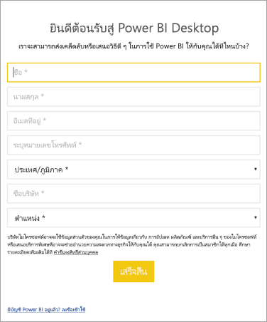

# <a name="administrators-manage-the-power-bi-desktop-sign-in-form"></a><span data-ttu-id="13450-103">ผู้ดูแลระบบ: จัดการแบบฟอร์มการลงชื่อเข้าใช้ Power BI Desktop</span><span class="sxs-lookup"><span data-stu-id="13450-103">Administrators: Manage the Power BI Desktop sign-in form</span></span>
<span data-ttu-id="13450-104">ในครั้งแรกที่ Power BI Desktop เปิดตัว แบบฟอร์มการลงชื่อเข้าใช้จะปรากฏขึ้น</span><span class="sxs-lookup"><span data-stu-id="13450-104">The first time Power BI Desktop is launched, a sign-in form is displayed.</span></span> <span data-ttu-id="13450-105">สามารถกรอกข้อมูล หรือลงชื่อเข้าใช้ Power BI เพื่อดำเนินการต่อได้</span><span class="sxs-lookup"><span data-stu-id="13450-105">Information can be filled in, or sign in to Power BI to continue.</span></span> <span data-ttu-id="13450-106">ผู้ดูแลระบบจัดการแบบฟอร์มนี้โดยใช้รีจิสทรีคีย์</span><span class="sxs-lookup"><span data-stu-id="13450-106">Administrators manage this form by using a registry key.</span></span> 



<span data-ttu-id="13450-108">ผู้ดูแลระบบใช้รีจิสทรีคีย์ต่อไปนี้เพื่อปิดการใช้งานแบบฟอร์มลงชื่อเข้าใช้</span><span class="sxs-lookup"><span data-stu-id="13450-108">Administrators use the following registry key to disable the sign-in form.</span></span> <span data-ttu-id="13450-109">ซึ่งยังสามารถใช้กับทั้งองค์กรโดยใช้นโยบายส่วนกลาง</span><span class="sxs-lookup"><span data-stu-id="13450-109">This can also be pushed to an entire organization by using global policies.</span></span>

```
Key: HKEY_CURRENT_USER\SOFTWARE\Policies\Microsoft\Microsoft Power BI Desktop
valueName: ShowLeadGenDialog
```
<span data-ttu-id="13450-110">คุณยังสามารถลองใช้คีย์ต่อไปนี้ซึ่งสามารถทำงานได้ดีกับลูกค้าบางรายตามการกำหนดค่าของพวกเขา:</span><span class="sxs-lookup"><span data-stu-id="13450-110">You can also try the following key, which has been successful for some customers based on their configurations:</span></span>

```
Key: HKEY_CURRENT_USER\SOFTWARE\Microsoft\Microsoft Power BI Desktop
valueName: ShowLeadGenDialog
```

<span data-ttu-id="13450-111">ค่าของ 0 จะปิดการใช้งานกล่องโต้ตอบ</span><span class="sxs-lookup"><span data-stu-id="13450-111">A value of 0 will disable the dialog.</span></span>


<span data-ttu-id="13450-112">มีคำถามเพิ่มเติมหรือไม่</span><span class="sxs-lookup"><span data-stu-id="13450-112">More questions?</span></span> [<span data-ttu-id="13450-113">ลองถามชุมชน Power BI</span><span class="sxs-lookup"><span data-stu-id="13450-113">Try asking the Power BI Community</span></span>](https://community.powerbi.com/)

