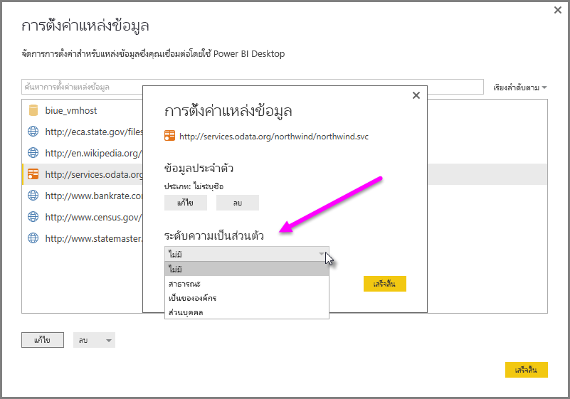

# ระดับความเป็นส่วนตัวของ Power BI DesktopPower BI Desktop privacy levels
ใน **Power BI Desktop** ระดับความเป็นส่วนตัวระบุระดับการแยกที่กำหนดระดับ ซึ่งแหล่งข้อมูลหนึ่งจะถูกแยกจากแหล่งข้อมูลอื่น ๆIn **Power BI Desktop**, privacy levels specify an isolation level that defines the degree that one data source will be isolated from other data sources. แม้ว่าระดับการแยกแบบเข้มงวด จะป้องกันข้อมูลจากการแลกเปลี่ยนระหว่างแหล่งข้อมูล แต่อาจลดทำงานและมีผลกระทบกับประสิทธิภาพAlthough a restrictive isolation level blocks information from being exchanged between data sources, it may reduce functionality and impact performance.

การตั้งค่า **ระดับความเป็นส่วนตัว** พบใน **ไฟล์ > ตัวเลือกและการตั้งค่า > ตัวเลือก** แล้ว **ไฟล์ปัจจุบัน > ความเป็นส่วนตัว** กำหนดว่าจะใช้ Power BI Desktop การตั้งค่าระดับความเป็นส่วนตัวขณะรวมข้อมูลหรือไม่The **Privacy Levels** setting, found in **File > Options and settings > Options** and then **Current File > Privacy** determines whether Power BI Desktop uses your Privacy Level settings while combining data. กล่องโต้ตอบนี้ลิงก์ไปยังเอกสาร Power BI Desktop ที่เกี่ยวกับระดับความเป็นส่วนตัวและระดับความเป็นส่วนตัว (บทความนี้)This dialog includes a link to Power BI Desktop documentation about Privacy Levels and Privacy Levels (this article).

## ตั้งค่าระดับความเป็นส่วนตัวConfigure a privacy level
ด้วยการตั้งค่าระดับความเป็นส่วนตัว คุณสามารถระบุระดับการแยกที่กำหนดระดับ ซึ่งแหล่งข้อมูลหนึ่งจะถูกแยกจากแหล่งข้อมูลอื่น ๆWith privacy level settings, you can specify an isolation level that defines the degree that one data source must be isolated from other data sources.

| การตั้งค่าSetting | คำอธิบายDescription | แหล่งข้อมูลตัวอย่างExample Data Sources |
| --- | --- | --- |
| **แหล่งข้อมูลส่วนตัว****Private data source** |แหล่งข้อมูล **ส่วนตัว** ประกอบด้วยข้อมูลที่สำคัญหรือเป็นความลับ และการมองเห็นของแหล่งข้อมูลอาจถูกจำกัดให้ผู้ใช้ที่ได้รับอนุญาตA **Private** data source contains sensitive or confidential information, and the visibility of the data source may be restricted to authorized users. แหล่งข้อมูลส่วนตัวถูกแยกจากกันโดยสิ้นเชิงจากแหล่งข้อมูลอื่น ๆA private data source is completely isolated from other data sources. |ข้อมูล Facebook ไฟล์ข้อความที่ประกอบด้วยการให้หุ้นเป็นรางวัล หรือเวิร์กบุ๊กที่ประกอบด้วยพนักงานตรวจทานข้อมูลFacebook data, a text file containing stock awards, or a workbook containing employee review information. |
| **แหล่งข้อมูลขององค์กร****Organizational  data source** |แหล่งข้อมูล **องค์กร** จำกัดการมองเห็นของแหล่งข้อมูลให้กับกลุ่มบุคคลที่เชื่อถือได้An **Organizational** data source limits the visibility of a data source to a trusted group of people. แหล่งข้อมูล **องค์กร** ถูกแยกออกจากแหล่งข้อมูล **สาธารณะ** ทั้งหมด แต่สามารถมองเห็นแหล่งข้อมูล **องค์กร** อื่นได้An **Organizational** data source is isolated from all **Public** data sources, but is visible to other **Organizational** data sources. |เอกสาร **Microsoft Word** อินทราเน็ตไซต์ SharePoint ที่มีการอนุญาตนั้นเปิดให้กลุ่มบุคคลที่เชื่อถือได้A **Microsoft Word** document on an intranet SharePoint site with permissions enabled for a trusted group. |
| **แหล่งข้อมูลสาธารณะ****Public data source** |แหล่งข้อมูล **สาธารณะ** อนุญาตให้ทุกคนมองเห็นข้อมูลมีอยู่ในแหล่งข้อมูลนี้ได้A **Public** data source gives everyone visibility to the data contained in the data source. เฉพาะไฟล์ แหล่งข้อมูลในอินเทอร์เน็ต หรือข้อมูลในเวิร์กบุ๊กสามารถถูกทำเครื่องหมายให้เป็น **สาธารณะ** ได้Only files, internet data sources, or workbook data can be marked **Public**. |ข้อมูลฟรีจาก Microsoft Azure Marketplace ข้อมูลจากหน้า Wikipedia หรือไฟล์ภายในเครื่องที่ประกอบด้วยข้อมูลที่คัดลอกจากเว็บไซต์สาธารณะFree data from the Microsoft Azure Marketplace, data from a Wikipedia page, or a local file containing data copied from a public web page. |

## กำหนดการตั้งค่าระดับความเป็นส่วนตัวConfigure privacy level settings
กล่องโต้ตอบการตั้งค่า **ความเป็นส่วนตัว** สำหรับแต่ละแหล่งข้อมูลใน **ไฟล์ > ตัวเลือกและการตั้งค่า > การตั้งค่าแหล่งข้อมูล**The **Privacy** settings dialog for each data source is found in **File > Options and settings > Data source settings**.

เพื่อกำหนดค่าระดับความเป็นส่วนตัวแหล่งข้อมูล เลือกแหล่งข้อมูล จากนั้นเลือก **แก้ไข**To configure a data source privacy level, select the data source, then select **Edit**. กล่องโต้ตอบ **การตั้งค่าแหล่งข้อมูล** ปรากฏขึ้น ซึ่งคุณสามารถเลือกระดับความเป็นส่วนตัวที่เหมาะสมจากเมนูดรอปดาวน์ที่ด้านล่างของกล่องโต้ตอบ ดังที่แสดงในรูปต่อไปนี้The **Data Source Settings** dialog appears, from which you can select the appropriate privacy level from the drop-down menu at the bottom of the dialog, as shown in the following image.

> [!CAUTION]
> คุณควรกำหนดค่าแหล่งข้อมูลที่ประกอบด้วยข้อมูลที่สำคัญ หรือเป็นความลับสูงเป็น **ส่วนตัว**You should configure a data source containing highly sensitive or confidential data as **Private**.
> 

## กำหนดค่าระดับความเป็นส่วนตัวConfigure Privacy Levels
มีการตั้งค่า **ระดับความเป็นส่วนตัว** เป็น **รวมข้อมูลตามการตั้งค่าระดับความเป็นส่วนตัวของคุณสำหรับแต่ละแหล่ง** ตามค่าเริ่มต้น ซึ่งหมายความว่ามีการบังคับใช้ **ระดับความเป็นส่วนตัว****Privacy Levels** is set to **Combine data according to your Privacy Level settings for each source** by default, which means that **Privacy Levels** are enforced.

| การตั้งค่าSetting | คำอธิบายDescription |
| --- | --- |
| **รวมข้อมูลตามการตั้งค่าระดับความเป็นส่วนตัวของคุณสำหรับแต่ละแหล่ง**(และการตั้งค่าเริ่มต้น)**Combine data according to your Privacy Level settings for each source** (on, and the default setting) |ตั้งค่าระดับความเป็นส่วนตัวจะใช้เพื่อกำหนดระดับการแยกระหว่างแหล่งข้อมูลเมื่อมีการรวมข้อมูลPrivacy level settings are used to determine the level of isolation between data sources when combining data. |
| **ละเว้นระดับความเป็นส่วนตัวและปรับปรุงการทำงานอย่างมีประสิทธิภาพ** (ปิด)**Ignore the Privacy levels and potentially improve performance** (off) |ระดับความเป็นส่วนจะคิดเมื่อรวมข้อมูล อย่างไรก็ตามประสิทธิและการทำงานของข้อมูลอาจเพิ่มPrivacy levels are not considered when combining data, however, performance and functionality of the data may increase. |

> **หมายเหตุด้านความปลอดภัย:** การเลือก **ละเว้นระดับความเป็นส่วนตัว และอาจปรับปรุงประสิทธิภาพการทำงาน** ในกล่องโต้ตอบ **ระดับความเป็นส่วนตัว** อาจเปิดเผยข้อมูลที่สำคัญ หรือที่เป็นความลับกับบุคคลที่ไม่ได้รับอนุญาต**Security Note:** Selecting **Ignore the Privacy levels and potentially improve performance** in the **Privacy Levels** dialog could expose sensitive or confidential data to an unauthorized person. อย่า *ปิด* การตั้งค่านี้จนกว่าคุณจะมั่นใจได้ว่า แหล่งข้อมูลนั้นไม่ประกอบไปด้วยข้อมูลที่สำคัญหรือเป็นความลับDo not turn this setting to *off* unless you are confident that the data source does not contain sensitive or confidential data.
> 
> 

> [!CAUTION]
> การ **ละเว้นระดับความเป็นส่วนตัวและปรับปรุงการทำงานอย่างมีประสิทธิภาพ** ใช้ไม่ได้กับ Power BI serviceThe **Ignore the Privacy levels and potentially improve performance** does not work in the Power BI service. ด้วยเช่นนั้น รายงาน Power BI Desktop กับการตั้งค่าเปิดใช้งานที่ถูกเผยแพร่ไปยัง Power BI service นี้ *ไม่* สะท้อนลักษณะการทำงานเมื่อถูกใช้ใน serviceAs such, Power BI Desktop reports with this setting enabled, which are then published to the Power BI service, do *not* reflect this behavior when used in the service.
> 

**กำหนดค่าระดับความเป็นส่วนตัว****Configure Privacy Levels**

ใน Power BI Desktop หรือในตัวแก้ไขคิวรี เลือก **ไฟล์ > ตัวเลือกและการตั้งค่า > ตัวเลือก** แล้วเลือก **ไฟล์ปัจจุบัน > ความเป็นส่วนตัว**In Power BI Desktop or in Query Editor, select **File > Options and settings > Options** and then **Current File > Privacy**.

a.a. เมื่อ **รวมข้อมูลตามการตั้งค่าระดับความเป็นส่วนตัวสำหรับแต่ละแหล่งของคุณ** ถูกเลือกอยู่ จะรวมข้อมูลตามการตั้งค่าระดับความเป็นส่วนตัวของคุณWhen **Combine data according to your Privacy Level settings for each source** is selected, data will be combined according to your Privacy Levels setting. ผสานข้อมูลข้ามเขตความเป็นส่วนตัวแบบแยกต่างหากจะส่งผลให้กำหนดบัฟเฟอร์ข้อมูลบางตัวMerging data across Privacy isolation zones will result in some data buffering.

b.b. เมื่อ **ละเว้นระดับความเป็นส่วนตัวและปรับปรุงการทำงานอย่างมีประสิทธิภาพ** ถูกเลือกอยู่ ข้อมูลจะถูกรวมโดยไม่คำนึงถึงระดับความเป็นส่วนตัวของคุณ ซึ่งไม่สามารถเปิดเผยข้อมูลที่สำคัญ หรือเป็นความลับให้กับผู้ใช้ไม่ได้รับอนุญาตWhen **Ignore the Privacy levels and potentially improve performance** is selected, the data will be combined ignoring your Privacy Levels which could reveal sensitive or confidential data to an unauthorized user. การตั้งค่าอาจปรับปรุงประสิทธิภาพและการทำงานThe setting may improve performance and functionality.

> **หมายเหตุด้านความปลอดภัย:** การเลือก **ละเว้นระดับความเป็นส่วนตัว และการปรับปรุงประสิทธิภาพการทำงาน** อาจปรับปรุงประสิทธิภาพการทำงาน อย่างไรก็ตาม Power BI Desktop ไม่สามารถรับรองความเป็นส่วนตัวของข้อมูลที่ผสานลงในไฟล์ Power BI Desktop ได้**Security Note:** Selecting **Ignore the Privacy levels and potentially improve performance** may improve performance; however, Power BI Desktop cannot ensure the privacy of data merged into the Power BI Desktop file.
> 
> 

