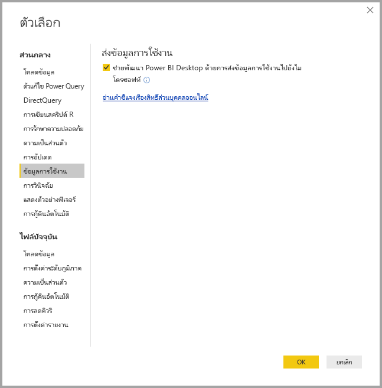
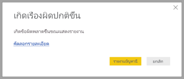

# ระดับความเป็นส่วนตัวของ Power BI DesktopPower BI Desktop Privacy

ที่ Microsoft เราทำงานอย่างหนักเพื่อปกป้องความเป็นส่วนตัวของคุณขณะกำลังแสดงผลิตภัณฑ์ที่ให้คุณมีประสิทธิภาพการทำงาน ความสามารถ และความสะดวกที่คุณต้อง การAt Microsoft, we work hard to protect your privacy while delivering products that bring you the performance, power, and convenience you want. Microsoft รวบรวมข้อมูลบางอย่างเกี่ยวกับการใช้งาน Power BI Desktop ของคุณเพื่อช่วยในการวินิจฉัยปัญหา และการปรับปรุงผลิตภัณฑ์Microsoft collects certain information about your usage of Power BI Desktop to help diagnose problems and improve the product. สำหรับรายละเอียดเพิ่มเติมเกี่ยวกับแนวทางปฏิบัติความเป็นส่วนตัวของ Microsoft โปรดตรวจทานคำชี้แจงสิทธิ์ส่วนบุคคลของ MicrosoftFor more details about Microsoft’s privacy practices, please review the Microsoft Privacy Statement. ซึ่งมันถูกนำไปใช้กับข้อมูลเราเก็บรวบรวมจากการใช้งาน **Power BI Desktop**It applies to the data we collect from your use of **Power BI Desktop**.
 
ข้อมูลที่เราเก็บรวบรวมจากผู้ใช้ **Power BI Desktop** สามารถรวมข้อมูลบนระบบปฏิบัติการ ข้อมูล Power BI Desktop และ รุ่นของ Internet Explorer ได้The information we collect from **Power BI Desktop** users can include data on the operating system, Power BI Desktop information, and Internet Explorer versions. 
 
ถ้าคุณต้องการปฏิเสธเข้าร่วมการรวบรวมข้อมูลนี้ คุณสามารถไปที่ **ไฟล์ > ตัวเลือกและการตั้งค่า > ตัวเลือก** และคง **ข้อมูลการใช้งาน** แท็บ ยกเลิกเลือก **ส่งข้อมูลการใช้งาน** กล่องกาเครื่องหมาย ดังที่แสดงในรูปต่อไปนี้If you want to opt out of this data collection, you can go to **File > Options and Settings > Options**, and on the **Usage Data** tab, uncheck the **Send Usage Data** check box, as shown in the following image.

## ส่งข้อมูลเพิ่มเติมSending additional information

ถ้าคุณพบปัญหาการหยุดทำงาน หรือปัญหาอื่น ๆ คุณสามารถเลือกที่จะส่งรายงานข้อผิดพลาด และข้อมูลเพิ่มเติมที่อาจช่วยให้เราแก้ไขปัญหาในรุ่นต่อ ๆ ไปในอนาคตได้If you encounter crashes or other issues, you can choose to send error reports and additional information that may help us fix the problem in a future release. เรายังรวบรวมข้อมูลเกี่ยวกับสถานะของการ **Power BI Desktop** ไฟล์ที่คุณกำลังทำงานอยู่ เช่น ตำแหน่งที่ตั้งของเอกสาร คุณลักษณะตัวอย่างที่จะเปิดใช้งาน และโหมดที่เก็บWe also collect information about the state of the **Power BI Desktop** file you were working on such as document locale, preview features that are enabled, and storage mode. ซึ่งสามารถรวมภาพถ่ายหน้าจอ ข้อความข้อผิดพลาด และสูตรจากแบบจำลองของคุณThis can include screenshots, error messages, and formulas from your model. รายการเหล่านี้อาจรวมถึงเนื้อหาของไฟล์ที่คุณกำลังใช้อยู่เมื่อเกิดข้อผิดพลาด ดังนั้นคุณควรตรวจทานก่อนที่ส่งThese items may include the contents of files you were using when an error occurred, so you should review them before sending. เราแจ้งเตือนคุณก่อนที่จะส่ง ซึ่งคุณสามารถเลือกข้อมูลที่จะส่งไปยัง MicrosoftWe remind you before sending that you can choose which information is sent to Microsoft.  
 
ถ้าคุณไม่ต้องการส่งข้อมูลนี้ คุณสามารถคลิก **ปิด** เมื่อมีข้อผิดพลาดเกิดขึ้น หรือปฏิเสธการส่งข้อมูลการใช้งานตามที่อธิบายไว้ข้างต้นได้If you don’t want to send this information, you can click **Close** when an error occurs, or opt out of sending usage data as explained above.

