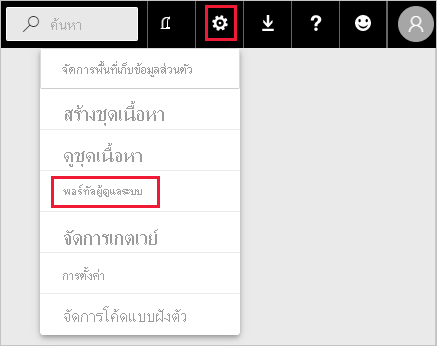
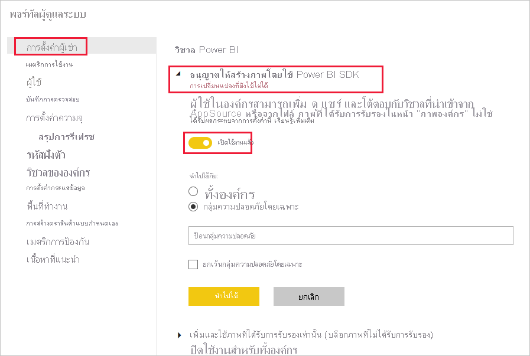
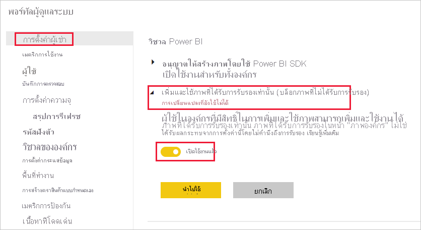
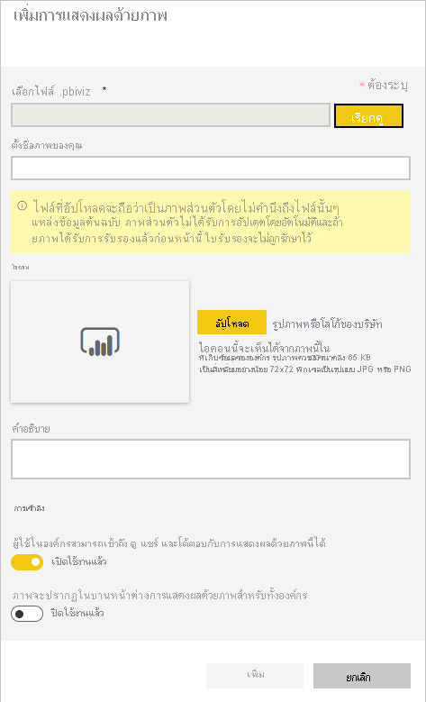
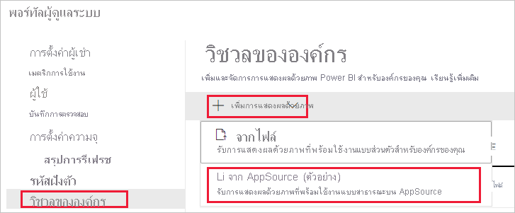
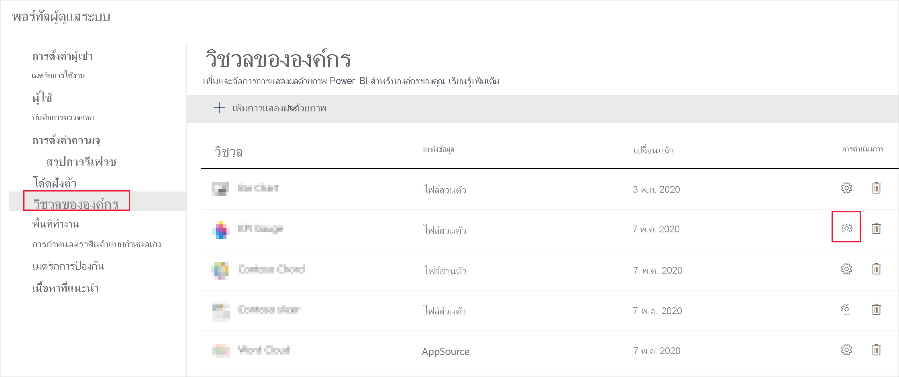
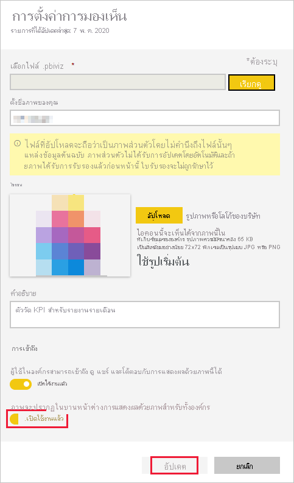

# จัดการการตั้งค่าผู้ดูแลระบบวิชวล Power BIManage Power BI visuals admin settings

ในฐานะผู้ดูแลระบบ Power BI สำหรับองค์กรของคุณคุณสามารถควบคุมชนิดของวิชวล Power BI ที่ผู้ใช้สามารถเข้าถึงได้ทั่วทั้งองค์กรAs a Power BI admin for your organization, you can control which type of Power BI visuals users can access across the organization.

ในการจัดการวิชวล Power BI คุณต้องเป็นผู้ดูแลระบบส่วนกลางใน Office 365 หรือได้รับมอบหมายบทบาทผู้ดูแลระบบบริการของ Power BITo manage Power BI visuals, you must be a Global Admin in Office 365, or have been assigned the Power BI service administrator role. โปรดดูที่[การทำความเข้าใจเกี่ยวกับบทบาทผู้ดูแลระบบ Power BI](service-admin-role.md)เพื่อศึกษาข้อมูลเพิ่มเติมเกี่ยวกับบทบาทผู้ดูแลระบบบริการ Power BIFor more information about the Power BI service administrator role, see [Understanding the Power BI admin role](service-admin-role.md).

## เข้าถึงพอร์ทัลผู้ดูแลระบบAccess the admin portal

เมื่อต้องการเปิดใช้งานการตั้งค่าที่อธิบายไว้ในบทความคุณจะต้องเข้าถึงพอร์ทัลผู้ดูแลระบบTo enable the settings described in the article, you'll need to access the admin portal.

1. ในบริการของ Power BI เลือก **การตั้งค่า**In Power BI service, select **Settings**.

2. จากเมนูดรอปดาวน์การตั้งค่าเลือก **พอร์ทัลผู้ดูแลระบบ**From the settings drop-down menu, select **Admin portal**.

    

## การตั้งค่าผู้เช่าวิชวล Power BIPower BI visuals tenant settings

ในฐานะผู้ดูแลระบบ Power BI สำหรับองค์กรของคุณคุณสามารถควบคุมชนิดของวิชวล Power BI ที่ผู้ใช้สามารถเข้าถึงได้ทั่วทั้งองค์กรAs a Power BI admin for your organization, you can control which type of Power BI visuals users will be able to access across the organization.

การตั้งค่าผู้เช่า UI มีผลต่อบริการของ Power BI เท่านั้นThe UI tenant settings only affect Power BI service. ถ้าคุณต้องการให้การตั้งค่าเหล่านี้มีผลใน Power BI Desktop ให้ใช้นโยบายกลุ่มIf you want these settings to take effect in Power BI Desktop, use group policies. ตารางในตอนท้ายของแต่ละส่วนจะแสดงรายละเอียดสำหรับการเปิดใช้งานการตั้งค่าใน Power BI DesktopA table at the end of each section provides details for enabling the setting in Power BI Desktop.

>[!NOTE]
>การเปลี่ยนแปลงการตั้งค่าผู้เช่าไม่มีผลกับวิชวล Power BI ที่แสดงอยู่ในแท็บ [วิชวลขององค์กร](#organizational-visuals)Changes to tenant settings do not affect Power BI visuals listed in the [organizational visuals](#organizational-visuals) tab.

### วิชวลจาก AppSource หรือจากไฟล์Visuals from AppSource or a file

จัดการการเข้าถึงองค์กรสำหรับวิชวล Power BI ประเภทต่อไปนี้:Manage organizational access for the following type of Power BI visuals:

* วิชวลที่สร้างขึ้นโดยนักพัฒนาและบันทึกเป็นไฟล์ .pbivizVisuals created by developers and saved as a .pbiviz file.

* วิชวลที่พร้อมใช้งานจาก AppSourceVisuals available from AppSource.

ทำตามคำแนะนำด้านล่างเพื่อเปิดใช้งานผู้ใช้ในองค์กรของคุณให้สามารถอัปโหลดไฟล์ .pbiviz และเพิ่มภาพจาก AppSource ไปยังรายงานและแดชบอร์ดของพวกเขาFollow the instructions below to enable users in your organization upload .pbiviz files, and add visuals from AppSource to their reports and dashboards.

1. ขยายการตั้งค่าส่วน **การอนุญาตให้สร้างวิชวลโดยใช้ Power BI SDK**Expand the **Allow visuals created using the Power BI SDK** settings.

2. คลิก **เปิดใช้งาน**Click **Enabled**.

3. เลือกว่าใครสามารถอัปโหลด .pbiviz และ AppSource ได้:Choose who can upload .pbiviz and AppSource visuals:

    * เลือกตัวเลือก **ทั้งองค์กร** เพื่ออนุญาตให้ทุกคนในองค์กรของคุณอัปโหลดไฟล์ .pbiviz และเพิ่มวิชวลจาก AppSourceSelect **The entire organization** option to allow everyone in your organization to upload .pbiviz files, and add visuals from AppSource.

     * เลือกตัวเลือก **เฉพาะกลุ่มความปลอดภัย** เพื่อจัดการการอัปโหลดไฟล์ .pbiviz และการเพิ่มวิชวลจาก AppSource โดยใช้กลุ่มความปลอดภัยSelect the **Specific security groups** option to manage uploading .pbiviz files, and adding visuals from AppSource using security groups. เพิ่มกลุ่มความปลอดภัยที่คุณต้องการจัดการไปยังแถบข้อความ *ใส่กลุ่มความปลอดภัย*Add the security groups you want to manage to the *Enter security groups* text bar. กลุ่มความปลอดภัยที่คุณระบุจะถูกแยกออกตามค่าเริ่มต้นThe security groups you specified are excluded by default. ถ้าคุณต้องการรวมกลุ่มความปลอดภัยเหล่านี้และแยกบุคคลอื่นในองค์กรออกให้เลือกตัวเลือก **ยกเว้นกลุ่มความปลอดภัยที่เฉพาะเจาะจง**If you want to include these security groups and exclude everyone else in the organization, select the **Except specific security groups** option.

4. คลิก **ใช้**Click **Apply**.

การเปลี่ยนแปลง UI ไปยังการตั้งค่าผู้เช่าใช้เฉพาะกับบริการของ Power BI เท่านั้นUI changes to tenant settings apply only to Power BI service. เมื่อต้องการเปิดใช้งานผู้ใช้ในองค์กรในการอัปโหลดไฟล์ .pbiviz และเพิ่มวิชวลจาก AppSource ไปยังบานหน้าต่างการแสดงภาพของพวกเขาใน Power BI Desktop ให้ใช้ [Azure AD นโยบายกลุ่ม](/azure/active-directory-domain-services/manage-group-policy)To enable users in your organization upload .pbiviz files, and add visuals from AppSource to their visualization pane in  Power BI Desktop, use [Azure AD Group Policy](/azure/active-directory-domain-services/manage-group-policy).

|คีย์Key  |ชื่อค่าValue name  |ค่าValue  |
|---------|---------|---------|
|Software\Policies\Microsoft\Power BI DesktopSoftware\Policies\Microsoft\Power BI Desktop\    |EnableCustomVisualsEnableCustomVisuals    |0 - ปิดการใช้งาน0 - Disable  1 - เปิดใช้งาน (ค่าเริ่มต้น)1 - Enable (default)         |
|

### ส่วนจัดแสดง Power BI ที่ผ่านการรับรองCertified Power BI visuals

เมื่อเปิดใช้งานการตั้งค่านี้เฉพาะ [วิชวล Power BI ที่ผ่านการรับรอง](../developer/visuals/power-bi-custom-visuals-certified.md) เท่านั้นที่จะแสดงในรายงานและแดชบอร์ดขององค์กรของคุณWhen this setting is enabled, only [certified Power BI visuals](../developer/visuals/power-bi-custom-visuals-certified.md) will render in your organization's reports and dashboards. วิชวล Power BI จาก AppSource หรือไฟล์ที่ไม่ผ่านการรับรองจะส่งกลับข้อความข้อผิดพลาดPower BI visuals from AppSource or files, that are not certified, will return an error message.

1. จากพอร์ทัลผู้ดูแลระบบให้เลือก **เพิ่มและใช้วิชวลที่ผ่านการรับรองเท่านั้น**From the admin portal, select **Add and use certified visuals only**.

2. คลิก **เปิดใช้งาน**Click **Enabled**.

3. คลิก **ใช้**Click **Apply**.

การเปลี่ยนแปลง UI ไปยังการตั้งค่าผู้เช่าใช้เฉพาะกับบริการของ Power BI เท่านั้นUI changes to tenant settings apply only to Power BI service. หากต้องการจัดการการตั้งค่าผู้เช่าวิชวลที่่ผ่านการรับรองใน Power BI Desktop ให้ใช้ [นโยบายกลุ่ม Azure AD](/azure/active-directory-domain-services/manage-group-policy)To manage the certified visuals tenant setting in Power BI Desktop, use [Azure AD Group Policy](/azure/active-directory-domain-services/manage-group-policy).

|คีย์Key  |ชื่อค่าValue name  |ค่าValue  |
|---------|---------|---------|
|Software\Policies\Microsoft\Power BI DesktopSoftware\Policies\Microsoft\Power BI Desktop\    |EnableUncertifiedVisualsEnableUncertifiedVisuals    |0 - ปิดการใช้งาน0 - Disable  1 - เปิดใช้งาน (ค่าเริ่มต้น)1 - Enable (default)         |
|

## การแสดงผลด้วยภาพขององค์กรOrganizational visuals

ในฐานะผู้ดูแลระบบ Power BI คุณสามารถจัดการรายการของวิชวล Power BI ที่พร้อมใช้งานขององค์กรใน [ที่จัดเก็บขององค์กรของคุณ](../developer/visuals/power-bi-custom-visuals.md#organizational-store)As a Power BI admin, you can manage the list of Power BI visuals available in your organization's [organizational store](../developer/visuals/power-bi-custom-visuals.md#organizational-store). แท็บ **วิชวลขององค์กร** ใน *พอร์ทัลของผู้ดูแลระบบ* จะช่วยให้คุณเพิ่มและเอาวิชวลออก และตัดสินใจว่าจะแสดงวิชวลใดในบานหน้าต่างการแสดงภาพของผู้ใช้ในองค์กรโดยอัตโนมัติThe **Organizational visuals** tab in the *Admin portal*, allows you to add and remove visuals, and decide which visuals will automatically display in the visualization pane of your organization's users. คุณสามารถเพิ่มรายการแสดงผลด้วยวิชวลชนิดใดก็ได้รวมถึงวิชวลที่ไม่ได้ผ่านการรับรองและวิชวล .pbiviz แม้ว่าพวกนี้จะขัดแย้งกับ [การตั้งค่าผู้เช่า](#power-bi-visuals-tenant-settings) ขององค์กรของคุณYou can add to the list any type of visual including uncertified visuals and .pbiviz visuals, even if they contradict the [tenant settings](#power-bi-visuals-tenant-settings) of your organization.

การตั้งค่าวิชวลองค์กรจะถูกปรับใช้เป็น Power BI Desktop โดยอัตโนมัติOrganizational visuals settings are automatically deployed to Power BI Desktop.

>[!NOTE]
>วิชวลขององค์กรไม่ได้รับการสนับสนุนในเซิร์ฟเวอร์รายงาน Power BIOrganizational visuals are not supported in Power BI Report Server.

### นำเข้าวิชวลจากไฟล์Add a visual from a file

ใช้วิธีนี้เพื่อเพิ่มวิชวล Power BI ใหม่จากไฟล์ .pbivizUse this method to add a new Power BI visual from a .pbiviz file.

> [!WARNING]
> วิชวล Power BI ที่อัปโหลดมาจากไฟล์อาจประกอบด้วยโค้ดที่มีความเสี่ยงด้านความปลอดภัยหรือความเป็นส่วนตัว ตรวจสอบให้แน่ใจว่าคุณเชื่อถือผู้เขียนและแหล่งที่มาของวิชวล ก่อนที่จะปรับใช้กับที่เก็บข้อมูลขององค์กรA Power BI visual uploaded from a file, could contain code with security or privacy risks; make sure you trust the author and the source of the visual, before deploying to the organization's repository.

1. เลือก **เพิ่มวิชวล** > **จากไฟล์**Select **Add visual** > **From a file**.

    

2. กรอกข้อมูลในเขตข้อมูลต่อไปนี้:Fill in the following fields:

    * **เลือกไฟล์ .pbiviz** - เลือกไฟล์วิชวลเพื่ออัปโหลด**Choose a .pbiviz file** - Select a visual file to upload.

    * **ตั้งชื่อวิชวลของคุณ** - กำหนดชื่อย่อให้กับวิชวลเพื่อให้ผู้เขียนรายงานสามารถเข้าใจได้อย่างง่ายดาย**Name your visual** - Give a short title to the visual, so that report authors can easily understand what it does.

    * **ไอคอน** - อัปโหลดไฟล์ไอคอนที่จะแสดงในบานหน้าต่างการแสดงภาพ**Icon** - Upload an icon file to be displayed in the visualization pane.

    * **คำอธิบาย** - กำหนดคำอธิบายสั้น ๆ ของวิชวลเพื่อให้บริบทแก่ผู้ใช้**Description** - Provide a short description of the visual to give more context for the user.

    * **Access** - ส่วนนี้มีสองตัวเลือก:**Access** - This section has two options:
    
        * เลือกว่าผู้ใช้ในองค์กรของคุณสามารถเข้าถึงวิชวลนี้ได้หรือไม่Select whether users in your organization can access this visual. การตั้งค่านี้จะเปิดใช้งานตามค่าเริ่มต้นThis setting is enabled by default.

        * เลือกว่าวิชวลนี้จะปรากฏในบานหน้าต่างการแสดงภาพของผู้ใช้ในองค์กรของคุณหรือไม่Select whether this visual will appear in the visualization pane of the users in your organization. การตั้งค่านี้จะถูกปิดการใช้งานตามค่าเริ่มต้นThis setting is disabled by default. สำหรับข้อมูลเพิ่มเติมให้ดู [เพิ่มวิชวลลงในบานหน้าต่างการแสดงภาพ](#add-a-visual-to-the-visualization-pane).For more information, see [add a visual to the visualization pane](#add-a-visual-to-the-visualization-pane).

    

3. เลือก **เพิ่ม** เพื่อเริ่มคำขอการอัปโหลดTo initiate the upload request, select **Add** . เมื่ออัปโหลด วิชวลจะแสดงในรายการวิชวลองค์กรOnce uploaded, the visual will display in the organizational visuals list.

### เพิ่มวิชวลจาก AppSourceAdd a visual from AppSource

ใช้วิธีนี้เพื่อเพิ่มวิชวล Power BI ใหม่จาก AppSourceUse this method to add a new Power BI visual from AppSource.

วิชวล Power BI ของ AppSource จะได้รับการอัปเดตโดยอัตโนมัติAppSource Power BI visuals are automatically updated. ผู้ใช้ในองค์กรของคุณจะมีวิชวลเวอร์ชันล่าสุดเสมอUsers in your organization will always have the latest version of the visual.

1. เลือก **เพิ่มวิชวล** > **จาก AppSource**Select **Add visual** > **From AppSource**.

    

2. ในหน้าต่าง **Power BI** ให้ค้นหาวิชวลของ AppSource ที่คุณต้องการเพิ่มแล้วคลิก **เพิ่ม**In the **Power BI visuals** window, find the AppSource visual you want to add, and click **Add**. เมื่ออัปโหลด วิชวลจะแสดงในรายการวิชวลองค์กรOnce uploaded, the visual will display in the organizational visuals list.

### เพิ่มวิชวลไปยังบานหน้าต่างการแสดงภาพAdd a visual to the visualization pane

คุณสามารถเลือกวิชวลจากหน้าวิชวลองค์กรเพื่อแสดงในบานหน้าต่างการแสดงภาพของผู้ใช้ทั้งหมดในองค์กรของคุณโดยอัตโนมัติYou can pick visuals from the organizational visuals page to automatically show on the visualization pane of all the users in your organization.

1. ในแถวของวิชวลที่คุณต้องการเพิ่มให้คลิก **การตั้งค่า**In the row of the visual you want to add , click **settings**.

    บานหน้าต่าง - องค์กรorganizational-pane

2. เปิดใช้งานการตั้งค่าบานหน้าต่างการแสดงภาพแล้วคลิก **อัปเดต**Enable the visualization pane setting and click **Update**.

    

### ลบวิชวลที่อัปโหลดจากไฟล์Delete a visual uploaded from a file

หากต้องการลบวิชวลโดยถาวร ให้เลือกไอคอนถังขยะสำหรับวิชวลในที่เก็บข้อมูลTo permanently delete a visual, select the trash bin icon for the visual in the repository.

> [!IMPORTANT]
> การลบจะไม่สามารถแก้ไขย้อนกลับได้Deletion is irreversible. เมื่อถูกลบ ภาพจะหยุดแสดงผลในรายงานที่มีอยู่ทันทีOnce deleted, the visual immediately stops rendering in existing reports. แม้ว่าคุณจะอัปโหลดวิชวลเดิมอีกครั้ง ก็จะไม่สามารถแทนที่วิชวลก่อนหน้านี้ที่ถูกลบได้Even if you upload the same visual again, it won't replace the one that was deleted. อย่างไรก็ตาม ผู้ใช้สามารถนำเข้าวิชวลใหม่อีกครั้ง และแทนที่อินสแตนซ์ที่มีในรายงานHowever, users can import the new visual again and replace the instance they have in their reports.

### ปิดการใช้งานวิชวล .pbivizDisable a .pbiviz visual

คุณสามารถปิดการใช้งานวิชวล .pbiviz จากที่มีอยู่โดยผ่าน [ที่จัดเก็บขององค์กร](../developer/visuals/power-bi-custom-visuals.md#organizational-store) ในขณะที่ทำการเก็บไว้ในรายการวิชวลองค์กรYou can disable a .pbiviz visual from being available trough the [organizational store](../developer/visuals/power-bi-custom-visuals.md#organizational-store), while keeping it on the organizational visuals list.

1. ในแถวของวิชวล .pbiviz ที่คุณต้องการปิดการใช้งานให้คลิก **การตั้งค่า**In the row of the .pbiviz visual you want to disable , click **settings**.

2. ในส่วน **เข้าถึง** ปิดการใช้งานการตั้งค่า: *ผู้ใช้ในองค์กรสามารถเข้าถึง ดู แชร์ และโต้ตอบกับวิชวลนี้ได้*In the **Access** section, disable the setting: *Users in the organization can access, view, share, and interact with this visual*.

หลังจากที่คุณปิดการใช้งานวิชวล .pbiviz ภาพจะไม่แสดงในรายงานที่มีอยู่ และจะแสดงข้อผิดพลาดดังต่อไปนี้:After you disable the .pbiviz visual, the visual won't render in existing reports, and it displays the following error message:

*ภาพแบบกำหนดเองนี้จะไม่พร้อมใช้งานอีกต่อไป โปรดติดต่อผู้ดูแลระบบของคุณสำหรับรายละเอียด**This custom visual is no longer available. Please contact your administrator for details.*

>[!NOTE]
>วิชวล .pbiviz ที่มีการคั่นหน้าดำเนินการทำงานหลังจากที่ปิดการใช้งาน.pbiviz visuals that are bookmarked carry on working after they've been disabled.

### อัปเดตวิชวลUpdate a visual

วิชวลของ AppSource ได้รับการอัปเดตโดยอัตโนมัติAppSource visuals are updated automatically. เมื่อเวอร์ชันใหม่พร้อมใช้งานจาก AppSource จะแทนที่การปรับใช้รุ่นเก่ากว่าผ่านรายการวิชวลองค์กรOnce a new version is available from AppSource, it will replace an older version deployed via the organizational visuals list.

หากต้องการอัปเดตวิชวล .pbiviz ให้ทำตามขั้นตอนเหล่านี้เพื่อแทนที่วิชวลTo update a .pbiviz visual, follow these steps to replace the visual.

1. ในแถวของวิชวลที่คุณต้องการเพิ่มให้คลิก **การตั้งค่า**In the row of the visual you want to add , click **settings**.

2. คลิก **เรียกดู** และเลือก .pbiviz ที่คุณต้องการแทนที่วิชวลปัจจุบันClick **Browse**, and select the .pbiviz you want to replace the current visual with.

3. คลิก **อัปเดต**Click **Update**.

## ขั้นตอนถัดไปNext steps

> [!div class="nextstepaction"]
>[การดูแล Power BI ในพอร์ทัลผู้ดูแลระบบAdministering Power BI in the admin portal](service-admin-portal.md)

> [!div class="nextstepaction"]
>[วิชวลใน Power BIVisuals in Power BI](../developer/visuals/power-bi-custom-visuals.md)

> [!div class="nextstepaction"]
>[วิชวลองค์กรใน Power BIOrganizational visuals in Power BI](../developer/visuals/power-bi-custom-visuals-organization.md)