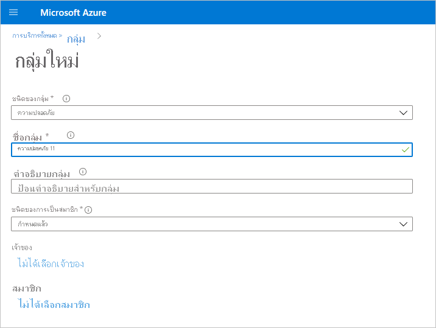
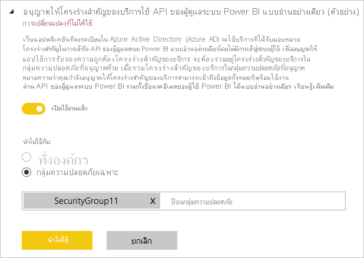

# เปิดใช้งานการตรวจสอบโครงร่างสำคัญของบริการสำหรับ API ของผู้ดูแลระบบแบบอ่านอย่างเดียว (แสดงตัวอย่าง)Enable service principal authentication for read-only admin APIs (preview)

หลักการบริการคือวิธีการรับรองความถูกต้องที่สามารถใช้เพื่ออนุญาตให้มีการเข้าถึงแอปพลิเคชัน Azure Active Directory (Azure AD) เนื้อหาแบริการของ Power BI และ Api ได้Service principal is an authentication method that can be used to let an Azure Active Directory (Azure AD) application access Power BI service content and APIs.
เมื่อคุณสร้างแอป Azure AD  [วัตถุหลักการบริการ](/azure/active-directory/develop/app-objects-and-service-principals#service-principal-object) จะถูกสร้างขึ้นWhen you create an Azure AD app, a [service principal object](/azure/active-directory/develop/app-objects-and-service-principals#service-principal-object) is created. หลักการบริการ ซึ่งเป็นที่รู้จักกันว่าหลักการบริการ จะช่วยให้ Azure AD รับรองความถูกต้องของแอปของคุณThe service principal object, also known simply as the service principal, allows Azure AD to authenticate your app. เมื่อรับรองความถูกต้องแล้ว แอปจะสามารถเข้าถึงแหล่งข้อมูลผู้เช่า Azure ADOnce authenticated, the app can access Azure AD tenant resources.

## วิธีการMethod

เมื่อต้องการเปิดใช้การตรวจสอบหลักการบริการสำหรับ Api แบบอ่านอย่างเดียวของ Power BI ให้ทำตามขั้นตอนเหล่านี้:To enable service principal authentication for Power BI read-only APIs, follow these steps:

1. [สร้างแอป Azure AD](/azure/active-directory/develop/howto-create-service-principal-portal)[Create an Azure AD app](/azure/active-directory/develop/howto-create-service-principal-portal). คุณสามารถข้ามขั้นตอนนี้ได้ถ้าคุณมีแอป Azure AD ที่คุณต้องการใช้อยู่แล้วYou can skip this step if you already have an Azure AD app you want to use. จด App-Id สำหรับขั้นตอนต่อไปTake note of the App-Id for later steps. 
2. สร้าง **กลุ่มความปลอดภัย** ใหม่ใน Azure Active DirectoryCreate a new **Security Group** in Azure Active Directory. [อ่านเพิ่มเติมเกี่ยวกับวิธีการสร้างกลุ่มพื้นฐานและเพิ่มสมาชิกโดยใช้ Azure Active Directory](/azure/active-directory/fundamentals/active-directory-groups-create-azure-portal)[Read more about how to create a basic group and add members using Azure Active Directory](/azure/active-directory/fundamentals/active-directory-groups-create-azure-portal). คุณสามารถข้ามขั้นตอนนี้ได้ถ้าคุณมีกลุ่มความปลอดภัยที่คุณต้องการใช้งานอยู่แล้วYou can skip this step if you already have a security group you would like to use.
    ตรวจสอบให้แน่ใจว่าได้เลือก **ความปลอดภัย** เป็นประเภทกลุ่มMake sure to select **Security** as the Group type.

    

3. เพิ่มApp-Id ของคุณเป็นสมาชิกของกลุ่มความปลอดภัยที่คุณสร้างขึ้นAdd your App-Id as a member of the security group you created. โดยดำเนินการดังนี้:To do so:
    1. นำทางไปยัง **พอร์ทัล Azure > Azure Active Directory >  กลุ่ม** และเลือกกลุ่มความปลอดภัยที่คุณสร้างในขั้นตอนที่ 2Navigate to **Azure portal > Azure Active Directory > Groups**, and choose the security group you created in Step 2.
    1. เลือก **เพิ่มสมาชิก**Select **Add Members**.
    หมายเหตุ: ตรวจสอบให้แน่ใจว่าแอปที่คุณใช้ไม่มีบทบาทผู้ดูแลระบบ Power BI ใดๆ ที่ตั้งค่าไว้ในพอร์ทัล AzureNote: Make sure the app you use does not have any Power BI admin roles set on it in Azure portal. เมื่อต้องการตรวจสอบ ให้ทำดังนี้:To check this: 
       * ลงชื่อเข้าใช้ **พอร์ทัล Azure** เป็นผู้ดูแลระบบส่วนกลาง ผู้ดูแลระบบแอปพลิเคชัน หรือผู้ดูแลระบบแอปพลิเคชันระบบคลาวด์Sign into the **Azure portal** as a Global Administrator, an Application Administrator, or a Cloud Application Administrator. 
        * เลือก **Azure Active Directory** จากนั้น **แอปพลิเคชันขององค์กร**Select **Azure Active Directory**, then **Enterprise applications**. 
        * เลือกแอปพลิเคชันที่คุณต้องการอนุญาตให้เข้าถึง Power BISelect the application you want to grant access to Power BI. 
        * เลือก **การอนุญาต**Select **Permissions**. ตรวจสอบให้แน่ใจว่าไม่มีการอนุญาตที่จำเป็นสำหรับผู้ดูแลระบบ Power BI ที่ตั้งค่าไว้ในแอปพลิเคชันนี้Make sure there are no Power BI admin-consent-required permissions set on this application. ดู[การจัดการความยินยอมให้กับแอปพลิเคชันและประเมินคำขอการยินยอม](/azure/active-directory/manage-apps/manage-consent-requests)สำหรับข้อมูลเพิ่มเติมSee [Managing consent to applications and evaluating consent requests](/azure/active-directory/manage-apps/manage-consent-requests) for more information. 
4. เปิดใช้งานการตั้งค่าการจัดการบริการของ Power BIEnable the Power BI service admin settings. ในการทำขั้นตอนนี้:To do this:
    1. เข้าสู่ระบบพอร์ทัลผู้ดูแลระบบของ Power BILog into the Power BI admin portal. คุณจำเป็นต้องเป็นผู้ดูแลระบบ Power BI เพื่อดูหน้าการตั้งค่าผู้เช่าYou need to be a Power BI admin to see the tenant settings page.
    1. ที่ด้านล่าง **การตั้งค่า API ผู้ดูแลระบบ** คุณจะเห็น **อนุญาตให้บริการหลักใช้ API ผู้ดูแลระบบ Power BI แบบอ่านได้เท่านั้น (ตัวอย่าง)**Under **Admin API settings**, you will see **Allow service principals to use read-only Power BI admin APIs (Preview)**. ตั้งค่าการสลับเป็นเปิดใช้งานจากนั้นเลือกปุ่มตัวเลือก **กลุ่มความปลอดภัยเฉพาะ** และเพิ่มกลุ่มความปลอดภัยที่คุณสร้างไว้ในขั้นตอนที่ 2 ในช่องข้อความที่ปรากฏด้านล่างดังแสดงในรูปด้านล่างSet the toggle to Enabled, and then select the **Specific security groups** radio button and add the security group you created in Step 2 in the text field that appears below it, as shown in the figure below.

        

 5. เริ่มต้นใช้งาน API ผู้ดูแลแบบอ่านอย่างเดียวStart using the read-only admin APIs. ดูรายการของ API ที่รองรับด้านล่างSee the list of supported APIs below.

    >[!IMPORTANT]
    >เมื่อคุณเปิดใช้งานหลักการบริการเพื่อใช้กับ Power BI แล้ว สิทธิ์ Azure AD ของแอปพลิเคชันจะไม่มีผลอีกต่อไปOnce you enable the service principal to be used with Power BI, the application's Azure AD permissions no longer have any effect. มีจัดการสิทธิ์ของแอปพลิเคชันแล้วผ่านทางพอร์ทัลผู้ดูแลระบบ Power BIThe application's permissions are then managed through the Power BI admin portal.

## ข้อควรพิจารณาและข้อจำกัดConsiderations and limitations
* คุณไม่สามารถลงชื่อเข้าใช้พอร์ทัล Power BI ด้วยบริการหลักYou can't sign into the Power BI portal using service principal.
* คุณจำเป็นต้องมีสิทธิ์ของผู้ดูแลระบบ Power BI เพื่อเปิดใช้งานบริการหลักในการตั้งค่า API ผู้ดูแลระบบภายในพอร์ทัลผู้ดูแลระบบของ Power BIPower BI admin rights are required to enable service principal in the Admin API settings in the Power BI admin portal.
* หลักการบริการในขณะนี้สนับสนุน API ต่อไปนี้:Service principal currently supports the following APIs:
    * [GetGroupsAsAdmin](/rest/api/power-bi/admin/groups_getgroupsasadmin) ที่มี $expand สำหรับแดชบอร์ด ชุดข้อมูล รายงาน และกระแสข้อมูล[GetGroupsAsAdmin](/rest/api/power-bi/admin/groups_getgroupsasadmin) with $expand for dashboards, datasets, reports, and dataflows 
    * [GetDashboardsAsAdmin](/rest/api/power-bi/admin/dashboards_getdashboardsasadmin) ที่มีไทล์ $expand[GetDashboardsAsAdmin](/rest/api/power-bi/admin/dashboards_getdashboardsasadmin) with $expand tiles
    * [GetDatasourcesAsAdminGetDatasourcesAsAdmin](/rest/api/power-bi/admin/datasets_getdatasourcesasadmin) 
    * [GetDatasetToDataflowsLinksAsAdminGetDatasetToDataflowsLinksAsAdmin](/rest/api/power-bi/admin/datasets_getdatasettodataflowslinksingroupasadmin)
    * [GetDatasourcesAsAdminGetDataflowDatasourcesAsAdmin](/rest/api/power-bi/admin/dataflows_getdataflowdatasourcesasadmin) 
    * [GetDataflowUpstreamDataflowsAsAdminGetDataflowUpstreamDataflowsAsAdmin](/rest/api/power-bi/admin/dataflows_getupstreamdataflowsingroupasadmin) 
    * [GetCapacitiesAsAdminGetCapacitiesAsAdmin](/rest/api/power-bi/admin/getcapacitiesasadmin)
    * [GetActivityLogGetActivityLog](/rest/api/power-bi/admin/getactivityevents)
    * [GetModifiedWorkspacesGetModifiedWorkspaces](/rest/api/power-bi/admin/workspaceinfo_getmodifiedworkspaces)
    * [WorkspaceGetInfoWorkspaceGetInfo](/rest/api/power-bi/admin/workspaceinfo_postworkspaceinfo)
    * [WorkspaceScanStatusWorkspaceScanStatus](/rest/api/power-bi/admin/workspaceinfo_getscanstatus)
    * [WorkspaceScanResultWorkspaceScanResult](/rest/api/power-bi/admin/workspaceinfo_getscanresult)