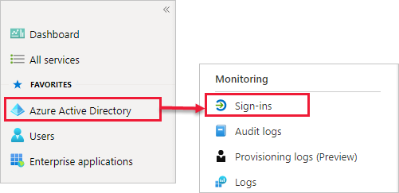
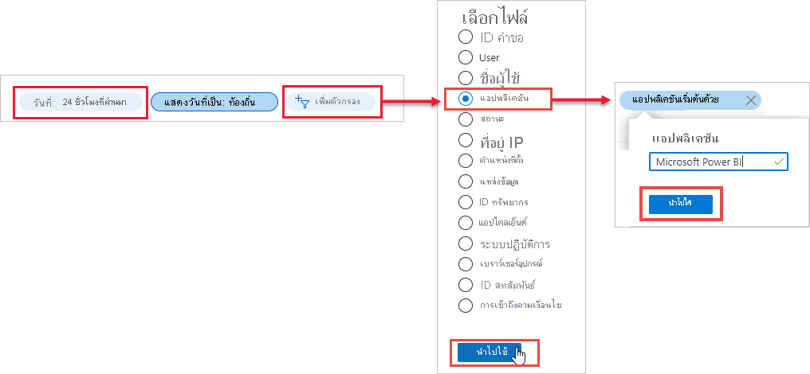
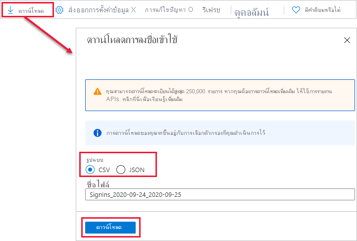

# ค้นหาผู้ใช้ Power BI ที่มีการลงชื่อเข้าใช้Find Power BI users that have signed in

หากคุณเป็นผู้ดูแลระบบสำหรับองค์กรของคุณ และต้องการดูบุคคลที่ลงชื่อเข้าใช้ Power BI ให้ใช้ [รายงานการเข้าถึงและการใช้งานของ Azure Active Directory](/azure/active-directory/reports-monitoring/concept-sign-ins)If you're an admin for your organization, and want to see who has signed into Power BI, use the [Azure Active Directory access and usage reports](/azure/active-directory/reports-monitoring/concept-sign-ins).

> [!NOTE]
> แม้รายงาน **ลงชื่อเข้าใช้** จะให้ข้อมูลที่เป็นประโยชน์ แต่ก็ไม่สามารถระบุประเภทสิทธิการใช้งานที่ผู้ใช้แต่ละคนมีได้The **Sign-ins** report provides useful info, but it doesn't identify the type of license for each user. การใช้ศูนย์การจัดการ Microsoft 365 เพื่อดูสิทธิ์การใช้งานUse the Microsoft 365 admin center to view licenses.

## ข้อกำหนดRequirements

ผู้ใช้ทุกคนสามารถดูรายงานการลงชื่อเข้าใช้ของตนเองได้ เมื่อต้องการดูรายงานสำหรับผู้ใช้ทั้งหมด คุณต้องอยู่ในหนึ่งในบทบาทต่อไปนี้: ผู้ดูแลระบบส่วนกลาง, ผู้ดูแลระบบความปลอดภัย, ผู้มีสิทธิ์อ่านระบบความปลอดภัย, ผู้อ่านส่วนกลาง หรือโปรแกรมอ่านรายงานAny user can view a report of their own sign-ins. To see a report for all users you must be in one of the following roles: Global Admin, Security Admin, Security Reader, Global Reader, or Report Reader.

## ใช้ศูนย์การจัดการของผู้ดูแลระบบ Azure Active Directory เพื่อดูการลงชื่อเข้าใช้Use the Azure Active Directory admin center to view sign-ins

หากต้องการดูกิจกรรมการลงชื่อเข้าใช้ ให้ปฏิบัติตามขั้นตอนเหล่านี้To view sign-in activity, follow these steps.

1. ลงชื่อเข้าใช้ [ศูนย์การจัดการ Azure Active Directory](https://aad.portal.azure.com) จากนั้นเลือก **Azure Active Directory** จากเมนูพอร์ทัลSign in to the [Azure Active Directory admin center](https://aad.portal.azure.com), then select **Azure Active Directory** from the portal menu.

1. จากเมนูทรัพยากร เลือก **การตรวจสอบ** > **ลงชื่อเข้าใช้**From the resource menu, select **Monitoring** > **Sign-ins**.
   
    

1. ตามค่าเริ่มต้น การลงชื่อเข้าใช้ทั้งหมดจาก 24 ชั่วโมงที่ผ่านมาสำหรับผู้ใช้และแอปพลิเคชันทั้งหมดจะแสดงขึ้นBy default, all sign-ins from the last 24 hours for all users and all applications are shown. เมื่อต้องการเลือกช่วงเวลาอื่น ให้เลือก **วันที่** ในบานหน้าต่างการทำงานและเลือกช่วงเวลาที่พร้อมใช้งานTo select a different time period, select **Date** in the working pane and choose from the available time intervals. สามารถใช้ได้เฉพาะข้อมูลจากเจ็ดวันที่ผ่านมาเท่านั้นOnly info from the last seven days is available. หากต้องการดูเฉพาะการลงชื่อเข้าใช้ Power BI ให้เพิ่มตัวกรองTo see only sign-ins to Power BI, add filters. เลือก **เพิ่มตัวกรอง** > เลือก **แอปพลิเคชัน** เป็นเขตข้อมูลที่จะกรองตาม และเลือก **นำไปใช้**Select **Add filter** > pick **Application** as the field to filter by, and select **Apply**. เลือก **แอปพลิเคชันที่ขึ้นต้นด้วย** จากด้านบนของบานหน้าต่างการทำงาน แล้วป้อนชื่อแอปSelect **Application starts with** from the top of the working pane, and enter the app name. เลือก **นำไปใช้**Select **Apply**.

    **Microsoft Power BI** จะกรองเพื่อลงชื่อเข้าใช้กิจกรรมที่เกี่ยวข้องกับบริการ**Microsoft Power BI** filters to sign-in activity related to the service. **Power BI Gateway** จะกรองเพื่อลงชื่อเข้าใช้กิจกรรมเฉพาะเกตเวย์ข้อมูลภายในองค์กร**Power BI Gateway** filters to sign-in activity specific to the on-premises data gateway.
   
    

## ส่งออกข้อมูลExport the data

คุณสามารถ[ดาวน์โหลดรายงานลงชื่อเข้าใช้](/azure/active-directory/reports-monitoring/quickstart-download-sign-in-report)ในรูปแบบไฟล์ CSV หรือไฟล์ JSON ได้You can [download a sign-in report](/azure/active-directory/reports-monitoring/quickstart-download-sign-in-report) in either of two formats: a CSV file, or a JSON file.

1. จากแถบคำสั่งสำหรับรายงาน **ลงชื่อเข้าใช้** เลือก **ดาวน์โหลด** แล้วเลือกหนึ่งในตัวเลือกต่อไปนี้:From the command bar for the **Sign-ins** report, select **Download** and then select one of the following options:

   * **CSV** เพื่อดาวน์โหลดไฟล์ CSV สำหรับข้อมูลที่ถูกกรองในขณะนี้**CSV** to download a CSV file for the currently filtered data.

   * **JSON** เพื่อดาวน์โหลดไฟล์ JSON สำหรับข้อมูลที่ถูกกรองในขณะนี้**JSON** to download a JSON file for the currently filtered data.

2. พิมพ์ชื่อไฟล์ จากนั้นเลือก **ดาวน์โหลด**Type a file name, then select **Download**.

## การเก็บรักษาข้อมูลData retention

ข้อมูลที่เกี่ยวข้องกับการลงชื่อเข้าใช้มีได้ถึงเจ็ดวัน เว้นแต่ว่าองค์กรของคุณไม่มีสิทธิ์การใช้งาน Azure AD PremiumSign-in-related data is available for up to seven days, unless your organization has an Azure AD premium license. หากคุณกำลังใช้ Azure AD Premium P1 หรือ Azure AD Premium P2 คุณสามารถดูข้อมูลสำหรับ 30 วันที่ผ่านมาได้If you're using Azure AD Premium P1 or Azure AD Premium P2, you can see data for the past 30 days. สำหรับข้อมูลเพิ่มเติม ดู[นโยบายการเก็บรักษาข้อมูลรายงานของ Azure Active Directory](/azure/active-directory/reports-monitoring/reference-reports-data-retention)For more info, see [Azure Active Directory report retention policies](/azure/active-directory/reports-monitoring/reference-reports-data-retention).

## ขั้นตอนถัดไปNext steps

[ตรวจสอบกิจกรรมของผู้ใช้Audit user activity](service-admin-auditing.md)

มีคำถามเพิ่มเติมหรือไม่More questions? [ลองถามชุมชน Power BITry asking the Power BI Community](https://community.powerbi.com/)