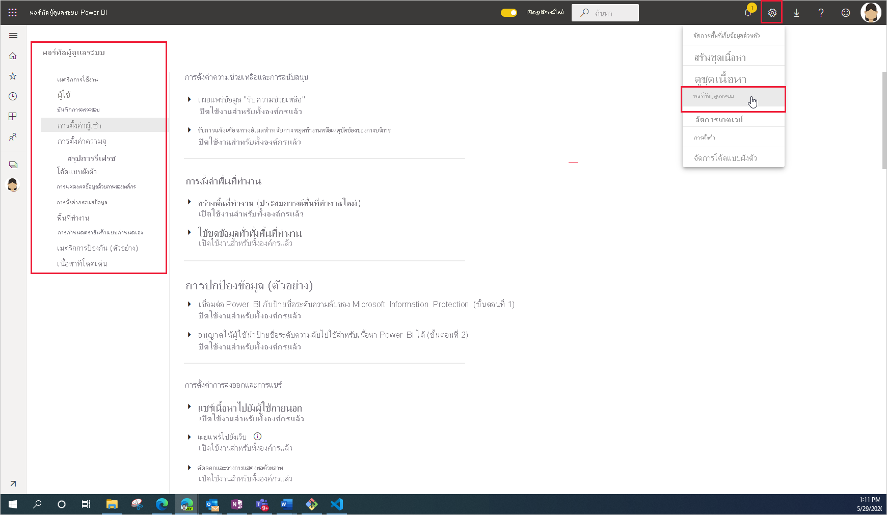

# การดูแลระบบ Power BI คืออะไรWhat is Power BI administration

การดูแลระบบ Power BI คือการจัดการการตั้งค่าทั้งองค์กรที่ควบคุมวิธีการทำงานของ Power BIPower BI administration is the management of the organization-wide settings that control how Power BI works. ผู้ใช้ที่ได้รับมอบหมายบทบาทผู้ดูแลระบบกำหนดค่า ตรวจสอบ และเตรียมใช้งานทรัพยากรขององค์กรUsers that are assigned to admin roles configure, monitor, and provision organizational resources. บทความนี้ให้ภาพรวมของบทบาทการดูแล งาน และเครื่องมือต่าง ๆ เพื่อช่วยคุณเริ่มต้นThis article provides an overview of administration roles, tasks, and tools to help you get started.

## บทบาทผู้ดูแลระบบที่เกี่ยวข้องกับ Power BIAdministrator roles related to Power BI

มีบทบาทหลายอย่างที่ทำงานร่วมกันเพื่อดูแล Power BI สำหรับองค์กรของคุณThere are several roles that work together to administer Power BI for your organization. มีการมอบหมายบทบาทผู้ดูแลระบบส่วนใหญ่ในศูนย์การจัดการ Microsoft 365 หรือโดยใช้ PowerShellMost admin roles are assigned in the Microsoft 365 admin center or by using PowerShell. มีการมอบหมายบทบาทผู้ดูแลระบบ Power BI Premium Capacity และ Power BI Embedded Capacity เมื่อสร้างความจุThe Power BI Premium Capacity and Power BI Embedded Capacity admin roles are assigned when the capacity is created. หากต้องการเรียนรู้เพิ่มเติมเกี่ยวกับบทบาทผู้ดูแลระบบแต่ละคน โปรดดู [เกี่ยวกับบทบาทผู้ดูแลระบบ](/microsoft-365/admin/add-users/about-admin-roles)To learn more about each of the admin roles, see [About admin roles](/microsoft-365/admin/add-users/about-admin-roles). เมื่อต้องการเรียนรู้วิธีการกำหนดบทบาทผู้ดูแลระบบ ให้ดู [กำหนดบทบาทผู้ดูแลระบบ](/microsoft-365/admin/add-users/assign-admin-roles)To learn how to assign admin roles, see [Assign admin roles](/microsoft-365/admin/add-users/assign-admin-roles).

| **ชนิดของผู้ดูแลระบบ****Type of administrator** | **ขอบเขตการดูแลระบบ****Administrative scope** | **งาน Power BI****Power BI tasks** |
| --- | --- | --- |
| ผู้ดูแลระบบส่วนกลางGlobal admin | Microsoft 365Microsoft 365 | มีการเข้าถึงคุณลักษณะการจัดการทั้งหมดสำหรับองค์กรได้ไม่จำกัดHas unlimited access to all management features for the organization |
| | | มอบหมายบทบาทให้กับผู้ใช้อื่นAssigns roles to other users |
| ผู้ดูแลการเรียกเก็บเงินBilling admin | Microsoft 365Microsoft 365 | จัดการการสมัครใช้งานManage subscriptions |
| | | ซื้อสิทธิการใช้งานPurchase licenses |
| ผู้ดูแลสิทธิการใช้งานLicense admin | Microsoft 365Microsoft 365 | มอบหมายหรือลบสิทธิการใช้งานAssign or remove licenses for users |
| ผู้ดูแลระบบผู้ใช้User admin | Microsoft 365Microsoft 365 | สร้างและจัดการผู้ใช้และกลุ่มCreate and manage users and groups |
| | | รีเซ็ตรหัสผ่านของผู้ใช้Reset user passwords |
| ผู้ดูแลระบบ Power BIPower BI admin | บริการ Power BIPower BI service | การเข้าถึงงานการจัดการ Power BI แบบเต็มรูปแบบFull access to Power BI management tasks|
| | | เปิดและปิดใช้งานคุณลักษณะของ Power BIEnable and disable Power BI features |
| | | รายงานการใช้งานและประสิทธิภาพReport on usage and performance |
| | | ตรวจทานและจัดการการตรวจสอบReview and manage auditing |
| ผู้ดูแลระบบ Power BI Premium CapacityPower BI Premium Capacity admin | ความจุ Premium เดียวA single Premium capacity | กำหนดพื้นที่ทำงานสำหรับความจุAssign workspaces to the capacity|
| | | จัดการสิทธิ์ของผู้ใช้ไปยังความจุManage user permission to the capacity |
| | | จัดการปริมาณงานเพื่อกำหนดค่าการใช้หน่วยความจำManage workloads to configure memory usage |
| | | รีสตาร์ทความจุRestart the capacity |
| ผู้ดูแลระบบ Power BI Embedded CapacityPower BI Embedded Capacity admin | ความจุ Embedded เดียวA single Embedded capacity | กำหนดพื้นที่ทำงานสำหรับความจุAssign workspaces to the capacity|
| | | จัดการสิทธิ์ของผู้ใช้ไปยังความจุManage user permission to the capacity |
| | | จัดการปริมาณงานเพื่อกำหนดค่าการใช้หน่วยความจำManage workloads to configure memory usage |
| | | รีสตาร์ทความจุRestart the capacity |

## งานและเครื่องมือดูแลระบบAdministrative tasks and tools

ผู้ดูแลระบบ Power BI ทำงานส่วนใหญ่ในพอร์ทัลผู้ดูแลระบบ Power BIPower BI admins work mostly in the Power BI admin portal. อย่างไรก็ตาม คุณควรคุ้นเคยกับเครื่องมือที่เกี่ยวข้องและศูนย์การจัดการYou should, however, be familiar with related tools and admin centers. ดูตารางด้านบนเพื่อกำหนดบทบาทที่ต้องใช้ในการทำงานโดยใช้เครื่องมือที่แสดงไว้ที่นี่Look at the table above to determine which role is required to do tasks using the tools listed here.

| **เครื่องมือ****Tool** | **งานที่ทำทั่วไป****Typical tasks** |
| --- | --- |
| [พอร์ทัลผู้ดูแล Power BIPower BI Admin portal](https://app.powerbi.com/admin-portal) | จัดหา และทำงานกับความจุพรีเมียมAcquire and work with Premium capacity |
| | รักษาคุณภาพของบริการEnsure quality of service |
| | จัดการพื้นที่ทำงานManage workspaces |
| | เผยแพร่วิชวล Power BIPublish Power BI visuals |
| | ตรวจสอบรหัสที่ใช้การฝัง Power BI ในแอปพลิเคชันอื่น ๆVerify codes used to embed Power BI in other applications |
| | แก้ไขปัญหาการเข้าถึงข้อมูลและปัญหาอื่น ๆTroubleshoot data access and other issues |
| [ศูนย์การจัดการ Microsoft 365Microsoft 365 admin center](https://admin.microsoft.com) | จัดการผู้ใช้และกลุ่มManage users and groups |
| | ซื้อและกำหนดสิทธิการใช้งานPurchase and assign licenses |
| | บล็อกผู้ใช้จากการเข้าถึง Power BIBlock users from accessing Power BI |
| [ศูนย์การรักษาความปลอดภัยและการปฏิบัติตามนโยบาย Microsoft 365Microsoft 365 Security & Compliance Center](https://protection.office.com) | ตรวจทานและจัดการการตรวจสอบReview and manage auditing |
| | การติดตามและการจัดประเภทข้อมูลData classification and tracking |
| | นโยบายการป้องกันการสูญหายของข้อมูลData loss prevention policies |
| | การกำกับดูแลข้อมูลInformation governance |
| [Azure Active Directory ในพอร์ทัลของ AzureAzure Active Directory in the Azure portal](https://aad.portal.azure.com) | กำหนดค่าเงื่อนไขการเข้าถึงแหล่งข้อมูล Power BIConfigure conditional access to Power BI resources |
| | เตรียมใช้งานความจุ Power BI EmbeddedProvision Power BI Embedded capacity |
| [cmdlets ของ PowerShellPowerShell cmdlets](/powershell/power-bi/overview) | จัดการพื้นที่ทำงานและลักษณะอื่น ๆ ของ Power BI ผ่านสคริปต์Manage workspaces and other aspects of Power BI through scripts |
| [Api และ SDK การดูแลระบบAdministrative APIs and SDK](service-admin-reference.md) | สร้างเครื่องมือผู้ดูแลระบบแบบกำหนดเองBuild custom admin tools. ตัวอย่างเช่น Power BI Desktop สามารถใช้ API เหล่านี้เพื่อสร้างรายงานจากข้อมูลที่เกี่ยวข้องกับการดูแลระบบFor example, Power BI Desktop can use these APIs to build reports based on data related to administration. |

## ขั้นตอนถัดไปNext steps

เมื่อคุณทราบพื้นฐานของสิ่งที่เกี่ยวข้องกับการดูแลระบบ Power BI แล้ว ให้ศึกษาบทความเหล่านี้เพื่อเรียนรู้เพิ่มเติม:Now that you know the basics of what’s involved with Power BI administration, consult these articles to learn more:

- [ใช้พอร์ทัลผู้ดูแล Power BIUse the Power BI admin portal](service-admin-portal.md)
- [คำแนะนำเกี่ยวกับการตั้งค่าของผู้เช่าTenant settings guidance](../guidance/admin-tenant-settings.md)
- [ใช้ PowerShell cmdletsUse PowerShell cmdlets](/powershell/power-bi/overview)
- [การดูแล Power BI คำถามที่ถามบ่อยPower BI administration FAQ](service-admin-faq.md)
- [การให้สิทธิการใช้งานบริการ Power BI สำหรับผู้ที่อยู่ในองค์กรของคุณLicensing the Power BI service for users in your organization](service-admin-licensing-organization.md)
- มีคำถามหรือไม่Questions? [ลองถามชุมชน Power BITry asking the Power BI Community](https://community.powerbi.com/)
- มีข้อเสนอแนะไหมSuggestions? [สนับสนุนแนวคิดในการปรับปรุง Power BIContribute ideas to improve Power BI](https://ideas.powerbi.com/)