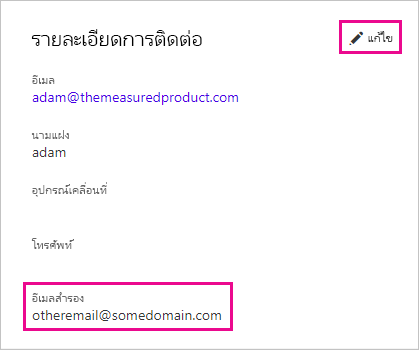

# <a name="use-an-alternate-email-address"></a><span data-ttu-id="a2532-103">ใช้ที่อยู่อีเมลสำรอง</span><span class="sxs-lookup"><span data-stu-id="a2532-103">Use an alternate email address</span></span>

<span data-ttu-id="a2532-104">เมื่อคุณลงทะเบียนใช้งาน Power BI คุณต้องให้ที่อยู่อีเมล</span><span class="sxs-lookup"><span data-stu-id="a2532-104">When you sign up for Power BI, you provide an email address.</span></span> <span data-ttu-id="a2532-105">โดยค่าเริ่มต้น Power BI จะใช้ที่อยู่นี้เพื่อส่งอัปเดตเกี่ยวกับกิจกรรมในบริการ</span><span class="sxs-lookup"><span data-stu-id="a2532-105">By default, Power BI uses this address to send you updates about activity in the service.</span></span> <span data-ttu-id="a2532-106">ตัวอย่างเช่น เมื่อมีบุคคลแจ้งเชิญเพื่อใช้งานร่วมกัน ก็จะส่งไปยังที่อยู่นี้</span><span class="sxs-lookup"><span data-stu-id="a2532-106">For example, when someone sends you a sharing invitation, it goes to this address.</span></span>

<span data-ttu-id="a2532-107">ในบางกรณี คุณอาจต้องการส่งอีเมลเหล่านี้ไปยังที่อยู่อีเมลสำรองแทนที่อยู่อีเมลที่ใช้ลงทะเบียน</span><span class="sxs-lookup"><span data-stu-id="a2532-107">In some cases, you might want these emails delivered to an alternate email address rather than the one you signed up with.</span></span> <span data-ttu-id="a2532-108">บทความนี้จะอธิบายวิธีการระบุที่อยู่อีเมลสำรองใน Microsoft 365 และ ใน PowerShell</span><span class="sxs-lookup"><span data-stu-id="a2532-108">This article explains how to specify an alternate address in Microsoft 365 and in PowerShell.</span></span> <span data-ttu-id="a2532-109">นอกจากนี้ยังอธิบายวิธีแก้ไขการที่ Azure Active Directory (Azure AD) แก้ไขที่อยู่ในอีเมล</span><span class="sxs-lookup"><span data-stu-id="a2532-109">The article also explains how Azure Active Directory (Azure AD) resolves an email address.</span></span>

> [!NOTE]
> <span data-ttu-id="a2532-110">การระบุที่อยู่สำรองจะไม่ส่งผลต่อที่อยู่อีเมลที่ Power BI ใช้สำหรับการสมัครรับอีเมล การอัปเดตบริการ จดหมายข่าว และการสื่อสารส่งเสริมการขายอื่น ๆ</span><span class="sxs-lookup"><span data-stu-id="a2532-110">Specifying an alternate address doesn't affect which email address Power BI uses for e-mail subscriptions, service updates, newsletters, and other promotional communications.</span></span> <span data-ttu-id="a2532-111">การติดต่อสื่อสารเหล่านั้นจะส่งไปยังที่อยู่อีเมลที่คุณใช้ลงทะเบียนใช้งาน Power BI เสมอ</span><span class="sxs-lookup"><span data-stu-id="a2532-111">Those communications are always sent to the email address you used when you signed up for Power BI.</span></span>

## <a name="use-microsoft-365"></a><span data-ttu-id="a2532-112">ใช้ Microsoft 365</span><span class="sxs-lookup"><span data-stu-id="a2532-112">Use Microsoft 365</span></span>

<span data-ttu-id="a2532-113">หากต้องการระบุที่อยู่สำรองใน Microsoft 365 ให้ปฏิบัติตามขั้นตอนเหล่านี้</span><span class="sxs-lookup"><span data-stu-id="a2532-113">To specify an alternate address in Microsoft 365, follow these steps.</span></span>

1. <span data-ttu-id="a2532-114">เปิดหน้า [ข้อมูลส่วนบุคคล](https://portal.office.com/account/#personalinfo) ของบัญชีของคุณ</span><span class="sxs-lookup"><span data-stu-id="a2532-114">Open the [personal info](https://portal.office.com/account/#personalinfo) page of your account.</span></span> <span data-ttu-id="a2532-115">ให้ลงชื่อเข้าใช้ด้วยที่อยู่อีเมลและรหัสผ่านที่คุณใช้สำหรับ Power BI หากแอปมีการร้องขอให้คุณทำ</span><span class="sxs-lookup"><span data-stu-id="a2532-115">If the app prompts you, sign in with the email address and password you use for Power BI.</span></span>

1. <span data-ttu-id="a2532-116">บนเมนูทางด้านซ้าย เลือก **ข้อมูลส่วนบุคคล**</span><span class="sxs-lookup"><span data-stu-id="a2532-116">On the left menu, select **Personal info**.</span></span>

1. <span data-ttu-id="a2532-117">ในส่วน **รายละเอียดการติดต่อ** เลือก **แก้ไข**</span><span class="sxs-lookup"><span data-stu-id="a2532-117">In the **Contact details** section, select **Edit**.</span></span>

    <span data-ttu-id="a2532-118">หากไม่สามารถแก้ไขรายละเอียดของคุณได้ แสดงว่าผู้ดูแลระบบของคุณเป็นผู้จัดการที่อยู่อีเมลของคุณ</span><span class="sxs-lookup"><span data-stu-id="a2532-118">If you cannot edit your details, this means your admin manages your email address.</span></span> <span data-ttu-id="a2532-119">โปรดติดต่อผู้ดูแลระบบของคุณเพื่ออัปเดตที่อยู่อีเมลของคุณ</span><span class="sxs-lookup"><span data-stu-id="a2532-119">Contact your admin to update your email address.</span></span>

    

1. <span data-ttu-id="a2532-121">ในเขตข้อมูล **อีเมลสำรอง** ใส่ที่อยู่อีเมลที่คุณต้องการให้ Microsoft 365 ส่งการอัปเดตให้ Power BI</span><span class="sxs-lookup"><span data-stu-id="a2532-121">In the **Alternate email** field, enter the email address you'd like Microsoft 365 to use for Power BI updates.</span></span>

## <a name="use-powershell"></a><span data-ttu-id="a2532-122">ใช้ PowerShell</span><span class="sxs-lookup"><span data-stu-id="a2532-122">Use PowerShell</span></span>

<span data-ttu-id="a2532-123">หากต้องระบุที่อยู่สำรองใน PowerShell ให้ใช้คำสั่ง [Set-AzureADUser](/powershell/module/azuread/set-azureaduser/)</span><span class="sxs-lookup"><span data-stu-id="a2532-123">To specify an alternate address in PowerShell, use the [Set-AzureADUser](/powershell/module/azuread/set-azureaduser/) command.</span></span>

```powershell
Set-AzureADUser -ObjectId john@contoso.com -OtherMails "otheremail@somedomain.com"
```

## <a name="email-address-resolution-in-azure-ad"></a><span data-ttu-id="a2532-124">การแก้ไขปัญหาที่อยู่อีเมลใน Azure AD</span><span class="sxs-lookup"><span data-stu-id="a2532-124">Email address resolution in Azure AD</span></span>

<span data-ttu-id="a2532-125">เพื่อการจับโทเค็น Active Azure Directory (AAD) แบบฝังสำหรับ Power BI คุณสามารถใช้อีเมลที่แตกต่างกันสามชนิด:</span><span class="sxs-lookup"><span data-stu-id="a2532-125">To capture an Azure AD embed token for Power BI, you can use one of three different types of email addresses:</span></span>

* <span data-ttu-id="a2532-126">ที่อยู่อีเมลหลักที่เชื่อมโยงกับบัญชี Azure AD ของผู้ใช้</span><span class="sxs-lookup"><span data-stu-id="a2532-126">The main email address associated with a user’s Azure AD account</span></span>

* <span data-ttu-id="a2532-127">ที่อยู่อีเมล UserPrincipalName (UPN)</span><span class="sxs-lookup"><span data-stu-id="a2532-127">The UserPrincipalName (UPN) email address</span></span>

* <span data-ttu-id="a2532-128">แอตทริบิวต์แบบอาร์เรย์อื่น ๆ ที่เก็บ *ที่อยู่อีเมล*</span><span class="sxs-lookup"><span data-stu-id="a2532-128">The *other email address* array attribute</span></span>

<span data-ttu-id="a2532-129">Power BI จะเลือกว่าจะใช้อีเมลใดจากลำดับต่อไปนี้:</span><span class="sxs-lookup"><span data-stu-id="a2532-129">Power BI selects which email to use based on the following sequence:</span></span>

1. <span data-ttu-id="a2532-130">หากแอตทริบิวต์จดหมายในออบเจ็กต์ผู้ใช้ Azure AD แสดงขึ้น แสดงว่า Power BI ใช้แอตทริบิวต์จดหมายนั้นสำหรับที่อยู่อีเมล</span><span class="sxs-lookup"><span data-stu-id="a2532-130">If the mail attribute in the Azure AD user object is present, then Power BI uses that mail attribute for the email address.</span></span>

1. <span data-ttu-id="a2532-131">หากอีเมล UPN *ไม่* ใช่โดเมนที่อยู่อีเมล **\*onmicrosoft.com** (ข้อมูลหลังจากสัญลักษณ์ "\@") Power BI จะใช้แอตทริบิวต์จดหมายนั้นสำหรับอยู่อีเมล</span><span class="sxs-lookup"><span data-stu-id="a2532-131">If the UPN email is *not* a **\*.onmicrosoft.com** domain email address (the information after the "\@" symbol), then Power BI uses that mail attribute for the email address.</span></span>

1. <span data-ttu-id="a2532-132">หากแอตทริบิวต์แบบอาร์เรย์อื่น ๆ *ที่เก็บที่อยู่อีเมลอื่นๆ*  ในออบเจ็กต์ผู้ใช้แสดงขึ้น แสดงว่าผู้ใช้ Power BI อีเมลแรกในรายการนั้น (เนื่องจากสามารถมีอีเมลได้หลายอีเมลในแอตทริบิวต์นี้) ถูกใช้</span><span class="sxs-lookup"><span data-stu-id="a2532-132">If the *other email address* array attribute in the Azure AD user object is present, then Power BI uses the first email in that list (since there can be a list of emails in this attribute).</span></span>

1. <span data-ttu-id="a2532-133">หากไม่ตรงกับเงื่อนไขทั้งหมดดังกล่าว ผู้ใช้ Power BI จะใช้ที่อยู่ UPN</span><span class="sxs-lookup"><span data-stu-id="a2532-133">If none of the above conditions are present, then Power BI uses the UPN address.</span></span>

<span data-ttu-id="a2532-134">มีคำถามเพิ่มเติมหรือไม่</span><span class="sxs-lookup"><span data-stu-id="a2532-134">More questions?</span></span> [<span data-ttu-id="a2532-135">ลองไปที่ชุมชน Power BI</span><span class="sxs-lookup"><span data-stu-id="a2532-135">Try the Power BI Community</span></span>](https://community.powerbi.com/)
