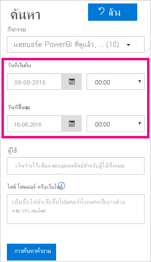

# <a name="track-user-activities-in-power-bi"></a><span data-ttu-id="8a8a1-103">ติดตามกิจกรรมของผู้ใช้ใน Power BI</span><span class="sxs-lookup"><span data-stu-id="8a8a1-103">Track user activities in Power BI</span></span>

<span data-ttu-id="8a8a1-104">การทราบว่าใครกำลังดำเนินการอะไร และในรายการใดใน Power BI ของคุณ เป็นสิ่งสำคัญที่สามารถช่วยให้องค์กรของคุณปฏิบัติตามข้อกำหนดได้ เช่น การปฏิบัติตามข้อบังคับการประชุมและการจัดการบันทึกต่าง ๆ</span><span class="sxs-lookup"><span data-stu-id="8a8a1-104">Knowing who is taking what action on which item in your Power BI tenant can be critical in helping your organization fulfill its requirements, like meeting regulatory compliance and records management.</span></span> <span data-ttu-id="8a8a1-105">เมื่อใช้ Power BI คุณมีสองตัวเลือกในการติดตามกิจกรรมของผู้ใช้: [บันทึกกิจกรรมของ Power BI](#use-the-activity-log) และ [บันทึกการตรวจสอบแบบรวม](#use-the-audit-log)</span><span class="sxs-lookup"><span data-stu-id="8a8a1-105">With Power BI, you have two options to track user activity: The [Power BI activity log](#use-the-activity-log) and the [unified audit log](#use-the-audit-log).</span></span> <span data-ttu-id="8a8a1-106">บันทึกเหล่านี้ทั้งคู่ประกอบด้วยสำเนาทั้งหมดของ [ข้อมูลการตรวจสอบ Power BI](#operations-available-in-the-audit-and-activity-logs) แต่มีความแตกต่างที่สำคัญหลายอย่างตามที่สรุปในตารางต่อไปนี้</span><span class="sxs-lookup"><span data-stu-id="8a8a1-106">These logs both contain a complete copy of the [Power BI auditing data](#operations-available-in-the-audit-and-activity-logs), but there are several key differences, as summarized in the following table.</span></span>

| <span data-ttu-id="8a8a1-107">**บันทึกการตรวจสอบแบบรวม**</span><span class="sxs-lookup"><span data-stu-id="8a8a1-107">**Unified audit log**</span></span> | <span data-ttu-id="8a8a1-108">**บันทึกกิจกรรม Power BI**</span><span class="sxs-lookup"><span data-stu-id="8a8a1-108">**Power BI activity log**</span></span> |
| --- | --- |
| <span data-ttu-id="8a8a1-109">รวมเหตุการณ์จาก SharePoint Online, Exchange Online, Dynamics 365 และบริการอื่นๆ นอกเหนือจากเหตุการณ์การตรวจสอบ Power BI</span><span class="sxs-lookup"><span data-stu-id="8a8a1-109">Includes events from SharePoint Online, Exchange Online, Dynamics 365, and other services in addition to the Power BI auditing events.</span></span> | <span data-ttu-id="8a8a1-110">รวมเฉพาะเหตุการณ์การตรวจสอบ Power BI</span><span class="sxs-lookup"><span data-stu-id="8a8a1-110">Includes only the Power BI auditing events.</span></span> |
| <span data-ttu-id="8a8a1-111">เฉพาะผู้ใช้ที่มีสิทธิ์ในการบันทึกการตรวจสอบหรือบันทึกการตรวจสอบแบบดูเท่านั้นที่สามารถเข้าถึงได้ เช่น ผู้ดูแลระบบและผู้สอบบัญชีส่วนกลาง</span><span class="sxs-lookup"><span data-stu-id="8a8a1-111">Only users with View-Only Audit Logs or Audit Logs permissions have access, such as global admins and auditors.</span></span> | <span data-ttu-id="8a8a1-112">ผู้ดูแลระบบส่วนกลางและผู้ดูแลระบบบริการของ Power BI มีสิทธิ์เข้าถึง</span><span class="sxs-lookup"><span data-stu-id="8a8a1-112">Global admins and Power BI service admins have access.</span></span> |
| <span data-ttu-id="8a8a1-113">ผู้ดูแลระบบส่วนกลางและผู้ตรวจสอบสามารถค้นหาบันทึกการตรวจสอบแบบรวมได้โดยใช้ศูนย์การรักษาความปลอดภัย Microsoft 365 และศูนย์การปฏิบัติตามข้อบังคับ Microsoft 365</span><span class="sxs-lookup"><span data-stu-id="8a8a1-113">Global admins and auditors can search the unified audit log by using the Microsoft 365 Security Center and the Microsoft 365 Compliance Center.</span></span> | <span data-ttu-id="8a8a1-114">ยังไม่มีอินเทอร์เฟซผู้ใช้ในการค้นหาบันทึกกิจกรรม</span><span class="sxs-lookup"><span data-stu-id="8a8a1-114">There's no user interface to search the activity log yet.</span></span> |
| <span data-ttu-id="8a8a1-115">ผู้ดูแลระบบส่วนกลางและผู้ตรวจสอบสามารถดาวน์โหลดรายการบันทึกการตรวจสอบได้โดยใช้ API การจัดการของ Microsoft 365 และ cmdlets</span><span class="sxs-lookup"><span data-stu-id="8a8a1-115">Global admins and auditors can download audit log entries by using Microsoft 365 Management APIs and cmdlets.</span></span> | <span data-ttu-id="8a8a1-116">ผู้ดูแลระบบส่วนกลางและผู้ดูแลระบบบริการของ Power BI สามารถดาวน์โหลดบันทึกรายการกิจกรรมโดยใช้ Power BI REST API และ cmdlet การจัดการ</span><span class="sxs-lookup"><span data-stu-id="8a8a1-116">Global admins and Power BI service admins can download activity log entries by using a Power BI REST API and management cmdlet.</span></span> |
| <span data-ttu-id="8a8a1-117">เก็บข้อมูลการตรวจสอบเป็นเวลา 90 วัน</span><span class="sxs-lookup"><span data-stu-id="8a8a1-117">Keeps audit data for 90 days</span></span> | <span data-ttu-id="8a8a1-118">เก็บข้อมูลกิจกรรมเป็นเวลา 30 วัน (มุมมองสาธารณะ)</span><span class="sxs-lookup"><span data-stu-id="8a8a1-118">Keeps activity data for 30 days (public preview).</span></span> |
| <span data-ttu-id="8a8a1-119">เก็บรักษาข้อมูลการตรวจสอบแม้ว่าผู้เช่าจะถูกย้ายไปยังภูมิภาค Azure อื่นก็ตาม</span><span class="sxs-lookup"><span data-stu-id="8a8a1-119">Retains audit data, even if the tenant is moved to a different Azure region.</span></span> | <span data-ttu-id="8a8a1-120">ไม่เก็บรักษาข้อมูลการตรวจสอบเมื่อผู้เช่าถูกย้ายไปยังภูมิภาค Azure อื่น</span><span class="sxs-lookup"><span data-stu-id="8a8a1-120">Doesn't retain activity data when the tenant is moved to a different Azure region.</span></span> |


## <a name="use-the-activity-log"></a><span data-ttu-id="8a8a1-121">ใช้บันทึกกิจกรรม</span><span class="sxs-lookup"><span data-stu-id="8a8a1-121">Use the activity log</span></span>

> [!NOTE]
> <span data-ttu-id="8a8a1-122">ไม่รองรับการบันทึกกิจกรรมสำหรับคลาวด์ Microsoft Deutschland</span><span class="sxs-lookup"><span data-stu-id="8a8a1-122">Activity logging isn't supported for Microsoft Cloud Deutschland.</span></span> <span data-ttu-id="8a8a1-123">เรียนรู้เพิ่มเติมเกี่ยวกับข้อจำกัดการบริการสำหรับคลาวด์ของเยอรมนีใน[คำถามที่พบบ่อยสำหรับ Power BI สำหรับลูกค้าคลาวด์ของเยอรมนี](service-govde-faq.md)</span><span class="sxs-lookup"><span data-stu-id="8a8a1-123">Learn more about service limitations for the Germany cloud in [Frequently Asked Questions for Power BI for Germany Cloud customers](service-govde-faq.md).</span></span>


<span data-ttu-id="8a8a1-124">ในฐานะผู้ดูแลระบบบริการ Power BI คุณสามารถวิเคราะห์การใช้งานสำหรับทรัพยากร Power BI ทั้งหมดที่ระดับผู้เช่าโดยใช้รายงานแบบกำหนดเองโดยยึดตามบันทึกกิจกรรมของ Power BI</span><span class="sxs-lookup"><span data-stu-id="8a8a1-124">As a Power BI service admin, you can analyze usage for all Power BI resources at the tenant level by using custom reports based on the Power BI activity log.</span></span> <span data-ttu-id="8a8a1-125">คุณสามารถดาวน์โหลดกิจกรรมโดยใช้ REST API หรือ PowerShell cmdlet</span><span class="sxs-lookup"><span data-stu-id="8a8a1-125">You can download the activities by using a REST API or PowerShell cmdlet.</span></span> <span data-ttu-id="8a8a1-126">คุณยังสามารถกรองข้อมูลกิจกรรมตามช่วงวันที่ ผู้ใช้และประเภทกิจกรรมได้</span><span class="sxs-lookup"><span data-stu-id="8a8a1-126">You can also filter the activity data by date range, user, and activity type.</span></span>

### <a name="activity-log-requirements"></a><span data-ttu-id="8a8a1-127">ข้อกำหนดของบันทึกกิจกรรม</span><span class="sxs-lookup"><span data-stu-id="8a8a1-127">Activity log requirements</span></span>

<span data-ttu-id="8a8a1-128">คุณต้องตรงตามข้อกำหนดเหล่านี้เพื่อเข้าถึงบันทึกกิจกรรมของ Power BI:</span><span class="sxs-lookup"><span data-stu-id="8a8a1-128">You must meet these requirements to access the Power BI activity log:</span></span>

- <span data-ttu-id="8a8a1-129">คุณต้องเป็นผู้ดูแลระบบส่วนกลางหรือผู้ดูแลระบบบริการของ Power BI</span><span class="sxs-lookup"><span data-stu-id="8a8a1-129">You must either be a global admin or a Power BI service admin.</span></span>
- <span data-ttu-id="8a8a1-130">คุณได้ติดตั้ง [cmdlets การจัดการ Power BI](https://www.powershellgallery.com/packages/MicrosoftPowerBIMgmt) ไว้ในเครื่องหรือใช้ cmdlets การจัดการ Power BI ใน Azure Cloud Shell</span><span class="sxs-lookup"><span data-stu-id="8a8a1-130">You have installed the [Power BI Management cmdlets](https://www.powershellgallery.com/packages/MicrosoftPowerBIMgmt) locally or use the Power BI Management cmdlets in Azure Cloud Shell.</span></span>

### <a name="activityevents-rest-api"></a><span data-ttu-id="8a8a1-131">ActivityEvents REST API</span><span class="sxs-lookup"><span data-stu-id="8a8a1-131">ActivityEvents REST API</span></span>

<span data-ttu-id="8a8a1-132">คุณสามารถใช้แอปพลิเคชันการดูแลระบบที่อาศัย Power BI REST API เพื่อส่งออกเหตุการณ์กิจกรรมลงในที่เก็บ blob หรือฐานข้อมูล SQL</span><span class="sxs-lookup"><span data-stu-id="8a8a1-132">You can use an administrative application based on the Power BI REST APIs to export activity events into a blob store or SQL database.</span></span> <span data-ttu-id="8a8a1-133">จากนั้นคุณสามารถสร้างรายงานการใช้งานแบบกำหนดเองที่ด้านบนของข้อมูลที่ส่งออก</span><span class="sxs-lookup"><span data-stu-id="8a8a1-133">You can then build a custom usage report on top of the exported data.</span></span> <span data-ttu-id="8a8a1-134">ในการเรียกใช้ **ActivityEvents** REST API คุณต้องระบุวันที่เริ่มต้นและวันที่สิ้นสุดและตัวกรองที่เป็นตัวเลือกเสริมเพื่อเลือกกิจกรรมตามประเภทกิจกรรมหรือ ID ผู้ใช้</span><span class="sxs-lookup"><span data-stu-id="8a8a1-134">In the **ActivityEvents** REST API call, you must specify a start date and end date and optionally a filter to select activities by activity type or user ID.</span></span> <span data-ttu-id="8a8a1-135">เนื่องจากบันทึกกิจกรรมอาจประกอบด้วยข้อมูลจำนวนมาก **ActivityEvents** API ในขณะนี้รองรับการดาวน์โหลดข้อมูลสูงสุดหนึ่งวันต่อการร้องขอหนึ่งครั้ง</span><span class="sxs-lookup"><span data-stu-id="8a8a1-135">Because the activity log could contain a large amount of data, the **ActivityEvents** API currently only supports downloading up to one day of data per request.</span></span> <span data-ttu-id="8a8a1-136">หรืออีกนัยหนึ่งคือต้องระบุวันที่เริ่มต้นและวันที่สิ้นสุดเป็นวันเดียวกัน ตามตัวอย่างต่อไปนี้</span><span class="sxs-lookup"><span data-stu-id="8a8a1-136">In other words, the start date and end date must specify the same day, as in the following example.</span></span> <span data-ttu-id="8a8a1-137">ตรวจสอบให้แน่ใจว่าคุณระบุค่าวันที่เวลาในรูปแบบเวลามาตรฐานสากล</span><span class="sxs-lookup"><span data-stu-id="8a8a1-137">Make sure you specify the DateTime values in UTC format.</span></span>

```
https://api.powerbi.com/v1.0/myorg/admin/activityevents?startDateTime='2019-08-31T00:00:00'&endDateTime='2019-08-31T23:59:59'
```

<span data-ttu-id="8a8a1-138">หากจำนวนของรายการมีขนาดใหญ่ **ActivityEvents** API จะส่งกลับรายการและโทเค็นต่อเนื่องเพียงประมาณ 5,000 ถึง 10,000 รายการเท่านั้น</span><span class="sxs-lookup"><span data-stu-id="8a8a1-138">If the number of entries is large, the **ActivityEvents** API returns only around 5,000 to 10,000 entries and a continuation token.</span></span> <span data-ttu-id="8a8a1-139">เรียกใช้ **ActivityEvents** API อีกครั้งด้วยโทเค็นต่อเนื่องเพื่อรับรายการชุดต่อไป และถัดไปเรื่อย ๆ จนกระทั้งคุณได้รับรายการทั้งหมดและไม่ได้รับโทเค็นต่อเนื่องอีกต่อไป</span><span class="sxs-lookup"><span data-stu-id="8a8a1-139">Call the **ActivityEvents** API again with the continuation token to obtain the next batch of entries, and so forth, until you have retrieved all entries and no longer receive a continuation token.</span></span> <span data-ttu-id="8a8a1-140">ตัวอย่างต่อไปนี้แสดงวิธีการใช้โทเค็นต่อเนื่อง</span><span class="sxs-lookup"><span data-stu-id="8a8a1-140">The following example shows how to use the continuation token.</span></span>

```
https://api.powerbi.com/v1.0/myorg/admin/activityevents?continuationToken='%2BRID%3ARthsAIwfWGcVAAAAAAAAAA%3D%3D%23RT%3A4%23TRC%3A20%23FPC%3AARUAAAAAAAAAFwAAAAAAAAA%3D'
```

<span data-ttu-id="8a8a1-141">โดยไม่คำนึงถึงจำนวนของรายการที่ส่งกลับ หากผลลัพธ์มีโทเค็นต่อเนื่อง ตรวจสอบให้แน่ใจว่าคุณเรียกใช้ API อีกครั้งโดยใช้โทเค็นนั้นเพื่อรับข้อมูลที่เหลือ จนกระทั่งไม่มีโทเค็นส่งกลับมาอีก</span><span class="sxs-lookup"><span data-stu-id="8a8a1-141">Regardless of the number of entries returned, if the results include a continuation token, make sure you call the API again using that token to retrieve the remaining data, until a continuation token is no longer returned.</span></span> <span data-ttu-id="8a8a1-142">ทั้งนี้อาจเกิดกรณีที่การโทรส่งโทเค็นต่อเนื่องกลับมาโดยไม่มีรายการเหตุการณ์ใดๆ</span><span class="sxs-lookup"><span data-stu-id="8a8a1-142">It can happen that a call even returns a continuation token without any event entries.</span></span> <span data-ttu-id="8a8a1-143">ตัวอย่างต่อไปนี้แสดงวิธีการวนรอบกับโทเค็นการต่อเนื่องที่ส่งกลับมา:</span><span class="sxs-lookup"><span data-stu-id="8a8a1-143">The following example shows how to loop with a continuation token returned in the response:</span></span>

```
while(response.ContinuationToken != null)
{
   // Store the activity event results in a list for example
    completeListOfActivityEvents.AddRange(response.ActivityEventEntities);

    // Make another call to the API with continuation token
    response = GetPowerBIActivityEvents(response.ContinuationToken)
}
completeListOfActivityEvents.AddRange(response.ActivityEventEntities);
```
> [!NOTE]
> <span data-ttu-id="8a8a1-144">ซึ่งอาจใช้เวลาสูงถึง 24 ชั่วโมงกว่าที่เหตุการณ์ทั้งหมดจะปรากฏขึ้น แต่โดยทั่วไปข้อมูลแบบเต็มจะพร้อมใช้งานเร็วกว่ามาก</span><span class="sxs-lookup"><span data-stu-id="8a8a1-144">It can take up to 24 hours for all events to show up, though full data is typically available much sooner.</span></span>
>
>
<span data-ttu-id="8a8a1-145">หากต้องการเรียนรู้เพิ่มเติมเกี่ยวกับการใช้ Power BI REST API รวมถึงตัวอย่างวิธีรับเหตุการณ์กิจกรรมการตรวจสอบ โปรดดูที่[ผู้ดูแลระบบ - รับกิจกรรมการเคลื่อนไหว](/rest/api/power-bi/admin/getactivityevents)ในคู่มืออ้างอิง Power BI REST API</span><span class="sxs-lookup"><span data-stu-id="8a8a1-145">To learn more about using the Power BI REST API, including examples of how to get audit activity events, see [Admin - Get Activity Events](/rest/api/power-bi/admin/getactivityevents) in the Power BI REST API reference documentation.</span></span>

### <a name="get-powerbiactivityevent-cmdlet"></a><span data-ttu-id="8a8a1-146">Get-PowerBIActivityEvent cmdlet</span><span class="sxs-lookup"><span data-stu-id="8a8a1-146">Get-PowerBIActivityEvent cmdlet</span></span>

<span data-ttu-id="8a8a1-147">ดาวน์โหลดเหตุการณ์กิจกรรมโดยใช้ cmdlet ของ Power BI Management สำหรับ PowerShell</span><span class="sxs-lookup"><span data-stu-id="8a8a1-147">Download activity events by using the Power BI Management cmdlets for PowerShell.</span></span> <span data-ttu-id="8a8a1-148">**Get-PowerBIActivityEvent** cmdlet จัดการโทเค็นความต่อเนื่องให้คุณโดยอัตโนมัติ</span><span class="sxs-lookup"><span data-stu-id="8a8a1-148">The **Get-PowerBIActivityEvent** cmdlet  automatically handles the continuation token for you.</span></span> <span data-ttu-id="8a8a1-149">**Get-PowerBIActivityEvent** cmdlet ใช้พารามิเตอร์ StartDateTime และ EndDateTime ด้วยข้อจำกัดเดียวกันกับ **ActivityEvents** REST API</span><span class="sxs-lookup"><span data-stu-id="8a8a1-149">The **Get-PowerBIActivityEvent** cmdlet takes a StartDateTime and an EndDateTime parameter with the same restrictions as the **ActivityEvents** REST API.</span></span> <span data-ttu-id="8a8a1-150">กล่าวคือวันที่เริ่มต้นและวันที่สิ้นสุดต้องอ้างอิงค่าวันที่เดียวกันเนื่องจากคุณสามารถเรียกใช้ข้อมูลกิจกรรมได้ครั้งละหนึ่งวันเท่านั้น</span><span class="sxs-lookup"><span data-stu-id="8a8a1-150">In other words, the start date and end date must reference the same date value because you can only retrieve the activity data for one day at a time.</span></span>

<span data-ttu-id="8a8a1-151">สคริปต์ต่อไปนี้สาธิตวิธีการดาวน์โหลดกิจกรรม Power BI ทั้งหมด</span><span class="sxs-lookup"><span data-stu-id="8a8a1-151">The following script demonstrates how to download all Power BI activities.</span></span> <span data-ttu-id="8a8a1-152">คำสั่งแปลงผลลัพธ์จาก JSON ลงในอ็อปเจ็กต์ .NET เพื่อให้เข้าถึงแต่ละคุณสมบัติกิจกรรมได้โดยตรง</span><span class="sxs-lookup"><span data-stu-id="8a8a1-152">The command converts the results from JSON into .NET objects for straightforward access to individual activity properties.</span></span> <span data-ttu-id="8a8a1-153">ตัวอย่างเหล่านี้แสดงการประทับเวลาที่น้อยที่สุดและมากที่สุดเท่าที่เป็นไปได้สำหรับหนึ่งวันเพื่อให้แน่ใจว่าไม่พลาดเหตุการณ์ใดเลย</span><span class="sxs-lookup"><span data-stu-id="8a8a1-153">These examples show the smallest and largest timestamps possible for a day to ensure no events are missed.</span></span>

```powershell
Login-PowerBI

$activities = Get-PowerBIActivityEvent -StartDateTime '2019-08-31T00:00:00' -EndDateTime '2019-08-31T23:59:59' | ConvertFrom-Json

$activities.Count
$activities[0]

```

### <a name="filter-activity-data"></a><span data-ttu-id="8a8a1-154">กรองข้อมูลกิจกรรม</span><span class="sxs-lookup"><span data-stu-id="8a8a1-154">Filter activity data</span></span>

<span data-ttu-id="8a8a1-155">คุณสามารถกรองเหตุการณ์กิจกรรมตามประเภทกิจกรรมและ ID ผู้ใช้</span><span class="sxs-lookup"><span data-stu-id="8a8a1-155">You can filter activity events by activity type and user ID.</span></span> <span data-ttu-id="8a8a1-156">สคริปต์ต่อไปนี้สาธิตวิธีการดาวน์โหลดเฉพาะข้อมูลเหตุการณ์สำหรับกิจกรรม **ViewDashboard**</span><span class="sxs-lookup"><span data-stu-id="8a8a1-156">The following script demonstrates how to download only the event data for the **ViewDashboard** activity.</span></span> <span data-ttu-id="8a8a1-157">สำหรับข้อมูลเพิ่มเติมเกี่ยวกับพารามิเตอร์ที่รองรับ ให้ใช้คำสั่ง `Get-Help Get-PowerBIActivityEvent`</span><span class="sxs-lookup"><span data-stu-id="8a8a1-157">For additional information about supported parameters, use the command `Get-Help Get-PowerBIActivityEvent`.</span></span>

```powershell
Login-PowerBI

$activities = Get-PowerBIActivityEvent -StartDateTime '2019-08-31T00:00:00' -EndDateTime '2019-08-31T23:59:59' -ActivityType 'ViewDashboard' | ConvertFrom-Json

$activities.Count
$activities[0]

```

> [!NOTE]
> <span data-ttu-id="8a8a1-158">ตัวอย่าง PowerShell พร้อมใช้งาน เพื่อช่วยให้คุณสามารถเรียนรู้วิธีการกรองและดึงข้อมูลเกี่ยวกับเหตุการณ์การบันทึกกิจกรรม Power BI ได้</span><span class="sxs-lookup"><span data-stu-id="8a8a1-158">A PowerShell sample is available to help you learn how to filter and retrieve Power BI activity log events.</span></span> <span data-ttu-id="8a8a1-159">สำหรับข้อมูลเพิ่มเติม โปรดดูที่ [เข้าถึงบันทึกกิจกรรม Power BI](../guidance/admin-activity-log.md)</span><span class="sxs-lookup"><span data-stu-id="8a8a1-159">For more information, see [Access the Power BI activity log](../guidance/admin-activity-log.md).</span></span>

## <a name="use-the-audit-log"></a><span data-ttu-id="8a8a1-160">ใช้บันทึกการตรวจสอบ</span><span class="sxs-lookup"><span data-stu-id="8a8a1-160">Use the audit log</span></span>

<span data-ttu-id="8a8a1-161">หากงานของคุณคือการติดตามกิจกรรมผู้ใช้ทั่วทั้ง Power BI และ Microsoft 365 ให้คุณทำงานด้วยการตรวจสอบในศูนย์การรักษาความปลอดภัยและการปฏิบัติตามข้อบังคับ Office 365 หรือใช้ PowerShell</span><span class="sxs-lookup"><span data-stu-id="8a8a1-161">If your task is to track user activities across Power BI and Microsoft 365, you work with auditing in the Office 365 Security & Compliance Center or use PowerShell.</span></span> <span data-ttu-id="8a8a1-162">การตรวจสอบขึ้นอยู่กับหน้าที่การใช้งานใน Exchange Online ซึ่งถูกเตรียมพร้อมใช้งานมาโดยอัตโนมัติเพื่อรองรับ Power BI</span><span class="sxs-lookup"><span data-stu-id="8a8a1-162">Auditing relies on functionality in Exchange Online, which is automatically provisioned to support Power BI.</span></span>

<span data-ttu-id="8a8a1-163">คุณสามารถกรองข้อมูลการตรวจสอบภายในได้ตามช่วงวัน ผู้ใช้ แดชบอร์ด รายงาน ชุดข้อมูล และประเภทกิจกรรมได้</span><span class="sxs-lookup"><span data-stu-id="8a8a1-163">You can filter the audit data by date range, user, dashboard, report, dataset, and activity type.</span></span> <span data-ttu-id="8a8a1-164">นอกจากนี้ คุณยังสามารถดาวน์โหลดกิจกรรมในรูปแบบไฟล์ csv (คั่นด้วยจุลภาคค่า) เพื่อทำการวิเคราะห์แบบออฟไลน์ได้</span><span class="sxs-lookup"><span data-stu-id="8a8a1-164">You can also download the activities in a csv (comma-separated value) file to analyze offline.</span></span>

### <a name="audit-log-requirements"></a><span data-ttu-id="8a8a1-165">ข้อกำหนดบันทึกการตรวจสอบ</span><span class="sxs-lookup"><span data-stu-id="8a8a1-165">Audit log requirements</span></span>

<span data-ttu-id="8a8a1-166">คุณต้องตรงตามข้อกำหนดเหล่านี้เพื่อเข้าถึงบันทึกการตรวจสอบ:</span><span class="sxs-lookup"><span data-stu-id="8a8a1-166">You must meet these requirements to access audit logs:</span></span>

- <span data-ttu-id="8a8a1-167">การเข้าถึงบันทึกการตรวจสอบใน Exchange Online ได้คุณจะต้องได้รับการแต่งตั้งให้เป็นผู้ดูแลระบบส่วนกลาง, ได้รับมอบหมายให้เข้าถึงบันทึกการตรวจสอบหรือได้รับอนุญาตให้สามารถเข้าดูข้อมูลได้อย่างเดียวเท่านั้น</span><span class="sxs-lookup"><span data-stu-id="8a8a1-167">You must either be a global admin or assigned the Audit Logs or View-Only Audit Logs role in Exchange Online to access the audit log.</span></span> <span data-ttu-id="8a8a1-168">ตามค่าเริ่มต้น กลุ่มจัดการปฏิบัติตามกฎระเบียบและการจัดการองค์กรบนหน้ามีหน้าที่กำหนด **สิทธิ์** ให้กับในศูนย์การจัดการ Exchange</span><span class="sxs-lookup"><span data-stu-id="8a8a1-168">By default, the Compliance Management and Organization Management role groups come with these roles assigned on the **Permissions** page in the Exchange admin center.</span></span> <span data-ttu-id="8a8a1-169">สำหรับข้อมูลเพิ่มเติมเกี่ยวกับบทบาทที่สามารถดูบันทึกการตรวจสอบ โปรดดูที่[ข้อกำหนดในการค้นหาบันทึกการตรวจสอบ](/microsoft-365/compliance/search-the-audit-log-in-security-and-compliance?view=o365-worldwide#requirements-to-search-the-audit-log)</span><span class="sxs-lookup"><span data-stu-id="8a8a1-169">For more information about the roles that can view audit logs, see [Requirements to search the audit log](/microsoft-365/compliance/search-the-audit-log-in-security-and-compliance?view=o365-worldwide#requirements-to-search-the-audit-log).</span></span>

    <span data-ttu-id="8a8a1-170">เมื่อต้องการให้ผู้ใช้ที่ไม่ใช่ผู้ดูแลระบบเข้าถึงบันทึกการตรวจสอบบัญชี ให้เพิ่มผู้ใช้คนนั้นให้เป็นสมาชิกของกลุ่มที่มีหน้าที่เหล่านี้</span><span class="sxs-lookup"><span data-stu-id="8a8a1-170">To provide non-admin accounts with access to the audit log, add the user as a member of one of these role groups.</span></span> <span data-ttu-id="8a8a1-171">อีกวิธีหนึ่งคือ คุณสามารถสร้างกลุ่มแบบกำหนดหน้าที่เองในศูนย์การจัดการ Exchange และกำหนดหน้าที่ให้เข้าถึงบันทึกการตรวจสอบหรือดูบันทึกการตรวจสอบได้เท่านั้นให้กับกลุ่มนี้ จากนั้นเพิ่มบัญชีผู้ไม่ใช่คนดูแลระบบเข้าไปยังกลุ่มใหม่นี้</span><span class="sxs-lookup"><span data-stu-id="8a8a1-171">If you want to do it another way, you can create a custom role group in the Exchange admin center, assign the Audit Logs or View-Only Audit Logs role to this group, and then add the non-admin account to the new role group.</span></span> <span data-ttu-id="8a8a1-172">สำหรับข้อมูลเพิ่มเติม ดูได้ที่[การจัดการหน้าที่ให้กับกลุ่มใน Exchange Online](/Exchange/permissions-exo/role-groups)</span><span class="sxs-lookup"><span data-stu-id="8a8a1-172">For more information, see [Manage role groups in Exchange Online](/Exchange/permissions-exo/role-groups).</span></span>

    <span data-ttu-id="8a8a1-173">หากคุณไม่สามารถเข้าไปที่ศูนย์การจัดการ Exchange จากศูนย์การจัดการ Microsoft 365 ได้ให้ไปที่ https://outlook.office365.com/ecp และลงชื่อเข้าโดยใช้ข้อมูลประจำตัวของคุณ</span><span class="sxs-lookup"><span data-stu-id="8a8a1-173">If you can't access the Exchange admin center from the Microsoft 365 admin center, go to https://outlook.office365.com/ecp and sign in using your credentials.</span></span>

- <span data-ttu-id="8a8a1-174">ถ้าคุณมีสิทธิ์เข้าถึงบันทึกการตรวจสอบภายใจ แต่ไม่ใช่ผู้ดูแลระบบส่วนกลางหรือผู้ดูแลระบบบริการ Power BI คุณจะไม่สามารถเข้าถึงพอร์ทัล Power BI ผู้ดูแลระบบได้</span><span class="sxs-lookup"><span data-stu-id="8a8a1-174">If you have access to the audit log but aren't a global admin or Power BI Service admin, you can't get to the Power BI Admin portal.</span></span> <span data-ttu-id="8a8a1-175">ในกรณีนี้ ให้ใช้ลิงก์ตรงไปยัง [ศูนย์การรักษาความปลอดภัยและการปฏิบัติตามนโยบาย Office 365](https://sip.protection.office.com/#/unifiedauditlog)</span><span class="sxs-lookup"><span data-stu-id="8a8a1-175">In this case, use a direct link to the [Office 365 Security & Compliance Center](https://sip.protection.office.com/#/unifiedauditlog).</span></span>

### <a name="access-your-audit-logs"></a><span data-ttu-id="8a8a1-176">เข้าถึงบันทึกการตรวจสอบของคุณ</span><span class="sxs-lookup"><span data-stu-id="8a8a1-176">Access your audit logs</span></span>

<span data-ttu-id="8a8a1-177">หากต้องการเข้าถึงรายการบันทึก ก่อนอื่นให้ตรวจสอบให้แน่ใจว่าได้เปิดใช้งานการบันทึกใน Power BI</span><span class="sxs-lookup"><span data-stu-id="8a8a1-177">To access logs, first make sure to enable logging in Power BI.</span></span> <span data-ttu-id="8a8a1-178">สามารถดูข้อมูลเพิ่มเติมได้ที่ [บันทึกการตรวจสอบ](service-admin-portal.md#audit-logs) ในเอกสารประกอบของพอร์ทัลผู้ดูแลระบบ</span><span class="sxs-lookup"><span data-stu-id="8a8a1-178">For more information, see [Audit logs](service-admin-portal.md#audit-logs) in the admin portal documentation.</span></span> <span data-ttu-id="8a8a1-179">สามารถมีการหน่วงเวลาสูงสุด 48 ชั่วโมง ตั้งแต่การเปิดใช้งานการตรวจสอบ จนสามารถดูข้อมูลการตรวจสอบได้</span><span class="sxs-lookup"><span data-stu-id="8a8a1-179">There can be up to a 48-hour delay between the time you enable auditing and when you can view audit data.</span></span> <span data-ttu-id="8a8a1-180">ถ้าคุณยังไม่เห็นข้อมูลในทันที ดูบันทึกการตรวจสอบในภายหลัง</span><span class="sxs-lookup"><span data-stu-id="8a8a1-180">If you don't see data immediately, check the audit logs later.</span></span> <span data-ttu-id="8a8a1-181">อาจมีความล่าช้าแบบเดียวกันระหว่าง เวลาที่ได้รับสิทธิ์ในการดูบันทึกการตรวจสอบ จนถึงเวลาที่สามารถเข้าถึงแฟ้มบันทึก</span><span class="sxs-lookup"><span data-stu-id="8a8a1-181">There can be a similar delay between getting permission to view audit logs and being able to access the logs.</span></span>

<span data-ttu-id="8a8a1-182">บันทึกการตรวจสอบ Power BI จะพร้อมใช้งานโดยตรงผ่าน [ศูนย์การรักษาความปลอดภัยและการปฏิบัติตามนโยบาย Office 365](https://sip.protection.office.com/#/unifiedauditlog)</span><span class="sxs-lookup"><span data-stu-id="8a8a1-182">The Power BI audit logs are available directly through the [Office 365 Security & Compliance Center](https://sip.protection.office.com/#/unifiedauditlog).</span></span> <span data-ttu-id="8a8a1-183">และยังมีลิงก์จากพอร์ทัลผู้ดูแลระบบ Power BI:</span><span class="sxs-lookup"><span data-stu-id="8a8a1-183">There's also a link from the Power BI admin portal:</span></span>

1. <span data-ttu-id="8a8a1-184">ใน Power BI เลือก **ไอคอนเฟือง** มุมขวาด้านบน จากนั้นเลือก **พอร์ทัลผู้ดูแลระบบ**</span><span class="sxs-lookup"><span data-stu-id="8a8a1-184">In Power BI, select the **gear icon** in the upper-right corner, then select **Admin portal**.</span></span>

   

1. <span data-ttu-id="8a8a1-186">เลือก **บันทึกการตรวจสอบ**</span><span class="sxs-lookup"><span data-stu-id="8a8a1-186">Select **Audit logs**.</span></span>

1. <span data-ttu-id="8a8a1-187">เลือก **ไปที่ศูนย์การจัดการ Microsoft 365**</span><span class="sxs-lookup"><span data-stu-id="8a8a1-187">Select **Go to Microsoft 365 Admin Center**.</span></span>

   

### <a name="search-only-power-bi-activities"></a><span data-ttu-id="8a8a1-189">ค้นหากิจกรรม Power BI เท่านั้น</span><span class="sxs-lookup"><span data-stu-id="8a8a1-189">Search only Power BI activities</span></span>

<span data-ttu-id="8a8a1-190">จำกัดผลลัพธ์เป็นกิจกรรม Power BI เท่านั้น โดยปฏิบัติตามขั้นตอนต่อไปนี้</span><span class="sxs-lookup"><span data-stu-id="8a8a1-190">Restrict results to only Power BI activities by following these steps.</span></span> <span data-ttu-id="8a8a1-191">สำหรับรายการของกิจกรรม โปรดดูรายการของ [กิจกรรมที่ตรวจสอบโดย Power BI](#operations-available-in-the-audit-and-activity-logs) ภายหลังในบทความนี้</span><span class="sxs-lookup"><span data-stu-id="8a8a1-191">For a list of activities, see the list of [activities audited by Power BI](#operations-available-in-the-audit-and-activity-logs) later in this article.</span></span>

1. <span data-ttu-id="8a8a1-192">ที่หน้า **ค้นหาบันทึกการตรวจสอบ** ใต้ **ค้นหา** เลือกรายการดรอปดาวน์สำหรับ **กิจกรรม**</span><span class="sxs-lookup"><span data-stu-id="8a8a1-192">On the **Audit log search** page, under **Search**, select the drop-down for **Activities**.</span></span>

2. <span data-ttu-id="8a8a1-193">เลือก **กิจกรรม Power BI**</span><span class="sxs-lookup"><span data-stu-id="8a8a1-193">Select **Power BI activities**.</span></span>

   

3. <span data-ttu-id="8a8a1-195">เลือกที่ได้ก็ได้ภายนอกกล่องการเลือกเพื่อปิด</span><span class="sxs-lookup"><span data-stu-id="8a8a1-195">Select anywhere outside of the selection box to close it.</span></span>

<span data-ttu-id="8a8a1-196">การค้นหาของคุณจะส่งค่ากลับมายัง Power BI เท่านั้น</span><span class="sxs-lookup"><span data-stu-id="8a8a1-196">Your searches will only return Power BI activities.</span></span>

### <a name="search-the-audit-logs-by-date"></a><span data-ttu-id="8a8a1-197">ค้นหาบันทึกการตรวจสอบตามวัน</span><span class="sxs-lookup"><span data-stu-id="8a8a1-197">Search the audit logs by date</span></span>

<span data-ttu-id="8a8a1-198">คุณสามารถค้นหาบันทึกตามช่วงวันที่ได้โดยใช้เขตข้อมูล **วันเริ่มต้น** และ **วันที่สิ้นสุด**</span><span class="sxs-lookup"><span data-stu-id="8a8a1-198">You can search the logs by date range using the **Start date** and **End date** fields.</span></span> <span data-ttu-id="8a8a1-199">การตั้งค่าเริ่มต้นผ่านมาแล้วเมื่อเจ็ดวันที่ผ่านมา</span><span class="sxs-lookup"><span data-stu-id="8a8a1-199">The default selection is the past seven days.</span></span> <span data-ttu-id="8a8a1-200">วันและเวลาจะแสดงในรูปแบบเวลามาตรฐานสากล (UTC)</span><span class="sxs-lookup"><span data-stu-id="8a8a1-200">The display presents the date and time in Coordinated Universal Time (UTC) format.</span></span> <span data-ttu-id="8a8a1-201">ช่วงวันที่สูงสุดที่คุณสามารถระบุได้คือ 90 วัน</span><span class="sxs-lookup"><span data-stu-id="8a8a1-201">The maximum date range that you can specify is 90 days.</span></span> 

<span data-ttu-id="8a8a1-202">จะมีข้อผิดพลาดแสดงถ้าเลือกช่วงวันมีค่ามากกว่า 90 วัน</span><span class="sxs-lookup"><span data-stu-id="8a8a1-202">You'll receive an error if the selected date range is greater than 90 days.</span></span> <span data-ttu-id="8a8a1-203">หากคุณกำลังใช้ช่วงวันที่สูงสุด 90 วัน เลือกเวลาปัจจุบันสำหรับ **วันเริ่มต้น**</span><span class="sxs-lookup"><span data-stu-id="8a8a1-203">If you're using the maximum date range of 90 days, select the current time for **Start date**.</span></span> <span data-ttu-id="8a8a1-204">มิฉะนั้น คุณจะได้รับข้อผิดพลาดที่ระบุว่า วันที่เริ่มต้นเร็วกว่าวันที่สิ้นสุด</span><span class="sxs-lookup"><span data-stu-id="8a8a1-204">Otherwise, you'll receive an error saying that the start date is earlier than the end date.</span></span> <span data-ttu-id="8a8a1-205">หากคุณเปิดการตรวจสอบภายในช่วง 90 วันที่ผ่านมา ช่วงวันที่จะไม่สามารถเริ่มก่อนวันที่ที่เปิดใช้งานการตรวจสอบ</span><span class="sxs-lookup"><span data-stu-id="8a8a1-205">If you've turned on auditing within the last 90 days, the date range can't start before the date that auditing was turned on.</span></span>



### <a name="search-the-audit-logs-by-users"></a><span data-ttu-id="8a8a1-207">ค้นหาบันทึกการตรวจสอบตามผู้ใช้งาน</span><span class="sxs-lookup"><span data-stu-id="8a8a1-207">Search the audit logs by users</span></span>

<span data-ttu-id="8a8a1-208">คุณสามารถค้นหารายการบันทึกการตรวจสอบสำหรับกิจกรรมต่าง ๆ ที่ดำเนินการโดยผู้ใช้ที่ระบุได้</span><span class="sxs-lookup"><span data-stu-id="8a8a1-208">You can search for audit log entries for activities done by specific users.</span></span> <span data-ttu-id="8a8a1-209">ให้ใส่ชื่อผู้ใช้อย่างน้อยหนึ่งชื่อในเขตข้อมูล **ผู้ใช้**</span><span class="sxs-lookup"><span data-stu-id="8a8a1-209">Enter one or more user names in the **Users** field.</span></span> <span data-ttu-id="8a8a1-210">ชื่อผู้ใช้มีลักษณะเหมือนกับที่อยู่อีเมล</span><span class="sxs-lookup"><span data-stu-id="8a8a1-210">The user name looks like an email address.</span></span> <span data-ttu-id="8a8a1-211">ซึ่งเป็นบัญชีผู้ใช้ที่เข้าสู่ระบบ Power BI ด้วย</span><span class="sxs-lookup"><span data-stu-id="8a8a1-211">It's the account that users log into Power BI with.</span></span> <span data-ttu-id="8a8a1-212">ปล่อยให้กล่องนี้ว่างไว้เพื่อกลับไปยังรายการสำหรับผู้ใช้ทั้งหมด (และบัญชีบริการ) ในองค์กรของคุณ</span><span class="sxs-lookup"><span data-stu-id="8a8a1-212">Leave this box blank to return entries for all users (and service accounts) in your organization.</span></span>


### <a name="view-search-results"></a><span data-ttu-id="8a8a1-214">ดูผลลัพธ์การค้นหา</span><span class="sxs-lookup"><span data-stu-id="8a8a1-214">View search results</span></span>

<span data-ttu-id="8a8a1-215">หลังจากที่คุณเลือก **ค้นหา** ระบบจะโหลดผลลัพธ์การค้นหา</span><span class="sxs-lookup"><span data-stu-id="8a8a1-215">After you select **Search**, the search results load.</span></span> <span data-ttu-id="8a8a1-216">หลังจากนั้นสักครู่ระบบจะแสดง **ผลลัพธ์**</span><span class="sxs-lookup"><span data-stu-id="8a8a1-216">After a few moments, they display under **Results**.</span></span> <span data-ttu-id="8a8a1-217">เมื่อเสร็จสิ้นการค้นหา จำนวนของผลลัพธ์ที่พบจะแสดงขึ้น</span><span class="sxs-lookup"><span data-stu-id="8a8a1-217">When the search finishes, the display shows the number of results found.</span></span> <span data-ttu-id="8a8a1-218">**การค้นหาในบันทึกการตรวจสอบ** แสดงค่าสูงสุดของ 1000 เหตุการณ์</span><span class="sxs-lookup"><span data-stu-id="8a8a1-218">**Audit log search** displays a maximum of 1000 events.</span></span> <span data-ttu-id="8a8a1-219">ถ้ามีเหตุการณ์มากกว่า 1000 เหตุการณ์ตรงกับเกณฑ์การค้นหาแอปจะแสดงเหตุการณ์ 1000 เหตุการณ์ใหม่ล่าสุด</span><span class="sxs-lookup"><span data-stu-id="8a8a1-219">If more than 1000 events meet the search criteria, the app displays the newest 1000 events.</span></span>

#### <a name="view-the-main-results"></a><span data-ttu-id="8a8a1-220">ดูผลลัพธ์หลัก</span><span class="sxs-lookup"><span data-stu-id="8a8a1-220">View the main results</span></span>

<span data-ttu-id="8a8a1-221">พื้นที่ **ผลลัพธ์** ประกอบด้วยข้อมูลต่อไปนี้สำหรับแต่ละเหตุการณ์ที่ส่งกลับโดยการค้นหา</span><span class="sxs-lookup"><span data-stu-id="8a8a1-221">The **Results** area has the following information for each event returned by the search.</span></span> <span data-ttu-id="8a8a1-222">เลือกส่วนหัวของคอลัมน์ใต้ **ผลลัพธ์** เพื่อเรียงลำดับผลลัพธ์</span><span class="sxs-lookup"><span data-stu-id="8a8a1-222">Select a column header under **Results** to sort the results.</span></span>

| <span data-ttu-id="8a8a1-223">**คอลัมน์**</span><span class="sxs-lookup"><span data-stu-id="8a8a1-223">**Column**</span></span> | <span data-ttu-id="8a8a1-224">**คำนิยาม**</span><span class="sxs-lookup"><span data-stu-id="8a8a1-224">**Definition**</span></span> |
| --- | --- |
| <span data-ttu-id="8a8a1-225">วันที่</span><span class="sxs-lookup"><span data-stu-id="8a8a1-225">Date</span></span> |<span data-ttu-id="8a8a1-226">วันและเวลา (ในรูปแบบ UTC) ที่เกิดเหตุการณ์</span><span class="sxs-lookup"><span data-stu-id="8a8a1-226">The date and time (in UTC format) when the event occurred.</span></span> |
| <span data-ttu-id="8a8a1-227">ที่อยู่ IP</span><span class="sxs-lookup"><span data-stu-id="8a8a1-227">IP address</span></span> |<span data-ttu-id="8a8a1-228">IP แอดเดรสของอุปกรณ์ที่ใช้สำหรับการเข้าสู่ระบบ</span><span class="sxs-lookup"><span data-stu-id="8a8a1-228">The IP address of the device used for the logged activity.</span></span> <span data-ttu-id="8a8a1-229">แอปจะแสดง IP  address ในรูปแบบที่อยู่ IPv4 หรือ IPv6</span><span class="sxs-lookup"><span data-stu-id="8a8a1-229">The app displays the IP address in either an IPv4 or IPv6 address format.</span></span> |
| <span data-ttu-id="8a8a1-230">ผู้ใช้</span><span class="sxs-lookup"><span data-stu-id="8a8a1-230">User</span></span> |<span data-ttu-id="8a8a1-231">ผู้ใช้ (หรือบัญชีบริการ) ซึ่งเป็นผู้ที่ดำเนินการกระทำที่ก่อให้เกิดเหตุการณ์</span><span class="sxs-lookup"><span data-stu-id="8a8a1-231">The user (or service account) who performed the action that triggered the event.</span></span> |
| <span data-ttu-id="8a8a1-232">กิจกรรม</span><span class="sxs-lookup"><span data-stu-id="8a8a1-232">Activity</span></span> |<span data-ttu-id="8a8a1-233">กิจกรรมที่กระทำโดยผู้ใช้</span><span class="sxs-lookup"><span data-stu-id="8a8a1-233">The activity performed by the user.</span></span> <span data-ttu-id="8a8a1-234">ค่านี้สอดคล้องกับกิจกรรมที่คุณเลือกไว้ในรายการดรอปดาวน์ของ **กิจกรรม**</span><span class="sxs-lookup"><span data-stu-id="8a8a1-234">This value corresponds to the activities that you selected in the **Activities** drop down list.</span></span> <span data-ttu-id="8a8a1-235">สำหรับเหตุการณ์จากบันทึกการตรวจสอบผู้ดูแลระบบ Exchange ค่าในคอลัมน์นี้เป็น cmdlet Exchange</span><span class="sxs-lookup"><span data-stu-id="8a8a1-235">For an event from the Exchange admin audit log, the value in this column is an Exchange cmdlet.</span></span> |
| <span data-ttu-id="8a8a1-236">รายการ</span><span class="sxs-lookup"><span data-stu-id="8a8a1-236">Item</span></span> |<span data-ttu-id="8a8a1-237">ออบเจ็กต์จะถูกสร้างขึ้นหรือปรับเปลี่ยนแปลงเพราะผลลัพธ์ของกิจกรรมที่สอดคล้องกัน</span><span class="sxs-lookup"><span data-stu-id="8a8a1-237">The object created or modified because of the corresponding activity.</span></span> <span data-ttu-id="8a8a1-238">ตัวอย่างเช่นไฟล์ที่ดูหรือปรับเปลี่ยนหรือบัญชีผู้ใช้ที่อัปเดตแล้ว</span><span class="sxs-lookup"><span data-stu-id="8a8a1-238">For example, the  viewed or modified file, or the updated user account.</span></span> <span data-ttu-id="8a8a1-239">กิจกรรมบางอย่างอาจไม่มีค่าในคอลัมน์นี้</span><span class="sxs-lookup"><span data-stu-id="8a8a1-239">Not all activities have a value in this column.</span></span> |
| <span data-ttu-id="8a8a1-240">รายละเอียด</span><span class="sxs-lookup"><span data-stu-id="8a8a1-240">Detail</span></span> |<span data-ttu-id="8a8a1-241">รายละเอียดเพิ่มเติมเกี่ยวกับกิจกรรม</span><span class="sxs-lookup"><span data-stu-id="8a8a1-241">Additional detail about an activity.</span></span> <span data-ttu-id="8a8a1-242">ไม่ใช่ทุกกิจกรรมมีค่านี้</span><span class="sxs-lookup"><span data-stu-id="8a8a1-242">Again, not all activities have a value.</span></span> |

#### <a name="view-the-details-for-an-event"></a><span data-ttu-id="8a8a1-243">ดูรายละเอียดสำหรับเหตุการณ์</span><span class="sxs-lookup"><span data-stu-id="8a8a1-243">View the details for an event</span></span>

<span data-ttu-id="8a8a1-244">หากต้องการดูรายละเอียดเพิ่มเติมเกี่ยวกับเหตุการณ์ ให้เลือกบันทึกเหตุการณ์ในรายการผลลัพธ์การค้นหา</span><span class="sxs-lookup"><span data-stu-id="8a8a1-244">To view more details about an event, select the event record in the list of search results.</span></span> <span data-ttu-id="8a8a1-245">หน้า **รายละเอียด** จะแสดงขึ้น ซึ่งประกอบด้วยคุณสมบัติโดยละเอียดจากบันทึกเหตุการณ์</span><span class="sxs-lookup"><span data-stu-id="8a8a1-245">A **Details** page appears that has the detailed properties from the event record.</span></span> <span data-ttu-id="8a8a1-246">หน้า **รายละเอียด** จะปรากฏคุณสมบัติขึ้นอยู่กับบริการ Microsoft 365 ที่เหตุการณ์นั้นเกิดขึ้น</span><span class="sxs-lookup"><span data-stu-id="8a8a1-246">The **Details** page displays properties depending on the Microsoft 365 service in which the event occurs.</span></span>

<span data-ttu-id="8a8a1-247">หากต้องการให้แสดงรายละเอียดเพิ่มเติม ให้เลือก **ข้อมูลเพิ่มเติม**</span><span class="sxs-lookup"><span data-stu-id="8a8a1-247">To display these details, select **More information**.</span></span> <span data-ttu-id="8a8a1-248">รายการ Power BI ทั้งหมดมีค่า 20 สำหรับคุณสมบัติ RecordType</span><span class="sxs-lookup"><span data-stu-id="8a8a1-248">All Power BI entries have a value of 20 for the RecordType property.</span></span> <span data-ttu-id="8a8a1-249">สำหรับข้อมูลเกี่ยวกับคุณสมบัติอื่น ๆ ดู [คุณสมบัติโดยละเอียดในบันทึกการตรวจสอบ](/office365/securitycompliance/detailed-properties-in-the-office-365-audit-log/)</span><span class="sxs-lookup"><span data-stu-id="8a8a1-249">For information about other properties, see [Detailed properties in the audit log](/office365/securitycompliance/detailed-properties-in-the-office-365-audit-log/).</span></span>

   

### <a name="export-search-results"></a><span data-ttu-id="8a8a1-251">ส่งออกผลลัพธ์การค้นหา</span><span class="sxs-lookup"><span data-stu-id="8a8a1-251">Export search results</span></span>

<span data-ttu-id="8a8a1-252">หากต้องการส่งออกบันทึกการตรวจสอบ Power BI เป็นไฟล์ csv ให้ปฏิบัติตามขั้นตอนดังต่อไปนี้</span><span class="sxs-lookup"><span data-stu-id="8a8a1-252">To export the Power BI audit log to a CSV file, follow these steps.</span></span>

1. <span data-ttu-id="8a8a1-253">เลือก **ส่งออกผลลัพธ์**</span><span class="sxs-lookup"><span data-stu-id="8a8a1-253">Select **Export results**.</span></span>

1. <span data-ttu-id="8a8a1-254">เลือก **บันทึกผลลัพธ์ที่โหลด** หรือ **ดาวน์โหลดผลลัพธ์ทั้งหมด** อย่างใดอย่างหนึ่ง</span><span class="sxs-lookup"><span data-stu-id="8a8a1-254">Select either **Save loaded results** or **Download all results**.</span></span>

    

### <a name="use-powershell-to-search-audit-logs"></a><span data-ttu-id="8a8a1-256">ใช้ PowerShell เพื่อค้นหาบันทึกการตรวจสอบ</span><span class="sxs-lookup"><span data-stu-id="8a8a1-256">Use PowerShell to search audit logs</span></span>

<span data-ttu-id="8a8a1-257">คุณยังสามารถใช้ PowerShell เพื่อเข้าถึงบันทึกการตรวจสอบโดยยึดตามการเข้าสู่ระบบของคุณได้</span><span class="sxs-lookup"><span data-stu-id="8a8a1-257">You can also use PowerShell to access the audit logs based on your login.</span></span> <span data-ttu-id="8a8a1-258">ตัวอย่างต่อไปนี้แสดงวิธีการเชื่อมต่อไปยัง Exchange Online PowerShell และใช้คำสั่ง [Search-UnifiedAuditLog](/powershell/module/exchange/policy-and-compliance-audit/search-unifiedauditlog?view=exchange-ps/) เพื่อดึงรายการบันทึกการตรวจสอบ Power BI</span><span class="sxs-lookup"><span data-stu-id="8a8a1-258">The following example shows how to connect to Exchange Online PowerShell and then use the [Search-UnifiedAuditLog](/powershell/module/exchange/policy-and-compliance-audit/search-unifiedauditlog?view=exchange-ps/) command to pull Power BI audit log entries.</span></span> <span data-ttu-id="8a8a1-259">หากต้องการเรียกใช้สคริปต์ ผู้ดูแลระบบต้องกำหนดสิทธิ์ให้คุณอย่างเหมาะสม ตามที่อธิบายไว้ในการส่วนของ [ข้อกำหนดบันทึกการตรวจสอบ](#audit-log-requirements)</span><span class="sxs-lookup"><span data-stu-id="8a8a1-259">To run the script, an admin must assign you the appropriate permissions, as described in the [Audit log requirements](#audit-log-requirements) section.</span></span>

```powershell
Set-ExecutionPolicy RemoteSigned

$UserCredential = Get-Credential

$Session = New-PSSession -ConfigurationName Microsoft.Exchange -ConnectionUri https://outlook.office365.com/powershell-liveid/ -Credential $UserCredential -Authentication Basic -AllowRedirection

Import-PSSession $Session
Search-UnifiedAuditLog -StartDate 9/11/2018 -EndDate 9/15/2018 -RecordType PowerBI -ResultSize 1000 | Format-Table | More
```

### <a name="use-powershell-to-export-audit-logs"></a><span data-ttu-id="8a8a1-260">ใช้ PowerShell เพื่อส่งออกบันทึกการตรวจสอบ</span><span class="sxs-lookup"><span data-stu-id="8a8a1-260">Use PowerShell to export audit logs</span></span>

<span data-ttu-id="8a8a1-261">นอกจากนี้คุณยังสามารถใช้ PowerShell เพื่อส่งออกผลลัพธ์การค้นหาของบันทึกการตรวจสอบของคุณ</span><span class="sxs-lookup"><span data-stu-id="8a8a1-261">You can also use PowerShell to export the results of your audit logs search.</span></span> <span data-ttu-id="8a8a1-262">ตัวอย่างต่อไปนี้แสดงวิธีการส่งจากคำสั่ง [Search-UnifiedAuditLog](/powershell/module/exchange/policy-and-compliance-audit/search-unifiedauditlog?view=exchange-ps/) และส่งออกผลลัพธ์โดยใช้ [Export-Csv](/powershell/module/microsoft.powershell.utility/export-csv) cmdlet</span><span class="sxs-lookup"><span data-stu-id="8a8a1-262">The following example shows how to send from the [Search-UnifiedAuditLog](/powershell/module/exchange/policy-and-compliance-audit/search-unifiedauditlog?view=exchange-ps/) command, and export the results using the [Export-Csv](/powershell/module/microsoft.powershell.utility/export-csv) cmdlet.</span></span> <span data-ttu-id="8a8a1-263">หากต้องการเรียกใช้สคริปต์ ผู้ดูแลระบบต้องกำหนดสิทธิ์ให้คุณอย่างเหมาะสม ตามที่อธิบายไว้ในการส่วนของ [ข้อกำหนดบันทึกการตรวจสอบ](#audit-log-requirements)</span><span class="sxs-lookup"><span data-stu-id="8a8a1-263">To run the script, an admin must assign you the appropriate permissions, as described in the [Audit log requirements](#audit-log-requirements) section.</span></span>

```powershell
$UserCredential = Get-Credential

$Session = New-PSSession -ConfigurationName Microsoft.Exchange -ConnectionUri https://outlook.office365.com/powershell-liveid/ -Credential $UserCredential -Authentication Basic -AllowRedirection

Import-PSSession $Session
Search-UnifiedAuditLog -StartDate 9/11/2019 -EndDate 9/15/2019 -RecordType PowerBI -ResultSize 5000 |
Export-Csv -Path "c:\temp\PowerBIAuditLog.csv" -NoTypeInformation

Remove-PSSession $Session
```

<span data-ttu-id="8a8a1-264">สำหรับข้อมูลเกี่ยวกับการเชื่อมต่อกับ Exchange Online ให้ดู [เชื่อมต่อกับ Exchange Online PowerShell](/powershell/exchange/exchange-online/connect-to-exchange-online-powershell/connect-to-exchange-online-powershell/)</span><span class="sxs-lookup"><span data-stu-id="8a8a1-264">For more information on connecting to Exchange Online, see [Connect to Exchange Online PowerShell](/powershell/exchange/exchange-online/connect-to-exchange-online-powershell/connect-to-exchange-online-powershell/).</span></span> <span data-ttu-id="8a8a1-265">ตัวอย่างอื่นของการใช้ PowerShell ด้วยบันทึกการตรวจสอบ ดู [การใช้บันทึกการตรวจสอบโดยใช้ Power BI และ PowerShell เพื่อกำหนดสิทธิ์การใช้งาน Power BI Pro](https://powerbi.microsoft.com/blog/using-power-bi-audit-log-and-powershell-to-assign-power-bi-pro-licenses/)</span><span class="sxs-lookup"><span data-stu-id="8a8a1-265">For another example of using PowerShell with audit logs, see [Using Power BI audit log and PowerShell to assign Power BI Pro licenses](https://powerbi.microsoft.com/blog/using-power-bi-audit-log-and-powershell-to-assign-power-bi-pro-licenses/).</span></span>

## <a name="operations-available-in-the-audit-and-activity-logs"></a><span data-ttu-id="8a8a1-266">การดำเนินการที่พร้อมใช้งานในบันทึกการตรวจสอบและกิจกรรม</span><span class="sxs-lookup"><span data-stu-id="8a8a1-266">Operations available in the audit and activity logs</span></span>

<span data-ttu-id="8a8a1-267">การดำเนินการต่อไปนี้พร้อมใช้งานทั้งในบันทึกการตรวจสอบและกิจกรรม</span><span class="sxs-lookup"><span data-stu-id="8a8a1-267">The following operations are available in both the audit and activity logs.</span></span>

| <span data-ttu-id="8a8a1-268">ชื่อที่เรียกง่าย</span><span class="sxs-lookup"><span data-stu-id="8a8a1-268">Friendly name</span></span>                                     | <span data-ttu-id="8a8a1-269">ชื่อการดำเนินการ</span><span class="sxs-lookup"><span data-stu-id="8a8a1-269">Operation name</span></span>                              | <span data-ttu-id="8a8a1-270">บันทึกย่อ</span><span class="sxs-lookup"><span data-stu-id="8a8a1-270">Notes</span></span>                                  |
|---------------------------------------------------|---------------------------------------------|------------------------------------------|
| <span data-ttu-id="8a8a1-271">เข้าถึงตารางที่แนะนำของ Power BI ใน Excel</span><span class="sxs-lookup"><span data-stu-id="8a8a1-271">Accessed Power BI featured tables in Excel</span></span> | <span data-ttu-id="8a8a1-272">AnalyzedByExternalApplication</span><span class="sxs-lookup"><span data-stu-id="8a8a1-272">AnalyzedByExternalApplication</span></span> |    |
| <span data-ttu-id="8a8a1-273">เพิ่มแหล่งข้อมูลไปยังเกตเวย์ Power BI แล้ว</span><span class="sxs-lookup"><span data-stu-id="8a8a1-273">Added data source to Power BI gateway</span></span>             | <span data-ttu-id="8a8a1-274">AddDatasourceToGateway</span><span class="sxs-lookup"><span data-stu-id="8a8a1-274">AddDatasourceToGateway</span></span>                      |                                          |
| <span data-ttu-id="8a8a1-275">เพิ่มการเข้าถึงโฟลเดอร์ Power BI แล้ว</span><span class="sxs-lookup"><span data-stu-id="8a8a1-275">Added Power BI folder access</span></span>                      | <span data-ttu-id="8a8a1-276">AddFolderAccess</span><span class="sxs-lookup"><span data-stu-id="8a8a1-276">AddFolderAccess</span></span>                             | <span data-ttu-id="8a8a1-277">ยังไม่ได้ใช้ในปัจจุบัน</span><span class="sxs-lookup"><span data-stu-id="8a8a1-277">Not currently used</span></span>                       |
| <span data-ttu-id="8a8a1-278">เพิ่มสมาชิกกลุ่ม Power BI แล้ว</span><span class="sxs-lookup"><span data-stu-id="8a8a1-278">Added Power BI group members</span></span>                      | <span data-ttu-id="8a8a1-279">AddGroupMembers</span><span class="sxs-lookup"><span data-stu-id="8a8a1-279">AddGroupMembers</span></span>                             |                                          |
| <span data-ttu-id="8a8a1-280">ผู้ดูแลระบบแนบบัญชีเก็บข้อมูลกระแสข้อมูลไปยังผู้เช่า</span><span class="sxs-lookup"><span data-stu-id="8a8a1-280">Admin attached dataflow storage account to tenant</span></span> | <span data-ttu-id="8a8a1-281">AdminAttachedDataflowStorageAccountToTenant</span><span class="sxs-lookup"><span data-stu-id="8a8a1-281">AdminAttachedDataflowStorageAccountToTenant</span></span> | <span data-ttu-id="8a8a1-282">ยังไม่ได้ใช้ในปัจจุบัน</span><span class="sxs-lookup"><span data-stu-id="8a8a1-282">Not currently used</span></span>                       |
| <span data-ttu-id="8a8a1-283">ชุดข้อมูล Power BI ที่วิเคราะห์แล้ว</span><span class="sxs-lookup"><span data-stu-id="8a8a1-283">Analyzed Power BI dataset</span></span>                         | <span data-ttu-id="8a8a1-284">AnalyzedByExternalApplication</span><span class="sxs-lookup"><span data-stu-id="8a8a1-284">AnalyzedByExternalApplication</span></span>               | <span data-ttu-id="8a8a1-285">สร้างขึ้นเมื่อผู้ใช้โต้ตอบกับบริการ</span><span class="sxs-lookup"><span data-stu-id="8a8a1-285">Generated when users interact with the service</span></span>                                         |
| <span data-ttu-id="8a8a1-286">วิเคราะห์รายงาน Power BI แล้ว</span><span class="sxs-lookup"><span data-stu-id="8a8a1-286">Analyzed Power BI report</span></span>                          | <span data-ttu-id="8a8a1-287">AnalyzeInExcel</span><span class="sxs-lookup"><span data-stu-id="8a8a1-287">AnalyzeInExcel</span></span>                              |                                          |
| <span data-ttu-id="8a8a1-288">กำหนดพื้นที่ทำงานให้กับไปป์ไลน์การปรับใช้</span><span class="sxs-lookup"><span data-stu-id="8a8a1-288">Assigned a workspace to a deployment pipeline</span></span>                          | <span data-ttu-id="8a8a1-289">AssignWorkspaceToPipeline</span><span class="sxs-lookup"><span data-stu-id="8a8a1-289">AssignWorkspaceToPipeline</span></span>                              |                                          |
| <span data-ttu-id="8a8a1-290">แนบบัญชีที่จัดก็บข้อมูลกระแสข้อมูลแล้ว</span><span class="sxs-lookup"><span data-stu-id="8a8a1-290">Attached dataflow storage account</span></span>                 | <span data-ttu-id="8a8a1-291">AttachedDataflowStorageAccount</span><span class="sxs-lookup"><span data-stu-id="8a8a1-291">AttachedDataflowStorageAccount</span></span>              |                                          |
| <span data-ttu-id="8a8a1-292">ผูกชุดข้อมูล Power BI ไปยังเกตเวย์แล้ว</span><span class="sxs-lookup"><span data-stu-id="8a8a1-292">Binded Power BI dataset to gateway</span></span>                | <span data-ttu-id="8a8a1-293">BindToGateway</span><span class="sxs-lookup"><span data-stu-id="8a8a1-293">BindToGateway</span></span>                               |                                          |
| <span data-ttu-id="8a8a1-294">รีเฟรชกระแสข้อมูลที่ยกเลิกแล้ว</span><span class="sxs-lookup"><span data-stu-id="8a8a1-294">Canceled dataflow refresh</span></span>                        | <span data-ttu-id="8a8a1-295">CancelDataflowRefresh</span><span class="sxs-lookup"><span data-stu-id="8a8a1-295">CancelDataflowRefresh</span></span>                       |                                          |
| <span data-ttu-id="8a8a1-296">เปลี่ยนแปลงสถานะความจุแล้ว</span><span class="sxs-lookup"><span data-stu-id="8a8a1-296">Changed capacity state</span></span>                            | <span data-ttu-id="8a8a1-297">ChangeCapacityState</span><span class="sxs-lookup"><span data-stu-id="8a8a1-297">ChangeCapacityState</span></span>                         |                                          |
| <span data-ttu-id="8a8a1-298">เปลี่ยนแปลงการกำหนดผู้ใช้ความจุแล้ว</span><span class="sxs-lookup"><span data-stu-id="8a8a1-298">Changed capacity user assignment</span></span>                  | <span data-ttu-id="8a8a1-299">UpdateCapacityUsersAssignment</span><span class="sxs-lookup"><span data-stu-id="8a8a1-299">UpdateCapacityUsersAssignment</span></span>               |                                          |
| <span data-ttu-id="8a8a1-300">เปลี่ยนแปลงการเชื่อมต่อชุดข้อมูล Power BI แล้ว</span><span class="sxs-lookup"><span data-stu-id="8a8a1-300">Changed Power BI dataset connections</span></span>              | <span data-ttu-id="8a8a1-301">SetAllConnections</span><span class="sxs-lookup"><span data-stu-id="8a8a1-301">SetAllConnections</span></span>                           |                                          |
| <span data-ttu-id="8a8a1-302">เปลี่ยนผู้ดูแลระบบเกตเวย์ Power BI แล้ว</span><span class="sxs-lookup"><span data-stu-id="8a8a1-302">Changed Power BI gateway admins</span></span>                   | <span data-ttu-id="8a8a1-303">ChangeGatewayAdministrators</span><span class="sxs-lookup"><span data-stu-id="8a8a1-303">ChangeGatewayAdministrators</span></span>                 |                                          |
| <span data-ttu-id="8a8a1-304">เปลี่ยนผู้ใช้แหล่งข้อมูลเกตเวย์ Power IB แล้ว</span><span class="sxs-lookup"><span data-stu-id="8a8a1-304">Changed Power BI gateway data source users</span></span>        | <span data-ttu-id="8a8a1-305">ChangeGatewayDatasourceUsers</span><span class="sxs-lookup"><span data-stu-id="8a8a1-305">ChangeGatewayDatasourceUsers</span></span>                |                                          |
| <span data-ttu-id="8a8a1-306">สร้างวิชวลแบบกำหนดเองขององค์กร</span><span class="sxs-lookup"><span data-stu-id="8a8a1-306">Created an organizational custom visual</span></span>                          | <span data-ttu-id="8a8a1-307">InsertOrganizationalGalleryItem</span><span class="sxs-lookup"><span data-stu-id="8a8a1-307">InsertOrganizationalGalleryItem</span></span>                                |                                          |
| <span data-ttu-id="8a8a1-308">สร้างชุดเนื้อหา Power BI ขององค์กรแล้ว</span><span class="sxs-lookup"><span data-stu-id="8a8a1-308">Created organizational Power BI content pack</span></span>      | <span data-ttu-id="8a8a1-309">CreateOrgApp</span><span class="sxs-lookup"><span data-stu-id="8a8a1-309">CreateOrgApp</span></span>                                |                                          |
| <span data-ttu-id="8a8a1-310">สร้างไปป์ไลน์การปรับใช้งาน</span><span class="sxs-lookup"><span data-stu-id="8a8a1-310">Created deployment pipeline</span></span>      | <span data-ttu-id="8a8a1-311">CreateAlmPipeline</span><span class="sxs-lookup"><span data-stu-id="8a8a1-311">CreateAlmPipeline</span></span>                                |                                          |
| <span data-ttu-id="8a8a1-312">สร้างแอป Power BI แล้ว</span><span class="sxs-lookup"><span data-stu-id="8a8a1-312">Created Power BI app</span></span>                              | <span data-ttu-id="8a8a1-313">CreateApp</span><span class="sxs-lookup"><span data-stu-id="8a8a1-313">CreateApp</span></span>                                   |                                          |
| <span data-ttu-id="8a8a1-314">สร้างแดชบอร์ด Power BI แล้ว</span><span class="sxs-lookup"><span data-stu-id="8a8a1-314">Created Power BI dashboard</span></span>                        | <span data-ttu-id="8a8a1-315">CreateDashboard</span><span class="sxs-lookup"><span data-stu-id="8a8a1-315">CreateDashboard</span></span>                             |                                          |
| <span data-ttu-id="8a8a1-316">สร้างกระแสข้อมูล Power BI แล้ว</span><span class="sxs-lookup"><span data-stu-id="8a8a1-316">Created Power BI dataflow</span></span>                         | <span data-ttu-id="8a8a1-317">CreateDataflow</span><span class="sxs-lookup"><span data-stu-id="8a8a1-317">CreateDataflow</span></span>                              |                                          |
| <span data-ttu-id="8a8a1-318">สร้างชุดข้อมูล Power BI แล้ว</span><span class="sxs-lookup"><span data-stu-id="8a8a1-318">Created Power BI dataset</span></span>                          | <span data-ttu-id="8a8a1-319">CreateDataset</span><span class="sxs-lookup"><span data-stu-id="8a8a1-319">CreateDataset</span></span>                               |                                          |
| <span data-ttu-id="8a8a1-320">สร้างการสมัครใช้งานอีเมล Power BI แล้ว</span><span class="sxs-lookup"><span data-stu-id="8a8a1-320">Created Power BI email subscription</span></span>               | <span data-ttu-id="8a8a1-321">CreateEmailSubscription</span><span class="sxs-lookup"><span data-stu-id="8a8a1-321">CreateEmailSubscription</span></span>                     |                                          |
| <span data-ttu-id="8a8a1-322">สร้างโฟลเดอร์ Power BI แล้ว</span><span class="sxs-lookup"><span data-stu-id="8a8a1-322">Created Power BI folder</span></span>                           | <span data-ttu-id="8a8a1-323">CreateFolder</span><span class="sxs-lookup"><span data-stu-id="8a8a1-323">CreateFolder</span></span>                                |                                          |
| <span data-ttu-id="8a8a1-324">เกตเวย์ Power BI ที่สร้างขึ้น</span><span class="sxs-lookup"><span data-stu-id="8a8a1-324">Created Power BI gateway</span></span>                          | <span data-ttu-id="8a8a1-325">CreateGateway</span><span class="sxs-lookup"><span data-stu-id="8a8a1-325">CreateGateway</span></span>                               |                                          |
| <span data-ttu-id="8a8a1-326">สร้างกลุ่ม Power BI แล้ว</span><span class="sxs-lookup"><span data-stu-id="8a8a1-326">Created Power BI group</span></span>                            | <span data-ttu-id="8a8a1-327">CreateGroup</span><span class="sxs-lookup"><span data-stu-id="8a8a1-327">CreateGroup</span></span>                                 |                                          |
| <span data-ttu-id="8a8a1-328">สร้างรายงาน Power BI แล้ว</span><span class="sxs-lookup"><span data-stu-id="8a8a1-328">Created Power BI report</span></span>                           | <span data-ttu-id="8a8a1-329">CreateReport <sup>1</sup></span><span class="sxs-lookup"><span data-stu-id="8a8a1-329">CreateReport <sup>1</sup></span></span>                                |                                          |
| <span data-ttu-id="8a8a1-330">สร้างพื้นที่ทำงานแอปเทมเพลต Power BI</span><span class="sxs-lookup"><span data-stu-id="8a8a1-330">Create Power BI template app workspace</span></span> | <span data-ttu-id="8a8a1-331">CreateTemplateApp</span><span class="sxs-lookup"><span data-stu-id="8a8a1-331">CreateTemplateApp</span></span>   |
| <span data-ttu-id="8a8a1-332">สร้างตั๋วการติดตั้งแอปเทมเพลต Power BI</span><span class="sxs-lookup"><span data-stu-id="8a8a1-332">Create Power BI template app install ticket</span></span> | <span data-ttu-id="8a8a1-333">CreateTemplateAppInstallTicket</span><span class="sxs-lookup"><span data-stu-id="8a8a1-333">CreateTemplateAppInstallTicket</span></span> |
| <span data-ttu-id="8a8a1-334">สร้างแพ็กเกจแอปเทมเพลต Power BI</span><span class="sxs-lookup"><span data-stu-id="8a8a1-334">Create Power BI template app package</span></span> | <span data-ttu-id="8a8a1-335">CreateTemplateAppPackage</span><span class="sxs-lookup"><span data-stu-id="8a8a1-335">CreateTemplateAppPackage</span></span> |
| <span data-ttu-id="8a8a1-336">วิชวลที่กำหนดเองร้องขอโทเค็นการเข้าใช้ Azure AD</span><span class="sxs-lookup"><span data-stu-id="8a8a1-336">Custom visual requested Azure AD access token</span></span>                           | <span data-ttu-id="8a8a1-337">GenerateCustomVisualAADAccessToken</span><span class="sxs-lookup"><span data-stu-id="8a8a1-337">GenerateCustomVisualAADAccessToken</span></span>                                |                                          |
| <span data-ttu-id="8a8a1-338">วิชวลที่กำหนดเองร้องขอโทเค็นการเข้าใช้ Office Web Apps</span><span class="sxs-lookup"><span data-stu-id="8a8a1-338">Custom visual requested Office Web Apps access token</span></span>                           | <span data-ttu-id="8a8a1-339">GenerateCustomVisualWACAccessToken</span><span class="sxs-lookup"><span data-stu-id="8a8a1-339">GenerateCustomVisualWACAccessToken</span></span>                                |                                          |
| <span data-ttu-id="8a8a1-340">กระแสข้อมูลที่ย้ายไปยังบัญชีเก็บข้อมูลภายนอก</span><span class="sxs-lookup"><span data-stu-id="8a8a1-340">Dataflow migrated to external storage account</span></span>     | <span data-ttu-id="8a8a1-341">DataflowMigratedToExternalStorageAccount</span><span class="sxs-lookup"><span data-stu-id="8a8a1-341">DataflowMigratedToExternalStorageAccount</span></span>    | <span data-ttu-id="8a8a1-342">ยังไม่ได้ใช้ในปัจจุบัน</span><span class="sxs-lookup"><span data-stu-id="8a8a1-342">Not currently used</span></span>                       |
| <span data-ttu-id="8a8a1-343">การให้สิทธิ์กระแสข้อมูลที่เพิ่มเข้าไป</span><span class="sxs-lookup"><span data-stu-id="8a8a1-343">Dataflow permissions added</span></span>                        | <span data-ttu-id="8a8a1-344">DataflowPermissionsAdded</span><span class="sxs-lookup"><span data-stu-id="8a8a1-344">DataflowPermissionsAdded</span></span>                    | <span data-ttu-id="8a8a1-345">ยังไม่ได้ใช้ในปัจจุบัน</span><span class="sxs-lookup"><span data-stu-id="8a8a1-345">Not currently used</span></span>                       |
| <span data-ttu-id="8a8a1-346">การให้สิทธิ์กระแสข้อมูลที่ถูกลบ</span><span class="sxs-lookup"><span data-stu-id="8a8a1-346">Dataflow permissions removed</span></span>                      | <span data-ttu-id="8a8a1-347">DataflowPermissionsRemoved</span><span class="sxs-lookup"><span data-stu-id="8a8a1-347">DataflowPermissionsRemoved</span></span>                  | <span data-ttu-id="8a8a1-348">ยังไม่ได้ใช้ในปัจจุบัน</span><span class="sxs-lookup"><span data-stu-id="8a8a1-348">Not currently used</span></span>                       |
| <span data-ttu-id="8a8a1-349">ลบวิชวลแบบกำหนดเองขององค์กร</span><span class="sxs-lookup"><span data-stu-id="8a8a1-349">Deleted an organizational custom visual</span></span>     | <span data-ttu-id="8a8a1-350">DeleteOrganizationalGalleryItem</span><span class="sxs-lookup"><span data-stu-id="8a8a1-350">DeleteOrganizationalGalleryItem</span></span>                                |                                          |
| <span data-ttu-id="8a8a1-351">ลบไปป์ไลน์การปรับใช้งาน</span><span class="sxs-lookup"><span data-stu-id="8a8a1-351">Deleted deployment pipeline</span></span>      | <span data-ttu-id="8a8a1-352">DeleteAlmPipeline</span><span class="sxs-lookup"><span data-stu-id="8a8a1-352">DeleteAlmPipeline</span></span>                                |                                          |
| <span data-ttu-id="8a8a1-353">ลบชุดเนื้อหา Power BI ขององค์กรแล้ว</span><span class="sxs-lookup"><span data-stu-id="8a8a1-353">Deleted organizational Power BI content pack</span></span>      | <span data-ttu-id="8a8a1-354">DeleteOrgApp</span><span class="sxs-lookup"><span data-stu-id="8a8a1-354">DeleteOrgApp</span></span>                                |                                          |
| <span data-ttu-id="8a8a1-355">ลบข้อคิดเห็น Power BI แล้ว</span><span class="sxs-lookup"><span data-stu-id="8a8a1-355">Deleted Power BI comment</span></span>                          | <span data-ttu-id="8a8a1-356">DeleteComment</span><span class="sxs-lookup"><span data-stu-id="8a8a1-356">DeleteComment</span></span>                               |                                          |
| <span data-ttu-id="8a8a1-357">ลบแดชบอร์ด Power BI แล้ว</span><span class="sxs-lookup"><span data-stu-id="8a8a1-357">Deleted Power BI dashboard</span></span>                        | <span data-ttu-id="8a8a1-358">DeleteDashboard</span><span class="sxs-lookup"><span data-stu-id="8a8a1-358">DeleteDashboard</span></span>                             | <span data-ttu-id="8a8a1-359">ยังไม่ได้ใช้ในปัจจุบัน</span><span class="sxs-lookup"><span data-stu-id="8a8a1-359">Not currently used</span></span>                       |
| <span data-ttu-id="8a8a1-360">ลบกระแสข้อมูล Power BI แล้ว</span><span class="sxs-lookup"><span data-stu-id="8a8a1-360">Deleted Power BI dataflow</span></span>                         | <span data-ttu-id="8a8a1-361">DeleteDataflow</span><span class="sxs-lookup"><span data-stu-id="8a8a1-361">DeleteDataflow</span></span>                              | <span data-ttu-id="8a8a1-362">ยังไม่ได้ใช้ในปัจจุบัน</span><span class="sxs-lookup"><span data-stu-id="8a8a1-362">Not currently used</span></span>                       |
| <span data-ttu-id="8a8a1-363">ลบชุดข้อมูล Power BI แล้ว</span><span class="sxs-lookup"><span data-stu-id="8a8a1-363">Deleted Power BI dataset</span></span>                          | <span data-ttu-id="8a8a1-364">DeleteDataset</span><span class="sxs-lookup"><span data-stu-id="8a8a1-364">DeleteDataset</span></span>                               |                                          |
| <span data-ttu-id="8a8a1-365">ลบการสมัครใช้งานอีเมล Power BI แล้ว</span><span class="sxs-lookup"><span data-stu-id="8a8a1-365">Deleted Power BI email subscription</span></span>               | <span data-ttu-id="8a8a1-366">DeleteEmailSubscription</span><span class="sxs-lookup"><span data-stu-id="8a8a1-366">DeleteEmailSubscription</span></span>                     |                                          |
| <span data-ttu-id="8a8a1-367">ลบโฟลเดอร์ Power BI แล้ว</span><span class="sxs-lookup"><span data-stu-id="8a8a1-367">Deleted Power BI folder</span></span>                           | <span data-ttu-id="8a8a1-368">DeleteFolder</span><span class="sxs-lookup"><span data-stu-id="8a8a1-368">DeleteFolder</span></span>                                |                                          |
| <span data-ttu-id="8a8a1-369">ลบการเข้าถึงโฟลเดอร์ Power BI แล้ว</span><span class="sxs-lookup"><span data-stu-id="8a8a1-369">Deleted Power BI folder access</span></span>                    | <span data-ttu-id="8a8a1-370">DeleteFolderAccess</span><span class="sxs-lookup"><span data-stu-id="8a8a1-370">DeleteFolderAccess</span></span>                          | <span data-ttu-id="8a8a1-371">ยังไม่ได้ใช้ในปัจจุบัน</span><span class="sxs-lookup"><span data-stu-id="8a8a1-371">Not currently used</span></span>                       |
| <span data-ttu-id="8a8a1-372">เกตเวย์ Power BI ที่ตรวจพบ</span><span class="sxs-lookup"><span data-stu-id="8a8a1-372">Deleted Power BI gateway</span></span>                          | <span data-ttu-id="8a8a1-373">DeleteGateway</span><span class="sxs-lookup"><span data-stu-id="8a8a1-373">DeleteGateway</span></span>                               |                                          |
| <span data-ttu-id="8a8a1-374">ลบกลุ่ม Power BI แล้ว</span><span class="sxs-lookup"><span data-stu-id="8a8a1-374">Deleted Power BI group</span></span>                            | <span data-ttu-id="8a8a1-375">DeleteGroup</span><span class="sxs-lookup"><span data-stu-id="8a8a1-375">DeleteGroup</span></span>                                 |                                          |
| <span data-ttu-id="8a8a1-376">ลบรายงาน Power BI แล้ว</span><span class="sxs-lookup"><span data-stu-id="8a8a1-376">Deleted Power BI report</span></span>                           | <span data-ttu-id="8a8a1-377">DeleteReport</span><span class="sxs-lookup"><span data-stu-id="8a8a1-377">DeleteReport</span></span>                                |                                          |
| <span data-ttu-id="8a8a1-378">ลบพื้นที่ทำงานแอปเทมเพลต Power BI แล้ว</span><span class="sxs-lookup"><span data-stu-id="8a8a1-378">Deleted Power BI template app workspace</span></span> | <span data-ttu-id="8a8a1-379">DeleteTemplateApp</span><span class="sxs-lookup"><span data-stu-id="8a8a1-379">DeleteTemplateApp</span></span> |
| <span data-ttu-id="8a8a1-380">ลบแพ็กเกจแอปเทมเพลต Power BI แล้ว</span><span class="sxs-lookup"><span data-stu-id="8a8a1-380">Deleted Power BI template app package</span></span> | <span data-ttu-id="8a8a1-381">DeleteTemplateAppPackage</span><span class="sxs-lookup"><span data-stu-id="8a8a1-381">DeleteTemplateAppPackage</span></span> |
| <span data-ttu-id="8a8a1-382">ปรับใช้กับระยะไปป์ไลน์</span><span class="sxs-lookup"><span data-stu-id="8a8a1-382">Deployed to a pipeline stage</span></span>                           | <span data-ttu-id="8a8a1-383">DeployAlmPipeline</span><span class="sxs-lookup"><span data-stu-id="8a8a1-383">DeployAlmPipeline</span></span>                                |                                          |
| <span data-ttu-id="8a8a1-384">ค้นพบแหล่งข้อมูลสำหรับชุดข้อมูล Power BI แล้ว</span><span class="sxs-lookup"><span data-stu-id="8a8a1-384">Discovered Power BI dataset data sources</span></span>          | <span data-ttu-id="8a8a1-385">GetDatasources</span><span class="sxs-lookup"><span data-stu-id="8a8a1-385">GetDatasources</span></span>                              |                                          |
| <span data-ttu-id="8a8a1-386">รายงาน Power BI ที่ดาวน์โหลด</span><span class="sxs-lookup"><span data-stu-id="8a8a1-386">Downloaded Power BI report</span></span>                        | <span data-ttu-id="8a8a1-387">DownloadReport</span><span class="sxs-lookup"><span data-stu-id="8a8a1-387">DownloadReport</span></span>                              |                                          |
| <span data-ttu-id="8a8a1-388">แก้ไขคุณสมบัติของกระแสข้อมูลแล้ว</span><span class="sxs-lookup"><span data-stu-id="8a8a1-388">Edited dataflow properties</span></span>                        | <span data-ttu-id="8a8a1-389">EditDataflowProperties</span><span class="sxs-lookup"><span data-stu-id="8a8a1-389">EditDataflowProperties</span></span>                      |                                          |
| <span data-ttu-id="8a8a1-390">แก้ไขการให้สิทธิ์ใบรับรอง Power BI แล้ว</span><span class="sxs-lookup"><span data-stu-id="8a8a1-390">Edited Power BI certification permission</span></span>          | <span data-ttu-id="8a8a1-391">EditCertificationPermission</span><span class="sxs-lookup"><span data-stu-id="8a8a1-391">EditCertificationPermission</span></span>                 | <span data-ttu-id="8a8a1-392">ยังไม่ได้ใช้ในปัจจุบัน</span><span class="sxs-lookup"><span data-stu-id="8a8a1-392">Not currently used</span></span>                       |
| <span data-ttu-id="8a8a1-393">แก้ไขแดชบอร์ด Power BI แล้ว</span><span class="sxs-lookup"><span data-stu-id="8a8a1-393">Edited Power BI dashboard</span></span>                         | <span data-ttu-id="8a8a1-394">EditDashboard</span><span class="sxs-lookup"><span data-stu-id="8a8a1-394">EditDashboard</span></span>                               | <span data-ttu-id="8a8a1-395">ยังไม่ได้ใช้ในปัจจุบัน</span><span class="sxs-lookup"><span data-stu-id="8a8a1-395">Not currently used</span></span>                       |
| <span data-ttu-id="8a8a1-396">แก้ไขชุดข้อมูล Power BI แล้ว</span><span class="sxs-lookup"><span data-stu-id="8a8a1-396">Edited Power BI dataset</span></span>                           | <span data-ttu-id="8a8a1-397">EditDataset</span><span class="sxs-lookup"><span data-stu-id="8a8a1-397">EditDataset</span></span>                                 |                                          |
| <span data-ttu-id="8a8a1-398">แก้ไขคุณสมบัติของชุดข้อมูล Power BI แล้ว</span><span class="sxs-lookup"><span data-stu-id="8a8a1-398">Edited Power BI dataset properties</span></span>                | <span data-ttu-id="8a8a1-399">EditDatasetProperties</span><span class="sxs-lookup"><span data-stu-id="8a8a1-399">EditDatasetProperties</span></span>                       | <span data-ttu-id="8a8a1-400">ยังไม่ได้ใช้ในปัจจุบัน</span><span class="sxs-lookup"><span data-stu-id="8a8a1-400">Not currently used</span></span>                       |
| <span data-ttu-id="8a8a1-401">แก้ไขรายงาน Power BI แล้ว</span><span class="sxs-lookup"><span data-stu-id="8a8a1-401">Edited Power BI report</span></span>                            | <span data-ttu-id="8a8a1-402">EditReport</span><span class="sxs-lookup"><span data-stu-id="8a8a1-402">EditReport</span></span>                                  |                                          |
| <span data-ttu-id="8a8a1-403">ส่งออกกระแสข้อมูล Power BI แล้ว</span><span class="sxs-lookup"><span data-stu-id="8a8a1-403">Exported Power BI dataflow</span></span>                        | <span data-ttu-id="8a8a1-404">ExportDataflow</span><span class="sxs-lookup"><span data-stu-id="8a8a1-404">ExportDataflow</span></span>                              |                                          |
| <span data-ttu-id="8a8a1-405">ส่งออกข้อมูลภาพรายงาน Power BI แล้ว</span><span class="sxs-lookup"><span data-stu-id="8a8a1-405">Exported Power BI report visual data</span></span>              | <span data-ttu-id="8a8a1-406">ExportReport</span><span class="sxs-lookup"><span data-stu-id="8a8a1-406">ExportReport</span></span>                                |                                          |
| <span data-ttu-id="8a8a1-407">ส่งออกข้อมูลไทล์ Power BI แล้ว</span><span class="sxs-lookup"><span data-stu-id="8a8a1-407">Exported Power BI tile data</span></span>                       | <span data-ttu-id="8a8a1-408">ExportTile</span><span class="sxs-lookup"><span data-stu-id="8a8a1-408">ExportTile</span></span>                                  |                                          |
| <span data-ttu-id="8a8a1-409">แยกแพ็กเกจแม่แบบ Power BI ไปยังพื้นที่ทำงานแล้ว</span><span class="sxs-lookup"><span data-stu-id="8a8a1-409">Extracted Power BI template app package to workspace</span></span> | <span data-ttu-id="8a8a1-410">ExtractTemplateAppPackage</span><span class="sxs-lookup"><span data-stu-id="8a8a1-410">ExtractTemplateAppPackage</span></span> |
| <span data-ttu-id="8a8a1-411">การเพิ่มสิทธิ์กระแสข้อมูลล้มเหลว</span><span class="sxs-lookup"><span data-stu-id="8a8a1-411">Failed to add dataflow permissions</span></span>                | <span data-ttu-id="8a8a1-412">FailedToAddDataflowPermissions</span><span class="sxs-lookup"><span data-stu-id="8a8a1-412">FailedToAddDataflowPermissions</span></span>              | <span data-ttu-id="8a8a1-413">ยังไม่ได้ใช้ในปัจจุบัน</span><span class="sxs-lookup"><span data-stu-id="8a8a1-413">Not currently used</span></span>                       |
| <span data-ttu-id="8a8a1-414">การลบสิทธิ์กระแสข้อมูลล้มเหลว</span><span class="sxs-lookup"><span data-stu-id="8a8a1-414">Failed to remove dataflow permissions</span></span>             | <span data-ttu-id="8a8a1-415">FailedToRemoveDataflowPermissions</span><span class="sxs-lookup"><span data-stu-id="8a8a1-415">FailedToRemoveDataflowPermissions</span></span>           | <span data-ttu-id="8a8a1-416">ยังไม่ได้ใช้ในปัจจุบัน</span><span class="sxs-lookup"><span data-stu-id="8a8a1-416">Not currently used</span></span>                       |
| <span data-ttu-id="8a8a1-417">สร้างโทเค็น SAS ของกระแสข้อมูล Power BI แล้ว</span><span class="sxs-lookup"><span data-stu-id="8a8a1-417">Generated Power BI dataflow SAS token</span></span>             | <span data-ttu-id="8a8a1-418">GenerateDataflowSasToken</span><span class="sxs-lookup"><span data-stu-id="8a8a1-418">GenerateDataflowSasToken</span></span>                    |                                          |
| <span data-ttu-id="8a8a1-419">สร้างโทเค็นแบบฝังตัวของ Power BI แล้ว</span><span class="sxs-lookup"><span data-stu-id="8a8a1-419">Generated Power BI Embed Token</span></span>                    | <span data-ttu-id="8a8a1-420">GenerateEmbedToken</span><span class="sxs-lookup"><span data-stu-id="8a8a1-420">GenerateEmbedToken</span></span>                          |                                          |
| <span data-ttu-id="8a8a1-421">สร้างสกรีนช็อต</span><span class="sxs-lookup"><span data-stu-id="8a8a1-421">Generate screenshot</span></span>                       | <span data-ttu-id="8a8a1-422">สร้างสกรีนช็อต</span><span class="sxs-lookup"><span data-stu-id="8a8a1-422">GenerateScreenshot</span></span> |                     |
| <span data-ttu-id="8a8a1-423">นำเข้าไฟล์ไปยัง Power BI แล้ว</span><span class="sxs-lookup"><span data-stu-id="8a8a1-423">Imported file to Power BI</span></span>                         | <span data-ttu-id="8a8a1-424">นำเข้า</span><span class="sxs-lookup"><span data-stu-id="8a8a1-424">Import</span></span>                                      |                                          |
| <span data-ttu-id="8a8a1-425">ติดตั้ง Power BI แล้ว</span><span class="sxs-lookup"><span data-stu-id="8a8a1-425">Installed Power BI app</span></span>                            | <span data-ttu-id="8a8a1-426">InstallApp</span><span class="sxs-lookup"><span data-stu-id="8a8a1-426">InstallApp</span></span>                                  |                                          |
| <span data-ttu-id="8a8a1-427">ติดตั้งแอปเทมเพลต Power BI แล้ว</span><span class="sxs-lookup"><span data-stu-id="8a8a1-427">Installed Power BI template app</span></span> | <span data-ttu-id="8a8a1-428">InstallTemplateApp</span><span class="sxs-lookup"><span data-stu-id="8a8a1-428">InstallTemplateApp</span></span> |
| <span data-ttu-id="8a8a1-429">โยกย้ายพื้นที่ทำงานของแอปไปยังความจุแล้ว</span><span class="sxs-lookup"><span data-stu-id="8a8a1-429">Migrated workspace to a capacity</span></span>                  | <span data-ttu-id="8a8a1-430">MigrateWorkspaceIntoCapacity</span><span class="sxs-lookup"><span data-stu-id="8a8a1-430">MigrateWorkspaceIntoCapacity</span></span>                |                                          |
| <span data-ttu-id="8a8a1-431">โพสต์ข้อคิดเห็น Power BI แล้ว</span><span class="sxs-lookup"><span data-stu-id="8a8a1-431">Posted Power BI comment</span></span>                           | <span data-ttu-id="8a8a1-432">PostComment</span><span class="sxs-lookup"><span data-stu-id="8a8a1-432">PostComment</span></span>                                 |                                          |
| <span data-ttu-id="8a8a1-433">พิมพ์แดชบอร์ด Power BI แล้ว</span><span class="sxs-lookup"><span data-stu-id="8a8a1-433">Printed Power BI dashboard</span></span>                        | <span data-ttu-id="8a8a1-434">PrintDashboard</span><span class="sxs-lookup"><span data-stu-id="8a8a1-434">PrintDashboard</span></span>                              |                                          |
| <span data-ttu-id="8a8a1-435">พิมพ์หน้ารายงาน Power BI แล้ว</span><span class="sxs-lookup"><span data-stu-id="8a8a1-435">Printed Power BI report page</span></span>                      | <span data-ttu-id="8a8a1-436">PrintReport</span><span class="sxs-lookup"><span data-stu-id="8a8a1-436">PrintReport</span></span>                                 |                                          |
| <span data-ttu-id="8a8a1-437">เลื่อนระดับแพ็คเกจแอปเทมเพลต Power BI แล้ว</span><span class="sxs-lookup"><span data-stu-id="8a8a1-437">Promoted Power BI template app package</span></span> | <span data-ttu-id="8a8a1-438">PromoteTemplateAppPackage</span><span class="sxs-lookup"><span data-stu-id="8a8a1-438">PromoteTemplateAppPackage</span></span> |
| <span data-ttu-id="8a8a1-439">เผยแพร่รายงาน Power BI ไปยังเว็บแล้ว</span><span class="sxs-lookup"><span data-stu-id="8a8a1-439">Published Power BI report to web</span></span>                  | <span data-ttu-id="8a8a1-440">PublishToWebReport <sup>2</sup></span><span class="sxs-lookup"><span data-stu-id="8a8a1-440">PublishToWebReport <sup>2</sup></span></span>                         |                                          |
| <span data-ttu-id="8a8a1-441">ตารางที่แนะนำที่เผยแพร่หรือปรับปรุงแล้ว</span><span class="sxs-lookup"><span data-stu-id="8a8a1-441">Published or updated featured tables</span></span> | <span data-ttu-id="8a8a1-442">UpdateFeaturedTables <sup>3</sup></span><span class="sxs-lookup"><span data-stu-id="8a8a1-442">UpdateFeaturedTables <sup>3</sup></span></span>   | |
| <span data-ttu-id="8a8a1-443">ได้รับข้อมูลลับสำหรับกระแสข้อมูล Power BI จาก Key Vault แล้ว</span><span class="sxs-lookup"><span data-stu-id="8a8a1-443">Received Power BI dataflow secret from Key Vault</span></span>  | <span data-ttu-id="8a8a1-444">ReceiveDataflowSecretFromKeyVault</span><span class="sxs-lookup"><span data-stu-id="8a8a1-444">ReceiveDataflowSecretFromKeyVault</span></span>           |                                          |
| <span data-ttu-id="8a8a1-445">ลบพื้นที่ทำงานจากไปป์ไลน์การปรับใช้</span><span class="sxs-lookup"><span data-stu-id="8a8a1-445">Removed a workspace from a deployment pipeline</span></span>         | <span data-ttu-id="8a8a1-446">UnassignWorkspaceFromPipeline</span><span class="sxs-lookup"><span data-stu-id="8a8a1-446">UnassignWorkspaceFromPipeline</span></span>                 |                                          |
| <span data-ttu-id="8a8a1-447">ลบแหล่งข้อมูลออกจากเกตเวย์ Power BI แล้ว</span><span class="sxs-lookup"><span data-stu-id="8a8a1-447">Removed data source from Power BI gateway</span></span>         | <span data-ttu-id="8a8a1-448">RemoveDatasourceFromGateway</span><span class="sxs-lookup"><span data-stu-id="8a8a1-448">RemoveDatasourceFromGateway</span></span>                 |                                          |
| <span data-ttu-id="8a8a1-449">ลบสมาชิกกลุ่ม Power BI แล้ว</span><span class="sxs-lookup"><span data-stu-id="8a8a1-449">Removed Power BI group members</span></span>                    | <span data-ttu-id="8a8a1-450">DeleteGroupMembers</span><span class="sxs-lookup"><span data-stu-id="8a8a1-450">DeleteGroupMembers</span></span>                          |                                          |
| <span data-ttu-id="8a8a1-451">ลบพื้นที่ทำงานออกจากความจุแล้ว</span><span class="sxs-lookup"><span data-stu-id="8a8a1-451">Removed workspace from a capacity</span></span>                 | <span data-ttu-id="8a8a1-452">RemoveWorkspacesFromCapacity</span><span class="sxs-lookup"><span data-stu-id="8a8a1-452">RemoveWorkspacesFromCapacity</span></span>                |                                          |
| <span data-ttu-id="8a8a1-453">เปลี่ยนชื่อแดชบอร์ด Power BI แล้ว</span><span class="sxs-lookup"><span data-stu-id="8a8a1-453">Renamed Power BI dashboard</span></span>                        | <span data-ttu-id="8a8a1-454">RenameDashboard</span><span class="sxs-lookup"><span data-stu-id="8a8a1-454">RenameDashboard</span></span>                             |                                          |
| <span data-ttu-id="8a8a1-455">ร้องขอการรีเฟรชกระแสข้อมูล Power BI แล้ว</span><span class="sxs-lookup"><span data-stu-id="8a8a1-455">Requested Power BI dataflow refresh</span></span>               | <span data-ttu-id="8a8a1-456">RequestDataflowRefresh</span><span class="sxs-lookup"><span data-stu-id="8a8a1-456">RequestDataflowRefresh</span></span>                      | <span data-ttu-id="8a8a1-457">ยังไม่ได้ใช้ในปัจจุบัน</span><span class="sxs-lookup"><span data-stu-id="8a8a1-457">Not currently used</span></span>                       |
| <span data-ttu-id="8a8a1-458">ร้องขอการรีเฟรชชุดข้อมูล Power BI แล้ว</span><span class="sxs-lookup"><span data-stu-id="8a8a1-458">Requested Power BI dataset refresh</span></span>                | <span data-ttu-id="8a8a1-459">RefreshDataset</span><span class="sxs-lookup"><span data-stu-id="8a8a1-459">RefreshDataset</span></span>                              |                                          |
| <span data-ttu-id="8a8a1-460">เรียกคืนพื้นที่ทำงาน Power BI แล้ว</span><span class="sxs-lookup"><span data-stu-id="8a8a1-460">Retrieved Power BI workspaces</span></span>                     | <span data-ttu-id="8a8a1-461">GetWorkspaces</span><span class="sxs-lookup"><span data-stu-id="8a8a1-461">GetWorkspaces</span></span>                               |                                          |
| <span data-ttu-id="8a8a1-462">ใช้ป้ายชื่อระดับความลับ</span><span class="sxs-lookup"><span data-stu-id="8a8a1-462">Sensitivity Label Applied</span></span>                         | <span data-ttu-id="8a8a1-463">ใช้ป้ายชื่อระดับความลับ</span><span class="sxs-lookup"><span data-stu-id="8a8a1-463">SensitivityLabelApplied</span></span>                     |                                          |
| <span data-ttu-id="8a8a1-464">เปลี่ยนป้ายชื่อระดับความลับ</span><span class="sxs-lookup"><span data-stu-id="8a8a1-464">Sensitivity Label Changed</span></span>                         | <span data-ttu-id="8a8a1-465">เปลี่ยนป้ายชื่อระดับความลับ</span><span class="sxs-lookup"><span data-stu-id="8a8a1-465">SensitivityLabelChanged</span></span>                     |                                          |
| <span data-ttu-id="8a8a1-466">ลบป้ายชื่อระดับความลับออก</span><span class="sxs-lookup"><span data-stu-id="8a8a1-466">Sensitivity Label Removed</span></span>                         | <span data-ttu-id="8a8a1-467">ลบป้ายชื่อระดับความลับออก</span><span class="sxs-lookup"><span data-stu-id="8a8a1-467">SensitivityLabelRemoved</span></span>                     |                                          |
| <span data-ttu-id="8a8a1-468">ตั้งค่าตำแหน่งที่จัดเก็บกระแสข้อมูลสำหรับพื้นที่ทำงาน</span><span class="sxs-lookup"><span data-stu-id="8a8a1-468">Set dataflow storage location for a workspace</span></span>     | <span data-ttu-id="8a8a1-469">SetDataflowStorageLocationForWorkspace</span><span class="sxs-lookup"><span data-stu-id="8a8a1-469">SetDataflowStorageLocationForWorkspace</span></span>      |                                          |
| <span data-ttu-id="8a8a1-470">ตั้งค่าการรีเฟรชตามกำหนดเวลาบนกระแสข้อมูล Power BI</span><span class="sxs-lookup"><span data-stu-id="8a8a1-470">Set scheduled refresh on Power BI dataflow</span></span>        | <span data-ttu-id="8a8a1-471">SetScheduledRefreshOnDataflow</span><span class="sxs-lookup"><span data-stu-id="8a8a1-471">SetScheduledRefreshOnDataflow</span></span>               |                                          |
| <span data-ttu-id="8a8a1-472">ตั้งค่าการรีเฟรชตามกำหนดเวลาบนชุดข้อมูล Power BI</span><span class="sxs-lookup"><span data-stu-id="8a8a1-472">Set scheduled refresh on Power BI dataset</span></span>         | <span data-ttu-id="8a8a1-473">SetScheduledRefresh</span><span class="sxs-lookup"><span data-stu-id="8a8a1-473">SetScheduledRefresh</span></span>                         |                                          |
| <span data-ttu-id="8a8a1-474">แชร์แดชบอร์ด Power BI แล้ว</span><span class="sxs-lookup"><span data-stu-id="8a8a1-474">Shared Power BI dashboard</span></span>                         | <span data-ttu-id="8a8a1-475">ShareDashboard</span><span class="sxs-lookup"><span data-stu-id="8a8a1-475">ShareDashboard</span></span>                              |                                          |
| <span data-ttu-id="8a8a1-476">แชร์รายงาน Power BI แล้ว</span><span class="sxs-lookup"><span data-stu-id="8a8a1-476">Shared Power BI report</span></span>                            | <span data-ttu-id="8a8a1-477">ShareReport</span><span class="sxs-lookup"><span data-stu-id="8a8a1-477">ShareReport</span></span>                                 |                                          |
| <span data-ttu-id="8a8a1-478">เริ่มใช้งาน Power BI เวอร์ชั่นทดลองใช้ที่ขยายเวลา</span><span class="sxs-lookup"><span data-stu-id="8a8a1-478">Started Power BI extended trial</span></span>                   | <span data-ttu-id="8a8a1-479">OptInForExtendedProTrial</span><span class="sxs-lookup"><span data-stu-id="8a8a1-479">OptInForExtendedProTrial</span></span>                    | <span data-ttu-id="8a8a1-480">ยังไม่ได้ใช้ในปัจจุบัน</span><span class="sxs-lookup"><span data-stu-id="8a8a1-480">Not currently used</span></span>                       |
| <span data-ttu-id="8a8a1-481">เริ่มต้นใช้งานเวอร์ชันทดลองของ Power BI แล้ว</span><span class="sxs-lookup"><span data-stu-id="8a8a1-481">Started Power BI trial</span></span>                            | <span data-ttu-id="8a8a1-482">OptInForProTrial</span><span class="sxs-lookup"><span data-stu-id="8a8a1-482">OptInForProTrial</span></span>                            |                                          |
| <span data-ttu-id="8a8a1-483">เข้าควบคุมแหล่งข้อมูล Power BI แล้ว</span><span class="sxs-lookup"><span data-stu-id="8a8a1-483">Took over a Power BI datasource</span></span>                   | <span data-ttu-id="8a8a1-484">TakeOverDataset</span><span class="sxs-lookup"><span data-stu-id="8a8a1-484">TakeOverDatasource</span></span>                          |                                          |
| <span data-ttu-id="8a8a1-485">เข้าควบคุมชุดข้อมูล Power BI แล้ว</span><span class="sxs-lookup"><span data-stu-id="8a8a1-485">Took over Power BI dataset</span></span>                        | <span data-ttu-id="8a8a1-486">TakeOverDataset</span><span class="sxs-lookup"><span data-stu-id="8a8a1-486">TakeOverDataset</span></span>                             |                                          |
| <span data-ttu-id="8a8a1-487">เข้าควบคุมกระแสข้อมูล Power BI แล้ว</span><span class="sxs-lookup"><span data-stu-id="8a8a1-487">Took over a Power BI dataflow</span></span>                     | <span data-ttu-id="8a8a1-488">TookOverDataflow</span><span class="sxs-lookup"><span data-stu-id="8a8a1-488">TookOverDataflow</span></span>                             |                                          |
| <span data-ttu-id="8a8a1-489">ยกเลิกเผยแพร่แอป Power BI แล้ว</span><span class="sxs-lookup"><span data-stu-id="8a8a1-489">Unpublished Power BI app</span></span>                          | <span data-ttu-id="8a8a1-490">UnpublishApp</span><span class="sxs-lookup"><span data-stu-id="8a8a1-490">UnpublishApp</span></span>                                |                                          |
| <span data-ttu-id="8a8a1-491">อัปเดตการตั้งค่าการกำกับดูแลทรัพยากรความจุ</span><span class="sxs-lookup"><span data-stu-id="8a8a1-491">Update capacity resource governance settings</span></span>      | <span data-ttu-id="8a8a1-492">UpdateCapacityResourceGovernanceSettings</span><span class="sxs-lookup"><span data-stu-id="8a8a1-492">UpdateCapacityResourceGovernanceSettings</span></span>    | <span data-ttu-id="8a8a1-493">ปัจจุบันไม่อยู่ในศูนย์การจัดการ Microsoft 365</span><span class="sxs-lookup"><span data-stu-id="8a8a1-493">Not currently in Microsoft 365 admin center</span></span> |
| <span data-ttu-id="8a8a1-494">อัปเดตวิชวลแบบกำหนดเองขององค์กร</span><span class="sxs-lookup"><span data-stu-id="8a8a1-494">Updated an organizational custom visual</span></span>                     | <span data-ttu-id="8a8a1-495">UpdateOrganizationalGalleryItem</span><span class="sxs-lookup"><span data-stu-id="8a8a1-495">UpdateOrganizationalGalleryItem</span></span>                   |                                          |
| <span data-ttu-id="8a8a1-496">อัปเดตผู้ดูแลความจุแล้ว</span><span class="sxs-lookup"><span data-stu-id="8a8a1-496">Updated capacity admin</span></span>                            | <span data-ttu-id="8a8a1-497">UpdateCapacityAdmins</span><span class="sxs-lookup"><span data-stu-id="8a8a1-497">UpdateCapacityAdmins</span></span>                        |                                          |
| <span data-ttu-id="8a8a1-498">อัปเดตชื่อที่แสดงความจุแล้ว</span><span class="sxs-lookup"><span data-stu-id="8a8a1-498">Updated capacity display name</span></span>                     | <span data-ttu-id="8a8a1-499">UpdateCapacityDisplayName</span><span class="sxs-lookup"><span data-stu-id="8a8a1-499">UpdateCapacityDisplayName</span></span>                   |                                          |
| <span data-ttu-id="8a8a1-500">ปรับปรุงสิทธิ์การกำหนดที่จัดเก็บกระแสข้อมูลแล้ว</span><span class="sxs-lookup"><span data-stu-id="8a8a1-500">Updated dataflow storage assignment permissions</span></span>   | <span data-ttu-id="8a8a1-501">UpdatedDataflowStorageAssignmentPermissions</span><span class="sxs-lookup"><span data-stu-id="8a8a1-501">UpdatedDataflowStorageAssignmentPermissions</span></span> |                                          |
| <span data-ttu-id="8a8a1-502">อัปเดตการเข้าถึงไปป์ไลน์การปรับใช้งาน</span><span class="sxs-lookup"><span data-stu-id="8a8a1-502">Updated deployment pipeline access</span></span>   | <span data-ttu-id="8a8a1-503">UpdateAlmPipelineAccess</span><span class="sxs-lookup"><span data-stu-id="8a8a1-503">UpdateAlmPipelineAccess</span></span> |                                          |
| <span data-ttu-id="8a8a1-504">อัปเดตพารามิเตอร์แอปเทมเพลต Power BI ที่ติดตั้งแล้ว</span><span class="sxs-lookup"><span data-stu-id="8a8a1-504">Updated installed Power BI template app parameters</span></span> | <span data-ttu-id="8a8a1-505">UpdateInstalledTemplateAppParameters</span><span class="sxs-lookup"><span data-stu-id="8a8a1-505">UpdateInstalledTemplateAppParameters</span></span> |
| <span data-ttu-id="8a8a1-506">อัปเดตการกำหนดค่าไปป์ไลน์การปรับใช้</span><span class="sxs-lookup"><span data-stu-id="8a8a1-506">Updated deployment pipeline configuration</span></span>   | <span data-ttu-id="8a8a1-507">SetConfigurationAlmPipeline</span><span class="sxs-lookup"><span data-stu-id="8a8a1-507">SetConfigurationAlmPipeline</span></span> |                                          |
| <span data-ttu-id="8a8a1-508">อัปเดตการตั้งค่า Power BI ขององค์กรแล้ว</span><span class="sxs-lookup"><span data-stu-id="8a8a1-508">Updated organization's Power BI settings</span></span>          | <span data-ttu-id="8a8a1-509">UpdatedAdminFeatureSwitch</span><span class="sxs-lookup"><span data-stu-id="8a8a1-509">UpdatedAdminFeatureSwitch</span></span>                   |                                          |
| <span data-ttu-id="8a8a1-510">อัปเดตแอป Power BI แล้ว</span><span class="sxs-lookup"><span data-stu-id="8a8a1-510">Updated Power BI app</span></span>                              | <span data-ttu-id="8a8a1-511">UpdateApp</span><span class="sxs-lookup"><span data-stu-id="8a8a1-511">UpdateApp</span></span>                                   |                                          |
| <span data-ttu-id="8a8a1-512">อัปเดตกระแสข้อมูล Power BI แล้ว</span><span class="sxs-lookup"><span data-stu-id="8a8a1-512">Updated Power BI dataflow</span></span>                         | <span data-ttu-id="8a8a1-513">UpdateDataflow</span><span class="sxs-lookup"><span data-stu-id="8a8a1-513">UpdateDataflow</span></span>                              |                                          |
| <span data-ttu-id="8a8a1-514">อัปเดตแหล่งข้อมูลสำหรับชุดข้อมูล Power BI แล้ว</span><span class="sxs-lookup"><span data-stu-id="8a8a1-514">Updated Power BI dataset data sources</span></span>             | <span data-ttu-id="8a8a1-515">UpdateDatasources</span><span class="sxs-lookup"><span data-stu-id="8a8a1-515">UpdateDatasources</span></span>                           |                                          |
| <span data-ttu-id="8a8a1-516">อัปเดตพารามิเตอร์สำหรับชุดข้อมูล Power BI แล้ว</span><span class="sxs-lookup"><span data-stu-id="8a8a1-516">Updated Power BI dataset parameters</span></span>               | <span data-ttu-id="8a8a1-517">UpdateDatasetParameters</span><span class="sxs-lookup"><span data-stu-id="8a8a1-517">UpdateDatasetParameters</span></span>                     |                                          |
| <span data-ttu-id="8a8a1-518">อัปเดตการสมัครใช้งานอีเมล Power BI แล้ว</span><span class="sxs-lookup"><span data-stu-id="8a8a1-518">Updated Power BI email subscription</span></span>               | <span data-ttu-id="8a8a1-519">UpdateEmailSubscription</span><span class="sxs-lookup"><span data-stu-id="8a8a1-519">UpdateEmailSubscription</span></span>                     |                                          |
| <span data-ttu-id="8a8a1-520">อัปเดตโฟลเดอร์ Power BI แล้ว</span><span class="sxs-lookup"><span data-stu-id="8a8a1-520">Updated Power BI folder</span></span>                           | <span data-ttu-id="8a8a1-521">UpdateFolder</span><span class="sxs-lookup"><span data-stu-id="8a8a1-521">UpdateFolder</span></span>                                |                                          |
| <span data-ttu-id="8a8a1-522">อัปเดตการเข้าถึงโฟลเดอร์ Power BI แล้ว</span><span class="sxs-lookup"><span data-stu-id="8a8a1-522">Updated Power BI folder access</span></span>                    | <span data-ttu-id="8a8a1-523">UpdateFolderAccess</span><span class="sxs-lookup"><span data-stu-id="8a8a1-523">UpdateFolderAccess</span></span>                          |                                          |
| <span data-ttu-id="8a8a1-524">อัปเดตข้อมูลประจำตัวแหล่งข้อมูลเกตเวย์ Power IB แล้ว</span><span class="sxs-lookup"><span data-stu-id="8a8a1-524">Updated Power BI gateway data source credentials</span></span>  | <span data-ttu-id="8a8a1-525">UpdateDatasourceCredentials</span><span class="sxs-lookup"><span data-stu-id="8a8a1-525">UpdateDatasourceCredentials</span></span>                 |                                          |
| <span data-ttu-id="8a8a1-526">อัปเดตการตั้งค่าแอปเทมเพลต Power BI แล้ว</span><span class="sxs-lookup"><span data-stu-id="8a8a1-526">Updated Power BI template app settings</span></span> | <span data-ttu-id="8a8a1-527">UpdateTemplateAppSettings</span><span class="sxs-lookup"><span data-stu-id="8a8a1-527">UpdateTemplateAppSettings</span></span> |
| <span data-ttu-id="8a8a1-528">อัปเดตสิทธิ์เข้าถึงการทดสอบแอปเทมเพลต Power BI แล้ว</span><span class="sxs-lookup"><span data-stu-id="8a8a1-528">Updated Power BI template app test access permissions</span></span> | <span data-ttu-id="8a8a1-529">UpdateTemplateAppTestPackagePermissions</span><span class="sxs-lookup"><span data-stu-id="8a8a1-529">UpdateTemplateAppTestPackagePermissions</span></span> |
| <span data-ttu-id="8a8a1-530">ดูแดชบอร์ด Power BI แล้ว</span><span class="sxs-lookup"><span data-stu-id="8a8a1-530">Viewed Power BI dashboard</span></span>                         | <span data-ttu-id="8a8a1-531">ViewDashboard</span><span class="sxs-lookup"><span data-stu-id="8a8a1-531">ViewDashboard</span></span>                               |                                          |
| <span data-ttu-id="8a8a1-532">ดูกระแสข้อมูล Power BI แล้ว</span><span class="sxs-lookup"><span data-stu-id="8a8a1-532">Viewed Power BI dataflow</span></span>                          | <span data-ttu-id="8a8a1-533">ViewDataflow</span><span class="sxs-lookup"><span data-stu-id="8a8a1-533">ViewDataflow</span></span>                                |                                          |
| <span data-ttu-id="8a8a1-534">ดูรายงาน Power BI แล้ว</span><span class="sxs-lookup"><span data-stu-id="8a8a1-534">Viewed Power BI report</span></span>                            | <span data-ttu-id="8a8a1-535">ViewReport</span><span class="sxs-lookup"><span data-stu-id="8a8a1-535">ViewReport</span></span>                                  |                                          |
| <span data-ttu-id="8a8a1-536">ดูไทล์ Power BI แล้ว</span><span class="sxs-lookup"><span data-stu-id="8a8a1-536">Viewed Power BI tile</span></span>                              | <span data-ttu-id="8a8a1-537">ViewTile</span><span class="sxs-lookup"><span data-stu-id="8a8a1-537">ViewTile</span></span>                                    |                                          |
| <span data-ttu-id="8a8a1-538">ดูเมตริกการใช้งาน Power BI แล้ว</span><span class="sxs-lookup"><span data-stu-id="8a8a1-538">Viewed Power BI usage metrics</span></span>                     | <span data-ttu-id="8a8a1-539">ViewUsageMetrics</span><span class="sxs-lookup"><span data-stu-id="8a8a1-539">ViewUsageMetrics</span></span>                            |                                          |
|                                                   |                                             |                                          |

<span data-ttu-id="8a8a1-540"><sup>1</sup> การเผยแพร่จาก Power BI Desktop ไปยังบริการคือเหตุการณ์ CreateReport ในบริการ</span><span class="sxs-lookup"><span data-stu-id="8a8a1-540"><sup>1</sup> Publishing from Power BI Desktop to the service is a CreateReport event in the service.</span></span>

<span data-ttu-id="8a8a1-541"><sup>2</sup> PublishtoWebReport อ้างอิงถึงคุณลักษณะ [เผยแพร่ไปยังเว็บ](../collaborate-share/service-publish-to-web.md)</span><span class="sxs-lookup"><span data-stu-id="8a8a1-541"><sup>2</sup> PublishtoWebReport refers to the [Publish to web](../collaborate-share/service-publish-to-web.md) feature.</span></span>

<span data-ttu-id="8a8a1-542"><sup>3</sup> UpdateFeaturedTables อ้างอิงถึง [ตารางที่แนะนำของ Power BI ใน Excel](../collaborate-share/service-excel-featured-tables.md)</span><span class="sxs-lookup"><span data-stu-id="8a8a1-542"><sup>3</sup> UpdateFeaturedTables refers to [Power BI featured tables in Excel](../collaborate-share/service-excel-featured-tables.md).</span></span>

## <a name="next-steps"></a><span data-ttu-id="8a8a1-543">ขั้นตอนถัดไป</span><span class="sxs-lookup"><span data-stu-id="8a8a1-543">Next steps</span></span>

- [<span data-ttu-id="8a8a1-544">การดูแลระบบ Power BI คืออะไร?</span><span class="sxs-lookup"><span data-stu-id="8a8a1-544">What is Power BI administration?</span></span>](service-admin-administering-power-bi-in-your-organization.md)
- [<span data-ttu-id="8a8a1-545">พอร์ทัลผู้ดูแล Power BI</span><span class="sxs-lookup"><span data-stu-id="8a8a1-545">Power BI Admin Portal</span></span>](service-admin-portal.md)
- [<span data-ttu-id="8a8a1-546">เข้าถึงบันทึกกิจกรรม Power BI</span><span class="sxs-lookup"><span data-stu-id="8a8a1-546">Access the Power BI activity log</span></span>](../guidance/admin-activity-log.md)
- <span data-ttu-id="8a8a1-547">มีคำถามหรือไม่</span><span class="sxs-lookup"><span data-stu-id="8a8a1-547">Questions?</span></span> [<span data-ttu-id="8a8a1-548">ลองถามชุมชน Power BI</span><span class="sxs-lookup"><span data-stu-id="8a8a1-548">Try asking the Power BI Community</span></span>](https://community.powerbi.com/)
- <span data-ttu-id="8a8a1-549">มีข้อเสนอแนะไหม</span><span class="sxs-lookup"><span data-stu-id="8a8a1-549">Suggestions?</span></span> [<span data-ttu-id="8a8a1-550">สนับสนุนแนวคิดในการปรับปรุง Power BI</span><span class="sxs-lookup"><span data-stu-id="8a8a1-550">Contribute ideas to improve Power BI</span></span>](https://ideas.powerbi.com/)