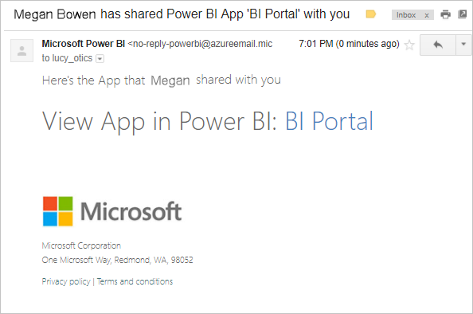
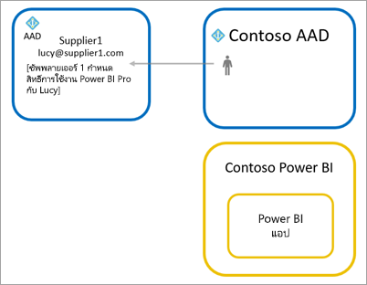

# กระจายเนื้อหา Power BI ไปยังผู้ใช้ที่เป็นผู้เยี่ยมชมจากภายนอกด้วย Azure AD B2BDistribute Power BI content to external guest users with Azure AD B2B

Power BI เปิดใช้งานการแชร์เนื้อหากับผู้ใช้ที่เป็นผู้เยี่ยมชมภายนอกผ่านทาง Azure Active Directory Business-to-business (Azure AD B2B)Power BI enables sharing content with external guest users through Azure Active Directory Business-to-business (Azure AD B2B). เมื่อใช้ Microsoft Azure Active Directory B2B องค์กรของคุณจะเปิดใช้และควบคุมการแชร์กับผู้ใช้ภายนอกในส่วนกลางBy using Azure AD B2B, your organization enables and governs sharing with external users in a central place. ตามค่าเริ่มต้น ผู้เยี่ยมชมภายนอกจะมีประสบการณ์การใช้งานแบบรับชมเท่านั้นBy default, external guests have a consumption-only experience. นอกจากนี้ คุณสามารถอนุญาตผู้ใช้เป็นผู้เยี่ยมชมภายนอกองค์กรของคุณเพื่อแก้ไข และจัดการเนื้อหาภายในองค์กรของคุณได้Additionally, you can allow guest users outside your organization to edit and manage content within your organization.

บทความนี้ให้คำแนะนำเบื้องต้นเกี่ยวกับ Azure AD B2B ใน Power BIThis article provides a basic introduction to Azure AD B2B in Power BI. สำหรับข้อมูล ศึกษา[กระจายเนื้อหา Power BI ให้กับผู้ใช้ที่เป็นผู้เยี่ยมชมภายนอก โดยใช้ Azure Active Directory B2B](../guidance/whitepaper-azure-b2b-power-bi.md)For more information, see [Distribute Power BI content to external guest users using Azure Active Directory B2B](../guidance/whitepaper-azure-b2b-power-bi.md).

## เปิดใช้งานการเข้าถึงEnable access

ตรวจสอบให้แน่ใจว่าคุณเปิดใช้งานคุณลักษณะ [แบ่งปันเนื้อหากับผู้ใช้ภายนอก](service-admin-portal.md#export-and-sharing-settings) ในพอร์ทัลผู้ดูแลระบบ Power BI ก่อนเชิญผู้ใช้ที่เป็นผู้เยี่ยมชมMake sure you enable the [Share content with external users](service-admin-portal.md#export-and-sharing-settings) feature in the Power BI admin portal before inviting guest users. แม้เมื่อเปิดใช้งานตัวเลือกนี้แล้ว ผู้ใช้จะต้องได้รับบทบาท Guest Inviter ใน Azure Active Directory เพื่อเชิญผู้ใช้ที่เป็นผู้เยี่ยมชมEven when this option is enabled, the user must be granted the Guest Inviter role  in Azure Active Directory to invite guest users.

ตัวเลือก [อนุญาตผู้ใช้เป็นผู้เยี่ยมชมภายนอกองค์กรเพื่อแก้ไข และจัดการเนื้อหาภายในองค์กร](service-admin-portal.md#allow-external-guest-users-to-edit-and-manage-content-in-the-organization) ช่วยให้คุณมอบความสามารถของผู้ใช้ที่เป็นผู้เยี่ยมชมดูและสร้างเนื้อหาในพื้นที่ทำงาน รวมถึงการเรียกดู Power BI ขององค์กรของคุณThe option to [allow external guest users to edit and manage content in the organization](service-admin-portal.md#allow-external-guest-users-to-edit-and-manage-content-in-the-organization) lets you give guest users the ability to see and create content in workspaces, including browsing your organization's Power BI.

> [!NOTE]
> การตั้งค่า [แชร์เนื้อหากับผู้ใช้ภายนอก](service-admin-portal.md#export-and-sharing-settings) ควบคุมว่า Power BI อนุญาตการเชิญผู้ใช้ภายนอกไปยังองค์กรของคุณThe [Share content with external users](service-admin-portal.md#export-and-sharing-settings) setting controls whether Power BI allows inviting external users to your organization. หลังจากผู้ใช้ภายนอกยอมรับการเชิญแล้ว พวกเขาจะเปลี่ยนสถานะเป็นผู้ใช้ที่เป็นผู้เยี่ยมชมของ Azure AD B2B ในองค์กรของคุณAfter an external user accepts the invite, they become an Azure AD B2B guest user in your organization. พวกเขาจะปรากฏอยู่ในตัวเลือกบุคคลตลอดประสบการณ์ใน Power BIThey appear in people pickers throughout the Power BI experience. หากการตั้งค่าถูกปิดใช้งานอยู่ ผู้ใช้ที่เป็นผู้เยี่ยมชมในองค์กรของคุณจะยังคงสามารถเข้าถึงรายการใดก็ตามที่พวกเขาได้เคยเข้าถึง และยังคงอยู่ในรายการประสบการณ์ของตัวเลือกบุคคลIf the setting is disabled, existing guest users in your organization continue to have access to any items they already had access to and continue to be listed in people picker experiences. นอกจากนี้ ถ้าผู้ใช้ได้รับการเพิ่มเข้าผ่านวิธีการ[เชิญที่วางแผนไว้](#planned-invites) พวกเขาจะปรากฏในตัวเลือกบุคคลเช่นกันAdditionally, if guests are added through the [planned invite](#planned-invites) approach they will also appear in people pickers. เพื่อป้องกันไม่ให้ผู้ใช้ที่เป็นผู้เยี่ยมชมเข้าถึง Power BI ได้ ให้ใช้นโยบายการเข้าถึงแบบมีเงื่อนไขของ Microsoft Azure Active DirectoryTo prevent guest users from accessing Power BI, use an Azure AD conditional access policy.

## คุณสามารถเชิญใครได้บ้างWho can you invite?

ที่อยู่อีเมลส่วนใหญ่สามารถรองรับการเชิญผู้ใช้แบบผู้เยี่ยมชม ซึ่งรวมถึงบัญชีอีเมลส่วนตัว เช่น gmail.com outlook.com และ hotmail.comMost email addresses are supported for guest user invitations, including personal email accounts like gmail.com, outlook.com, and hotmail.com. ใน Azure AD B2B ที่อยู่เหล่านี้จะเรียกว่า *ข้อมูลประจำตัวเครือข่ายสังคม*Azure AD B2B calls these addresses *social identities*.

คุณไม่สามารถเชิญผู้ใช้ที่เชื่อมโยงกับระบบคลาวด์ของภาครัฐ เช่น [Power BI สำหรับส่วนราชการสหรัฐ](service-govus-overview.md) ได้You can't invite users that are associated with a government cloud, like [Power BI for US Government](service-govus-overview.md).

## เชิญผู้ใช้เป็นผู้เยี่ยมชมInvite guest users

เฉพาะผู้ใช้ที่เป็นผู้เยี่ยมชมเท่านั้นที่ต้องมีคำเชิญเป็นครั้งแรกที่คุณเชิญพวกเขาไปยังองค์กรของคุณGuest users only require invitations the first time you invite them to your organization. หากต้องการเชิญผู้ใช้ ให้ใช้คำเชิญที่วางแผนไว้หรือแบบเฉพาะกิจTo invite users, use planned or ad hoc invites.

หากต้องการใช้คำเชิญเฉพาะกิจ ให้ใช้ความสามารถดังต่อไปนี้:To use ad hoc invites, use the following capabilities:

* การแชร์รายงานและแดชบอร์ดReport and Dashboard sharing
* รายการการเข้าถึงแอปApp access list

คำเชิญเฉพาะกิจไม่ได้รับการสนับสนุนในรายการเข้าถึงพื้นที่ใช้งานAd hoc invites aren't supported in the workspace access list. ใช้[วิธีการคำเชิญที่วางแผน](#planned-invites) เพื่อเพิ่มผู้ใช้เหล่านี้ลงในองค์กรของคุณUse the [planned invites approach](#planned-invites) to add these users to your organization. หลังจากผู้ใช้ภายนอกกลายเป็นผู้เยี่ยมชมในองค์กรของคุณแล้ว ให้เพิ่มพวกเขาลงในรายการเข้าถึงพื้นที่ทำงานAfter the external user becomes a guest in your organization, add them to the workspace access list.

### คำเชิญเข้าร่วมแผนPlanned invites

ใช้คำเชิญเข้าร่วมแผนหากคุณทราบว่าต้องการเชิญผู้ใดUse a planned invite if you know which users to invite. พอร์ทัล Microsoft Azure หรือ PowerShell ช่วยให้คุณสามารถส่งคำเชิญได้The Azure portal or PowerShell enables you to send the invites. คุณต้องได้รับมอบหมายบทบาทผู้ดูแลระบบของจึงจะสามารถเชิญผู้คนได้You must be assigned the user admin role to invite people.

ให้ปฏิบัติตามขั้นตอนเหล่านี้เพื่อส่งคำเชิญในพอร์ทัล AzureFollow these steps to send an invite in the Azure portal.

1. ใน [พอร์ทัล Azure](https://portal.azure.com) เลือก **Azure Active Directory**In the [Azure portal](https://portal.azure.com), select **Azure Active Directory**.

1. ภายใต้ **จัดการ** ให้ **ผู้ใช้** > **ผู้ใช้ทั้งหมด** > **ผู้ใช้ที่เป็นผู้เยี่ยมชมใหม่**Under **Manage**, select **Users** > **All users** > **New guest user**.

    

1. ใส่ **ที่อยู่อีเมล** และ **ข้อความส่วนบุคคล**Enter an **email address** and **personal message**.

    

1. เลือก **เชิญ**Select **Invite**.

หากต้องการเชิญผู้ใช้ที่เป็นผู้เยี่ยมชมมากกว่าหนึ่งราย ให้ใช้ PowerShell หรือสร้างคำเชิญจำนวนมากใน Azure ADTo invite more than one guest user, use PowerShell or create a bulk invite in Azure AD. หากต้องการใช้ PowerShell สำหรับคำเชิญจำนวนมาก ให้ทำตามขั้นตอนใน [บทช่วยสอน: ใช้ PowerShell เพื่อเชิญผู้ใช้งานการทำงานร่วมกันของ Azure AD B2B จำนวนมาก](/azure/active-directory/b2b/bulk-invite-powershell/)To use PowerShell for the bulk invite, follow the steps in [Tutorial: Use PowerShell to bulk invite Azure AD B2B collaboration users](/azure/active-directory/b2b/bulk-invite-powershell/). หากต้องการใช้พอร์ทัล Azure สำหรับการเชิญจำนวนมาก ให้ทำตามขั้นตอนในบทช่วยสอน [: การเชิญผู้ใช้งานการทำงานร่วมกันของ Azure AD B2B จำนวนมาก](/azure/active-directory/b2b/tutorial-bulk-invite/)To use the Azure portal for the bulk invite, follow the steps in [Tutorial: Bulk invite Azure AD B2B collaboration users](/azure/active-directory/b2b/tutorial-bulk-invite/).

ผู้ใช้ที่เป็นผู้เยี่ยมชมต้องเลือก **เริ่มต้น** ในคำเชิญทางอีเมลที่พวกเขาได้รับThe guest user must select **Get Started** in the email invitation they receive. จากนั้นผู้ใช้ที่เป็นผู้เยี่ยมชมจึงจะได้รับการเพิ่มไปยังองค์กรThe guest user is then added to the organization.

### คำเชิญเฉพาะกิจAd hoc invites

หากต้องการเชิญผู้ใช้ภายนอกตลอดเวลา ให้เพิ่มผู้ใช้ภายนอกไปยังแดชบอร์ดหรือรายงานของคุณผ่านคุณลักษณะ หรือแอปที่ใช้ร่วมกันของคุณผ่านทางหน้าการเข้าถึงTo invite an external user at any time, add them to your dashboard or report through the share feature or to your app through the access page. นี่คือตัวอย่างของสิ่งที่ต้องทำเมื่อเชิญผู้ใช้ภายนอกเข้ามาใช้แอปHere is an example of what to do when inviting an external user to use an app.

ผู้ใช้ที่เป็นผู้เยี่ยมชมจะได้รับอีเมลที่ระบุว่าคุณแชร์แอปกับพวกเขาThe guest user gets an email indicating that you shared the app with them.

ผู้ใช้ที่เป็นผู้เยี่ยมชมต้องลงชื่อเข้าใช้ด้วยที่อยู่อีเมลขององค์กรของพวกเขาThe guest user must sign in with their organization email address. พวกเขาจะได้รับพร้อมท์ให้ยอมรับคำเชิญหลังจากลงชื่อเข้าใช้They'll receive a prompt to accept the invitation after signing in. หลังจากลงชื่อเข้าใช้ แอปจะเปิดขึ้นสำหรับผู้ใช้เป็นผู้เยี่ยมชมAfter signing in, the app opens for the guest user. หากต้องการกลับไปยังแอป ผู้ใช้ควรบุ๊กมาร์กลิงก์ หรือบันทึกอีเมลTo return to the app, they should bookmark the link or save the email.

## สิทธิ์การใช้งานLicensing

ผู้ใช้ที่เป็นผู้เยี่ยมชมจำเป็นต้องมีสิทธ์การใช้งานที่ถูกต้องในการดูเนื้อหาที่ใช้ร่วมกันThe guest user must have the proper licensing in place to view the content that you shared. มีสามวิธีในการตรวจสอบให้แน่ใจว่าผู้ใช้มีสิทธิการใช้งานที่ถูกต้อง: ใช้ Power BI Premium, มอบสิทธิการใช้งาน Power BI Pro หรือใช้สิทธิการใช้งาน Power BI Pro ของผู้เยี่ยมชมThere are three ways to make sure the user has a proper license: use Power BI Premium, assign a Power BI Pro license, or use the guest's Power BI Pro license.

[ผู้ใช้ที่เป็นผู้เยี่ยมชมที่สามารถแก้ไขและจัดการเนื้อหาในองค์กร](service-admin-portal.md#allow-external-guest-users-to-edit-and-manage-content-in-the-organization) จำเป็นต้องมีสิทธิ์ใช้งาน Power BI Pro เพื่อสนับสนุนเนื้อหาไปยังพื้นที่ทำงานหรือแบ่งปันเนื้อหากับผู้อื่น[Guest users who can edit and manage content in the organization](service-admin-portal.md#allow-external-guest-users-to-edit-and-manage-content-in-the-organization) need a Power BI Pro license to contribute content to workspaces or share content with others.

### ใช้ Power BI PremiumUse Power BI Premium

การกำหนดพื้นที่ทำงานใน [ความจุของ Power BI Premium](service-premium-what-is.md) จะอนุญาตให้ผู้ใช้ที่เป็นผู้เยี่ยมชมสามารถเข้าใช้แอปได้โดยไม่จำเป็นต้องมีสิทธิ์การใช้งาน Power BI ProAssigning the workspace to [Power BI Premium capacity](service-premium-what-is.md) lets the guest user use the app without requiring a Power BI Pro license. Power BI Premium ยังอนุญาตให้แอปใช้ประโยชน์จากความสามารถอื่น ๆ อีกด้วย เช่น อัตราการรีเฟรชเพิ่ม และขนาดของแบบจำลองขนาดใหญ่Power BI Premium also lets apps take advantage of other capabilities like increased refresh rates and large model sizes.

### กำหนดสิทธิ์การใช้งาน Power BI Pro ให้แก่ผู้ใช้ที่เป็นผู้เยี่ยมชมAssign a Power BI Pro license to guest user

การกำหนดสิทธิ์ใช้งาน Power BI Pro จากองค์กรของคุณให้แก่ผู้ใช้ที่เป็นผู้เยี่ยมชมจะทำให้ผู้ใช้ดังกล่าวสามารถดูเนื้อหาที่แชร์กับพวกเขาได้Assigning a Power BI Pro license from your organization to a guest user lets that guest user view content shared with them. สำหรับข้อมูลเพิ่มเติมเกี่ยวกับวิธีการกำหนดสิทธิ์การใช้งาน ให้ดู [กำหนดสิทธิ์การใช้งานให้ผู้ใช้ในหน้าสิทธิการใช้งาน](/office365/admin/manage/assign-licenses-to-users#assign-licenses-to-users-on-the-licenses-page)For more information about assigning licenses, see [Assign licenses to users on the Licenses page](/office365/admin/manage/assign-licenses-to-users#assign-licenses-to-users-on-the-licenses-page). ก่อนที่จะกำหนดสิทธิ์การใช้งาน Pro ให้แก่ผู้เยี่ยมชม ให้ศึกษา [เว็บไซต์ข้อกำหนดของผลิตภัณฑ์](https://www.microsoft.com/licensing/terms) เพื่อตรวจสอบให้แน่ใจว่าคุณได้ปฏิบัติตามข้อกำหนดของข้อตกลงของคุณกับ MicrosoftBefore assigning Pro licenses to guest users, consult the [Product Terms site](https://www.microsoft.com/licensing/terms) to ensure you're in compliance with the terms of your licensing agreement with Microsoft.

### ผู้ใช้ที่เป็นผู้เยี่ยมชมนำสิทธิ์การใช้งาน Power BI Pro ของพวกเขามาใช้Guest user brings their own Power BI Pro license

ผู้ใช้ที่เป็นผู้เยี่ยมชมอาจมีสิทธิ์ใช้งาน Power BI Pro ที่ได้รับมอบหมายผ่านองค์กรของตนเองอยู่แล้วThe guest user may already have a Power BI Pro license that was assigned to them through their own organization.

## ผู้ใช้ที่เป็นผู้เยี่ยมชมที่สามารถแก้ไข และจัดการเนื้อหาGuest users who can edit and manage content

เมื่อใช้คุณลักษณะ [อนุญาตให้ผู้ใช้ที่เป็นผู้เยี่ยมชมภายนอกแก้ไขและจัดการเนื้อหาในองค์กร](service-admin-portal.md#allow-external-guest-users-to-edit-and-manage-content-in-the-organization) ผู้ใช้ที่เป็นผู้เยี่ยมชมที่ระบุจะได้รับสิทธิการเข้าถึง Power BI ขององค์กรของคุณWhen using the [allow external guest users to edit and manage content in the organization](service-admin-portal.md#allow-external-guest-users-to-edit-and-manage-content-in-the-organization) feature, the specified guest users get additional access to your organization's Power BI. ผู้เยี่ยมชมที่ได้รับอนุญาตสามารถดูเนื้อหาที่พวกเขามีสิทธิ์ได้ อีกทั้งสามารถเข้าถึงหน้าแรก เรียกดูพื้นที่ทำงาน ติดตั้งแอป ตรวจสอบว่าตำแหน่งของพวกเขาในรายการเข้าถึง และมีส่วนร่วมในการสร้างเนื้อหาไปยังพื้นที่ทำงานAllowed guests can see any content that they have permissions for, access Home, browse workspaces, install apps, see where they are on the access list, and contribute content to workspaces. พวกเขาสามารถสร้างหรือเป็นผู้ดูแลระบบของพื้นที่ทำงานที่ใช้ประสบการณ์พื้นที่ทำงานใหม่They can create, or be an Admin of, workspaces that use the new workspace experience. ใช้ข้อจำกัดบางอย่างSome limitations apply. ส่วนข้อควรพิจารณาและขีดจำกัดจะระบุรายการข้อจำกัดเหล่านั้นThe Considerations and Limitations section lists those restrictions.

เพื่อช่วยให้ผู้เยี่ยมชมที่ได้รับอนุญาตลงชื่อเข้าใช้ Power BI ให้ระบุ URL ของผู้เช่าTo help allowed guests sign in to Power BI, provide them with the Tenant URL. เมื่อต้องการค้นหา URL ของผู้เช่า กรุณาทำตามขั้นตอนเหล่านี้To find the tenant URL, follow these steps.

1. ในบริการของ Power BI ในเมนูส่วนหัว เลือกการช่วยเหลือ ( **?** ) จากนั้นเลือก **เกี่ยวกับ Power BI**In the Power BI service, in the header menu, select help (**?**), then select **About Power BI**.

2. ค้นหาค่าที่อยู่ถัดจาก **URL ของผู้เช่า**Look for the value next to **Tenant URL**. แชร์ URL ของผู้เช่ากับผู้ใช้ที่เป็นผู้เยี่ยมชมที่ได้รับอนุญาตของคุณShare the tenant URL with your allowed guest users.

    

## ข้อควรพิจารณาและข้อจำกัดConsiderations and Limitations

* ตามค่าเริ่มต้น Azure AD B2B ภายนอกจะจำกัดผู้เยี่ยมชมในการใช้เนื้อหาเท่านั้นBy default, external Azure AD B2B limits guests to consumption of content only. ผู้เยี่ยมชม Azure AD B2B ภายนอกสามารถดูแอป แดชบอร์ด รายงาน ข้อมูลการส่งออก และสร้างการสมัครใช้งานอีเมลสำหรับแดชบอร์ดและรายงานได้External Azure AD B2B guests can view apps, dashboards, reports, export data and create email subscriptions for dashboards and reports. แต่ไม่สามารถเข้าถึงพื้นที่ทำงาน หรือเผยแพร่เนื้อหาของพวกเขาThey can't access workspaces or publish their own content. เพื่อนำข้อจำกัดเหล่านี้ออก คุณสามารถใช้คุณลักษณะ [อนุญาตให้ผู้ใช้ที่เป็นผู้เยี่ยมชมภายนอกแก้ไขและจัดการเนื้อหาในองค์กร](service-admin-portal.md#allow-external-guest-users-to-edit-and-manage-content-in-the-organization)To remove these restrictions, you can use the [Allow external guest users to edit and manage content in the organization](service-admin-portal.md#allow-external-guest-users-to-edit-and-manage-content-in-the-organization) feature.

* ในการเชิญผู้ใช้ที่เป็นผู้เยี่ยมชม จำเป็นต้องต้องมีสิทธิ์ใช้งาน Power BI ProTo invite guest users, a Power BI Pro license is needed. ผู้ใช้ Pro รุ่นทดลองไม่สามารถเชิญผู้ใช้ที่เป็นผู้เยี่ยมชมใน Power BI ได้Pro Trial users can't invite guest users in Power BI.

* ประสบการณ์บางอย่างไม่พร้อมใช้งานสำหรับ[ผู้ใช้ที่เป็นผู้เยี่ยมชมซึ่งสามารถแก้ไขและจัดการเนื้อหาในองค์กร](service-admin-portal.md#allow-external-guest-users-to-edit-and-manage-content-in-the-organization)Some experiences are not available to [guest users who can edit and manage content in the organization](service-admin-portal.md#allow-external-guest-users-to-edit-and-manage-content-in-the-organization). ในการอัปเดตหรือเผยแพร่รายงาน ผู้ใช้ที่เป็นผู้เยี่ยมชมต้องใช้บริการ Power BI รวมถึงรับข้อมูลเพื่ออัปโหลดไฟล์ Power BI DesktopTo update or publish reports, guest users need to use the Power BI service, including Get Data to upload Power BI Desktop files.  ประสบการณ์การใช้งานต่อไปนี้ไม่ได้รับการสนับสนุน:The following experiences aren't supported:
  * เผยแพร่จาก Power BI desktop ไปยังบริการ Power BI โดยตรงDirect publishing from Power BI desktop to the Power BI service
  * ผู้ใช้ที่เป็นผู้เยี่ยมชมไม่สามารถใช้ Power BI desktop เพื่อเชื่อมต่อกับชุดข้อมูลบริการในบริการ Power BI ได้Guest users can't use Power BI desktop to connect to service datasets in the Power BI service
  * พื้นที่ทำงานแบบคลาสสิกที่ผูกกับ Microsoft 365 GroupsClassic workspaces tied to Microsoft 365 Groups
    * ผู้ใช้ที่เป็นผู้เยี่ยมชมไม่สามารถสร้างหรือเป็นผู้ดูแลระบบของพื้นที่ทำงานเหล่านี้ได้Guest users can't create or be Admins of these workspaces
    * ผู้ใช้ที่เป็นผู้เยี่ยมชมสามารถเป็นสมาชิกได้Guest users can be members
  * การส่งคำเชิญเข้าร่วมเฉพาะกิจไม่ได้รับการสนับสนุนสำหรับรายการการเข้าถึงพื้นที่ทำงานSending ad hoc invites isn't supported for workspace access lists
  * Power BI Publisher สำหรับ Excel ไม่ได้รับการสนับสนุนสำหรับผู้ใช้ที่เป็นผู้เยี่ยมชมPower BI Publisher for Excel isn't supported for guest users
  * ผู้ใช้ที่เป็นผู้เยี่ยมชมไม่สามารถติดตั้ง Power BI Gateway และเชื่อมต่อเกตเวย์กับองค์กรของคุณGuest users can't install a Power BI Gateway and connect it to your organization
  * ผู้ใช้ที่เป็นผู้เยี่ยมชมไม่สามารถติดตั้งแอปที่เผยแพร่ไปยังทั้งองค์กรGuest users can't install apps publish to the entire organization
  * ผู้ใช้ที่เป็นผู้เยี่ยมชมไม่สามารถใช้ สร้าง อัปเดต หรือติดตั้งชุดเนื้อหาองค์กรGuest users can't use, create, update, or install organizational content packs
  * ผู้ใช้ที่เป็นผู้เยี่ยมชมไม่สามารถใช้การวิเคราะห์ใน ExcelGuest users can't use Analyze in Excel
  * ผู้ใช้ที่เป็นผู้เยี่ยมชมไม่สามารถ @mentioned ในการแสดงข้อคิดเห็นGuest users can't be @mentioned in commenting
  * ผู้ใช้ที่เป็นผู้เยี่ยมชมไม่สามารถใช้การสมัครใช้งานGuest users can't use subscriptions
  * ผู้ใช้ที่เป็นผู้เยี่ยมชมที่ใช้ความสามารถนี้ควรมีบัญชีของที่ทำงานหรือโรงเรียนGuest users who use this capability should have a work or school account

* ผู้ใช้ที่เป็นผู้เยี่ยมชมซึ่งใช้ข้อมูลประจำตัวเครือข่ายสังคม จะพบข้อจำกัดมากกว่าเนื่องด้วยข้อจำกัดการลงชื่อเข้าใช้Guest users using social identities will experience more limitations because of sign-in restrictions.
  * พวกเขาสามารถใช้ประสบการณ์การใช้งานในบริการของ Power BI ผ่านเว็บเบราว์เซอร์They can use consumption experiences in the Power BI service through a web browser
  * พวกเขาไม่สามารถใช้แอป Power BI สำหรับอุปกรณ์เคลื่อนที่ได้They can't use the Power BI Mobile apps
  * พวกเขาจะไม่สามารถลงชื่อเข้าใช้ในกรณีที่จำเป็นต้องมีบัญชีที่ทำงานหรือโรงเรียนThey won't be able to sign in where a work or school account is required

* คุณลักษณะนี้ยังไม่มีให้ใช้กับ web part รายงาน Power BI SharePoint OnlineThis feature isn't currently available with the Power BI SharePoint Online report web part.

* มีการตั้งค่า Azure Active Directory ที่สามารถจำกัดสิ่งที่ผู้ใช้ที่เป็นผู้เยี่ยมชมภายนอกสามารถทำได้ภายในองค์กรโดยรวมของคุณThere are Azure Active Directory settings that can limit what external guest users can do within your overall organization. การตั้งค่าเหล่านั้นยังนำไปใช้กับสภาพแวดล้อม Power BI ของคุณด้วยThose settings also apply to your Power BI environment. เอกสารต่อไปนี้อธิบายถึงการตั้งค่า:The following documentation discusses the settings:
  * [จัดการการตั้งค่าการทำงานร่วมกันภายนอกManage External Collaboration Settings](/azure/active-directory/b2b/delegate-invitations#configure-b2b-external-collaboration-settings)
  * [อนุญาตหรือบล็อกคำเชิญให้ผู้ใช้ B2B จากองค์กรที่เฉพาะเจาะจงAllow or block invitations to B2B users from specific organizations](/azure/active-directory/b2b/allow-deny-list)
  * [ใช้การเข้าถึงแบบมีเงื่อนไขเพื่ออนุญาตหรือบล็อกการเข้าถึงUse Conditional Access to allow or block access](/azure/active-directory/conditional-access/concept-conditional-access-cloud-apps)

* คุณสามารถแชร์เนื้อหาจากระบบคลาวด์ของภาครัฐเช่น GCC ไปยังผู้ใช้ระบบคลาวด์เชิงพาณิชย์ภายนอกได้You can share content from a government cloud, like GCC, to an external commercial cloud user. อย่างไรก็ตาม ผู้ใช้ที่เป็นผู้เยี่ยมชมไม่สามารถใช้สิทธิ์การใช้งานของตนเองได้However, the guest user can't use their own license. เนื้อหาต้องอยู่ในความจุที่กำหนดให้กับ Premium เพื่อเปิดใช้งานการเข้าถึงThe content has to be in capacity assigned to Premium to enable access. หรือคุณสามารถกำหนดสิทธิ์การใช้งาน Power BI Pro ให้กับบัญชีผู้เยี่ยมชมได้Or, you can assign a Power BI Pro license to the guest account.

* การแชร์ภายนอกองค์กรของคุณไม่ได้รับการสนับสนุนสำหรับระบบคลาวด์ระดับชาติ เช่น ประเทศเยอรมนีหรืออินสแตนซ์คลาวด์ของจีนSharing outside your organization isn't supported for national clouds, like the Germany or China cloud instances. อย่างได้ก็ตาม สามารถสร้างบัญชีผู้ใช้ในองค์กรของคุณที่ผู้ใช้ภายนอกสามารถใช้เพื่อเข้าถึงเนื้อหาได้Instead, create user accounts in your organization that external users can use to access the content.

* หากคุณแชร์ไปยังผู้ใช้ที่เป็นผู้เยี่ยมชมโดยตรง Power BI จะส่งอีเมลที่มีลิงก์ดังกล่าวให้กับพวกเขาIf you share directly to a guest user, Power BI will send them an email with the link. เพื่อหลีกเลี่ยงการส่งอีเมล ให้เพิ่มผู้ใช้ที่เป็นผู้เยี่ยมชมไปยังกลุ่มความปลอดภัย และแชร์ไปยังกลุ่มความปลอดภัยTo avoid sending an email, add the guest user to a security group and share to the security group.  

## ขั้นตอนถัดไปNext steps

เพื่อศึกษาข้อมูลรายละเอียดเพิ่มเติม รวมถึงวิธีการทำงานของความปลอดภัยระดับแถว โปรดดูที่เอกสารทางเทคนิค: [กระจายเนื้อหา Power BI ไปยังผู้ใช้ซึ่งเป็นผู้เยี่ยมชมจากภายนอกด้วย Azure AD B2B](../guidance/whitepaper-azure-b2b-power-bi.md)For more detailed info, including how row-level security works, check out the whitepaper: [Distribute Power BI content to external guest users using Azure AD B2B](../guidance/whitepaper-azure-b2b-power-bi.md).

สามารถดูข้อมูลเพิ่มเติมเกี่ยวกับ Azure AD B2B ได้ที่ [การทำงานร่วมกันของ Azure AD B2B คืออะไร?](/azure/active-directory/active-directory-b2b-what-is-azure-ad-b2b/)For information about Azure AD B2B, see [What is Azure AD B2B collaboration?](/azure/active-directory/active-directory-b2b-what-is-azure-ad-b2b/).