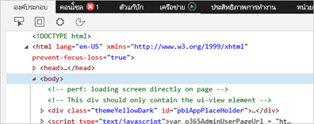
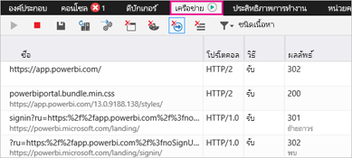
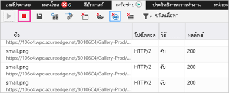
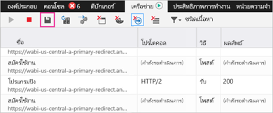

# จับข้อมูลการวินิจฉัยเพิ่มเติมสำหรับ Power BICapture additional diagnostic information for Power BI

บทความนี้ ให้ข้อมูลที่ได้ในการรวบรวมเพิ่มเติมเพื่อการวินิจฉัยจาก เว็บไคลเอ็นต์ Power BIThis article provides instructions for manually collecting additional diagnostic information from the Power BI web client.

1. เรียกดู [Power BI](https://app.powerbi.com) ด้วย Microsoft Edge หรือ Internet ExplorerBrowse to [Power BI](https://app.powerbi.com) with Microsoft Edge or Internet Explorer.

1. กด **F12** เพื่อเปิดเครื่องมือสำหรับนักพัฒนา Microsoft EdgePress **F12** to open the Microsoft Edge developer tools.

   

1. เลือกแท็บ **เครือข่าย** จะแสดงรายการข้อมูลเครือข่ายที่ดักจับได้แล้วSelect the **Network** tab. It will list traffic it has already captured.

   

    คุณสามารถ:You can:

    * เรียกดูภายในหน้าต่าง และจำลองปัญหาใดก็ได้ที่คุณกำลังเจออยู่Browse within the window and reproduce any problem you may come across.

    * ซ่อนและแสดงหน้าต่าง เครื่องมือสำหรับนักพัฒนา ตลอดเวลาระหว่างเซสชัน โดยการกด F12Hide and show the developer tools window at any time during the session by pressing F12.

1. เมื่อต้องหยุดการการสร้างโปรไฟล์เซสซันคุณสามารถเลือกสี่เหลี่ยมสีแดงบนแท็บ **เครือข่าย** ในบริเวณของเครื่องมือสำหรับนักพัฒนาTo stop profiling the session, you can select the red square on the **Network** tab of the developer tools area.

   

1. เลือกไอคอนดิสก์เพื่อส่งออกข้อมูลเป็นไฟล์ที่เก็บถาวรของ HTTP (ฮาร์)Select the diskette icon to export the data as an HTTP Archive (HAR) file.

   

1. ใส่ชื่อไฟล์ และบันทึกไฟล์ HARProvide a file name and save the HAR file.

    ไฟล์ HAR จะประกอบด้วยข้อมูลทั้งหมดเกี่ยวกับคำขอเครือข่าย ระหว่างหน้าต่างเบราว์เซอร์และ Power BI ซึ่งรวมไปถึง:The HAR file will contain all the information about network requests between the browser window and Power BI including:

    * ID กิจกรรมสำหรับการร้องขอแต่ละรายการThe activity IDs for each request.

    * ประทับเวลาที่แม่นยำสำหรับการร้องขอแต่ละรายการThe precise timestamp for each request.

    * ข้อมูลข้อผิดพลาดใดๆที่ส่งกลับไปยังไคลเอ็นต์Any error information returned to the client.

    แฟ้มการติดตามที่ได้ ยังประกอบด้วยข้อมูลที่ใช้เพื่อแสดงภาพบนหน้าจอThis trace will also contain the data used to populate the visuals shown on the screen.

1. คุณสามารถส่งไฟล์ HAR ให้ฝ่ายสนับสนุนสำหรับตรวจสอบYou can provide the HAR file to support for review.

มีคำถามเพิ่มเติมหรือไม่More questions? [ลองถามชุมชน Power BITry asking the Power BI Community](https://community.powerbi.com/)
