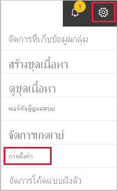

# ปิดบัญชี Power BI ของคุณClose your Power BI account

หากคุณไม่ต้องการใช้ Power BI อีกต่อไป คุณสามารถปิดบัญชี Power BI ของคุณได้If you don't want to use Power BI any longer, you can close your Power BI account.  หลังจากที่ปิดบัญชีของคุณแล้วคุณจะไม่สามารถลงชื่อเข้าใช้ Power BI ได้After you close your account, you can't sign in to Power BI. เช่นเดียวกับที่ระบุในนโยบายการเก็บข้อมูลใน[ข้อกำหนดการใช้งานบริการ Power BI](https://azure.microsoft.com/support/legal/subscription-agreement/) Power BI จะลบข้อมูลลูกค้าใดก็ตาม ก็ตามที่คุณอัปโหลดหรือสร้างขึ้นAlso, as it states in the data retention policy in the [Power BI Service Agreement](https://azure.microsoft.com/support/legal/subscription-agreement/), Power BI deletes any customer data you uploaded or created.

## ผู้ใช้ Power BI รายบุคคลIndividual Power BI users

หากคุณลงทะเบียนใช้งาน Power BI เป็นรายบุคคล คุณสามารถปิดบัญชีของคุณจากหน้าจอ **การตั้งค่า** ได้If you signed up for Power BI as an individual, you can close your account from the **Settings** screen.

1. ใน Power BI เลือกรูปเฟืองมุมขวาด้านบน จากนั้นเลือก **การตั้งค่า**In Power BI, select the gear in the upper right, then select **Settings**.

    

1. ที่แท็บ **ทั่วไป** เลือก **ปิดบัญชี**On the **General** tab, select **Close Account**.

    

1. เลือกเหตุผลในการปิดบัญชี (1)Select a reason for closing the account (1). นอกจากนี้คุณยังสามารถให้ข้อมูลเพิ่มเติมได้เช่นกัน (2)You can also provide further information (2). แล้วเลือก **ปิดบัญชี**Then select **Close account**.

    

1. ยืนยันว่า คุณต้องการปิดบัญชีของคุณConfirm that you want to close your account.

    

    คุณควรจะเห็นการยืนยันว่ามีการปิดบัญชีของคุณแล้วYou should see a confirmation that Power BI closed your account. คุณสามารถเปิดบัญชีของคุณอีกครั้งจากที่นี่หากมีความจำเป็นYou can reopen your account from here if necessary.

    

## ผู้ใช้ที่ได้รับการจัดการManaged users

หากองค์กรของคุณเป็นผู้ลงทะเบียนใช้งาน Power BI ให้แก่คุณ โปรดติดต่อผู้ดูแลระบบของคุณ ขอให้ผู้ดูแลยกเลิกการมอบสิทธิ์การใช้งานจากบัญชีของคุณIf your organization signed you up for Power BI, contact your admin. Ask them to unassign the license from your account.

มีคำถามเพิ่มเติมหรือไม่More questions? [ลองถามชุมชน Power BITry asking the Power BI Community](https://community.powerbi.com/)