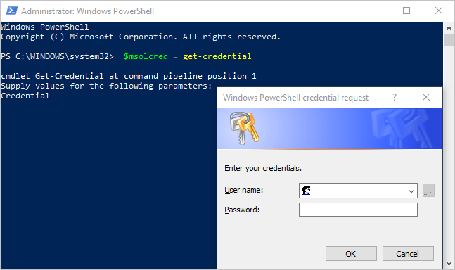

# <a name="administering-power-bi---frequently-asked-questions-faq"></a><span data-ttu-id="ebcbb-103">การจัดการ Power BI - คำถามที่ถามบ่อย (FAQ)</span><span class="sxs-lookup"><span data-stu-id="ebcbb-103">Administering Power BI - frequently asked questions (FAQ)</span></span>

<span data-ttu-id="ebcbb-104">บทความนี้ตอบคำถามที่ถามบ่อยสำหรับการดูแลระบบ Power BI</span><span class="sxs-lookup"><span data-stu-id="ebcbb-104">This article addresses frequently asked questions for Power BI administration.</span></span> <span data-ttu-id="ebcbb-105">สำหรับภาพรวมของการดูแลระบบ Power BI ดู[การดูแลระบบ Power BI คืออะไร?](service-admin-administering-power-bi-in-your-organization.md)</span><span class="sxs-lookup"><span data-stu-id="ebcbb-105">For an overview of the Power BI administration, see [What is Power BI administration?](service-admin-administering-power-bi-in-your-organization.md).</span></span>

## <a name="whats-in-this-article"></a><span data-ttu-id="ebcbb-106">สิ่งที่อยู่ในบทความนี้</span><span class="sxs-lookup"><span data-stu-id="ebcbb-106">What's in this article</span></span>

### <a name="sign-up-for-power-bi-section"></a><span data-ttu-id="ebcbb-107">ลงทะเบียนใช้งานส่วน Power BI</span><span class="sxs-lookup"><span data-stu-id="ebcbb-107">Sign up for Power BI section</span></span>

* [<span data-ttu-id="ebcbb-108">การใช้ PowerShell</span><span class="sxs-lookup"><span data-stu-id="ebcbb-108">Using PowerShell</span></span>](#using-powershell)
* [<span data-ttu-id="ebcbb-109">ผู้ใช้สามารถลงทะเบียนเข้าใช้ Power BI ได้อย่างไร?</span><span class="sxs-lookup"><span data-stu-id="ebcbb-109">How do users sign up for Power BI?</span></span>](#how-do-users-sign-up-for-power-bi)
* [<span data-ttu-id="ebcbb-110">ผู้ใช้แต่ละคนในองค์กรของฉันจะลงทะเบียนได้อย่างไร?</span><span class="sxs-lookup"><span data-stu-id="ebcbb-110">How do individual users in my organization sign up?</span></span>](#how-do-individual-users-in-my-organization-sign-up)
* [<span data-ttu-id="ebcbb-111">ฉันจะป้องกันไม่ให้ผู้ใช้เข้าร่วมองค์กรที่มีอยู่ของฉันได้อย่างไร?</span><span class="sxs-lookup"><span data-stu-id="ebcbb-111">How can I prevent users from joining my existing organization?</span></span>](#how-can-i-prevent-users-from-joining-my-existing-microsoft-365-tenant)
* [<span data-ttu-id="ebcbb-112">ฉันจะอนุญาตให้ผู้ใช้สามารถเข้าร่วมองค์กรที่มีอยู่ของฉันได้อย่างไร?</span><span class="sxs-lookup"><span data-stu-id="ebcbb-112">How can I allow users to join my existing organization?</span></span>](#how-can-i-allow-users-to-join-my-existing-microsoft-365-tenant)
* [<span data-ttu-id="ebcbb-113">ฉันจะตรวจพิสูจน์ได้อย่างไรถ้าฉันมีบล็อกในผู้เช่า?</span><span class="sxs-lookup"><span data-stu-id="ebcbb-113">How do I check if I have the block on in the tenant?</span></span>](#how-do-i-check-if-i-have-the-block-on-in-the-tenant)
* [<span data-ttu-id="ebcbb-114">ฉันจะป้องกันไม่ให้ผู้ใช้ปัจจุบันของฉันเริ่มใช้ Power BI ได้อย่างไร?</span><span class="sxs-lookup"><span data-stu-id="ebcbb-114">How can I prevent my existing users from starting to use Power BI?</span></span>](#how-can-i-prevent-my-existing-users-from-starting-to-use-power-bi)
* [<span data-ttu-id="ebcbb-115">ฉันจะอนุญาตให้ผู้ใช้ปัจจุบันของฉันลงทะเบียนสำหรับ Power BI ได้อย่างไร?</span><span class="sxs-lookup"><span data-stu-id="ebcbb-115">How can I allow my existing users to sign up for Power BI?</span></span>](#how-can-i-allow-my-existing-users-to-sign-up-for-power-bi)

### <a name="administration-of-power-bi-section"></a><span data-ttu-id="ebcbb-116">ส่วนการดูแลระบบของ Power BI</span><span class="sxs-lookup"><span data-stu-id="ebcbb-116">Administration of Power BI section</span></span>

* [<span data-ttu-id="ebcbb-117">วิธีนี้จะเปลี่ยนวิธีที่ฉันจัดการข้อมูลประจำตัวสำหรับผู้ใช้ต่าง ๆ ในองค์กรของฉันในปัจจุบันได้อย่างไร?</span><span class="sxs-lookup"><span data-stu-id="ebcbb-117">How will this change the way I manage identities for users in my organization today?</span></span>](#how-will-this-change-the-way-i-manage-identities-for-users-in-my-organization-today)
* [<span data-ttu-id="ebcbb-118">เราจะจัดการกับ Power BI ได้อย่างไร?</span><span class="sxs-lookup"><span data-stu-id="ebcbb-118">How do we manage Power BI?</span></span>](#how-do-we-manage-power-bi)
* [<span data-ttu-id="ebcbb-119">อะไรคือกระบวนการจัดการผู้เช่าที่สร้างโดย Microsoft สำหรับผู้ใช้ของฉัน?</span><span class="sxs-lookup"><span data-stu-id="ebcbb-119">What is the process to manage a tenant created by Microsoft for my users?</span></span>](#what-is-the-process-to-manage-a-tenant-created-by-microsoft-for-my-users)
* [<span data-ttu-id="ebcbb-120">ถ้าฉันมีหลายโดเมน ฉันสามารถควบคุมผู้เช่า Microsoft 365 ที่มีการเพิ่มผู้ใช้เข้าไปได้อย่างไร?</span><span class="sxs-lookup"><span data-stu-id="ebcbb-120">If I have multiple domains, can I control the Microsoft 365 tenant that users get added to?</span></span>](#if-i-have-multiple-domains-can-i-control-the-microsoft-365-tenant-that-users-get-added-to)
* [<span data-ttu-id="ebcbb-121">ฉันจะลบ Power BI สำหรับผู้ใช้ที่ลงทะเบียนแล้วได้อย่างไร?</span><span class="sxs-lookup"><span data-stu-id="ebcbb-121">How do I remove Power BI for users that already signed up?</span></span>](#how-do-i-remove-power-bi-for-users-that-already-signed-up)
* [<span data-ttu-id="ebcbb-122">ฉันจะทราบได้อย่างไรเมื่อมีผู้ใช้ใหม่เข้าร่วมในผู้เช่าของฉัน?</span><span class="sxs-lookup"><span data-stu-id="ebcbb-122">How do I know when new users have joined my tenant?</span></span>](#how-do-i-know-when-new-users-have-joined-my-tenant)
* [<span data-ttu-id="ebcbb-123">ฉันควรเตรียมพร้อมสำหรับสิ่งอื่น ๆ เพิ่มเติมอีกหรือไม่?</span><span class="sxs-lookup"><span data-stu-id="ebcbb-123">Are there any additional things I should prepare for?</span></span>](#are-there-any-additional-things-i-should-prepare-for)
* [<span data-ttu-id="ebcbb-124">ผู้เช่า Power BI ของฉันอยู่ที่ไหน?</span><span class="sxs-lookup"><span data-stu-id="ebcbb-124">Where is my Power BI tenant located?</span></span>](#where-is-my-power-bi-tenant-located)
* <span data-ttu-id="ebcbb-125">[Power BI SLA (ข้อตกลงระดับบริการ [Service Level Agreement]) คืออะไร?](#what-is-the-power-bi-sla)</span><span class="sxs-lookup"><span data-stu-id="ebcbb-125">[What is the Power BI SLA (Service Level Agreement)?](#what-is-the-power-bi-sla)</span></span>
* [<span data-ttu-id="ebcbb-126">Power BI จัดการกับความพร้อมใช้งานสูงและการเฟลโอเวอร์ได้อย่างไร</span><span class="sxs-lookup"><span data-stu-id="ebcbb-126">How does Power BI handle high availability and failover?</span></span>](#how-does-power-bi-handle-high-availability-and-failover)

### <a name="security-in-power-bi-section"></a><span data-ttu-id="ebcbb-127">ส่วนการรักษาความปลอดภัยใน Power BI</span><span class="sxs-lookup"><span data-stu-id="ebcbb-127">Security in Power BI section</span></span>

* [<span data-ttu-id="ebcbb-128">Power BI ตรงตามข้อกำหนดการปฏิบัติตามกฎระเบียบของชาติ ภูมิภาค และข้อกำหนดเฉพาะสำหรับอุตสาหกรรมหรือไม่?</span><span class="sxs-lookup"><span data-stu-id="ebcbb-128">Does Power BI meet national, regional, and industry-specific compliance requirements?</span></span>](#does-power-bi-meet-national-regional-and-industry-specific-compliance-requirements)
* [<span data-ttu-id="ebcbb-129">การรักษาความปลอดภัยทำงานอย่างไรใน Power BI?</span><span class="sxs-lookup"><span data-stu-id="ebcbb-129">How does security work in Power BI?</span></span>](#how-does-security-work-in-power-bi)

## <a name="sign-up-for-power-bi"></a><span data-ttu-id="ebcbb-130">ลงทะเบียนใช้งาน Power BI</span><span class="sxs-lookup"><span data-stu-id="ebcbb-130">Sign up for Power BI</span></span>

### <a name="using-powershell"></a><span data-ttu-id="ebcbb-131">ใช้ PowerShell</span><span class="sxs-lookup"><span data-stu-id="ebcbb-131">Using PowerShell</span></span>

<span data-ttu-id="ebcbb-132">บางขั้นตอนในส่วนนี้จำเป็นต้องมีสคริปต์ Windows PowerShell</span><span class="sxs-lookup"><span data-stu-id="ebcbb-132">Some of the procedures in this section require Windows PowerShell scripts.</span></span> <span data-ttu-id="ebcbb-133">หากคุณไม่คุ้นเคยกับ PowerShell เราขอแนะนำ [คู่มือเริ่มต้นใช้งาน PowerShell](/powershell/scripting/overview)</span><span class="sxs-lookup"><span data-stu-id="ebcbb-133">If you're not familiar with PowerShell, we recommend the [PowerShell getting started guide](/powershell/scripting/overview).</span></span> <span data-ttu-id="ebcbb-134">หากต้องการเรียกใช้สคริปต์ ก่อนอื่นให้ติดตั้งเวอร์ชัน 64 บิตล่าสุดของ [Azure Active Directory PowerShell สำหรับกราฟ](/powershell/azure/active-directory/overview)</span><span class="sxs-lookup"><span data-stu-id="ebcbb-134">To run the scripts, first install the latest 64-bit version of the [Azure Active Directory PowerShell for Graph](/powershell/azure/active-directory/overview).</span></span>

### <a name="how-do-users-sign-up-for-power-bi"></a><span data-ttu-id="ebcbb-135">ผู้ใช้จะลงทะเบียนสำหรับ Power BI ได้อย่างไร?</span><span class="sxs-lookup"><span data-stu-id="ebcbb-135">How do users sign up for Power BI?</span></span>

<span data-ttu-id="ebcbb-136">ในฐานะผู้ดูแลระบบ Microsoft 365 คุณสามารถลงทะเบียนใช้งาน Power BI ผ่าน [เว็บไซต์ Power BI](https://powerbi.microsoft.com) หรือหน้า [บริการสั่งซื้อ](https://admin.microsoft.com/AdminPortal/Home#/catalog) บนศูนย์การจัดการ Microsoft 365 ได้</span><span class="sxs-lookup"><span data-stu-id="ebcbb-136">As a Microsoft 365 admin, you can sign up for Power BI through the [Power BI web site](https://powerbi.microsoft.com) or the [Purchase services](https://admin.microsoft.com/AdminPortal/Home#/catalog) page on the Microsoft 365 admin center.</span></span> <span data-ttu-id="ebcbb-137">เมื่อผู้ดูแลระบบ Microsoft 365 ลงทะเบียนสำหรับ Power BI พวกเขาสามารถกำหนดสิทธิ์การใช้งานของผู้ใช้ต่าง ๆ ที่ควรมีสิทธิ์เข้าใช้งานได้</span><span class="sxs-lookup"><span data-stu-id="ebcbb-137">When a Microsoft 365 admin signs up for Power BI, they can assign user licenses to users who should have access.</span></span>

<span data-ttu-id="ebcbb-138">นอกจากนี้ ผู้ใช้งานแต่ละคนในองค์กรของคุณอาจสามารถลงทะเบียนสำหรับ Power BI ผ่าน[เว็บไซต์ Power BI](https://powerbi.microsoft.com)ได้</span><span class="sxs-lookup"><span data-stu-id="ebcbb-138">Additionally, individual users in your organization may be able to sign up for Power BI through the [Power BI web site](https://powerbi.microsoft.com).</span></span> <span data-ttu-id="ebcbb-139">เมื่อผู้ใช้ในองค์กรของคุณลงทะเบียนสำหรับ Power BI จะมีการกำหนดสิทธิ์การใช้งาน Power BI ให้ผู้ใช้รายนั้นโดยอัตโนมัติ</span><span class="sxs-lookup"><span data-stu-id="ebcbb-139">When a user in your organization signs up for Power BI, the service automatically assigns a Power BI license to the user.</span></span> <span data-ttu-id="ebcbb-140">สามารถดูข้อมูลเพิ่มเติมได้ที่ [ลงทะเบียนใช้งาน Power BI เป็นรายบุคคล](../fundamentals/service-self-service-signup-for-power-bi.md) และ [สิทธิ์การใช้งาน Power BI ในองค์กรของคุณ](service-admin-licensing-organization.md)</span><span class="sxs-lookup"><span data-stu-id="ebcbb-140">For more info, see [Signing up for Power BI as an individual](../fundamentals/service-self-service-signup-for-power-bi.md) and [Power BI licensing in your organization](service-admin-licensing-organization.md).</span></span>

### <a name="how-do-individual-users-in-my-organization-sign-up"></a><span data-ttu-id="ebcbb-141">ผู้ใช้แต่ละคนในองค์กรของฉันจะลงทะเบียนได้อย่างไร?</span><span class="sxs-lookup"><span data-stu-id="ebcbb-141">How do individual users in my organization sign up?</span></span>

<span data-ttu-id="ebcbb-142">มีสามสถานการณ์ที่อาจนำไปใช้กับผู้ใช้ในองค์กรของคุณ:</span><span class="sxs-lookup"><span data-stu-id="ebcbb-142">There are three scenarios that might apply to users in your organization:</span></span>

* <span data-ttu-id="ebcbb-143">**สถานการณ์ที่ 1**: องค์กรของคุณมีสภาพแวดล้อม Microsoft 365 อยู่แล้ว และผู้ใช้ที่ลงทะเบียนใช้งาน Power BI มีบัญชี Microsoft 365 อยู่แล้ว</span><span class="sxs-lookup"><span data-stu-id="ebcbb-143">**Scenario 1**: Your organization already has an existing Microsoft 365 environment, and the user signing up for Power BI already has a Microsoft 365 account.</span></span>
    <span data-ttu-id="ebcbb-144">ในสถานการณ์นี้ หากผู้ใช้มีบัญชีที่ทำงานหรือบัญชีโรงเรียนอยู่แล้วในผู้เช่า (ตัวอย่างเช่น contoso.com) แต่ยังไม่มี Power BI Microsoft จะเพียงแค่เปิดใช้งานแผน Power BI (ฟรี) สำหรับบัญชีนั้น</span><span class="sxs-lookup"><span data-stu-id="ebcbb-144">In this scenario, if a user already has a work or school account in the tenant (for example, contoso.com) but doesn't yet have Power BI, Microsoft simply activates the Power BI (free) plan for that account.</span></span> <span data-ttu-id="ebcbb-145">ผู้ใช้จะได้รับแจ้งเกี่ยวกับวิธีการใช้บริการของ Power BI โดยอัตโนมัติ</span><span class="sxs-lookup"><span data-stu-id="ebcbb-145">The user is automatically notified with info on how to use the Power BI service.</span></span>

* <span data-ttu-id="ebcbb-146">**สถานการณ์ที่ 2**: องค์กรของคุณมีสภาพแวดล้อม Microsoft 365 อยู่แล้ว แต่ผู้ใช้ที่ลงทะเบียนใช้งาน Power BI ไม่มีบัญชี Microsoft 365</span><span class="sxs-lookup"><span data-stu-id="ebcbb-146">**Scenario 2**: Your organization has an existing Microsoft 365 environment, but the user signing up for Power BI doesn’t have a Microsoft 365 account.</span></span>
    <span data-ttu-id="ebcbb-147">ในสถานการณ์นี้ ผู้ใช้มีที่อยู่อีเมลในโดเมนขององค์กรของคุณ (ตัวอย่างเช่น contoso.com) แต่ยังไม่มีบัญชีผู้ใช้ Microsoft 365</span><span class="sxs-lookup"><span data-stu-id="ebcbb-147">In this scenario, the user has an email address in your organization’s domain (for example, contoso.com) but doesn't yet have a Microsoft 365 account.</span></span> <span data-ttu-id="ebcbb-148">ในกรณีนี้ ผู้ใช้สามารถลงทะเบียนใช้งาน Power BI ได้ และจะได้รับบัญชีโดยอัตโนมัติ</span><span class="sxs-lookup"><span data-stu-id="ebcbb-148">In this case, the user can sign up for Power BI and is automatically given an account.</span></span> <span data-ttu-id="ebcbb-149">การดำเนินการนี้จะช่วยให้ผู้ใช้สามารถเข้าถึงบริการของ Power BI ได้</span><span class="sxs-lookup"><span data-stu-id="ebcbb-149">This action lets the user access the Power BI service.</span></span> <span data-ttu-id="ebcbb-150">ตัวอย่างเช่น หากพนักงานชื่อว่า Nancy ใช้อีเมลที่ทำงานของตน (เช่น nancy@contoso.com) เพื่อลงทะเบียน Microsoft จะเพิ่ม Nancy เป็นผู้ใช้ในสภาพแวดล้อม Microsoft 365 ของ Contoso และเปิดใช้งาน Power BI สำหรับบัญชีนั้นโดยอัตโนมัติ</span><span class="sxs-lookup"><span data-stu-id="ebcbb-150">For example, if an employee named Nancy uses their work email address (like nancy@contoso.com) to sign up, Microsoft automatically adds Nancy as a user in Contoso’s Microsoft 365 environment and activates Power BI for that account.</span></span>

* <span data-ttu-id="ebcbb-151">**สถานการณ์ที่ 3**: องค์กรของคุณไม่มีสภาพแวดล้อม Microsoft 365 ที่เชื่อมต่อกับโดเมนอีเมลของคุณ</span><span class="sxs-lookup"><span data-stu-id="ebcbb-151">**Scenario 3**: Your organization doesn't have a Microsoft 365 environment connected to your email domain.</span></span>
    <span data-ttu-id="ebcbb-152">ไม่มีการดำเนินการดูแลระบบที่องค์กรของคุณเพื่อใช้ประโยชน์จาก Power BI</span><span class="sxs-lookup"><span data-stu-id="ebcbb-152">There are no administrative actions required for your organization to take advantage of Power BI.</span></span> <span data-ttu-id="ebcbb-153">บริการจะเพิ่มผู้ใช้ไปยังไดเรกทอรีผู้ใช้ระบบคลาวด์รายใหม่</span><span class="sxs-lookup"><span data-stu-id="ebcbb-153">The service adds users to a new, cloud-only user directory.</span></span> <span data-ttu-id="ebcbb-154">คุณยังสามารถเลือกที่จะเป็นผู้ดูแลระบบส่วนกลางของ Microsoft 365 สำหรับผู้เช่าและจัดการผู้เช่าได้</span><span class="sxs-lookup"><span data-stu-id="ebcbb-154">You can also choose to take over as the Microsoft 365 Global admin for the tenant and manage them.</span></span>

> [!IMPORTANT]
> <span data-ttu-id="ebcbb-155">หากองค์กรของคุณมีหลายโดเมนอีเมล และคุณต้องการให้ส่วนขยายที่อยู่อีเมลทั้งหมดอยู่ในผู้เช่าเดียวกัน เพิ่มโดเมนที่อยู่อีเมลทั้งหมดไปยังผู้เช่า Azure Active Directory ก่อนที่ผู้ใช้จะลงทะเบียน</span><span class="sxs-lookup"><span data-stu-id="ebcbb-155">If your organization has multiple email domains and you prefer all email address extensions to be in the same tenant, add all email address domains to an Azure Active Directory tenant before any users sign up.</span></span> <span data-ttu-id="ebcbb-156">เมื่อคุณสร้างผู้ใช้แล้ว ไม่มีกลไกอัตโนมัติใดในการย้ายผู้ใช้ไปทั่วผู้เช่า</span><span class="sxs-lookup"><span data-stu-id="ebcbb-156">Once you've created users, there's no automated mechanism to move users across tenants.</span></span> <span data-ttu-id="ebcbb-157">สำหรับข้อมูลเพิ่มเติมเกี่ยวกับกระบวนการนี้ สามารถดูได้ที่ [หากฉันมีหลายโดเมน ฉันสามารถควบคุมผู้เช่า Microsoft 365 ที่มีการเพิ่มผู้ใช้เข้าไปได้หรือไม่?](#if-i-have-multiple-domains-can-i-control-the-microsoft-365-tenant-that-users-get-added-to) ภายหลังในบทความนี้ และ [เพิ่มโดเมนของคุณไปยัง Microsoft 365](/office365/admin/setup/add-domain/)</span><span class="sxs-lookup"><span data-stu-id="ebcbb-157">For more info on this process, see [If I have multiple domains, can I control the Microsoft 365 tenant that users get added to?](#if-i-have-multiple-domains-can-i-control-the-microsoft-365-tenant-that-users-get-added-to) later in this article and [Add a domain to Microsoft 365](/office365/admin/setup/add-domain/).</span></span>

### <a name="how-can-i-prevent-users-from-joining-my-existing-microsoft-365-tenant"></a><span data-ttu-id="ebcbb-158">ฉันจะป้องกันไม่ให้ผู้ใช้เข้าร่วมกับผู้เช่า Microsoft 365 ของฉันที่มีอยู่ได้อย่างไร?</span><span class="sxs-lookup"><span data-stu-id="ebcbb-158">How can I prevent users from joining my existing Microsoft 365 tenant?</span></span>

<span data-ttu-id="ebcbb-159">มีหลายขั้นตอนที่คุณสามารถใช้ได้ในฐานะผู้ดูแลระบบส่วนกลาง เพื่อป้องกันไม่ให้ผู้ใช้รวมกับผู้เช่า Microsoft 365 ของคุณที่มีอยู่ได้</span><span class="sxs-lookup"><span data-stu-id="ebcbb-159">There are steps you can take, as a global admin, to prevent users from joining your existing Microsoft 365 tenant.</span></span> <span data-ttu-id="ebcbb-160">หากคุณบล็อกการเข้าถึง ความพยายามของผู้ใช้ในการลงทะเบียนจะล้มเหลว และข้อความจะปรากฏขึ้น ซึ่งแจ้งให้พวกเขาติดต่อผู้ดูแลระบบขององค์กร คุณไม่ต้องทำซ้ำกระบวนการนี้หากคุณได้ปิดใช้งานการแจกจ่ายสิทธิ์การใช้งานโดยอัตโนมัติแล้ว (เช่น Office 365 เพื่อการศึกษาสำหรับนักเรียน, คณะ และเจ้าหน้าที่)</span><span class="sxs-lookup"><span data-stu-id="ebcbb-160">If you block access, users’ attempts to sign up fail, and a message appears that directs them to contact their organization’s admin. You don't need to repeat this process if you have already disabled automatic license distribution (for example, through Office 365 for Education for Students, Faculty, and Staff).</span></span>

<span data-ttu-id="ebcbb-161">ใช้สคริปต์ PowerShell ต่อไปนี้เพื่อป้องกันไม่ให้ผู้ใช้ใหม่เข้าร่วมผู้เช่าที่ได้รับการจัดการ</span><span class="sxs-lookup"><span data-stu-id="ebcbb-161">Use the following PowerShell script to prevent new users from joining a managed tenant.</span></span> <span data-ttu-id="ebcbb-162">([เรียนรู้เพิ่มเติมเกี่ยวกับ PowerShell][1])</span><span class="sxs-lookup"><span data-stu-id="ebcbb-162">([Learn more about PowerShell][1].)</span></span>

```powershell
$msolcred = get-credential
connect-msolservice -credential $msolcred

Set-MsolCompanySettings -AllowEmailVerifiedUsers $false
```

> [!NOTE]
> <span data-ttu-id="ebcbb-163">การบล็อกการเข้าถึงจะป้องกันไม่ให้ผู้ใช้ใหม่ในองค์กรของคุณลงทะเบียนใช้งาน Power BI</span><span class="sxs-lookup"><span data-stu-id="ebcbb-163">Blocking access prevents new users in your organization from signing up for Power BI.</span></span> <span data-ttu-id="ebcbb-164">ผู้ใช้ที่ลงทะเบียนใช้งาน Power BI ก่อนการปิดใช้งานการลงทะเบียนใหม่สำหรับองค์กรของคุณ จะยังคงมีสิทธิ์ในการใช้งานอยู่</span><span class="sxs-lookup"><span data-stu-id="ebcbb-164">Users that sign up for Power BI prior to disabling new signups for your organization still retain their licenses.</span></span> <span data-ttu-id="ebcbb-165">หากต้องการเอาผู้ใช้ออก ดู [ฉันจะลบ Power BI สำหรับผู้ใช้ที่ลงทะเบียนแล้วได้อย่างไร?](#how-do-i-remove-power-bi-for-users-that-already-signed-up) ภายหลังในบทความนี้</span><span class="sxs-lookup"><span data-stu-id="ebcbb-165">To remove a user, see [How do I remove Power BI for users that already signed up?](#how-do-i-remove-power-bi-for-users-that-already-signed-up) later in this article.</span></span>

### <a name="how-can-i-allow-users-to-join-my-existing-microsoft-365-tenant"></a><span data-ttu-id="ebcbb-166">ฉันจะอนุญาตให้ผู้ใช้เข้าร่วมกับผู้เช่า Microsoft 365 ของฉันที่มีอยู่ได้อย่างไร?</span><span class="sxs-lookup"><span data-stu-id="ebcbb-166">How can I allow users to join my existing Microsoft 365 tenant?</span></span>

<span data-ttu-id="ebcbb-167">ใช้สคริปต์ PowerShell ต่อไปนี้เพื่ออนุญาตให้ผู้ใช้รายใหม่เข้าร่วมผู้เช่าที่ได้รับการจัดการ</span><span class="sxs-lookup"><span data-stu-id="ebcbb-167">Use the following PowerShell script to let new users join a managed tenant.</span></span> <span data-ttu-id="ebcbb-168">([เรียนรู้เพิ่มเติมเกี่ยวกับ PowerShell][1])</span><span class="sxs-lookup"><span data-stu-id="ebcbb-168">([Learn more about PowerShell][1].)</span></span>

```powershell
$msolcred = get-credential
connect-msolservice -credential $msolcred

Set-MsolCompanySettings -AllowEmailVerifiedUsers $true
```

### <a name="how-do-i-check-if-i-have-the-block-on-in-the-tenant"></a><span data-ttu-id="ebcbb-169">ฉันจะตรวจสอบได้อย่างไรถ้าฉันมีบล็อกในผู้เช่า?</span><span class="sxs-lookup"><span data-stu-id="ebcbb-169">How do I check if I have the block on in the tenant?</span></span>

<span data-ttu-id="ebcbb-170">ใช้สคริปต์ PowerShell ต่อไปนี้เพื่อตรวจสอบการตั้งค่า</span><span class="sxs-lookup"><span data-stu-id="ebcbb-170">Use the following PowerShell script to check settings.</span></span> <span data-ttu-id="ebcbb-171">*AllowEmailVerifiedUsers* ควรเป็นเท็จ</span><span class="sxs-lookup"><span data-stu-id="ebcbb-171">*AllowEmailVerifiedUsers* should be false.</span></span> <span data-ttu-id="ebcbb-172">([เรียนรู้เพิ่มเติมเกี่ยวกับ PowerShell][1])</span><span class="sxs-lookup"><span data-stu-id="ebcbb-172">([Learn more about PowerShell][1].)</span></span>

```powershell
$msolcred = get-credential
connect-msolservice -credential $msolcred

Get-MsolCompanyInformation | fl allow*
```

### <a name="how-can-i-prevent-my-existing-users-from-starting-to-use-power-bi"></a><span data-ttu-id="ebcbb-173">ฉันจะป้องกันไม่ให้ผู้ใช้ปัจจุบันของฉันเริ่มใช้ Power BI ได้อย่างไร?</span><span class="sxs-lookup"><span data-stu-id="ebcbb-173">How can I prevent my existing users from starting to use Power BI?</span></span>

<span data-ttu-id="ebcbb-174">การตั้งค่า Azure AD ที่ควบคุมสิ่งนี้คือ **AllowAdHocSubscriptions**</span><span class="sxs-lookup"><span data-stu-id="ebcbb-174">The Azure AD setting that controls this is **AllowAdHocSubscriptions**.</span></span> <span data-ttu-id="ebcbb-175">ผู้เช่าส่วนใหญ่จะตั้งค่านี้เป็น *จริง* ซึ่งหมายความว่าถูกเปิดใช้งาน</span><span class="sxs-lookup"><span data-stu-id="ebcbb-175">Most tenants have this set to *true*, which means it's enabled.</span></span> <span data-ttu-id="ebcbb-176">หากคุณซื้อ Power BI ผ่านคู่ค้า อาจมีการตั้งค่าสคริปต์เป็น *เท็จ* ซึ่งหมายความว่าถูกปิดใช้งาน</span><span class="sxs-lookup"><span data-stu-id="ebcbb-176">If you acquired Power BI through a partner, this may be set to *false*, which means it's disabled.</span></span>

<span data-ttu-id="ebcbb-177">ใช้สคริปต์ PowerShell ต่อไปนี้เพื่อปิดใช้งานการสมัครใช้งานเฉพาะกิจ ([เรียนรู้เพิ่มเติมเกี่ยวกับ PowerShell][1])</span><span class="sxs-lookup"><span data-stu-id="ebcbb-177">Use the following PowerShell script to disable ad hoc subscriptions.([Learn more about PowerShell][1].)</span></span>

1. <span data-ttu-id="ebcbb-178">ลงชื่อเข้าใช้ Azure Active Directory โดยใช้ข้อมูลประจำตัวสำหรับ Microsoft 365 ของคุณ</span><span class="sxs-lookup"><span data-stu-id="ebcbb-178">Sign into Azure Active Directory using your Microsoft 365 credentials.</span></span> <span data-ttu-id="ebcbb-179">บรรทัดแรกของข้อความสคริปต์ PowerShell ต่อไปนี้ปรากฏขึ้นเพื่อให้คุณใส่ข้อมูลประจำตัวของคุณ</span><span class="sxs-lookup"><span data-stu-id="ebcbb-179">The first line of the following PowerShell script prompts you for your credentials.</span></span> <span data-ttu-id="ebcbb-180">บรรทัดที่สองจะเชื่อมต่อกับ Azure Active Directory</span><span class="sxs-lookup"><span data-stu-id="ebcbb-180">The second line connects to Azure Active Directory.</span></span>

    ```powershell
     $msolcred = get-credential
     connect-msolservice -credential $msolcred
    ```

   

1. <span data-ttu-id="ebcbb-182">เมื่อคุณลงชื่อเข้าใช้ ให้ออกคำสั่งต่อไปนี้เพื่อดูวิธีการที่ผู้เช่าของคุณตั้งค่าไว้ในขณะนี้</span><span class="sxs-lookup"><span data-stu-id="ebcbb-182">Once you sign in, run the following command to see how your tenant is currently set up.</span></span>

    ```powershell
     Get-MsolCompanyInformation | fl AllowAdHocSubscriptions
    ```

1. <span data-ttu-id="ebcbb-183">ออกคำสั่งต่อไปนี้เพื่อเปิดใช้งาน (`$true`) หรือปิดใช้งาน (`$false`) **AllowAdHocSubscriptions**</span><span class="sxs-lookup"><span data-stu-id="ebcbb-183">Run the following command to enable (`$true`) or disable (`$false`) **AllowAdHocSubscriptions**.</span></span>

    ```powershell
     Set-MsolCompanySettings -AllowAdHocSubscriptions $false
    ```

> [!NOTE]
> <span data-ttu-id="ebcbb-184">ใช้ค่าสถานะ **AllowAdHocSubscriptions** เพื่อควบคุมความสามารถของผู้ใช้มากมายในองค์กรของคุณ รวมถึงความสามารถสำหรับผู้ใช้เพื่อลงทะเบียนสำหรับบริการ Azure Rights Management</span><span class="sxs-lookup"><span data-stu-id="ebcbb-184">Use the **AllowAdHocSubscriptions** flag to control several user capabilities in your organization, including the ability for users to sign up for the Azure Rights Management Service.</span></span> <span data-ttu-id="ebcbb-185">การเปลี่ยนธงนี้จะมีผลกระทบต่อความสามารถเหล่านี้ทั้งหมด</span><span class="sxs-lookup"><span data-stu-id="ebcbb-185">Changing this flag affects all of these capabilities.</span></span> <span data-ttu-id="ebcbb-186">ผู้ใช้สามารถลงทะเบียนสำหรับ Power BI Pro รุ่นทดลองใช้ รายบุคคลได้ด้วยการตั้งค่าเป็น *เท็จ*</span><span class="sxs-lookup"><span data-stu-id="ebcbb-186">With a setting of *false*, users can still sign up for an individual Power BI Pro trial.</span></span>

### <a name="how-can-i-allow-my-existing-users-to-sign-up-for-power-bi"></a><span data-ttu-id="ebcbb-187">ฉันจะอนุญาตให้ผู้ใช้ปัจจุบันของฉันลงทะเบียนสำหรับ Power BI ได้อย่างไร?</span><span class="sxs-lookup"><span data-stu-id="ebcbb-187">How can I allow my existing users to sign up for Power BI?</span></span>

<span data-ttu-id="ebcbb-188">หากต้องการอนุญาตให้ผู้ใช้ที่มีอยู่ของคุณลงทะเบียนใช้งาน Power BI ให้เรียกใช้คำสั่งที่แสดงสำหรับคำถามก่อนหน้า แต่ส่งผ่าน `$true` แทน `$false` ในขั้นตอนสุดท้าย</span><span class="sxs-lookup"><span data-stu-id="ebcbb-188">To allow your existing users to sign up for Power BI, run the command listed for the previous question, but pass `$true` instead of `$false` in the last step.</span></span>

## <a name="administration-of-power-bi"></a><span data-ttu-id="ebcbb-189">การดูแลระบบ Power BI</span><span class="sxs-lookup"><span data-stu-id="ebcbb-189">Administration of Power BI</span></span>

### <a name="how-will-this-change-the-way-i-manage-identities-for-users-in-my-organization-today"></a><span data-ttu-id="ebcbb-190">วิธีนี้จะเปลี่ยนแนวทางที่ฉันบริหารข้อมูลประจำตัวสำหรับผู้ใช้ในองค์กรทุกวันนี้ได้อย่างไร</span><span class="sxs-lookup"><span data-stu-id="ebcbb-190">How will this change the way I manage identities for users in my organization today?</span></span>

<span data-ttu-id="ebcbb-191">มีสามสถานการณ์ที่อาจนำไปใช้กับผู้ใช้ในองค์กรของคุณ:</span><span class="sxs-lookup"><span data-stu-id="ebcbb-191">There are three scenarios that might apply to users in your organization:</span></span>

* <span data-ttu-id="ebcbb-192">**สถานการณ์ที่ 1**: หากองค์กรของคุณมีสภาพแวดล้อม Microsoft 365 อยู่แล้ว และผู้ใช้ในองค์กรของคุณมีบัญชี Microsoft 365 การจัดการข้อมูลประจำตัวจะไม่เปลี่ยนแปลง</span><span class="sxs-lookup"><span data-stu-id="ebcbb-192">**Scenario 1**: If your organization already has an existing Microsoft 365 environment and all users in your organization have Microsoft 365 accounts, there's no change in how you manage identities.</span></span>

* <span data-ttu-id="ebcbb-193">**สถานการณ์ที่ 2**: หากองค์กรของคุณมีสภาพแวดล้อม Microsoft 365 อยู่แล้ว แต่ไม่ใช่ผู้ใช้ทั้งหมดในองค์กรของคุณที่มีบัญชี Microsoft 365 เราจะสร้างผู้ใช้หนึ่งรายในผู้เช่าและมอบสิทธิ์การใช้งานโดยยึดตามที่อยู่อีเมลของงานหรือโรงเรียนของผู้ใช้</span><span class="sxs-lookup"><span data-stu-id="ebcbb-193">**Scenario 2**: If your organization already has an existing Microsoft 365 environment but not all users in your organization have Microsoft 365 accounts, we create a user in the tenant and assign licenses based on the user’s work or school email address.</span></span>

    <span data-ttu-id="ebcbb-194">ด้วยเหตุนี้ จำนวนผู้ใช้ที่คุณกำลังจัดการในช่วงเวลาหนึ่ง ๆ จะขยายเพิ่มขึ้นเนื่องจากผู้ใช้ในองค์กรของคุณลงทะเบียนใช้บริการดังกล่าว</span><span class="sxs-lookup"><span data-stu-id="ebcbb-194">As a result, the number of users you're managing at any particular time grows as users in your organization sign up for the service.</span></span>

* <span data-ttu-id="ebcbb-195">**สถานการณ์ที่ 3**: ถ้าองค์กรของคุณไม่มีสภาพแวดล้อม Microsoft 365 ที่เชื่อมต่อกับโดเมนอีเมลของคุณ วิธีการที่คุณใช้จัดการข้อมูลประจำตัวจะไม่มีการเปลี่ยนแปลง</span><span class="sxs-lookup"><span data-stu-id="ebcbb-195">**Scenario 3**: If your organization doesn't have a Microsoft 365 environment connected to your email domain, there's no change in how you manage identities.</span></span>

    <span data-ttu-id="ebcbb-196">บริการนี้จะเพิ่มผู้ใช้ไปยังไดเรกทอรีผู้ใช้ใหม่ในระบบคลาวด์เท่านั้น ซึ่งคุณสามารถเลือกที่จะครอบครองในฐานะผู้ดูแลระบบส่วนกลางของ Microsoft 365 และจัดการผู้ใช้เหล่านั้นได้</span><span class="sxs-lookup"><span data-stu-id="ebcbb-196">The service adds users to a new, cloud-only user directory which you can choose to take over as the Microsoft 365 Global admin and manage them.</span></span>

### <a name="how-do-we-manage-power-bi"></a><span data-ttu-id="ebcbb-197">เราจะจัดการกับ Power BI ได้อย่างไร?</span><span class="sxs-lookup"><span data-stu-id="ebcbb-197">How do we manage Power BI?</span></span>

<span data-ttu-id="ebcbb-198">Power BI มีพอร์ทัลผู้ดูแลระบบ Power BI สำหรับผู้ใช้ในบทบาทผู้ดูแลระบบส่วนกลางของ Microsoft 365 และผู้ใช้ในบทบาทผู้ดูแลระบบบริการของ Power BI</span><span class="sxs-lookup"><span data-stu-id="ebcbb-198">Power BI provides a Power BI admin portal for users in the Microsoft 365 Global Admin role and users in the Power BI Service admin role.</span></span> <span data-ttu-id="ebcbb-199">หากต้องการใช้พอร์ทัลผู้ดูแลระบบของ Power BI บัญชีของคุณจำเป็นต้องได้รับการทำเครื่องหมายให้เป็น **ผู้ดูแลระบบส่วนกลาง** ภายใน Microsoft 365 หรือ Azure Active Directory หรือใครบางคนต้องได้รับการกำหนดบทบาทให้เป็นผู้ดูแลระบบบริการของ Power BI ในบัญชีของคุณ</span><span class="sxs-lookup"><span data-stu-id="ebcbb-199">To use the Power BI admin portal, you must mark your account as a **Global Admin** within Microsoft 365 or Azure Active Directory, or someone must assign the Power BI service admin role to your user account.</span></span> <span data-ttu-id="ebcbb-200">ดูข้อมูลเพิ่มเติมได้ที่ [การทำความเข้าใจเกี่ยวกับบทบาทผู้ดูแลระบบ Power BI](service-admin-role.md) และ [พอร์ทัลผู้ดูแลระบบ Power BI](service-admin-portal.md)</span><span class="sxs-lookup"><span data-stu-id="ebcbb-200">For more info, see [Understanding the Power BI admin role](service-admin-role.md) and [Power BI Admin Portal](service-admin-portal.md).</span></span> <span data-ttu-id="ebcbb-201">พอร์ทัลมีความสามารถในการควบคุมการตั้งค่าผู้เช่าแบบกว้างขวาง ดูสถิติการใช้งาน Power BI และลิงก์ไปยังศูนย์การดูแลระบบ Microsoft 365 เพื่อจัดการผู้ใช้และกลุ่ม</span><span class="sxs-lookup"><span data-stu-id="ebcbb-201">The portal provides the ability to control tenant-wide settings, view Power BI usage statistics and a link to the Microsoft 365 admin center to manage users and groups.</span></span>

### <a name="what-is-the-process-to-manage-a-tenant-created-by-microsoft-for-my-users"></a><span data-ttu-id="ebcbb-202">อะไรคือกระบวนการจัดการผู้เช่าที่สร้างโดย Microsoft สำหรับผู้ใช้ของฉัน</span><span class="sxs-lookup"><span data-stu-id="ebcbb-202">What is the process to manage a tenant created by Microsoft for my users?</span></span>

<span data-ttu-id="ebcbb-203">เมื่อผู้ใช้แบบบริการตนเองลงทะเบียนเข้าใช้บริการระบบคลาวด์บน Azure AD บริการจะเพิ่มพวกเขาลงไปในไดเรกทอรี Azure AD แบบไม่มีการจัดการตามโดเมนอีเมลของตน</span><span class="sxs-lookup"><span data-stu-id="ebcbb-203">When a self-service user signs up for a cloud service that uses Azure AD, the service adds them to an unmanaged Azure AD directory based on their email domain.</span></span> <span data-ttu-id="ebcbb-204">คุณสามารถอ้างสิทธิ์ และจัดการผู้เช่าที่ใครบางคนสร้างขึ้นโดยใช้กระบวนการที่เรียกว่า *การครอบครองของผู้ดูแลระบบ* ได้</span><span class="sxs-lookup"><span data-stu-id="ebcbb-204">You can claim and manage a tenant that someone created using a process known as *admin takeover*.</span></span> <span data-ttu-id="ebcbb-205">สำหรับรายละเอียดเพิ่มเติม สามารถเข้าไปดูได้ที่ [การครอบครองไดเรกทอรีที่ยังไม่มีการจัดการในฐานะผู้ดูแลระบบใน Azure Active Directory](/azure/active-directory/users-groups-roles/domains-admin-takeover)</span><span class="sxs-lookup"><span data-stu-id="ebcbb-205">For more info, see [Take over an unmanaged directory as administrator in Azure Active Directory](/azure/active-directory/users-groups-roles/domains-admin-takeover).</span></span> <span data-ttu-id="ebcbb-206">รูปแบบการครอบครองของคุณจะขึ้นอยู่กับว่าคนที่เป็นผู้เช่าอยู่มีความเชื่อมโยงกับโดเมนของคุณ:</span><span class="sxs-lookup"><span data-stu-id="ebcbb-206">The type of takeover you do depends on whether there's an existing managed tenant associated with your domain:</span></span>

* <span data-ttu-id="ebcbb-207">Power BI สนับสนุนการควบคุมจากผู้ดูแลภายใน</span><span class="sxs-lookup"><span data-stu-id="ebcbb-207">Power BI supports internal admin takeover.</span></span> <span data-ttu-id="ebcbb-208">เมื่อคุณดำเนิน ผ่านการควบคุม _ภายใน_ ของผู้ดูแลที่ไม่มีการจัดการ Azure active directory คุณจะได้รับการเพิ่มเป็นผู้ดูแลระบบส่วนกลางของไดเรกทอรีที่ไม่มีการจัดการ</span><span class="sxs-lookup"><span data-stu-id="ebcbb-208">When you perform an _internal_ admin takeover of an unmanaged Azure directory, you are added as the global administrator of the unmanaged directory.</span></span> <span data-ttu-id="ebcbb-209">ไม่มีผู้ใช้ โดเมนหรือแผนบริการจะถูกย้ายไปยังไดเรกทอรีอื่นๆ ที่คุณดูแล</span><span class="sxs-lookup"><span data-stu-id="ebcbb-209">No users, domains, or service plans are migrated to any other directory you administer.</span></span>

* <span data-ttu-id="ebcbb-210">Power BI ไม่รองรับการปฏิวัติผู้ดูแลภายนอกอีกต่อไป</span><span class="sxs-lookup"><span data-stu-id="ebcbb-210">Power BI no longer supports external admin takeover.</span></span> <span data-ttu-id="ebcbb-211">เมื่อคุณดำเนิน เข้ามาแทนที่ผู้ดูแล _ภายนอก_ ที่ไม่ได้รับการจัดการ Azure active directory คุณสามารถเพิ่มชื่อโดเมน DNS ของไดเรกทอรีที่ไม่มีการจัดการไปยัง Azure active directory ของคุณ</span><span class="sxs-lookup"><span data-stu-id="ebcbb-211">When you perform an _external_ admin takeover of an unmanaged Azure directory, you add the DNS domain name of the unmanaged directory to your managed Azure directory.</span></span> <span data-ttu-id="ebcbb-212">การครอบครองภายนอกจะส่งผลให้สูญเสียความสามารถในการเข้าถึงเนื้อหา Power BI ทั้งหมดสำหรับผู้เช่าเดิมที่ไม่มีการจัดการ</span><span class="sxs-lookup"><span data-stu-id="ebcbb-212">External takeover will result in a loss of access to all Power BI content on the original unmanaged tenant.</span></span> <span data-ttu-id="ebcbb-213">รายงาน power BI จะต้องได้รับการเผยแพร่ซ้ำไปยังผู้เช่าใหม่ และแดชบอร์ดและแอป Power BI จะต้องถูกสร้างขึ้นใหม่สำหรับผู้เช่ารายใหม่</span><span class="sxs-lookup"><span data-stu-id="ebcbb-213">Power BI reports will need to be republished to the new tenant and Power BI dashboards and apps will need to be recreated in the new tenant.</span></span>

### <a name="if-i-have-multiple-domains-can-i-control-the-microsoft-365-tenant-that-users-get-added-to"></a><span data-ttu-id="ebcbb-214">ถ้าฉันมีหลายโดเมน ฉันสามารถควบคุมผู้เช่า Microsoft 365 ที่มีการเพิ่มผู้ใช้เข้าไปได้อย่างไร?</span><span class="sxs-lookup"><span data-stu-id="ebcbb-214">If I have multiple domains, can I control the Microsoft 365 tenant that users get added to?</span></span>

<span data-ttu-id="ebcbb-215">ถ้าคุณไม่ทำอะไร บริการจะสร้างผู้เช่าสำหรับแต่ละโดเมนอีเมลของผู้ใช้และโดเมนย่อย</span><span class="sxs-lookup"><span data-stu-id="ebcbb-215">If you do nothing, the service creates a tenant for each user email domain and subdomain.</span></span> <span data-ttu-id="ebcbb-216">ถ้าคุณต้องการให้ผู้ใช้ทั้งหมดอยู่ในผู้เช่าเดียวกัน โดยไม่คำนึงถึงส่วนขยายของที่อยู่อีเมลของของพวกเขา: สร้างเป้าหมายผู้เช่าล่วงหน้า หรือใช้ผู้เช่าที่มีอยู่</span><span class="sxs-lookup"><span data-stu-id="ebcbb-216">If you want all users to be in the same tenant regardless of their email address extensions: Create a target tenant ahead of time, or use an existing tenant.</span></span> <span data-ttu-id="ebcbb-217">จากนั้นเพิ่มโดเมนและโดเมนย่อยที่มีอยู่ทั้งหมดที่คุณต้องรวมภายในผู้เช่านั้น</span><span class="sxs-lookup"><span data-stu-id="ebcbb-217">Then add all the existing domains and subdomains that you want consolidated within that tenant.</span></span> <span data-ttu-id="ebcbb-218">ผู้ใช้ทั้งหมดที่มีที่อยู่อีเมลที่ลงท้ายด้วยโดเมนและโดเมนย่อยเหล่านั้นจะเข้าร่วมผู้เช่าเป้าหมายโดยอัตโนมัติเมื่อพวกเขาลงทะเบียน</span><span class="sxs-lookup"><span data-stu-id="ebcbb-218">Every user with email addresses ending in those domains and subdomains automatically join the target tenant when they sign up.</span></span>

> [!IMPORTANT]
> <span data-ttu-id="ebcbb-219">เมื่อคุณสร้างผู้ใช้แล้ว ไม่มีกลไกอัตโนมัติใดที่สนับสนุนในการย้ายผู้ใช้ไปทั่วผู้เช่า</span><span class="sxs-lookup"><span data-stu-id="ebcbb-219">Once you've created users, there's no supported automated mechanism to move users across tenants.</span></span> <span data-ttu-id="ebcbb-220">เมื่อต้องการเรียนรู้เกี่ยวกับการเพิ่มโดเมนสำหรับผู้เช่า Microsoft 365 เดียว โปรดดู [เพิ่มผู้ใช้และโดเมนของคุณไปยัง Microsoft 365](/office365/admin/setup/add-domain/)</span><span class="sxs-lookup"><span data-stu-id="ebcbb-220">To learn about adding domains to a single Microsoft 365 tenant, see [Add your users and domain to Microsoft 365](/office365/admin/setup/add-domain/).</span></span>

### <a name="how-do-i-remove-power-bi-for-users-that-already-signed-up"></a><span data-ttu-id="ebcbb-221">ฉันจะลบ Power BI สำหรับผู้ใช้ที่ลงทะเบียนแล้วได้อย่างไร?</span><span class="sxs-lookup"><span data-stu-id="ebcbb-221">How do I remove Power BI for users that already signed up?</span></span>

<span data-ttu-id="ebcbb-222">หากผู้ใช้กำลังลงทะเบียนใช้งาน Power BI แต่คุณไม่ต้องการให้ผู้ใช้ดังกล่าวมีสิทธิ์เข้าถึง Power BI อีกต่อไป คุณสามารถลบสิทธิ์การใช้งาน Power BI สำหรับผู้ใช้รายนั้นได้</span><span class="sxs-lookup"><span data-stu-id="ebcbb-222">If a user is signed up for Power BI, but you no longer want them to have access to Power BI, you can remove the Power BI license for that user.</span></span>

1. <span data-ttu-id="ebcbb-223">ไปที่ [ศูนย์การจัดการ Microsoft 365](https://admin.microsoft.com/AdminPortal/Home#/homepage)</span><span class="sxs-lookup"><span data-stu-id="ebcbb-223">Go to the [Microsoft 365 admin center](https://admin.microsoft.com/AdminPortal/Home#/homepage).</span></span>

1. <span data-ttu-id="ebcbb-224">ในบานหน้าต่างนำทาง เลือก **ผู้ใช้** >  **ผู้ใช้ที่ใช้งานอยู่**</span><span class="sxs-lookup"><span data-stu-id="ebcbb-224">In the nav pane, select **Users** > **Active Users**.</span></span>

1. <span data-ttu-id="ebcbb-225">ค้นหาผู้ใช้ที่คุณต้องการลบสิทธิ์การใช้งาน จากนั้นเลือกชื่อของผู้ใช้</span><span class="sxs-lookup"><span data-stu-id="ebcbb-225">Find the user you want to remove the license for, then select their name.</span></span>

    <span data-ttu-id="ebcbb-226">คุณสามารถดำเนินการจัดการสิทธิ์การใช้งานเป็นกลุ่มกับผู้ใช้ได้เช่นกัน</span><span class="sxs-lookup"><span data-stu-id="ebcbb-226">You can perform bulk license management to users as well.</span></span> <span data-ttu-id="ebcbb-227">หากต้องการดำเนินการ ให้เลือกผู้ใช้หลายคน และเลือก **แก้ไขสิทธิ์การใช้งานผลิตภัณฑ์**</span><span class="sxs-lookup"><span data-stu-id="ebcbb-227">To do that, select multiple users and select **Edit product licenses**.</span></span>

1. <span data-ttu-id="ebcbb-228">บนหน้ารายละเอียดผู้ใช้ถัดจาก **สิทธิ์การใช้งานผลิตภัณฑ์** ให้เลือก **แก้ไข**</span><span class="sxs-lookup"><span data-stu-id="ebcbb-228">On the user details page, next to **Product licenses**, select **Edit**.</span></span>

1. <span data-ttu-id="ebcbb-229">ตั้งค่า **Power BI (ฟรี)** หรือ **Power BI Pro** เป็น **ปิด** ทั้งนี้ขึ้นอยู่กับสิทธิ์การใช้งานที่คุณนำไปใช้กับบัญชีของตน</span><span class="sxs-lookup"><span data-stu-id="ebcbb-229">Depending on what license you applied to their account, set **Power BI (free)** or **Power BI Pro** to **Off**.</span></span>

1. <span data-ttu-id="ebcbb-230">เลือก **บันทึก**</span><span class="sxs-lookup"><span data-stu-id="ebcbb-230">Select **Save**.</span></span>

### <a name="how-do-i-know-when-new-users-have-joined-my-tenant"></a><span data-ttu-id="ebcbb-231">ฉันจะทราบได้อย่างไรเมื่อมีผู้ใช้ใหม่เข้าร่วมในผู้เช่าของฉัน?</span><span class="sxs-lookup"><span data-stu-id="ebcbb-231">How do I know when new users have joined my tenant?</span></span>

<span data-ttu-id="ebcbb-232">ผู้ใช้ที่เข้าร่วมกับผู้เช่าของคุณผ่านการลงชื่อสมัครใช้บริการด้วยตนเอง จะได้รับการกำหนดสิทธิ์การใช้งานเฉพาะที่คุณสามารถกรองได้ภายในบานหน้าต่างผู้ใช้ที่ใช้งานอยู่ในแดชบอร์ดผู้ดูแลระบบของคุณ</span><span class="sxs-lookup"><span data-stu-id="ebcbb-232">Users who have joined your tenant via self-service sign-up get assigned a unique license that you can filter on within your active user pane in the admin dashboard.</span></span> <span data-ttu-id="ebcbb-233">หากต้องการสร้างมุมมองนี้ใหม่ ให้ปฏิบัติตามขั้นตอนเหล่านี้</span><span class="sxs-lookup"><span data-stu-id="ebcbb-233">To create this new view, follow these steps.</span></span>

1. <span data-ttu-id="ebcbb-234">ไปที่ [ศูนย์การจัดการ Microsoft 365](https://admin.microsoft.com/AdminPortal/Home#/homepage)</span><span class="sxs-lookup"><span data-stu-id="ebcbb-234">Navigate to the [Microsoft 365 admin center](https://admin.microsoft.com/AdminPortal/Home#/homepage).</span></span>

1. <span data-ttu-id="ebcbb-235">ในบานหน้าต่างนำทาง เลือก **ผู้ใช้** >  **ผู้ใช้ที่ใช้งานอยู่**</span><span class="sxs-lookup"><span data-stu-id="ebcbb-235">In the nav pane, select **Users** > **Active Users**.</span></span>

1. <span data-ttu-id="ebcbb-236">บนเมนู **มุมมอง** เลือก **เพิ่มมุมมองแบบกำหนดเอง**</span><span class="sxs-lookup"><span data-stu-id="ebcbb-236">On the **Views** menu, select **Add custom view**.</span></span>

1. <span data-ttu-id="ebcbb-237">ตั้งชื่อมุมมองใหม่ของคุณ และใต้ **สิทธิ์การใช้งานที่มอบหมาย** ให้เลือก **Power BI (ฟรี)** หรือ **Power BI Pro**</span><span class="sxs-lookup"><span data-stu-id="ebcbb-237">Name your new view, and under **Assigned product license**, select **Power BI (free)** or **Power BI Pro**.</span></span>

    <span data-ttu-id="ebcbb-238">คุณสามารถมีได้เพียงหนึ่งสิทธิ์การใช้งานที่เลือกต่อหนึ่งมุมมอง</span><span class="sxs-lookup"><span data-stu-id="ebcbb-238">You can only have one license selected per view.</span></span> <span data-ttu-id="ebcbb-239">หากคุณมีทั้งสิทธิ์การใช้งาน **Power BI (ฟรี)** และ **Power BI Pro** ในองค์กรของคุณ คุณจะต้องสร้างสองมุมมอง</span><span class="sxs-lookup"><span data-stu-id="ebcbb-239">If you have both **Power BI (free)** and **Power BI Pro** licenses in your organization, you can create two views.</span></span>

1. <span data-ttu-id="ebcbb-240">ใส่เงื่อนไขอื่นที่คุณต้องการ จากนั้นเลือก **เพิ่ม**</span><span class="sxs-lookup"><span data-stu-id="ebcbb-240">Enter any other conditions you want, then select **Add**.</span></span>

1. <span data-ttu-id="ebcbb-241">หลังจากที่คุณสร้างมุมมองใหม่ มุมมองดังกล่าวจะพร้อมใช้งานจากเมนู **มุมมอง**</span><span class="sxs-lookup"><span data-stu-id="ebcbb-241">After you create the new view, it's available from the **Views** menu.</span></span>

### <a name="are-there-any-additional-things-i-should-prepare-for"></a><span data-ttu-id="ebcbb-242">ฉันควรเตรียมพร้อมสำหรับสิ่งอื่น ๆ เพิ่มเติมอีกหรือไม่?</span><span class="sxs-lookup"><span data-stu-id="ebcbb-242">Are there any additional things I should prepare for?</span></span>

<span data-ttu-id="ebcbb-243">คุณอาจประสบกับการเพิ่มคำขอตั้งค่ารหัสผ่านใหม่</span><span class="sxs-lookup"><span data-stu-id="ebcbb-243">You might experience an increase in password reset requests.</span></span> <span data-ttu-id="ebcbb-244">สำหรับข้อมูลเกี่ยวกับกระบวนการนี้ ดู[การตั้งค่ารหัสผ่านของผู้ใช้ใหม่](/office365/admin/add-users/reset-passwords)</span><span class="sxs-lookup"><span data-stu-id="ebcbb-244">For info about this process, see [Reset a user's password](/office365/admin/add-users/reset-passwords).</span></span>

<span data-ttu-id="ebcbb-245">คุณสามารถลบผู้ใช้จากผู้เช่าของคุณได้ผ่านกระบวนการมาตรฐานในศูนย์การดูแลระบบ Microsoft 365</span><span class="sxs-lookup"><span data-stu-id="ebcbb-245">You can remove a user from your tenant via the standard process in the Microsoft 365 admin center.</span></span> <span data-ttu-id="ebcbb-246">อย่างไรก็ตาม หากผู้ใช้ดังกล่าวยังคงมีที่อยู่อีเมลที่ใช้งานอยู่จากองค์กรของคุณ ผู้ใช้เหล่านี้จะสามารถเข้าร่วมอีกครั้งได้ เว้นแต่ว่าคุณจะบล็อกผู้ใช้ทั้งหมดไม่ให้เข้าร่วม</span><span class="sxs-lookup"><span data-stu-id="ebcbb-246">However, if the user still has an active email address from your organization, they can rejoin unless you block all users from joining.</span></span>

### <a name="where-is-my-power-bi-tenant-located"></a><span data-ttu-id="ebcbb-247">ผู้เช่า Power BI ของฉันอยู่ที่ไหน?</span><span class="sxs-lookup"><span data-stu-id="ebcbb-247">Where is my Power BI tenant located?</span></span>

<span data-ttu-id="ebcbb-248">สำหรับข้อมูลเกี่ยวกับขอบเขตข้อมูลที่ผู้เช่า Power BI ของคุณอยู่ สามารถดูได้ที่ [ผู้เช่า Power BI ของฉันอยู่ที่ไหน?](service-admin-where-is-my-tenant-located.md)</span><span class="sxs-lookup"><span data-stu-id="ebcbb-248">For info about which data region your Power BI tenant is in, see [Where is my Power BI tenant located?](service-admin-where-is-my-tenant-located.md).</span></span>

### <a name="what-is-the-power-bi-sla"></a><span data-ttu-id="ebcbb-249">Power BI SLA คืออะไร?</span><span class="sxs-lookup"><span data-stu-id="ebcbb-249">What is the Power BI SLA?</span></span>

<span data-ttu-id="ebcbb-250">สามารถดูข้อมูลเกี่ยวกับ Power BI SLA (ข้อตกลงระดับบริการ) ได้ที่บทความ [ข้อกำหนดสิทธิ์การใช้งานและเอกสารประกอบ](https://www.microsoftvolumelicensing.com/DocumentSearch.aspx?Mode=3&DocumentTypeId=37) ในหัวข้อ **การให้สิทธิ์** ของเว็บไซต์ Microsoft Licensing</span><span class="sxs-lookup"><span data-stu-id="ebcbb-250">For info about the Power BI SLA (Service Level Agreement), see the [Licensing Terms and Documentation](https://www.microsoftvolumelicensing.com/DocumentSearch.aspx?Mode=3&DocumentTypeId=37) article in the **Licensing** section of the Microsoft Licensing website.</span></span>

### <a name="how-does-power-bi-handle-high-availability-and-failover"></a><span data-ttu-id="ebcbb-251">Power BI จัดการกับความพร้อมใช้งานสูงและการเฟลโอเวอร์ได้อย่างไร</span><span class="sxs-lookup"><span data-stu-id="ebcbb-251">How does Power BI handle high availability and failover?</span></span>

<span data-ttu-id="ebcbb-252">สำหรับข้อมูลเกี่ยวกับความพร้อมใช้งานสูงและการย้ายโหนดเมื่อเกิดข้อผิดพลาด ให้ดูที่ [คำถามที่พบบ่อยเกี่ยวกับความพร้อมใช้งานสูง การย้ายโหนดเมื่อเกิดข้อผิดพลาด และการกู้คืนความเสียหายของ Power BI](service-admin-failover.md)</span><span class="sxs-lookup"><span data-stu-id="ebcbb-252">For info about high availability and failover, see [Power BI high availability, failover, and disaster recovery FAQ](service-admin-failover.md).</span></span>

## <a name="security-in-power-bi"></a><span data-ttu-id="ebcbb-253">การรักษาความปลอดภัยใน Power BI</span><span class="sxs-lookup"><span data-stu-id="ebcbb-253">Security in Power BI</span></span>

### <a name="does-power-bi-meet-national-regional-and-industry-specific-compliance-requirements"></a><span data-ttu-id="ebcbb-254">Power BI ตรงตามข้อกำหนดการปฏิบัติตามกฎระเบียบของชาติ ภูมิภาค และข้อกำหนดเฉพาะสำหรับอุตสาหกรรมหรือไม่?</span><span class="sxs-lookup"><span data-stu-id="ebcbb-254">Does Power BI meet national, regional, and industry-specific compliance requirements?</span></span>

<span data-ttu-id="ebcbb-255">เมื่อต้องการเรียนรู้เพิ่มเติมเกี่ยวกับการปฏิบัติตามกฎระเบียบ Power BI ดู[ศูนย์ความเชื่อถือ Microsoft](https://www.microsoft.com/trust-center/product-overview)</span><span class="sxs-lookup"><span data-stu-id="ebcbb-255">To learn more about Power BI compliance, see the [Microsoft Trust Center](https://www.microsoft.com/trust-center/product-overview).</span></span>

### <a name="how-does-security-work-in-power-bi"></a><span data-ttu-id="ebcbb-256">การรักษาความปลอดภัยทำงานอย่างไรใน Power BI?</span><span class="sxs-lookup"><span data-stu-id="ebcbb-256">How does security work in Power BI?</span></span>

<span data-ttu-id="ebcbb-257">Microsoft สร้าง Power BI บนพื้นฐานของ Microsoft 365 ซึ่งจะสร้างขึ้นบนบริการ Azure เช่น Azure Active Directory ตามลำดับ</span><span class="sxs-lookup"><span data-stu-id="ebcbb-257">Microsoft built Power BI on the foundation of Microsoft 365, which in turn builds on Azure services like Azure Active Directory.</span></span> <span data-ttu-id="ebcbb-258">สำหรับภาพรวมสถาปัตยกรรมของ Power BI ดู[การรักษาความปลอดภัย Power BI](service-admin-power-bi-security.md)</span><span class="sxs-lookup"><span data-stu-id="ebcbb-258">For an overview of Power BI architecture, see [Power BI Security](service-admin-power-bi-security.md).</span></span>

## <a name="next-steps"></a><span data-ttu-id="ebcbb-259">ขั้นตอนถัดไป</span><span class="sxs-lookup"><span data-stu-id="ebcbb-259">Next steps</span></span>

[<span data-ttu-id="ebcbb-260">พอร์ทัลผู้ดูแล Power BI</span><span class="sxs-lookup"><span data-stu-id="ebcbb-260">Power BI admin portal</span></span>](service-admin-portal.md)  
[<span data-ttu-id="ebcbb-261">ทำความเข้าใจเกี่ยวกับบทบาทผู้ดูแลระบบ Power BI</span><span class="sxs-lookup"><span data-stu-id="ebcbb-261">Understanding the Power BI admin role</span></span>](service-admin-role.md)  
[<span data-ttu-id="ebcbb-262">ลงชื่อสมัครใช้ Power BI แบบบริการตนเอง</span><span class="sxs-lookup"><span data-stu-id="ebcbb-262">Self-service sign up for Power BI</span></span>](../fundamentals/service-self-service-signup-for-power-bi.md)  
[<span data-ttu-id="ebcbb-263">ซื้อ Power BI Pro</span><span class="sxs-lookup"><span data-stu-id="ebcbb-263">Purchasing Power BI Pro</span></span>](service-admin-purchasing-power-bi-pro.md)  
[<span data-ttu-id="ebcbb-264">Power BI Premium คืออะไร?</span><span class="sxs-lookup"><span data-stu-id="ebcbb-264">What is Power BI Premium?</span></span>](service-premium-what-is.md)  
[<span data-ttu-id="ebcbb-265">วิธีการซื้อ Power BI Premium</span><span class="sxs-lookup"><span data-stu-id="ebcbb-265">How to buy Power BI Premium</span></span>](service-admin-premium-purchase.md)  
[<span data-ttu-id="ebcbb-266">เอกสารทางเทคนิคของ Power BI Premium</span><span class="sxs-lookup"><span data-stu-id="ebcbb-266">Power BI Premium whitepaper</span></span>](https://aka.ms/pbipremiumwhitepaper)  
[<span data-ttu-id="ebcbb-267">จัดการกลุ่มของคุณใน Power BI และ Microsoft 365</span><span class="sxs-lookup"><span data-stu-id="ebcbb-267">Manage your group in Power BI and Microsoft 365</span></span>](../collaborate-share/service-manage-app-workspace-in-power-bi-and-office-365.md)  
[<span data-ttu-id="ebcbb-268">การจัดการบัญชีที่ทำงานหรือโรงเรียน</span><span class="sxs-lookup"><span data-stu-id="ebcbb-268">Work or school account management</span></span>](/office365/servicedescriptions/office-365-platform-service-description/user-account-management/)  
[<span data-ttu-id="ebcbb-269">การจัดการ Microsoft 365 Group</span><span class="sxs-lookup"><span data-stu-id="ebcbb-269">Microsoft 365 group management</span></span>](/office365/admin/email/create-edit-or-delete-a-security-group/)  

<span data-ttu-id="ebcbb-270">มีคำถามเพิ่มเติมหรือไม่</span><span class="sxs-lookup"><span data-stu-id="ebcbb-270">More questions?</span></span> [<span data-ttu-id="ebcbb-271">ลองถามชุมชน Power BI</span><span class="sxs-lookup"><span data-stu-id="ebcbb-271">Try asking the Power BI Community</span></span>](https://community.powerbi.com/)

[1]: /powershell/scripting/overview