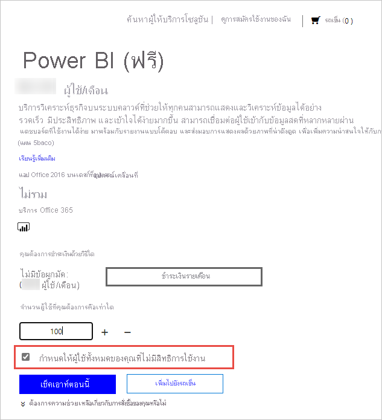

# การให้สิทธิการใช้งานบริการ Power BI สำหรับผู้ที่อยู่ในองค์กรของคุณLicensing the Power BI service for users in your organization

สิ่งที่ผู้ใช้สามารถทำได้ในบริการของ Power BI จะขึ้นอยู่กับชนิดของใบอนุญาตต่อผู้ใช้ที่พวกเขามีWhat a user can do in the Power BI service depends on the type of per-user license that they have. ระดับการเข้าถึงที่ให้ไว้โดยสิทธิการใช้งานของพวกเขาจะขึ้นอยู่กับว่ามีการกำหนดการเข้าถึงพื้นที่ทำงานไปยังพื้นที่ทำงานแบบ Premium หรือไม่หรือไม่The level of access provided by their license depends on whether the workspace being accessed a Premium workspace or not. ผู้ใช้ทั้งหมดของบริการ Power BI ต้องมีสิทธิการใช้งานAll users of the Power BI service must have a license.

ผู้ใช้สามารถรับสิทธิการใช้งานได้สองวิธีThere are two ways for users to get a license. การใช้ความสามารถในการลงทะเบียนแบบบริการตนเองและบัญชีที่ทำงานหรือโรงเรียนของพวกเขา ผู้ใช้สามารถรับสิทธิการใช้งานฟรีหรือ Pro หรือ Premium Per User ของตนเองได้Using self-service sign-up capabilities and their work or school account, users can get their own free or Pro or Premium Per User license. หรือผู้ดูแลระบบสามารถรับสิทธิการใช้งาน Power BI และมอบหมายสิทธิการใช้งานให้กับผู้ใช้Or, admins can get a Power BI license and assign licenses to users.

บทความนี้เน้นไปที่การจัดซื้อบริการและการออกใบอนุญาตผู้ใช้จากมุมมองของผู้ดูแลระบบThis article focuses on purchasing services and per-user licensing from an administrator perspective. สำหรับข้อมูลเพิ่มเติมเกี่ยวกับวิธีการที่ผู้ใช้สามารถรับสิทธิการใช้งานของตนเองได้ โปรดดู [การลงทะเบียน Power BI ในฐานะรายบุคคล](../fundamentals/service-self-service-signup-for-power-bi.md)For more information about how users can get their own license, see [Signing up for Power BI as an individual](../fundamentals/service-self-service-signup-for-power-bi.md).

## ใครสามารถสั่งซื้อและกำหนดสิทธิการใช้งานได้บ้าง?Who can purchase and assign licenses?

คุณต้องได้รับมอบหมายบทบาทผู้ดูแลระบบเพื่อซื้อหรือกำหนดสิทธิการใช้งานสำหรับองค์กรของคุณYou must be assigned an admin role to purchase or assign licenses for your organization. มีการมอบหมายบทบาทผู้ดูแลระบบบผ่านศูนย์การจัดการ Azure Active Directory หรือศูนย์การจัดการ Microsoft 365Admin roles are assigned by using the Azure Active Directory admin center or the Microsoft 365 admin center. ตารางต่อไปนี้แสดงบทบาทที่จำเป็นสำหรับการทำงานที่เกี่ยวข้องกับการซื้อและการให้สิทธิการใช้งานThe following table shows which role is required to do tasks related to purchase and licensing. สำหรับข้อมูลเพิ่มเติมเกี่ยวกับบทบาทผู้ดูแลระบบใน Azure Active Directory โปรดดู [ดูและกำหนดบทบาทผู้ดูแลระบบใน Azure Active Directory](/azure/active-directory/users-groups-roles/directory-manage-roles-portal)For more information about administrator roles in Azure Active Directory, see [View and assign administrator roles in Azure Active Directory](/azure/active-directory/users-groups-roles/directory-manage-roles-portal). หากต้องการเรียนรู้เพิ่มเติมเกี่ยวกับบทบาทผู้ดูแลระบบใน Microsoft 365 รวมถึงแนวทางปฏิบัติที่ดีที่สุด โปรดดูที่ [เกี่ยวกับบทบาทผู้ดูแลระบบ](/microsoft-365/admin/add-users/about-admin-roles?view=o365-worldwide)To learn more about admin roles in Microsoft 365, including best practices, see [About admin roles](/microsoft-365/admin/add-users/about-admin-roles?view=o365-worldwide).

| ใครสามารถซื้อบริการและสิทธิการใช้งานได้บ้างWho can purchase services and licenses? | ใครสามารถจัดการสิทธิใช้งานผู้ใช้ได้บ้างWho can manage user licenses? |
| --------------- | --------------- |
| ผู้ดูแลการเรียกเก็บเงินBilling administrator | ผู้ดูแลระบบสิทธิการใช้งานLicense administrator |
| ผู้ดูแลระบบส่วนกลางGlobal administrator | ผู้ดูแลระบบผู้ใช้User administrator |
|  | ผู้ดูแลระบบส่วนกลางGlobal administrator |

บทบาทเหล่านี้จัดการองค์กรThese roles manage the organization. สำหรับข้อมูลเกี่ยวกับบทบาทผู้ดูแลระบบ Power BI โปรดดู [ทำความเข้าใจกับบทบาทผู้ดูแลระบบ Power BI](service-admin-role.md)For information about Power BI service administrator roles, see [Understanding Power BI service administrator roles](service-admin-role.md).

## รับ Power BI สำหรับองค์กรของคุณGet Power BI for your organization

สำหรับข้อมูลเพิ่มเติมเกี่ยวกับราคา ดูที่ [การเปรียบเทียบราคาและผลิตภัณฑ์](https://powerbi.microsoft.com/pricing/)For information about pricing, see [Pricing & Product Comparison](https://powerbi.microsoft.com/pricing/).

ผู้ดูแลระบบส่วนกลางหรือผู้ดูแลระบบการเรียกเก็บเงินสามารถลงทะเบียนสำหรับบริการ Power BI และซื้อสิทธิการใช้งานสำหรับผู้ใช้ที่อยู่ในองค์กรของพวกเขาได้A global administrator or a billing administrator can sign up for the Power BI service and buy licenses for the users in their organization. ถ้าคุณยังไม่พร้อมที่จะซื้อ ให้เลือก Power BI Pro รุ่นทดลองใช้If you're not ready to purchase, select the Power BI Pro trial. คุณจะได้รับสิทธิการใช้งาน 25 สิทธิเป็นเวลาหนึ่งเดือนYou'll get 25 licenses to use for one month. สำหรับคำแนะนำทีละขั้นตอนเกี่ยวกับวิธีการลงทะเบียน โปรดดู [รับการสมัครใช้งาน Power BI สำหรับองค์กรของคุณ](service-admin-org-subscription.md)For step-by-step instructions on how to sign up, see [Get a Power BI subscription for your organization](service-admin-org-subscription.md).

## เกี่ยวกับการลงทะเบียนแบบบริการตนเองAbout self-service sign-up

ผู้ใช้แต่ละคนสามารถรับสิทธิการใช้งาน Power BI ของตนเองได้โดยการลงชื่อเข้าใช้ด้วยบัญชีที่ทำงานหรือโรงเรียนIndividual users can get their own Power BI license by signing up with their work or school account. ด้วยสิทธิการใช้งานฟรี ผู้ใช้สามารถสำรวจ Power BI สำหรับการวิเคราะห์ข้อมูลส่วนบุคคลและการแสดงผลข้อมูลด้วยภาพโดยใช้พื้นที่ทำงานของฉัน แต่ไม่สามารถแชร์กับผู้ใช้อื่นได้With a free license, users can explore Power BI for personal data analysis and visualization using My Workspace, but they can't share with other users. คุณจำเป็นต้องมีสิทธิการใช้งาน Power BI Pro เพื่อแชร์เนื้อหาA Power BI Pro license is required to share content. สิทธิการใช้งาน Power BI Premium จะปลดล็อกการเข้าถึคุณลักษณะ ความสามารถ และประเภทเนื้อหาต่าง ๆ ที่พร้อมใช้งานผ่าน Premium เท่านั้นA Power BI Premium license unlocks access to a variety of features, capabilities and types of content that are only available through Premium. สิทธิการใช้งาน Premium Per User Premium จำกัดการเข้าถึงคุณลักษณะเหล่านี้เฉพาะกับผู้ใช้รายอื่นที่มีสิทธิใช้งาน Premium Per User และสิทธิการใช้งาน Premium ตามความจุช่วยให้ผู้ใช้ที่มีสิทธิใช้งานฟรีสามารถเข้าถึงเนื้อหาใดก็ตาม แต่ในขณะที่มีเพียงผู้ใช้ที่มีสิทธิใช้งาน Pro เท่านั้นที่สามารถสร้างเนื้อหาได้A Premium Per User Premium license limits access to these features only to other users with Premium Per User license, and capacity based Premium license allows users with free licenses to access any content, while only users with a Pro license can create content. ผู้ใช้อาจอัปเกรดประเภทสิทธิการใช้งานของตนเป็น Pro หรือลงทะเบียน Pro โดยตรง หากองค์กรกำลังใช้ระบบคลาวด์เชิงพาณิชย์Users may upgrade their license type to Pro, or sign up for Pro directly, if the organization is using the commercial cloud. การซื้อโดยตรงหรือการอัปเกรดเป็น Pro ยังไม่พร้อมใช้งานสำหรับองค์กรการศึกษาหรือองค์กรที่มีการปรับใช้กับระบบคลาวด์ Azure Government, Azure Germany หรือ Azure China 21 VianetDirect purchase of or upgrade to Pro isn't available to educational organizations or organizations deployed to Azure Government, Azure Germany, or Azure China 21Vianet clouds.

หากคุณไม่ต้องการให้ผู้ใช้ในองค์กรของคุณใช้การลงทะเบียนแบบบริการตนเอง โปรดดู [เปิดใช้งานหรือปิดใช้งานการลงทะเบียนแบบบริการตนเอง](service-admin-disable-self-service.md) เพื่อเรียนรู้วิธีการปิดใช้งานIf you don't want users in your organization to use self-service sign-up, see [Enable or disable self-service sign-up](service-admin-disable-self-service.md) to learn how to turn it off.

การปิดการลงทะเบียนแบบบริการตนเองทำให้ผู้ใช้ไม่สามารถสำรวจ Power BI สำหรับการแสดงข้อมูลและการวิเคราะห์ได้Turning off self-service sign-up keeps users from exploring Power BI for data visualization and analysis. ถ้าคุณบล็อกการลงทะเบียนรายบุคคล คุณอาจต้องการรับสิทธิ์การใช้งาน Power BI (ฟรี) สำหรับองค์กรของคุณและกำหนดสิทธิ์นั้นให้กับผู้ใช้ทั้งหมดIf you block individual sign-up, you may want to get Power BI (free) licenses for your organization and assign them to all users. ทำตามขั้นตอนเหล่านี้เพื่อกำหนดสิทธิ์การใช้งาน Power BI (ฟรี) ให้กับผู้ใช้ที่มีอยู่ทั้งหมดโดยอัตโนมัติ:Follow these steps to auto-assign a Power BI (free) license to all existing users:

1. ลงชื่อเข้าใช้ [ศูนย์การจัดการ Microsoft 365](https://admin.microsoft.com) โดยใช้ข้อมูลประจำตัวของผู้ดูแลระบบส่วนกลางหรือผู้ดูแลระบบการเรียกเก็บเงินของคุณSign in to the [Microsoft 365 admin center](https://admin.microsoft.com), using global admin or billing admin credentials.
1. จากเมนูแถบด้านซ้าย เลือก **การเรียกเก็บเงิน** > **การซื้อการบริการ**From the left sidebar menu, select **Billing** > **Purchase services**.
1. ค้นหาหรือเลื่อนเพื่อเลือกข้อเสนอ Power BI (ฟรี)Search or scroll to locate the Power BI (free) offer. เลือกข้อเสนอ จากนั้นเลือก **รับทันที**Select the offer, then select **Get now**.
1. ระบุจำนวนสิทธิ์การใช้งานที่จำเป็นเพื่อให้ครอบคลุมผู้ใช้ทั้งหมดของคุณEnter the number of licenses needed to cover all your users.
1. เลือก **กำหนดให้กับผู้ใช้ทั้งหมดของคุณที่ไม่มีสิทธิ์โดยอัตโนมัติ** จากนั้นให้ตรวจสอบSelect **Automatically assign to all of your users with no licenses**, then check out.

  

ถ้าคุณต้องการดูว่าผู้ใช้ใดบ้างในองค์กรของคุณอาจมีสิทธิการใช้งานอยู่แล้ว โปรดดู [ดูและจัดการสิทธิการใช้งานของผู้ดูแล](service-admin-manage-licenses.md) เพื่อเรียนรู้วิธีการIf you want to see which users in your organization may already have a license, see [View and manage user licenses](service-admin-manage-licenses.md) to learn how.

## ประเภทและความสามารถของสิทธิการใช้งานLicense types and capabilities

สิทธิการใช้งาน Power BI ต่อผู้ใช้มีสองประเภท: Pro และ Premium แบบฟรีThere are two kinds of Power BI per-user licenses: free Pro and Premium. สิทธิการใช้งานประเภทที่ผู้ใช้ต้องการจะถูกกำหนดโดยที่จัดเก็บเนื้อหา วิธีที่พวกเขาจะโต้ตอบกับเนื้อหานั้น และเนื้อหานั้นใช้คุณลักษณะแบบ Premium หรือไม่Which type of license a user needs is determined by where content is stored, how they'll interact with that content, and if that content uses Premium features. ตำแหน่งที่สามารถจัดเก็บเนื้อหาถูกกำหนดโดย[ประเภทสิทธิการใช้งาน](#license-types)ขององค์กรของคุณWhere content can be stored is determined by your organization's [license type](#license-types).

สิทธิการใช้งานประเภทหนึ่ง นั่นคือสิทธิการใช้งานตามความจุ [Power BI Premium](service-admin-premium-purchase.md) อนุญาตให้ผู้ใช้ที่มีสิทธิการใช้งานแบบฟรีสามารถดำเนินการกับเนื้อหาในพื้นที่ทำงานที่กำหนดให้กับความจุแบบ Premium ได้One type of license, [Power BI Premium](service-admin-premium-purchase.md) capacity-based license, allows users with a free license to act on content in workspaces that are assigned to Premium capacity. นอกเหนือจากความจุระดับพรีเมียมแล้ว ผู้ใช้ที่มีสิทธิการใช้งานฟรีสามารถใช้บริการ Power BI เพื่อเชื่อมต่อกับข้อมูลและสร้างรายงานและแดชบอร์ดใน **พื้นที่ทำงานของฉัน**Outside of Premium capacity, a user with a free license can only use the Power BI service to connect to data and create reports and dashboards in **My Workspace**. ผู้ใช้เหล่านี้ไม่สามารถแชร์เนื้อหากับผู้อื่นหรือเผยแพร่เนื้อหาไปยังพื้นที่ทำงานอื่นๆ ได้They can't share content with others or publish content to other workspaces. หากต้องการเรียนรู้เพิ่มเติมเกี่ยวกับชนิดของพื้นที่ทำงาน ให้ดู [ชนิดของพื้นที่ทำงาน](../consumer/end-user-workspaces.md#types-of-workspaces)To learn more about workspace types, see [Types of workspaces](../consumer/end-user-workspaces.md#types-of-workspaces).

สิทธิการใช้งาน Power BI ที่มีสิทธิการใช้งานต่อผู้ใช้แบบฟรีและ Pro ใช้ความจุแบบใช้ร่วมกันและจำกัดสำหรับการประมวลผลเนื้อหาเท่านั้นA Power BI license with free and Pro per-user licenses only uses a shared and limited capacity to process content. หากเนื้อหาถูกจัดเก็บในความจุแบบใช้ร่วมกันนั้น ผู้ใช้ที่ได้รับมอบหมายสิทธิการใช้งาน Power BI Pro สามารถทำงานร่วมกับผู้ใช้ Power BI Pro รายอื่น ๆ เท่านั้นIf content is stored in that shared capacity, users who are assigned a Power BI Pro license can collaborate only with other Power BI Pro users. พวกเขาสามารถใช้เนื้อหาที่แชร์โดยผู้ใช้คนอื่น ๆ เผยแพร่เนื้อหาไปยังพื้นที่ทำงานของแอป แชร์แดชบอร์ด และสมัครสมาชิกแดชบอร์ดและรายงานได้They can consume content shared by other users, publish content to app workspaces, share dashboards, and subscribe to dashboards and reports.  เมื่อพื้นที่ทำงานอยู่ในความจุระดับพรีเมียม ผู้ใช้ Pro อาจเผยแพร่เนื้อหาไปยังผู้ใช้ที่ไม่มีสิทธิการใช้งาน Power BI Pro ได้When workspaces are in Premium capacity, Pro users may distribute content to users who don't have a Power BI Pro license.

เมื่อใช้สิทธิการใช้งาน Premium Per User เนื้อหาที่สร้างโดยผู้ใช้ที่มีสิทธิการใช้งาน Premium Per User จะสามารถแชร์กับผู้ใช้รายอื่นที่มีสิทธิการใช้งาน Premium เท่านั้น เว้นแต่เนื้อหานั้นจะถูกวางไว้บนพื้นที่ทำงานที่โฮสต์บนความจุแบบ Premium โดยเฉพาะWhen using Premium Per User licenses, content created by a Premium Per User licensed user can only be shared with other users that have a Premium license, unless that content is specifically put on a workspace hosted on a Premium capacity. ตารางด้านล่างสรุปความสามารถพื้นฐานของสิทธิการใช้งานแต่ละประเภทThe table below summarizes the basic capabilities of each license type. สำหรับรายละเอียดความพร้อมใช้งานคุณลักษณะโดยละเอียดต่อประเภทสิทธิการใช้งาน โปรดดู [คุณลักษณะตามประเภทสิทธิการใช้งาน](../fundamentals/service-features-license-type.md)For a detailed breakdown of feature availability per license type, see [Features by license type](../fundamentals/service-features-license-type.md).

| ประเภทสิทธิการใช้งานLicense type | ความสามารถเมื่อพื้นที่ทำงานอยู่ในความจุแบบใช้ร่วมกันCapabilities when workspace is in shared capacity | ความสามารถเพิ่มเติมเมื่อพื้นที่ทำงานอยู่ในความจุแบบพรีเมียมAdditional  capabilities when workspace is in Premium capacity |
| --------- | ----------- | ----------- |
| Power BI (ฟรี)Power BI (free) | การเข้าถึงเนื้อหาในพื้นที่ทำงานของฉันAccess to content in My Workspace | ใช้เนื้อหาที่แชร์กับพวกเขาConsume content shared with them |
| Power BI ProPower BI Pro | เผยแพร่เนื้อหาไปยังพื้นที่ทำงานอื่นๆ แชร์แดชบอร์ด และสมัครสมาชิกแดชบอร์ดและรายงานได้ แชร์กับผู้ใช้ที่มีสิทธิการใช้งานแบบ ProPublish content to other workspaces, share dashboards, subscribe to dashboards and reports, share with users who have a Pro license | เผยแพร่เนื้อหาไปยังผู้ใช้ที่มีสิทธิการใช้งานฟรีDistribute content to users who have free licenses |

## ประเภทสิทธิการใช้งานLicense types

สิทธิการใช้งานเชิงพาณิชย์ ขึ้นอยู่กับผู้ใช้ทั้งหมดจาก Microsoft นั้นยึดตามข้อมูลประจำตัวของ Azure Active DirectoryAll user-based, commercial license licenses from Microsoft are based on Azure Active Directory identities. การใช้งานบริการของ Power BI คุณต้องลงชื่อเข้าใช้ด้วยข้อมูลประจำตัวที่ Azure Active Directory รองรับสำหรับสิทธิการใช้งานเชิงพาณิชย์To use the Power BI service, you must sign in with an identity that Azure Active Directory supports for commercial licenses. คุณสามารถเพิ่ม Power BI ลงในสิทธิการใช้งาน Microsoft ใดก็ได้ที่ใช้ Azure Active Directory สำหรับบริการข้อมูลประจำตัวYou can add Power BI to any Microsoft license that uses Azure Active Directory for identity services. สิทธิการใช้งานบางรายการเช่น Office 365 E5 มีสิทธิการใช้งาน Power BI Pro ดังนั้นจึงไม่จำเป็นต้องลงทะเบียนแยกต่างหากสำหรับ Power BISome licenses, such as Office 365 E5, include a Power BI Pro license, so no separate sign-up for Power BI is needed.

สิทธิการใช้งาน Power BI สำหรับองค์กรมีสองชนิดคือแบบมาตรฐานและแบบพรีเมียมThere are two kinds of Power BI licenses for organizations: standard and premium.

ด้วยสิทธิการใช้งาน Power BI Pro แบบบริการตนเองมาตรฐาน ผู้ดูแลระบบจะกำหนดการสมัครใช้งานต่อสิทธิการใช้งานผู้ใช้With a standard, self-service Power BI Pro license, admins assign per user licenses. ทั้งนี้มีค่าธรรมเนียมรายเดือนต่อผู้ใช้สำหรับสิทธิ์การใช้งาน Power BI ProThere's a per user monthly fee for Power BI Pro licenses. ชนิดสิทธิ์การใช้งานนี้จะเปิดใช้การทำงานร่วมกัน การเผยแพร่ การแชร์ และการวิเคราะห์แบบเฉพาะกิจThis license type enables collaboration, publishing, sharing, and ad-hoc analysis. เนื้อหาจะได้รับการบันทึกไว้ในความจุที่เก็บข้อมูลแบบใช้ร่วมกัน ซึ่ง Microsoft จัดการอย่างเต็มรูปแบบContent is saved to shared storage capacity that is fully managed by Microsoft.

สิทธิการใช้งาน Power BI Premium จัดสรรความจุให้กับองค์กรA Power BI Premium license allocates a capacity to an organization. เหมาะสำหรับองค์กร BI การวิเคราะห์ข้อมูลขนาดใหญ่ และการรายงานบนคลาวด์และภายในองค์กร Premium ให้การควบคุมขั้นสูงสำหรับการดูแลระบบและการปรับใช้งานSuitable for enterprise BI, big data analytics, and cloud and on-premises reporting, Premium provides advanced administration and deployment controls. ทรัพยากรการคำนวณและการจัดเก็บเฉพาะได้รับการจัดการโดยผู้ดูแลความจุในองค์กรของคุณDedicated compute and storage resources are managed by capacity admins in your organization. ซึ่งมีค่าใช้จ่ายรายเดือนสำหรับสภาพแวดล้อมเฉพาะนี้There's a monthly cost for this dedicated environment. นอกเหนือจากข้อดีของพรีเมียมอื่นๆ แล้ว ผู้ใช้ที่ไม่มีสิทธิการ Power BI Pro สามารถเข้าถึงเนื้อหาและสามารถได้รับการแจกจ่ายเนื้อหาจากที่จัดเก็บในความจุพรีเมียมได้In addition to other Premium advantages, content stored in Premium capacity can be accessed by and distributed to users who don't have Power BI Pro licenses. ผู้ใช้อย่างน้อยหนึ่งรายจะต้องมีสิทธิการใช้งาน Power BI Pro ที่กำหนดให้กับผู้สร้าง และนักพัฒนาเนื้อหาที่ยังคงต้องการสิทธิการใช้งาน Power BI ProAt least one user has to have a Power BI Pro license assigned to use Premium, and content creators and developers still need a Power BI Pro license.

สิทธิการใช้งานสองประเภทไม่ได้เป็นแบบไม่เกิดร่วมกันThe two types of licenses aren't mutually exclusive. คุณสามารถมีได้ทั้ง Power BI Premium และ Power BI ProYou can have both Power BI Premium and Power BI Pro. ในการกำหนดค่านี้ เนื้อหาที่จัดเก็บไว้ในความจุแบบพรีเมียมสามารถใช้ร่วมกันกับผู้ใช้ทั้งหมดและความจุแบบใช้ร่วมกันยังสามารถใช้งานได้ด้วยIn this configuration, content stored in Premium capacity can be shared with all users and shared capacity is also available. สำหรับข้อมูลเกี่ยวกับขีดจำกัดของความจุ โปรดดู [จัดการที่เก็บข้อมูลในพื้นที่ทำงานของ Power BI](service-admin-manage-your-data-storage-in-power-bi.md)For information about capacity limits, see [Manage data storage in Power BI workspaces](service-admin-manage-your-data-storage-in-power-bi.md).

หากต้องการเปรียบเทียบคุณลักษณะและราคาของผลิตภัณฑ์ โปรดดู [การกำหนดราคา Power BI](https://powerbi.microsoft.com/pricing)To compare product features and pricing, see [Power BI pricing](https://powerbi.microsoft.com/pricing).

## การเข้าถึงของผู้ใช้ที่เป็นผู้เยี่ยมชมGuest user access

คุณอาจต้องการกระจายเนื้อหาไปยังผู้ใช้ที่อยู่นอกองค์กรของคุณYou may want to distribute content to users who are outside of your organization. คุณสามารถแชร์เนื้อหากับผู้ใช้ภายนอกได้โดยการเชิญให้พวกเขาดูเนื้อหาในฐานะผู้เยี่ยมชมIt's possible to share content with external users by inviting them to view content as a guest. Azure Active Directory Business-to-business (Azure AD B2B) ช่วยให้สามารถแบ่งปันกับผู้ใช้ที่เป็นผู้เยี่ยมชมภายนอกได้Azure Active Directory Business-to-business (Azure AD B2B) enables sharing with external guest users. การแชร์กับผู้ใช้ภายนอกต้องเป็นไปตามข้อกำหนดเบื้องต้นต่อไปนี้:The following prerequisites must be met to share with external users:

- ต้องเปิดใช้งานความสามารถในการแชร์เนื้อหากับผู้ใช้ภายนอกThe ability to share content with external users must be enabled

- ผู้ใช้ที่เป็นผู้เยี่ยมชมจำเป็นต้องมีสิทธิการใช้งานที่ถูกต้องเพื่อดูเนื้อหาที่ใช้ร่วมกันThe guest user must have the proper licensing in place to view the shared content

สำหรับข้อมูลเพิ่มเติมเกี่ยวกับการเข้าถึงของผู้ใช้ที่เป็นผู้เยี่ยมชม โปรดดู [กระจายเนื้อหา Power BI ไปยังผู้ใช้ที่เป็นผู้เยี่ยมชมจากภายนอกด้วย Azure AD B2B](service-admin-azure-ad-b2b.md)For more information about guest user access, see [Distribute Power BI content to external guest users with Azure AD B2B](service-admin-azure-ad-b2b.md).

## ซื้อสิทธิ์การใช้งาน Power BI ProPurchase Power BI Pro licenses

ในฐานะผู้ดูแลระบบ คุณสามารถซื้อสิทธิการใช้งาน Power BI Pro ผ่าน Microsoft 365 หรือผ่านพันธมิตรของ MicrosoftAs an administrator, you purchase Power BI Pro licenses through Microsoft 365 or through a Microsoft partner. หลังจากที่คุณซื้อสิทธิการใช้งานแล้ว คุณจะมอบให้กับผู้ใช้แต่ละรายได้After you buy the licenses, you assign them to individual users. ดูข้อมูลเพิ่มเติมได้ที่ [ซื้อและมอบใบอนุญาตใบอนุญาตการใช้ Power BI Pro](service-admin-purchasing-power-bi-pro.md)For more information, see [Purchase and assign Power BI Pro licenses](service-admin-purchasing-power-bi-pro.md).

### การหมดอายุการใช้งานของใบอนุญาต Power BI ProPower BI Pro license expiration

ไม่มีช่วงเวลาผ่อนผันหลังจากสิทธิ์การใช้งาน Power BI Pro หมดอายุThere's a grace period after a Power BI Pro license expires. สำหรับสิทธิ์ใช้งานที่เป็นส่วนหนึ่งของการซื้อลิขสิทธิ์แบบจำนวนมากระยะเวลาผ่อนผันคือ 90 วันFor licenses that are part of a volume license purchase, the grace period is 90 days. ถ้าคุณซื้อสิทธิการใช้งานโดยตรง ช่วงระยะเวลาผ่อนผันคือ 30 วันIf you bought the license directly, the grace period is 30 days.

Power BI Pro มีระยะเวลาสิทธิการใช้งานแบบเดียวกับ Microsoft 365Power BI Pro has the same license lifecycle as Microsoft 365. สำหรับข้อมูลเพิ่มเติม ให้ดู [เกิดอะไรขึ้นกับข้อมูลของฉันและการเข้าถึงเมื่อการสมัครใช้งานทางธุรกิจ Microsoft 365 ของฉันสิ้นสุด](/microsoft-365/commerce/subscriptions/what-if-my-subscription-expires)For more information, see [What happens to my data and access when my Microsoft 365 for business subscription ends](/microsoft-365/commerce/subscriptions/what-if-my-subscription-expires).

## ขั้นตอนถัดไปNext steps

- [ซื้อและะมอบใบอนุญาตการใช้งาน Power BI ProPurchase and assign Power BI Pro licenses](service-admin-purchasing-power-bi-pro.md)
- [เอกสารประกอบการสมัครสมาชิกธุรกิจและการเรียกเก็บเงินBusiness subscriptions and billing documentation](/microsoft-365/commerce/?view=o365-worldwide)
- [ค้นหาผู้ใช้ Power BI ที่มีการลงชื่อเข้าใช้Find Power BI users that have signed in](service-admin-access-usage.md)
- มีคำถามเพิ่มเติมหรือไม่More questions? [ลองถามชุมชน Power BITry asking the Power BI Community](https://community.powerbi.com/)

Power BI ได้แนะนำ Power BI Premium Gen2 เข้ามาใช้งานเป็นข้อเสนอการแสดงตัวอย่าง ซึ่งปรับปรุงประสบการณ์การใช้งาน Power BI Premium ด้วยการปรับปรุงในสิ่งต่อไปนี้:Power BI has introduced Power BI Premium Gen2 as a preview offering, which improves the Power BI Premium experience with improvements in the following:
* ประสิทธิภาพการทำงานPerformance
* สิทธิการใช้งานต่อผู้ใช้Per-user licensing
* ขนาดใหญ่ขึ้นGreater scale
* เมตริกที่ดีขึ้นImproved metrics
* การปรับขนาดอัตโนมัติAutoscaling
* ลดค่าใช้จ่ายในการจัดการReduced management overhead

สำหรับข้อมูลเพิ่มเติมเกี่ยวกับ Power BI Premium Gen2 โปรดดูที่ [Power BI Premium Generation 2 (ตัวอย่าง)](service-premium-what-is.md#power-bi-premium-generation-2-preview)For more information about Power BI Premium Gen2, see [Power BI Premium Generation 2 (preview)](service-premium-what-is.md#power-bi-premium-generation-2-preview).