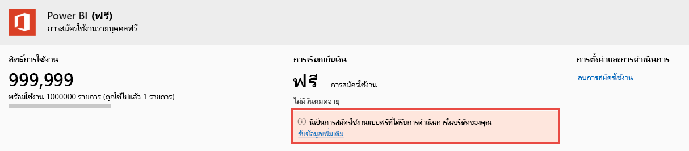

# ดูและจัดการใบอนุญาตของผู้ใช้ Power BIView and manage Power BI user licenses

บทความนี้อธิบายว่าผู้ดูแลระบบสามารถใช้ศูนย์การจัดการ Microsoft 365 หรือพอร์ทัล Azure เพื่อดูและจัดการใบอนุญาตของผู้ใช้สำหรับบริการ Power BI ได้อย่างไรThis article explains how admins can use the Microsoft 365 admin center or the Azure portal to view and manage user licenses for the Power BI service.

> [!NOTE]
>
>เป็นไปได้สำหรับผู้ใช้ที่มีทั้งสิทธิการใช้งาน Power BI (ฟรี) และ Power BI Pro ที่มอบหมายIt's possible for a user to have both a Power BI (free) and a Power BI Pro license assigned. ซึ่งสามารถเกิดขึ้นได้เมื่อผู้ใช้ลงทะเบียนสำหรับสิทธิการใช้งานฟรี และจากนั้นจะถูกมอบหมายสิทธิการใช้งาน Power BI Pro ให้ในภายหลังThis can happen when a user signs up for a free license and then is later assigned a Power BI Pro license. ระดับสิทธิ์ใช้งานสูงสุดจะมีผลในกรณีนี้The highest licensing level takes effect in this case.
>

## ดูการสมัครใช้งานของคุณView your subscriptions

หากต้องการดูการสมัครใช้งาน Power BI ที่องค์กรของคุณมี ให้ทำตามขั้นตอนเหล่านี้To see which Power BI subscriptions your organization has, follow these steps.

1. ลงชื่อเข้าใช้ [ศูนย์การจัดการ Microsoft 365](https://admin.microsoft.com)Sign in to the [Microsoft 365 admin center](https://admin.microsoft.com).
2. บนเมนูการนำทาง ให้เลือก **การเรียกเก็บเงิน** > **ผลิตภัณฑ์และบริการ**In the navigation menu, select **Billing** > **Products & services**.

การสมัครใช้งาน Power BI ที่ใช้งานของคุณจะแสดงอยู่ในรายการพร้อมกับการสมัครใช้งานอื่น ๆ ที่คุณมีYour active Power BI subscriptions are listed along with any other subscriptions you have. คุณอาจเห็นการสมัครใช้งานที่ไม่คาดคิดสำหรับ Power BI (ฟรี) ดังที่แสดงไว้ที่นี่You may see an unexpected subscription for Power BI (free), as shown here.

  

การสมัครใช้งานประเภทนี้จะถูกสร้างขึ้นสำหรับคุณเมื่อผู้ใช้ใช้ประโยชน์จากการลงทะเบียนแบบบริการตนเองThis type of subscription is created for you when users take advantage of self-service sign-up. หากต้องการอ่านเพิ่มเติม โปรดดู [Power BI ในองค์กรของคุณ](/microsoft-365/admin/misc/power-bi-in-your-organization?view=o365-worldwide)To read more, see [Power BI in your organization](/microsoft-365/admin/misc/power-bi-in-your-organization?view=o365-worldwide).

## จัดการสิทธิการใช้งานผู้ใช้ใน Microsoft 365Manage user licenses in Microsoft 365

หากต้องการใช้ศูนย์การจัดการ Microsoft 365 เพื่อจัดการสิทธิ์ใช้งานผู้ใช้ โปรดดู [เอกสารประกอบการสมัครสมาชิกธุรกิจและการเรียกเก็บเงิน](/microsoft-365/commerce/?view=o365-worldwide)To use Microsoft 365 admin center to manage user licenses, see the [Business subscriptions and billing documentation](/microsoft-365/commerce/?view=o365-worldwide).

## จัดการสิทธิการใช้งานผู้ใช้ในพอร์ทัล AzureManage user licenses in Azure portal

ทำตามขั้นตอนเหล่านี้เพื่อดูและกำหนดสิทธิ์ใช้งาน Power BI โดยใช้พอร์ทัล AzureFollow these steps to view and assign Power BI licenses using the Azure portal.

1. ลงชื่อเข้าใช้ไปยัง [พอร์ทัล Azure](https://portal.azure.com)Sign in to the [Azure portal](https://portal.azure.com).

2. ค้นหาและเลือก **Azure Active Directory**Search for and select **Azure Active Directory**.

3. ในส่วน **จัดการ** บนเมนูแหล่งข้อมูล Azure Active Directory ให้เลือก **สิทธิการใช้งาน**Under **Manage** on the Azure Active Directory resource menu, select **Licenses**.

4. เลือก **ผลิตภัณฑ์ทั้งหมด** จากเมนูแหล่งข้อมูล จากนั้นเลือกประเภทสิทธิการใช้งาน Power BI เพื่อแสดงรายการของผู้ใช้ที่มีสิทธิการใช้งานSelect **All products** from the resource menu, then select a Power BI license type to display the list of licensed users.

5. ในการกำหนดสิทธิการใช้งาน ให้เลือก **+มอบสิทธิ์** จากแถบคำสั่งTo assign a license, from the command bar, select **+ Assign**. บนหน้า **มอบสิทธิการใช้งาน** ให้เลือกผู้ใช้ จากนั้นเลือก **ตัวเลือกการมอบสิทธิ์** เพื่อเปิดสิทธิการใช้งาน Power BI สำหรับบัญชีผู้ใช้ที่เลือกOn the **Assign license** page, choose a user then select **Assignment options** to turn on a Power BI license for the selected user account.

6. เมื่อต้องการลบสิทธิการใช้งานออก ให้เลือกกล่องกาเครื่องหมายที่อยู่ถัดจากชื่อของผู้ใช้ จากนั้นเลือก **ลบสิทธิการใช้งาน**To remove a license, select the checkbox next to the user's name, then select **Remove license**.

## ขั้นตอนถัดไปNext steps

- [ซื้อ Power BI ProPurchase Power BI Pro](service-admin-purchasing-power-bi-pro.md)
- [การให้สิทธิ์สำหรับองค์กรของคุณLicensing for your organization](service-admin-licensing-organization.md)