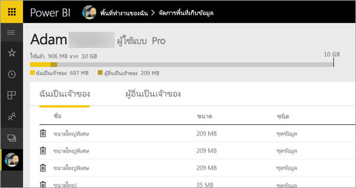
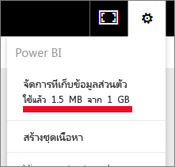

# ladakจัดการที่เก็บข้อมูลในพื้นที่ทำงานบน Power BIManage data storage in Power BI workspaces

เรียนรู้วิธีจัดการที่เก็บข้อมูลของคุณ หรือของพื้นที่ทำงาน เพื่อให้คุณสามารถเผยแพร่รายงานและชุดข้อมูลต่อไปได้Learn how to manage data storage in your individual or workspace so you can keep publishing reports and datasets.

## ขีดจำกัดความจุCapacity limits

ข้อจำกัดที่เก็บข้อมูลพื้นที่ทำงาน ไม่ว่าจะสำหรับพื้นที่ทำงานของฉันหรือพื้นที่ทำงานของแอป ทั้งนี้ขึ้นอยู่กับว่าพื้นที่ทำงานอยู่ใน [ความจุแบบใช้ร่วมกันหรือความจุพรีเมี่ยม](../fundamentals/service-basic-concepts.md#capacities)Workspace storage limits, whether for My Workspace or an app workspace, depend on whether the workspace is in [shared or Premium capacity](../fundamentals/service-basic-concepts.md#capacities).

### ขีดจำกัดความจุแบบใช้ร่วมกันShared capacity limits
สำหรับพื้นที่ทำงานในความจุที่ใช้ร่วมกัน:For workspaces in shared capacity: 

- มีขีดจำกัดสำหรับพื้นที่เก็บข้อมูลตามพื้นที่ทำงาน 10 GBThere is a per-workspace storage limit of 10 GB.
- สำหรับพื้นที่ทำงานของแอป การใช้งานทั้งหมดจะต้องไม่เกิน 10 GB คูณด้วยจำนวนสิทธิ์ใช้งาน Pro ในผู้เช่าFor app workspaces, the total usage can’t exceed the tenant storage limit of 10 GB multiplied by the number of Pro licenses in the tenant.

### ขีดจำกัดความจุแบบพรีเมียมPremium capacity limits
สำหรับพื้นที่ทำงานในความจุแบบพรีเมียมFor workspaces in Premium capacity:
- มีขีดจำกัด 100 TB ต่อความจุแบบพรีเมียมThere is a limit of 100 TB per Premium capacity.
- ไม่มีขีดจำกัดพื้นที่เก็บข้อมูลต่อผู้ใช้There is no per-user storage limit.

อ่านเกี่ยวกับคุณลักษณะอื่น ๆ ของ[รูปแบบการกำหนดราคา Power BI](https://powerbi.microsoft.com/pricing)Read about other features of the [Power BI pricing model](https://powerbi.microsoft.com/pricing).

## มีอะไรรวมอยู่ในพื้นที่เก็บข้อมูลบ้างWhat's included in storage

ที่รวมอยู่ในที่เก็บข้อมูลของคุณ ได้แก่ ชุดข้อมูลและรายงาน Excel ของคุณเอง และรายการเหล่านั้นที่มีคนแชร์ให้คุณIncluded in your data storage are your own datasets and Excel reports, and those items that someone has shared with you. ชุดข้อมูลเป็นแหล่งข้อมูลใด ๆ ที่คุณอัปโหลดหรือเชื่อมต่อDatasets are any of the data sources you’ve uploaded or connected to. แหล่งข้อมูลเหล่านี้รวมถึงไฟล์ Power BI Desktop และสมุดงาน Excel ที่คุณกำลังใช้งานThese data sources include Power BI Desktop files and Excel workbooks you’re using. ต่อไปนี้ยังรวมอยู่ในความจุข้อมูลของคุณด้วยThe following are also included in your data capacity.

* ช่วงของข้อมูลใน Excel ที่ปักหมุดไปยังแดชบอร์ดExcel ranges pinned to a dashboard.
* การแสดงภาพภายในองค์กรของ Reporting Services ที่ปักหมุดไปยังแดชบอร์ด Power BIReporting Services on-premises visualizations pinned to a Power BI dashboard.
* รูปภาพที่ถูกอัปโหลดUploaded images.

ขนาดของแดชบอร์ดที่คุณแชร์จะแตกต่างกัน ทั้งนี้ขึ้นอยู่กับว่ามีอะไรปักหมุดอยู่ข้างในบ้างThe size of a dashboard that you share varies, depending on what's pinned to it. ตัวอย่างเช่น ถ้าคุณปักหมุดรายการจากรายงานสองฉบับที่เป็นส่วนหนึ่งของชุดข้อมูลที่แตกต่างกันสองชุด ขนาดจะรวมชุดข้อมูลทั้งสองชุดFor example, if you pin items from two reports that are part of two different datasets, the size includes both datasets.

## จัดการรายการที่คุณเป็นเจ้าของManage items you own

ดูว่าคุณกำลังใช้พื้นที่จัดเก็บข้อมูลเท่าไรในบัญชีของคุณ Power BI และจัดการบัญชีของคุณSee how much data storage you’re using in your Power BI account, and manage your account.

1. เพื่อจัดการพื้นที่เก็บข้อมูลของคุณเอง ให้ไปที่ **พื้นที่งานของฉัน** ในบานหน้าต่างนำทางTo manage your own storage, go to **My Workspace** on the navigation pane.
   
    

2. เลือกที่มุมขวาบนของ **จัดการที่เก็บข้อมูลส่วนบุคคล**Select the gear icon  in the upper-right corner **Manage personal storage**.
   
    แถบด้านบนแสดงให้เห็นว่า คุณได้ใช้ที่เก็บข้อมูลมากแค่ไหนThe top bar shows how much of your storage limit you’ve used.
   
    
   
    ชุดข้อมูลและรายงานจะถูกแบ่งออกเป็นสองแท็บ:The datasets and reports are separated onto two tabs:
   
    **ฉันเป็นเจ้าของ:** คุณได้อัปโหลดรายงานและชุดข้อมูลเหล่านี้ไปยังบัญชี Power BI ของคุณ รวมถึงชุดข้อมูลบริการ เช่น Salesforce และ Dynamics CRM**Owned by me:** You’ve uploaded these reports and datasets to your Power BI account, including service datasets such as Salesforce and Dynamics CRM.  

    **ผู้อื่นเป็นเจ้าของ:** ผู้อื่นได้แชร์รายงานและชุดข้อมูลเหล่านี้ให้กับคุณ**Owned by others:** Others have shared these reports and datasets with you.
1. เมื่อต้องการลบชุดข้อมูลหรือรายงาน ให้เลือกไอคอนรูปถังขยะTo delete a dataset or report, select the trash can icon ..

โปรดทราบว่า คุณหรือบุคคลอื่นอาจมีรายงานและแดชบอร์ดที่ขึ้นกับชุดข้อมูลหนึ่ง ๆKeep in mind that you or someone else may have reports and dashboards based on a dataset. ถ้าคุณลบชุดข้อมูล รายงานและแดชบอร์ดเหล่านั้นจะไม่ทำงานอีกต่อไปIf you delete the dataset, those reports and dashboards won’t work anymore.

## จัดการพื้นที่ทำงานของคุณManage your workspace
1. เลือกลูกศรที่อยู่ถัดจาก **พื้นที่ทำงาน** และเลือกชื่อของพื้นที่ทำงานSelect the arrow next to **Workspaces** select the name of the workspace.
   
    
2. เลือกที่มุมบนขวาของ **จัดการที่เก็บข้อมูลกลุ่ม**Select the gear icon  in the upper-right corner **Manage group storage**.
   
    แถบด้านบนแสดงให้เห็นว่า มีการใช้ที่เก็บข้อมูลกลุ่มมากแค่ไหนThe top bar shows how much of the group’s storage limit is used.
   
    
   
    ชุดข้อมูลและรายงานจะถูกแบ่งออกเป็นสองแท็บ:The datasets and reports are separated onto two tabs:
   
    **เราเป็นเจ้าของ:** คุณหรือผู้อื่นได้อัปโหลดรายงานและชุดข้อมูลเหล่านี้ไปยังบัญชี Power BI ของกลุ่ม รวมถึงชุดข้อมูลบริการ เช่น Salesforce และ Dynamics CRM**Owned by us:** You or someone else has uploaded these reports and datasets to the group’s Power BI account, including service datasets such as Salesforce and Dynamics CRM.

    **ผู้อื่นเป็นเจ้าของ:** ผู้อื่นได้แชร์รายงานและชุดข้อมูลเหล่านี้ให้กับคุณ**Owned by others:** Others have shared these reports and datasets with your group.

3. เมื่อต้องการลบชุดข้อมูลหรือรายงาน ให้เลือกไอคอนรูปถังขยะTo delete a dataset or report, select the trash can icon ..
   
   > [!NOTE]
   > โปรดทราบว่า คุณหรือบุคคลอื่นในกลุ่มอาจมีรายงานและแดชบอร์ดที่ขึ้นกับชุดข้อมูลหนึ่ง ๆKeep in mind that you or someone else in the group may have reports and dashboards based on a dataset. ถ้าคุณลบชุดข้อมูล รายงานและแดชบอร์ดเหล่านั้นจะไม่ทำงานอีกต่อไปIf you delete the dataset, those reports and dashboards won’t work anymore.
   
   สมาชิกใดก็ตามในพื้นที่ทำงานที่มีบทบาทผู้ดูแลระบบ สมาชิก หรือผู้สนับสนุนมีสิทธิ์ในการลบชุดข้อมูลและรายงานออกจากพื้นที่ทำงานAny member in a workspace with the admin, member, or contributor role has permissions to delete datasets and reports from the workspace.

## ขีดจำกัดของชุดข้อมูลDataset limits
มีขีดจำกัด 1 GB ต่อชุดข้อมูลที่นำเข้าไปใน Power BIThere is a 1 GB limit per dataset that is imported into Power BI. ถ้าคุณเลือกที่จะเก็บประสบการณ์ Excel แทนที่จะนำเข้าข้อมูล ซึ่งจะถูกจำกัดที่ 250 MB สำหรับชุดข้อมูลIf you have chosen to keep the Excel experience, instead of importing the data, the limit is 250 MB for the dataset.

## เกิดอะไรขึ้นเมื่อคุณถึงขีดจำกัดWhat happens when you reach a limit
เมื่อคุณถึงขีดจำกัดความจุข้อมูลของคุณ คุณจะเห็นพร้อมท์ภายในบริการWhen you reach the data capacity limit of what you can do, you see prompts within the service. 

เมื่อคุณเลือกไอคอนรูปเฟืองWhen you select the gear icon , คุณจะเห็นแถบสีแดงซึ่งระบุว่า คุณกำลังใช้งานเกินขีดจำกัดความจุของข้อมูลของคุณ, you see a red bar indicating you are over your data capacity limit.

ขีดจำกัดนี้ยังระบุไว้ภายใน **จัดการที่เก็บข้อมูลส่วนบุคคล** อีกด้วยThis limit also is indicated within **Manage personal storage**.

 

 เมื่อคุณพยายามที่จะดำเนินการใด ๆ ที่ทำให้ถึงขีดจำกัดเหล่านี้ คุณจะเห็นข้อความที่ระบุว่า คุณกำลังใช้เกินขีดจำกัดWhen you try to perform an action that will reach one of the limits, you see a message you are over the limit. คุณสามารถ[จัดการที่เก็บข้อมูลของคุณ](#manage-items-you-own)เพื่อลดปริมาณข้อมูลในที่เก็บข้อมูลและแก้ไขขีดจำกัดดังกล่าวYou can [manage your storage](#manage-items-you-own) to reduce your storage amount and get past the limit.

 

 ## ขั้นตอนถัดไปNext steps

 มีคำถามเพิ่มเติมหรือไม่More questions? [ลองถามชุมชน Power BITry asking the Power BI Community](https://community.powerbi.com/)
