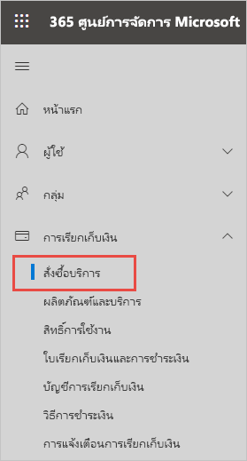
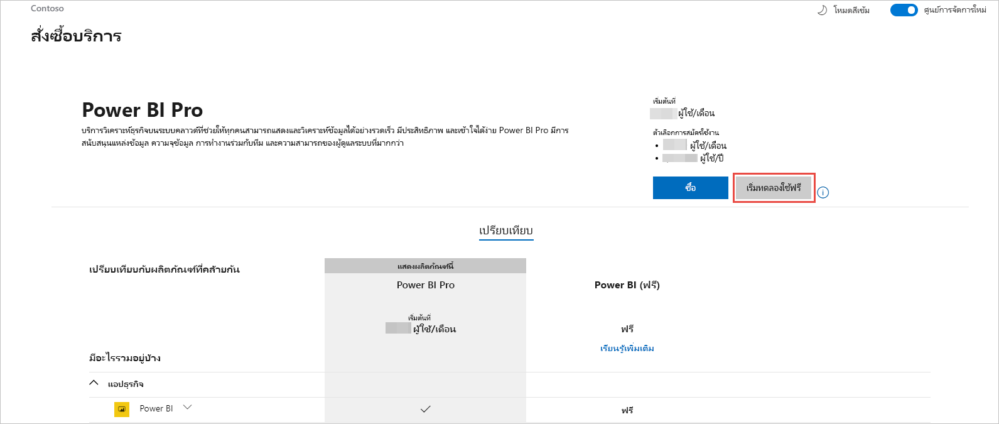
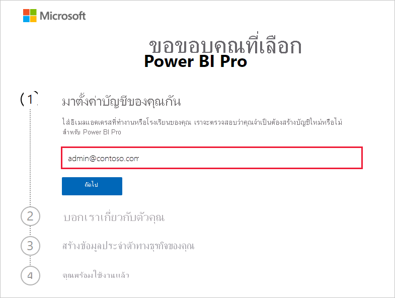
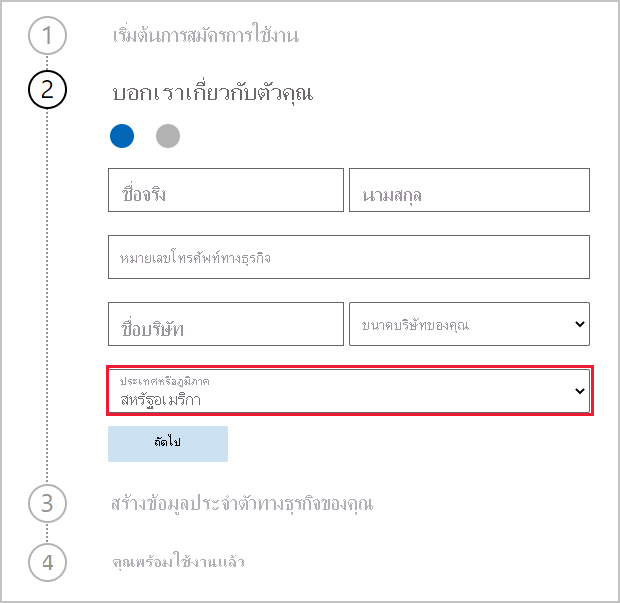
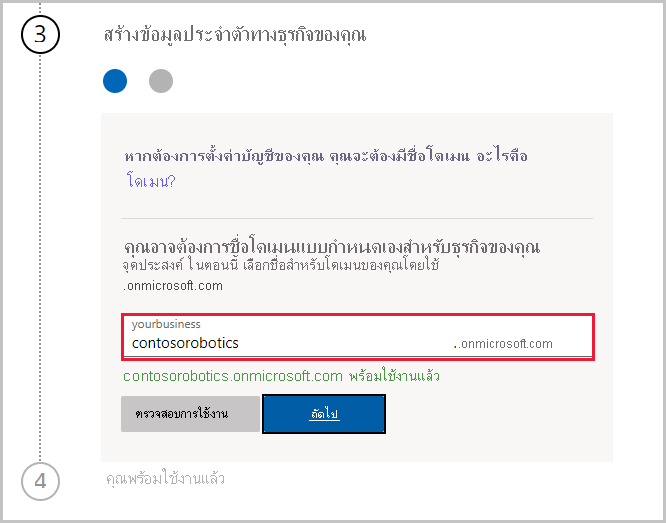

# รับการสมัครใช้งานบริการ Power BI สำหรับองค์กรของคุณGet a Power BI service subscription for your organization

ผู้ดูแลระบบสามารถลงทะเบียนสำหรับบริการ Power BI ผ่านหน้า **บริการสั่งซื้อ** บนศูนย์การจัดการ Microsoft 365 ได้Administrators can sign up for the Power BI service through the **Purchase services** page of the Microsoft 365 admin center. เมื่อผู้ดูแลระบบลงทะเบียนสำหรับ Power BI พวกเขาสามารถกำหนดสิทธิการใช้งานไปยังผู้ใช้ที่ควรมีสิทธิ์เข้าใช้งานได้When an administrator signs up for Power BI, they can assign licenses to users who should have access.

ผู้ใช้ในองค์กรของคุณสามารถลงทะเบียนสำหรับ Power BI ได้ผ่านเว็บไซต์ Power BIUsers in your organization can sign up for Power BI through the Power BI web site. เมื่อผู้ใช้ในองค์กรของคุณลงทะเบียนสำหรับ Power BI จะมีการกำหนดสิทธิ์การใช้งาน Power BI ให้ผู้ใช้เหล่านั้นโดยอัตโนมัติWhen a user in your organization signs up for Power BI, they're assigned a Power BI license automatically. ถ้าคุณต้องการปิดใช้งานความสามารถของการบริการตนเอง ให้ทำตามขั้นตอนใน [เปิดใช้งานหรือปิดใช้งานการลงทะเบียนและการซื้อแบบบริการตนเอง](service-admin-disable-self-service.md)If you want to turn off self-service capabilities, follow the steps in [Enable or disable self-service sign-up and purchasing](service-admin-disable-self-service.md).

## ลงทะเบียนผ่าน Microsoft 365Sign up through Microsoft 365

ถ้าคุณเป็นผู้ดูแลระบบส่วนกลางหรือผู้ดูแลระบบการเรียกเก็บเงิน คุณจะได้รับการสมัครใช้งาน Power BI สำหรับองค์กรของคุณIf you're a global admin or billing admin, you can get a Power BI subscription for your organization. สำหรับข้อมูลเพิ่มเติม โปรดดู [ใครสามารถซื้อและกำหนดสิทธิการใช้งานได้บ้าง](service-admin-licensing-organization.md#who-can-purchase-and-assign-licenses)For more information, see [Who can purchase and assign licenses?](service-admin-licensing-organization.md#who-can-purchase-and-assign-licenses).

> [!NOTE]
>
> การสมัครใช้งาน Microsoft 365 E5 มีสิทธิการใช้งาน Power BI Pro อยู่แล้วA Microsoft 365 E5 subscription already includes Power BI Pro licenses. เมื่อต้องการเรียนรู้วิธีการจัดการสิทธิการใช้งาน โปรดดู [ดูและจัดการสิทธิการใช้งานของผู้ดูแล](service-admin-manage-licenses.md)To learn how to manage licenses, see [View and manage user licenses](service-admin-manage-licenses.md).
>
>

ทำตามขั้นตอนเหล่านี้เพื่อซื้อสิทธิ์การใช้งาน Power BI Pro ในศูนย์การจัดการ Microsoft 365:Follow these steps to purchase Power BI Pro licenses in the Microsoft 365 admin center:

1. ลงชื่อเข้าใช้ [ศูนย์การจัดการ Microsoft 365](https://admin.microsoft.com)Sign in to the [Microsoft 365 admin center](https://admin.microsoft.com).

2. บนเมนูการนำทาง เลือก **การเรียกเก็บเงิน** > **การซื้อบริการ**On the navigation menu, select **Billing** > **Purchase services**.
  
   

3. ค้นหาหรือเลื่อนเพื่อค้นหาการสมัครใช้งานที่คุณต้องการซื้อSearch or scroll to find the subscription you want to buy. คุณจะพบ **Power BI** ภายใต้ **ประเภทอื่นๆ ที่คุณอาจสนใจ**  ใกล้กับด้านล่างของหน้าYou'll find **Power BI** under **Other categories that might interest you** near the bottom of the page. เลือกลิงก์เพื่อดูการสมัครใช้งาน Power BI ที่มีให้สำหรับองค์กรของคุณSelect the link to view the Power BI subscriptions available to your organization.

4. เลือกข้อเสนอ เช่น Power BI ProSelect an offer, like Power BI Pro.

5. บนหน้า **การซื้อบริการ** เลือก **ซื้อ**On the **Purchase services** page, select **Buy**. หากคุณไม่เคยใช้งานมาก่อน คุณสามารถเริ่มการสมัครใช้งาน Power BI Pro รุ่นทดลองใช้ฟรีIf you haven't previously used it, you can start a Power BI Pro free trial subscription. ซึ่งประกอบด้วยสิทธิการใช้งาน 25 สิทธิและหมดอายุในหนึ่งเดือนIt includes 25 licenses and expires in one month.

   

6. เลือก **ชำระเงินรายเดือน** หรือ **ชำระเงินสำหรับทั้งปี** ตามลักษณะการเรียกเก็บเงินที่คุณต้องการChoose **Pay monthly** or **Pay for a full year**, according to how you want to pay.

7. ในส่วน **คุณต้องการจำนวนผู้ใช้กี่ราย** ให้กรอกจำนวนสิทธิ์การเข้าถึงที่ต้องการซื้อ จากนั้นเลือก **ชำระเงินตอนนี้** เพื่อเสร็จสิ้นการทำธุรกรรมUnder **How many users do you want?** enter the number of licenses to buy, then select **Check out now** to complete the transaction.

8. หากต้องการตรวจสอบการซื้อของคุณ ให้ไปที่ **การเรียกเก็บเงิน** > **ผลิตภัณฑ์และบริการ** และค้นหา **Power BI Pro**To verify your purchase, go to **Billing** > **Products & services** and look for  **Power BI Pro**.

หากต้องการอ่านข้อมูลเพิ่มเติมเกี่ยวกับวิธีที่องค์กรของคุณสามารถควบคุมและรับบริการ Power BI โปรดดู [Power BI ในองค์กรของคุณ](/microsoft-365/admin/misc/power-bi-in-your-organization?view=o365-worldwide)To read more about how your organization can control and acquire the Power BI service, see [Power BI in your organization](/microsoft-365/admin/misc/power-bi-in-your-organization?view=o365-worldwide).

## วิธีการอื่น ๆ ในการรับ Power BI สำหรับองค์กรของคุณMore ways to get Power BI for your organization

ถ้าคุณยังไม่ได้เป็นสมาชิก Microsoft 365 ให้ใช้ขั้นตอนด้านล่างเพื่อรับรุ่นทดลองใช้ Power BI Pro สำหรับองค์กรของคุณIf you aren't already a Microsoft 365 subscriber, use the steps below to get a Power BI Pro trial for your organization. หรือคุณสามารถ [ลงทะเบียนสำหรับรุ่นทดลองใช้ Microsoft 365 ใหม่](service-admin-signing-up-for-power-bi-with-a-new-office-365-trial.md) จากนั้นเพิ่ม Power BI ได้โดยทำตามขั้นตอนในส่วนก่อนหน้าOr, you can [Sign up for a new Microsoft 365 trial](service-admin-signing-up-for-power-bi-with-a-new-office-365-trial.md), then add Power BI by following the steps in the preceding section.

คุณจะต้องมีบัญชีที่ทำงานหรือโรงเรียนเพื่อลงทะเบียนสำหรับการสมัครใช้งาน Power BIYou'll need a work or school account to sign up for a Power BI subscription. เราไม่สนับสนุนที่อยู่อีเมลที่ให้บริการอีเมลผู้บริโภคหรือผู้ให้บริการโทรคมนาคมWe don't support email addresses provided by consumer email services or telecommunications providers. ถ้าคุณยังไม่มีบัญชีที่ทำงานหรือโรงเรียน คุณสามารถสร้างบัญชีหนึ่งในระหว่างการลงทะเบียนได้If you don't have a work or school account, you can create one during sign-up.

ทำตามขั้นตอนเหล่านี้เพื่อลงทะเบียน:Follow these steps to sign up:

1. ไปที่ [การลงทะเบียน Power BI Pro ](https://signup.microsoft.com/create-account/signup?OfferId=d59682f3-3e3b-4686-9c00-7c7c1c736085&ali=1&products=d59682f3-3e3b-4686-9c00-7c7c1c736085)Go to [Power BI Pro signup](https://signup.microsoft.com/create-account/signup?OfferId=d59682f3-3e3b-4686-9c00-7c7c1c736085&ali=1&products=d59682f3-3e3b-4686-9c00-7c7c1c736085). 

2. ป้อนที่อยู่อีเมลที่ทำงานหรือโรงเรียนของคุณ จากนั้นเลือก **ถัดไป**Enter your work or school email address, then select **Next**. ไม่เป็นไรหากคุณใส่ที่อยู่อีเมลที่ไม่ได้ถือว่าเป็นที่อยู่อีเมลที่ทำงานหรือโรงเรียนIt's okay if you enter an email address that isn't considered a work or school email address. เราจะได้รับการตั้งค่าบัญชีใหม่สำหรับคุณเมื่อคุณสร้างข้อมูลประจำตัวทางธุรกิจของคุณWe'll get a new account set up for you when you create your business identity.

   

3. เราเรียกใช้การตรวจสอบอย่างรวดเร็วเพื่อดูว่าคุณจำเป็นต้องสร้างบัญชีใหม่หรือไม่We run a quick check to see if you need to create a new account. เลือก **ตั้งค่าบัญชี** เพื่อดำเนินการต่อด้วยกระบวนการลงทะเบียนSelect **Set up account** to continue with the sign-up process.

   > [!NOTE]
   >ถ้าที่อยู่อีเมลของคุณมีการใช้งานกับบริการอื่น ๆ ของ Microsoft แล้วคุณสามารถ **ลงชื่อเข้าใช้** หรือ **สร้างบัญชีใหม่แทนได้**If your email address is already in use with another Microsoft service, you can **Sign in** or **Create a new account instead**. ถ้าคุณเลือกที่จะสร้างบัญชีใหม่ ให้ทำตามขั้นตอนเหล่านี้เพื่อรับการตั้งค่าIf you choose to create a new account, continue to follow these steps to get set up.
>
>
 
4. กรอกแบบฟอร์มเพื่อแจ้งให้เราทราบเกี่ยวกับตัวคุณComplete the form to tell us about yourself. ตรวจสอบให้แน่ใจว่าได้เลือกประเทศหรือภูมิภาคที่ถูกต้องBe sure to choose the correct country or region. ประเทศที่คุณเลือกจะกำหนดตำแหน่งที่จัดเก็บข้อมูลของคุณตามที่อธิบายไว้ใน [วิธีการกำหนดตำแหน่งที่ผู้เช่า Power BI ของคุณอยู่](service-admin-where-is-my-tenant-located.md#how-to-determine-where-your-power-bi-tenant-is-located)The country you select determines where your data is stored, as explained in [How to determine where your Power BI tenant is located](service-admin-where-is-my-tenant-located.md#how-to-determine-where-your-power-bi-tenant-is-located).

   

5. เลือก **ถัดไป**Select **Next**. เราจำเป็นต้องส่งรหัสการตรวจสอบความถูกต้องเพื่อตรวจสอบข้อมูลประจำตัวของคุณWe need to send a verification code to verify your identity. ระบุหมายเลขโทรศัพท์ที่เราสามารถส่งข้อความหรือโทรหาคุณได้Provide a phone number where we can send a text or call you. จากนั้นเลือก **ส่งรหัสการตรวจสอบความถูกต้อง**Then, select **Send Verification Code**.

6. ป้อนรหัสการตรวจสอบความถูกต้อง จากนั้นดำเนินการต่อเพื่อ **สร้างข้อมูลประจำตัวทางธุรกิจของคุณ**Enter the verification code, then continue to **Create your business identity**.

   

    ใส่ชื่อย่อสำหรับธุรกิจของคุณ และเราจะตรวจสอบให้แน่ใจว่าชื่อนั้นสามารถใช้งานได้Enter a short name for your business, and we'll check to make sure it's available. เราใช้ชื่อย่อนี้เพื่อสร้างชื่อองค์กรของคุณในศูนย์ข้อมูลในฐานะที่เป็นโดเมนย่อยของ onmicrosoft.comWe use this short name to create your organization name in the datacenter as a subdomain of onmicrosoft.com. คุณสามารถเพิ่มโดเมนธุรกิจของคุณเองได้ในภายหลังYou can add your own business domain later. ไม่ต้องกังวลถ้ามีการใช้ชื่อย่อนั้นDon't worry if the short name you want is taken. บางคนที่มีแนวโน้มที่จะใช้ชื่อธุรกิจคล้ายกัน เลือกชื่อย่อเดียวกัน - เพียงแค่ลองใช้การเปลี่ยนแปลงที่แตกต่างกันMost likely someone with a similar business name chose the same short name - just try a different variation. เลือก **ถัดไป**Select **Next**.
    
7. สร้าง ID ผู้ใช้และรหัสผ่านของคุณเพื่อลงชื่อเข้าใช้บัญชีของคุณCreate your user ID and password to sign in to your account. เลือก **ลงทะเบียน** และคุณจะต้องตั้งค่าทั้งหมดSelect **Sign up**, and you're all set.

บัญชีที่คุณสร้างอยู่ในขณะนี้เป็นบัญชีผู้ดูแลระบบส่วนกลางของผู้เช่ารุ่นทดลองใช้ Power BI Pro ใหม่The account you created is now the global admin of a new Power BI Pro trial tenant. คุณสามารถลงชื่อเข้าใช้ [ศูนย์การจัดการ Microsoft 365](https://admin.microsoft.com) เพื่อเพิ่มผู้อื่น ให้ตั้งค่าโดเมนแบบกำหนดเอง ซื้อบริการเพิ่มเติม และจัดการการสมัครใช้งาน Power BI ของคุณYou can sign in to the [Microsoft 365 admin center](https://admin.microsoft.com) to add more users, set up a custom domain, purchase more services, and manage your Power BI subscription.

## ขั้นตอนถัดไปNext steps

- [ดูและจัดการสิทธิการใช้งานของผู้ใช้View and manage user licenses](service-admin-manage-licenses.md)
- [เปิดใช้งานหรือปิดใช้งานการลงทะเบียนและการซื้อแบบบริการตนเองEnable or disable self-service sign-up and purchasing](service-admin-disable-self-service.md)
- [เอกสารประกอบการสมัครสมาชิกธุรกิจและการเรียกเก็บเงินBusiness subscriptions and billing documentation](/microsoft-365/commerce/?view=o365-worldwide)