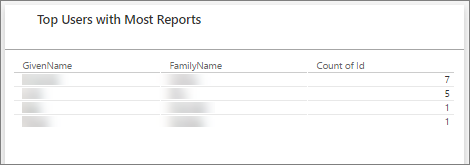
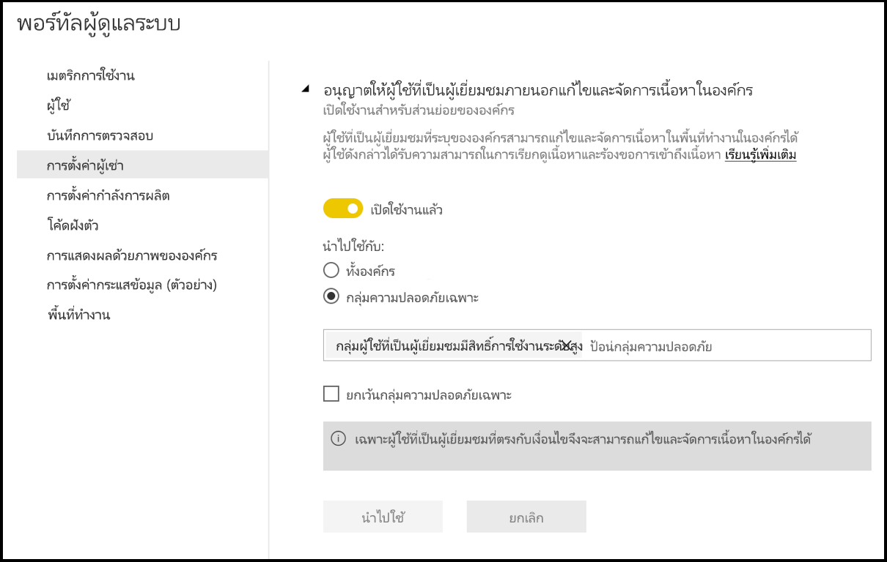
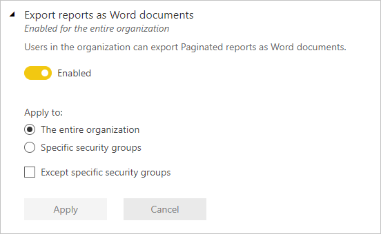
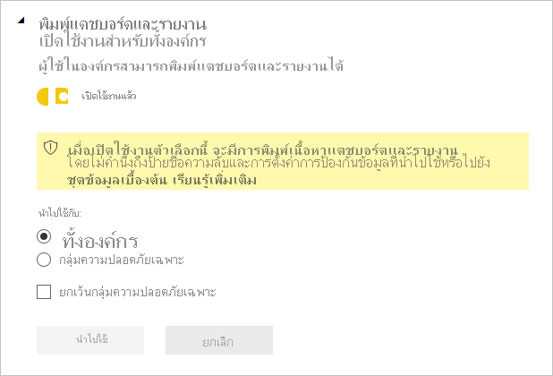
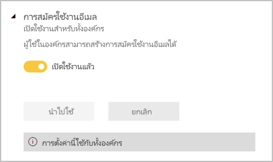

# <a name="administering-power-bi-in-the-admin-portal"></a><span data-ttu-id="ddc05-104">ดูแล Power BI ในพอร์ทัลผู้ดูแลระบบ</span><span class="sxs-lookup"><span data-stu-id="ddc05-104">Administering Power BI in the admin portal</span></span>

<span data-ttu-id="ddc05-105">พอร์ทัลผู้ดูแลระบบช่วยให้คุณสามารถจัดการการตั้งค่า Power BI สำหรับองค์กรของคุณ</span><span class="sxs-lookup"><span data-stu-id="ddc05-105">The admin portal enables you to manage the Power BI settings for your organization.</span></span> <span data-ttu-id="ddc05-106">พอร์ทัลประกอบด้วยรายการต่าง ๆ เช่น เมตริกการใช้งาน การเข้าถึงศูนย์การจัดการ Microsoft 365 และการตั้งค่าที่ควบคุม Power BI สำหรับผู้ใช้ของคุณทั้งหมด</span><span class="sxs-lookup"><span data-stu-id="ddc05-106">The portal includes items such as usage metrics, access to the Microsoft 365 admin center, and settings that govern Power BI for all your users.</span></span>

<span data-ttu-id="ddc05-107">พอร์ทัลผู้ดูแลระบบแบบเต็มสามารถเข้าถึงได้โดยผู้ดูแลระบบและผู้ใช้ที่ครอบคลุมที่มีบทบาทผู้ดูแลระบบบริการของ Power BI</span><span class="sxs-lookup"><span data-stu-id="ddc05-107">The full admin portal can be accessed by global admins and users who have the Power BI service administrator role.</span></span> <span data-ttu-id="ddc05-108">หากคุณไม่ได้รับหน้าที่ดังกล่าว คุณจะเห็นเพียง **การตั้งค่าความจุ** ในพอร์ทัลเท่านั้น</span><span class="sxs-lookup"><span data-stu-id="ddc05-108">If you're not in one of these roles, you only see **Capacity settings** in the portal.</span></span> <span data-ttu-id="ddc05-109">โปรดดูที่[การทำความเข้าใจเกี่ยวกับบทบาทผู้ดูแลระบบ Power BI](service-admin-role.md)เพื่อศึกษาข้อมูลเพิ่มเติมเกี่ยวกับบทบาทผู้ดูแลระบบบริการ Power BI</span><span class="sxs-lookup"><span data-stu-id="ddc05-109">For more information about the Power BI service administrator role, see [Understanding the Power BI admin role](service-admin-role.md).</span></span>

## <a name="how-to-get-to-the-admin-portal"></a><span data-ttu-id="ddc05-110">วิธีการเข้าถึงพอร์ทัลผู้ดูแลระบบ</span><span class="sxs-lookup"><span data-stu-id="ddc05-110">How to get to the admin portal</span></span>

<span data-ttu-id="ddc05-111">คุณต้องเป็นผู้ดูแลระบบที่ครอบคลุมหรือผู้ดูแลระบบบริการ Power BI เพื่อเข้าถึงพอร์ทัลผู้ดูแลระบบ Power BI</span><span class="sxs-lookup"><span data-stu-id="ddc05-111">You have to be a global admin or Power BI service admin to access the Power BI admin portal.</span></span> <span data-ttu-id="ddc05-112">โปรดดูที่[การทำความเข้าใจเกี่ยวกับบทบาทผู้ดูแลระบบ Power BI](service-admin-role.md)เพื่อศึกษาข้อมูลเพิ่มเติมเกี่ยวกับบทบาทผู้ดูแลระบบบริการ Power BI</span><span class="sxs-lookup"><span data-stu-id="ddc05-112">For more information about the Power BI service administrator role, see [Understanding the Power BI admin role](service-admin-role.md).</span></span> <span data-ttu-id="ddc05-113">ในการเข้าถึงพอร์ทัลผู้ดูแลระบบ Power BI ให้ทำตามขั้นตอนต่อไปนี้:</span><span class="sxs-lookup"><span data-stu-id="ddc05-113">To get to the Power BI admin portal, follow these steps:</span></span>

1. <span data-ttu-id="ddc05-114">ลงชื่อเข้าใช้ [Power BI](https://app.powerbi.com) โดยใช้ข้อมูลประจำตัวบัญชีของผู้ดูแลระบบของคุณ</span><span class="sxs-lookup"><span data-stu-id="ddc05-114">Sign in to [Power BI](https://app.powerbi.com) using your admin account credentials.</span></span>

1. <span data-ttu-id="ddc05-115">จากส่วนหัวของหน้าให้เลือก **การตั้งค่า** > **พอร์ทัลผู้ดูแล**</span><span class="sxs-lookup"><span data-stu-id="ddc05-115">From the page header, select **Settings** > **Admin portal**.</span></span>

   :::image type="content" source="media/service-admin-portal/settings-portal.png" alt-text="เมนูการตั้งค่าที่เลือกพอร์ทัลผู้ดูแลระบบไว้":::

<span data-ttu-id="ddc05-117">มีหลายส่วนในพอร์ทัลผู้ดูแล</span><span class="sxs-lookup"><span data-stu-id="ddc05-117">There are several sections in the Admin portal.</span></span> <span data-ttu-id="ddc05-118">รายละเอียดที่เหลือของบทความนี้ให้ข้อมูลเกี่ยวกับแต่ละส่วนเหล่านี้</span><span class="sxs-lookup"><span data-stu-id="ddc05-118">The rest of this article provides information about each of these sections.</span></span>

   :::image type="content" source="media/service-admin-portal/portal-menu.png" alt-text="เมนูพอร์ทัลผู้ดูแลระบบ":::

* [<span data-ttu-id="ddc05-120">เมตริกการใช้งาน</span><span class="sxs-lookup"><span data-stu-id="ddc05-120">Usage metrics</span></span>](#usage-metrics)
* [<span data-ttu-id="ddc05-121">ผู้ใช้</span><span class="sxs-lookup"><span data-stu-id="ddc05-121">Users</span></span>](#users)
* [<span data-ttu-id="ddc05-122">Premium ต่อผู้ใช้ (ตัวอย่าง)</span><span class="sxs-lookup"><span data-stu-id="ddc05-122">Premium per user (preview)</span></span>](#premium-per-user-preview)
* [<span data-ttu-id="ddc05-123">บันทึกการตรวจสอบ</span><span class="sxs-lookup"><span data-stu-id="ddc05-123">Audit logs</span></span>](#audit-logs)
* [<span data-ttu-id="ddc05-124">การตั้งค่าผู้เช่า</span><span class="sxs-lookup"><span data-stu-id="ddc05-124">Tenant settings</span></span>](#tenant-settings)
* [<span data-ttu-id="ddc05-125">การตั้งค่าความจุ</span><span class="sxs-lookup"><span data-stu-id="ddc05-125">Capacity settings</span></span>](#capacity-settings)
* [<span data-ttu-id="ddc05-126">โค้ดฝังตัว</span><span class="sxs-lookup"><span data-stu-id="ddc05-126">Embed codes</span></span>](#embed-codes)
* [<span data-ttu-id="ddc05-127">การแสดงผลด้วยภาพขององค์กร</span><span class="sxs-lookup"><span data-stu-id="ddc05-127">Organizational visuals</span></span>](organizational-visuals.md#organizational-visuals)
* [<span data-ttu-id="ddc05-128">การเชื่อมต่อ Azure (ตัวอย่าง)</span><span class="sxs-lookup"><span data-stu-id="ddc05-128">Azure connections (preview)</span></span>](#azure-connections-preview)
* [<span data-ttu-id="ddc05-129">พื้นที่ทำงาน</span><span class="sxs-lookup"><span data-stu-id="ddc05-129">Workspaces</span></span>](#workspaces)
* [<span data-ttu-id="ddc05-130">การกำหนดตราสินค้าแบบกำหนดเอง</span><span class="sxs-lookup"><span data-stu-id="ddc05-130">Custom branding</span></span>](#custom-branding)
* [<span data-ttu-id="ddc05-131">เมตริกการป้องกัน</span><span class="sxs-lookup"><span data-stu-id="ddc05-131">Protection metrics</span></span>](#protection-metrics)
* [<span data-ttu-id="ddc05-132">เนื้อหาที่โดดเด่น</span><span class="sxs-lookup"><span data-stu-id="ddc05-132">Featured content</span></span>](#featured-content)

## <a name="usage-metrics"></a><span data-ttu-id="ddc05-133">เมตริกการใช้งาน</span><span class="sxs-lookup"><span data-stu-id="ddc05-133">Usage metrics</span></span>

<span data-ttu-id="ddc05-134">**เมตริกการใช้งาน** ให้คุณตรวจสอบการใช้งาน Power BI สำหรับองค์กรของคุณ</span><span class="sxs-lookup"><span data-stu-id="ddc05-134">**Usage metrics** let you monitor Power BI usage for your organization.</span></span> <span data-ttu-id="ddc05-135">นอกจากนี้ยังแสดงให้เห็นว่าผู้ใช้และกลุ่มใดในองค์กรของคุณมีการใช้งานมากที่สุดใน Power BI</span><span class="sxs-lookup"><span data-stu-id="ddc05-135">It also shows which users and groups in your organization are the most active in Power BI.</span></span>

> [!NOTE]
> <span data-ttu-id="ddc05-136">ในครั้งแรกที่คุณเข้าถึงแดชบอร์ด หรือหลังจากที่คุณเข้าไปที่แดชบอร์ดอีกครั้งหลังจากที่ไม่ได้เข้าไปดูแดชบอรืดเป็นเวลานาน คุณอาจจะเห็นหน้าจอการโหลดขณะที่เราโหลดแดชบอร์ด</span><span class="sxs-lookup"><span data-stu-id="ddc05-136">The first time you access the dashboard, or after you visit again after a long period of not viewing the dashboard, you'll likely see a loading screen while we load the dashboard.</span></span>

<span data-ttu-id="ddc05-137">หลังจากที่โหลดแดชบอร์ด คุณจะสามารถดูไทล์ทั้งสองส่วนได้</span><span class="sxs-lookup"><span data-stu-id="ddc05-137">After the dashboard loads, you see two sections of tiles.</span></span> <span data-ttu-id="ddc05-138">ในส่วนแรกประกอบด้วยข้อมูลการใช้งานสำหรับผู้ใช้แต่ละรายและส่วนที่สองมีข้อมูลที่คล้ายกันสำหรับกลุ่ม</span><span class="sxs-lookup"><span data-stu-id="ddc05-138">The first section includes usage data for individual users and the second section has similar information for groups.</span></span>

<span data-ttu-id="ddc05-139">นี่คือข้อมูลสรุปของสิ่งที่คุณสามารถดูได้ในแต่ละไทล์:</span><span class="sxs-lookup"><span data-stu-id="ddc05-139">Here's a breakdown of what you can see in each tile:</span></span>

* <span data-ttu-id="ddc05-140">นับจำนวนที่แตกต่างกันของแดชบอร์ด รายงาน และชุดข้อมูลทั้งหมดในพื้นที่ทำงานของผู้ใช้</span><span class="sxs-lookup"><span data-stu-id="ddc05-140">Distinct count of all dashboards, reports, and datasets in the user workspace.</span></span>
  
    


* <span data-ttu-id="ddc05-142">แดชบอร์ดที่มีการใช้งานมากที่สุดตามจำนวนผู้ใช้ที่สามารถเข้าถึงได้</span><span class="sxs-lookup"><span data-stu-id="ddc05-142">Most consumed dashboard by number of users who can access it.</span></span> <span data-ttu-id="ddc05-143">ตัวอย่างเช่น: คุณมีแดชบอร์ดที่คุณแชร์กับผู้ใช้สามคน</span><span class="sxs-lookup"><span data-stu-id="ddc05-143">For example: You have a dashboard that you shared with three users.</span></span> <span data-ttu-id="ddc05-144">คุณยังได้เพิ่มแดชบอร์ดลงในชุดเนื้อหาที่ผู้ใช้ต่างกันสองคนเชื่อมต่ออยู่</span><span class="sxs-lookup"><span data-stu-id="ddc05-144">You also added the dashboard to a content pack that two different users connected to.</span></span> <span data-ttu-id="ddc05-145">จำนวนของแดชบอร์ดจะเป็น 6 (1 + 3 + 2)</span><span class="sxs-lookup"><span data-stu-id="ddc05-145">The dashboard's count would be 6 (1 + 3 + 2).</span></span>
  
    

* <span data-ttu-id="ddc05-147">เนื้อหาที่ได้รับความนิยมมากที่สุดที่ผู้ใช้ที่เชื่อมต่อด้วย</span><span class="sxs-lookup"><span data-stu-id="ddc05-147">The most popular content users connected to.</span></span> <span data-ttu-id="ddc05-148">เนื้อหาจะเป็นอย่างไรก็ได้ที่ผู้ใช้สามารถเข้าถึงได้ผ่านกระบวนการรับข้อมูล เช่น ชุดเนื้อหา SaaS ชุดเนื้อหาขององค์กร ไฟล์หรือฐานข้อมูล</span><span class="sxs-lookup"><span data-stu-id="ddc05-148">The content would be anything the users could reach through the Get Data process, such as SaaS content packs, Organizational content packs, files, or databases.</span></span>

  
    

* <span data-ttu-id="ddc05-150">มุมมองของผู้ใช้ระดับสูงของคุณที่ยึดจำนวนตามแดชบอร์ดกี่พวกเขามี ทั้งแดชบอร์ดที่พวกเขาสร้างขึ้นด้วยตนเอง และแดชบอร์ดที่แชร์ให้กับพวกเขา</span><span class="sxs-lookup"><span data-stu-id="ddc05-150">A view of your top users based on how many dashboards they have, both dashboards they created themselves and dashboards shared to them.</span></span>
  
    

* <span data-ttu-id="ddc05-152">มุมมองของผู้ใช้ระดับสูงของคุณที่ยึดตามจำนวนรายงานที่ผู้ใช้เหล่านั้นมี</span><span class="sxs-lookup"><span data-stu-id="ddc05-152">A view of your top users based on how many reports they have.</span></span>
  
    

<span data-ttu-id="ddc05-154">ส่วนที่สองแสดงชนิดเดียวกันของข้อมูล แต่จะยึดตามกลุ่ม</span><span class="sxs-lookup"><span data-stu-id="ddc05-154">The second section shows the same type of information, but based on groups.</span></span> <span data-ttu-id="ddc05-155">ส่วนนี้ช่วยให้คุณเห็นว่ากลุ่มใดในองค์กรของคุณมีการใช้งานมากที่สุดและพวกเขากำลังบริโภคเนื้อหาประเภทใด</span><span class="sxs-lookup"><span data-stu-id="ddc05-155">This section lets you see which groups in your organization are most active and what kind of content they're consuming.</span></span>

<span data-ttu-id="ddc05-156">ด้วยข้อมูลนี้ คุณสามารถได้รับข้อมูลเชิงลึกที่แท้จริงในวิธีการใช้ Power BI ทั่วทั้งองค์กรของคุณ</span><span class="sxs-lookup"><span data-stu-id="ddc05-156">With this information, you can get real insights into how people are using Power BI across your organization.</span></span>

## <a name="control-usage-metrics"></a><span data-ttu-id="ddc05-157">ควบคุมเมตริกการใช้งาน</span><span class="sxs-lookup"><span data-stu-id="ddc05-157">Control usage metrics</span></span>

<span data-ttu-id="ddc05-158">รายงานเมตริกการใช้งานเป็นคุณลักษณะที่ผู้ดูแลระบบ Power BI หรือส่วนกลางสามารถเปิดหรือปิดได้</span><span class="sxs-lookup"><span data-stu-id="ddc05-158">Usage metrics reports are a feature that the Power BI or global administrator can turn on or off.</span></span> <span data-ttu-id="ddc05-159">ผู้ดูแลระบบมีการควบคุมอย่างละเอียดว่าผู้ใช้รายใดมีสิทธิเข้าถึงเมตริกการใช้งาน</span><span class="sxs-lookup"><span data-stu-id="ddc05-159">Administrators have granular control over which users have access to usage metrics.</span></span> <span data-ttu-id="ddc05-160">ซึ่งจะ **เปิดอยู่** ตามค่าเริ่มต้นสำหรับผู้ใช้ทั้งหมดในองค์กร</span><span class="sxs-lookup"><span data-stu-id="ddc05-160">They are **On** by default for all users in the organization.</span></span>

<span data-ttu-id="ddc05-161">ผู้ดูแลระบบยังสามารถตรวจสอบว่าผู้สร้างเนื้อหาสามารถดูข้อมูลต่อผู้ใช้ในเมตริกการใช้งานได้หรือไม่</span><span class="sxs-lookup"><span data-stu-id="ddc05-161">Admins can also determine whether content creators can see per-user data in usage metrics.</span></span> 

<span data-ttu-id="ddc05-162">ดู[ตรวจสอบเมตริกการใช้งานสำหรับแดชบอร์ด Power BI และรายงาน](../collaborate-share/service-usage-metrics.md)สำหรับรายละเอียดเกี่ยวกับรายงานด้วยตนเอง</span><span class="sxs-lookup"><span data-stu-id="ddc05-162">See [Monitor usage metrics for Power BI dashboards and reports](../collaborate-share/service-usage-metrics.md) for details about the reports themselves.</span></span>

### <a name="usage-metrics-for-content-creators"></a><span data-ttu-id="ddc05-163">เมตริกการใช้งานสำหรับผู้สร้างเนื้อหา</span><span class="sxs-lookup"><span data-stu-id="ddc05-163">Usage metrics for content creators</span></span>

1. <span data-ttu-id="ddc05-164">ในพอร์ทัลผู้ดูแลระบบ ให้เลือก **การตั้งค่าผู้เช่า** > **การตรวจสอบและการตั้งค่าการใช้** > **เมตริกการใช้งานสำหรับผู้สร้างเนื้อหา**</span><span class="sxs-lookup"><span data-stu-id="ddc05-164">In the Admin portal, select **Tenant settings** > **Audit and usage settings** > **Usage metrics for content creators**.</span></span>

    

1. <span data-ttu-id="ddc05-166">เปิดใช้งาน (หรือปิดใช้งาน) เมตริกการใช้งาน > **นำไปใช้**</span><span class="sxs-lookup"><span data-stu-id="ddc05-166">Enable (or disable) usage metrics > **Apply**.</span></span>

    

### <a name="per-user-data-in-usage-metrics-for-content-creators"></a><span data-ttu-id="ddc05-168">ข้อมูลต่อผู้ใช้ในการวัดการใช้งานเพื่อผู้สร้างเนื้อหา</span><span class="sxs-lookup"><span data-stu-id="ddc05-168">Per-user data in usage metrics for content creators</span></span>

<span data-ttu-id="ddc05-169">โดยค่าเริ่มต้นข้อมูลต่อผู้ใช้จะเปิดใช้งานสำหรับเมตริกการใช้งาน และข้อมูลบัญชีจะรวมอยู่ในรายงานเมตริก</span><span class="sxs-lookup"><span data-stu-id="ddc05-169">By default, per-user data is enabled for usage metrics, and account information is included in the metrics report.</span></span> <span data-ttu-id="ddc05-170">หากคุณไม่ต้องการรวมข้อมูลบัญชีสำหรับผู้ใช้บางคนหรือทั้งหมด ให้ปิดใช้งานฟีเจอร์นี้สำหรับกลุ่มความปลอดภัยที่ระบุหรือสำหรับทั้งองค์กร</span><span class="sxs-lookup"><span data-stu-id="ddc05-170">If you don't want to include account information for some or all users, disable the feature for specified security groups or for an entire organization.</span></span> <span data-ttu-id="ddc05-171">จากนั้นข้อมูลบัญชีแสดงในรายงานว่า *ไม่มีชื่อ*</span><span class="sxs-lookup"><span data-stu-id="ddc05-171">Account information then shows in the report as *Unnamed*.</span></span>


### <a name="delete-all-existing-usage-metrics-content"></a><span data-ttu-id="ddc05-173">ลบเนื้อหาเมตริกการใช้งานที่มีอยู่ทั้งหมด</span><span class="sxs-lookup"><span data-stu-id="ddc05-173">Delete all existing usage metrics content</span></span>

<span data-ttu-id="ddc05-174">เมื่อปิดใช้งานเมตริกการใช้งานสำหรับทั้งองค์กรของพวกเขา ผู้ดูแลระบบยังสามารถเลือกตัวเลือกหนึ่ง หรือทั้งสองเพื่อ:</span><span class="sxs-lookup"><span data-stu-id="ddc05-174">When disabling usage metrics for their entire organization, admins can also choose one or both options to:</span></span>

- <span data-ttu-id="ddc05-175">**ลบเนื้อหาเมตริกการใช้งานที่มีอยู่ทั้งหมด** เพื่อลบรายงานและไทล์แดชบอร์ดที่มีอยู่ทั้งหมดที่สร้างขึ้นโดยใช้รายงานเมตริกการใช้งานและชุดข้อมูล</span><span class="sxs-lookup"><span data-stu-id="ddc05-175">**Delete all existing usage metrics content** to delete all existing reports and dashboard tiles that were built using the usage metrics reports and datasets.</span></span> <span data-ttu-id="ddc05-176">ตัวเลือกนี้จะลบการเข้าถึงข้อมูลเมตริกการใช้งานทั้งหมดสำหรับผู้ใช้ทั้งหมดในองค์กรที่อาจใช้งานอยู่แล้ว</span><span class="sxs-lookup"><span data-stu-id="ddc05-176">This option removes all access to usage metrics data for all users in the organization who may already be using it.</span></span>
- <span data-ttu-id="ddc05-177">**ลบข้อมูลต่อผู้ใช้ทั้งหมดที่มีอยู่ในเนื้อหาเมตริกการใช้งานปัจจุบัน** เพื่อลบการเข้าถึงข้อมูลเมตริกการใช้งานทั้งหมดสำหรับผู้ใช้ทั้งหมดในองค์กรที่อาจใช้งานอยู่แล้ว</span><span class="sxs-lookup"><span data-stu-id="ddc05-177">**Delete all existing per-user data in current usage metrics content** to remove all access to per-user data for all users in the organization who may already be using it.</span></span>

<span data-ttu-id="ddc05-178">โปรดระวัง การลบเนื้อหาเมตริกการใช้งานที่มีอยู่และเมตริกต่อผู้ใช้เป็นการกระทำที่ไม่สามารถเรียกกลับคืนได้</span><span class="sxs-lookup"><span data-stu-id="ddc05-178">Be careful, because deleting existing usage and per-user metrics content is irreversible.</span></span>

## <a name="users"></a><span data-ttu-id="ddc05-179">ผู้ใช้</span><span class="sxs-lookup"><span data-stu-id="ddc05-179">Users</span></span>

<span data-ttu-id="ddc05-180">คุณสามารถดูแลจัดการผู้ใช้ กลุ่ม และผู้ดูแลระบบของ Power BI ในศูนย์การจัดการ Microsoft 365</span><span class="sxs-lookup"><span data-stu-id="ddc05-180">You manage Power BI users, groups, and admins in the Microsoft 365 admin center.</span></span> <span data-ttu-id="ddc05-181">แท็บ **ผู้ใช้** จะมีลิงก์ไปยังศูนย์ผู้ดูแลระบบ</span><span class="sxs-lookup"><span data-stu-id="ddc05-181">The **Users** tab provides a link to the admin center.</span></span>


## <a name="premium-per-user-preview"></a><span data-ttu-id="ddc05-183">Premium ต่อผู้ใช้ (ตัวอย่าง)</span><span class="sxs-lookup"><span data-stu-id="ddc05-183">Premium per user (preview)</span></span>

<span data-ttu-id="ddc05-184">Premium ต่อผู้ใช้เป็นวิธีใหม่ในการให้สิทธิ์ใช้งานคุณลักษณะPremium สำหรับผู้ใช้แต่ละราย</span><span class="sxs-lookup"><span data-stu-id="ddc05-184">Premium per user is a new way to license Premium features on a per user basis.</span></span> <span data-ttu-id="ddc05-185">คุณลักษณะนี้อยู่ในตัวอย่าง</span><span class="sxs-lookup"><span data-stu-id="ddc05-185">This feature is currently in preview.</span></span> <span data-ttu-id="ddc05-186">หลังจากผู้ใช้อย่างน้อยหนึ่งคนได้รับมอบหมาย Premium ต่อสิทธิ์การใช้งานของผู้ใช้ คุณสมบัติที่เกี่ยวข้องสามารถเปิดใช้งานในพื้นที่ทำงานใดๆ ก็ได้</span><span class="sxs-lookup"><span data-stu-id="ddc05-186">After at least one user is assigned a Premium per user license, the associated features can be turned on in any workspace.</span></span> <span data-ttu-id="ddc05-187">ผู้ดูแลระบบสามารถจัดการการรีเฟรชอัตโนมัติและการตั้งค่าปริมาณงานของชุดข้อมูลที่แสดงต่อผู้ใช้และค่าเริ่มต้น</span><span class="sxs-lookup"><span data-stu-id="ddc05-187">Admins can manage the auto refresh and dataset workload settings that are shown to users and their default values.</span></span> <span data-ttu-id="ddc05-188">ตัวอย่างเช่น สามารถปิดการเข้าถึง XMLA Endpoint ตั้งค่าเป็นอ่านอย่างเดียวหรือตั้งค่าเป็นอ่าน - เขียน</span><span class="sxs-lookup"><span data-stu-id="ddc05-188">For example, access to the XMLA Endpoint can be turned off, set to read-only, or set to read-write.</span></span>

   :::image type="content" source="media/service-admin-portal/premium-per-user-options.png" alt-text="Premium ต่อการตั้งค่าผู้ใช้":::

<span data-ttu-id="ddc05-190">การอ้างอิง [คำถามที่พบบ่อยเกี่ยวกับ Power BI Premium Per User (ตัวอย่าง)](service-premium-per-user-faq.md) เพื่อเรียนรู้เพิ่มเติมเกี่ยวกับรูปแบบการให้สิทธิ์การใช้งานนี้</span><span class="sxs-lookup"><span data-stu-id="ddc05-190">Reference [Power BI Premium Per User FAQ (preview)](service-premium-per-user-faq.md) to learn more about this licensing model.</span></span>

## <a name="audit-logs"></a><span data-ttu-id="ddc05-191">บันทึกการตรวจสอบ</span><span class="sxs-lookup"><span data-stu-id="ddc05-191">Audit logs</span></span>

<span data-ttu-id="ddc05-192">คุณสามารถจัดการข้อมูลบันทึกการตรวจสอบของ Power BI ในศูนย์ดูแลความปลอดภัยและศูนย์ดูแลการปฏิบัติตามนโยบายของ Office 365</span><span class="sxs-lookup"><span data-stu-id="ddc05-192">You manage Power BI audit logs in the Office 365 Security & Compliance center.</span></span> <span data-ttu-id="ddc05-193">แท็บ **บันทึกการตรวจสอบ** จะมีลิงก์ไปยังศูนย์ดูแลความปลอดภัยและการปฏิบัติตามข้อกำหนด</span><span class="sxs-lookup"><span data-stu-id="ddc05-193">The **Audit logs** tab provides a link to the Security & Compliance center.</span></span> <span data-ttu-id="ddc05-194">ในการเรียนรู้เพิ่มเติมให้ดู [ติดตามกิจกรรมของผู้ใช้ใน Power BI](service-admin-auditing.md)</span><span class="sxs-lookup"><span data-stu-id="ddc05-194">To learn more, see [Track user activities in Power BI](service-admin-auditing.md).</span></span>

<span data-ttu-id="ddc05-195">หากต้องการใช้บันทึกการตรวจสอบ ให้ตรวจสอบให้แน่ใจว่าได้เปิดใช้งานการตั้งค่า [**สร้างบันทึกการตรวจสอบสำหรับกิจกรรมภายในการตรวจสอบและการปฏิบัติตามนโยบาย**](#create-audit-logs-for-internal-activity-auditing-and-compliance)</span><span class="sxs-lookup"><span data-stu-id="ddc05-195">To use audit logs, make sure the [**Create audit logs for internal activity auditing and compliance**](#create-audit-logs-for-internal-activity-auditing-and-compliance) setting is enabled.</span></span>

## <a name="tenant-settings"></a><span data-ttu-id="ddc05-196">การตั้งค่าผู้เช่า</span><span class="sxs-lookup"><span data-stu-id="ddc05-196">Tenant settings</span></span>

<span data-ttu-id="ddc05-197">**การตั้งค่าผู้เช่า** ช่วยให้สามารถควบคุมคุณลักษณะต่าง ๆ ที่มีให้ในองค์กรของคุณได้อย่างละเอียด</span><span class="sxs-lookup"><span data-stu-id="ddc05-197">**Tenant settings** enable fine-grained control over the features that are made available to your organization.</span></span> <span data-ttu-id="ddc05-198">ถ้าคุณมีข้อกังวลเกี่ยวกับข้อมูลที่ละเอียดอ่อน คุณลักษณะบางรายการของเราอาจไม่เหมาะสำหรับองค์กรของคุณ หรือคุณอาจต้องการคุณลักษณะที่เจาะจงพร้อมใช้งานสำหรับเฉพาะกลุ่มเท่านั้น</span><span class="sxs-lookup"><span data-stu-id="ddc05-198">If you have concerns around sensitive data, some of our features may not be right for your organization, or you may only want a particular feature to be available to a specific group.</span></span>

> [!NOTE]
> <span data-ttu-id="ddc05-199">การตั้งค่าผู้เช่าที่ควบคุมความพร้อมการใช้งานของฟีเจอร์ในอินเทอร์เฟซผู้ใช้ Power BI สามารถช่วยในการกำหนดนโยบายการกำกับดูแล แต่ไม่ใช่ในมาตรการด้านความปลอดภัย</span><span class="sxs-lookup"><span data-stu-id="ddc05-199">Tenant settings that control the availability of features in the Power BI user interface can help to establish governance policies, but they're not a security measure.</span></span> <span data-ttu-id="ddc05-200">ตัวอย่างเช่นการตั้งค่าการ **ส่งออกข้อมูล** ไม่จำกัดสิทธิ์ของผู้ใช้ Power BI ในชุดข้อมูล</span><span class="sxs-lookup"><span data-stu-id="ddc05-200">For example, the **Export data** setting doesn't restrict the permissions of a Power BI user on a dataset.</span></span> <span data-ttu-id="ddc05-201">ผู้ใช้ Power BI ที่มีการเข้าถึงแบบอ่านชุดข้อมูลมีสิทธิ์ในการคิวรีชุดข้อมูลนี้ และอาจสามารถยืนยันผลลัพธ์ได้โดยไม่ต้องใช้คุณลักษณะ **ส่งออกข้อมูล** ในอินเทอร์เฟซผู้ใช้ Power BI</span><span class="sxs-lookup"><span data-stu-id="ddc05-201">Power BI users with read access to a dataset have the permission to query this dataset and might be able to persist the results without using the **Export data** feature in the Power BI user interface.</span></span>

<span data-ttu-id="ddc05-202">ส่วนต่อไปนี้แสดงการตั้งค่าต่าง ๆ บนแท็บ **การตั้งค่าผู้เช่า**</span><span class="sxs-lookup"><span data-stu-id="ddc05-202">The following sections elaborate on the settings on the **Tenant settings** tab.</span></span>

> [!NOTE]
> <span data-ttu-id="ddc05-203">อาจใช้เวลาถึง 15 นาทีในการเปลี่ยนแปลงการตั้งค่าจึงจะมีผลกับทุกคนในองค์กรของคุณ</span><span class="sxs-lookup"><span data-stu-id="ddc05-203">It can take up to 15 minutes for a setting change to take effect for everyone in your organization.</span></span>

<span data-ttu-id="ddc05-204">การตั้งค่าสามารถมีหนึ่งในสามสถานะ:</span><span class="sxs-lookup"><span data-stu-id="ddc05-204">Many of the settings can have one of three states:</span></span>

* <span data-ttu-id="ddc05-205">**ปิดใช้งานสำหรับทั้งองค์กร**: ไม่มีใครในองค์กรของคุณสามารถใช้ฟีเจอร์นี้ได้</span><span class="sxs-lookup"><span data-stu-id="ddc05-205">**Disabled for the entire organization**: No one in your organization can use this feature.</span></span>

    

* <span data-ttu-id="ddc05-207">**เปิดใช้งานสำหรับทั้งองค์กร**: ทุกคนในองค์กรของคุณสามารถใช้ฟีเจอร์นี้ได้</span><span class="sxs-lookup"><span data-stu-id="ddc05-207">**Enabled for the entire organization**: Everyone in your organization can use this feature.</span></span>

    

* <span data-ttu-id="ddc05-209">**เปิดการใช้งานระบบกลุ่มย่อยในองค์กร**: กลุ่มความปลอดภัยเฉพาะในองค์กรของคุณได้รับอนุญาตให้ใช้คุณลักษณะนี้</span><span class="sxs-lookup"><span data-stu-id="ddc05-209">**Enabled for a subset of the organization**: Specific security groups in your organization are allowed to use this feature.</span></span>

    <span data-ttu-id="ddc05-210">คุณยังสามารถเปิดใช้งานฟีเจอร์สำหรับทั้งองค์กรของคุณ **ยกเว้นกลุ่มความปลอดภัยเฉพาะ**</span><span class="sxs-lookup"><span data-stu-id="ddc05-210">You can also enable a feature for your entire organization, **Except specific security groups**.</span></span>

    

    <span data-ttu-id="ddc05-212">คุณยังสามารถรวมการตั้งค่าเพื่อเปิดใช้งานฟีเจอร์เฉพาะสำหรับผู้ใช้กลุ่มเฉพาะและปิดใช้งานสำหรับกลุ่มผู้ใช้</span><span class="sxs-lookup"><span data-stu-id="ddc05-212">You can also combine settings to enable the feature only for a specific group of users and also disable it for a group of users.</span></span> <span data-ttu-id="ddc05-213">การใช้วิธีนี้ช่วยให้มั่นใจได้ว่าผู้ใช้บางรายจะไม่สามารถเข้าถึงฟีเจอร์นี้ได้แม้ว่าจะอยู่ในกลุ่มที่อนุญาตก็ตาม</span><span class="sxs-lookup"><span data-stu-id="ddc05-213">Using this approach ensures that certain users don't have access to the feature even if they're in the allowed group.</span></span> <span data-ttu-id="ddc05-214">มีการใช้การตั้งค่าที่เข้มงวดที่สุดสำหรับผู้ใช้</span><span class="sxs-lookup"><span data-stu-id="ddc05-214">The most restrictive setting for a user applies.</span></span>

    

<span data-ttu-id="ddc05-216">สองสามหัวข้อถัดไปให้ภาพรวมเรื่องชนิดต่าง ๆ ของการตั้งค่าผู้เช่า</span><span class="sxs-lookup"><span data-stu-id="ddc05-216">The next few sections provide an overview of the different types of tenant settings.</span></span>

## <a name="tenant-wide-new-look-settings"></a><span data-ttu-id="ddc05-217">การตั้งค่ารูปลักษณ์ใหม่ทั่วทั้งผู้เช่า</span><span class="sxs-lookup"><span data-stu-id="ddc05-217">Tenant-wide new look settings</span></span>

<span data-ttu-id="ddc05-218">เมื่อมีการปิดใช้งานตัวเลือก **รูปลักษณ์ใหม่** ผู้ใช้ในองค์กรนี้สามารถสลับเปิดและปิดรูปลักษณ์ใหม่ของ Power BI ได้</span><span class="sxs-lookup"><span data-stu-id="ddc05-218">When the **New look** option is disabled, users in this organization can toggle on and off the new look of Power BI.</span></span> <span data-ttu-id="ddc05-219">เมื่อคุณเปิดใช้งานตัวเลือก **รูปลักษ์ใหม่** ผู้ใช้ *ทั้งหมด* ในองค์กรนี้จะมองเห็นส่วนคุวบคุมที่ทันสมัยของ Power BI รูปลักษณ์ใหม่ได้ตลอดเวลา</span><span class="sxs-lookup"><span data-stu-id="ddc05-219">When you enable the **New look** option, *all* users in this organization see the modern controls of the new look of Power BI all the time.</span></span> <span data-ttu-id="ddc05-220">โดยที่พวกเขาจะไม่สามารถสลับออกจากรูปลักษณ์ใหม่ได้อีก</span><span class="sxs-lookup"><span data-stu-id="ddc05-220">They can no longer toggle off the new look.</span></span> <span data-ttu-id="ddc05-221">ตัวเลือกรูปลักษณ์ใหม่นี้ จะเปิดใช้งานโดยค่าเริ่มต้น</span><span class="sxs-lookup"><span data-stu-id="ddc05-221">The New look option is enabled by default.</span></span>

:::image type="content" source="media/service-admin-portal/admin-portal-new-look-disable.png" alt-text="สกรีนช็อตของตัวเลือกปิดใช้งานรูปลักษณ์ใหม่ในพอร์ทัลผู้ดูแลระบบ":::

## <a name="help-and-support-settings"></a><span data-ttu-id="ddc05-223">การตั้งค่าความช่วยเหลือและการสนับสนุน</span><span class="sxs-lookup"><span data-stu-id="ddc05-223">Help and support settings</span></span>

### <a name="publish-get-help-information"></a><span data-ttu-id="ddc05-224">เผยแพร่ข้อมูล "รับความช่วยเหลือ"</span><span class="sxs-lookup"><span data-stu-id="ddc05-224">Publish "Get Help" information</span></span>


<span data-ttu-id="ddc05-226">ผู้ดูแลระบบสามารถระบุ URL ภายในเพื่อแทนที่ปลายทางของลิงก์บนเมนูวิธีใช้ Power BI และสำหรับการอัปเกรดใบอนุญาตการใช้งาน</span><span class="sxs-lookup"><span data-stu-id="ddc05-226">Admins can specify internal URLs to override the destination of links on the Power BI help menu and for license upgrades.</span></span> <span data-ttu-id="ddc05-227">หากตั้งค่า URL ที่กำหนดเอง ผู้ใช้ในองค์กรจะไปยังที่ความช่วยเหลือภายในและสนับสนุนทรัพยากรแทนที่ปลายทางค่าเริ่มต้น</span><span class="sxs-lookup"><span data-stu-id="ddc05-227">If custom URLs are set, users in the organization go to internal help and support resources instead of the default destinations.</span></span> <span data-ttu-id="ddc05-228">สามารถกำหนดปลายทางของทรัพยากรต่อไปนี้ได้:</span><span class="sxs-lookup"><span data-stu-id="ddc05-228">The following resource destinations can be customized:</span></span>

* <span data-ttu-id="ddc05-229">**เรียนรู้**</span><span class="sxs-lookup"><span data-stu-id="ddc05-229">**Learn**.</span></span> <span data-ttu-id="ddc05-230">โดยค่าเริ่มต้นลิงก์เมนูวิธีใช้นี้จะกำหนดเป้าหมาย [รายการของเส้นทางการเรียนรู้และโมดูลของ Power BI ทั้งหมด](/learn/browse/?products=power-bi)</span><span class="sxs-lookup"><span data-stu-id="ddc05-230">By default, this help menu link targets a [list of all our Power BI learning paths and modules](/learn/browse/?products=power-bi).</span></span> <span data-ttu-id="ddc05-231">ในการนำลิงก์นี้ไปยังแหล่งข้อมูลการฝึกอบรมภายในแทน ให้ตั้งค่า URL ที่กำหนดเองสำหรับ **เอกสารการฝึกอบรม**</span><span class="sxs-lookup"><span data-stu-id="ddc05-231">To direct this link to internal training resources instead, set a custom URL for **Training documentation**.</span></span>

* <span data-ttu-id="ddc05-232">**ชุมชน**</span><span class="sxs-lookup"><span data-stu-id="ddc05-232">**Community**.</span></span> <span data-ttu-id="ddc05-233">ในการนำผู้ใช้ไปยังฟอรัมภายในจากเมนูความช่วยเหลือ แทนที่จะเป็น [ชุมชน Power BI](https://community.powerbi.com/) ตั้งค่า URL ที่กำหนดเองสำหรับ **ฟอรัมสนทนา**</span><span class="sxs-lookup"><span data-stu-id="ddc05-233">To take users to an internal forum from the help menu, instead of to the [Power BI Community](https://community.powerbi.com/), set a custom URL for **Discussion forum**.</span></span>

* <span data-ttu-id="ddc05-234">**การอัปเกรดการอนุญาตใช้งาน**</span><span class="sxs-lookup"><span data-stu-id="ddc05-234">**Licensing upgrades**.</span></span> <span data-ttu-id="ddc05-235">ผู้ใช้ที่มีสิทธิ์การใช้งาน Power BI (ฟรี) อาจได้รับโอกาสในการอัปเกรดบัญชีเป็น Power BI Pro ในขณะที่ใช้บริการ</span><span class="sxs-lookup"><span data-stu-id="ddc05-235">Users with a Power BI (free) license may be presented with the opportunity to upgrade their account to Power BI Pro while using the service.</span></span> <span data-ttu-id="ddc05-236">หากคุณระบุ URL ภายในสำหรับ **คำขอการอนุญาตใช้งาน** คุณจะเปลี่ยนเส้นทางผู้ใช้ไปยังคำขอภายในและขั้นตอนการซื้อและป้องกันการซื้อแบบบริการด้วยตนเอง</span><span class="sxs-lookup"><span data-stu-id="ddc05-236">If you specify an internal URL for **Licensing requests**, you redirect users to an internal request and purchase flow and prevent self-service purchase.</span></span> <span data-ttu-id="ddc05-237">ถ้าคุณต้องการป้องกันไม่ให้ผู้ใช้จากการซื้อใบอนุญาตใช้งาน แต่สามารถให้ผู้ใช้เริ่มทดลองใช้ Power BI Pro ได้ ให้ดูที่ [ อนุญาตให้ผู้ใช้ทดลองใช้ Power BI Pro ](#allow-users-to-try-power-bi-paid-features) เพื่อแยกประสบการณ์การซื้อและการทดลองใช้</span><span class="sxs-lookup"><span data-stu-id="ddc05-237">If you want to prevent users from buying licenses, but are okay with letting users start a Power BI Pro trial, see [Allow users to try Power BI Pro](#allow-users-to-try-power-bi-paid-features) to separate the buy and try experiences.</span></span>

* <span data-ttu-id="ddc05-238">**รับการช่วยเหลือ**</span><span class="sxs-lookup"><span data-stu-id="ddc05-238">**Get help**.</span></span> <span data-ttu-id="ddc05-239">ในการนำผู้ใช้ไปยังส่วนช่วยเหลือภายในจากเมนูความช่วยเหลือแทนที่จะเป็น [การสนับสนุน Power BI](https://powerbi.microsoft.com/support/) ให้ตั้งค่า URL ที่กำหนดเองสำหรับ **แผนกช่วยเหลือ**</span><span class="sxs-lookup"><span data-stu-id="ddc05-239">To take users to an internal help desk from the help menu, instead of to [Power BI Support](https://powerbi.microsoft.com/support/), set a custom URL for **Help Desk**.</span></span>

### <a name="receive-email-notifications-for-service-outages-or-incidents"></a><span data-ttu-id="ddc05-240">รับการแจ้งเตือนทางอีเมลสำหรับการหยุดทำงานหรือเหตุขัดข้องของการบริการ</span><span class="sxs-lookup"><span data-stu-id="ddc05-240">Receive email notifications for service outages or incidents</span></span>

<span data-ttu-id="ddc05-241">กลุ่มความปลอดภัยที่เปิดใช้งานจดหมายจะได้รับการแจ้งเตือนทางอีเมลถ้าผู้เช่ารายนี้ได้รับผลกระทบจากการหยุดทำงานหรือเหตุการณ์ที่เกิดขึ้น</span><span class="sxs-lookup"><span data-stu-id="ddc05-241">Mail-enabled security groups will receive email notifications if this tenant is impacted by a service outage or incident.</span></span> <span data-ttu-id="ddc05-242">เรียนรู้เพิ่มเติมเกี่ยวกับ [การแจ้งเตือนการหยุดชะงักของบริการ](service-interruption-notifications.md)</span><span class="sxs-lookup"><span data-stu-id="ddc05-242">Learn more about [Service interruption notifications](service-interruption-notifications.md).</span></span>

### <a name="allow-users-to-try-power-bi-paid-features"></a><span data-ttu-id="ddc05-243">อนุญาตให้ผู้ใช้ทดลองใช้ฟีเจอร์ Power BI แบบชําระเงิน</span><span class="sxs-lookup"><span data-stu-id="ddc05-243">Allow users to try Power BI paid features</span></span>


<span data-ttu-id="ddc05-245">การตั้งค่าเพื่อ **อนุญาตให้ผู้ใช้ทดลองใช้ฟีเจอร์ Power BI แบบชําระเงิน** จะเปิดใช้งานตามค่าเริ่มต้น</span><span class="sxs-lookup"><span data-stu-id="ddc05-245">The setting to **Allow users to try Power BI paid features** is enabled by default.</span></span> <span data-ttu-id="ddc05-246">การตั้งค่านี้จะช่วยเพิ่มการควบคุมของคุณเกี่ยวกับการมอบสิทธิ์ Power BI Pro ให้กับผู้ใช้</span><span class="sxs-lookup"><span data-stu-id="ddc05-246">This setting increases your control over how users acquire Power BI Pro licenses.</span></span> <span data-ttu-id="ddc05-247">ในสถานการณ์ที่คุณได้บล็อกการซื้อแบบบริการด้วยตนเอง การตั้งค่านี้ช่วยจะให้ผู้ใช้เริ่มทดลองใช้ Power BI Pro ได้</span><span class="sxs-lookup"><span data-stu-id="ddc05-247">In scenarios where you have blocked self-service purchase, this setting lets users start a Power BI Pro trial.</span></span> <span data-ttu-id="ddc05-248">ประสบการณ์ของผู้ใช้ปลายทางจะขึ้นอยู่กับวิธีที่คุณตั้งค่าสิทธิ์การใช้งาน</span><span class="sxs-lookup"><span data-stu-id="ddc05-248">The end-user experience depends on how you combine license settings.</span></span> <span data-ttu-id="ddc05-249">ตารางด้านล่างแสดงให้เห็นว่าประสบการณ์การอัปเกรดจาก Power BI (ฟรี) เป็น Power BI Pro ได้รับผลจากชุดค่าผสมที่แตกต่างกันอย่างไร:</span><span class="sxs-lookup"><span data-stu-id="ddc05-249">The table below shows how the upgrade experience from Power BI (free) to Power BI Pro is affected by different setting combinations:</span></span>

| <span data-ttu-id="ddc05-250">การตั้งค่าการซื้อแบบบริการด้วยตนเอง</span><span class="sxs-lookup"><span data-stu-id="ddc05-250">Self-service purchase setting</span></span> | <span data-ttu-id="ddc05-251">อนุญาตให้ผู้ใช้ลองใช้การตั้งค่า Power BI Pro</span><span class="sxs-lookup"><span data-stu-id="ddc05-251">Allow user to try Power BI Pro setting</span></span> | <span data-ttu-id="ddc05-252">ประสบการณ์ของผู้ใช้ปลายทาง</span><span class="sxs-lookup"><span data-stu-id="ddc05-252">End-user experience</span></span> |
| ------ | ------ | ----- |
| <span data-ttu-id="ddc05-253">เปิดใช้งานแล้ว</span><span class="sxs-lookup"><span data-stu-id="ddc05-253">Enabled</span></span> | <span data-ttu-id="ddc05-254">ถูกปิดใช้งาน</span><span class="sxs-lookup"><span data-stu-id="ddc05-254">Disabled</span></span> | <span data-ttu-id="ddc05-255">ผู้ใช้สามารถซื้อใบอนุญาตการใช้งานแบบ Pro แต่ไม่สามารถเริ่มทดลองใช้งานได้</span><span class="sxs-lookup"><span data-stu-id="ddc05-255">User can buy a Pro license, but can't start a trial</span></span> |
| <span data-ttu-id="ddc05-256">เปิดใช้งานแล้ว</span><span class="sxs-lookup"><span data-stu-id="ddc05-256">Enabled</span></span> | <span data-ttu-id="ddc05-257">เปิดใช้งานแล้ว</span><span class="sxs-lookup"><span data-stu-id="ddc05-257">Enabled</span></span> | <span data-ttu-id="ddc05-258">ผู้ใช้สามารถเริ่มทดลองใช้ Pro ได้ฟรีและอัปเกรดเป็นใบอนุญาตใช้งานแบบชำระเงินได้</span><span class="sxs-lookup"><span data-stu-id="ddc05-258">User can start a free trial of Pro and can upgrade to a paid license</span></span> |
| <span data-ttu-id="ddc05-259">ถูกปิดใช้งาน</span><span class="sxs-lookup"><span data-stu-id="ddc05-259">Disabled</span></span> | <span data-ttu-id="ddc05-260">ถูกปิดใช้งาน</span><span class="sxs-lookup"><span data-stu-id="ddc05-260">Disabled</span></span> | <span data-ttu-id="ddc05-261">ผู้ใช้เห็นข้อความเพื่อติดต่อผู้ดูแลระบบไอทีเพื่อขอใบอนุญาตใช้งาน</span><span class="sxs-lookup"><span data-stu-id="ddc05-261">User sees a message to contact the IT admin to request a license</span></span> |
| <span data-ttu-id="ddc05-262">ถูกปิดใช้งาน</span><span class="sxs-lookup"><span data-stu-id="ddc05-262">Disabled</span></span> | <span data-ttu-id="ddc05-263">เปิดใช้งานแล้ว</span><span class="sxs-lookup"><span data-stu-id="ddc05-263">Enabled</span></span> | <span data-ttu-id="ddc05-264">ผู้ใช้สามารถเริ่มการทดลองใช้ Pro ได้ แต่ต้องติดต่อผู้ดูแลระบบไอทีเพื่อขอใบอนุญาตใช้งานแบบชำระเงิน</span><span class="sxs-lookup"><span data-stu-id="ddc05-264">User can start a Pro trial, but must contact the IT admin to get a paid license</span></span> |

> [!NOTE]
> <span data-ttu-id="ddc05-265">คุณสามารถเพิ่ม URL ภายในสำหรับคำขอใบอนุญาตใช้งานใน [การตั้งค่าความช่วยเหลือและการสนับสนุน](#help-and-support-settings)</span><span class="sxs-lookup"><span data-stu-id="ddc05-265">You can add an internal URL for licensing requests in [Help and support settings](#help-and-support-settings).</span></span> <span data-ttu-id="ddc05-266">หากคุณตั้งค่า URL แล้ว จะทำการแทนที่ประสบการณ์การซื้อด้วยตัวเองตามค่าเริ่มต้น</span><span class="sxs-lookup"><span data-stu-id="ddc05-266">If you set the URL, it overrides the default self-service purchase experience.</span></span> <span data-ttu-id="ddc05-267">ซึ่งจะไม่เปลี่ยนเส้นทางการลงทะเบียนสำหรับการทดลองใช้งาน Power BI Pro</span><span class="sxs-lookup"><span data-stu-id="ddc05-267">It doesn't redirect signup for a Power BI Pro license trial.</span></span> <span data-ttu-id="ddc05-268">ผู้ใช้ที่สามารถซื้อใบอนุญาตใช้งานในสถานการณ์ที่อธิบายไว้ในตารางด้านบนจะถูกเปลี่ยนเส้นทางไปยัง URL ภายในของคุณ</span><span class="sxs-lookup"><span data-stu-id="ddc05-268">Users who can buy a license in the scenarios described in the table above are redirected to your internal URL.</span></span>

<span data-ttu-id="ddc05-269">ให้การเรียนรู้เพิ่มเติม ให้ดูที่ [เปิดหรือปิดการสมัครใช้งานและการซื้อด้วยตนเอง](service-admin-disable-self-service.md)</span><span class="sxs-lookup"><span data-stu-id="ddc05-269">To learn more, see [Enable or disable self-service sign-up and purchasing](service-admin-disable-self-service.md).</span></span>

### <a name="show-a-custom-message-before-publishing-reports"></a><span data-ttu-id="ddc05-270">แสดงข้อความแบบกำหนดเองก่อนที่จะเผยแพร่รายงาน</span><span class="sxs-lookup"><span data-stu-id="ddc05-270">Show a custom message before publishing reports</span></span>  

<span data-ttu-id="ddc05-271">ผู้ดูแลระบบสามารถระบุข้อความแบบกำหนดเองที่ปรากฏขึ้นก่อนที่ผู้ใช้จะเผยแพร่รายงานจาก Power BI Desktop ได้</span><span class="sxs-lookup"><span data-stu-id="ddc05-271">Admins can provide a custom message that appears before a user publishes a report from Power BI Desktop.</span></span> <span data-ttu-id="ddc05-272">หลังจากที่คุณเปิดใช้งานการตั้งค่าแล้ว คุณจำเป็นต้องใส่ **ข้อความแบบกำหนดเอง**</span><span class="sxs-lookup"><span data-stu-id="ddc05-272">After you enable the setting, you need to provide a **Custom message**.</span></span> <span data-ttu-id="ddc05-273">ข้อความแบบกำหนดเองสามารถเป็นข้อความธรรมดาหรือข้อความที่เขียนด้วยไวยากรณ์ Markdown ตามที่แสดงในข้อความตัวอย่างต่อไปนี้ได้:</span><span class="sxs-lookup"><span data-stu-id="ddc05-273">The Custom message can be plain text or follow Markdown syntax, as in the following example message:</span></span>

```markdown
#### Important Disclaimer 

Before publishing the report to a workspace, be sure to validate that the appropriate users or groups have access to the destination workspace. If some users or groups should *not* have access to the content and underlying artifacts, remove or modify their access to the workspace, or publish the report to a different workspace. [Learn more](https://docs.microsoft.com/power-bi/collaborate-share/service-create-the-new-workspaces#give-access-to-your-workspace). 
```

<span data-ttu-id="ddc05-274">พื้นที่ **ข้อความแบบกำหนดเอง** รองรับการเลื่อน ดังนั้นคุณสามารถระบุข้อความได้สูงสุดถึง 5,000 อักขระ</span><span class="sxs-lookup"><span data-stu-id="ddc05-274">The **Custom message** text area does support scrolling, so you can provide a message up to 5,000 characters.</span></span>

:::image type="content" source="media/service-admin-portal/admin-show-custom-message.png" alt-text="ภาพถ่ายหน้าจอของกล่องข้อความแบบกำหนดเอง":::

<span data-ttu-id="ddc05-276">เมื่อผู้ใช้ของคุณเผยแพร่รายงานไปยังพื้นที่ทำงานใน Power BI ผู้ใช้จะเห็นข้อความที่คุณเขียนไว้</span><span class="sxs-lookup"><span data-stu-id="ddc05-276">When your users publish reports to workspaces in Power BI, they see the message you've written.</span></span>

:::image type="content" source="media/service-admin-portal/admin-user-show-custom-message.png" alt-text="กล่องโต้ตอบที่ผู้ใช้ของคุณเห็นเมื่อเผยแพร่รายงานไปยังพื้นที่ทำงาน":::

<span data-ttu-id="ddc05-278">เช่นเดียวกับการตั้งค่าผู้เช่าอื่น ๆ คุณสามารถเลือกได้ว่าจะใช้ **ข้อความแบบกำหนดเอง** กับใครบ้าง:</span><span class="sxs-lookup"><span data-stu-id="ddc05-278">As with other tenant settings, you can choose who the **Custom message** applies to:</span></span>

- <span data-ttu-id="ddc05-279">**ทั้งองค์กร**</span><span class="sxs-lookup"><span data-stu-id="ddc05-279">**The entire organization**.</span></span>
- <span data-ttu-id="ddc05-280">**กลุ่มความปลอดภัยเฉพาะ**</span><span class="sxs-lookup"><span data-stu-id="ddc05-280">**Specific security groups**.</span></span>
- <span data-ttu-id="ddc05-281">หรือ **ยกเว้นกลุ่มความปลอดภัยเฉพาะ**</span><span class="sxs-lookup"><span data-stu-id="ddc05-281">Or **Except specific security groups**.</span></span>

## <a name="workspace-settings"></a><span data-ttu-id="ddc05-282">การตั้งค่าพื้นที่ทำงาน</span><span class="sxs-lookup"><span data-stu-id="ddc05-282">Workspace settings</span></span>

<span data-ttu-id="ddc05-283">ใน **การตั้งค่าผู้เช่า** พอร์ทัลผู้ดูแลระบบจะมีสามส่วนสำหรับควบคุมพื้นที่ทำงาน:</span><span class="sxs-lookup"><span data-stu-id="ddc05-283">In **Tenant settings**, the admin portal has three sections for controlling workspaces:</span></span>

- <span data-ttu-id="ddc05-284">[สร้างประสบการณ์พื้นที่ทำงานใหม่](#create-the-new-workspaces)</span><span class="sxs-lookup"><span data-stu-id="ddc05-284">[Create the new workspace experiences](#create-the-new-workspaces).</span></span>
- <span data-ttu-id="ddc05-285">[ใช้ชุดข้อมูลทั่วพื้นที่ทำงาน](#use-datasets-across-workspaces)</span><span class="sxs-lookup"><span data-stu-id="ddc05-285">[Use datasets across workspaces](#use-datasets-across-workspaces).</span></span>
- <span data-ttu-id="ddc05-286">[บล็อกการสร้างพื้นที่ทำงานแบบคลาสสิก](#block-classic-workspace-creation)</span><span class="sxs-lookup"><span data-stu-id="ddc05-286">[Block classic workspace creation](#block-classic-workspace-creation).</span></span>

### <a name="create-the-new-workspaces"></a><span data-ttu-id="ddc05-287">สร้างพื้นที่ทำงานใหม่</span><span class="sxs-lookup"><span data-stu-id="ddc05-287">Create the new workspaces</span></span>

<span data-ttu-id="ddc05-288">พื้นที่ทำงานเป็นสถานที่ที่ผู้ใช้ทำงานร่วมกันบนแดชบอร์ด รายงาน และเนื้อหาอื่น ๆ</span><span class="sxs-lookup"><span data-stu-id="ddc05-288">Workspaces are places where users collaborate on dashboards, reports, and other content.</span></span> <span data-ttu-id="ddc05-289">ผู้ดูแลระบบใช้การตั้งค่า **สร้างพื้นที่ทำงาน (ประสบการณ์ใช้งานพื้นที่ทำงานใหม่** เพื่อระบุว่าผู้ใช้คนใดในองค์กรที่สามารถสร้างพื้นที่ทำงานได้</span><span class="sxs-lookup"><span data-stu-id="ddc05-289">Admins use the **Create workspaces (new workspace experience** setting to indicate which users in the organization can create workspaces.</span></span> <span data-ttu-id="ddc05-290">ผู้ดูแลระบบสามารถอนุญาตหรือไม่อนุญาตให้ทุกคนในองค์กรสร้างพื้นที่ทำงานเพื่อประสบการณ์ใช้งานพื้นที่ทำงานใหม่ได้</span><span class="sxs-lookup"><span data-stu-id="ddc05-290">Admins can allow everybody or nobody in an organization to create new workspace experience workspaces.</span></span> <span data-ttu-id="ddc05-291">พวกเขายังสามารถจำกัดการสร้างให้กับสมาชิกของกลุ่มความปลอดภัยที่เฉพาะเจาะจง</span><span class="sxs-lookup"><span data-stu-id="ddc05-291">They can also limit creation to members of specific security groups.</span></span> <span data-ttu-id="ddc05-292">เรียนรู้เพิ่มเติมเกี่ยวกับ [พื้นที่ทำงาน](../collaborate-share/service-new-workspaces.md)</span><span class="sxs-lookup"><span data-stu-id="ddc05-292">Learn more about [workspaces](../collaborate-share/service-new-workspaces.md).</span></span>

:::image type="content" source="media/service-admin-portal/power-bi-admin-workspace-settings.png" alt-text="สร้างประสบการณ์ใช้งานพื้นที่ทำงานใหม่":::

<span data-ttu-id="ddc05-294">สำหรับพื้นที่ทำงานแบบคลาสสิกตาม Microsoft 365 Group การดูแลยังคงเกิดขึ้นในพอร์ทัลผู้ดูแลระบบ และ Azure Active Directory</span><span class="sxs-lookup"><span data-stu-id="ddc05-294">For classic workspaces based on Microsoft 365 Groups, administration continues to occur in admin portal and Azure Active Directory.</span></span>

> [!NOTE]
> <span data-ttu-id="ddc05-295">การตั้งค่า **สร้างพื้นที่ทำงาน (ประสบการณ์พื้นที่ทำงานใหม่)** มีค่าเริ่มต้นเพื่ออนุญาตให้เฉพาะผู้ใช้ที่สามารถสร้าง Microsoft 365 Group เท่านั้นที่สามารถสร้างพื้นที่ทำงานใหม่ใน Powe BI ได้</span><span class="sxs-lookup"><span data-stu-id="ddc05-295">The **Create workspaces (new workspace experience)** setting defaults to allowing only users who can create Microsoft 365 Groups to create the new Power BI workspaces.</span></span> <span data-ttu-id="ddc05-296">ตรวจสอบให้แน่ใจว่าได้ตั้งค่าในพอร์ทัลผู้ดูแลระบบ Power BI เพื่อให้แน่ใจว่ามีผู้ใช้ที่เหมาะสมที่สามารถสร้างพื้นที่ได้</span><span class="sxs-lookup"><span data-stu-id="ddc05-296">Be sure to set a value in the Power BI admin portal to ensure appropriate users can create them.</span></span>

<span data-ttu-id="ddc05-297">**รายการพื้นที่ทำงาน**</span><span class="sxs-lookup"><span data-stu-id="ddc05-297">**List of workspaces**</span></span>

<span data-ttu-id="ddc05-298">พอร์ทัลผู้ดูแลมีการตั้งค่าอีกส่วนหนึ่งซึ่งเกี่ยวกับพื้นที่ทำงานในผู้เช่าของคุณ</span><span class="sxs-lookup"><span data-stu-id="ddc05-298">The admin portal has another section of settings about the workspaces in your tenant.</span></span> <span data-ttu-id="ddc05-299">ในส่วนดังกล่าว คุณสามารถเรียงลำดับและกรองรายการของพื้นที่ทำงานและแสดงรายละเอียดสำหรับแต่ละพื้นที่ทำงานได้</span><span class="sxs-lookup"><span data-stu-id="ddc05-299">In that section, you can sort and filter the list of workspaces and display the details for each workspace.</span></span> <span data-ttu-id="ddc05-300">ดู [พื้นที่ทำงาน](#workspaces) ในบทความนี้สำหรับรายละเอียด</span><span class="sxs-lookup"><span data-stu-id="ddc05-300">See [Workspaces](#workspaces) in this article for details.</span></span>

<span data-ttu-id="ddc05-301">**เผยแพร่ชุดเนื้อหาและแอป**</span><span class="sxs-lookup"><span data-stu-id="ddc05-301">**Publish content packs and apps**</span></span>

<span data-ttu-id="ddc05-302">ในพอร์ทัลผู้ดูแล คุณยังสามารถควบคุมได้ว่าผู้ใช้คนใดมีสิทธิ์ในการแจกจ่ายแอปให้กับองค์กร</span><span class="sxs-lookup"><span data-stu-id="ddc05-302">In the admin portal, you also control which users have permissions to distribute apps to the organization.</span></span> <span data-ttu-id="ddc05-303">โปรดดู [การเผยแพร่ชุดเนื้อหาและแอปให้กับทั้งองค์กร](#publish-content-packs-and-apps-to-the-entire-organization) ในบทความนี้สำหรับรายละเอียด</span><span class="sxs-lookup"><span data-stu-id="ddc05-303">See [Publish content packs and apps to the entire organization](#publish-content-packs-and-apps-to-the-entire-organization) in this article for details.</span></span>

### <a name="use-datasets-across-workspaces"></a><span data-ttu-id="ddc05-304">ใช้ชุดข้อมูลทั่วทั้งพื้นที่ทำงาน</span><span class="sxs-lookup"><span data-stu-id="ddc05-304">Use datasets across workspaces</span></span>

<span data-ttu-id="ddc05-305">ผู้ดูแลระบบสามารถควบคุมว่าผู้ใช้ใดในองค์กรสามารถใช้ชุดข้อมูลทั่วทั้งพื้นที่ทำงานได้</span><span class="sxs-lookup"><span data-stu-id="ddc05-305">Admins can control which users in the organization can use datasets across workspaces.</span></span> <span data-ttu-id="ddc05-306">เมื่อเปิดใช้งานการตั้งค่านี้ ผู้ใช้ยังจำเป็นต้องมีสิทธิ์ในการสร้างสำหรับชุดข้อมูลที่ระบุ</span><span class="sxs-lookup"><span data-stu-id="ddc05-306">When this setting is enabled, users still need the required Build permission for a specific dataset.</span></span>

:::image type="content" source="media/service-admin-portal/power-bi-admin-datasets-workspaces.png" alt-text="ใช้ชุดข้อมูลทั่วทั้งพื้นที่ทำงาน":::

<span data-ttu-id="ddc05-308">สำหรับข้อมูลเพิ่มเติม โปรดดู [บทนำชุดข้อมูลทั่วทั้งพื้นที่ทำงาน](../connect-data/service-datasets-across-workspaces.md)</span><span class="sxs-lookup"><span data-stu-id="ddc05-308">For more information, see [Intro to datasets across workspaces](../connect-data/service-datasets-across-workspaces.md).</span></span>

### <a name="block-classic-workspace-creation"></a><span data-ttu-id="ddc05-309">บล็อกการสร้างพื้นที่ทำงานแบบดั้งเดิม</span><span class="sxs-lookup"><span data-stu-id="ddc05-309">Block classic workspace creation</span></span>

<span data-ttu-id="ddc05-310">ผู้ดูแลระบบสามารถควบคุมได้ว่าองค์กรสามารถสร้างพื้นที่ทำงานแบบดั้งเดิมได้หรือไม่</span><span class="sxs-lookup"><span data-stu-id="ddc05-310">Admins can control whether the organization can create classic workspaces.</span></span> <span data-ttu-id="ddc05-311">เมื่อเปิดใช้งานการตั้งค่านี้ ผู้ใช้ที่สร้างพื้นที่ทำงานสามารถสร้างได้เฉพาะพื้นที่ทำงานที่มีประสบการณ์การใช้พื้นที่ทำงานใหม่</span><span class="sxs-lookup"><span data-stu-id="ddc05-311">When this setting is enabled, users who create a workspace can only create new workspace experience workspaces.</span></span> 


<span data-ttu-id="ddc05-313">เมื่อเปิดใช้งาน กลุ่ม Office 365 ที่เพิ่งสร้างขึ้นใหม่จะไม่แสดงในรายการพื้นที่ทำงาน Power BI</span><span class="sxs-lookup"><span data-stu-id="ddc05-313">When enabled, newly created Office 365 Groups won't be shown in the Power BI workspaces list.</span></span> <span data-ttu-id="ddc05-314">พื้นที่ทำงานแบบดั้งเดิมที่มีอยู่จะยังคงแสดงในรายการ</span><span class="sxs-lookup"><span data-stu-id="ddc05-314">Existing classic workspaces continue to be shown in the list.</span></span> <span data-ttu-id="ddc05-315">เมื่อปิดใช้งานการตั้งค่า กลุ่ม Office 365 ทั้งหมดที่ผู้ใช้เป็นสมาชิกจะปรากฏในรายการพื้นที่ทำงาน</span><span class="sxs-lookup"><span data-stu-id="ddc05-315">When the setting is disabled, all Office 365 Groups the user is a member of appear in the workspaces list.</span></span> <span data-ttu-id="ddc05-316">เรียนรู้ข้อมูลเพิ่มเติมเกี่ยวกับ[ประสบการณ์การใช้งานพื้นที่ทำงานใหม่](../collaborate-share/service-new-workspaces.md)</span><span class="sxs-lookup"><span data-stu-id="ddc05-316">Read more about the [new workspace experience workspaces](../collaborate-share/service-new-workspaces.md).</span></span>

## <a name="export-and-sharing-settings"></a><span data-ttu-id="ddc05-317">การตั้งค่าการส่งออกและการแชร์</span><span class="sxs-lookup"><span data-stu-id="ddc05-317">Export and sharing settings</span></span>

### <a name="allow-azure-active-directory-guest-users-to-access-power-bi"></a><span data-ttu-id="ddc05-318">อนุญาตให้ผู้ใช้ที่เป็นผู้เยี่ยมชมของ Azure Active Directory เข้าถึง Power BI ได้</span><span class="sxs-lookup"><span data-stu-id="ddc05-318">Allow Azure Active Directory guest users to access Power BI</span></span>

<span data-ttu-id="ddc05-319">การเปิดใช้งานการตั้งค่านี้จะอนุญาตให้ผู้ใช้ที่เป็นผู้เยี่ยมชมของ Azure Active Directory Business-to-Business (Azure AD B2B) เข้าถึง Power BI ได้</span><span class="sxs-lookup"><span data-stu-id="ddc05-319">Enabling this setting allows Azure Active Directory Business-to-Business (Azure AD B2B) guest users to access Power BI.</span></span> <span data-ttu-id="ddc05-320">หากคุณปิดใช้งานการตั้งค่านี้ ผู้ใช้ที่เป็นผู้เยี่ยมชมจะได้รับข้อผิดพลาดเมื่อพยายามเข้าถึง Power BI</span><span class="sxs-lookup"><span data-stu-id="ddc05-320">If you disable this setting, guest users receive an error when trying to access Power BI.</span></span> <span data-ttu-id="ddc05-321">การปิดใช้งานการตั้งค่านี้สำหรับทั้งองค์กร ยังเป็นการป้องกันไม่ให้ผู้ใช้เชิญผู้เยี่ยมชมเข้าสู่องค์กรของคุณ</span><span class="sxs-lookup"><span data-stu-id="ddc05-321">Disabling this setting for the entire organization also prevents users from inviting guests to your organization.</span></span> <span data-ttu-id="ddc05-322">ใช้ตัวเลือกกลุ่มการรักษาความปลอดภัยเฉพาะเพื่อควบคุมว่าผู้เยี่ยมชมรายใดสามารถเข้าถึง Power BI ได้</span><span class="sxs-lookup"><span data-stu-id="ddc05-322">Use the specific security groups option to control which guest users can access Power BI.</span></span>


### <a name="invite-external-users-to-your-organization"></a><span data-ttu-id="ddc05-324">เชิญผู้ใช้ภายนอกเข้าสู่องค์กรของคุณ</span><span class="sxs-lookup"><span data-stu-id="ddc05-324">Invite external users to your organization</span></span> 

<span data-ttu-id="ddc05-325">การตั้งค่า **การเชิญผู้ใช้ภายนอกเข้าสู่องค์กรของคุณ** ช่วยให้องค์กรเลือกได้ว่าจะเชิญผู้ใช้ภายนอกรายใหม่เข้าสู่องค์กรผ่านประสบการณ์การใช้งาน Power BI ร่วมกันหรือการให้สิทธิ์หรือไม่</span><span class="sxs-lookup"><span data-stu-id="ddc05-325">The **Invite external users to your organization** setting helps organizations choose whether new external users can be invited to the organization through Power BI sharing and permissions experiences.</span></span> <span data-ttu-id="ddc05-326">หากตั้งค่าไว้ว่าปิดใช้งาน ผู้ใช้ภายนอกที่ยังไม่ได้เป็นผู้ใช้ที่เป็นผู้เยี่ยมชมในองค์กร จะไม่สามารถเพิ่มเข้าไปยังองค์กรผ่าน Power BI</span><span class="sxs-lookup"><span data-stu-id="ddc05-326">If the setting is disabled, an external user who isn't already a guest user in the organization, can’t be added to the organization through Power BI.</span></span>


> [!IMPORTANT]
> <span data-ttu-id="ddc05-328">การตั้งค่านี้เคยมีชื่อว่า "แชร์เนื้อหากับผู้ใช้ภายนอก"</span><span class="sxs-lookup"><span data-stu-id="ddc05-328">This setting was previously called “Share content with external users”.</span></span> <span data-ttu-id="ddc05-329">ชื่อที่แก้ไขแล้วนี้แสดงให้เห็นอย่างชัดเจนยิ่งขึ้นถึงสิ่งที่การตั้งค่านี้สามารถทำได้</span><span class="sxs-lookup"><span data-stu-id="ddc05-329">The revised name reflects more accurately what the setting does.</span></span>

<span data-ttu-id="ddc05-330">หากต้องการเชิญผู้ใช้ภายนอกเข้าสู่องค์กรของคุณ ผู้ใช้ยังต้องมีบทบาทผู้เชิญผู้เยี่ยมชมของ Azure Active Directory ด้วย</span><span class="sxs-lookup"><span data-stu-id="ddc05-330">To invite external users to your organization, a user also needs the Azure Active Directory Guest Inviter role.</span></span> <span data-ttu-id="ddc05-331">การตั้งค่านี้จะควบคุมความสามารถในการเชิญผ่าน Power BI เท่านั้น</span><span class="sxs-lookup"><span data-stu-id="ddc05-331">This setting only controls the ability to invite through Power BI.</span></span> 

### <a name="allow-external-guest-users-to-edit-and-manage-content-in-the-organization"></a><span data-ttu-id="ddc05-332">อนุญาตให้ผู้ใช้ที่เป็นผู้เยี่ยมชมภายนอกแก้ไขและจัดการเนื้อหาในองค์กร</span><span class="sxs-lookup"><span data-stu-id="ddc05-332">Allow external guest users to edit and manage content in the organization</span></span>

<span data-ttu-id="ddc05-333">ผู้ใช้ที่เป็นผู้เยี่ยมชมของ Azure B2B สามารถแก้ไขและจัดการเนื้อหาในองค์กรได้</span><span class="sxs-lookup"><span data-stu-id="ddc05-333">Azure AD B2B guest users can edit and manage content in the organization.</span></span> [<span data-ttu-id="ddc05-334">ศึกษาเพิ่มเติม</span><span class="sxs-lookup"><span data-stu-id="ddc05-334">Learn more</span></span>](service-admin-azure-ad-b2b.md)

<span data-ttu-id="ddc05-335">รูปภาพต่อไปนี้แสดงตัวเลือกเพื่ออนุญาตให้ผู้ใช้ที่เป็นผู้เยี่ยมชมภายนอกแก้ไขและจัดการเนื้อหาในองค์กร</span><span class="sxs-lookup"><span data-stu-id="ddc05-335">The following image shows the option to Allow external guest users to edit and manage content in the organization.</span></span>



<span data-ttu-id="ddc05-337">ในพอร์ทัลผู้ดูแล คุณยังสามารถควบคุมได้ว่าผู้ใช้คนใดมีสิทธิ์ในการเชิญชวนผู้ใช้ภายนอกให้เข้ามาในองค์กรได้</span><span class="sxs-lookup"><span data-stu-id="ddc05-337">In the admin portal, you also control which users have permissions to invite external users to the organization.</span></span> <span data-ttu-id="ddc05-338">ดู [แชร์เนื้อหากับผู้ใช้ภายนอก](#export-and-sharing-settings) ในบทความนี้สำหรับรายละเอียด</span><span class="sxs-lookup"><span data-stu-id="ddc05-338">See [Share content with external users](#export-and-sharing-settings) in this article for details.</span></span>

### <a name="publish-to-web"></a><span data-ttu-id="ddc05-339">เผยแพร่ไปยังเว็บ</span><span class="sxs-lookup"><span data-stu-id="ddc05-339">Publish to web</span></span>

<span data-ttu-id="ddc05-340">ในฐานะผู้ดูแลระบบของ Power BI การตั้งค่า **เผยแพร่ไปยังเว็บ** ช่วยให้คุณมีตัวเลือกที่ช่วยให้ผู้ใช้สามารถสร้างรหัสที่ฝังตัวเพื่อเผยแพร่รายงานไปยังเว็บได้</span><span class="sxs-lookup"><span data-stu-id="ddc05-340">As a Power BI admin, the **Publish to web** setting gives you options that let users create embed codes to publish reports to the web.</span></span> <span data-ttu-id="ddc05-341">ฟังก์ชันการทำงานนี้จะทำให้รายงานและข้อมูลที่มีอยู่นั้นพร้อมใช้งานสำหรับทุกคนบนเว็บ</span><span class="sxs-lookup"><span data-stu-id="ddc05-341">This functionality makes the report and its data available to anyone on the web.</span></span> <span data-ttu-id="ddc05-342">เรียนรู้เพิ่มเติมเกี่ยวกับ[การเผยแพร่ไปยังเว็บ](../collaborate-share/service-publish-to-web.md)</span><span class="sxs-lookup"><span data-stu-id="ddc05-342">Learn more about [publishing to the web](../collaborate-share/service-publish-to-web.md).</span></span>

> [!NOTE]
> <span data-ttu-id="ddc05-343">เฉพาะผู้ดูแลระบบ Power BI เท่านั้นที่สามารถอนุญาตให้สร้างการเผยแพร่ใหม่ไปยังโค้ดฝังตัวของเว็บ</span><span class="sxs-lookup"><span data-stu-id="ddc05-343">Only Power BI admins can allow creating new publish to web embed codes.</span></span> <span data-ttu-id="ddc05-344">องค์กรอาจมีโค้ดฝังตัวที่มีอยู่</span><span class="sxs-lookup"><span data-stu-id="ddc05-344">Organizations may have existing embed codes.</span></span> <span data-ttu-id="ddc05-345">ดูส่วน [โค้ดฝังตัว](service-admin-portal.md#embed-codes)ของพอร์ทัลผู้ดูแลระบบเพื่อตรวจสอบรายงานที่เผยแพร่ในขณะนี้</span><span class="sxs-lookup"><span data-stu-id="ddc05-345">See the [Embed codes](service-admin-portal.md#embed-codes) section of the admin portal to review currently published reports.</span></span>

<span data-ttu-id="ddc05-346">รูปภาพต่อไปนี้แสดงเมนู **ตัวเลือกเพิ่มเติม (...)** สำหรับรายงานเมื่อเปิดใช้งานการตั้งค่า **เผยแพร่ไปยังเว็บ**</span><span class="sxs-lookup"><span data-stu-id="ddc05-346">The following image shows the **More options (...)** menu for a report when the **Publish to web** setting is enabled.</span></span>


<span data-ttu-id="ddc05-348">การตั้งค่า **เผยแพร่ไปยังเว็บ** ในพอร์ทัลผู้ดูแลระบบจะมีตัวเลือกที่ผู้ใช้สามารถสร้างโค้ดฝังตัวได้</span><span class="sxs-lookup"><span data-stu-id="ddc05-348">The **Publish to web** setting in the admin portal gives options for which users can create embed codes.</span></span>


<span data-ttu-id="ddc05-350">ผู้ดูแลระบบสามารถตั้งค่า **เผยแพร่ไปยังเว็บ** เป็น **เปิดใช้งาน** และ **เลือกวิธีการทำงานของโค้ดฝังตัว** ให้ **อนุญาตเฉพาะโค้ดฝังตัวที่มีอยู่เท่านั้น**</span><span class="sxs-lookup"><span data-stu-id="ddc05-350">Admins can set **Publish to web** to **Enabled** and **Choose how embed codes work** to **Allow only existing embed codes**.</span></span> <span data-ttu-id="ddc05-351">ในกรณีนั้น ผู้ใช้สามารถสร้างโค้ดฝังตัวได้แต่จะต้องติดต่อผู้ดูแลระบบ Power BI เพื่ออนุญาตให้พวกเขาทำเช่นนั้น</span><span class="sxs-lookup"><span data-stu-id="ddc05-351">In that case, users can create embed codes, but they have to contact the Power BI admin to allow them to do so.</span></span>


<span data-ttu-id="ddc05-353">ผู้ใช้สามารถดูตัวเลือกต่าง ๆ ใน UI โดยอ้างอิงตามการตั้งค่าในสิ่งที่ถูก **เผยแพร่ไปยังเว็บ**</span><span class="sxs-lookup"><span data-stu-id="ddc05-353">Users see different options in the UI based on what the **Publish to web** setting is.</span></span>

|<span data-ttu-id="ddc05-354">ฟีเจอร์</span><span class="sxs-lookup"><span data-stu-id="ddc05-354">Feature</span></span> |<span data-ttu-id="ddc05-355">เปิดใช้งานทั้งองค์กร</span><span class="sxs-lookup"><span data-stu-id="ddc05-355">Enabled for entire organization</span></span> |<span data-ttu-id="ddc05-356">เปิดใช้งานสำหรับทั้งองค์กร</span><span class="sxs-lookup"><span data-stu-id="ddc05-356">Disabled for entire organization</span></span> |<span data-ttu-id="ddc05-357">กลุ่มความปลอดภัยเฉพาะ</span><span class="sxs-lookup"><span data-stu-id="ddc05-357">Specific security groups</span></span>   |
|---------|---------|---------|---------|
|<span data-ttu-id="ddc05-358">**เผยแพร่ไปยังเว็บ** ภายใต้เมนู **ตัวเลือกเพิ่มเติม (...)** ของรายงาน</span><span class="sxs-lookup"><span data-stu-id="ddc05-358">**Publish to web** under report **More options (...)** menu</span></span>|<span data-ttu-id="ddc05-359">เปิดใช้งานสำหรับทั้งหมด</span><span class="sxs-lookup"><span data-stu-id="ddc05-359">Enabled for all</span></span>|<span data-ttu-id="ddc05-360">ไม่สามารถมองเห็นได้สำหรับทั้งหมด</span><span class="sxs-lookup"><span data-stu-id="ddc05-360">Not visible for all</span></span>|<span data-ttu-id="ddc05-361">มองเห็นได้เฉพาะผู้ใช้หรือกลุ่มที่ได้รับอนุญาตเท่านั้น</span><span class="sxs-lookup"><span data-stu-id="ddc05-361">Only visible for authorized users or groups.</span></span>|
|<span data-ttu-id="ddc05-362">**จัดการโค้ดฝังตัว** ภายใต้ **การตั้งค่า**</span><span class="sxs-lookup"><span data-stu-id="ddc05-362">**Manage embed codes** under **Settings**</span></span>|<span data-ttu-id="ddc05-363">เปิดใช้งานสำหรับทั้งหมด</span><span class="sxs-lookup"><span data-stu-id="ddc05-363">Enabled for all</span></span>|<span data-ttu-id="ddc05-364">เปิดใช้งานสำหรับทั้งหมด</span><span class="sxs-lookup"><span data-stu-id="ddc05-364">Enabled for all</span></span>|<span data-ttu-id="ddc05-365">เปิดใช้งานสำหรับทั้งหมด</span><span class="sxs-lookup"><span data-stu-id="ddc05-365">Enabled for all</span></span><br><br><span data-ttu-id="ddc05-366">\* **ลบ** ตัวเลือกสำหรับผู้ใช้หรือกลุ่มที่ได้รับอนุญาตเท่านั้น</span><span class="sxs-lookup"><span data-stu-id="ddc05-366">\* **Delete** option only for authorized users or groups.</span></span><br><span data-ttu-id="ddc05-367">\* **รับรหัส** เปิดใช้งานสำหรับทั้งหมด</span><span class="sxs-lookup"><span data-stu-id="ddc05-367">\* **Get codes** enabled for all.</span></span>|
|<span data-ttu-id="ddc05-368">**โค้ดฝังตัว** ในพอร์ทัลของผู้ดูแลระบบ</span><span class="sxs-lookup"><span data-stu-id="ddc05-368">**Embed codes** within admin portal</span></span>|<span data-ttu-id="ddc05-369">สถานะสามารถมีหนึ่งในค่าต่อไปนี้:</span><span class="sxs-lookup"><span data-stu-id="ddc05-369">Status has one of the following values:</span></span><br><span data-ttu-id="ddc05-370">\* ใช้งานอยู่</span><span class="sxs-lookup"><span data-stu-id="ddc05-370">\* Active</span></span><br><span data-ttu-id="ddc05-371">\* ไม่ได้รับการสนับสนุน</span><span class="sxs-lookup"><span data-stu-id="ddc05-371">\* Not supported</span></span><br><span data-ttu-id="ddc05-372">\* ถูกบล็อก</span><span class="sxs-lookup"><span data-stu-id="ddc05-372">\* Blocked</span></span>|<span data-ttu-id="ddc05-373">สถานะแสดง **ถูกปิดใช้งาน**</span><span class="sxs-lookup"><span data-stu-id="ddc05-373">Status displays **Disabled**</span></span>|<span data-ttu-id="ddc05-374">สถานะสามารถมีหนึ่งในค่าต่อไปนี้:</span><span class="sxs-lookup"><span data-stu-id="ddc05-374">Status has one of the following values:</span></span><br><span data-ttu-id="ddc05-375">\* ใช้งานอยู่</span><span class="sxs-lookup"><span data-stu-id="ddc05-375">\* Active</span></span><br><span data-ttu-id="ddc05-376">\* ไม่ได้รับการสนับสนุน</span><span class="sxs-lookup"><span data-stu-id="ddc05-376">\* Not supported</span></span><br><span data-ttu-id="ddc05-377">\* ถูกบล็อก</span><span class="sxs-lookup"><span data-stu-id="ddc05-377">\* Blocked</span></span><br><br><span data-ttu-id="ddc05-378">ถ้าผู้ใช้ไม่ได้รับอนุญาตโดยยึดตามการตั้งค่าผู้เช่า สถานะจะแสดงเป็น **ถูกละเมิด**</span><span class="sxs-lookup"><span data-stu-id="ddc05-378">If a user isn't authorized based on the tenant setting, status displays **infringed**.</span></span>|
|<span data-ttu-id="ddc05-379">รายงานที่เผยแพร่แล้วที่มีอยู่</span><span class="sxs-lookup"><span data-stu-id="ddc05-379">Existing published reports</span></span>|<span data-ttu-id="ddc05-380">เปิดใช้งานทั้งหมด</span><span class="sxs-lookup"><span data-stu-id="ddc05-380">All enabled</span></span>|<span data-ttu-id="ddc05-381">ปิดใช้งานทั้งหมด</span><span class="sxs-lookup"><span data-stu-id="ddc05-381">All disabled</span></span>|<span data-ttu-id="ddc05-382">รายงานยังคงแสดงสำหรับทั้งหมด</span><span class="sxs-lookup"><span data-stu-id="ddc05-382">Reports continue to render for all.</span></span>|

### <a name="copy-and-paste-visuals"></a><span data-ttu-id="ddc05-383">คัดลอกและวางวิชวล</span><span class="sxs-lookup"><span data-stu-id="ddc05-383">Copy and paste visuals</span></span>

<span data-ttu-id="ddc05-384">ผู้ใช้ในองค์กรสามารถคัดลอกวิชวลจากไทล์หรือวิชวลรายงาน และวางเป็นภาพแบบคงที่ไปยังแอปพลิเคชันภายนอกได้</span><span class="sxs-lookup"><span data-stu-id="ddc05-384">Users in the organization can copy visuals from a tile or report visual and paste them as static images into external applications.</span></span>


### <a name="export-to-excel"></a><span data-ttu-id="ddc05-386">ส่งออกไปยัง Excel</span><span class="sxs-lookup"><span data-stu-id="ddc05-386">Export to Excel</span></span>

<span data-ttu-id="ddc05-387">ผู้ใช้ในองค์กรสามารถส่งออกข้อมูลจากการแสดงภาพไปยังไฟล์ Excel ได้</span><span class="sxs-lookup"><span data-stu-id="ddc05-387">Users in the organization can export the data from a visualization to an Excel file.</span></span>


### <a name="export-to-csv"></a><span data-ttu-id="ddc05-389">ส่งออกไปเป็น .csv</span><span class="sxs-lookup"><span data-stu-id="ddc05-389">Export to .csv</span></span>

<span data-ttu-id="ddc05-390">ผู้ใช้ในองค์กรสามารถส่งออกข้อมูลจากไทล์ การแสดงผลข้อมูลด้วยภาพ หรือรายงานที่มีการแบ่งหน้าไปเป็นไฟล์ .csv</span><span class="sxs-lookup"><span data-stu-id="ddc05-390">Users in the organization can export data from a tile, visualization, or paginated report to a .csv file.</span></span>


### <a name="download-reports"></a><span data-ttu-id="ddc05-392">ดาวน์โหลดรายงาน</span><span class="sxs-lookup"><span data-stu-id="ddc05-392">Download reports</span></span>

<span data-ttu-id="ddc05-393">ผู้ใช้ในองค์กรสามารถดาวน์โหลดไฟล์ .pbix และรายงานที่มีการแบ่งหน้าได้</span><span class="sxs-lookup"><span data-stu-id="ddc05-393">Users in the organization can download .pbix files and paginated reports.</span></span>


### <a name="allow-live-connections"></a><span data-ttu-id="ddc05-395">อนุญาตการเชื่อมต่อแบบสด</span><span class="sxs-lookup"><span data-stu-id="ddc05-395">Allow live connections</span></span>

<span data-ttu-id="ddc05-396">ผู้ใช้ในองค์กรสามารถใช้การเชื่อมต่อแบบสดของบริการ Power BI ได้</span><span class="sxs-lookup"><span data-stu-id="ddc05-396">Users in the organization can use Power BI service Live Connect.</span></span> <span data-ttu-id="ddc05-397">การอนุญาตการเชื่อมต่อแบบสดยังช่วยให้ผู้ใช้สามารถใช้งานวิเคราะห์ใน Excel ได้อีกด้วย</span><span class="sxs-lookup"><span data-stu-id="ddc05-397">Allowing live connections also allows users to Analyze in Excel.</span></span>


### <a name="export-reports-as-powerpoint-presentations-or-pdf-documents"></a><span data-ttu-id="ddc05-399">ส่งออกรายงานในรูปแบบงานนำเสนอ PowerPoint หรือเอกสาร PDF</span><span class="sxs-lookup"><span data-stu-id="ddc05-399">Export reports as PowerPoint presentations or PDF documents</span></span>

<span data-ttu-id="ddc05-400">ผู้ใช้งานในองค์กรสามารถส่งออกรายงานเป็นไฟล์ PowerPoint หรือเอกสาร PDF ได้</span><span class="sxs-lookup"><span data-stu-id="ddc05-400">Users in the organization can export reports as PowerPoint files or PDF documents.</span></span>


### <a name="export-reports-as-mhtml-documents"></a><span data-ttu-id="ddc05-402">ส่งออกรายงานเป็นเอกสาร MHTML</span><span class="sxs-lookup"><span data-stu-id="ddc05-402">Export reports as MHTML documents</span></span>

<span data-ttu-id="ddc05-403">ผู้ใช้ในองค์กรสามารถส่งออกรายงานที่มีการแบ่งหน้าเป็นเอกสาร MHTML ได้</span><span class="sxs-lookup"><span data-stu-id="ddc05-403">Users in the organization can export Paginated reports as MHTML documents.</span></span>


### <a name="export-reports-as-word-documents"></a><span data-ttu-id="ddc05-405">ส่งออกรายงานเป็นเอกสาร Word</span><span class="sxs-lookup"><span data-stu-id="ddc05-405">Export reports as Word documents</span></span>

<span data-ttu-id="ddc05-406">ผู้ใช้ในองค์กรสามารถส่งออกรายงานที่มีการแบ่งหน้าเป็นเอกสาร Word ได้</span><span class="sxs-lookup"><span data-stu-id="ddc05-406">Users in the organization can export Paginated reports as Word documents.</span></span>



### <a name="export-reports-as-xml-documents"></a><span data-ttu-id="ddc05-408">ส่งออกรายงานเป็นเอกสาร XML</span><span class="sxs-lookup"><span data-stu-id="ddc05-408">Export reports as XML documents</span></span>

<span data-ttu-id="ddc05-409">ผู้ใช้ในองค์กรสามารถส่งออกรายงานที่มีการแบ่งหน้าเป็นเอกสาร XML ได้</span><span class="sxs-lookup"><span data-stu-id="ddc05-409">Users in the organization can export Paginated reports as XML documents.</span></span>


### <a name="export-reports-as-image-files-preview"></a><span data-ttu-id="ddc05-411">ส่งออกรายงานเป็นไฟล์ภาพ (ดูตัวอย่าง)</span><span class="sxs-lookup"><span data-stu-id="ddc05-411">Export reports as image files (preview)</span></span>

<span data-ttu-id="ddc05-412">ผู้ใช้ในองค์กรสามารถใช้ส่งออกรายงานไปยังไฟล์ API เพื่อส่งออกรายงานเป็นไฟล์รูปภาพ</span><span class="sxs-lookup"><span data-stu-id="ddc05-412">Users in the organization can use the export report to file API to export reports as image files.</span></span>


### <a name="print-dashboards-and-reports"></a><span data-ttu-id="ddc05-414">พิมพ์แดชบอร์ดและรายงาน</span><span class="sxs-lookup"><span data-stu-id="ddc05-414">Print dashboards and reports</span></span>




### <a name="certification"></a><span data-ttu-id="ddc05-416">ใบรับรอง</span><span class="sxs-lookup"><span data-stu-id="ddc05-416">Certification</span></span>
<span data-ttu-id="ddc05-417">อนุญาตให้ผู้ใช้ในองค์กรนี้รับรองชุดข้อมูล กระแสข้อมูล รายงาน และแอป</span><span class="sxs-lookup"><span data-stu-id="ddc05-417">Allow users in this org to certify datasets, dataflows, reports, and apps.</span></span> <span data-ttu-id="ddc05-418">ดู[เปิดการใช้งานใบรับรองเนื้อหา](service-admin-setup-certification.md)สำหรับรายละเอียด</span><span class="sxs-lookup"><span data-stu-id="ddc05-418">See [Enable content certification](service-admin-setup-certification.md) for details.</span></span>

### <a name="email-subscriptions"></a><span data-ttu-id="ddc05-419">การสมัครใช้งานอีเมล</span><span class="sxs-lookup"><span data-stu-id="ddc05-419">Email Subscriptions</span></span>
<span data-ttu-id="ddc05-420">ผู้ใช้ในองค์กรสามารถสร้างการสมัครใช้งานอีเมลได้</span><span class="sxs-lookup"><span data-stu-id="ddc05-420">Users in the organization can create email subscriptions.</span></span> <span data-ttu-id="ddc05-421">เรียนรู้เพิ่มเติมเกี่ยวกับ [การสมัครใช้งาน](../collaborate-share/service-report-subscribe.md)</span><span class="sxs-lookup"><span data-stu-id="ddc05-421">Learn more about [subscriptions](../collaborate-share/service-report-subscribe.md).</span></span>



### <a name="featured-content"></a><span data-ttu-id="ddc05-423">เนื้อหาที่แนะนำ</span><span class="sxs-lookup"><span data-stu-id="ddc05-423">Featured content</span></span>

<span data-ttu-id="ddc05-424">อนุญาตให้ผู้เขียนรายงานบางคนหรือทุกคนในองค์กรของคุณแสดงเนื้อหาของตนเองในส่วนที่แนะนำของ Power BI Home</span><span class="sxs-lookup"><span data-stu-id="ddc05-424">Allow some or all report authors in your organization to feature their content on the Featured section of Power BI Home.</span></span> <span data-ttu-id="ddc05-425">ผู้ใช้ใหม่จะเห็นเนื้อหาที่แนะนำซึ่งอยู่ด้านบนของหน้าแรกของ Power BI ของตนเอง</span><span class="sxs-lookup"><span data-stu-id="ddc05-425">New users will see featured content at the top of their Power BI Home page.</span></span> <span data-ttu-id="ddc05-426">เนื้อหาที่แนะนำจะเลื่อนลงมาที่โฮมเพจเมื่อผู้ใช้เพิ่ม **รายการโปรด** **รายการที่ใช้บ่อย** และ **รายการล่าสุด**</span><span class="sxs-lookup"><span data-stu-id="ddc05-426">Featured content moves down the Home page as users add **Favorites**, **frequents**, and **Recents**.</span></span> 

<span data-ttu-id="ddc05-427">เราขอแนะนำให้เริ่มต้นด้วยชุดขนาดเล็กของตัวเลื่อนระดับก่อน</span><span class="sxs-lookup"><span data-stu-id="ddc05-427">We recommend starting with a small set of promoters first.</span></span> <span data-ttu-id="ddc05-428">การอนุญาตให้ทั้งองค์กรสามารถแสดงเนื้อหาบนหน้าหลักได้ อาจทำให้การติดตามเนื้อหาที่เลื่อนระดับทั้งหมดนั้นดำเนินการได้ยาก</span><span class="sxs-lookup"><span data-stu-id="ddc05-428">Allowing the entire organization to feature content on Home may make it difficult to keep track of all the promoted content.</span></span> 

<span data-ttu-id="ddc05-429">หลังจากที่คุณเปิดใช้งานเนื้อหาที่แนะนำ คุณยังสามารถจัดการได้ในพอร์ทัลผู้ดูแลระบบ</span><span class="sxs-lookup"><span data-stu-id="ddc05-429">After you enable featured content, you can also manage it in the Admin portal.</span></span> <span data-ttu-id="ddc05-430">ดู [จัดการเนื้อหาที่แนะนำ](#manage-featured-content) ในบทความนี้เพื่ออ่านข้อมูลเกี่ยวกับการควบคุมเนื้อหาที่แนะนำในโดเมนของคุณ</span><span class="sxs-lookup"><span data-stu-id="ddc05-430">See [Manage featured content](#manage-featured-content) in this article to read about controlling featured content in your domain.</span></span>

### <a name="allow-connections-to-featured-tables"></a><span data-ttu-id="ddc05-431">อนุญาตการเชื่อมต่อไปยังตารางที่โดดเด่น</span><span class="sxs-lookup"><span data-stu-id="ddc05-431">Allow connections to featured tables</span></span>

<span data-ttu-id="ddc05-432">การตั้งค่านี้ช่วยให้ผู้ดูแลระบบ Power BI สามารถควบคุมกำหนดบุคคลในองค์กรที่สามารถใช้ตารางที่แนะนำในแกลเลอรีประเภทข้อมูล Excel ได้</span><span class="sxs-lookup"><span data-stu-id="ddc05-432">This setting lets Power BI admins control who in the organization can use featured tables in the Excel Data Types Gallery.</span></span> 


>[!NOTE]
><span data-ttu-id="ddc05-434">การเชื่อมต่อไปยังตารางที่โดดเด่นจะถูกปิดใช้งาน หากการตั้งค่า[อนุญาตการเชื่อมต่อแบบสด](#allow-live-connections)ถูกตั้งค่าเป็นปิดใช้งาน</span><span class="sxs-lookup"><span data-stu-id="ddc05-434">Connections to featured tables are also disabled if the [Allow live connections](#allow-live-connections) setting is set to Disabled.</span></span>

<span data-ttu-id="ddc05-435">อ่านเพิ่มเติมเกี่ยวกับ [ตารางที่แนะนำของ Power BI ใน Excel](../collaborate-share/service-excel-featured-tables.md)</span><span class="sxs-lookup"><span data-stu-id="ddc05-435">Read more about [Power BI featured tables in Excel](../collaborate-share/service-excel-featured-tables.md).</span></span>

### <a name="share-to-teams"></a><span data-ttu-id="ddc05-436">แชร์ไปยัง Teams</span><span class="sxs-lookup"><span data-stu-id="ddc05-436">Share to Teams</span></span>

<span data-ttu-id="ddc05-437">การตั้งค่านี้อนุญาตให้องค์กรซ่อนปุ่ม **แชร์ไปยัง Teams** ในบริการ Power BI</span><span class="sxs-lookup"><span data-stu-id="ddc05-437">This setting allows organizations to hide the **Share to Teams** buttons in the Power BI service.</span></span> <span data-ttu-id="ddc05-438">เมื่อตั้งค่าเป็นปิดใช้งาน ผู้ใช้ก็จะไม่เห็นปุ่ม **แชร์ไปยัง Teams** ในเมนูการดำเนินการหรือบริบทเมื่อพวกเขาดูรายงานและแดชบอร์ดในบริการของ Power BI</span><span class="sxs-lookup"><span data-stu-id="ddc05-438">When set to disabled, users don't see **Share to Teams** buttons in the action bar or context menus when they view reports and dashboards in the Power BI service.</span></span>


<span data-ttu-id="ddc05-440">อ่านข้อมูลเพิ่มเติมเกี่ยวกับ[การแชร์เนื้อหา Power BI ไปยัง Teams](../collaborate-share/service-share-report-teams.md)</span><span class="sxs-lookup"><span data-stu-id="ddc05-440">Read more about [sharing Power BI content to Teams](../collaborate-share/service-share-report-teams.md).</span></span>

## <a name="content-pack-and-app-settings"></a><span data-ttu-id="ddc05-441">การตั้งค่าชุดเนื้อหาและแอป</span><span class="sxs-lookup"><span data-stu-id="ddc05-441">Content pack and app settings</span></span>

### <a name="publish-content-packs-and-apps-to-the-entire-organization"></a><span data-ttu-id="ddc05-442">เผยแพร่ชุดเนื้อหาและแอปไปทั่วทั้งองค์กร</span><span class="sxs-lookup"><span data-stu-id="ddc05-442">Publish content packs and apps to the entire organization</span></span>

<span data-ttu-id="ddc05-443">ผู้ดูแลระบบใช้การตั้งค่านี้เพื่อตัดสินใจว่าผู้ใช้รายใดสามารถเผยแพร่ชุดเนื้อหาและแอปไปยังองค์กรทั้งหมดได้ แทนที่จะเป็นกลุ่มเฉพาะ</span><span class="sxs-lookup"><span data-stu-id="ddc05-443">Admins use this setting to decide which users can publish content packs and apps to the entire organization, rather than specific groups.</span></span> <span data-ttu-id="ddc05-444">อ่านเพิ่มเติมเกี่ยวกับ [การเผยแพร่แอป](../collaborate-share/service-create-distribute-apps.md)</span><span class="sxs-lookup"><span data-stu-id="ddc05-444">Learn more about [publishing apps](../collaborate-share/service-create-distribute-apps.md).</span></span>

<span data-ttu-id="ddc05-445">รูปภาพต่อไปนี้แสดงตัวเลือก **ทั้งองค์กรของฉัน** เมื่อสร้างชุดเนื้อหา</span><span class="sxs-lookup"><span data-stu-id="ddc05-445">The following image shows the **My entire organization** option when creating a content pack.</span></span>


### <a name="create-template-apps-and-organizational-content-packs"></a><span data-ttu-id="ddc05-447">สร้างแอปเทมเพลตและชุดเนื้อหาองค์กร</span><span class="sxs-lookup"><span data-stu-id="ddc05-447">Create template apps and organizational content packs</span></span>

<span data-ttu-id="ddc05-448">ผู้ใช้ในองค์กรสามารถสร้างแอปเทมเพลตและชุดเนื้อหาองค์กรที่ใช้ชุดข้อมูลซึ่งสร้างขึ้นด้วยแหล่งข้อมูลหนึ่งแหล่งใน Power BI Desktop ได้</span><span class="sxs-lookup"><span data-stu-id="ddc05-448">Users in the organization can create template apps and organizational content packs that use datasets built on one data source in Power BI Desktop.</span></span> <span data-ttu-id="ddc05-449">เรียนรู้เพิ่มเติมเกี่ยวกับ [แอปเทมเพลต](../connect-data/service-template-apps-create.md)</span><span class="sxs-lookup"><span data-stu-id="ddc05-449">Learn more about [template apps](../connect-data/service-template-apps-create.md).</span></span>

### <a name="push-apps-to-end-users"></a><span data-ttu-id="ddc05-450">ส่งแอปให้กับผู้ใช้ปลายทาง</span><span class="sxs-lookup"><span data-stu-id="ddc05-450">Push apps to end users</span></span>

<span data-ttu-id="ddc05-451">ตัวสร้างรายงานสามารถแชร์แอปกับผู้ใช้ปลายทางโดยตรงได้โดยไม่จำเป็นต้องติดตั้งจาก [AppSource](https://appsource.microsoft.com)</span><span class="sxs-lookup"><span data-stu-id="ddc05-451">Report creators can share apps directly with end users without requiring installation from [AppSource](https://appsource.microsoft.com).</span></span> <span data-ttu-id="ddc05-452">เรียนรู้เพิ่มเติมเกี่ยวกับ[การติดตั้งแอปโดยอัตโนมัติสำหรับผู้ใช้ปลายทาง](../collaborate-share/service-create-distribute-apps.md#automatically-install-apps-for-end-users)</span><span class="sxs-lookup"><span data-stu-id="ddc05-452">Learn more about [automatically installing apps for end users](../collaborate-share/service-create-distribute-apps.md#automatically-install-apps-for-end-users).</span></span>

## <a name="integration-settings"></a><span data-ttu-id="ddc05-453">การตั้งค่าการรวม</span><span class="sxs-lookup"><span data-stu-id="ddc05-453">Integration settings</span></span>

### <a name="allow-xmla-endpoints-and-analyze-in-excel-with-on-premises-datasets"></a><span data-ttu-id="ddc05-454">อนุญาตให้ใช้งานจุดสิ้นสุด XMLA และวิเคราะห์ใน Excel ด้วยชุดข้อมูลในสถานที่</span><span class="sxs-lookup"><span data-stu-id="ddc05-454">Allow XMLA endpoints and Analyze in Excel with on-premises datasets</span></span>

<span data-ttu-id="ddc05-455">ผู้ใช้ในองค์กรสามารถใช้ Excel เพื่อดู และโต้ตอบกับชุดข้อมูล Power BI ภายในองค์กร</span><span class="sxs-lookup"><span data-stu-id="ddc05-455">Users in the organization can use Excel to view and interact with on-premises Power BI datasets.</span></span> <span data-ttu-id="ddc05-456">นอกจากนี้ยังอนุญาตการเชื่อมต่อกับจุดสิ้นสุด XMLA</span><span class="sxs-lookup"><span data-stu-id="ddc05-456">This also allows connections to XMLA endpoints.</span></span> [<span data-ttu-id="ddc05-457">เรียนรู้เพิ่มเติม</span><span class="sxs-lookup"><span data-stu-id="ddc05-457">Learn more</span></span>](../collaborate-share/service-analyze-in-excel.md)

### <a name="use-arcgis-maps-for-power-bi"></a><span data-ttu-id="ddc05-458">ใช้ ArcGIS Maps for Power BI</span><span class="sxs-lookup"><span data-stu-id="ddc05-458">Use ArcGIS Maps for Power BI</span></span>

<span data-ttu-id="ddc05-459">ผู้ใช้ในองค์กรสามารถใช้การแสดงภาพ ArcGIS Maps for Power BI ที่ให้บริการโดย Esri ได้</span><span class="sxs-lookup"><span data-stu-id="ddc05-459">Users in the organization can use the ArcGIS Maps for Power BI visualization provided by Esri.</span></span> [<span data-ttu-id="ddc05-460">ศึกษาเพิ่มเติม</span><span class="sxs-lookup"><span data-stu-id="ddc05-460">Learn more</span></span>](../visuals/power-bi-visualizations-arcgis.md)

### <a name="use-global-search-for-power-bi-preview"></a><span data-ttu-id="ddc05-461">ใช้การค้นหาทั้งหมดสำหรับ Power BI (ตัวอย่าง)</span><span class="sxs-lookup"><span data-stu-id="ddc05-461">Use global search for Power BI (Preview)</span></span>

<span data-ttu-id="ddc05-462">ผู้ใช้ในองค์กรสามารถใช้คุณลักษณะการค้นหาภายนอกที่อาศัยการค้นหา Azure</span><span class="sxs-lookup"><span data-stu-id="ddc05-462">Users in the organization can use external search features that rely on Azure Search.</span></span>

## <a name="r-visuals-settings"></a><span data-ttu-id="ddc05-463">การตั้งค่าวิชวล R</span><span class="sxs-lookup"><span data-stu-id="ddc05-463">R visuals settings</span></span>

### <a name="interact-with-and-share-r-visuals"></a><span data-ttu-id="ddc05-464">โต้ตอบและแชร์การแสดงผลด้วยภาพ R</span><span class="sxs-lookup"><span data-stu-id="ddc05-464">Interact with and share R visuals</span></span>

<span data-ttu-id="ddc05-465">ผู้ใช้ในองค์กรสามารถโต้ตอบ และแชร์วิชวลที่สร้างขึ้นด้วย R สคริปต์ได้</span><span class="sxs-lookup"><span data-stu-id="ddc05-465">Users in the organization can interact with and share visuals created with R scripts.</span></span> [<span data-ttu-id="ddc05-466">ศึกษาเพิ่มเติม</span><span class="sxs-lookup"><span data-stu-id="ddc05-466">Learn more</span></span>](../visuals/service-r-visuals.md)

> [!NOTE]
> <span data-ttu-id="ddc05-467">การตั้งค่านี้จะนำไปใช้กับทั้งองค์กร และไม่สามารถจำกัดให้กับเฉพาะกลุ่มได้</span><span class="sxs-lookup"><span data-stu-id="ddc05-467">This setting applies to the entire organization and cannot be limited to specific groups.</span></span>

## <a name="audit-and-usage-settings"></a><span data-ttu-id="ddc05-468">การตั้งค่าการตรวจสอบและการใช้งาน</span><span class="sxs-lookup"><span data-stu-id="ddc05-468">Audit and usage settings</span></span>

### <a name="create-audit-logs-for-internal-activity-auditing-and-compliance"></a><span data-ttu-id="ddc05-469">สร้างบันทึกการตรวจสอบสำหรับการตรวจสอบกิจกรรมภายในและการปฏิบัติตามกฎระเบียบ</span><span class="sxs-lookup"><span data-stu-id="ddc05-469">Create audit logs for internal activity auditing and compliance</span></span>

<span data-ttu-id="ddc05-470">ผู้ใช้ในองค์กรสามารถใช้การตรวจสอบเพื่อตรวจสอบการดำเนินการใน Power BI โดยผู้ใช้อื่นในองค์กร</span><span class="sxs-lookup"><span data-stu-id="ddc05-470">Users in the organization can use auditing to monitor actions taken in Power BI by other users in the organization.</span></span> [<span data-ttu-id="ddc05-471">ศึกษาเพิ่มเติม</span><span class="sxs-lookup"><span data-stu-id="ddc05-471">Learn more</span></span>](service-admin-auditing.md)

<span data-ttu-id="ddc05-472">การตั้งค่านี้จำเป็นต้องเปิดใช้งานเพื่อบันทึกรายการบันทึกการตรวจสอบ</span><span class="sxs-lookup"><span data-stu-id="ddc05-472">This setting must be enabled for audit log entries to be recorded.</span></span> <span data-ttu-id="ddc05-473">ซึ่งสามารถมีการหน่วงเวลาสูงสุด 48 ชั่วโมง ตั้งแต่การเปิดใช้งานการตรวจสอบ จนสามารถดูข้อมูลการตรวจสอบได้</span><span class="sxs-lookup"><span data-stu-id="ddc05-473">There can be up to a 48-hour delay between enabling auditing and being able to view audit data.</span></span> <span data-ttu-id="ddc05-474">ถ้าคุณยังไม่เห็นข้อมูลในทันที ดูบันทึกการตรวจสอบในภายหลัง</span><span class="sxs-lookup"><span data-stu-id="ddc05-474">If you don't see data immediately, check the audit logs later.</span></span> <span data-ttu-id="ddc05-475">อาจมีความล่าช้าแบบเดียวกันระหว่าง เวลาที่ได้รับสิทธิ์ในการดูบันทึกการตรวจสอบ จนถึงเวลาที่สามารถเข้าถึงแฟ้มบันทึก</span><span class="sxs-lookup"><span data-stu-id="ddc05-475">There can be a similar delay between getting permission to view audit logs and being able to access the logs.</span></span>

> [!NOTE]
> <span data-ttu-id="ddc05-476">การตั้งค่านี้จะนำไปใช้กับทั้งองค์กร และไม่สามารถจำกัดให้กับเฉพาะกลุ่มได้</span><span class="sxs-lookup"><span data-stu-id="ddc05-476">This setting applies to the entire organization and cannot be limited to specific groups.</span></span>

### <a name="usage-metrics-for-content-creators"></a><span data-ttu-id="ddc05-477">เมตริกการใช้งานสำหรับผู้สร้างเนื้อหา</span><span class="sxs-lookup"><span data-stu-id="ddc05-477">Usage metrics for content creators</span></span>

<span data-ttu-id="ddc05-478">ผู้ใช้ในองค์กรจะมองเห็นการวัดการใช้งานของแดชบอร์ดและรายงานที่พวกเขาสร้างขึ้น</span><span class="sxs-lookup"><span data-stu-id="ddc05-478">Users in the organization can see usage metrics for dashboards and reports they create.</span></span> [<span data-ttu-id="ddc05-479">ศึกษาเพิ่มเติม</span><span class="sxs-lookup"><span data-stu-id="ddc05-479">Learn more</span></span>](../collaborate-share/service-usage-metrics.md)

### <a name="per-user-data-in-usage-metrics-for-content-creators"></a><span data-ttu-id="ddc05-480">ข้อมูลต่อผู้ใช้ในการวัดการใช้งานเพื่อผู้สร้างเนื้อหา</span><span class="sxs-lookup"><span data-stu-id="ddc05-480">Per-user data in usage metrics for content creators</span></span>

<span data-ttu-id="ddc05-481">การวัดการใช้งานเพื่อผู้สร้างเนื้อหาจะแสดงชื่อที่ใช้และที่อยู่อีเมลของผู้ใช้ที่กำลังเข้าถึงเนื้อหา</span><span class="sxs-lookup"><span data-stu-id="ddc05-481">Usage metrics for content creators will expose display names and email addresses of users who are accessing content.</span></span> [<span data-ttu-id="ddc05-482">ศึกษาเพิ่มเติม</span><span class="sxs-lookup"><span data-stu-id="ddc05-482">Learn more</span></span>](../collaborate-share/service-usage-metrics.md)

<span data-ttu-id="ddc05-483">ข้อมูลต่อผู้ใช้จะเปิดใช้งานให้กับการวัดการใช้งานด้วยค่าเริ่มต้น และข้อมูลบัญชีผู้สร้างเนื้อหาจะถูกรวมอยู่ในรายงานการวัดการใช้งาน</span><span class="sxs-lookup"><span data-stu-id="ddc05-483">Per-user data is enabled for usage metrics by default, and content creator account information is included in the metrics report.</span></span> <span data-ttu-id="ddc05-484">ถ้าคุณไม่ต้องการรวมข้อมูลนี้สำหรับผู้ใช้ทั้งหมด คุณสามารถปิดใช้งานคุณลักษณะสำหรับกลุ่มความปลอดภัยที่ระบุ หรือ คุณลักษณะสำหรับทั้งองค์กร</span><span class="sxs-lookup"><span data-stu-id="ddc05-484">If you do not wish to gather this information for all users, you can disable the feature for specified security groups or for an entire organization.</span></span> <span data-ttu-id="ddc05-485">ข้อมูลบัญชีสำหรับผู้ใช้ที่ถูกแยกออกนั้นจะแสดงในรายงานว่า *ไม่มีชื่อ*</span><span class="sxs-lookup"><span data-stu-id="ddc05-485">Account information for the excluded users will then show in the report as *Unnamed*.</span></span>

## <a name="dashboard-settings"></a><span data-ttu-id="ddc05-486">การตั้งค่าแดชบอร์ด</span><span class="sxs-lookup"><span data-stu-id="ddc05-486">Dashboard settings</span></span>

### <a name="data-classification-for-dashboards"></a><span data-ttu-id="ddc05-487">การจัดประเภทข้อมูลสำหรับแดชบอร์ด</span><span class="sxs-lookup"><span data-stu-id="ddc05-487">Data classification for dashboards</span></span>

<span data-ttu-id="ddc05-488">ผู้ใช้ในองค์กรสามารถแท็กแดชบอร์ดกับการจัดประเภทที่ระบุระดับการรักษาความปลอดภัยของแดชบอร์ดได้</span><span class="sxs-lookup"><span data-stu-id="ddc05-488">Users in the organization can tag dashboards with classifications that indicate dashboard security levels.</span></span> [<span data-ttu-id="ddc05-489">ศึกษาเพิ่มเติม</span><span class="sxs-lookup"><span data-stu-id="ddc05-489">Learn more</span></span>](../create-reports/service-data-classification.md)

> [!NOTE]
> <span data-ttu-id="ddc05-490">การตั้งค่านี้จะนำไปใช้กับทั้งองค์กร และไม่สามารถจำกัดให้กับเฉพาะกลุ่มได้</span><span class="sxs-lookup"><span data-stu-id="ddc05-490">This setting applies to the entire organization and cannot be limited to specific groups.</span></span>

### <a name="web-content-on-dashboard-tiles"></a><span data-ttu-id="ddc05-491">เนื้อหาเว็บบนไทล์แดชบอร์ด</span><span class="sxs-lookup"><span data-stu-id="ddc05-491">Web content on dashboard tiles</span></span>

<span data-ttu-id="ddc05-492">ผู้ใช้ในองค์กรสามารถเพิ่มและดูไทล์เนื้อหาเว็บบนแดชบอร์ด Power BI ได้</span><span class="sxs-lookup"><span data-stu-id="ddc05-492">Users in the organization can add and view web content tiles on Power BI dashboards.</span></span> [<span data-ttu-id="ddc05-493">เรียนรู้เพิ่มเติม</span><span class="sxs-lookup"><span data-stu-id="ddc05-493">Learn more</span></span>](../create-reports/service-dashboard-add-widget.md)

> [!NOTE]
> <span data-ttu-id="ddc05-494">การดำเนินการนี้อาจทำให้องค์กรของคุณเสี่ยงต่อความปลอดภัยผ่านเนื้อหาเว็บที่เป็นอันตราย</span><span class="sxs-lookup"><span data-stu-id="ddc05-494">This may expose your org to security risks via malicious web content.</span></span>

## <a name="developer-settings"></a><span data-ttu-id="ddc05-495">การตั้งค่าผู้พัฒนา</span><span class="sxs-lookup"><span data-stu-id="ddc05-495">Developer settings</span></span>

### <a name="embed-content-in-apps"></a><span data-ttu-id="ddc05-496">ฝังเนื้อหาในแอป</span><span class="sxs-lookup"><span data-stu-id="ddc05-496">Embed content in apps</span></span>

<span data-ttu-id="ddc05-497">ผู้ใช้ในองค์กรสามารถฝังแดชบอร์ดและรายงาน Power BI ในแอปพลิเคชัน Software as a Service (SaaS) ได้</span><span class="sxs-lookup"><span data-stu-id="ddc05-497">Users in the organization can embed Power BI dashboards and reports in Software as a Service (SaaS) applications.</span></span> <span data-ttu-id="ddc05-498">ปิดใช้งานการตั้งค่านี้ป้องกันไม่ให้ผู้ใช้ใช้ REST Api ฝังเนื้อหา Power BI ภายในแอปพลิเคชันของพวกเขา</span><span class="sxs-lookup"><span data-stu-id="ddc05-498">Disabling this setting prevents users from being able to use the REST APIs to embed Power BI content within their application.</span></span> [<span data-ttu-id="ddc05-499">ศึกษาเพิ่มเติม</span><span class="sxs-lookup"><span data-stu-id="ddc05-499">Learn more</span></span>](../developer/embedded/embedding.md)

### <a name="allow-service-principals-to-use-power-bi-apis"></a><span data-ttu-id="ddc05-500">อนุญาตให้โครงร่างสำคัญของบริการใช้ API ของ Power BI</span><span class="sxs-lookup"><span data-stu-id="ddc05-500">Allow service principals to use Power BI APIs</span></span>

<span data-ttu-id="ddc05-501">เว็บแอปที่ลงทะเบียนใน Azure Active Directory (Azure AD) จะใช้โครงร่างสำคัญของบริการที่กำหนดไว้เพื่อเข้าถึง API ของ Power BI โดยไม่ต้องมีผู้ใช้ที่ลงชื่อเข้าใช้</span><span class="sxs-lookup"><span data-stu-id="ddc05-501">Web apps registered in Azure Active Directory (Azure AD) will use an assigned service principal to access Power BI APIs without a signed in user.</span></span> <span data-ttu-id="ddc05-502">ในการอนุญาตให้แอปใช้การพิสูจน์ตัวตนหลักของหลักบริการ หลักบริการต้องรวมอยู่ในกลุ่มความปลอดภัยที่ได้รับอนุญาต</span><span class="sxs-lookup"><span data-stu-id="ddc05-502">To allow an app to use service principal authentication, its service principal must be included in an allowed security group.</span></span> [<span data-ttu-id="ddc05-503">ศึกษาเพิ่มเติม</span><span class="sxs-lookup"><span data-stu-id="ddc05-503">Learn more</span></span>](../developer/embedded/embed-service-principal.md)

> [!NOTE]
> <span data-ttu-id="ddc05-504">บริการหลักได้รับสิทธิ์สำหรับการตั้งค่าผู้เช่า Power BI ทั้งหมดจากกลุ่มความปลอดภัยของพวกเขา</span><span class="sxs-lookup"><span data-stu-id="ddc05-504">Service principals inherit the permissions for all Power BI tenant settings from their security group.</span></span> <span data-ttu-id="ddc05-505">เมื่อต้องการจำกัดสิทธิ์ ให้สร้างกลุ่มความปลอดภัยเฉพาะสำหรับบริการหลัก และเพิ่มลงในรายการ 'ยกเว้นกลุ่มความปลอดภัยเฉพาะ' สำหรับการตั้งค่า Power BI ที่เกี่ยวข้องที่เปิดใช้งาน</span><span class="sxs-lookup"><span data-stu-id="ddc05-505">To restrict permissions, create a dedicated security group for service principals and add it to the 'Except specific security groups' list for the relevant, enabled Power BI settings.</span></span>

## <a name="dataflow-settings"></a><span data-ttu-id="ddc05-506">การตั้งค่ากระแสข้อมูล</span><span class="sxs-lookup"><span data-stu-id="ddc05-506">Dataflow settings</span></span>

### <a name="create-and-use-dataflows"></a><span data-ttu-id="ddc05-507">สร้างและใช้กระแสข้อมูล</span><span class="sxs-lookup"><span data-stu-id="ddc05-507">Create and use dataflows</span></span>

<span data-ttu-id="ddc05-508">ผู้ใช้ในองค์กรสามารถสร้างและใช้กระแสข้อมูลได้</span><span class="sxs-lookup"><span data-stu-id="ddc05-508">Users in the organization can create and use dataflows.</span></span> <span data-ttu-id="ddc05-509">สำหรับภาพรวมของกระแสข้อมูล โปรดดู [การเตรียมข้อมูลด้วยตนเองใน Power BI](../transform-model/dataflows/dataflows-introduction-self-service.md)</span><span class="sxs-lookup"><span data-stu-id="ddc05-509">For an overview of dataflows, see [Self-service data prep in Power BI](../transform-model/dataflows/dataflows-introduction-self-service.md).</span></span> <span data-ttu-id="ddc05-510">เมื่อต้องการเปิดใช้งานกระแสข้อมูลในความจุแบบ Premium ให้ดู[การกำหนดค่าปริมาณงาน](service-admin-premium-workloads.md)</span><span class="sxs-lookup"><span data-stu-id="ddc05-510">To enable dataflows in a Premium capacity, see [Configure workloads](service-admin-premium-workloads.md).</span></span>

> [!NOTE]
> <span data-ttu-id="ddc05-511">การตั้งค่านี้จะนำไปใช้กับทั้งองค์กร และไม่สามารถจำกัดให้กับเฉพาะกลุ่มได้</span><span class="sxs-lookup"><span data-stu-id="ddc05-511">This setting applies to the entire organization and cannot be limited to specific groups.</span></span>

## <a name="template-apps-settings"></a><span data-ttu-id="ddc05-512">การตั้งค่าแอปเทมเพลต</span><span class="sxs-lookup"><span data-stu-id="ddc05-512">Template apps settings</span></span>

<span data-ttu-id="ddc05-513">การตั้งค่าทั้งสามแบบจะควบคุมความสามารถของแอปเทมเพลตในการเผยแพร่หรือติดตั้งแอปเทมเพลต</span><span class="sxs-lookup"><span data-stu-id="ddc05-513">Three settings control template apps ability to publish or install template apps.</span></span>


### <a name="publish-template-apps"></a><span data-ttu-id="ddc05-515">เผยแพร่แอปเทมเพลต</span><span class="sxs-lookup"><span data-stu-id="ddc05-515">Publish Template Apps</span></span>

<span data-ttu-id="ddc05-516">ผู้ใช้ในองค์กรสามารถสร้างพื้นที่ทำงานแอปเทมเพลต</span><span class="sxs-lookup"><span data-stu-id="ddc05-516">Users in the organization can create template apps workspaces.</span></span> <span data-ttu-id="ddc05-517">ควบคุมว่าผู้ใช้คนใดบ้างที่สามารถเผยแพร่แอปเทมเพลตหรือแจกจ่ายแอปเทมเพลตให้กับลูกค้าภายนอกองค์กรของคุณผ่าน [AppSource](https://appsource.microsoft.com) หรือวิธีการแจกจ่ายอื่นๆ</span><span class="sxs-lookup"><span data-stu-id="ddc05-517">Control which users can publish template apps or distribute them to clients outside your organization by way of [AppSource](https://appsource.microsoft.com) or other distribution methods.</span></span>


### <a name="install-template-apps-listed-on-appsource"></a><span data-ttu-id="ddc05-519">ติดตั้งแอปเทมเพลตที่แสดงบน AppSource</span><span class="sxs-lookup"><span data-stu-id="ddc05-519">Install template apps listed on AppSource</span></span>

<span data-ttu-id="ddc05-520">ผู้ใช้ในองค์กรสามารถดาวน์โหลดและติดตั้งแอปเทมเพลต **จาก**[AppSource](https://appsource.microsoft.com) เท่านั้น</span><span class="sxs-lookup"><span data-stu-id="ddc05-520">Users in the organization can download and install template apps **only** from [AppSource](https://appsource.microsoft.com).</span></span> <span data-ttu-id="ddc05-521">ควบคุมว่าผู้ใช้คนใดหรือกลุ่มรักษาความปลอดภัยกลุ่มใดที่สามารถติดตั้งแอปเทมเพลตจาก AppSource</span><span class="sxs-lookup"><span data-stu-id="ddc05-521">Control which specific users or security groups can install template apps from AppSource.</span></span>


### <a name="install-template-apps-not-listed-on-appsource"></a><span data-ttu-id="ddc05-523">ติดตั้งแอปเทมเพลตที่ไม่มีอยู่ใน AppSource</span><span class="sxs-lookup"><span data-stu-id="ddc05-523">Install template apps not listed on AppSource</span></span>

<span data-ttu-id="ddc05-524">ควบคุมว่าผู้ใช้คนใดในองค์กรที่สามารถดาวน์โหลดและติดตั้งแอปเทมเพลต **ที่ไม่มีอยู่ใน [ AppSource](https://appsource.microsoft.com)**</span><span class="sxs-lookup"><span data-stu-id="ddc05-524">Control which users in the organization can download and install template apps **not listed on [AppSource](https://appsource.microsoft.com)**.</span></span>


## <a name="capacity-settings"></a><span data-ttu-id="ddc05-526">การตั้งค่าความจุ</span><span class="sxs-lookup"><span data-stu-id="ddc05-526">Capacity settings</span></span>

### <a name="power-bi-premium"></a><span data-ttu-id="ddc05-527">Power BI Premium</span><span class="sxs-lookup"><span data-stu-id="ddc05-527">Power BI Premium</span></span>

<span data-ttu-id="ddc05-528">แท็บ **Power BI Premium** ช่วยให้คุณสามารถจัดการความจุ Power BI Premium (Em หรือ P SKU) ใด ๆ ที่ซื้อให้องค์กรของคุณ</span><span class="sxs-lookup"><span data-stu-id="ddc05-528">The **Power BI Premium** tab enables you to manage any Power BI Premium capacities (EM or P SKU) that have been purchased for your organization.</span></span> <span data-ttu-id="ddc05-529">ผู้ใช้ทั้งหมดภายในองค์กรของคุณสามารถดูแท็บ *Power BI Premium* แต่จะเห็นเฉพาะเนื้อหาภายในได้ หากผู้ใช้ถูกกำหนดให้เป็น **ผู้ดูแลความจุ** หรือผู้ใช้ที่ได้รับสิทธิ์ให้กำหนดความจุ อย่างใดอย่างหนึ่งเท่านั้น</span><span class="sxs-lookup"><span data-stu-id="ddc05-529">All users within your organization can see the **Power BI Premium** tab, but they only see contents within it if they are assigned as either a *Capacity admin* or a user that has assignment permissions.</span></span> <span data-ttu-id="ddc05-530">ถ้าผู้ใช้มีสิทธิ์ใดๆ ข้อความต่อไปนี้ปรากฏขึ้น</span><span class="sxs-lookup"><span data-stu-id="ddc05-530">If a user does not have any permissions, the following message appears.</span></span>


### <a name="power-bi-embedded"></a><span data-ttu-id="ddc05-532">Power BI Embedded</span><span class="sxs-lookup"><span data-stu-id="ddc05-532">Power BI Embedded</span></span>

<span data-ttu-id="ddc05-533">แท็บ **Power BI Embedded** ช่วยให้คุณสามารถดูความจุ Power BI Embedded (A SKU) ของคุณที่ซื้อให้ลูกค้าของคุณ</span><span class="sxs-lookup"><span data-stu-id="ddc05-533">The **Power BI Embedded** tab enables you to view your Power BI Embedded (A SKU) capacities that you've purchased for your customer.</span></span> <span data-ttu-id="ddc05-534">เนื่องจากคุณสามารถซื้อ A Skus ได้จาก Azure เท่านั้น คุณสามารถ [จัดการความจุแบบฝังตัวใน Azure](../developer/embedded/azure-pbie-create-capacity.md) จาก **พอร์ทัล Azure** ได้</span><span class="sxs-lookup"><span data-stu-id="ddc05-534">Since you can only purchase A SKUs from Azure, you [manage embedded capacities in Azure](../developer/embedded/azure-pbie-create-capacity.md) from **the Azure portal**.</span></span>

<span data-ttu-id="ddc05-535">สำหรับข้อมูลเพิ่มเติมเกี่ยวกับวิธีจัดการการตั้งค่า Power BI Embedded (A SKU) ดู[อะไร คือ Power BI Embedded](../developer/embedded/azure-pbie-what-is-power-bi-embedded.md)</span><span class="sxs-lookup"><span data-stu-id="ddc05-535">For more information about how to manage Power BI Embedded (A SKU) settings, see [What is Power BI Embedded](../developer/embedded/azure-pbie-what-is-power-bi-embedded.md).</span></span>

## <a name="embed-codes"></a><span data-ttu-id="ddc05-536">โค้ดฝังตัว</span><span class="sxs-lookup"><span data-stu-id="ddc05-536">Embed codes</span></span>

<span data-ttu-id="ddc05-537">ในฐานะผู้ดูแลระบบ คุณสามารถดูโค้ดฝังตัวที่สร้างขึ้นสำหรับผู้เช่าของคุณ เพื่อแชร์รายงานให้เป็นสาธารณะได้</span><span class="sxs-lookup"><span data-stu-id="ddc05-537">As an administrator, you can view the embed codes that are generated for your tenant to share reports publicly.</span></span> <span data-ttu-id="ddc05-538">นอกจากนี้ยังสามารถเพิกถอนหรือลบโค้ดได้เช่นกัน</span><span class="sxs-lookup"><span data-stu-id="ddc05-538">You can also revoke or delete codes.</span></span> [<span data-ttu-id="ddc05-539">ศึกษาเพิ่มเติม</span><span class="sxs-lookup"><span data-stu-id="ddc05-539">Learn more</span></span>](../collaborate-share/service-publish-to-web.md)


## <a name="organizational-visuals"></a><span data-ttu-id="ddc05-541">การแสดงผลด้วยภาพขององค์กร</span><span class="sxs-lookup"><span data-stu-id="ddc05-541">Organizational visuals</span></span>

<span data-ttu-id="ddc05-542">การตั้งค่าผู้ดูแลระบบวิชวล Power BI ทั้งหมด รวมถึงการตั้งค่าผู้เช่าวิชวล Power BI มีอธิบายไว้ใน [จัดการการตั้งค่าผู้ดูแลระบบวิชวล Power BI](organizational-visuals.md)</span><span class="sxs-lookup"><span data-stu-id="ddc05-542">All the Power BI visuals admin settings, including Power BI visuals tenant settings, are described in [Manage Power BI visuals admin settings](organizational-visuals.md).</span></span>

## <a name="azure-connections-preview"></a><span data-ttu-id="ddc05-543">การเชื่อมต่อ Azure (ดูตัวอย่าง)</span><span class="sxs-lookup"><span data-stu-id="ddc05-543">Azure connections (preview)</span></span>

### <a name="tenant-level-storage-preview"></a><span data-ttu-id="ddc05-544">พื้นที่จัดเก็บข้อมูลระดับผู้เช่า (ดูตัวอย่าง)</span><span class="sxs-lookup"><span data-stu-id="ddc05-544">Tenant-level storage (preview)</span></span>

<span data-ttu-id="ddc05-545">ตามค่าเริ่มต้น ข้อมูลที่ใช้กับ Power BI จะถูกเก็บไว้ในที่เก็บข้อมูลภายในโดย Power BI</span><span class="sxs-lookup"><span data-stu-id="ddc05-545">By default, data used with Power BI is stored in internal storage provided by Power BI.</span></span> <span data-ttu-id="ddc05-546">ด้วยการรวมกันของกระแสข้อมูลและ Azure Data Lake Storage Gen2 (ADLS Gen2) คุณสามารถจัดเก็บกระแสข้อมูลของคุณในบัญชี Azure Data Lake Storage Gen2 ภายในองค์กรของคุณได้</span><span class="sxs-lookup"><span data-stu-id="ddc05-546">With the integration of dataflows and Azure Data Lake Storage Gen2 (ADLS Gen2), you can store your dataflows in your organization's Azure Data Lake Storage Gen2 account.</span></span> <span data-ttu-id="ddc05-547">สำหรับข้อมูลเพิ่มเติม ดู[การรวมกระแสข้อมูลและ Azure Data Lake (ตัวอย่าง)](../transform-model/dataflows/dataflows-azure-data-lake-storage-integration.md)</span><span class="sxs-lookup"><span data-stu-id="ddc05-547">For more information, see [Dataflows and Azure Data Lake integration (Preview)](../transform-model/dataflows/dataflows-azure-data-lake-storage-integration.md).</span></span>

### <a name="workspace-level-storage-permissions-preview"></a><span data-ttu-id="ddc05-548">สิทธิ์การจัดเก็บระดับพื้นที่ทำงาน (ดูตัวอย่าง)</span><span class="sxs-lookup"><span data-stu-id="ddc05-548">Workspace-level storage permissions (preview)</span></span>

<span data-ttu-id="ddc05-549">โดยค่าเริ่มต้น ผู้ดูแลระบบพื้นที่ทำงานจะไม่สามารถเชื่อมต่อบัญชีพื้นที่จัดเก็บข้อมูลของตนเองได้</span><span class="sxs-lookup"><span data-stu-id="ddc05-549">By default, workspace admins can't connect their own storage account.</span></span> <span data-ttu-id="ddc05-550">ฟีเจอร์การแสดงตัวอย่างนี้ช่วยให้คุณเปิดการตั้งค่าที่อนุญาตให้ผู้ดูแลระบบพื้นที่ทำงานเชื่อมต่อบัญชีพื้นที่จัดเก็บข้อมูลของตนเองได้</span><span class="sxs-lookup"><span data-stu-id="ddc05-550">This preview feature lets you turn on a setting that allows workspace admins to connect their own storage account.</span></span>

## <a name="workspaces"></a><span data-ttu-id="ddc05-551">พื้นที่ทำงาน</span><span class="sxs-lookup"><span data-stu-id="ddc05-551">Workspaces</span></span>

<span data-ttu-id="ddc05-552">ในฐานะผู้ดูแลระบบ คุณสามารถดูพื้นที่ทำงานที่มีอยู่ในผู้เช่าของคุณได้ในแท็บ **พื้นที่ทำงาน** บนแท็บนี้คุณสามารถดำเนินการเหล่านี้ได้:</span><span class="sxs-lookup"><span data-stu-id="ddc05-552">As an administrator, you can view the workspaces that exist in your tenant on the **Workspaces** tab. On this tab, you can perform these actions:</span></span>

- <span data-ttu-id="ddc05-553">รีเฟรชรายการของพื้นที่ทำงานและรายละเอียด</span><span class="sxs-lookup"><span data-stu-id="ddc05-553">Refresh the list of workspaces and their details.</span></span>
- <span data-ttu-id="ddc05-554">ส่งออกข้อมูลเกี่ยวกับพื้นที่ทำงานเป็นไฟล์. csv</span><span class="sxs-lookup"><span data-stu-id="ddc05-554">Export the data about the workspaces to a .csv file.</span></span> 
- <span data-ttu-id="ddc05-555">ดูรายละเอียดเกี่ยวกับพื้นที่ทำงาน รวมถึง ID, ผู้ใช้ และบทบาทของผู้ใช้ และแดชบอร์ด รายงาน และชุดข้อมูล</span><span class="sxs-lookup"><span data-stu-id="ddc05-555">See details about a workspace, including its ID, its users and their roles, and its dashboards, reports, and datasets.</span></span>
- <span data-ttu-id="ddc05-556">แก้ไขรายชื่อผู้ที่สามารถเข้าถึงได้</span><span class="sxs-lookup"><span data-stu-id="ddc05-556">Edit the list of people who have access.</span></span> <span data-ttu-id="ddc05-557">นั่นหมายความว่าคุณสามารถลบพื้นที่ทำงานได้</span><span class="sxs-lookup"><span data-stu-id="ddc05-557">This means you can delete the workspace.</span></span> <span data-ttu-id="ddc05-558">คุณสามารถเพิ่มตัวเองเข้าไปในพื้นที่ทำงานในฐานะผู้ดูแลระบบ จากนั้นเปิดพื้นที่ทำงานและลบออก</span><span class="sxs-lookup"><span data-stu-id="ddc05-558">You can add yourself to a workspace as an admin, then open the workspace and delete it.</span></span>
- <span data-ttu-id="ddc05-559">แก้ไขฟิลด์ชื่อและคำอธิบาย</span><span class="sxs-lookup"><span data-stu-id="ddc05-559">Edit the Name and Description fields.</span></span>
- <span data-ttu-id="ddc05-560">อัปเกรดพื้นที่ทำงานแบบคลาสสิกเป็นประสบการณ์พื้นที่ทำงานใหม่</span><span class="sxs-lookup"><span data-stu-id="ddc05-560">Upgrade classic workspaces to the new workspace experience</span></span>


<span data-ttu-id="ddc05-562">ผู้ดูแลระบบยังสามารถควบคุมความสามารถของผู้ใช้ในการสร้างพื้นที่ทำงานใหม่สำหรับประสบการณ์การใช้งานพื้นที่ทำงาน และพื้นที่ทำงานแบบคลาสสิก</span><span class="sxs-lookup"><span data-stu-id="ddc05-562">Admins can also control users' ability to create new workspace experience workspaces, and classic workspaces.</span></span> <span data-ttu-id="ddc05-563">ดู [การตั้งค่าพื้นที่ทำงาน](#workspace-settings) ในบทความนี้สำหรับรายละเอียด</span><span class="sxs-lookup"><span data-stu-id="ddc05-563">See [Workspace settings](#workspace-settings) in this article for details.</span></span>

<span data-ttu-id="ddc05-564">คอลัมน์ของตารางบนแท็บ **พื้นที่ทำงาน** สอดคล้องกับคุณสมบัติที่ส่งคืนโดย [ผู้ดูแลระบบ Power BI Rest API](/rest/api/power-bi/admin) สำหรับพื้นที่ทำงาน</span><span class="sxs-lookup"><span data-stu-id="ddc05-564">The table columns on the **Workspaces** tab correspond to the properties returned by the [Power BI admin Rest API](/rest/api/power-bi/admin) for workspaces.</span></span> <span data-ttu-id="ddc05-565">พื้นที่ทำงานส่วนบุคคลเป็น **PersonalGroup** ประเภทหนึ่ง พื้นที่ทำงานแบบคลาสสิกเป็น **Group** ประเภทหนึ่ง และพื้นที่ทำงานประสบการณ์พื้นที่ทำงานแบบใหม่เป็น **Workspace** ประเภทหนึ่ง</span><span class="sxs-lookup"><span data-stu-id="ddc05-565">Personal workspaces are of type **PersonalGroup**, classic workspaces are of type **Group**, and the new workspace experience workspaces are of type **Workspace**.</span></span> <span data-ttu-id="ddc05-566">สำหรับข้อมูลเพิ่มเติม ดู [จัดการงานในพื้นที่ทำงานใหม่](../collaborate-share/service-new-workspaces.md)</span><span class="sxs-lookup"><span data-stu-id="ddc05-566">For more information, see [Organize work in the new workspaces](../collaborate-share/service-new-workspaces.md).</span></span>

<span data-ttu-id="ddc05-567">จากแท็บ **พื้นที่ทำงาน** คุณจะเห็น *สถานะ* สำหรับพื้นที่ทำงานแต่ละส่วน</span><span class="sxs-lookup"><span data-stu-id="ddc05-567">On the **Workspaces** tab, you see the *state* for each workspace.</span></span> <span data-ttu-id="ddc05-568">ตารางต่อไปนี้ระบุรายละเอียดเพิ่มเติมเกี่ยวกับความหมายของสถานะเหล่านี้</span><span class="sxs-lookup"><span data-stu-id="ddc05-568">The following table gives more details about the meaning of those states.</span></span>

|<span data-ttu-id="ddc05-569">รัฐ/จังหวัด</span><span class="sxs-lookup"><span data-stu-id="ddc05-569">State</span></span>  |<span data-ttu-id="ddc05-570">คำอธิบาย</span><span class="sxs-lookup"><span data-stu-id="ddc05-570">Description</span></span>  |
|---------|---------|
| <span data-ttu-id="ddc05-571">**ใช้งานอยู่**</span><span class="sxs-lookup"><span data-stu-id="ddc05-571">**Active**</span></span> | <span data-ttu-id="ddc05-572">พื้นที่ทำงานปกติ</span><span class="sxs-lookup"><span data-stu-id="ddc05-572">A normal workspace.</span></span> <span data-ttu-id="ddc05-573">ไม่ได้เป็นการระบุเกี่ยวกับการใช้หรือข้อมูลภายใน ระบุเฉพาะว่าพื้นที่ทำงานเป็นสถานะ “ปกติ”</span><span class="sxs-lookup"><span data-stu-id="ddc05-573">It doesn't indicate anything about usage or what's inside, only that the workspace itself is "normal".</span></span> |
| <span data-ttu-id="ddc05-574">**ถูกละเลย**</span><span class="sxs-lookup"><span data-stu-id="ddc05-574">**Orphaned**</span></span> | <span data-ttu-id="ddc05-575">พื้นที่ทำงานที่ไม่มีผู้ใช้ที่เป็นผู้ดูแลระบบ</span><span class="sxs-lookup"><span data-stu-id="ddc05-575">A workspace with no admin user.</span></span> |
| <span data-ttu-id="ddc05-576">**ลบแล้ว**</span><span class="sxs-lookup"><span data-stu-id="ddc05-576">**Deleted**</span></span> | <span data-ttu-id="ddc05-577">พื้นที่ทำงานที่ถูกลบ</span><span class="sxs-lookup"><span data-stu-id="ddc05-577">A deleted workspace.</span></span> <span data-ttu-id="ddc05-578">เรามีการดูแลให้มีเมต้าดาต้าเพียงพอสำหรับกู้คืนพื้นที่ทำงานหากต้องการนานถึง 90 วัน</span><span class="sxs-lookup"><span data-stu-id="ddc05-578">For up to 90 days, we maintain enough metadata to restore the workspace if desired.</span></span> |
| <span data-ttu-id="ddc05-579">**กำลังเอาออก**</span><span class="sxs-lookup"><span data-stu-id="ddc05-579">**Removing**</span></span> | <span data-ttu-id="ddc05-580">พื้นที่ทำงานในกระบวนการกำลังถูกลบทิ้ง แต่ยังไม่หายไป</span><span class="sxs-lookup"><span data-stu-id="ddc05-580">A workspace in the process of being deleted, but not gone yet.</span></span> <span data-ttu-id="ddc05-581">ผู้ใช้สามารถลบพื้นที่ทำงานของตนเองเพื่อปรับสถานะเป็น กำลังลบ สู่ ลบทิ้งแล้ว</span><span class="sxs-lookup"><span data-stu-id="ddc05-581">Users can delete their own workspaces, putting things into Removing and eventually Deleted.</span></span> |

<span data-ttu-id="ddc05-582">ผู้ดูแลระบบยังสามารถจัดการและกู้คืนพื้นที่ทำงานโดยใช้พอร์ทัลผู้ดูแลระบบหรือ PowerShell cmdlet</span><span class="sxs-lookup"><span data-stu-id="ddc05-582">Admins can also manage and recover workspaces, using either the admin portal or PowerShell cmdlets.</span></span> 


<span data-ttu-id="ddc05-584">ผู้ดูแลระบบสามารถอัปเกรดพื้นที่ทำงานแบบคลาสสิกเป็นประสบการณ์พื้นที่ทำงานใหม่</span><span class="sxs-lookup"><span data-stu-id="ddc05-584">Admins can upgrade classic workspaces to the new workspace experience.</span></span> <span data-ttu-id="ddc05-585">ผู้ดูแลระบบสามารถเลือกพื้นที่ทำงานอย่างน้อยหนึ่งรายการที่มีชนิด **กลุ่ม** เพื่ออัปเกรด</span><span class="sxs-lookup"><span data-stu-id="ddc05-585">Admins can select one or more workspaces with Type **Group** to upgrade.</span></span> <span data-ttu-id="ddc05-586">การอัปเกรดจะถูกจัดคิวและดำเนินการแบบอะซิงโครนัส</span><span class="sxs-lookup"><span data-stu-id="ddc05-586">Upgrades are queued and executed asynchronously.</span></span> <span data-ttu-id="ddc05-587">ซึ่งอาจใช้เวลาหลายนาทีถึงหลายวันในการอัปเกรดที่ **รอดำเนินการ** ทั้งหมดให้เสร็จสมบูรณ์เนื่องจากอัตราโดยรวมของการอัปเกรดที่เริ่มโดยผู้ดูแลระบบถูกจำกัดเพื่อให้บริการทำงานได้อย่างราบรื่น</span><span class="sxs-lookup"><span data-stu-id="ddc05-587">It may take several minutes to several days to complete all **Pending** upgrades because the overall rate of admin-initiated upgrades is limited to keep the service running smoothly.</span></span> <span data-ttu-id="ddc05-588">คอลัมน์ **สถานะการอัปเกรดพื้นที่ทำงาน** ช่วยให้ผู้ดูแลระบบสามารถติดตามความคืบหน้าของการอัปเกรดที่เริ่มโดยผู้ดูแลระบบได้</span><span class="sxs-lookup"><span data-stu-id="ddc05-588">The **Workspace upgrade status** column helps admins track the progress of the admin-initiated upgrades.</span></span> <span data-ttu-id="ddc05-589">ผู้ดูแลระบบสามารถยกเลิกการอัปเกรดที่เริ่มโดยผู้ดูแลระบบเมื่ออยู่ในสถานะ **รอดำเนินการ**</span><span class="sxs-lookup"><span data-stu-id="ddc05-589">Admins can cancel admin-initiated upgrades when they are **Pending**.</span></span> <span data-ttu-id="ddc05-590">หากต้องการอัปเกรดพื้นที่ทำงานทันที ให้ติดต่อผู้ดูแลระบบพื้นที่ทำงานและให้พวกเขาเริ่มการอัปเกรดผ่านบานหน้าต่างการตั้งค่าพื้นที่ทำงาน</span><span class="sxs-lookup"><span data-stu-id="ddc05-590">To upgrade a workspace immediately, contact the Workspace Admin and have them start the upgrade through the workspace settings pane.</span></span> <span data-ttu-id="ddc05-591">[เรียนรู้เพิ่มเติมเกี่ยวกับการอัปเกรดพื้นที่ทำงานก่อนเริ่มการอัปเกรดพื้นที่ทำงานที่เริ่มต้นโดยผู้ดูแลระบบ Power BI](../collaborate-share/service-upgrade-workspaces.md).</span><span class="sxs-lookup"><span data-stu-id="ddc05-591">[Learn more about workspace upgrade before starting your Power BI admin-initiated workspace upgrade.](../collaborate-share/service-upgrade-workspaces.md).</span></span>

<span data-ttu-id="ddc05-592">ตารางต่อไปนี้ระบุรายละเอียดเพิ่มเติมเกี่ยวกับสถานะของการอัปเกรด</span><span class="sxs-lookup"><span data-stu-id="ddc05-592">The following table gives more details about the status of the upgrade.</span></span>

|<span data-ttu-id="ddc05-593">สถานะ</span><span class="sxs-lookup"><span data-stu-id="ddc05-593">Status</span></span>  |<span data-ttu-id="ddc05-594">คำอธิบาย</span><span class="sxs-lookup"><span data-stu-id="ddc05-594">Description</span></span>  |
|---------|---------|
| <span data-ttu-id="ddc05-595">**(ว่างเปล่า)**</span><span class="sxs-lookup"><span data-stu-id="ddc05-595">**(Blank)**</span></span> | <span data-ttu-id="ddc05-596">พื้นที่ทำงานไม่ได้รับการอัปเกรดจากผู้ดูแลระบบ Power BI</span><span class="sxs-lookup"><span data-stu-id="ddc05-596">The workspace is not being upgraded by a Power BI admin.</span></span> |
| <span data-ttu-id="ddc05-597">**รอดำเนินการ**</span><span class="sxs-lookup"><span data-stu-id="ddc05-597">**Pending**</span></span> | <span data-ttu-id="ddc05-598">พื้นที่ทำงานถูกจัดคิวเพื่อรับการอัปเกรด</span><span class="sxs-lookup"><span data-stu-id="ddc05-598">The workspace is queued to be upgraded.</span></span> <span data-ttu-id="ddc05-599">คุณสามารถยกเลิกการอัปเกรดได้</span><span class="sxs-lookup"><span data-stu-id="ddc05-599">The upgrade can be canceled.</span></span> |
| <span data-ttu-id="ddc05-600">**กำลังดำเนินงาน**</span><span class="sxs-lookup"><span data-stu-id="ddc05-600">**In Progress**</span></span> | <span data-ttu-id="ddc05-601">กำลังอัปเกรดพื้นที่ทำงานอยู่</span><span class="sxs-lookup"><span data-stu-id="ddc05-601">The workspace is actively being upgraded.</span></span> <span data-ttu-id="ddc05-602">คุณไม่สามารถยกเลิกการอัปเกรดได้</span><span class="sxs-lookup"><span data-stu-id="ddc05-602">The upgrade can't be canceled.</span></span> |
| <span data-ttu-id="ddc05-603">**เสร็จสมบูรณ์เมื่อ**</span><span class="sxs-lookup"><span data-stu-id="ddc05-603">**Completed**</span></span> | <span data-ttu-id="ddc05-604">มีการอัปเกรดพื้นที่ทำงานในช่วง 30 วันที่ผ่านมาโดยผู้ดูแลระบบ Power BI ผู้ดูแลระบบพื้นที่ทำงานสามารถกลับไปใช้ตัวเลือกแบบคลาสสิกได้หากต้องการในช่วง 30 วันหลังจากอัปเกรดพื้นที่ทำงาน</span><span class="sxs-lookup"><span data-stu-id="ddc05-604">The workspace was upgraded in the last 30 days by a Power BI admin. A workspace admin can go back to classic option if desired during the 30-day period after the workspace was upgraded.</span></span> |


## <a name="custom-branding"></a><span data-ttu-id="ddc05-605">การกำหนดตราสินค้าแบบกำหนดเอง</span><span class="sxs-lookup"><span data-stu-id="ddc05-605">Custom branding</span></span>

<span data-ttu-id="ddc05-606">ในฐานะผู้ดูแลระบบคุณสามารถกำหนดลักษณะของ Power BI สำหรับองค์กรทั้งหมดของคุณได้</span><span class="sxs-lookup"><span data-stu-id="ddc05-606">As an administrator, you can customize the look of Power BI for your whole organization.</span></span> <span data-ttu-id="ddc05-607">ในขณะนี้มีสามตัวเลือกหลัก:</span><span class="sxs-lookup"><span data-stu-id="ddc05-607">Currently there are three main options:</span></span>


* <span data-ttu-id="ddc05-609">**อัปโหลดโลโก้**: เพื่อให้ได้ผลลัพธ์ที่ดีที่สุดอัปโหลดโลโก้ที่บันทึกเป็น .png, 10 KB หรือเล็กกว่าและอย่างน้อย200 x 30 พิกเซล</span><span class="sxs-lookup"><span data-stu-id="ddc05-609">**Upload Logo**: For best results, upload a logo that's saved as a .png, 10 KB or smaller, and at least 200 x 30 pixels.</span></span>

* <span data-ttu-id="ddc05-610">**อัปโหลดรูปหน้าปก**: เพื่อให้ได้ผลลัพธ์ที่ดีที่สุดอัปโหลดภาพหน้าปกที่บันทึกเป็น .jpg หรือ .png, 1 MB หรือเล็กกว่าและมีขนาดอย่างน้อย 1920X160 พิกเซล</span><span class="sxs-lookup"><span data-stu-id="ddc05-610">**Upload Cover image**: For best results, upload a cover image that's saved as a .jpg or .png, 1 MB or smaller, and at least 1920 x 160 pixels.</span></span>

* <span data-ttu-id="ddc05-611">**เลือกสีธีม**: คุณสามารถเลือกธีมของคุณตาม # ฐานสิบหก RGB ค่า หรือจากจานสีที่ให้มา</span><span class="sxs-lookup"><span data-stu-id="ddc05-611">**Select Theme color**: You are able to select your theme based on a hex #, RGB, value, or from the provided palette.</span></span>


<span data-ttu-id="ddc05-612">สำหรับข้อมูลเพิ่มเติม ให้ดูการ[กำหนดแบรนด์เองสำหรับองค์กรของคุณ](https://aka.ms/orgBranding)</span><span class="sxs-lookup"><span data-stu-id="ddc05-612">For more information, see [Custom branding for your organization](https://aka.ms/orgBranding).</span></span>

## <a name="protection-metrics"></a><span data-ttu-id="ddc05-613">เมตริกการป้องกัน</span><span class="sxs-lookup"><span data-stu-id="ddc05-613">Protection metrics</span></span>

<span data-ttu-id="ddc05-614">หลังจากที่คุณเปิดใช้งานการป้องกันข้อมูลสำหรับ Power BI เมตริกการป้องกันข้อมูลจะแสดงในพอร์ทัลผู้ดูแลระบบ</span><span class="sxs-lookup"><span data-stu-id="ddc05-614">After you enable information protection for Power BI, data protection metrics are displayed in the admin portal.</span></span> <span data-ttu-id="ddc05-615">รายงานนี้แสดงให้เห็นว่าป้ายชื่อระดับความลับช่วยปกป้องเนื้อหาของคุณได้อย่างไร</span><span class="sxs-lookup"><span data-stu-id="ddc05-615">The report shows how sensitivity labels help protect your content.</span></span>

## <a name="manage-featured-content"></a><span data-ttu-id="ddc05-616">จัดการเนื้อหาที่แนะนำ</span><span class="sxs-lookup"><span data-stu-id="ddc05-616">Manage featured content</span></span>

<span data-ttu-id="ddc05-617">ในฐานะผู้ดูแลระบบ Power BI คุณสามารถจัดการรายงาน แดชบอร์ด และแอปทั้งหมดที่ได้รับการเลื่อนระดับไปยังส่วนที่แนะนำใน Power BI Home ทั่วทั้งองค์กรของคุณได้</span><span class="sxs-lookup"><span data-stu-id="ddc05-617">As a Power BI admin, you can manage all the reports, dashboards, and apps that have been promoted to the Featured section on Power BI Home across your organization.</span></span>

- <span data-ttu-id="ddc05-618">ในพอร์ทัลผู้ดูแลระบบ ให้เลือก **เนื้อหาที่แนะนำ**</span><span class="sxs-lookup"><span data-stu-id="ddc05-618">In the Admin portal, select **Featured content**.</span></span>

<span data-ttu-id="ddc05-619">ในส่วนนี้ คุณจะเห็นภาพรวมของบุคคลที่แสดงเนื้อหา เมื่อมีการแสดงในส่วนแนะนำ และเมตาดาต้าที่เกี่ยวข้องทั้งหมด</span><span class="sxs-lookup"><span data-stu-id="ddc05-619">Here you see an overview of who featured the content, when it was featured, and all its relevant metadata.</span></span> <span data-ttu-id="ddc05-620">หากมีบางสิ่งน่าสงสัยหรือคุณต้องการล้างส่วนที่แนะนำ คุณสามารถลบเนื้อหาที่เลื่อนระดับแล้วได้ตามความจำเป็น</span><span class="sxs-lookup"><span data-stu-id="ddc05-620">If something looks suspicious, or you want to clean up the Featured section, you can delete promoted content as needed.</span></span>

<span data-ttu-id="ddc05-621">ดูข้อมูลเกี่ยวกับการเปิดใช้งานเนื้อหาที่แนะนำได้ที่ [เนื้อหาที่แนะนำ](#featured-content) ในบทความนี้</span><span class="sxs-lookup"><span data-stu-id="ddc05-621">See [Featured content](#featured-content) in this article for information about enabling featured content.</span></span>

## <a name="next-steps"></a><span data-ttu-id="ddc05-622">ขั้นตอนถัดไป</span><span class="sxs-lookup"><span data-stu-id="ddc05-622">Next steps</span></span>

[<span data-ttu-id="ddc05-623">การดูแล Power BI ในองค์กรของคุณ</span><span class="sxs-lookup"><span data-stu-id="ddc05-623">Administering Power BI in your Organization</span></span>](service-admin-administering-power-bi-in-your-organization.md)  
[<span data-ttu-id="ddc05-624">ทำความเข้าใจเกี่ยวกับบทบาทผู้ดูแลระบบ Power BI</span><span class="sxs-lookup"><span data-stu-id="ddc05-624">Understanding the Power BI admin role</span></span>](service-admin-role.md)  
[<span data-ttu-id="ddc05-625">ตรวจสอบ Power BI ในองค์กรของคุณ</span><span class="sxs-lookup"><span data-stu-id="ddc05-625">Auditing Power BI in your organization</span></span>](service-admin-auditing.md)  

<span data-ttu-id="ddc05-626">มีคำถามเพิ่มเติมหรือไม่</span><span class="sxs-lookup"><span data-stu-id="ddc05-626">More questions?</span></span> [<span data-ttu-id="ddc05-627">ลองถามชุมชน Power BI</span><span class="sxs-lookup"><span data-stu-id="ddc05-627">Try asking the Power BI Community</span></span>](https://community.powerbi.com/)
