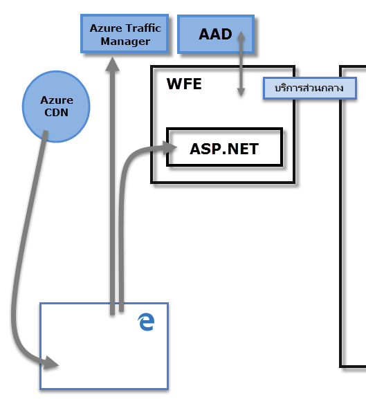
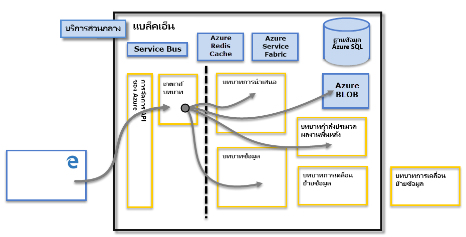

# Power BI SecurityPower BI Security

สำหรับคำอธิบายโดยละเอียดของความปลอดภัยของ Power BI [อ่านเอกสารทางเทคนิคของความปลอดภัยของ Power BI:](../guidance/whitepaper-powerbi-security.md)For a detailed explanation of Power BI security, [read the Power BI Security whitepaper](../guidance/whitepaper-powerbi-security.md).

Power BI service ถูกสร้างบน **Azure** ซึ่งเป็นโครงสร้างพื้นฐานและแพลตฟอร์มการประมวลผล ชอง Microsoft cloudThe Power BI service is built on **Azure**, which is Microsoft’s cloud computing infrastructure and platform. สถาปัตยกรรมบริการ Power BI นั้นยึดตามคลัสเตอร์สองตัว คลัสเตอร์ Web Front End (**WFE**) และคลัสเตอร์ **Back End**The Power BI service architecture is based on two clusters – the Web Front End (**WFE**) cluster and the **Back-End** cluster. คลัสเตอร์ WFE จัดการการเชื่อมต่อเริ่มต้นและการรับรองความถูกต้องเพื่อไปยัง บริการ Power BI และเมื่อการรับรองความถูกต้องเสร็จแล้ว Back End จะจัดการผู้ใช้อื่นๆ ที่ตามมาทั้งหมดThe WFE cluster manages the initial connection and authentication to the Power BI service, and once authenticated, the Back-End handles all subsequent user interactions. Power BI ใช้ Azure Active Directory (AAD) เพื่อจัดเก็บและจัดการข้อมูลประจำตัวผู้ใช้ และจัดการเก็บข้อมูลของข้อมูลและเมตาดาต้าโดยใช้ Azure BLOB และฐานข้อมูล SQL Azure ตามลำดับPower BI uses Azure Active Directory (AAD) to store and manage user identities, and manages the storage of data and metadata using Azure BLOB and Azure SQL Database, respectively.

## สถาปัตยกรรมของ Power BIPower BI Architecture

การใช้งาน Power BI แต่ละรายการประกอบด้วยคลัสเตอร์สองตัว คลัสเตอร์ Web Front End (**WFE**) และคลัสเตอร์ **Back End**Each Power BI deployment consists of two clusters – a Web Front End (**WFE**) cluster, and a **Back-End** cluster.

คลัสเตอร์ **WFE** จัดการกระบวนการเชื่อมต่อและรับรองตัวตนเริ่มต้นสำหรับ Power BI โดยใช้ AAD ในการรับรองตัวตนของไคลเอ็นต์ และใส่โทเค็นสำหรับไคลเอ็นต์ถัดๆไป ซึ่งเชื่อมต่อ Power BI service.The **WFE** cluster manages the initial connection and authentication process for Power BI, using AAD to authenticate clients and provide tokens for subsequent client connections to the Power BI service. Power BI ยังใช้ **Azure Traffic Manager** (ATM) โดยตรงกับปริมาณการใช้งานของผู้ใช้ที่ใกล้ที่สุดกับศูนย์ข้อมูล โดยขึ้นอยู่กับการบันทึก DNS ของไคลเอ็นต์ที่พยายามเชื่อมต่อกับกระบวนการรับรองตัวตนและเมื่อต้องดาวน์โหลดเนื้อหาแบบคงที่หรือไฟล์Power BI also uses the **Azure Traffic Manager** (ATM) to direct user traffic to the nearest datacenter, determined by the DNS record of the client attempting to connect, for the authentication process and to download static content and files. Power BI ใช้ **Azure Content Delivery Network** (CDN) เพื่อแจกจ่ายเนื้อหาแบบคงที่ที่จำเป็นได้อย่างมีประสิทธิภาพ และบันทึกเป็นไฟล์ในตัวผู้ใช้โดยยึดตามตำแหน่งที่ตั้งทางภูมิศาสตร์Power BI uses the **Azure Content Delivery Network** (CDN) to efficiently distribute the necessary static content and files to users based on geographical locale.

คลัสเตอร์ **Back End** คือวิธีการที่ไคลเอนต์การรับรองตัวตนแล้วโต้ตอบกับ Power BI serviceThe **Back-End** cluster is how authenticated clients interact with the Power BI service. คลัสเตอร์ **Back End** จัดการการแสดงภาพ แดชบอร์ดผู้ใช้ ชุดข้อมูล รายงาน ที่เก็บข้อมูล การเชื่อมต่อข้อมูล การรีเฟรชข้อมูล และลักษณะอื่น ๆ ของโต้ตอบกับบริการ Power BIThe **Back-End** cluster manages visualizations, user dashboards, datasets, reports, data storage, data connections, data refresh, and other aspects of interacting with the Power BI service. **บทบาทเกตเวย์** ทำหน้าที่เป็นเกตเวย์ระหว่างผู้ใช้ที่ร้องขอและ Power BI serviceThe **Gateway Role** acts as a gateway between user requests and the Power BI service. ผู้ใช้ไม่ได้ทำงานโดยตรงกับบทบาทใด ๆ นอกเหนือจาก **บทบาทเกตเวย์**Users do not interact directly with any roles other than the **Gateway Role**. **Azure API Management** จะจัดการ **บทบาทเกตเวย์** ในท้ายที่สุด**Azure API Management** will eventually handle the **Gateway Role**.

> [!IMPORTANT]
> ต้องบันทึกว่า **Azure API Management** (APIM) และบทบาท **เกตเวย์** (GW) จะสามารถเข้าถึงผ่านอินเทอร์เน็ตสาธารณะIt is imperative to note that only **Azure API Management** (APIM) and **Gateway** (GW) roles are accessible through the public Internet. พวกเขาให้รับรองตัวตน การอนุญาต DDoS protection Throttling ปรับสมดุลการโหลด กำหนดเส้นทาง และความสามารถอื่น ๆThey provide authentication, authorization, DDoS protection, Throttling, Load Balancing, Routing, and other capabilities.

## ความปลอดภัยของพื้นที่จัดเก็บข้อมูลData Storage Security

Power BI ใช้เก็บข้อมูลหลักที่สองตัว สำหรับจัดเก็บและจัดการข้อมูล ข้อมูลที่อัปโหลดจากผู้ใช้โดยทั่วไปจะถูกส่งไปยังตัวเก็บ **Azure BLOB** และเมตาดาต้าทั้งหมดเช่นเดียวกับวัตถุของระบบเองจะถูกจัดเก็บใน **ฐานข้อมูล azure SQL**Power BI uses two primary repositories for storing and managing data: data that is uploaded from users is typically sent to **Azure BLOB** storage, and all metadata as well as artifacts for the system itself are stored in **Azure SQL Database**.

เส้นไข่ปลาในรูปภาพคลัสเตอร์ **Back-End** ข้างต้น ชี้ให้เห็นขอบระหว่างสองส่วนที่สามารถเข้าถึงได้โดยผู้ใช้ (ทางด้านซ้ายของเส้นไข่ปลา) และบทบาทจะสามารถเข้าถึงได้โดยระบบเท่านั้นThe dotted line in the **Back-End** cluster image, above, clarifies the boundary between the only two components that are accessible by users (left of the dotted line), and roles that are only accessible by the system. เมื่อผู้ใช้ที่รับตัวตนแล้วเชื่อมต่อไปยัง Power BI Service การเชื่อมต่อและคำขอใดๆ โดยไคลเอ็นต์จะถูกยอมรับและจัดการโดย **บทบาทเกตเวย์** (ในท้ายที่สุดจะจัดการโดย **Azure API Management**) ซึ่งโต้ตอบในนามของผู้ใช้กับส่วนเหลือของ Power BI ServiceWhen an authenticated user connects to the Power BI Service, the connection and any request by the client is accepted and managed by the **Gateway Role** (eventually to be handled by **Azure API Management**), which then interacts on the user’s behalf with the rest of the Power BI Service. ตัวอย่างเช่น เมื่อไคลเอ็นต์พยายามดูแดชบอร์ด **บทบาทเกตเวย์** จะยอมรับการร้องขอดังกล่าวจาก นั้นส่งการร้องขอแบบเพื่อแยกกันไปยัง **บทบาทงานนำเสนอ** เพื่อดึงข้อมูลจำเป็นที่เบราว์เซอร์ต้องใช้เพื่อแสดงแดชบอร์ดFor example, when a client attempts to view a dashboard, the **Gateway Role** accepts that request then separately sends a request to the **Presentation Role** to retrieve the data needed by the browser to render the dashboard.

## การรับตัวตนผู้ใช้User Authentication

Power BI ใช้ Azure Active Directory ([AAD](https://azure.microsoft.com/services/active-directory/)) เมื่อต้องการรับรองตัวตอนผู้ใช้ที่เข้าสู่ระบบ ไปยังบริการ Power BI และในทางกลับกลับ ก็ใช้ข้อมูลประจำตัว Power BI เมื่อใดก็ตามที่ผู้ใช้พยายามเข้าแหล่งข้อมูลที่จำเป็นต้องได้รับการรับรองความถูกต้องPower BI uses Azure Active Directory ([AAD](https://azure.microsoft.com/services/active-directory/)) to authenticate users who sign in to the Power BI service, and in turn, uses the Power BI login credentials whenever a user attempts to access resources that require authentication. ผู้ใช้เข้าสู่ระบบไปยังบริการ Power BI ที่ใช้ที่อยู่อีเมลที่ใช้ในการสร้างบัญชี Power BI ของพวกเขา Power BI ใช้สิ่งนั้นเข้าสู่ระบบอีเมลในฐานะ *ชื่อผู้ใช้ที่มีผลบังคับใช้* ซึ่งจะถูกส่งผ่านไปยังแหล่งข้อมูล เมื่อใดก็ตามที่ผู้ใช้พยายามเชื่อมต่อกับข้อมูลUsers sign in to the Power BI service using the email address used to establish their Power BI account; Power BI uses that login email as the *effective username*, which is passed to resources whenever a user attempts to connect to data. จากนั้น *ชื่อผู้ใช้ที่มีผลบังคับใช้* จะถูกแมปไปยัง [*ชื่อหลักผู้ใช้* (User Principal Name, UPN)](/windows/win32/secauthn/user-name-formats) และตกลงใช้บัญชีโดเมน Windows ที่สัมพันธ์กัน เพื่อทำการรับรองความถูกต้องThe *effective username* is then mapped to a [*User Principal Name* (UPN)](/windows/win32/secauthn/user-name-formats) and resolved to the associated Windows domain account, against which authentication is applied.

สำหรับองค์กรที่ใช้อีเมลที่ทำงานสำหรับการเข้าสู่ระบบ Power BI (เช่น <em>david@contoso.com</em>), *ชื่อผู้ใช้ที่มีผลบังคับใช้* กับ UPN การแมปนั้นตรงไปตรงมาFor organizations that used work emails for Power BI login (such as <em>david@contoso.com</em>), the *effective username* to UPN mapping is straightforward. สำหรับองค์กรที่ไม่ได้ใช้อีเมลที่ทำงานเพื่อเข้าสู่ระบบ Power BI (เช่น<em>david@contoso.onmicrosoft.com</em>) การแมประหว่าง AAD และข้อมูลประจำตัวภายในองค์กรจะต้องใช้[directory synchronization](/azure/active-directory-domain-services/synchronization)ให้เพื่อทำงานอย่างถูกต้องFor organizations that did not use work emails for Power BI login (such as <em>david@contoso.onmicrosoft.com</em>), mapping between AAD and on-premises credentials will require [directory synchronization](/azure/active-directory-domain-services/synchronization) to work properly.

แพลตฟอร์มความปลอดภัยสำหรับ Power BI ยังรวมถึงความปลอดภัยของสภาพแวดล้อมแบบหลายผู้เช่า การรักษาความปลอดภัยเครือข่าย และความสามารถในการเพิ่มมาตรการด้านความปลอดภัยตาม AAD เพิ่มเติมPlatform security for Power BI also includes multi-tenant environment security, networking security, and the ability to add additional AAD-based security measures.

## ข้อมูลและความปลอดภัยของบริการData and Service Security

สำหรับข้อมูลเพิ่มเติม โปรดไปที่[ศูนย์ความเชื่อถือ Microsoft](https://www.microsoft.com/trust-center/product-overview)For more information, please visit the [Microsoft Trust Center](https://www.microsoft.com/trust-center/product-overview).

ตามที่อธิบายไว้ก่อนหน้าในบทความนี้ การเข้าสู่ระบบ Power BI ของผู้ใช้ถูกใช้ โดยเซิร์ฟเวอร์ Active Directory ในองค์กรจะจับคู่ UPN สำหรับข้อมูลประจำตัวAs described earlier in this article, a user’s Power BI login is used by on-premises Active Directory servers to map to a UPN for credentials. อย่างไรก็ตาม เป็นเรื่อง **สำคัญ** ที่ควรทราบว่า ผู้ใช้เป็นผู้รับผิดชอบข้อมูลที่พวกเขาแชร์ ถ้าผู้ใช้เชื่อมต่อกับแหล่งข้อมูลโดยใช้ข้อมูลประจำตัวของเขา จากนั้นการรายงาน (หรือแดชบอร์ด หรือชุดข้อมูล) จะยึดตามข้อมูลทีผู้ใช้ใช้ร่วมกับบุคคลที่แชร์แดชบอร์ด ซึ่งเขาจะไม่ได้รับการรับรองตัวตนกับแหล่งข้อมูลต้นฉบับ และจะสามารถเข้าถึงรายงานได้However, it’s **important** to note that users are responsible for the data they share: if a user connects to data sources using their credentials, then shares a report (or dashboard, or dataset) based on that data, users with whom the dashboard is shared are not authenticated against the original data source, and will be granted access to the report.

มีข้อยกเว้นคือการเชื่อมต่อไปยัง **SQL Server Analysis Services** โดยใช้ **เกตเวย์ข้อมูลภายในองค์กร** แดชบอร์ดจะถูกเก็บไว้ใน Power BI แต่เข้าถึงรายงานพื้นฐานหรือชุดข้อมูลเริ่มต้นการรับรองความถูกต้องสำหรับผู้ใช้ที่พยายามที่จะเข้าถึงรายงาน(หรือชุดข้อมูล) และการเข้าถึงจะอนุมัติ หากผู้ใช้มีข้อมูลประจำตัวเพียงพอในการเข้าถึงข้อมูลเท่านั้นAn exception is connections to **SQL Server Analysis Services** using the **On-premises data gateway**; dashboards are cached in Power BI, but access to underlying reports or datasets initiates authentication for the user attempting to access the report (or dataset), and access will only be granted if the user has sufficient credentials to access the data. สำหรับข้อมูลเพิ่มเติม ให้ดู[เจาะลึกเกตเวย์ข้อมูลขององค์กร](../connect-data/service-gateway-onprem-indepth.md)For more information, see [On-premises data gateway deep dive](../connect-data/service-gateway-onprem-indepth.md).

## บังคับใช้รุ่น TLSEnforcing TLS version usage

เครือข่ายและผู้ดูแลระบบไอทีสามารถบังคับใช้ข้อกำหนดในการใช้ TLS ปัจจุบัน (Transport Layer Security) สำหรับการติดต่อสื่อสารใดๆ ที่มีความปลอดภัยบนเครือข่ายNetwork and IT administrators can enforce the requirement to use current TLS (Transport Layer Security) for any secured communication on their network. Windows ให้การรองรับเวอร์ชัน TLS ผ่าน Microsoft Schannel Provider ดัง[อธิบายไว้ในหัวข้อ TSL Schannel SSP](/windows/desktop/SecAuthN/protocols-in-tls-ssl--schannel-ssp-)Windows provides support for TLS versions over the Microsoft Schannel Provider, as [described in the TLS Schannel SSP article](/windows/desktop/SecAuthN/protocols-in-tls-ssl--schannel-ssp-).

การบังคับใช้นี้สามารถทำได้โดยการตั้งค่ารีจิสทรีคีย์สำหรับการจัดการThis enforcement can be done by administratively setting registry keys. การบังคับใช้ได้อธิบายไว้ใน[การจัดการ SSL Protocols ในหัวข้อ AD FS](/windows-server/identity/ad-fs/operations/manage-ssl-protocols-in-ad-fs)Enforcement is described in the [Managing SSL Protocols in AD FS article](/windows-server/identity/ad-fs/operations/manage-ssl-protocols-in-ad-fs). 

**Power BI Desktop** ยึดการตั้งค่าคีย์รีจิสทรีที่อธิบายไว้ในหัวข้อเหล่านั้นและสร้างเฉพาะการเชื่อมต่อโดยใช้ TLS เวอร์ชันที่ได้รับอนุญาตตามการตั้งค่ารีจิสทรีเหล่านั้นเมื่อปรากฏ**Power BI Desktop** respects the registry key settings described in those articles, and only created connections using the version of TLS allowed based on those registry settings, when present.

สำหรับข้อมูลเพิ่มเติมเกี่ยวกับการตั้งค่ารีจิสทรีคีย์เหล่านี้ ดูได้ที่หัวข้อ[การตั้งค่ารีจิสทรี TLS](/windows-server/security/tls/tls-registry-settings)For more information about setting these registry keys, see the [TLS Registry Settings](/windows-server/security/tls/tls-registry-settings) article.