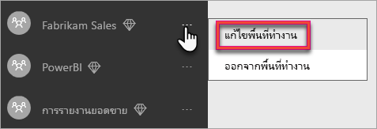

# กำหนดค่าและจัดการความจุใน Power BI PremiumConfigure and manage capacities in Power BI Premium

การจัดการ Power BI Premium เกี่ยวข้องกับ การสร้าง การจัดการ และการตรวจสอบความจุแบบพรีเมียมManaging Power BI Premium involves creating, managing, and monitoring Premium capacities. บทความนี้ให้คำแนะนำทีละขั้นตอน สำหรับภาพรวมของความจุ .ให้ดูที่[การจัดการความ](service-premium-capacity-manage.md)จุพรีเมียมThis article provides step-by-step instructions; for an overview of capacities; see [Managing Premium capacities](service-premium-capacity-manage.md).

เรียนรู้วิธีการจัดการ Power BI Premium และความจุ Power BI Embedded ซึ่งมีแหล่งข้อมูลเฉพาะสำหรับเนื้อหาของคุณLearn how to manage Power BI Premium and Power BI Embedded capacities, which provide dedicated resources for your content.

*ความจุ* คือหัวใจสำคัญของข้อเสนอ Power BI Premium และ Power BI Embedded*Capacity* is at the heart of the Power BI Premium and Power BI Embedded offerings. ความจุคือชุดของทรัพยากรที่สงวนไว้สำหรับการใช้เฉพาะองค์กรของคุณIt is a set of resources reserved for exclusive use by your organization. โดยการมีค่าความจุนี้ช่วยให้คุณสามารถเผยแพร่แดชบอร์ด รายงาน และชุดข้อมูลไปยังผู้ใช้ทั่วทั้งองค์กรของคุณ โดยไม่ต้องซื้อสิทธิ์การใช้งานต่อผู้ใช้Having a capacity enables you to publish dashboards, reports, and datasets to users throughout your organization without having to purchase per-user licenses for them. นอกจากนี้ยังมีความน่าเชื่อถือ ความสอดคล้องของประสิทธิภาพการทำงานสำหรับเนื้อหาที่โฮสต์ในความจุIt also offers dependable, consistent performance for the content hosted in capacity. สำหรับข้อมูลเพิ่มเติม ให้ดู [อะไรคือ Power BI Premium](service-premium-what-is.md)For more information, see [What is Power BI Premium?](service-premium-what-is.md).

> [!NOTE]
> Power BI Premium เพิ่งเปิดตัว Premium เวอร์ชันใหม่ชื่อ **Premium Gen2** ซึ่งกำลังอยู่ในช่วงการแสดงตัวอย่างPower BI Premium recently released a new version of Premium, called **Premium Gen2**, which is currently in preview. Premium Gen2 จะทำให้การจัดการความจุระดับพรีเมียมง่ายขึ้นและลดค่าใช้จ่ายในการจัดการPremium Gen2 will simplify the management of Premium capacities, and reduce management overhead. สำหรับข้อมูลเพิ่มเติม โปรดดูที่ [Power BI Premium Generation 2 (ตัวอย่าง)](service-premium-what-is.md#power-bi-premium-generation-2-preview)For more information, see [Power BI Premium Generation 2 (preview)](service-premium-what-is.md#power-bi-premium-generation-2-preview).

## จัดการความจุManage capacity

หลังจากที่คุณได้ซื้อโหนดความจุใน Microsoft 365 แล้ว ให้คุณตั้งค่าความจุในพอร์ทัลผู้ดูแลระบบของ Power BIAfter you have purchased capacity nodes in Microsoft 365, you set up the capacity in the Power BI admin portal. คุณจัดการความจุ Power BI Premium ในส่วน **การตั้งค่าความจุ** ของพอร์ทัลYou manage Power BI Premium capacities in the **Capacity settings** section of the portal.

คุณจัดการความจุ โดยการเลือกชื่อของความจุYou manage a capacity by selecting the name of the capacity. ซึ่งนำคุณไปยังหน้าจอการจัดการความจุThis takes you to the capacity management screen.

หากไม่ได้กำหนดพื้นที่ทำงานไว้ในความจุ คุณจะเห็นข้อความเกี่ยวกับ [การกำหนดพื้นที่ทำงานให้กับความจุ](#assign-a-workspace-to-a-capacity)If no workspaces have been assigned to the capacity, you will see a message about [assigning a workspace to the capacity](#assign-a-workspace-to-a-capacity).

### การตั้งค่าความจุใหม่ (Power BI Premium)Setting up a new capacity (Power BI Premium)

พอร์ทัลของผู้ดูแลระบบแสดงจำนวน *แกนเสมือน* (v-cores) ที่คุณใช้และคุณยังมีอยู่The admin portal shows the number of *virtual cores* (v-cores) that you have used and that you still have available. จำนวน v-cores ทั้งหมดขึ้นอยู่กับ SKU ระดับ Premium ที่คุณซื้อThe total number of v-cores is based on the Premium SKUs that you have purchased. ตัวอย่างเช่น ซื้อแบบ P3 และ P2 ส่งผลให้มี 48 core ที่ใช้ได้ 32 cores จาก P3 และ 16 cores จาก P2For example, purchasing a P3 and a P2 results in 48 available cores – 32 from the P3 and 16 from the P2.

ถ้าคุณมี v-cores ให้ตั้งความจุใหม่ของคุณโดยทำตามขั้นตอนต่อไปนี้If you have available v-cores, set up your new capacity by following these steps.

1. เลือก **ตั้งค่าความจุใหม่**Select **Set up new capacity**.

1. ตั้งชื่อความจุของคุณGive your capacity a name.

1. กำหนดว่าใครจะเป็นผู้ดูแลสำหรับความจุนี้Define who the admin is for this capacity.

1. เลือกขนาดของความจุSelect your capacity size. ตัวเลือกที่พร้อมใช้งานจะขึ้นอยู่กับจำนวน v-cores ที่คุณมีAvailable options are dependent on how many available v-cores you have. คุณไม่สามารถเลือกตัวเลือกที่มีขนาดใหญ่กว่าสิ่งที่คุณมีพร้อมใช้งานได้You can't select an option that is larger than what you have available.

    

1. เลือก **ตั้งค่า**Select **Set up**.

    

ผู้ดูแลความจุ รวมถึงผู้ดูแลระบบ Power BI และผู้ดูแลระบบส่วนกลาง จากนั้นดูความจุที่ระบุในพอร์ทัลผู้ดูแลระบบCapacity admins, as well as Power BI admins and global administrators, then see the capacity listed in the admin portal.

### การตั้งค่าความจุCapacity settings

1. ในหน้าจอการจัดการความจุระดับพรีเมี่ยม ภายใต้ **การดำเนินการ** ให้เลือก **ไอคอนฟันเฟือง** เพื่อทบทวนและอัปเดตการตั้งค่าIn the Premium capacity management screen, under **Actions**, select the **gear icon** to review and update settings. 

    

1. คุณสามารถดูว่าใครคือผู้ดูแลระบบบริการ SKU/ขนาด ความจุของใคร ความจุของภูมิภาคใดที่อยู่ในนั้นYou can see who the service admins are, the SKU/size of the capacity, and what region the capacity is in.

    

1. นอกจากนี้คุณยังสามารถเปลี่ยนชื่อหรือลบความจุได้You can also rename or delete a capacity.

    

> [!NOTE]
> คุณสามารถจัดการการตั้งค่าความจุ Power BI Embedded ในพอร์ทัล Microsoft AzurePower BI Embedded capacity settings are managed in the Microsoft Azure portal.

### เปลี่ยนขนาดความจุChange capacity size

ผู้ดูแลระบบ Power BI และผู้ดูแลระบบส่วนกลางสามารถเปลี่ยนแปลงความจุ Power BI Premium ได้Power BI admins and global administrators can change Power BI Premium capacity. ผู้ดูแลความจุที่ไม่ใช่ผู้ดูแลระบบ Power BI หรือผู้ดูแลระบบส่วนกลางจะไม่มีตัวเลือกนี้Capacity admins who are not a Power BI admin or global administrator don't have this option.

1. เลือก **เปลี่ยนขนาดความจุ**.Select **Change capacity size**.

    

1. ในหน้าจอ **เปลี่ยนขนาดความจุ** ปรับเพิ่มหรือปรับลดความจุของคุณตามความเหมาะสมOn the **Change capacity size** screen upgrade or downgrade your capacity as appropriate.

    

    ผู้ดูแลมีอิสระที่จะสร้าง การปรับขนาด และลบโหนด ดังนั้นตราบใดที่พวกเขามีจำนวน v-coresAdministrators are free to create, resize and delete nodes, so long as they have the requisite number of v-cores.

    คุณไม่สามารถปรับลด P SKU ให้เป็น EM SKUs ได้P SKUs cannot be downgraded to EM SKUs. คุณสามารถเลื่อนเมาส์ไปวางเหนือตัวเลือกที่ถูกปิดใช้งานเพื่อดูคำอธิบายYou can hover over any disabled options to see an explanation.

> [!IMPORTANT]
> ถ้าความจุ Power BI Premium ของคุณกำลังประสบปัญหาการใช้ทรัพยากรสูงจนส่งผลให้เกิดปัญหาด้านประสิทธิภาพการทำงานหรือความมั่นคง คุณสามารถรับอีเมลแจ้งเตือนเพื่อทราบปัญหาและแก้ไขปัญหาได้If your Power BI Premium capacity is experiencing high resource usage, resulting in performance or reliability issues, you can receive notification emails to identify and resolve the issue. คุณสามารถศึกษาข้อมูลเพิ่มเติมได้ที่[ความจุและการแจ้งเตือนความมั่นคง](service-interruption-notifications.md#capacity-and-reliability-notifications)See [capacity and reliability notifications](service-interruption-notifications.md#capacity-and-reliability-notifications) for more information.

### จัดการสิทธิ์ผู้ใช้Manage user permissions

คุณสามารถมอบหมายผู้ดูแลความจุเพิ่มเติม และกำหนดผู้ใช้ที่มีสิทธิ์ *การกำหนดความจุ* ได้You can assign additional capacity admins, and assign users that have *capacity assignment* permissions. ผู้ใช้ที่มีสิทธิ์ในการกำหนดอาจกำหนดพื้นที่ทำงานไปยังความจุใดความจุหนึ่ง ถ้าพวกเขาเป็นผู้ดูแลระบบของพื้นที่ทำงานนั้นUsers that have assignment permissions can assign a workspace to a capacity if they are an admin of that workspace. พวกเขายังสามารถกำหนด *My Workspace* ส่วนบุคคลของพวกเขาให้ความจุได้They can also assign their personal *My Workspace* to the capacity. ผู้ใช้ที่มีสิทธิ์ในการกำหนดจะไม่เข้าถึงพอร์ทัลผู้ดูแลUsers with assignment permissions do not have access to the admin portal.

> [!NOTE]
> สำหรับ Power BI Embedded ผู้ดูแลความจุจะถูกกำหนดในพอร์ทัล Microsoft AzureFor Power BI Embedded, capacity admins are defined in the Microsoft Azure portal.

ภายใต้หน้าจอ **สิทธิ์ผู้ใช้** ขยายตัวเลือก **ผู้ใช้ที่ มีสิทธิ์ในการกำหนด** จากนั้นเพิ่มผู้ใช้หรือกลุ่มตามความเหมาะสมUnder **User permissions**, expand **Users with assignment permissions**, then add users or groups as appropriate.

## กำหนดพื้นที่ทำงานของแอปไปยังความจุAssign a workspace to a capacity

มีสองวิธีในการกำหนดพื้นที่ทำงานไปยังความจุ: ในพอร์ทัลผู้ดูแลระบบ และจากพื้นที่ทำงานThere are two ways to assign a workspace to a capacity: in the admin portal; and from a workspace.

### กำหนดจากพอร์ทัลผู้ดูแลAssign from the admin portal

ผู้ดูแลความจุ พร้อมกับผู้ดูแลระบบ Power BI และผู้ดูแลระบบส่วนกลาง สามารถกำหนดพื้นที่ทำงานที่ละหลาย ๆ ตัว ในส่วนการจัดการความจุพรีเมียมของพอร์ทัลผู้ดูแลระบบCapacity admins, along with Power BI admins and global administrators, can bulk assign workspaces in the premium capacity management section of the admin portal. เมื่อคุณจัดการความจุ คุณจะเห็นส่วน **พื้นที่ทำงาน** ที่ช่วยให้คุณสามารถกำหนดพื้นที่ทำงานได้When you manage a capacity, you see a **Workspaces** section that allows you to assign workspaces.

1. เลือก **กำหนดพื้นที่ทำงาน**Select **Assign workspaces**. ตัวเลือกนี้จะพร้อมใช้งานในหลายตำแหน่งThis option is available in multiple places.

1. เลือกตัวเลือกสำหรับ **นำไปใช้**Select an option for **Apply to**.

    

   | การเลือกSelection | คำอธิบายDescription |
   | --- | --- |
   | **พื้นที่ทำงานโดยผู้ใช้****Workspaces by users** | เมื่อคุณกำหนดพื้นที่ทำงาน ตามผู้ใช้หรือตามกลุ่ม พื้นที่ทำงานทั้งหมดที่ผู้ใช้เหล่านั้นเป็นเจ้าของ จะถูกกำหนดให้กับความจุพรีเมียม รวมถึงพื้นที่ทำงานส่วนบุคคลของผู้ใช้ด้วยWhen you assign workspaces by user, or group, all the workspaces owned by those users are assigned to Premium capacity, including the user's personal workspace. ลูกค้าที่ถูกบอกจะถูกำหนดการอนุญาตของพื้นที่ทำงานSaid users automatically get workspace assignment permissions. ซึ่งรวมถึงพื้นที่ทำงานที่ถูกกำหนดให้กับความจุอื่นThis includes workspaces already assigned to a different capacity. |
   | **พื้นที่ทำงานเฉพาะ****Specific workspaces** | ป้อนชื่อของพื้นที่ทำงานเฉพาะเมื่อต้องกำหนดความจุที่เลือกEnter the name of a specific workspace to assign to the selected capacity. |
   | **พื้นที่ทำงานของทั้งองค์กร****The entire organization's workspaces** | การกำหนดพื้นที่ทำงานของทั้งองค์กรไปยังความจุระดับพรีเมี่ยม จะกำหนดพื้นที่ทำงานและพื้นที่ทำงานของฉันทั้งหมดในองค์กรของคุณ ไปยังความจุระดับพรีเมี่ยมนี้Assigning the entire organization's workspaces to Premium capacity assigns all workspaces and My Workspaces, in your organization, to this Premium capacity. นอกจากนี้ ผู้ใช้ปัจจุบันและในอนาคตทั้งหมดจะมีสิทธิ์ในการกำหนดพื้นที่ทำงานของแต่ละคนให้ความจุนี้In addition, all current and future users will have the permission to reassign individual workspaces to this capacity. |
   | | |

1. เลือก **นำไปใช้**Select **Apply**.

### กำหนดจากการตั้งค่าพื้นที่ทำงานAssign from workspace settings

คุณยังสามารถกำหนดพื้นที่ทำงานเป็นความจุพรีเมียมจากการตั้งค่าของพื้นที่การทำงานนั้นYou can also assign a workspace to a Premium capacity from the settings of that workspace. เมื่อต้องการย้ายพื้นที่ทำงานไปสู่ความจุ คุณต้องมีสิทธิ์ของผู้ดูแลระบบในพื้นที่ทำงานนั้นและยังต้องมีสิทธิ์ในการกำหนดความจุไปยังความจุดังกล่าวด้วยTo move a workspace into a capacity, you must have admin permissions to that workspace, and also capacity assignment permissions to that capacity. โปรดทราบว่าผู้ดูแลระบบผู้ดูแลระบบพื้นที่ทำงานสามารถลบพื้นที่ทำงานออกจากความจุระดับพรีเมี่ยมได้Note that workspace admins can always remove a workspace from Premium capacity.

1. แก้ไขพื้นที่ทำงานโดยเลือกจุดไข่ปลา **(...)** แล้วเลือก **แก้ไขพื้นที่ทำงาน**Edit a workspace by selecting the ellipsis **(. . .)** then selecting **Edit workspace**.

    

1. ภายใต้ **แก้ไขพื้นที่ทำงาน** ขยาย **ขั้นสูง**Under **Edit workspace**, expand **Advanced**.

1. เลือกความจุที่คุณต้องการกำหนดพื้นที่ทำงานนี้ไปยังSelect the capacity that you want to assign this workspace to.

    

1. เลือก **บันทึก**Select **Save**.

เมื่อคุณบันทึก พื้นที่ทำงานและเนื้อหาทั้งหมด จะถูกย้ายไปยังความจุระดับพรีเมียมโดยไม่ทำให้เกิดปัญหากับผู้ใช้ปลายทางOnce saved, the workspace and all its contents are moved into Premium capacity without any experience interruption for end users.

## คีย์ผลิตภัณฑ์เซิร์ฟเวอร์รายงาน Power BIPower BI Report Server product key

ในแท็บ **การตั้งค่าความจุ** ของพอร์ทัลผู้ดูแลระบบ Power BI คุณจะสามารถเข้าถึงคีย์ผลิตภัณฑ์เซิร์ฟเวอร์รายงาน Power BI ของคุณOn the **Capacity settings** tab of the Power BI admin portal, you will have access to your Power BI Report Server product key. ซึ่งจะพร้อมใช้งานสำหรับผู้ดูแลระบบสากล หรือผู้ใช้ที่ได้รับการกำหนดบทบาทเป็นผู้ดูแลระบบ Power BI Premium SKUThis will only be available for Global Admins or users assigned the Power BI service administrator role and if you have purchase a Power BI Premium SKU.

โดยเลือก **คีย์เซิร์ฟเวอร์รายงาน Power BI** จะแสดงกล่องโต้ตอบที่มีคีย์ผลิตภัณฑ์ของคุณSelecting **Power BI Report Server key** will display a dialog contain your product key. คุณสามารถคัดลอกและใช้กับการติดตั้งYou can copy it and use it with the installation.

สำหรับข้อมูลเพิ่มเติม ให้ดู[ติดตั้งเซิร์ฟเวอร์รายงาน Power BI](../report-server/install-report-server.md)For more information, see [Install Power BI Report Server](../report-server/install-report-server.md).

## ขั้นตอนถัดไปNext steps

[การจัดการความจุแบบพรีเมียมManaging Premium capacities](service-premium-capacity-manage.md)

มีคำถามเพิ่มเติมหรือไม่More questions? [ลองถามชุมชน Power BITry asking the Power BI Community](https://community.powerbi.com/)

Power BI ได้แนะนำ Power BI Premium Gen2 เข้ามาใช้งานเป็นข้อเสนอการแสดงตัวอย่าง ซึ่งปรับปรุงประสบการณ์การใช้งาน Power BI Premium ด้วยการปรับปรุงในสิ่งต่อไปนี้:Power BI has introduced Power BI Premium Gen2 as a preview offering, which improves the Power BI Premium experience with improvements in the following:
* ประสิทธิภาพการทำงานPerformance
* สิทธิการใช้งานต่อผู้ใช้Per-user licensing
* ขนาดใหญ่ขึ้นGreater scale
* เมตริกที่ดีขึ้นImproved metrics
* การปรับขนาดอัตโนมัติAutoscaling
* ลดค่าใช้จ่ายในการจัดการReduced management overhead

สำหรับข้อมูลเพิ่มเติมเกี่ยวกับ Power BI Premium Gen2 โปรดดูที่ [Power BI Premium Generation 2 (ตัวอย่าง)](service-premium-what-is.md#power-bi-premium-generation-2-preview)For more information about Power BI Premium Gen2, see [Power BI Premium Generation 2 (preview)](service-premium-what-is.md#power-bi-premium-generation-2-preview).