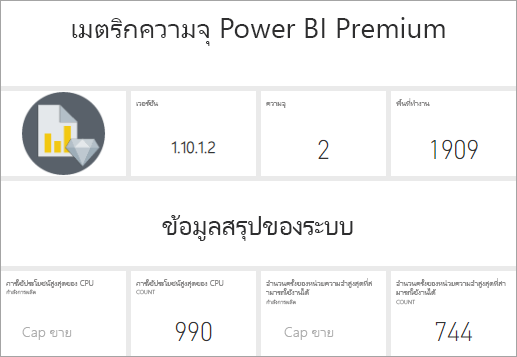
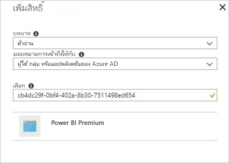

# ตรวจสอบความจุ Premium ด้วยแอปMonitor Premium capacities with the app

การตรวจสอบความจุของคุณเป็นสิ่งสำคัญในการตัดสินใจอย่างชาญฉลาดว่าจะใช้ทรัพยากรความจุ Premium ของคุณให้ดีที่สุดได้อย่างไรMonitoring your capacities is essential to making informed decisions on how best to utilize your Premium capacity resources. คุณสามารถตรวจสอบความจุในพอร์ทัลผู้ดูแลระบบหรือด้วยแอป **การวัดความจ ุPower BI Premium**You can monitor capacities in the Admin portal or with the **Power BI Premium Capacity Metrics** app. บทความนี้อธิบายโดยใช้แอปการวัดความจุ PremiumThis article describes using the Premium Capacity Metrics app. แอปมีข้อมูลเชิงลึกมากที่สุดเป็นวิธีการใช้งานความจุของคุณThe app provides the most in-depth information into how your capacities are performing. สำหรับภาพรวมระดับสูงขึ้นของการวัดการใช้งานเฉลี่ยช่วงเจ็ดวันที่ผ่านมา คุณสามารถใช้พอร์ทัลผู้ดูแลระบบFor a higher level overview of average use metrics over the last seven days, you can use the Admin portal. หากต้องการเรียนรู้เพิ่มเติมเกี่ยวกับการตรวจสอบในพอร์ทัล ดู[ตรวจสอบความจุ Premium ในพอร์ทัลผู้ดูแลระบบ](service-admin-premium-monitor-portal.md)To learn more about monitoring in the portal, see [Monitor Premium capacities in the Admin portal](service-admin-premium-monitor-portal.md).

แอปถูกอัปเดตตามปกติด้วยคุณสมบัติและฟังก์ชันการทำงานใหม่ ๆThe app is updated regularly with new features and functionality. ตรวจสอบให้แน่ใจว่าคุณกำลังใช้เวอร์ชันล่าสุดMake sure you're running the latest version. เมื่อเวอร์ชันใหม่จะพร้อมใช้งาน คุณจะได้รับ[การแจ้งเตือน](../connect-data/service-template-apps-install-distribute.md#update-a-template-app)When a new version becomes available, you will receive [notification](../connect-data/service-template-apps-install-distribute.md#update-a-template-app).

> [!IMPORTANT]
> ถ้าความจุ Power BI Premium ของคุณกำลังประสบปัญหาการใช้ทรัพยากรสูงจนส่งผลให้เกิดปัญหาด้านประสิทธิภาพการทำงานหรือความมั่นคง คุณสามารถรับอีเมลแจ้งเตือนเพื่อทราบปัญหาและแก้ไขปัญหาได้If your Power BI Premium capacity is experiencing high resource usage, resulting in performance or reliability issues, you can receive notification emails to identify and resolve the issue. ซึ่งอาจเป็นวิธีที่มีประสิทธิภาพในการแก้ไขปัญหาความจุโอเวอร์โหลดThis can be a streamlined way to troubleshoot overloaded capacities. คุณสามารถศึกษาข้อมูลเพิ่มเติมได้ที่[ความจุและการแจ้งเตือนความมั่นคง](service-interruption-notifications.md#capacity-and-reliability-notifications)See [capacity and reliability notifications](service-interruption-notifications.md#capacity-and-reliability-notifications) for more information.

> [!NOTE]
> Power BI Premium เพิ่งเปิดตัว Premium เวอร์ชันใหม่ชื่อ **Premium Gen2** ซึ่งกำลังอยู่ในช่วงการแสดงตัวอย่างPower BI Premium recently released a new version of Premium, called **Premium Gen2**, which is currently in preview. Premium Gen2 จะทำให้การจัดการความจุระดับพรีเมียมง่ายขึ้นและลดค่าใช้จ่ายในการจัดการPremium Gen2 will simplify the management of Premium capacities, and reduce management overhead. สำหรับข้อมูลเพิ่มเติม โปรดดูที่ [Power BI Premium Generation 2 (ตัวอย่าง)](service-premium-what-is.md#power-bi-premium-generation-2-preview)For more information, see [Power BI Premium Generation 2 (preview)](service-premium-what-is.md#power-bi-premium-generation-2-preview).

## ติดตั้งแอปInstall the app

ไปที่ [เชื่อมต่อกับเมตริกความจุ Power BI Premium](../connect-data/service-connect-to-pbi-premium-capacity-metrics.md) เพื่อดูวิธีการติดตั้งแอปและเชื่อมต่อกับข้อมูลGo to [Connect to Power BI Premium Capacity Metrics](../connect-data/service-connect-to-pbi-premium-capacity-metrics.md) to see how to install the app and connect to data. อีกวิธีหนึ่งคือคุณสามารถ [ตรงไปยังแอป](https://go.microsoft.com/fwlink/?linkid=2114036)Alternatively, you can [go straight to the app](https://go.microsoft.com/fwlink/?linkid=2114036).

## รับข้อมูลประวัติการรีเฟรชแอปGet app refresh history

เมื่อต้องการตรวจสอบครั้งล่าสุดที่แอปเมตริกความจุ Power BI Premium ของคุณรีเฟรช:To check the last time your Premium Capacity Metrics app refreshed:

1. ไปที่พื้นที่ทำงานที่มีการติดตั้งแอปGo to the workspace that was installed with the app.

   

1. คลิกปุ่ม **กำหนดตารางเวลาการรีเฟรช** บนบรรทัดชุดข้อมูลClick the **Schedule refresh** button on the dataset line.

   

   การรีเฟรชครั้งล่าสุดจะแสดงขึ้นThe last refresh is shown. คลิก **ประวัติการรีเฟรช** เพื่อดูการรีเฟรชที่กำหนดไว้ และการรีเฟรชตามความต้องการClick **Refresh history** to see scheduled and on demand refreshes.

   

## ตรวจสอบความจุด้วยแอปMonitor capacities with the app

หลังจากที่คุณติดตั้งแอป คุณสามารถดูการวัดความจุในองค์กรของคุณNow that you've installed the app, you can see metrics for the capacities in your organization. แอปมีแดชบอร์ดพร้อมข้อมูลสรุปเมตริก และรายงานเมตริกโดยละเอียดThe app provides a Dashboard with metrics summaries, and detailed metrics Reports.

### แดชบอร์ดDashboard

เมื่อต้องดูแดชบอร์ดที่สรุปเป็นหลักเมตริกสำหรับความจุที่คุณเป็นผู้ดูแล ระบบ ใน **แดชบอร์ด** คลิก **Power BI Premium ความจุเมตริก**To see a dashboard that summarizes key metrics for capacities for which you are an admin, in **Dashboards**, click **Power BI Premium Capacity Metrics**. แดชบอร์ดปรากฏขึ้นA dashboard appears.

แดชบอร์ดประกอบรวมด้วยการวัดดังต่อไปนี้The dashboard includes the following metrics:

#### ด้านบนTop

| เมตริกMetric | คำอธิบายDescription |
| --- | --- |
| เวอร์ชันVersion | แอปเวอร์ชันApp version. | 
| ความจุCapacities | จำนวนของความจุที่คุณเป็นผู้ดูแลระบบNumber of capacities for which you are admin. | 
| พื้นที่ทำงานWorkspaces | จำนวนของพื้นที่ทำงานในความจุของคุณที่เป็นรายงานการวัดNumber of workspaces in your capacities that are reporting metrics.|
|||

#### ข้อมูลสรุปของระบบSystem Summary

| เมตริกMetric | คำอธิบายDescription |
| --- | --- |
| CPU ที่มีความจุเพื่อใช้ให้เกิดประโยชน์สูงสุดCPU Highest Utilization Capacity | ความจุของจำนวนครั้งที่ CPU กำหนดสูงสุดเกิน 80% ของค่าเกณฑ์ใน 7 วันที่ผ่านมาCapacity with the maximum number of times CPU exceeded 80% of the thresholds in the past seven days. |
| จำนวนครั้งของความจุใน CPU ที่สามารถใช้ให้เกิดประโยชน์สูงสุดCPU Highest Utilization Count | จำนวนครั้งที่ CPU ถูกตั้งชื่อความจุเกิน 80% ของค่าเกณฑ์ใน 7 วันที่ผ่านมาNumber of times CPU the named capacity exceeded 80% of the thresholds in the past seven days. | 
| ความจุของหน่วยความจำมากสุดที่สามารถใช้งานได้สูงสุดMemory Max Utilization Capacity | ถึงขีดจำกัดของจำนวนครั้งความจุในหน่วยความจำสูงสุดในช่วง 7 วันที่ผ่านมา แบ่งออกเป็นกลุ่มสามนาทีCapacity with the maximum number of times max memory limit was hit in the past seven days, split into three-minute buckets.  |
| จำนวนครั้งของหน่วยความจำสูงสุดที่สามารถใช้งานได้Memory Max Utilization Count| จำนวนครั้งของความจุที่ถูกตั้งชื่อในหน่วยความจำสูงสุดถึงขีดจำกัดในช่วง7 วันที่ผ่านมา แบ่งออกเป็นกลุ่มสามนาทีNumber of times the named capacity reached the max memory limit in the past seven days, split into three-minute buckets. |
|||

#### ข้อมูลสรุปของชุดข้อมูลDataset Summary

| เมตริกMetric | คำอธิบายDescription |
| --- | --- |
| ชุดข้อมูลDatasets | จำนวนรวมของชุดข้อมูลในพื้นที่ทำงานทั้งหมดในความจุของคุณTotal number of datasets across all workspaces in your capacities.|
| ขนาดเฉลี่ยของชุดข้อมูล (MB)Datasets Average Size (MB) | ขนาดเฉลี่ยของชุดข้อมูลของพื้นที่ทำงานทั้งหมดในความจุของคุณAverage size of datasets across all workspaces in your capacities.|  
| จำนวนครั้งของชุดข้อมูลเฉลี่ยที่ถูกโหลดDatasets Average Loaded Count | จำนวนเฉลี่ยของชุดข้อมูลที่โหลดลงในหน่วยความจำAverage count of datasets loaded into memory. |  
| ชุดข้อมูล - ชุดข้อมูลที่ใช้งานโดยเฉลี่ย (%)Datasets - Average Active Dataset (%)| ชุดข้อมูลที่ใช้งานโดยเฉลี่ยใน 7 วันที่ผ่านมาAverage active datasets in the past seven days. ชุดข้อมูลถูกกำหนดเป็นใช้งานอยู่ถ้าผู้ใช้มีการโต้ตอบบนวิชวลภายในสามนาทีที่ผ่านมาA dataset is defined as active if the user has interacted on the visuals with the past three minutes. |
| CPU - ชุดข้อมูลสูงสุด (%)CPU - Datasets Max (%)| ปริมาณการใช้ CPU สูงสุดตามปริมาณงานชุดข้อมูลใน 7 วันที่ผ่านมาMax CPU consumption by dataset workload in the past seven days. |
| CPU - ชุดข้อมูลโดยเฉลี่ย (%)CPU - Datasets Average (%)| ปริมาณการใช้ CPU โดยเฉลี่ยตามปริมาณงานชุดข้อมูลใน 7 วันที่ผ่านมาAverage CPU consumption by dataset workload in the past seven days. |
| หน่วยความจำ - ชุดข้อมูลโดยเฉลี่ย (GB)Memory - Datasets Average (GB) | ปริมาณการใช้หน่วยความจำโดยเฉลี่ยตามปริมาณงานชุดข้อมูลใน 7 วันที่ผ่านมาAverage memory consumption by dataset workload in the past seven days. |
| หน่วยความจำ - ชุดข้อมูลสูงสุด (GB)Memory - Datasets Max (GB) | ปริมาณการใช้หน่วยความจำสูงสุดตามปริมาณงานชุดข้อมูลใน 7 วันที่ผ่านมาMax memory consumption by dataset workload in the past seven days.|
| การจัดชุดข้อมูลDatasets Evictions | จำนวนรวมของชุดข้อมูลที่มีการจัดเรียงเนื่องจากหน่วยความจำไม่เพียงพอTotal number of datasets evicted due to memory pressure. |
| คิวรีโดยตรง/จำนวนครั้งที่ใช้งานได้สูงสุดแบบไลฟ์สดDirectQuery/Live High Utilization Count| จำนวนครั้งที่มีคิวรีโดยตรง/การเชื่อมต่อแบบไลฟ์สดเกิน 80% ของค่าเกณฑ์ใน 7 วันที่ผ่านมา แยกเป็นกลุ่มสามนาทีNumber of times DirectQuery/Live connections exceeded 80% of the thresholds in the past seven days, split into three-minute buckets. |
| คิวรีโดยตรง/จำนวนครั้งที่ใช้งานได้มากที่สุดแบบไลฟ์สดDirectQuery/Live Max Utilization Count| เวลาส่วนใหญ่ที่มีคิวรีโดยตรง/การเชื่อมต่อแบบไลฟ์สดเกิน 80% ในช่วง 7 วันที่ผ่านมา แยกเป็นกลุ่มหนึ่งชั่วโมงMost times the DirectQuery/Live connections exceeded 80% in the past seven days, split into one-hour buckets. |
| คิวรีโดยตรง/การใช้งานได้สูงสุดและมากสุดแบบสดDirectQuery/Live Max High Utilization | จำนวนครั้งสูงสุดที่มีคิวรีโดยตรง/การเชื่อมต่อแบบไลฟ์สดเกิน 80% ของค่าเกณฑ์ใน 7 วันที่ผ่านมา แยกเป็นกลุ่มสามนาทีMaximum number of times DirectQuery/Live connections exceeded 80% of the thresholds in the past seven days, split into three-minute buckets.|
| คิวรีโดยตรง/เวลาที่เกิดขึ้นสูงสุดแบบไลฟ์สดDirectQuery/Live Max Occurred Time | เวลา UTC ที่มีการเชื่อมต่อ DirectQuery/แบบสดเกิน 80% มากที่สุดในหนึ่งชั่วโมงTime in UTC that DirectQuery/Live connections exceeded 80% the most times in an hour. |
| การรีเฟรชทั้งหมดRefreshes Total | จำนวนทั้งหมดของการรีเฟรชในช่วง 7 วันที่ผ่านมาTotal number of refreshes in the past seven days. |
| ความน่าเชื่อถือของการรีเฟรช (%)Refresh Reliability (%) | จำนวนครั้งที่รีเฟรชสำเร็จหารด้วยจำนวนทั้งหมดของการรีเฟรชใน 7 วันที่ผ่านมาNumber of successful refreshes divided by the total number of refreshes in the past seven days. |
| รีเฟรชระยะเวลาเฉลี่ย (นาที)Refreshes Average Duration (Minutes) | ระยะเวลาการรีเฟรชเสร็จสมบูรณ์โดยเฉลี่ยAverage amount of time to complete refresh. |
| รีเฟรชเวลารอเฉลี่ย (นาที)Refreshes Average Wait Time (Minutes)| ระยะเวลาก่อนที่เริ่มการรีเฟรชโดยเฉลี่ยAverage amount of time before starting refresh. |
| ผลรวมคิวรีQueries Total |  จำนวนรวมของคิวรีทั้งหมดที่เรียกใช้ในช่วง 7 วันที่ผ่านมาTotal number of queries run in the past seven days. |
| จำนวนรวมรอคิวรีQueries Total Wait Count | จำนวนคิวรีที่มีการรอก่อนที่เริ่มดำเนินการทั้งหมดTotal number of queries that had to wait before being executed. |
| ระยะเวลาคิวรีเฉลี่ย (มิลลิวินาที)Queries Average Duration (MS) | เวลาในการทำคิวรีให้สมบูรณ์โดยเฉลี่ยAverage time taken to complete queries. |
| เวลารอคิวรีเฉลี่ย (มิลลิวินาที)Queries Average Wait Time (MS) | ระยะเวลารอคิวรีในระบบแหล่งข้อมูลเฉลี่ยก่อนที่เริ่มดำเนินการAverage time queries waited on system resources before being executed. |
|||

#### ข้อมูลสรุปของกระแสข้อมูลDataflow Summary

| เมตริกMetric | คำอธิบายDescription |
| --- | --- |
| กระแสข้อมูลDataflows |  จำนวนรวมของกระแสข้อมูลในพื้นที่ทำงานทั้งหมดในความจุของคุณTotal number of dataflows across all workspaces in your capacities.|
| การรีเฟรชทั้งหมดRefreshes Total | จำนวนทั้งหมดของการรีเฟรชในช่วง 7 วันที่ผ่านมาTotal number of refreshes in the past seven days.|  
| รีเฟรชระยะเวลาเฉลี่ย (นาที)Refreshes Average Duration (Minutes) | ระยะเวลาเฉลี่ยที่ใช้ในการรีเฟรชให้สมบูรณ์The time taken to complete the refresh. |
| รีเฟรชเวลารอเฉลี่ย (นาที)Refreshes Average Wait Times (Minutes) | ช่วงห่างระหว่างเวลาที่กำหนดไว้และเริ่มต้นจริงของการรีเฟรชThe lag between the scheduled time and actual start of the refresh.|
| CPU - กระแสข้อมูลสูงสุด (%)CPU - Dataflows Max (%) | ปริมาณการใช้ CPU สูงสุดตามกระแสข้อมูลของปริมาณงานในชุดข้อมูลใน 7 วันที่ผ่านมาMax CPU consumption by dataflows workload in the past seven days. |
| CPU - กระแสข้อมูลโดยเฉลี่ย (%)CPU - Dataflows Average (%) | ปริมาณการใช้ CPU โดยตามกระแสข้อมูลของปริมาณงานในชุดข้อมูลใน 7 วันที่ผ่านมาAverage CPU consumption by dataflows workload in the past seven days. |
| หน่วยความจำ - กระแสข้อมูลสูงสุด (GB)Memory - Dataflows Max (GB) | ปริมาณหน่วยความจำสูงสุดตามกระแสข้อมูลของปริมาณงานในชุดข้อมูลใน 7 วันที่ผ่านมาMax memory consumption by dataflows workload in the past seven days. |
| หน่วยความจำ - กระแสข้อมูลโดยเฉลี่ย (GB)Memory - Dataflows Average (GB) | ปริมาณหน่วยความจำโดยเฉลี่ยตามกระแสข้อมูลของปริมาณงานในชุดข้อมูลใน 7 วันที่ผ่านมาAverage memory consumption by dataflows workload in the past seven days. |
|||

#### สรุปรายงานแบบแบ่งหน้าPaginated Report Summary

| เมตริกMetric | คำอธิบายDescription |
| --- | --- |
| รายงานที่มีการแบ่งหน้าPaginated Reports |  จำนวนรวมของรายงานแบบแบ่งหน้าในพื้นที่ทำงานทั้งหมดในความจุของคุณTotal number of paginated reports across all workspaces in your capacities. |
| มุมมองทั้งหมดViews Total | จำนวนครั้งที่มีผู้ใช้ดูรายงานทั้งหมดTotal number of times that all reports have been viewed by users. | 
| แถวทั้งหมดRows Total | จำนวนแถวทั้งหมดของข้อมูลในรายงานทั้งหมดTotal number of rows of data in all reports.|
| เวลารวมTotal Time | เวลาทั้งหมดที่ใช้สำหรับทุกขั้นตอน (เรียกข้อมูล ประมวลผล และแสดงผล) ของรายงานทั้งหมด หน่วยเป็นมิลลิวินาทีTotal time it takes for all phases (data retrieval, processing, and rendering) of all reports, in milliseconds. |
| CPU - รายงานที่มีการแบ่งหน้าสูงสุด (%)CPU - Paginated Reports Max (%) | ปริมาณการใช้ CPU สูงสุดตามชุดข้อมูลรายงานการแบ่งหน้าใน 7 วันที่ผ่านมาMaximum CPU consumption by paginated report workload in the past seven days. |
| CPU - รายงานที่มีการแบ่งหน้าโดยเฉลี่ย (%)CPU - Paginated Reports Average (%) | ปริมาณการใช้ CPU โดยเฉลี่ยตามชุดข้อมูลรายงานการแบ่งหน้าใน 7 วันที่ผ่านมาAverage CPU consumption by paginated report workload in the past seven days. |
| หน่วยความจำ - รายงานที่มีการแบ่งหน้าสูงสุด (GB)Memory - Paginated Reports Max (GB) | ปริมาณการใช้หน่วยความจำสูงสุดตามชุดข้อมูลรายงานการแบ่งหน้าใน 7 วันที่ผ่านมาMaximum memory consumption by paginated report workload in the past seven days. |
| หน่วยความจำ - รายงานที่มีการแบ่งหน้าโดยเฉลี่ย (GB)Memory - Paginated Reports Average (GB) | ปริมาณการใช้หน่วยความจำโดยเฉลี่ยตามชุดข้อมูลรายงานการแบ่งหน้าใน 7 วันที่ผ่านมาAverage memory consumption by paginated report workload in the past seven days. |
|||

#### ข้อมูลสรุป AIAI Summary

| เมตริกMetric | คำอธิบายDescription |
| --- | --- |
| การดำเนินการของฟังก์ชัน AIAI Function Execution | จำนวนทั้งหมดที่มีการดำเนินการในเจ็ดวันที่ผ่านมาTotal number of executions in the past seven days. |
| ความน่าเชื่อถือของการดำเนินการของฟังก์ชัน AI (%)AI Function Execution Reliability (%) | จำนวนครั้งที่ดำเนินการรีเฟรชสำเร็จหารด้วยจำนวนทั้งหมดของการรีเฟรชในเจ็ดวันที่ผ่านมาNumber of successful executions divided by the total number of executions in the past seven days. |
| CPU สูงสุด (%)CPU Max (%)| ปริมาณการใช้ CPU สูงสุดตามปริมาณงานของ AI ในเจ็ดวันที่ผ่านมาMax CPU consumption by the AI workload in the past seven days. |
| หน่วยความจำสูงสุด (GB)Memory Max (GB) | ปริมาณการใช้หน่วยความจำสูงสุดตามปริมาณงานของ AI ในเจ็ดวันที่ผ่านมาMax memory consumption by the AI workload in the past seven days.|
| เวลารอสูงสุดสำหรับการดำเนินการของฟังก์ชัน AI (MS)AI Function Execution Max Wait Time (MS) | รระยะเวลาสูงสุดก่อนที่เริ่มการดำเนินการMaximum amount of time before starting execution. |
| เวลารอเฉลี่ยสำหรับการดำเนินการของฟังก์ชัน AI (MS)AI Function Execution Average Wait Time (MS)| รระยะเวลาเฉลี่ยก่อนที่เริ่มการดำเนินการAverage amount of time before starting execution. |
| ระยะเวลาสูงสุดสำหรับการดำเนินการของฟังก์ชัน AI (MS)AI Function Execution Max Duration (MS) | ระยะเวลาสูงสุดในการดำเนินการให้แล้วเสร็จMaximum amount of time to complete execution. |
| ระยะเวลาเฉลี่ยสำหรับการดำเนินการของฟังก์ชัน AI (MS)AI Function Execution Average Duration (MS)| ระยะเวลาเฉลี่ยในการดำเนินการให้แล้วเสร็จAverage amount of time to complete execution. |
| | |

### รายงานReports

รายงานเพิ่มเติมเกี่ยวกับรายละเอียดเมตริกReports provide more detailed metrics. เมื่อต้องดูรายงานสำหรับความจุที่คุณเป็นผู้ดูแลระบบ ใน **รายงาน** คลิก **Power BI Premium ความจุเมตริก**To see reports for capacities for which you are an admin, in **Reports**, click **Power BI Premium Capacity Metrics**. หรือจากแดชบอร์ดให้คลิกเซลล์เมตริกไปรายงานพื้นฐานOr, from the dashboard, click a metric cell to go to the underlying report. 

ที่ด้านล่างของรายงาน มีห้า *แท็บ* ได้แก่:At the bottom of the report, there are five *tabs*:

[**ชุดข้อมูล**](#datasets)- ให้การวัดสถานภาพของชุดข้อมูล Power BI ภายในความจุของคุณโดยละเอียด[**Datasets**](#datasets) - Provides detailed metrics on the health of the Power BI datasets in your capacities.
[**รายงานแบบแบ่งหน้า**](#paginated-reports) - ให้การวัดสถานภาพของรายงานแบบแบ่งหน้าภายในความจุของคุณโดยละเอียด[**Paginated Reports**](#paginated-reports) - Provides detailed metrics on the health of the paginated reports in your capacities.
[**กระแสข้อมูล**](#dataflows): ให้่การวัดการรีเฟรชสำหรับกระแสข้อมูลในความจุของคุณโดยละเอียด[**Dataflows**](#dataflows) - Provides detailed refresh metrics for dataflows in your capacities.
[**AI**](#ai) - แสดงเมตริกโดยละเอียดเกี่ยวกับสถานภาพของฟังก์ชัน AI ที่ใช้ในความจุของคุณ[**AI**](#ai) - Provides detailed metrics on the health of the AI functions used in your capacities.
[**การใช้ทรัพยากร**](#resource-consumption)- ให้การวัดความจุโดยรวม รวมทั้งหน่วยความจำและการใช้งาน CPU แบบสูงโดยละเอียด[**Resource Consumption**](#resource-consumption) - Provides detailed resource metrics including memory and CPU high utilization.
[**รหัสและข้อมูล**](#ids-and-info): ชื่อ รหัส และเจ้าของของความจุ พื้นที่ทำงาน และปริมาณงาน[**IDs and Info**](#ids-and-info) - Names, IDs, and owners for capacities, workspaces, and workloads.

แต่ละแท็บสามารถเปิดหน้ากรองเมทริกซ์ตามความจุและช่วงวันได้Each tab opens a page where you can filter metrics by capacity and date range. หากไม่ได้เลือกตัวกรอง รายงานตามค่าเริ่มต้นจะแสดงผลเมทริกซ์ของสัปดาห์ที่ผ่านมาสำหรับความจุทั้งหมดที่เป็นเมทริกซ์การรายงานIf no filters are selected, the report defaults to show the past week’s metrics for all capacities that are reporting metrics. 

### ชุดข้อมูลDatasets

หน้าชุดข้อมูลมี *พื้นที่* อื่นซึ่งรวมถึง **รีเฟรช**, **ระยะเวลาคิวรี**, **รอคิวรี** และ **ชุดข้อมูล**The Datasets page has different *areas*, which include  **Refreshes**, **Query Durations**, **Query Waits**, and **Datasets**. ใช้ปุ่มที่ด้านบนของแท็บหน้าเพื่อนำทางไปยังพื้นที่ต่าง ๆUse the buttons at the top of the page to navigate to different areas.

#### ส่วนรีเฟรชRefreshes area

| ส่วนรายงานReport section | เมตริกMetrics |
| --- | --- |
| รีเฟรชRefreshes |  จำนวนทั้งหมด: การรีเฟรชทั้งหมดสำหรับแต่ละชุดข้อมูลTotal Count: Total refreshes for each dataset.   ความน่าเชื่อถือ: เปอร์เซ็นต์ของการรีเฟรชที่เสร็จสมบูรณ์สำหรับแต่ละชุดข้อมูลReliability: The percentage of refreshes that completed for each dataset.   เวลารอเฉลี่ย: การหน่วงเวลาเฉลี่ยระหว่างเวลาที่กำหนดไว้และเวลาเริ่มต้นของการดำเนินการ หน่วยเป็นนาทีAvg Wait Time: The average lag between the scheduled time and start of a refresh for the dataset, in minutes.   เวลารอสูงสุด: เวลารอสูงสุดสำหรับชุดข้อมูล หน่วยเป็นนาทีMax Wait Time: The maximum wait time for the dataset, in minutes.   ระยะเวลาเฉลี่ย: ระยะเวลาเฉลี่ยของการรีเฟรชสำหรับชุดข้อมูล เป็นนาทีAvg Duration: The average duration of refresh for the dataset, in minutes.   ระยะเวลาสูงสุด: ระยะเวลาของการรีเฟรชที่ทำงานนานที่สุดสำหรับชุดข้อมูล หน่วยเป็นนาทีMax Duration: The duration of the longest-running refresh for the dataset, in minutes. |
| ชุดข้อมูล 5 ชุดแรกเรียงตามระยะเวลาโดยเฉลี่ย (นาที)Top 5 Datasets by Average Duration (minutes) |  ชุดข้อมูลห้าชุดที่มีระยะเวลารีเฟรชเฉลี่ยนานที่สุด หน่วยเป็นนาทีThe five datasets with the longest average refresh duration, in minutes. |
| ชุดข้อมูล 5 ชุดแรกเรียงตามระยะการรอโดยเฉลี่ย (นาที)Top 5 Datasets by Average Wait Time (minutes) |  ชุดข้อมูลห้าชุดที่มีเวลารอเฉลี่ยนานที่สุด หน่วยเป็นนาทีThe five datasets with the longest average refresh wait time,  in minutes. |
| จำนวนการรีเฟรชรายชั่วโมงและปริมาณการใช้หน่วยความจำ (GB)Hourly Refresh Count and Memory Consumption (GB) |  ความสำเร็จ ความล้มเหลว และปริมาณการใช้หน่วยความจำ ซึ่งแยกเป็นบักเก็ตหนึ่งชั่วโมงรายงานตามเวลา UTCSuccesses, failures, and memory consumption, split into one-hour buckets, reported in UTC time. |
| เวลารอการรีเฟรชเฉลี่ยรายชั่วโมง (นาที)Hourly Average Refresh Wait Times (minutes) |  เวลารอการรีเฟรชเฉลี่ยซึ่งแยกเป็นบักเก็ตหนึ่งชั่วโมงรายงานตามเวลา UTCThe average refresh wait time, split into one-hour buckets, reported in UTC time. เวลารอการรีเฟรชสูงหลายๆ ครั้งแสดงว่าความจุกำลังทำงานอย่างหนักMultiple spikes with high refresh wait times are indicative of the capacity running hot. |
|  |  |

#### ส่วนระยะเวลาคิวรี่Query Durations area

| ส่วนรายงานReport section | เมตริกMetrics |
| --- | --- |
| ระยะเวลาคิวรีQuery Durations |  ข้อมูลในส่วนนี้ถูกแบ่งออกตามชุดข้อมูล พื้นที่ทำงาน และกลุ่มรายชั่วโมงในช่วง 7 วันที่ผ่านมาData in this section is sliced by datasets, workspace, and hourly buckets in the past seven days.   ผลรวม: จำนวนรวมของคิวรีที่เรียกใช้สำหรับชุดข้อมูลTotal: The total number of queries run for the dataset.   เฉลี่ย: ระยะเวลาคิวรีเฉลี่ยสำหรับชุดข้อมูล หน่วยเป็นมิลลิวินาทีAverage: The average query duration for the dataset, in milliseconds   สูงสุด: ระยะเวลาคิวรีที่ทำงานนานที่สุดในชุดข้อมูล หน่วยเป็นมิลลิวินาทีMax: The duration of the longest-running query in the dataset, in milliseconds.|
| การกระจายระยะเวลาคิวรีQuery Duration Distribution |  ฮิสโตแกรมระยะเวลาคิวรีได้รับการจัดกลุ่มด้วยระยะเวลาคิวรี (เป็นมิลลิวินาที) ออกเป็นประเภทต่อไปนี้: <= ช่วง 30ms, 30-100ms, 100-300ms, 300ms-1sec, 1sec-3sec, 3sec-10sec, 10sec-30sec, และ > 30 วินาทีThe query duration histogram is bucketed by query durations (in milliseconds) into the following categories: <= 30ms, 30-100ms, 100-300ms, 300ms-1sec, 1sec-3sec, 3sec-10sec, 10sec-30sec, and > 30 seconds intervals. ระยะเวลาคิวรีและเวลารอที่ยาวนานบ่งชี้ความจุที่ถูกเรียกใช้อย่างมากLong query durations and long wait times are indicative of the capacity running hot. ซึ่งอาจหมายความถึงชุดข้อมูลเดียว กำลังก่อปัญหาและต้องได้รับการตรวจสอบIt may also mean that a single dataset is causing problems and further investigation is needed. |
| ชุดข้อมูล 5 ชุดแรกเรียงตามระยะเวลาโดยเฉลี่ยTop 5 Datasets by Average Duration |  ชุดข้อมูลห้าชุดที่มีระยะเวลาคิวรีเฉลี่ยนานที่สุด หน่วยเป็นมิลลิวินาทีThe five datasets with the longest average query duration, in milliseconds. |
| การกระจายระยะเวลาคิวรีต่อชั่วโมงHourly Query Duration Distributions |  จำนวนคิวรีและระยะเวลาเฉลี่ย (หน่วยเป็นมิลลิวินาที) เทียบกับปริมาณการใช้หน่วยความจำในหน่วย GB ซึ่งแยกเป็นบักเก็ตหนึ่งชั่วโมงรายงานตามเวลา UTCQuery counts and average duration (in milliseconds) vs. memory consumption in GB, split into one-hour buckets, reported in UTC time. |
| คิวรีตรง / การเชื่อมต่อแบบไลฟ์สด (การใช้งาน > 80%)DirectQuery / Live Connections (> 80% Utilization) |  เวลาที่การเชื่อมต่อ DirectQuery หรือแบบสดใช้เกิน 80% ของการใช้งาน CPU ซึ่งแยกเป็นบักเก็ตหนึ่งชั่วโมงรายงานตามเวลา UTCThe times that a DirectQuery or live connection exceeded 80% CPU utilization, split into one-hour buckets, reported in UTC time. |
|  |  |

#### ส่วนการรอคิวรี่Query Waits area

| ส่วนรายงานReport section | เมตริกMetrics |
| --- | --- |
| เวลารอคิวรีQuery Wait Times |  ข้อมูลในส่วนนี้ถูกแบ่งออกตามชุดข้อมูล พื้นที่ทำงาน และกลุ่มรายชั่วโมงในช่วง 7 วันที่ผ่านมาData in this section is sliced by datasets, workspace, and hourly buckets in the past seven days.   ผลรวม: จำนวนรวมของคิวรีที่เรียกใช้สำหรับชุดข้อมูลTotal: The total number of queries run for the dataset.   จำนวนการรอ: จำนวนของคิวรีในชุดข้อมูลที่รออยู่บนทรัพยากรของระบบก่อนการเริ่มดำเนินการWait count: The number of queries in the dataset that waited on system resources before starting execution.   เฉลี่ย: ระยะเวลารอคิวรีเฉลี่ยสำหรับชุดข้อมูล หน่วยเป็นมิลลิวินาทีAverage: The average query wait time for the dataset, in milliseconds.   สูงสุด: ระยะเวลาคิวรีที่รอนานที่สุดในชุดข้อมูล หน่วยเป็นมิลลิวินาทีMax: The duration of the longest-waiting query in the dataset, in milliseconds.|
| ชุดข้อมูล 5 ชุดแรกเรียงตามเวลารอโดยเฉลี่ยTop 5 Datasets by Average Wait Time |  ชุดข้อมูลห้าชุดที่มีเวลารอเฉลี่ยนานที่สุดในการเริ่มดำเนินการคิวรี หน่วยเป็นมิลลิวินาทีThe five datasets with the longest average wait time to start executing a query,  in milliseconds. |
| การกระจายเวลารอWait Time Distributions |  ฮิสโตแกรมของระยะเวลาคิวรีได้รับการจัดกลุ่มโดยระยะเวลาคิวรี (หน่วยเป็นมิลลิวินาที) ออกเป็นประเภทต่อไปนี้: ช่วง<= 50ms , 50-100ms , 100-200ms , 200-400ms, 400ms-1sec , 1 sec-5 sec และ > 5 วินาทีThe query duration histogram is bucketed by query durations (in milliseconds) into the following categories: <= 50ms , 50-100ms , 100-200ms , 200-400ms 400ms-1sec , 1 sec-5 sec and > 5 seconds intervals. |
| การกระจายเวลารอคิวรีรายชั่วโมงHourly Query Wait Time Distributions |  จำนวนการรอคิวรีและเวลารอเฉลี่ย (หน่วยเป็นมิลลิวินาที) เทียบกับปริมาณการใช้หน่วยความจำในหน่วย GB แยกเป็นบักเก็ตหนึ่งชั่วโมงรายงานตามเวลา UTCQuery wait counts and average wait time (in milliseconds) vs. memory consumption in GB, split into one-hour buckets reported in UTC time. |
|  |  |

#### ส่วนชุดข้อมูลDatasets area

| **ส่วนรายงาน****Report section** | **การวัด****Metrics** |
| --- | --- |
| ขนาดชุดข้อมูลDataset Sizes  |  ขนาดสูงสุด: ขนาดสูงสุดของชุดข้อมูลในหน่วย MB สำหรับช่วงเวลาที่แสดงMax size: The maximum size of the dataset in MB for the period shown. |
| จำนวนการลดชุดข้อมูลDataset Eviction Counts |  ผลรวม: จำนวนรวมของ *การลด* ชุดข้อมูลสำหรับแต่ละความจุTotal: The total number of dataset *evictions* for each capacity. เมื่อความจุเผชิญกับความกดดันที่มีต่อหน่วยความจำ โหนดจะลดชุดข้อมูลอย่างน้อยหนึ่งชุดออกจากหน่วยความจำWhen a capacity faces memory pressure, the node evicts one or more datasets from memory. ชุดข้อมูลที่ไม่ได้ใช้งาน (ที่ไม่มีการสคิวรี่/ รีเฟรชกำลังดำเนินการอยู่) จะถูกขับออกก่อนDatasets that are inactive (with no query/refresh operation currently executing) are evicted first. จากนั้นคำสั่งการขับไล่จะขึ้นอยู่กับการวัด 'การใช้น้อยที่สุด' (LRU)Then the eviction order is based on a measure of 'least recently used' (LRU).|
| จำนวนชุดข้อมูลที่โหลดรายชั่วโมงHourly Loaded Dataset Counts |  จำนวนของชุดข้อมูลที่โหลดลงในหน่วยความจำเทียบกับปริมาณการใช้หน่วยความจำในหน่วย GB ซึ่งแยกเป็นบักเก็ตหนึ่งชั่วโมงรายงานตามเวลา UTCNumber of datasets loaded into memory vs. memory consumption in GB, split into one-hour buckets, reported in UTC time. |
| การลดชุดข้อมูลต่อชั่วโมงและปริมาณการใช้หน่วยความจำHourly Dataset Evictions and Memory Consumption |  การจำกัดชุดข้อมูลเทียบกับปริมาณการใช้หน่วยความจำในหน่วย GB ซึ่งแยกเป็นบักเก็ตหนึ่งชั่วโมงรายงานตามเวลา UTCDataset evictions vs. memory consumption in GB, split into one-hour buckets, reported in UTC time. |
| เปอร์เซ็นต์การใช้หน่วยความจำConsumed Memory Percentages |  ชุดข้อมูลที่ใช้งานอยู่ทั้งหมดในหน่วยความจำเป็นเปอร์เซ็นต์ของผลรวมหน่วยความจำTotal active datasets in memory as a percentage of total memory. ผลต่างระหว่างชุดข้อมูลที่ใช้งานอยู่และชุดข้อมูลที่กำหนดทั้งหมดที่สามารถลดลงได้The delta between Active and All define datasets that can be evicted. แสดงเป็นรายชั่วโมงสำหรับช่วงเจ็ดวันก่อนหน้าShown hourly, for the previous seven days. |
|  |  |

### รายงานที่มีการแบ่งหน้าPaginated Reports

| **ส่วนรายงาน****Report section** | **การวัด****Metrics** |
| --- | --- |
| การใช้งานโดยรวมOverall usage |  ผลรวมยอดดู: จำนวนครั้งที่มีผู้ใช้ดูรายงานTotal Views: The number of times that the report has been viewed by users.   จำนวนแถว: จำนวนแถวของข้อมูลในรายงานRow Count: The number of rows of data in the report.   การค้นคืน (เฉลี่ย): ปริมาณเวลาเฉลี่ยที่ใช้ในการดึงข้อมูลสำหรับรายงาน หน่วยเป็นมิลลิวินาทีRetrieval (avg): The average amount of time it takes to retrieve data for the report, in milliseconds. ระยะเวลาที่ยาวนานอาจเป็นการบ่งชี้ถึงคิวรีที่ช้าหรือปัญหาแหล่งข้อมูลอื่นๆLong durations can indicate slow queries or other data source issues.    การประมวลผล (เฉลี่ย): ปริมาณเวลาเฉลี่ยที่ใช้ในการประมวลผลข้อมูลสำหรับรายงาน หน่วยเป็นมิลลิวินาทีProcessing (avg): The average amount of time it takes to process the data for a report, in milliseconds.  การแสดง (เฉลี่ย): ปริมาณเวลาเฉลี่ยที่ใช้ในการแสดงรายงานในเบราเซอร์ หน่วยเป็นมิลลิวินาทีRendering (avg): The average amount of time it takes to render a report in the browser, in milliseconds.   เวลารวม: เวลาที่ใช้สำหรับขั้นตอนทั้งหมดของรายงาน หน่วยเป็นมิลลิวินาทีTotal time: The time it takes for all phases of the report, in milliseconds. |
| รายงาน 5 ฉบับแรกเรียงตามเวลาการเรียกข้อมูลโดยเฉลี่ยTop 5 Reports by Average Data Retrieval Time |  รายงานห้าฉบับที่ใช้เวลาค้นคืนข้อมูลเฉลี่ยนานที่สุด หน่วยเป็นมิลลิวินาทีThe five reports with the longest average data retrieval time, in milliseconds. |
| รายงาน 5 ฉบับแรกเรียงตามเวลาการประมวลผลรายงานโดยเฉลี่ยTop 5 Reports by Average Report Processing Time |  รายงานห้าฉบับที่ใช้เวลาประมวลผลรายงานเฉลี่ยนานที่สุด หน่วยเป็นมิลลิวินาทีThe five reports with the longest average report processing time, in milliseconds. |
| ผลลัพธ์รายชั่วโมงHourly Results |  ความสำเร็จ ความล้มเหลว และปริมาณการใช้หน่วยความจำ ซึ่งแยกเป็นบักเก็ตหนึ่งชั่วโมงรายงานตามเวลา UTCSuccesses, failures, and memory consumption, split into one-hour buckets, reported in UTC time. |
| ระยะเวลารายชั่วโมงHourly Durations |  การค้นคืนข้อมูลเทียบกับเวลาการประมวลผลและการแสดงภาพ ซึ่งแยกเป็นบักเก็ตหนึ่งชั่วโมงรายงานตามเวลา UTCData retrieval vs. processing and rendering time, split into one-hour buckets, reported in UTC time. |
|  |  |

### กระแสข้อมูลDataflows

| **ส่วนรายงาน****Report section** | **การวัด****Metrics** |
| --- | --- |
| รีเฟรชRefreshes |  ผลรวม: การรีเฟรชทั้งหมดสำหรับแต่ละกระแสข้อมูลTotal: Total refreshes for each dataflow.   ความน่าเชื่อถือ: เปอร์เซ็นต์ของการรีเฟรชที่เสร็จสมบูรณ์สำหรับแต่ละกระแสข้อมูลReliability: The percentage of refreshes that completed for each dataflow.   เวลารอเฉลี่ย: การหน่วงเวลาเฉลี่ยระหว่างเวลาที่กำหนดไว้และเวลาเริ่มต้นของการรีเฟรชกระแสข้อมูล หน่วยเป็นนาทีAvg Wait Time: The average lag between the scheduled time and start of a refresh for the dataflow, in minutes.   เวลารอสูงสุด: เวลารอสูงสุดสำหรับกระแสข้อมูล หน่วยเป็นนาทีMax Wait Time: The maximum wait time for the dataflow, in minutes.   ระยะเวลาเฉลี่ย: ระยะเวลาเฉลี่ยของการรีเฟรชสำหรับกระแสข้อมูล หน่วยเป็นนาทีAvg Duration: The average duration of refresh for the dataflow, in minutes.   ระยะเวลาสูงสุด: ระยะเวลาของการรีเฟรชที่ทำงานนานที่สุดสำหรับกระแสข้อมูล เป็นนาทีMax Duration: The duration of the longest-running refresh for the dataflow, in minutes. |
| กระแสข้อมูล 5 ตัวแรกเรียงตามระยะเวลาการรีเฟรชเฉลี่ยTop 5 dataflows by Average Refresh Duration |  ชุดข้อมูลห้าชุดที่มีระยะเวลารีเฟรชเฉลี่ยนานที่สุด หน่วยเป็นนาทีThe five dataflows with the longest average refresh duration, in minutes. |
| กระแสข้อมูล 5 ตัวแรกเรียงตามเวลารอโดยเฉลี่ยTop 5 dataflows by Average Wait Time |  กระแสข้อมูลห้าตัวที่มีเวลารอการรีเฟรชเฉลี่ยนานที่สุด หน่วยเป็นนาทีThe five dataflows with the longest average refresh wait time,  in minutes. |
| เวลารอการรีเฟรชโดยเฉลี่ยรายชั่วโมงHourly Average Refresh Wait Times |  เวลารอการรีเฟรชเฉลี่ยซึ่งแยกเป็นบักเก็ตหนึ่งชั่วโมงรายงานตามเวลา UTCThe average refresh wait time, split into one-hour buckets, reported in UTC time. เวลารอการรีเฟรชสูงหลายๆ ครั้งแสดงว่าความจุกำลังทำงานอย่างหนักMultiple spikes with high refresh wait times are indicative of the capacity running hot. |
| จำนวนการรีเฟรชรายชั่วโมงและการใช้หน่วยความจำHourly Refresh Count and Memory Consumption |  ความสำเร็จ ความล้มเหลว และปริมาณการใช้หน่วยความจำ ซึ่งแยกเป็นบักเก็ตหนึ่งชั่วโมงรายงานตามเวลา UTCSuccesses, failures, and memory consumption, split into one-hour buckets, reported in UTC time. |
|  |  |

### AIAI

| **ส่วนรายงาน****Report section** | **การวัด****Metrics** |
| --- | --- |
| การใช้หน่วยความจำของ AIAI Memory Consumption | การใช้หน่วยความจำในหน่วย GB ซึ่งแยกเป็นบักเก็ตหนึ่งชั่วโมงรายงานตามเวลา UTCMemory consumption in GB, split into one-hour buckets, reported in UTC time. |
| เวลารอเฉลี่ยและการดำเนินการของฟังก์ชัน AI เป็นรายชั่วโมงHourly AI Function Execution and Average Wait Time | การดำเนินการของ AI และเวลารอเฉลี่ย (หน่วยเป็นมิลลิวินาที) แยกเป็นบักเก็ตหนึ่งชั่วโมงรายงานตามเวลา UTCAI executions and average wait time, in milliseconds, split into one-hour buckets, reported in UTC time. |
| การใช้งานโดยรวมOverall Usage | จำนวนทั้งหมด: จำนวนของฟังก์ชัน AI ในพื้นที่ทำงานหรือกระแสข้อมูลTotal count: Number of AI functions in a workspace or dataflow.   ความน่าเชื่อถือของระบบ: เปอร์เซ็นต์ของการดำเนินการที่เสร็จสมบูรณ์System Reliability: The percentage of executions that completed.  ค่าเฉลี่ย เวลารอ: การหน่วงเวลาเฉลี่ยระหว่างเวลาที่กำหนดไว้และการเริ่มต้นของการดำเนินการ หน่วยเป็นมิลลิวินาทีAvg. Wait Time: The average lag between the scheduled time and start of an execution, in milliseconds.  เวลารอสูงสุด: เวลารอสูงสุด หน่วยเป็นมิลลิวินาทีMax Wait Time: The maximum wait time, in milliseconds.  ค่าเฉลี่ย ระยะเวลา: ระยะเวลาเฉลี่ยของการดำเนินการ หน่วยเป็นมิลลิวินาทีAvg. Duration: The average duration of an execution, in milliseconds.  ระยะเวลาสูงสุด: ระยะเวลาการดำเนินการที่ใช้เวลานานที่สุด หน่วยเป็นมิลลิวินาทีMax Duration: The duration of the longest-running execution, in milliseconds.  ขนาดทั้งหมดโดยเฉลี่ย: ขนาดโดยเฉลี่ย หน่วยเป็นไบต์ ของข้อมูลอินพุตและเอาท์พุตสำหรับฟังก์ชัน AIAvg Total Size: The average size, in bytes, of the input and output data for the AI function. |
| | |

### การใช้ทรัพยากรResource Consumption

| **ส่วนรายงาน****Report section** | **การวัด****Metrics** |
| --- | --- |
| การใช้ CPUCPU consumption |  ปริมาณการใช้ CPU สูงสุดในระหว่างชั่วโมงโดยปริมาณงานเป็นเปอร์เซ็นต์ของความจุ CPU ทั้งหมดMaximum CPU consumption during the hour, by workload as a percentage of total CPU capacity. แสดงเป็นรายชั่วโมงสำหรับช่วงเจ็ดวันก่อนหน้าShown hourly, for the previous seven days. |
| การใช้หน่วยความจำMemory consumption |  ปริมาณการใช้หน่วยความจำสูงสุดระหว่างเวลาทำงานในหน่วย GB ตามปริมาณงาน (เส้นทึบ) ซ้อนทับกับขีดจำกัดปริมาณงาน (เส้นประ)Maximum memory consumption during the hour, in GB by workload (solid lines), overlaid with workload limits (dotted line). แสดงเป็นรายชั่วโมงสำหรับช่วงเจ็ดวันก่อนหน้าShown hourly, for the previous seven days. |
|  |  |

### ID และข้อมูลIDs and Info

แท็บ **ID และข้อมูล** ประกอบด้วยพื้นที่สำหรับ **ความจุ**, **พื้นที่ทำงาน**, **ชุดข้อมูล**,**รายงานมีการแบ่งหน้า** และ **กระแสข้อมูล**The **IDs and Info** tab contains areas for **Capacities**, **Workspaces**, **Datasets**, **Paginated Reports**, and **Dataflows**.

#### พื้นที่ความจุCapacities area

| ส่วนรายงานReport section | เมตริกMetrics |
| --- | --- |
| SKU และข้อมูลปริมาณงานSKU and Workload Information | SKU และการตั้งค่าปริมาณงานสำหรับความจุSKU and workload settings for the capacity. |
| ผู้ดูแลระบบAdministrators | ชื่อของผู้ดูแลระบบสำหรับความจุNames of administrators for the capacity. |
|||

#### พื้นที่ทำงานWorkspaces area

| ส่วนรายงานReport section | เมตริกMetrics |
| --- | --- |
| พื้นที่ทำงานWorkspaces | ชื่อและ ID สำหรับพื้นที่ทำงานทั้งหมดNames and IDs for all workspaces. |
|||

#### ส่วนชุดข้อมูลDatasets area

| ส่วนรายงานReport section | เมตริกMetrics |
| --- | --- |
| ชุดข้อมูลDatasets | ชื่อพื้นที่ทำงานและ ID สำหรับชุดข้อมูลทั้งหมดWorkspace names and IDs for all datasets. |
|||

#### พื้นที่รายงานการแบ่งหน้าPaginated Reports area

| ส่วนรายงานReport section | เมตริกMetrics |
| --- | --- |
| รายงานที่มีการแบ่งหน้าPaginated Reports | ชื่อ ชื่อพื้นที่ทำงาน และ ID สำหรับรายงานแบบแบ่งหน้าทั้งหมดNames, workspace names, and IDs for all paginated reports. |
|||

#### พื้นที่กระแสข้อมูลDataflows area

| ส่วนรายงานReport section | เมตริกMetrics |
| --- | --- |
| กระแสข้อมูลDataflows | กระแสข้อมูล ชื่อ ชื่อพื้นที่ทำงาน และ ID สำหรับกระแสข้อมูลทั้งหมดDataflow names, workspace names, and IDs for all dataflows. |
|||

## ตรวจสอบความจุ Power BI EmbeddedMonitor Power BI Embedded capacity

คุณสามารถใช้แอปวัดความจุ Power BI Premium เพื่อตรวจสอบความจุ *A SKU* ใน Power BI Embedded ได้You can use the Power BI Premium Capacity Metrics app to monitor *A SKU* capacities in Power BI Embedded. ความจุเหล่านั้นจะแสดงในรายงานตราบใดที่คุณเป็นผู้ดูแลระบบของความจุThose capacities will show up in the report as long as you are an admin of the capacity. อย่างไรก็ตาม การรีเฟรชรายงานล้มเหลวเว้นแต่ว่าคุณให้สิทธิ์บางอย่างไปยัง Power BI ในเรื่อง A SKU ของคุณ:However, refresh of the report fails unless you grant certain permissions to Power BI on your A SKUs:

1. เปิดความจุของคุณในพอร์ทัล AzureOpen your capacity in the Azure portal.

1. คลิก **ควบคุมการเข้าถึง (IAM)** และจากนั้นเพิ่มแอป **"Power BI Premium"** ให้กับบทบาทผู้อ่านClick **Access control (IAM)**, and then add the **Power BI Premium** app to the reader role. ถ้าคุณไม่สามารถค้นพบแอปด้วยชื่อ คุณยังสามารถเพิ่มแอปได้ด้วยตัวระบุของไคลเอ็นต์:`cb4dc29f-0bf4-402a-8b30-7511498ed654`If you are unable to find the app by name, you can also add it by client identifier: `cb4dc29f-0bf4-402a-8b30-7511498ed654`.

    

> [!NOTE]
> คุณสามารถตรวจสอบการใช้ความจุ Power BI Embedded ในแอปหรือพอร์ทัล Azure แต่ไม่ใช่ใน ในพอร์ทัลผู้ดูแลระบบ Power BIYou can monitor Power BI Embedded capacity usage in the app or the Azure portal, but not in the Power BI admin portal.

## ขั้นตอนถัดไปNext steps

> [!div class="nextstepaction"]
> [การปรับ Power BI Premium ให้เหมาะสมOptimizing Power BI Premium capacities](service-premium-capacity-optimize.md)

มีคำถามเพิ่มเติมหรือไม่More questions? [ถามชุมชน Power BIAsk the Power BI Community](https://community.powerbi.com/)

Power BI ได้แนะนำ Power BI Premium Gen2 เข้ามาใช้งานเป็นข้อเสนอการแสดงตัวอย่าง ซึ่งปรับปรุงประสบการณ์การใช้งาน Power BI Premium ด้วยการปรับปรุงในสิ่งต่อไปนี้:Power BI has introduced Power BI Premium Gen2 as a preview offering, which improves the Power BI Premium experience with improvements in the following:
* ประสิทธิภาพการทำงานPerformance
* สิทธิการใช้งานต่อผู้ใช้Per-user licensing
* ขนาดใหญ่ขึ้นGreater scale
* เมตริกที่ดีขึ้นImproved metrics
* การปรับขนาดอัตโนมัติAutoscaling
* ลดค่าใช้จ่ายในการจัดการReduced management overhead

สำหรับข้อมูลเพิ่มเติมเกี่ยวกับ Power BI Premium Gen2 โปรดดูที่ [Power BI Premium Generation 2 (ตัวอย่าง)](service-premium-what-is.md#power-bi-premium-generation-2-preview)For more information about Power BI Premium Gen2, see [Power BI Premium Generation 2 (preview)](service-premium-what-is.md#power-bi-premium-generation-2-preview).