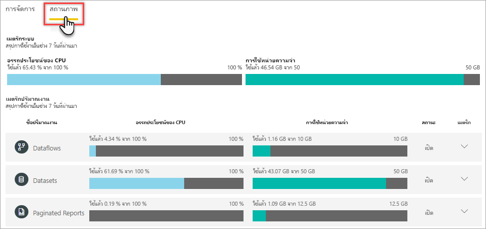

# ตรวจสอบความจุในพอร์ทัลผู้ดูแลระบบMonitor capacities in the Admin portal

แท็บ **สุขภาพ** ในพื้นที่ **การตั้งค่าความจุ** ในพอร์ทัลผู้ดูแลระบบจะให้ข้อมูลสรุปเมตริกเกี่ยวกับความจุของคุณและปริมาณงานที่เปิดใช้งานThe **Health** tab in the **Capacity settings** area in the Admin portal provides a metrics summary about your capacity and enabled workloads.  

ถ้าคุณต้องการเมตริกที่ครอบคลุมมากขึ้น ให้ใช้แอป [Power BI Premium Capacity Metric](service-admin-premium-monitor-capacity.md)If you need more comprehensive metrics, use the [Power BI Premium Capacity Metrics](service-admin-premium-monitor-capacity.md) app. แอปนี้มีข้อมูลการเจาะลึกรายละเอียดและการกรอง และเมตริกที่มีรายละเอียดมากที่สุดสำหรับเกือบทุกแง่มุมที่มีผลต่อประสิทธิภาพของความจุThe app provides drill-down and filtering, and the most detailed metrics for near every aspect affecting capacity performance. หากต้องการเรียนรู้เพิ่มเติม โปรดดู [ตรวจสอบความจุ Premium ด้วยแอป](service-admin-premium-monitor-capacity.md)To learn more, see [Monitor Premium capacities with the app](service-admin-premium-monitor-capacity.md).

> [!IMPORTANT]
> ถ้าความจุ Power BI Premium ของคุณกำลังประสบปัญหาการใช้ทรัพยากรสูงจนส่งผลให้เกิดปัญหาด้านประสิทธิภาพการทำงานหรือความมั่นคง คุณสามารถรับอีเมลแจ้งเตือนเพื่อทราบปัญหาและแก้ไขปัญหาได้If your Power BI Premium capacity is experiencing high resource usage, resulting in performance or reliability issues, you can receive notification emails to identify and resolve the issue. ซึ่งอาจเป็นวิธีที่มีประสิทธิภาพในการแก้ไขปัญหาความจุโอเวอร์โหลดThis can be a streamlined way to troubleshoot overloaded capacities. คุณสามารถศึกษาข้อมูลเพิ่มเติมได้ที่[ความจุและการแจ้งเตือนความมั่นคง](service-interruption-notifications.md#capacity-and-reliability-notifications)See [capacity and reliability notifications](service-interruption-notifications.md#capacity-and-reliability-notifications) for more information.

> [!NOTE]
> Power BI Premium เพิ่งเปิดตัว Premium เวอร์ชันใหม่ชื่อ **Premium Gen2** ซึ่งกำลังอยู่ในช่วงการแสดงตัวอย่างPower BI Premium recently released a new version of Premium, called **Premium Gen2**, which is currently in preview. Premium Gen2 จะทำให้การจัดการความจุระดับพรีเมียมง่ายขึ้นและลดค่าใช้จ่ายในการจัดการPremium Gen2 will simplify the management of Premium capacities, and reduce management overhead. สำหรับข้อมูลเพิ่มเติม โปรดดูที่ [Power BI Premium Generation 2 (ตัวอย่าง)](service-premium-what-is.md#power-bi-premium-generation-2-preview)For more information, see [Power BI Premium Generation 2 (preview)](service-premium-what-is.md#power-bi-premium-generation-2-preview).

## เมตริกระบบSystem Metrics

บนแท็บ **สุขภาพ** ที่ระดับสูงสุด การใช้งาน CPU และการใช้หน่วยความจำให้มุมมองที่รวดเร็วของเมตริกที่สำคัญที่สุดสำหรับความจุOn the **Health** tab, at the highest level, CPU utilization and memory usage provide a quick view of the most important metrics for the capacity. เมตริกเหล่านี้เป็นแบบสะสม รวมถึงปริมาณงานที่เปิดใช้งานทั้งหมดสำหรับความจุด้วยThese metrics are cumulative, including all enabled workloads for the capacity.

| **การวัด****Metric** | **คำอธิบาย****Description** |
| --- | --- |
| การใช้ CPU อย่างเต็มประโยชน์CPU UTILIZATION | การใช้งาน CPU โดยเฉลี่ย เป็นเปอร์เซ็นต์ของ CPU ที่ว่างพร้อมใช้งานทั้งหมดAverage CPU utilization, as a percentage of total available CPU. |
| การใช้หน่วยความจำMEMORY USAGE | การใช้หน่วยความจำโดยเฉลี่ย เป็นกิกะไบต์ (GB)Average memory usage in gigabytes (GB).|

## เมตริกปริมาณงานWorkload metrics

สำหรับปริมาณงานแต่ละรายการที่เปิดใช้สำหรับความจุFor each workload enabled for the capacity. มีการแสดงข้อมูลการใช้งาน CPU และการใช้หน่วยความจำCPU utilization and memory usage are shown.

| **การวัด****Metric** | **คำอธิบาย****Description** |
| --- | --- |
| การใช้ CPU อย่างเต็มประโยชน์CPU UTILIZATION | การใช้งาน CPU โดยเฉลี่ย เป็นเปอร์เซ็นต์ของ CPU ที่ว่างพร้อมใช้งานทั้งหมดAverage CPU utilization, as a percentage of total available CPU. |
| การใช้หน่วยความจำMEMORY USAGE | การใช้หน่วยความจำโดยเฉลี่ย เป็นกิกะไบต์ (GB)Average memory usage in gigabytes (GB).|

### เมตริกปริมาณงานโดยละเอียดDetailed workload metrics

ปริมาณงานแต่ละรายการมีเมตริกเพิ่มเติมEach workload has additional metrics. ชนิดของเมตริกที่แสดงขึ้นอยู่กับปริมาณงานThe type of metrics shown depend on the workload. หากต้องการดูเมตริกโดยละเอียดสำหรับปริมาณงาน ให้คลิกลูกศร (ลง) ขยายTo see detailed metrics for a workload, click the expand (down) arrow.

#### กระแสข้อมูลDataflows

##### การดำเนินการของกระแสข้อมูลDataflow Operations

| **การวัด****Metric** | **คำอธิบาย****Description** |
| --- | --- |
| จำนวนทั้งหมดTotal Count | การรีเฟรชทั้งหมดสำหรับแต่ละกระแสข้อมูลTotal refreshes for each dataflow. |
| จำนวนความสำเร็จSuccess Count | การรีเฟรชที่สำเร็จทั้งหมดสำหรับแต่ละกระแสข้อมูลTotal successful refreshes for each dataflow.|
| ระยะเวลาเฉลี่ย (นาที)Average Duration (min) | ระยะเวลาเฉลี่ยของการรีเฟรชสำหรับกระแสข้อมูล หน่วยเป็นนาทีThe average duration of refresh for the dataflow, in minutes |
| ระยะเวลาสูงสุด (นาที)Max Duration (min) | ระยะเวลาของการรีเฟรชที่ทำงานนานที่สุดสำหรับกระแสข้อมูล เป็นนาทีThe duration of the longest-running refresh for the dataflow, in minutes. |
| เวลารอเฉลี่ย (นาที)Average Wait Time (min) | การหน่วงเวลาเฉลี่ยระหว่างเวลาที่กำหนดไว้และเวลาเริ่มต้นของการรีเฟรชกระแสข้อมูล หน่วยเป็นนาทีThe average lag between the scheduled time and start of a refresh for the dataflow, in minutes. |
| เวลารอสูงสุด (นาที)Max Wait Time (min) | เวลารอสูงสุดสำหรับกระแสข้อมูล หน่วยเป็นนาทีThe maximum wait time for the dataflow, in minutes.  |

#### ชุดข้อมูลDatasets

##### รีเฟรชRefresh

| **การวัด****Metric** | **คำอธิบาย****Description** |
| --- | --- |
| จำนวนทั้งหมดTotal Count | การรีเฟรชทั้งหมดสำหรับแต่ละชุดข้อมูลTotal refreshes for each dataset. |
| จำนวนความสำเร็จSuccess Count | การรีเฟรชที่สำเร็จทั้งหมดสำหรับแต่ละชุดข้อมูลTotal successful refreshes for each dataset. |
| จำนวนความล้มเหลวFailure Count | การรีเฟรชที่ล้มเหลวทั้งหมดสำหรับแต่ละชุดข้อมูลTotal failed refreshes for each dataset. |
| อัตราความสำเร็จSuccess Rate  | จำนวนการรีเฟรชที่สำเร็จหารด้วยจำนวนการรีเฟรชทั้งหมดที่ทำการวัดNumber of successful refreshes divided by the total refreshes to measure. ความน่าเชื่อถือreliability. |
| ระยะเวลาเฉลี่ย (นาที)Average Duration (min) | ระยะเวลาเฉลี่ยของการรีเฟรชสำหรับชุดข้อมูล เป็นนาทีThe average duration of refresh for the dataset, in minutes.  |
| ระยะเวลาสูงสุด (นาที)Max Duration (min) | ระยะเวลาของการรีเฟรชที่ทำงานนานที่สุดสำหรับชุดข้อมูล หน่วยเป็นนาทีThe duration of the longest-running refresh for the dataset, in minutes. |
| เวลารอเฉลี่ย (นาที)Average Wait Time (min) | การหน่วงเวลาเฉลี่ยระหว่างเวลาที่กำหนดไว้และเวลาเริ่มต้นของการดำเนินการ หน่วยเป็นนาทีThe average lag between the scheduled time and start of a refresh for the dataset, in minutes. |
| เวลารอสูงสุด (นาที)Max Wait Time (min) | เวลารอสูงสุดสำหรับชุดข้อมูล หน่วยเป็นนาทีThe maximum wait time for the dataset, in minutes. |

##### คิวรีQuery

| **การวัด****Metric** | **คำอธิบาย****Description** |
| --- | --- |
| จำนวนทั้งหมดTotal Count | จำนวนรวมของคิวรีที่เรียกใช้สำหรับชุดข้อมูลThe total number of queries run for the dataset. |
| ระยะเวลาเฉลี่ย (ms)Average Duration (ms) |ระยะเวลาคิวรีเฉลี่ยสำหรับชุดข้อมูล หน่วยเป็นมิลลิวินาทีThe average query duration for the dataset, in milliseconds|
| ระยะเวลาสูงสุด (ms)Max Duration (ms) |ระยะเวลาคิวรีที่ทำงานนานที่สุดในชุดข้อมูล หน่วยเป็นมิลลิวินาทีThe duration of the longest-running query in the dataset, in milliseconds. |
| เวลารอเฉลี่ย (ms)Average Wait Time (ms) |ระยะเวลารอคิวรีเฉลี่ยสำหรับชุดข้อมูล หน่วยเป็นมิลลิวินาทีThe average query wait time for the dataset, in milliseconds. |
| เวลารอสูงสุด (ms)Max Wait Time (ms) |ระยะเวลาคิวรีที่รอนานที่สุดในชุดข้อมูล หน่วยเป็นมิลลิวินาทีThe duration of the longest-waiting query in the dataset, in milliseconds. |

##### การลดสัดส่วนEviction

| **การวัด****Metric** | **คำอธิบาย****Description** |
| --- | --- |
| จำนวนแบบจำลองModel Count | จำนวนรวมของการลดสัดส่วนชุดข้อมูลสำหรับความจุนี้The total number of dataset evictions for this capacity. เมื่อความจุเผชิญกับความกดดันที่มีต่อหน่วยความจำ โหนดจะลดชุดข้อมูลอย่างน้อยหนึ่งชุดออกจากหน่วยความจำWhen a capacity faces memory pressure, the node evicts one or more datasets from memory. ชุดข้อมูลที่ไม่ได้ใช้งาน (ที่ไม่มีการสคิวรี่/ รีเฟรชกำลังดำเนินการอยู่) จะถูกขับออกก่อนDatasets that are inactive (with no query/refresh operation currently executing) are evicted first. จากนั้นคำสั่งการขับไล่จะขึ้นอยู่กับการวัด 'การใช้น้อยที่สุด' (LRU)Then the eviction order is based on a measure of 'least recently used' (LRU). |

#### รายงานที่มีการแบ่งหน้าPaginated Reports

##### การดำเนินการรายงานReport Execution

| **การวัด****Metric** | **คำอธิบาย****Description** |
| --- | --- |
| จำนวนการดำเนินการExecution Count  | จำนวนครั้งที่ผู้ใช้ดำเนินการและดูรายงานThe number of times the report was been executed and viewed by users.|

##### การใช้รายงานReport Usage

| **การวัด****Metric** | **คำอธิบาย****Description** |
| --- | --- |
| จำนวนความสำเร็จSuccess Count | จำนวนครั้งที่ผู้ใช้ดูรายงานThe number of times the report has been viewed by a user. |
| จำนวนความล้มเหลวFailure Count |จำนวนครั้งที่ผู้ใช้ดูรายงานThe number of times the report has been viewed by a user.|
| จำนวนแถวRow Count |จำนวนแถวของข้อมูลในรายงานThe number of rows of data in the report. |
| ระยะเวลาการเรียกข้อมูล (ms)Data Retrieval Duration (ms) |ปริมาณเวลาเฉลี่ยที่ใช้ในการดึงข้อมูลสำหรับรายงาน หน่วยเป็นมิลลิวินาทีThe average amount of time it takes to retrieve data for the report, in milliseconds. ระยะเวลาที่ยาวนานอาจเป็นการบ่งชี้ถึงคิวรีที่ช้าหรือปัญหาแหล่งข้อมูลอื่นๆLong durations can indicate slow queries or other data source issues.  |
| ระยะเวลาการประมวลผล (ms)Processing Duration (ms) |ปริมาณเวลาเฉลี่ยที่ใช้ในการประมวลผลข้อมูลสำหรับรายงาน หน่วยเป็นมิลลิวินาทีThe average amount of time it takes to process the data for a report, in milliseconds. |
| ระยะเวลาการแสดงผล (ms)Rendering Duration (ms) |ปริมาณเวลาเฉลี่ยที่ใช้ในการแสดงรายงานในเบราเซอร์ หน่วยเป็นมิลลิวินาทีThe average amount of time it takes to render a report in the browser, in milliseconds. |

> [!NOTE]
> เมตริกโดยละเอียดสำหรับปริมาณงานของ **AI** ยังไม่พร้อมใช้งานDetailed metrics for the **AI** workload are not yet available.

## ขั้นตอนถัดไปNext steps

หลังจากที่คุณทำความเข้าใจวิธีการตรวจสอบความจุของ Power BI Premium ลองเรียนรู้เพิ่มเติมเกี่ยวกับการปรับความจุให้เหมาะสมNow that you understand how to monitor Power BI Premium capacities, learn more about optimizing capacities.

> [!div class="nextstepaction"]
> [การปรับ Power BI Premium ให้เหมาะสมOptimizing Power BI Premium capacities](service-premium-capacity-optimize.md)

Power BI ได้แนะนำ Power BI Premium Gen2 เข้ามาใช้งานเป็นข้อเสนอการแสดงตัวอย่าง ซึ่งปรับปรุงประสบการณ์การใช้งาน Power BI Premium ด้วยการปรับปรุงในสิ่งต่อไปนี้:Power BI has introduced Power BI Premium Gen2 as a preview offering, which improves the Power BI Premium experience with improvements in the following:
* ประสิทธิภาพการทำงานPerformance
* สิทธิการใช้งานต่อผู้ใช้Per-user licensing
* ขนาดใหญ่ขึ้นGreater scale
* เมตริกที่ดีขึ้นImproved metrics
* การปรับขนาดอัตโนมัติAutoscaling
* ลดค่าใช้จ่ายในการจัดการReduced management overhead

สำหรับข้อมูลเพิ่มเติมเกี่ยวกับ Power BI Premium Gen2 โปรดดูที่ [Power BI Premium Generation 2 (ตัวอย่าง)](service-premium-what-is.md#power-bi-premium-generation-2-preview)For more information about Power BI Premium Gen2, see [Power BI Premium Generation 2 (preview)](service-premium-what-is.md#power-bi-premium-generation-2-preview).