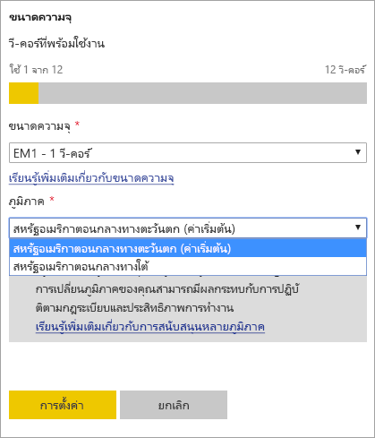

# กำหนดค่าการสนับสนุน Multi-Geo สำหรับ Power BI PremiumConfigure Multi-Geo support for Power BI Premium

Multi-Geo เป็นคุณลักษณะของ Power BI Premium ที่ช่วยให้ลูกค้าข้ามชาติจัดการกับความต้องการด้านถิ่นที่อยู่ของข้อมูลในระดับภูมิภาค เฉพาะธุรกิจ หรือองค์กรMulti-Geo is a Power BI Premium feature that helps multinational customers address regional, industry-specific, or organizational data residency requirements. ในฐานะลูกค้า Power BI Premium คุณสามารถปรับใช้เนื้อหาไปยังศูนย์ข้อมูลในภูมิภาคนอกเหนือจากภูมิภาคเดิมของผู้เช่า Power BIAs a Power BI Premium customer, you can deploy content to datacenters in regions other than the home region of the Power BI tenant. พิกัด (ภูมิศาสตร์) สามารถมีได้มากกว่าหนึ่งภูมิภาคA geo (geography) can contain more than one region. ตัวอย่างเช่น สหรัฐอเมริกาเป็นพิกัด และสหรัฐอเมริกากลางทางตะวันตกและสหรัฐอเมริกากลางทางใต้เป็นภูมิภาคในสหรัฐอเมริกาFor example, the United States is a geo, and West Central US and South Central US are regions in the United States. คุณอาจเลือกปรับใช้เนื้อหาไปยังพิกัดใดต่อไปนี้:You may choose to deploy content to any of the following geos:

- สหรัฐอเมริกาUnited States
- แคนาดาCanada
- สหราชอาณาจักรUnited Kingdom
- บราซิลBrazil
- ยุโรปEurope
- ญี่ปุ่นJapan
- อินเดียIndia
- เอเชียแปซิฟิกAsia Pacific
- ออสเตรเลียAustralia
- แอฟริกาAfrica

Multi-Geo ไม่พร้อมให้บริการใน Power BI Germany, Power BI China ที่ดำเนินการโดย 21Vianet หรือ Power BI สำหรับรัฐบาลสหรัฐอเมริกาMulti-Geo isn't available for Power BI Germany, Power BI China operated by 21Vianet, or Power BI for the US government.

Multi-Geo ในขณะนี้พร้อมใช้งานใน Power BI EmbeddedMulti-Geo is now also available in Power BI Embedded. อ่านเพิ่มเติมที่[การสนับสนุน Multi-Geo ใน Power BI Embedded](../developer/embedded/embedded-multi-geo.md)Read more at [Multi-Geo support in Power BI Embedded](../developer/embedded/embedded-multi-geo.md).

> [!NOTE]
> Power BI Premium เพิ่งเปิดตัว Premium เวอร์ชันใหม่ชื่อ **Premium Gen2** ซึ่งกำลังอยู่ในช่วงการแสดงตัวอย่างPower BI Premium recently released a new version of Premium, called **Premium Gen2**, which is currently in preview. Premium Gen2 จะทำให้การจัดการความจุระดับพรีเมียมง่ายขึ้นและลดค่าใช้จ่ายในการจัดการPremium Gen2 will simplify the management of Premium capacities, and reduce management overhead. สำหรับข้อมูลเพิ่มเติม โปรดดูที่ [Power BI Premium Generation 2 (ตัวอย่าง)](service-premium-what-is.md#power-bi-premium-generation-2-preview)For more information, see [Power BI Premium Generation 2 (preview)](service-premium-what-is.md#power-bi-premium-generation-2-preview).

## เปิดใช้งานและกำหนดค่าEnable and configure

เพื่อความจุใหม่ ๆ ให้เปิดใช้งาน Multi-Geo ด้วยการเลือกภูมิภาคนอกเหนือจากภูมิภาคเริ่มต้นจากเมนูแบบหล่นลงFor new capacities, enable Multi-Geo by selecting a region other than the default region from the dropdown.  ความจุที่ใช้ได้จะแสดงภูมิภาคที่พิกัดอยู่ อย่างเช่น **US ตอนกลางทางตะวันตก**Each available capacity shows the region where it's currently located, such as **West Central US**.

หลังจากสร้างความจุแล้ว ความจุนั้นจะอยู่ในภูมิภาคนั้น และพื้นที่ทำงานใด ๆ ที่สร้างขึ้นจะเก็บเนื้อหาไว้ในภูมิภาคนั้นAfter you've created capacity, it remains in that region, and any workspaces created will have their content stored in that region. คุณสามารถย้ายพื้นที่ทำงานจากภูมิภาคหนึ่งไปยังอีกภูมิภาคผ่านเมนูแบบหล่นลงบนหน้าจอการตั้งค่าพื้นที่ทำงานYou can migrate workspaces from one region to another through the dropdown on the workspace settings screen.

คุณเห็นข้อความนี้เพื่อยืนยันการเปลี่ยนแปลงYou see this message to confirm the change.

คุณไม่จำเป็นต้องรีเซ็ตข้อมูลประจำตัวเกตเวย์ในระหว่างการย้ายในเวลานี้You don't need to reset the gateway credentials during a migration at this time.  หลังจากที่ได้จัดเก็บไว้ในภูมิภาคความจุแบบ Premium แล้วคุณจะต้องทำการรีเซ็ตเมื่อทำการย้ายAfter they're stored in the Premium capacity region, you will need to reset them upon migration.

ในระหว่างการย้าย การดำเนินการบางอย่างอาจล้มเหลว อย่างเช่นการเผยแพร่ชุดข้อมูลใหม่หรือการกำหนดเวลารีเฟรชข้อมูลDuring migration, certain operations may fail, such as publishing new datasets or scheduled data refresh.  

รายการต่อไปนี้จัดเก็บไว้ในภูมิภาค Premium เมื่อเปิดใช้งาน Multi-Geo:The following items are stored in the Premium region when Multi-Geo is enabled:

- โมเดล (ไฟล์ .ABF) สำหรับชุดข้อมูลนำเข้าหรือ DirectQueryModels (.ABF files) for import and Direct Query datasets
- แคชคิวรีQuery cache
- ภาพ RR images

รายการเหล่านั้นจะยังคงอยู่ในภูมิภาคเดิมของผู้เช่า:These items remain in the home region for the tenant:

- ส่งชุดข้อมูลPush datasets
- เวิร์กบุ๊ก ExcelExcel workbooks
- Metadata ของแดชบอร์ด/รายงาน: ตัวอย่างเช่น ชื่อไทล์ คิวรีไทล์Dashboard/report metadata: e.g., tile names, tile queries
- บัสบริการสำหรับคิวรีเกตเวย์หรืองานรีเฟรชที่กำหนดเวลาไว้Service buses for gateway queries or scheduled refresh jobs
- การอนุญาตPermissions
- ข้อมูลประจำตัวชุดข้อมูลDataset credentials

## ดูตำแหน่งที่ตั้งความจุView capacity regions

ในพอร์ทัลผู้ดูแลระบบ คุณสามารถดูความจุทั้งหมดสำหรับผู้เช่า Power BI ของคุณและภูมิภาคที่พวกเขาอาศัยอยู่ในปัจจุบันIn the Admin Portal, you can view all the capacities for your Power BI tenant and the regions where they're currently located.

 

## เปลี่ยนภูมิภาคสำหรับเนื้อหาที่มีอยู่Change the region for existing content

หากคุณต้องการเปลี่ยนภูมิภาคสำหรับเนื้อหาที่มีอยู่ คุณมีสองทางเลือกIf you need to change the region for existing content, you have two options.

- สร้างความจุที่สองและย้ายพื้นที่ทำงานCreate a second capacity and move workspaces. ผู้ใช้ฟรีจะไม่พบระยะเวลาหยุดทำงานใด ๆ ตราบเท่าที่ผู้เช่ามี v-core สำรองFree users won't experience any downtime as long as the tenant has spare v-cores.
- หากการสร้างความจุที่สองไม่ใช่ทางเลือกที่มี คุณสามารถย้ายเนื้อหากลับไปยังความจุที่แชร์กันจาก Premium ได้ชั่วคราวIf creating a second capacity isn't an option, you can temporarily move the content back to shared capacity from Premium. คุณไม่จำเป็นต้องมี v-core เพิ่ม แต่ผู้ใช้ฟรีจพบระยะเวลาหยุดทำงานบ้างYou don't need extra v-cores, but free users will experience some downtime.

## ย้ายเนื้อหาออกจาก Multi-GeoMove content out of Multi-Geo  

คุณสามารถนำพื้นที่ทำงานออกจากความจุ Multi-Geo ได้หนึ่งในสองวิธี:You can take workspaces out of Multi-Geo capacity in one of two ways:

- ลบความจุปัจจุบันที่พื้นที่ทำงานอยู่Delete the current capacity where the workspace is located.  การทำเช่นนี้จะย้ายพื้นที่ทำงานกลับไปยังความจุที่แชร์กันในภูมิภาคเดิมThis moves the workspace back to shared capacity in the home region.
- ย้ายพื้นที่ทำงานเดี่ยวกลับไปยังความจุแบบ Premium ที่อยู่ผู้เช่าเดิมMigrate individual workspaces back to Premium capacity located in the home tenant.

ไม่ควรย้ายชุดข้อมูลรูปแบบพื้นที่จัดเก็บข้อมูลขนาดใหญ่ออกจากภูมิภาคที่สร้างขึ้นLarge-storage format datasets should not be moved from the region where they were created. รายงานที่ใช้ชุดข้อมูลรูปแบบขนาดใหญ่จะไม่สามารถโหลดชุดข้อมูลและส่งกลับข้อผิดพลาด *ไม่สามารถโหลดแบบจำลอง*Reports based on a large-format dataset will not be able to load the dataset, and return a *Cannot load model* error. ย้ายชุดข้อมูลรูปแบบพื้นที่เก็บข้อมูลขนาดใหญ่กลับไปที่ภูมิภาคเดิมเพื่อให้พร้อมใช้งานอีกครั้งMove the large-storage format dataset back to its original region to make it available again.

## ข้อจำกัดและข้อควรพิจารณาLimitations and considerations

- ยืนยันว่าการเคลื่อนย้ายใด ๆ ที่คุณทำระหว่างภูมิภาคได้ปฏิบัติตามข้อกำหนดของรัฐบาลและบริษัทก่อนที่จะทำการโอนย้ายข้อมูลConfirm that any movement you initiate between regions follows all corporate and government compliance requirements prior to initiating data transfer.
- คิวรีที่ได้รับการแคชที่เก็บอยู่ในภูมิภาคระยะไกลจะพักอยู่ในภูมิภาคนั้นA cached query stored in a remote region stays in that region at rest. อย่างไรก็ตาม ข้อมูลอื่นที่อยู่ในระหว่างการส่งต่ออาจเดินทางกลับไปกลับมาระหว่างเขตภูมิศาสตร์หลายเขตHowever, other data in transit may go back and forth between multiple geographies.
- เมื่อทำการย้ายข้อมูลจากภูมิภาคหนึ่งไปยังอีกภูมิภาคหนึ่งในสภาพแวดล้อม Multi-Geo ข้อมูลต้นทางอาจยังอยู่ในภูมิภาคที่ย้ายออกมานานถึง 30 วันWhen moving data from one region to another in a Multi-Geo environment, the source data may remain in the region from which the data was moved for up to 30 days. ในระหว่างนั้นผู้ใช้ปลายทางจะไม่มีสิทธิ์เข้าถึงข้อมูลDuring that time end users don't have access to it. ข้อมูลจะถูกลบออกจากภูมิภาคและทำลายในระยะเวลา 30 วันนั้นIt's removed from this region and destroyed during the 30-day period.
- ข้อความคิวรีและการรับส่งผลลัพธ์คิวรีสำหรับรูปแบบข้อมูลที่นำเข้าไม่ได้ส่งผ่านภูมิภาคเดิมQuery text and query result traffic for imported data models does not transit through the home region. เมตาดาต้าของรายงานยังมาจากภูมิภาคระยะไกล และบางสถานะการกำหนดเส้นทาง DNS อาจนำการรับส่งข้อมูลออกจากภูมิภาคThe report metadata does still come from the remote region, and certain DNS routing states may take traffic out of the region. 
- คุณลักษณะ[กระแสข้อมูล](../transform-model/dataflows/dataflows-introduction-self-service.md) ไม่ได้รับการสนับสนุนบน Multi-GEO ในขณะนี้The [dataflows](../transform-model/dataflows/dataflows-introduction-self-service.md) feature is not supported on Multi-GEO at this time.
- การย้ายชุดข้อมูลรูปแบบพื้นที่จัดเก็บขนาดใหญ่จากภูมิภาคที่สร้างขึ้นจะส่งผลให้รายงานไม่สามารถโหลดชุดข้อมูลได้Moving large-storage format datasets from the region where they were created will result in reports failing to load the dataset. ย้ายชุดข้อมูลพื้นที่เก็บข้อมูลขนาดใหญ่กลับไปที่ภูมิภาคเดิมเพื่อให้พร้อมใช้งานMove the large-storage dataset back to its original region to make it available. 

## ขั้นตอนถัดไปNext steps

- [Power BI Premium คืออะไร?What is Power BI Premium?](service-premium-what-is.md)
- [Multi-Geo สำหรับความจุ Power BI EmbeddedMulti-Geo for Power BI Embedded capacities](../developer/embedded/embedded-multi-geo.md)

มีคำถามเพิ่มเติมหรือไม่More questions? [ลองถามชุมชน Power BITry asking the Power BI Community](https://community.powerbi.com/)

Power BI ได้แนะนำ Power BI Premium Gen2 เข้ามาใช้งานเป็นข้อเสนอการแสดงตัวอย่าง ซึ่งปรับปรุงประสบการณ์การใช้งาน Power BI Premium ด้วยการปรับปรุงในสิ่งต่อไปนี้:Power BI has introduced Power BI Premium Gen2 as a preview offering, which improves the Power BI Premium experience with improvements in the following:
* ประสิทธิภาพการทำงานPerformance
* สิทธิการใช้งานต่อผู้ใช้Per-user licensing
* ขนาดใหญ่ขึ้นGreater scale
* เมตริกที่ดีขึ้นImproved metrics
* การปรับขนาดอัตโนมัติAutoscaling
* ลดค่าใช้จ่ายในการจัดการReduced management overhead

สำหรับข้อมูลเพิ่มเติมเกี่ยวกับ Power BI Premium Gen2 โปรดดูที่ [Power BI Premium Generation 2 (ตัวอย่าง)](service-premium-what-is.md#power-bi-premium-generation-2-preview)For more information about Power BI Premium Gen2, see [Power BI Premium Generation 2 (preview)](service-premium-what-is.md#power-bi-premium-generation-2-preview).
