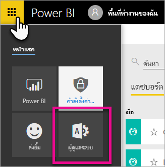
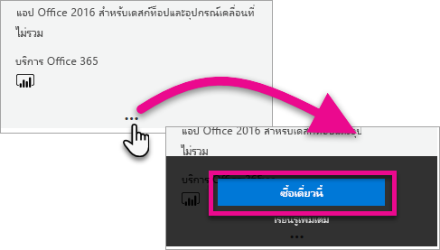
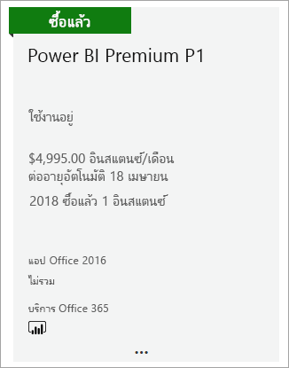
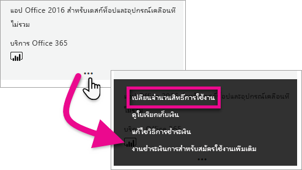
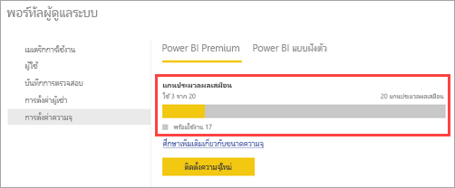

# วิธีการซื้อ Power BI PremiumHow to purchase Power BI Premium

บทความนี้อธิบายวิธีการซื้อความจุของ Power BI Premium สำหรับองค์กรของคุณThis article describes how to purchase Power BI Premium capacity for your organization. บทความนี้ครอบคลุมสถานการณ์ต่อไปนี้:The article covers the following scenario:

- การใช้ P SKU สำหรับสถานการณ์การผลิตทั่วไปUsing P SKUs for typical production scenarios. P SKU กำหนดให้มีข้อผูกมัดรายเดือนหรือรายปี และจะเรียกเก็บเงินเป็นรายเดือนP SKUs require a monthly or yearly commitment, and are billed monthly.

สำหรับข้อมูลเพิ่มเติมเกี่ยวกับ Power BI Premium ดูที่ [Power BI Premium คืออะไร](service-premium-what-is.md)For more information about Power BI Premium, see [What is Power BI Premium?](service-premium-what-is.md). สำหรับข้อมูลการกำหนดราคาและการวางแผนในปัจจุบัน ดู [หน้าการกำหนดราคา Power BI](https://powerbi.microsoft.com/pricing/) และ [เครื่องคิดเลข Power BI Premium](https://powerbi.microsoft.com/calculator/)For current pricing and planning information, see the [Power BI pricing page](https://powerbi.microsoft.com/pricing/) and the [Power BI Premium calculator](https://powerbi.microsoft.com/calculator/). ผู้เขียนเนื้อหาจะยังคงจำเป็นต้องมี [สิทธิ์การใช้งาน Power BI Pro](service-admin-purchasing-power-bi-pro.md) แม้ว่าองค์กรของคุณจะใช้ Power BI Premium ก็ตามContent creators still need a [Power BI Pro license](service-admin-purchasing-power-bi-pro.md), even if your organization uses Power BI Premium. ตรวจสอบให้แน่ใจว่าคุณซื้อสิทธิ์การใช้งาน Power BI Pro อย่างน้อยหนึ่งใบสำหรับองค์กรของคุณEnsure you purchase at least one Power BI Pro license for your organization. เมื่อใช้ A SKU _ผู้ใช้ทั้งหมด_ ที่ใช้เนื้อหายังจำเป็นต้องมีสิทธิการใช้งาน ProWith A SKUs, _all users_ who consume content also require Pro licenses.

> [!NOTE]
> ถ้าการสมัครใช้งานระดับ Premium หมดอายุ คุณมีเวลา 30 วันของการเข้าถึงความจุแบบเต็มของคุณIf a Premium subscription expires, you have 30 days of full access to your capacity. หลังจากนั้น เนื้อหาของคุณจะเปลี่ยนเป็นความจุที่ใช้ร่วมกันAfter that, your content reverts to a shared capacity. แบบจำลองที่มีความจุมากกว่า 1 GB ไม่ได้รับการรับรองในความจุที่ใช้ร่วมกันModels that are greater than 1 GB are not supported in shared capacity.

> [!NOTE]
> Power BI Premium เพิ่งเปิดตัว Premium เวอร์ชันใหม่ชื่อ **Premium Gen2** ซึ่งกำลังอยู่ในช่วงการแสดงตัวอย่างPower BI Premium recently released a new version of Premium, called **Premium Gen2**, which is currently in preview. Premium Gen2 จะทำให้การจัดการความจุระดับพรีเมียมง่ายขึ้นและลดค่าใช้จ่ายในการจัดการPremium Gen2 will simplify the management of Premium capacities, and reduce management overhead. สำหรับข้อมูลเพิ่มเติม โปรดดูที่ [Power BI Premium Generation 2 (ตัวอย่าง)](service-premium-what-is.md#power-bi-premium-generation-2-preview)For more information, see [Power BI Premium Generation 2 (preview)](service-premium-what-is.md#power-bi-premium-generation-2-preview).

## ซื้อ P SKU สำหรับสถานการณ์การผลิตทั่วไปPurchase P SKUs for typical production scenarios

คุณสามารถสร้างผู้เช่าใหม่ด้วย Power BI Premium ที่กำหนดค่า SKU หรือคุณสามารถซื้อความจุ Power BI Premium สำหรับองค์กรที่มีอยู่ได้You can create a new tenant with a Power BI Premium P1 SKU configured, or you can purchase a Power BI Premium capacity for an existing organization. ในทั้งสองกรณี คุณสามารถเพิ่มความจุได้หากคุณต้องการIn both cases, you can then add capacity if you need it.

### สร้างลูกค้าใหม่ด้วย Power BI Premium P1Create a new tenant with Power BI Premium P1

ถ้าคุณไม่มีผู้เช่าและต้องการสร้างหนึ่งรายการ คุณสามารถซื้อ Power BI Premium ได้ในเวลาเดียวกันIf you don't have an existing tenant and want to create one, you can purchase Power BI Premium at the same time. ลิงก์ต่อไปนี้จะนำคุณไปสู่กระบวนการสร้างผู้เช่ารายใหม่และช่วยให้คุณสามารถซื้อ Power BI Premium: [ข้อเสนอ Power BI Premium P1](https://signup.microsoft.com/Signup?OfferId=b3ec5615-cc11-48de-967d-8d79f7cb0af1)The following link walks you through the process of creating a new tenant and enables you to purchase Power BI Premium: [Power BI Premium P1 offer](https://signup.microsoft.com/Signup?OfferId=b3ec5615-cc11-48de-967d-8d79f7cb0af1). เมื่อคุณสร้างผู้เช่า คุณจะได้รับมอบหมายให้ทำหน้าที่เป็นผู้ดูแลระบบส่วนกลางของ Microsoft 365 โดยอัตโนมัติสำหรับผู้เช่ารายนั้นWhen you create your tenant, you will automatically be assigned to the Microsoft 365 Global Administrator role for that tenant.

หลังจากที่คุณซื้อความจุ ให้เรียนรู้วิธีการ [จัดการความจุ](service-admin-premium-manage.md#manage-capacity) และ [มอบหมายพื้นที่ทำงาน](service-admin-premium-manage.md#assign-a-workspace-to-a-capacity) ให้กับความจุAfter you purchase capacity, learn how to [manage capacities](service-admin-premium-manage.md#manage-capacity) and [assign workspaces](service-admin-premium-manage.md#assign-a-workspace-to-a-capacity) to a capacity.

### ซื้อความจุ Power BI Premium สำหรับองค์กรที่มีอยู่Purchase a Power BI Premium capacity for an existing organization

ถ้าคุณมีองค์กรที่มีอยู่แล้ว (ผู้เช่า) คุณต้องอยู่ในบทบาทผู้ดูแลระบบส่วนกลางของ Microsoft 365 หรือบทบาทของผู้ดูแลระบบการเรียกเก็บเงินเพื่อซื้อการสมัครรับข้อมูลและสิทธิ์การใช้งานIf you have an existing organization (tenant), you must be in the Microsoft 365 Global Administrator role or Billing Administrator role to purchase subscriptions and licenses. สำหรับข้อมูลเพิ่มเติม ให้ดู[เกี่ยวกับบทบาทผู้ดูแลระบบ Microsoft 365](https://support.office.com/article/About-Office-365-admin-roles-da585eea-f576-4f55-a1e0-87090b6aaa9d)For more information, see [About Microsoft 365 admin roles](https://support.office.com/article/About-Office-365-admin-roles-da585eea-f576-4f55-a1e0-87090b6aaa9d).

เมื่อต้องการซื้อความจุระดับพรีเมี่ยม ให้ทำตามขั้นตอนต่อไปนี้To purchase Premium capacity, follow these steps.

1. จากภายใน Power BI service เลือกตัวเลือกแอป Microsoft 365 จากนั้นเลือก **ผู้ดูแลระบบ**From within the Power BI service, select the Microsoft 365 app picker then **Admin**.

    

    อีกวิธีหนึ่งคือ คุณสามารถเรียกดูศูนย์การจัดการ Microsoft 365Alternatively, you can browse to the Microsoft 365 admin center.

1. เลือก **การเรียกเก็บเงิน** > **ซื้อบริการ**Select **Billing** > **Purchase services**.

1. ภายใต้ **แผนอื่น ๆ** ค้นหาข้อเสนอของ Power BI PremiumUnder **Other plans**, look for Power BI Premium offerings. ซึ่งจะแสดงรายการเป็น P1 ผ่าน P3, EM3 และ P1 (แบบรายเดือน)This will list as P1 through P3, EM3 and P1 (month to month).

1. วางเคอร์เซอร์เหนือ จุดไข่ปลา ( **. . .** )แล้ว เลือก **ซื้อทันที**Hover over the ellipsis (**. . .**) and then select **Buy now**.

    

1. ทำตามขั้นตอนเพื่อทำการซื้อให้เสร็จสมบูรณ์Follow the steps to complete the purchase.

หลังจากที่คุณเสร็จสิ้นการซื้อ **หน้าจอบริการการซื้อ** จะแสดงว่ารายการนั้นถูกซื้อและใช้งานได้After you have completed the purchase, the **Purchase services** page shows that the item is purchased and active.

หลังจากที่คุณซื้อความจุ ให้เรียนรู้วิธีการ [จัดการความจุ](service-admin-premium-manage.md#manage-capacity) และ [มอบหมายพื้นที่ทำงาน](service-admin-premium-manage.md#assign-a-workspace-to-a-capacity) ให้กับความจุAfter you purchase capacity, learn how to [manage capacities](service-admin-premium-manage.md#manage-capacity) and [assign workspaces](service-admin-premium-manage.md#assign-a-workspace-to-a-capacity) to a capacity.

### ซื้อความจุเพิ่มเติมPurchase additional capacities

ขณะนี้คุณมีความจุแล้ว คุณสามารถเพิ่มความจุได้ตามที่คุณต้องการNow that you have a capacity, you can add more as your needs grow. คุณสามารถผสม Premium capacity SKUs (P1 ผ่าน P3) ภายในองค์กรของคุณได้You can use any combination of Premium capacity SKUs (P1 through P3) within your organization. SKU ที่ต่างกันมีความสามารถด้านทรัพยากรที่แตกต่างกันThe different SKUs provide different resource capabilities.

1. ในศูนย์การจัดการ Microsoft 365 เลือก **การเรียกเก็บเงิน** > **ซื้อบริการ**In the Microsoft 365 admin center, select **Billing** > **Purchase services**.

1. ค้นหารายการ Power BI Premium ที่คุณต้องการซื้อหนึ่งภายใต้ **แผนอื่นๆ**Find the Power BI Premium item you want to purchase more of under **Other plans**.

1. วางเมาส์เหนือ **ตัวเลือกเพิ่มเติม** (...) แล้วเลือก **เปลี่ยนจำนวนสิทธิ์การใช้งาน**Hover over **More options** (...) and then select **Change license quantity**.

    

1. เปลี่ยนจำนวนของอินสแตนซ์ที่คุณต้องการสำหรับรายการนี้Change the number of instances that you want to have for this item. แล้ว เลือก **ส่ง** เมื่อทำเสร็จแล้วThen select **Submit** when finished.

   > [!IMPORTANT]
   > การเลือก **ส่ง** จะเรียกเก็บเงินจากบัตรเครดิตในไฟล์Selecting **Submit** charges the credit card on file.

หน้า **ซื้อบริการ** จะบ่งชี้ถึงจำนวนของอินสแตนซ์ที่คุณมีThe **Purchase services** page will then indicate the number of instances you have. ภายในพอร์ทัลผู้ดูแล Power BI ภายใต้ **ตั้งค่าความจุ** แกน v ที่พร้อมใช้งานสะท้อนถึงความจุที่ซื้อใหม่Within the Power BI admin portal, under **Capacity settings**, the available v-cores reflects the new capacity purchased.

### ยกเลิกการสมัครใช้งานCancel your subscription

คุณสามารถยกเลิกการสมัครใช้งานจากภายในศูนย์การจัดการ Microsoft 365You can cancel your subscription from within the Microsoft 365 admin center. เพื่อยกเลิกการสมัครใช้งาน Premium ให้ทำสิ่งต่อไปนี้To cancel your Premium subscription, do the following.

1. ค้นหาศูนย์การจัดการ Microsoft 365Browse to the Microsoft 365 admin center.

1. เลือก **การเรียกเก็บเงิน** > **การสมัครใช้งาน**Select **Billing** > **Subscriptions**.

1. เลือกการสมัครใช้งาน Power BI Premium จากรายการSelect your Power BI Premium subscription from the list.

1. เลือก **การดำเนินการเพิ่มเติม** > **ยกเลิกการสมัครใช้งาน**Select **More actions** > **Cancel subscription**.

1. หน้า **ยกเลิกการสมัครใช้งาน** จะระบุว่าที่คุณเป็นผู้รับผิดชอบสำหรับ [ค่าธรรมเนียมการหยุดใช้งานก่อน](https://support.office.com/article/early-termination-fees-6487d4de-401a-466f-8bc3-c0beb5cc40d3)หรือไม่The **Cancel subscription** page will indicate whether or not you are responsible for an [early termination fee](https://support.office.com/article/early-termination-fees-6487d4de-401a-466f-8bc3-c0beb5cc40d3). เพจนี้จะยังแจ้งให้คุณทราบเมื่อข้อมูลจะถูกลบเพื่อสมัครใช้งานThis page will also let you know when the data will be deleted for the subscription.

1. อ่านผ่านข้อมูล และถ้าคุณต้องการดำเนินการ ให้เลือก **ยกเลิกการสมัครใช้งาน**Read through the information, and if you want to proceed, select **Cancel subscription**.

#### เมื่อยกเลิกหรือสิทธิ์การใช้งานของคุณหมดอายุWhen canceling or your license expires

เมื่อยกเลิกการสมัครใช้งานแบบพรีเมียม หรือสิทธิ์การใช้งานความจุของคุณหมดอายุ คุณยังสามารถเข้าถึงความจุพรีเมียมของคุณได้เป็นระยะเวลา 30 วันนับจากวันที่ยกเลิกหรือหมดอายุสิทธิ์การใช้งานWhen you cancel your Premium subscription, or your capacity license expires, you can continue to access your Premium capacities for a period of 30 days from the date of cancellation or license expiration. หลังจาก 30 วัน คุณจะไม่สามารถเข้าถึงความจุพรีเมียมหรือพื้นที่ทำงานภายในความจุดังกล่าวได้อีกต่อไปAfter 30 days, you will no longer be able to access your Premium capacities or workspaces in them.

## ซื้อ A SKU สำหรับการทดสอบและสถานการณ์อื่นๆPurchase A SKUs for testing and other scenarios

คุณยังสามารถซื้อ SKU สำหรับการทดสอบและสถานการณ์อื่น ๆ ซึ่งให้ความจุแบบ Premium เป็นรายชั่วโมงYou can also purchase A SKUs for testing and other scenarios, which provides Premium capacity on an hourly basis. สำหรับข้อมูลและขั้นตอนเพิ่มเติม โปรดดู[ซื้อ Power BI Premium สำหรับการทดสอบ](service-admin-premium-testing.md)For more information and steps, see [Purchase Power BI Premium for testing](service-admin-premium-testing.md).

## ขั้นตอนถัดไปNext steps

[กำหนดค่าและจัดการความจุใน Power BI Premium](service-admin-premium-manage.md)[Configure and manage capacities in Power BI Premium](service-admin-premium-manage.md)\
[หน้าการกำหนดราคา Power BI](https://powerbi.microsoft.com/pricing/)[Power BI pricing page](https://powerbi.microsoft.com/pricing/)\
[เครื่องคิดเลข Power BI Premium](https://powerbi.microsoft.com/calculator/)[Power BI Premium calculator](https://powerbi.microsoft.com/calculator/)\
[คำถามที่ถามบ่อยสำหรับ Power BI Premium](service-premium-faq.md)[Power BI Premium FAQ](service-premium-faq.md)\
[เอกสารทางเทคนิคเรื่องการวางแผนการใช้ Power BI สำหรับองค์กรPlanning a Power BI Enterprise Deployment whitepaper](https://aka.ms/pbienterprisedeploy)

มีคำถามเพิ่มเติมหรือไม่More questions? [ลองถามชุมชน Power BITry asking the Power BI Community](https://community.powerbi.com/)

Power BI ได้แนะนำ Power BI Premium Gen2 เข้ามาใช้งานเป็นข้อเสนอการแสดงตัวอย่าง ซึ่งปรับปรุงประสบการณ์การใช้งาน Power BI Premium ด้วยการปรับปรุงในสิ่งต่อไปนี้:Power BI has introduced Power BI Premium Gen2 as a preview offering, which improves the Power BI Premium experience with improvements in the following:
* ประสิทธิภาพการทำงานPerformance
* สิทธิการใช้งานต่อผู้ใช้Per-user licensing
* ขนาดใหญ่ขึ้นGreater scale
* เมตริกที่ดีขึ้นImproved metrics
* การปรับขนาดอัตโนมัติAutoscaling
* ลดค่าใช้จ่ายในการจัดการReduced management overhead

สำหรับข้อมูลเพิ่มเติมเกี่ยวกับ Power BI Premium Gen2 โปรดดูที่ [Power BI Premium Generation 2 (ตัวอย่าง)](service-premium-what-is.md#power-bi-premium-generation-2-preview)For more information about Power BI Premium Gen2, see [Power BI Premium Generation 2 (preview)](service-premium-what-is.md#power-bi-premium-generation-2-preview).