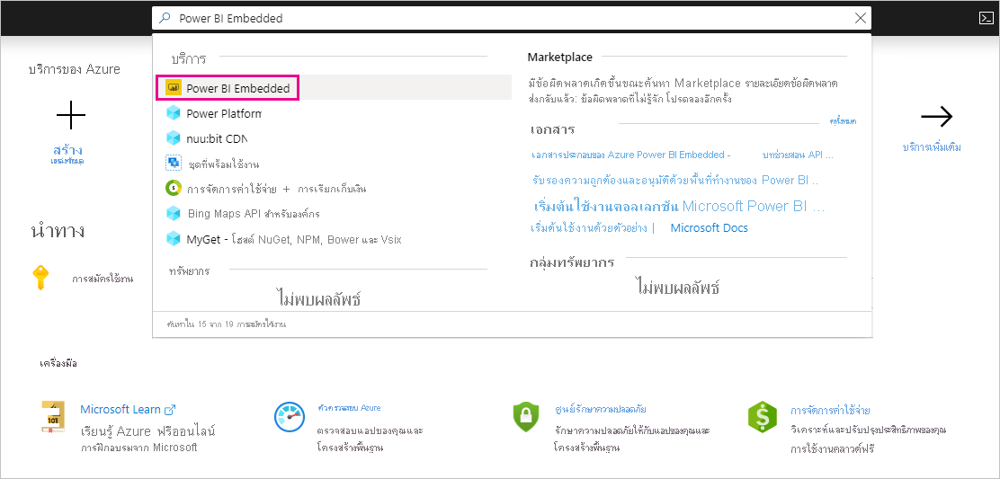

# Purchase Power BI Premium สำหรับการทดสอบPurchase Power BI Premium for testing

บทความนี้อธิบายถึงวิธีการซื้อ Power BI Premium A SKU สำหรับสถานการณ์การทดสอบ และกรณีที่คุณไม่มีสิทธิ์ที่จำเป็นในการซื้อ P SKU (บทบาทผู้ดูแลระบบส่วนกลาง Microsoft 365 หรือบทบาทผู้ดูแลระบบการเรียกเก็บเงิน)This article describes how to purchase Power BI Premium A SKUs for testing scenarios, and for cases where you don't have the permissions necessary to purchase P SKUs (Microsoft 365 Global Administrator role or Billing Administrator role). A SKU ไม่จำเป็นต้องมีข้อผูกมัดเวลา และเรียกเก็บเงินเป็นรายชั่วโมงA SKUs require no time commitment, and are billed hourly. คุณซื้อ A SKU ใน [พอร์ทัล Azure](https://portal.azure.com)You purchase A SKUs in the [Azure portal](https://portal.azure.com).

สำหรับข้อมูลเพิ่มเติมเกี่ยวกับ Power BI Premium ดูที่ [Power BI Premium คืออะไร](service-premium-what-is.md)For more information about Power BI Premium, see [What is Power BI Premium?](service-premium-what-is.md). สำหรับข้อมูลการกำหนดราคาและการวางแผนในปัจจุบัน ดู [หน้าการกำหนดราคา Power BI](https://powerbi.microsoft.com/pricing/) และ [เครื่องคิดเลข Power BI Premium](https://powerbi.microsoft.com/calculator/)For current pricing and planning information, see the [Power BI pricing page](https://powerbi.microsoft.com/pricing/) and the [Power BI Premium calculator](https://powerbi.microsoft.com/calculator/). ผู้เขียนเนื้อหาจะยังคงจำเป็นต้องมี [สิทธิ์การใช้งาน Power BI Pro](service-admin-purchasing-power-bi-pro.md) แม้ว่าองค์กรของคุณจะใช้ Power BI Premium ก็ตามContent creators still need a [Power BI Pro license](service-admin-purchasing-power-bi-pro.md), even if your organization uses Power BI Premium. ตรวจสอบให้แน่ใจว่าคุณซื้อสิทธิ์การใช้งาน Power BI Pro อย่างน้อยหนึ่งใบสำหรับองค์กรของคุณEnsure you purchase at least one Power BI Pro license for your organization. เมื่อใช้ A SKU _ผู้ใช้ทั้งหมด_ ที่ใช้เนื้อหายังจำเป็นต้องมีสิทธิการใช้งาน ProWith A SKUs, _all users_ who consume content also require Pro licenses.

> [!NOTE]
> ถ้าการสมัครใช้งานระดับ Premium หมดอายุ คุณมีเวลา 30 วันของการเข้าถึงความจุแบบเต็มของคุณIf a Premium subscription expires, you have 30 days of full access to your capacity. หลังจากนั้น เนื้อหาของคุณจะเปลี่ยนเป็นความจุที่ใช้ร่วมกันAfter that, your content reverts to a shared capacity. แบบจำลองที่มีความจุมากกว่า 1 GB ไม่ได้รับการรับรองในความจุที่ใช้ร่วมกันModels that are greater than 1 GB are not supported in shared capacity.

## ซื้อ A SKU สำหรับการทดสอบและสถานการณ์อื่นๆPurchase A SKUs for testing and other scenarios

มีการทำให้ A SKU พร้อมใช้งานผ่านทางบริการ Azure Power BI EmbeddedA SKUs are made available through the Azure Power BI Embedded service. คุณสามารถใช้ A SKU ในวิธีการต่อไปนี้:You can use A SKUs in the following ways:

- เปิดใช้งานการฝังของ Power BI ในแอปพลิเคชันของบุคคลที่สามEnable embedding of Power BI in third party applications. สำหรับข้อมูลเพิ่มเติม ให้ดู [Power BI Embedded](../developer/embedded/azure-pbie-what-is-power-bi-embedded.md)For more information, see [Power BI Embedded](../developer/embedded/azure-pbie-what-is-power-bi-embedded.md).

- ทดสอบฟังก์ชัน Premium ก่อนที่คุณจะซื้อ P SKUTest Premium functionality before you buy a P SKU.

- สร้างสภาพแวดล้อมการพัฒนาและการทดสอบควบคู่ไปกับสภาพแวดล้อมการผลิตที่ใช้ P SKUCreate development and test environments alongside a production environment that uses P SKUs.

- ซื้อ Power BI Premium แม้ว่าคุณจะไม่ใช่บทบาทผู้ดูแลระบบส่วนกลาง Microsoft 365 หรือบทบาทผู้ดูแลระบบการเรียกเก็บเงินPurchase Power BI Premium even though you're not a Microsoft 365 Global Administrator role or Billing Administrator role.

> [!NOTE]
> ถ้าคุณซื้อ SKU ขนาด A4 หรือสูงกว่าคุณสามารถใช้ประโยชน์จากคุณลักษณะ Premium ทั้งหมด ยกเว้นการแชร์เนื้อหาได้ไม่จำกัดIf you purchase an A4 or higher SKU, you can take advantage of all Premium features except for unlimited sharing of content. เมื่อใช้ A SKU _ผู้ใช้ทั้งหมด_ ที่ใช้เนื้อหาจำเป็นต้องมีสิทธิการใช้งาน ProWith A SKUs, _all users_ who consume content require Pro licenses.

ให้ปฏิบัติตามขั้นตอนเหล่านี้เพื่อซื้อ A SKU ในพอร์ทัล AzureFollow these steps to purchase A SKUs in the Azure portal:

1. ลงชื่อเข้าใช้ [พอร์ทัล Azure](https://portal.azure.com) ด้วยบัญชีที่มีสิทธิ์ระดับผู้ดูแลระบบความจุเป็นอย่างน้อยใน Power BISign in to the [Azure portal](https://portal.azure.com) with an account that has at least capacity admin permissions in Power BI.

1. ค้นหา _Power BI Embedded_ และเลือกบริการในผลลัพธ์การค้นหาSearch for _Power BI Embedded_ and select the service in the search results.

    

1. เลือก **สร้าง Power BI Embedded**Select **Create Power BI Embedded**.

    

1. บนหน้าจอการสร้าง **Power BI Embedded** ให้ระบุข้อมูลต่อไปนี้:On the **Power BI Embedded** create screen, specify the following information:

    - **การสมัครรับข่าวสาร** ในการสร้างบริการ Power BI EmbeddedThe **Subscription** in which to create the Power BI Embedded service.

    - **ตำแหน่งที่ตั้ง** ทางกายภาพ ในการสร้างกลุ่มทรัพยากรที่ประกอบด้วยบริการThe physical **Location** in which to create the resource group that contains the service. เพื่อประสิทธิภาพที่ดีกว่า ตำแหน่งที่ตั้งนี้ควรอยู่ใกล้เคียงกับตำแหน่งที่ตั้งของผู้เช่า Azure Active Directory ของคุณสำหรับ Power BIFor better performance, this location should be close to the location of your Azure Active Directory tenant for Power BI.

    - **กลุ่มทรัพยากร** ที่มีอยู่ ในการใช้หรือสร้างใหม่ตามที่แสดงในตัวอย่างThe existing **Resource group** to use, or create a new one as shown in the example.

    - **ผู้ดูแลระบบความจุ Power BI**The **Power BI capacity administrator**. ผู้ดูแลระบบความจุต้องเป็นผู้ใช้ที่เป็นสมาชิกหรือโครงร่างสำคัญของบริการในผู้เช่า Azure AD ของคุณThe capacity admin must be a member user or a service principal in your Azure AD tenant.

    

1. ถ้าคุณต้องการใช้คุณลักษณะทั้งหมดของ Power BI Premium (ยกเว้นการแชร์ที่ไม่จำกัด) คุณจำเป็นต้องมี A4 SKU เป็นอย่างน้อยIf you want to use all features of Power BI Premium (except unlimited sharing), you need at at least an A4 SKU. เลือก **เปลี่ยนขนาด**Select **Change size**.

    

1. เลือกขนาดความจุ A4, A5 หรือ A6 ซึ่งสอดคล้องกับ P1, P2 และ P3Select a capacity size of A4, A5, or A6, which correspond to P1, P2, and P3.

    

1. เลือก **รีวิว + สร้าง** ตรวจทานตัวเลือกที่คุณเลืกอ จากนั้นเลือก **สร้าง**Select **Review + Create**, review the options you chose, then select **Create**.

    

1. อาจใช้เวลาสองถึงสามนาทีเพื่อให้การปรับใช้เสร็จสมบูรณ์It can take a few minutes to complete the deployment. เมื่อพร้อมแล้วให้เลือก **ไปที่ทรัพยากร**When it's ready, select **Go to resource**.

    

1. บนหน้าจอการจัดการ ตรวจทานตัวเลือกที่คุณมีสำหรับการจัดการบริการ รวมถึงการหยุดบริการเมื่อคุณไม่ได้ใช้งานOn the management screen, review the options you have for managing the service, including pausing the service when you're not using it.

    

หลังจากที่คุณซื้อความจุ ให้เรียนรู้วิธีการ [จัดการความจุ](service-admin-premium-manage.md#manage-capacity) และ [มอบหมายพื้นที่ทำงาน](service-admin-premium-manage.md#assign-a-workspace-to-a-capacity) ให้กับความจุAfter you purchase capacity, learn how to [manage capacities](service-admin-premium-manage.md#manage-capacity) and [assign workspaces](service-admin-premium-manage.md#assign-a-workspace-to-a-capacity) to a capacity.

## ขั้นตอนถัดไปNext steps

[Power BI Premium คืออะไร](service-premium-what-is.md)
[วิธีการซื้อ Power BI Premium](service-admin-premium-purchase.md)
[กำหนดค่าและจัดการความจุใน Power BI Premium](service-admin-premium-manage.md)\[What is Power BI Premium?](service-premium-what-is.md)
[How to purchase Power BI Premium](service-admin-premium-purchase.md)
[Configure and manage capacities in Power BI Premium](service-admin-premium-manage.md)\
[หน้าการกำหนดราคา Power BI](https://powerbi.microsoft.com/pricing/)[Power BI pricing page](https://powerbi.microsoft.com/pricing/)\
[เครื่องคิดเลข Power BI Premium](https://powerbi.microsoft.com/calculator/)[Power BI Premium calculator](https://powerbi.microsoft.com/calculator/)\
[คำถามที่ถามบ่อยสำหรับ Power BI Premium](service-premium-faq.md)[Power BI Premium FAQ](service-premium-faq.md)\
[เอกสารทางเทคนิคเรื่องการวางแผนการใช้ Power BI สำหรับองค์กรPlanning a Power BI Enterprise Deployment whitepaper](https://aka.ms/pbienterprisedeploy)

มีคำถามเพิ่มเติมหรือไม่More questions? [ลองถามชุมชน Power BITry asking the Power BI Community](https://community.powerbi.com/)
