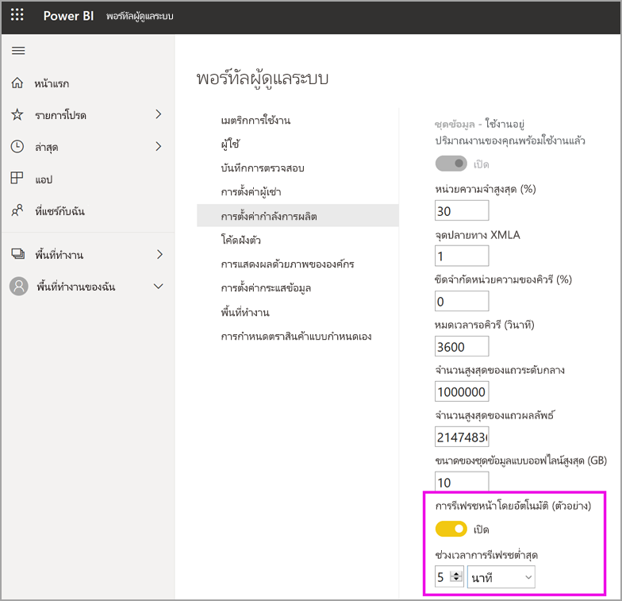

# กำหนดค่าปริมาณงานในกำลังการผลิตแบบ PremiumConfigure workloads in a Premium capacity

บทความนี้อธิบายเกี่ยวกับการเปิดใช้งาน และกำหนดปริมาณงานสำหรับกำลังการผลิตแบบ Power BI PremiumThis article describes enabling and configuring workloads for Power BI Premium capacities. ตามค่าเริ่มต้น กำลังการผลิตที่สนับสนุนเฉพาะปริมาณงานที่เชื่อมโยงกับการเรียกใช้คิวรี Power BIBy default, capacities support only the workload associated with running Power BI queries. คุณยังสามารถเปิดการใช้งาน และกำหนดค่าปริมาณงานเพิ่มเติมสำหรับ **[AI (Cognitive Services)](../transform-model/dataflows/dataflows-machine-learning-integration.md)** **[กระแสข้อมูล](../transform-model/dataflows/dataflows-introduction-self-service.md)** และ **[รายงานที่มีการแบ่งหน้า](../paginated-reports/paginated-reports-save-to-power-bi-service.md)**You can also enable and configure additional workloads for **[AI (Cognitive Services)](../transform-model/dataflows/dataflows-machine-learning-integration.md)**, **[Dataflows](../transform-model/dataflows/dataflows-introduction-self-service.md)**, and **[Paginated reports](../paginated-reports/paginated-reports-save-to-power-bi-service.md)**.

> [!NOTE]
> Power BI Premium เพิ่งเปิดตัว Premium เวอร์ชันใหม่ชื่อ **Premium Gen2** ซึ่งกำลังอยู่ในช่วงการแสดงตัวอย่างPower BI Premium recently released a new version of Premium, called **Premium Gen2**, which is currently in preview. Premium Gen2 จะทำให้การจัดการความจุระดับพรีเมียมง่ายขึ้นและลดค่าใช้จ่ายในการจัดการPremium Gen2 will simplify the management of Premium capacities, and reduce management overhead. สำหรับข้อมูลเพิ่มเติม โปรดดูที่ [Power BI Premium Generation 2 (ตัวอย่าง)](service-premium-what-is.md#power-bi-premium-generation-2-preview)For more information, see [Power BI Premium Generation 2 (preview)](service-premium-what-is.md#power-bi-premium-generation-2-preview).

## การตั้งค่าหน่วยความจำเริ่มต้นDefault memory settings

ปริมาณงานคิวรีจะเหมาะสมและจำกัดตามทรัพยากรที่ขึ้นอยู่กับกำลังการผลิตของ SKU Premium ของคุณQuery workloads are optimized for and limited by resources determined by your Premium capacity SKU. นอกจากนี้ความจุพรีเมียมยังรองรับปริมาณงานเพิ่มเติมที่สามารถใช้ทรัพยากรของความจุได้อีกด้วยPremium capacities also support additional workloads that can use your capacity's resources. เริ่มต้นค่าหน่วยความจำสำหรับปริมาณงานเหล่านี้จะยึดโหนดความจุพร้อมใช้งานสำหรับ SKU ของคุณDefault memory values for these workloads are based on the capacity nodes available for your SKU. ตั้งค่าหน่วยความจำสูงสุดไม่สะสมMax memory settings are not cumulative. 

|                       | EM1 / A1EM1 / A1                  | EM2 / A2EM2 / A2                  | EM3 / A3EM3 / A3                  | P1 / A4P1 / A4                  | P2 / A5P2 / A5                  | P3 / A6P3 / A6                   |
|-----------------------|---------------------------|---------------------------|---------------------------|--------------------------|--------------------------|---------------------------|
| **AI****AI**                | ไม่รองรับUnsupported               | ค่าเริ่มต้น 40% ค่าต่ำสุด 40%40% default; 40% minimum  | ค่าเริ่มต้น 20% ค่าต่ำสุด 20%20% default; 20% minimum  | ค่าเริ่มต้น 20% ค่าต่ำสุด 8%20% default; 8% minimum  | ค่าเริ่มต้น 20% ค่าต่ำสุด 4%20% default; 4% minimum  | ค่าเริ่มต้น 20% ค่าต่ำสุด 2%20% default; 2% minimum   |
| **ชุดข้อมูล****Datasets**          | ค่าเริ่มต้น 100% ค่าต่ำสุด 67%100% default; 67% minimum | ค่าเริ่มต้น 100% ค่าต่ำสุด 40%100% default; 40% minimum | ค่าเริ่มต้น 100% ค่าต่ำสุด 20%100% default; 20% minimum | ค่าเริ่มต้น 100% ค่าต่ำสุด 8%100% default; 8% minimum | ค่าเริ่มต้น 100% ค่าต่ำสุด 4%100% default; 4% minimum | ค่าเริ่มต้น 100% ค่าต่ำสุด 2%100% default; 2% minimum  |
| **กระแสข้อมูล****Dataflows**         | ค่าเริ่มต้น 40% ค่าต่ำสุด 40%40% default; 40% minimum  | ค่าเริ่มต้น 24% ค่าต่ำสุด 24%24% default; 24% minimum  | ค่าเริ่มต้น 20% ค่าต่ำสุด 12%20% default; 12% minimum  | ค่าเริ่มต้น 20% ค่าต่ำสุด 5%20% default; 5% minimum  | ค่าเริ่มต้น 20% ค่าต่ำสุด 3%20% default; 3% minimum  | ค่าเริ่มต้น 20% ค่าต่ำสุด 2%20% default; 2% minimum   |
| **รายงานที่มีการแบ่งหน้า****Paginated reports** | ไม่รองรับUnsupported               | ไม่รองรับUnsupported               | ไม่รองรับUnsupported               | ค่าเริ่มต้น 20% ค่าต่ำสุด 10%20% default; 10% minimum | ค่าเริ่มต้น 20% ค่าต่ำสุด 5%20% default; 5% minimum  | ค่าเริ่มต้น 20% ค่าต่ำสุด 2.5%20% default; 2.5% minimum |

> [!NOTE]
> **Premium Gen2** ที่กำลังอยู่ในช่วงการแสดงตัวอย่าง ไม่จำเป็นต้องเปลี่ยนการตั้งค่าหน่วยความจำ**Premium Gen2**, currently in preview, does not require memory settings to be changed. หน่วยความจำใน Premium Gen2 ได้รับการจัดการจากระบบพื้นฐานโดยอัตโนมัติMemory in Premium Gen2 is automatically managed by the underlying system. 

## การตั้งค่าปริมาณงานWorkload settings

ส่วนต่อไปนี้จะกล่าวถึงรายละเอียดเกี่ยวกับการตั้งค่าปริมาณงานที่อธิบายไว้ในตารางก่อนหน้าThe following sections go into detail about the workload settings described in the previous table. 

### AI (แสดงตัวอย่าง)AI (Preview)

ปริมาณงาน AI ช่วยให้คุณสามารถใช้ Cognitive Services และ Automated Machine Learning ใน Power BI ได้The AI workload lets you use cognitive services and Automated Machine Learning in Power BI. ใช้การตั้งค่าต่อไปนี้เพื่อควบคุมลักษณะของปริมาณงานUse the following settings to control workload behavior.

| การตั้งค่าชื่อSetting Name | คำอธิบายDescription |
|---------------------------------|----------------------------------------|
| **หน่วยความจำสูงสุด (%)****Max Memory (%)** | เปอร์เซ็นต์สูงสุดของหน่วยความจำที่พร้อมใช้งานซึ่งกระบวนการ AI สามารถใช้ความจุนี้ได้The maximum percentage of available memory that AI processes can use in a capacity. |
| **อนุญาตให้ใช้งานจาก Power BI Desktop****Allow usage from Power BI Desktop** | การตั้งค่านี้สงวนไว้สำหรับการใช้งานในอนาคต และจะไม่ปรากฏในผู้เช่าทั้งหมดThis setting is reserved for future use and does not appear in all tenants. |
| **อนุญาตให้สร้างแบบจำลองการเรียนรู้ของเครื่อง****Allow building machine learning models** | กำหนดว่านักวิเคราะห์ทางธุรกิจสามารถฝึกใช้งาน ตรวจสอบความถูกต้อง และเรียกใช้แบบจำลองการเรียนรู้ของเครื่องใน Power BI โดยตรงได้หรือไม่Specifies whether business analysts can train, validate, and invoke machine learning models directly in Power BI. กรุณาดูข้อมูลเพิ่มเติมที่ [Automated Machine Learning ใน Power BI (ตัวอย่าง)](../transform-model/dataflows/dataflows-machine-learning-integration.md)For more information, see [Automated Machine Learning in Power BI (Preview)](../transform-model/dataflows/dataflows-machine-learning-integration.md). |
| **เปิดใช้งานการทำงานแบบขนานสำหรับคำขอ AI****Enable parallelism for AI requests** | ระบุว่าสามารถเรียกใช้คำขอ AI ในการทำงานแบบขนานได้หรือไม่Specifies whether AI requests can run in parallel. |
|  |  |

### ชุดข้อมูลDatasets

ระบบจะเปิดใช้ปริมาณงานชุดข้อมูลตามค่าเริ่มต้น และไม่สามารถปิดใช้งานได้The datasets workload is enabled by default and cannot be disabled. ใช้การตั้งค่าต่อไปนี้เพื่อควบคุมลักษณะของปริมาณงานUse the following settings to control workload behavior. มีข้อมูลการใช้งานเพิ่มเติมที่ด้านล่างของตารางสำหรับการตั้งค่าบางรูปแบบThere is additional usage information below the table for some of the settings.

| การตั้งค่าชื่อSetting Name | คำอธิบายDescription |
|---------------------------------|----------------------------------------|
| **หน่วยความจำสูงสุด (%)****Max Memory (%)** | เปอร์เซ็นต์สูงสุดของหน่วยความจำที่พร้อมใช้งานซึ่งชุดข้อมูลสามารถใช้ความจุนี้ได้The maximum percentage of available memory that datasets can use in a capacity. |
| **จุดสิ้นสุด XMLA****XMLA Endpoint** | ระบุว่าการเชื่อมต่อจากแอปพลิเคชันไคลเอ็นต์นั้นสอดคล้องกับการเป็นสมาชิกกลุ่มการรักษาความปลอดภัยที่ตั้งค่า ณ ระดับพื้นที่ทำงานและระดับแอปSpecifies that connections from client applications honor the security group membership set at the workspace and app levels. หากต้องการเรียนรู้เพิ่มเติม กรุณาดูที่[เชื่อมต่อกับชุดข้อมูลด้วยแอปพลิเคชันไคลเอ็นต์และเครื่องมือ](service-premium-connect-tools.md)For more information, see [Connect to datasets with client applications and tools](service-premium-connect-tools.md). |
| **จำนวนสูงสุดของแถวระดับกลาง****Max Intermediate Row Set Count** | จำนวนสูงสุดของแถวระดับกลางที่ส่งกลับโดย DirectQueryThe maximum number of intermediate rows returned by DirectQuery. ค่าเริ่มต้นคือ 1000000 และช่วงที่สามารถอนุญาตได้จะอยู่ระหว่าง 100000 และ 2147483647The default value is 1000000, and the allowable range is between 100000 and 2147483647. |
| **ขนาดของชุดข้อมูลแบบออฟไลน์สูงสุด (GB)****Max Offline Dataset Size (GB)** | ขนาดสูงสุดของชุดข้อมูลแบบออฟไลน์ในหน่วยความจำThe maximum size of the offline dataset in memory. นี่คือ ขนาดที่บีบอัดบนดิสก์This is the compressed size on disk. ค่าเริ่มต้นคือ 0 ซึ่งเป็นขีดจำกัดสูงสุดที่ SKU กำหนดไว้The default value is 0, which is the highest limit defined by SKU. ช่วงที่สามารถใช้งานได้จะอยู่ระหว่าง 0 กับขีดจำกัดของขนาดความจุThe allowable range is between 0 and the capacity size limit. |
| **จำนวนสูงสุดของแถวผลลัพธ์****Max Result Row Set Count** | จำนวนแถวสูงสุดที่ส่งกลับในแบบสอบถาม DAXThe maximum number of rows returned in a DAX query. ค่าเริ่มต้นคือ -1 (ไม่จำกัด) และช่วงที่สามารถอนุญาตได้จะอยู่ระหว่าง 100000 และ 2147483647The default value is -1 (no limit), and the allowable range is between 100000 and 2147483647. |
| **ขีดจำกัดหน่วยความจำคิวรี (%)****Query Memory Limit (%)** | เปอร์เซ็นต์สูงสุดของหน่วยความจำที่มีอยู่ในปริมาณงานที่สามารถใช้สำหรับการดำเนินการคิวรี  MDX หรือ DAXThe maximum percentage of available memory in the workload that can be used for executing a MDX or DAX query. ค่าเริ่มต้นคือ 0 ซึ่งส่งผลให้มีการใช้งานขีดจำกัดหน่วยความจำแบบสอบถามของ SKU อัตโนมัติThe default value is 0, which results in SKU-specific automatic query memory limit being applied. |
| **หมดเวลารอคิวรี (วินาที)****Query Timeout (seconds)** | ระยะเวลาสูงสุดก่อนที่จะหมดเวลาในการทำแบบสอบถาม ค่าเริ่มต้นคือ 3600 วินาที (1 ชั่วโมง)The maximum amount of time before a query times out. The default is 3600 seconds (1 hour). ค่า 0 ระบุว่าแบบสอบถามจะไม่มีการหมดเวลาA value of 0 specifies that queries won't timeout. |
| **การรีเฟรชเพจอัตโนมัติ****Automatic page refresh** | สลับเปิด/ปิดเพื่อสั่งให้พื้นที่ทำงานแบบพรีเมียมแสดงรายงานที่มีการรีเฟรชหน้าอัตโนมัติตามช่วงเวลาคงที่On/Off toggle to allow premium workspaces to have reports with automatic page refresh based on fixed intervals. |
| **ช่วงเวลาการรีเฟรชต่ำสุด****Minimum refresh interval** | ถ้าการรีเฟรชหน้าอัตโนมัติเปิดอยู่ ระบบสามารถอนุญาตให้มีการรีเฟรชหน้าในช่วงระยะเวลาต่ำสุดได้If automatic page refresh is on, the minimum interval allowed for page refresh interval. ค่าเริ่มต้นคือห้านาทีและระยะเวลาต่ำสุดที่อนุญาตคือหนึ่งวินาทีThe default value is five minutes, and the minimum allowed is one second. |
| **เปลี่ยนหน่วยวัดการตรวจหา****Change detection measure** | สลับเปิด/ปิดเพื่อสั่งให้พื้นที่ทำงานแบบพรีเมียมแสดงรายงานที่มีการรีเฟรชหน้าอัตโนมัติตามการตรวจหาการเปลี่ยนแปลงOn/Off toggle to allow premium workspaces to have reports with automatic page refresh based on change detection. |
| **ช่วงการดำเนินการต่ำสุด****Minimum execution interval** | หากหน่วยวัดการตรวจหาการเปลี่ยนแปลงเปิดอยู่ ระบบจะอนุญาตให้ดึงข้อมูลการเปลี่ยนแปลงข้อมูลตามรอบการดำเนินการต่ำสุดIf change detection measure is on, the minimum execution interval allowed to poll for data changes. ค่าเริ่มต้นคือห้าวินาที และค่าต่ำสุดที่อนุญาตคือหนึ่งวินาทีThe default value is five seconds, and the minimum allowed is one second. |
|  |  |  |

#### จำนวนสูงสุดของแถวระดับกลางMax Intermediate Row Set Count

ใช้การตั้งค่านี้เพื่อควบคุมผลกระทบของรายงานที่มีแหล่งข้อมูลจำนวนมากหรือรายงานที่ออกแบบได้ไม่ดีUse this setting to control the impact of resource-intensive or poorly designed reports. เมื่อการสอบถามไปยังชุดข้อมูล DirectQuery ส่งผลให้เกิดผลลัพธ์ที่มีขนาดใหญ่มากจากฐานข้อมูลต้นทาง อาจทำให้เกิดการใช้หน่วยความจำและการประมวลผลค่าใช้จ่ายที่เพิ่มขึ้นอย่างรวดเร็วWhen a query to a DirectQuery dataset results in a very large result from the source database, it can cause a spike in memory usage and processing overhead. สถานการณ์นี้อาจส่งผลให้ผู้ใช้และรายงานอื่น ๆ เหลือทรัพยากรน้อยThis situation can lead to other users and reports running low on resources. การตั้งค่านี้ช่วยให้ผู้ดูแลระบบความจุนั้นสามารถปรับจำนวนแถวที่การสอบถามแต่ละรายการสามารถดึงข้อมูลจากแหล่งข้อมูลได้This setting allows the capacity administrator to adjust how many rows an individual query can fetch from the data source.

หรือหากความจุสามารถรองรับค่าเริ่มต้นได้มากกว่าหนึ่งล้านแถว และคุณมีชุดข้อมูลขนาดใหญ่ ให้เพิ่มการตั้งค่านี้เพื่อดึงข้อมูลแถวจำนวนมากขึ้นAlternatively, if the capacity can support more than the one million row default, and you have a large dataset, increase this setting to fetch more rows.

โปรดทราบว่าการตั้งค่านี้มีผลต่อแบบสอบถาม DirectQuery เท่านั้น ในขณะที่ [จำนวนสูงสุดของแถวผลลัพธ์](#max-result-row-set-count) นั้นมีผลต่อแบบสอบถาม DAXNote that this setting affects only DirectQuery queries, whereas [Max Result Row Set Count](#max-result-row-set-count) affects DAX queries.

#### ขนาดสูงสุดของชุดข้อมูลแบบออฟไลน์Max Offline Dataset Size

ใช้การตั้งค่านี้เพื่อป้องกันผู้สร้างรายงานจากการเผยแพร่ชุดข้อมูลขนาดใหญ่ที่อาจส่งผลกระทบเชิงลบต่อความจุUse this setting to prevent report creators from publishing a large dataset that could negatively impact the capacity. โปรดทราบว่า Power BI ไม่สามารถกำหนดขนาดของหน่วยความจำที่แท้จริงได้ จนกว่าจะโหลดชุดข้อมูลลงในหน่วยความจำNote that Power BI cannot determine actual in-memory size until the dataset is loaded into memory. ชุดข้อมูลที่มีขนาดออฟไลน์เล็กกว่าสามารถมีจำนวนหน่วยความจำหลักขนาดใหญ่กว่าชุดข้อมูลที่มีขนาดออฟไลน์ใหญ่กว่าได้It is possible that a dataset with a smaller offline size can have a larger memory footprint than a dataset with a larger offline size.

หากคุณมีชุดข้อมูลเดิมที่มีขนาดใหญ่กว่าขนาดที่คุณระบุไว้สำหรับการตั้งค่านี้ ชุดข้อมูลจะไม่สามารถโหลดได้เมื่อผู้ใช้พยายามที่จะเข้าถึงชุดข้อมูลดังกล่าวIf you have an existing dataset that is larger than the size you specify for this setting, the dataset will fail to load when a user tries to access it. นอกจากนี้ ชุดข้อมูลอาจไม่สามารถโหลดได้ หากมีขนาดใหญ่กว่าหน่วยความจำสูงสุดที่กำหนดค่าสำหรับปริมาณงานของชุดข้อมูลThe dataset can also fail to load if it is larger than the Max Memory configured for the datasets workload.

เพื่อปกป้องประสิทธิภาพของระบบ Hard Ceiling ที่เฉพาะเจาะจงสำหรับ SKU เพิ่มเติมสำหรับขนาดชุดข้อมูลสูงสุดที่ออฟไลน์จะถูกนำไปใช้ โดยไม่คำนึงถึงค่าที่กำหนดไว้To safeguard the performance of the system, an additional SKU-specific hard ceiling for max offline dataset size is applied, regardless of the configured value. Hard Ceiling นี้จะไม่ปรับใช้กับชุดข้อมูล Power BI ที่ได้รับการปรับปรุงประสิทธิภาพให้เหมาะสำหรับข้อมูลขนาดใหญ่This hard ceiling does not apply to Power BI datasets which are optimized for large data sizes. สำหรับข้อมูลเพิ่มเติม ดูที่ [แบบจำลองขนาดใหญ่ใน Power BI Premium](service-premium-large-models.md)For more information, see [Large models in Power BI Premium](service-premium-large-models.md).

|                                               | EM1 / A1EM1 / A1 | EM2 / A2EM2 / A2 | EM3 / A3EM3 / A3 | P1 / A4P1 / A4 | P2 / A5P2 / A5 | P3 / A6P3 / A6 |
|-----------------------------------------------|----------|----------|----------|---------|---------|---------|
| **Hard ceiling สำหรับขนาดสูงสุดของชุดข้อมูลแบบออฟไลน์****Hard ceiling for Max Offline Dataset Size** | 3 GB3 GB     | 5 GB5 GB     | 6 GB6 GB     | 10 GB10 GB   | 10 GB10 GB   | 10 GB10 GB   |

#### จำนวนสูงสุดของแถวผลลัพธ์Max Result Row Set Count

ใช้การตั้งค่านี้เพื่อควบคุมผลกระทบของรายงานที่มีแหล่งข้อมูลจำนวนมากหรือรายงานที่ออกแบบได้ไม่ดีUse this setting to control the impact of resource-intensive or poorly designed reports. หากจำนวนถึงขีดจำกัดนี้ในแบบสอบถาม DAX ผู้ใช้รายงานจะเห็นข้อผิดพลาดต่อไปนี้If this limit is reached in a DAX query, a report user sees the following error. ผู้ใช้ควรคัดลอกรายละเอียดข้อผิดพลาดและติดต่อผู้ดูแลระบบThey should copy the error details and contact an administrator.

โปรดทราบว่าการตั้งค่านี้มีผลต่อแบบสอบถาม DAX เท่านั้น ในขณะที่ [จำนวนสูงสุดของแถวผลลัพธ์](#max-intermediate-row-set-count) นั้นมีผลต่อแบบสอบถาม DirectQueryNote that this setting affects only DAX queries, whereas [Max Intermediate Row Set Count](#max-intermediate-row-set-count) affects DirectQuery queries.

#### ขีดจำกัดหน่วยความจำแบบสอบถามQuery Memory Limit

ใช้การตั้งค่านี้เพื่อควบคุมผลกระทบของรายงานที่มีแหล่งข้อมูลจำนวนมากหรือรายงานที่ออกแบบได้ไม่ดีUse this setting to control the impact of resource-intensive or poorly designed reports. แบบสอบถามและการคำนวณบางอย่างอาจส่งผลให้เกิดผลลัพธ์ระดับกลางที่ใช้ความจุของหน่วยความจำขนาดใหญ่Some queries and calculations can result in intermediate results that use a lot of memory on the capacity. สถานการณ์นี้อาจทำให้การทำงานของแบบสอบถามอื่น ๆ นั้นช้ามาก ส่งผลให้เกิดการลบชุดข้อมูลอื่นออกจากความจุ และนำไปสู่ข้อผิดพลาดของหน่วยความจำที่ไม่เพียงพอสำหรับผู้ใช้ความจุรายอื่นThis situation can cause other queries to execute very slowly, cause eviction of other datasets from the capacity, and lead to out of memory errors for other users of the capacity.

การตั้งค่านี้จะนำไปใช้กับคิวรี DAX และ MDX ทั้งหมดที่ดำเนินการโดยรายงาน Power BI การวิเคราะห์ในรายงาน Excel และเครื่องมืออื่นๆ ที่อาจเชื่อมต่อกับตำแหน่งข้อมูล XMLAThis setting applies to all DAX and MDX queries that are executed by Power BI reports, Analyze in Excel reports, as well as other tools which might connect over the XMLA endpoint.

โปรดทราบว่าการดำเนินการรีเฟรชข้อมูลอาจยังดำเนินการคิวรี DAX โดยเป็นส่วนหนึ่งของการรีเฟรชไทล์แดชบอร์ดและแคชภาพ หลังจากข้อมูลในชุดข้อมูลได้รับการรีเฟรชแล้วNote that data refresh operations may also execute DAX queries as part of refreshing the dashboard tiles and visual caches after the data in the dataset has been refreshed. คิวรีดังกล่าวอาจล้มเหลวเนื่องจากการตั้งค่านี้ และอาจทำให้การดำเนินการรีเฟรชข้อมูลแสดงอยู่ในสถานะล้มเหลว แม้ว่าข้อมูลในชุดข้อมูลได้รับการอัปเดตเรียบร้อยแล้วSuch queries may also potentially fail because of this setting, and this could lead to the data refresh operation being shown in a failed state, even though the data in the dataset was successfully updated.

การตั้งค่าเริ่มต้นคือ 0 ซึ่งส่งผลให้มีการใช้งานขีดจำกัดของหน่วยความจำแบบสอบถามอัตโนมัติของ SKU ต่อไปนี้The default setting is 0, which results in the following SKU-specific automatic query memory limit being applied.

|                                  | EM1 / A1EM1 / A1 | EM2 / A2EM2 / A2 | EM3 / A3EM3 / A3 | P1 / A4P1 / A4 | P2 / A5P2 / A5 | P3 / A6P3 / A6 |
|----------------------------------|----------|----------|----------|---------|---------|---------|
| **ขีดจำกัดหน่วยความจำแบบสอบถามอัตโนมัติ****Automatic Query Memory Limit** | 1 GB1 GB     | 2 GB2 GB     | 2 GB2 GB     | 6 GB6 GB    | 6 GB6 GB    | 10 GB10 GB   |

เพื่อปกป้องประสิทธิภาพของระบบ Hard Ceiling ที่มีขนาด 10 GB จะถูกบังคับใช้สำหรับการสืบค้นทั้งหมดที่ดำเนินการโดยรายงานของ Power BI โดยไม่คำนึงถึงขีดจำกัดของหน่วยความจำการสืบค้นที่กำหนดค่าโดยผู้ใช้To safeguard the performance of the system, a hard ceiling of 10 GB is enforced for all queries executed by Power BI reports, regardless of the query memory limit configured by the user. ระบบ Hard Ceiling นี้จะไม่ปรับใช้กับการสืบค้นที่ออกโดยเครื่องมือที่ใช้โปรโทคอลของบริการด้านการวิเคราะห์ (หรือที่เรียกกันว่า XMLA)This hard ceiling does not apply to queries issued by tools that use the Analysis Services protocol (also known as XMLA). ผู้ใช้ควรพิจารณาการลดความซับซ้อนของคิวรีหรือการคำนวณ ถ้าคิวรีมีหน่วยความจำมากเกินไปUsers should consider simplifying the query or its calculations if the query is too memory intensive.

#### หมดเวลาแบบสอบถามQuery Timeout

ใช้การตั้งค่านี้เพื่อรักษาการควบคุมแบบสอบถามที่ต้องดำเนินการเป็นระยะเวลานานให้ดียิ่งขึ้น ซึ่งจะส่งผลให้การโหลดรายงานสำหรับผู้ใช้นั้นช้าลงUse this setting to maintain better control of long-running queries, which can cause reports to load slowly for users.

การตั้งค่านี้จะนำไปใช้กับคิวรี DAX และ MDX ทั้งหมดที่ดำเนินการโดยรายงาน Power BI การวิเคราะห์ในรายงาน Excel และเครื่องมืออื่นๆ ที่อาจเชื่อมต่อกับตำแหน่งข้อมูล XMLAThis setting applies to all DAX and MDX queries that are executed by Power BI reports, Analyze in Excel reports, as well as other tools which might connect over the XMLA endpoint.

โปรดทราบว่าการดำเนินการรีเฟรชข้อมูลอาจยังดำเนินการคิวรี DAX โดยเป็นส่วนหนึ่งของการรีเฟรชไทล์แดชบอร์ดและแคชภาพ หลังจากข้อมูลในชุดข้อมูลได้รับการรีเฟรชแล้วNote that data refresh operations may also execute DAX queries as part of refreshing the dashboard tiles and visual caches after the data in the dataset has been refreshed. คิวรีดังกล่าวอาจล้มเหลวเนื่องจากการตั้งค่านี้ และอาจทำให้การดำเนินการรีเฟรชข้อมูลแสดงอยู่ในสถานะล้มเหลว แม้ว่าข้อมูลในชุดข้อมูลได้รับการอัปเดตเรียบร้อยแล้วSuch queries may also potentially fail because of this setting, and this could lead to the data refresh operation being shown in a failed state, even though the data in the dataset was successfully updated.

การตั้งค่านี้มีผลใช้งานกับแบบสอบถามเดียว และไม่มีผลใช้งานกับระยะเวลาดำเนินการของแบบสอบถามทั้งหมดที่เกี่ยวข้องกับการปรับปรุงชุดข้อมูลหรือรายงานให้เป็นปัจจุบันThis setting applies to a single query and not the length of time it takes to run all of the queries associated with updating a dataset or report. พิจารณาตัวอย่างต่อไปนี้:Consider the following example:

- การตั้งค่า **หมดเวลาแบบสอบถาม** คือ 1200 (20 นาที)The **Query Timeout** setting is 1200 (20 minutes).
- มีแบบสอบถามห้ารายการที่ต้องดำเนินการ แต่ละรายการใช้เวลา 15 นาทีThere are five queries to execute, and each runs 15 minutes.

เวลารวมสำหรับแบบสอบถามทั้งหมดคือ 75 นาที แต่ไม่ถึงขีดจำกัดการตั้งค่าเนื่องจากแบบสอบถามแต่ละรายการใช้เวลาดำเนินการน้อยกว่า 20 นาทีThe combined time for all queries is 75 minutes, but the setting limit isn't reached because all of the individual queries run for less than 20 minutes.

โปรดทราบว่ารายงาน Power BI จะแทนที่ค่าเริ่มต้นนี้ด้วยการหมดเวลาที่น้อยกว่าสำหรับแบบสอบถามแต่ละรายการที่ส่งไปยังความจุNote that Power BI reports override this default with a much smaller timeout for each query to the capacity. โดยทั่วไปแล้ว การหมดเวลาสำหรับแบบสอบถามแต่ละรายการคือประมาณสามนาทีThe timeout for each query is typically about three minutes.

#### รีเฟรชเพจโดยอัตโนมัติ (ตัวอย่าง)Automatic page refresh (preview)

เมื่อเปิดใช้งานการรีเฟรชหน้าอัตโนมัติ ระบบจะช่วยให้ผู้ใช้ในความจุพรีเมียมของคุณสามารถรีเฟรชหน้าในรายงานของพวกเขาในช่วงเวลาที่กำหนดไว้สำหรับแหล่งที่มาของ DirectQueryWhen enabled, automatic page refresh allows users in your Premium capacity to refresh pages in their report at a defined interval, for DirectQuery sources. ในฐานะเป็นผู้ดูแลความจุคุณสามารถดำเนินการต่อไปนี้ได้:As a capacity admin, you can do the following:

- เปิดและปิดการรีเฟรชหน้าอัตโนมัติTurn automatic page refresh on and off
- กำหนดช่วงเวลาการรีเฟรชต่ำสุดDefine a minimum refresh interval

รูปภาพต่อไปนี้แสดงตำแหน่งที่ตั้งของการตั้งค่าช่วงการรีเฟรชโดยอัตโนมัติ:The following image shows the location of the automatic refresh interval setting:

คิวรีที่สร้างขึ้นโดยการรีเฟรชหน้าอัตโนมัติจะไปยังแหล่งข้อมูลโดยตรงดังนั้นจึงเป็นสิ่งสำคัญที่ต้องพิจารณาความน่าเชื่อถือและโหลดในแหล่งที่มาเหล่านั้นเมื่ออนุญาตให้รีเฟรชหน้าอัตโนมัติในองค์กรของคุณQueries created by automatic page refresh go directly to the data source, so it's important to consider reliability and load on those sources when allowing automatic page refresh in your organization. 

### กระแสข้อมูลDataflows

ปริมาณงานสำหรับกระแสข้อมูลช่วยให้คุณสามารถใช้การเตรียมกระแสข้อมูลด้วยตนเอง เพื่อนำเข้า แปลง รวบรวม และเสริมข้อมูลได้The dataflows workload lets you use dataflows self-service data prep, to ingest, transform, integrate, and enrich data. ใช้การตั้งค่าต่อไปนี้เพื่อควบคุมลักษณะของปริมาณงานUse the following settings to control workload behavior.

| การตั้งค่าชื่อSetting Name | คำอธิบายDescription |
|---------------------------------|----------------------------------------|
| **หน่วยความจำสูงสุด (%)****Max Memory (%)** | เปอร์เซ็นต์สูงสุดของหน่วยความจำที่พร้อมใช้งานซึ่งกระแสข้อมูลสามารถใช้ความจุนี้ได้The maximum percentage of available memory that dataflows can use in a capacity. |
| **ปรับปรุงเครื่องคำนวณกระแสข้อมูลให้มีประสิทธิภาพมากขึ้น (ตัวอย่าง)****Enhanced Dataflows Compute Engine (Preview)** | เปิดใช้งานตัวเลือกนี้เพื่อทำการคำนวณเอนทิตีที่มีการคำนวณเร็วขึ้นถึง 20 เท่า เมื่อทำงานกับข้อมูลจำนวนมากEnable this option for up to 20x faster calculation of computed entities when working with large scale data volumes. **คุณต้องรีสตาร์ทความจุเพื่อเปิดใช้งานเครื่องใหม่****You must restart the capacity to activate the new engine.** กรุณาดูข้อมูลเพิ่มเติมที่ [ปรับปรุงเครื่องคำนวณกระแสข้อมูลให้มีประสิทธิภาพมากขึ้น](#enhanced-dataflows-compute-engine)For more information, see [Enhanced dataflows compute engine](#enhanced-dataflows-compute-engine). |
| **ขนาดคอนเทนเนอร์****Container Size** | ขนาดสูงสุดของคอนเทนเนอร์ที่กระแสข้อมูลใช้สำหรับเอนทิตีแต่ละรายการในกระแสข้อมูลThe maximum size of the container that dataflows use for each entity in the dataflow. ค่าเริ่มต้นคือ 700 MBThe default value is 700 MB. กรุณาดูข้อมูลเพิ่มเติมที่ [ขนาดคอนเทนเนอร์](#container-size)For more information, see [Container size](#container-size). |
|  |  |

#### ปรับปรุงเครื่องคำนวณกระแสข้อมูลให้มีประสิทธิภาพมากขึ้นEnhanced dataflows compute engine

หากต้องการใช้ประโยชน์จากเครื่องคำนวณใหม่ ให้แยกการนำเข้าข้อมูลออกเป็นกระแสข้อมูลแยกต่างหาก และใส่ตรรกะการแปลงข้อมูลลงในเอนทิตีที่มีการคำนวณในกระแสข้อมูลต่าง ๆTo benefit from the new compute engine, split ingestion of data into separate dataflows and put transformation logic into computed entities in different dataflows. ขอแนะนำให้ใช้วิธีการนี้ เนื่องจากเครื่องคำนวณทำงานในกระแสข้อมูลที่อ้างอิงจากกระแสข้อมูลที่มีอยู่This approach is recommended because the compute engine works on dataflows that reference an existing dataflow. ซึ่งไม่ได้ทำงานในกระแสข้อมูลการนำเข้าIt doesn't work on ingestion dataflows. การปฏิบัติตามคำแนะนำต่อไปนี้ช่วยรับประกันว่าเครื่องคำนวณใหม่จะสามารถจัดการขั้นตอนการแปลงข้อมูล เช่น การเข้าร่วมและการรวม เพื่อประสิทธิภาพการทำงานสูงสุดได้Following this guidance ensures that the new compute engine handles transformation steps, such as joins and merges, for optimal performance.

#### ขนาดคอนเทนเนอร์Container size

เมื่อทำการรีเฟรชกระแสข้อมูล ปริมาณงานกระแสข้อมูลจะให้กำเนิดคอนเทนเนอร์สำหรับแต่ละเอนทิตีในกระแสข้อมูลWhen refreshing a dataflow, the dataflow workload spawns a container for each entity in the dataflow. แต่ละคอนเทนเนอร์สามารถรองรับหน่วยความจำได้ถึงปริมาณตามที่ระบุในการตั้งค่าขนาดคอนเทนเนอร์Each container can take memory up to the volume specified in the Container Size setting. ค่าเริ่มต้นสำหรับ SKU ทั้งหมดคือ 700 MBThe default for all SKUs is 700 MB. คุณอาจต้องการเปลี่ยนการตั้งค่านี้หาก:You might want to change this setting if:

- กระแสข้อมูลใช้เวลาในการรีเฟรชนานเกินไป หรือการรีเฟรชกระแสข้อมูลล้มเหลวในการหมดเวลารอDataflows take too long to refresh, or dataflow refresh fails on a timeout.
- เอนทิตี้กระแสข้อมูลรวมถึงขั้นตอนการคำนวณ ตัวอย่างเช่น การเข้ารวม เป็นต้นDataflow entities include computation steps, for example, a join.  

ขอแนะนำให้คุณใช้แอป [เมตริกความจุ Power BI Premium](service-admin-premium-monitor-capacity.md)ุ เพื่อวิเคราะห์ประสิทธิภาพการทำงานของปริมาณงานกระแสข้อมูลIt's recommend you use the [Power BI Premium Capacity Metrics](service-admin-premium-monitor-capacity.md) app to analyze Dataflow workload performance.

ในบางกรณี ขนาดคอนเทนเนอร์ที่เพิ่มขึ้นอาจไม่สามารถปรับปรุงประสิทธิภาพการทำงานได้In some cases, increasing container size may not improve performance. ตัวอย่างเช่น หากกระแสข้อมูลกำลังรับข้อมูลจากแหล่งที่มาโดยไม่มีการคำนวณที่สำคัญ เป็นต้น การเปลี่ยนขนาดคอนเทนเนอร์อาจไม่ช่วยอะไรFor example, if the dataflow is getting data only from a source without performing significant calculations, changing container size probably won't help. ขนาดคอนเทนเนอร์ที่เพิ่มขึ้นอาจช่วยในกรณีที่จะเปิดใช้งานปริมาณงานกระแสข้อมูลเพื่อจัดสรรหน่วยความจำเพิ่มเติมสำหรับการดำเนินการรีเฟรชเอนทิตี้Increasing container size might help if it will enable the Dataflow workload to allocate more memory for entity refresh operations. ด้วยการจัดสรรหน่วยความจำเพิ่มเติมจะช่วยลดเวลาที่ใช้ในการรีเฟรชเอนทิตี้ที่มีการคำนวณอย่างหนักได้By having more memory allocated, it can reduce the time it takes to refresh heavily computed entities.

ค่าขนาดคอนเทนเนอร์ต้องไม่เกินหน่วยความจำสูงสุดสำหรับปริมาณงานกระแสข้อมูลThe Container Size value can't exceed the maximum memory for the Dataflows workload. ตัวอย่างเช่น ความจุ P1 อยู่ที่ 25GB ของหน่วยความจำFor example, a P1 capacity has 25GB of memory. ถ้าหน่วยความจำสูงสุดของปริมาณงานกระแสข้อมูล (%) ได้รับการตั้งค่าเป็น 20% ขนาดคอนเทนเนอร์ (MB) ต้องไม่เกิน 5000If the Dataflow workload Max Memory (%) is set to 20%, Container Size (MB) cannot exceed 5000. ขนาดของคอนเทนเนอร์ต้องไม่เกินหน่วยความจำสูงสุดแม้คุณจะตั้งค่าสูงขึ้นก็ตามในทุกกรณีIn all cases, the Container Size cannot exceed the Max Memory, even if you set a higher value.

### รายงานที่มีการแบ่งหน้าPaginated reports

ปริมาณงานสำหรับรายงานที่มีการแบ่งหน้าช่วยให้คุณสามารถเรียกใช้รายงานที่มีการแบ่งหน้าได้ โดยยึดตามรูปแบบ SQL Server Reporting Services มาตรฐานในบริการของ Power BIThe paginated reports workload lets you run paginated reports, based on the standard SQL Server Reporting Services format, in the Power BI service. ใช้การตั้งค่าต่อไปนี้เพื่อควบคุมลักษณะของปริมาณงานUse the following setting to control workload behavior.

| การตั้งค่าชื่อSetting Name | คำอธิบายDescription |
|---------------------------------|----------------------------------------|
| **หน่วยความจำสูงสุด (%)****Max Memory (%)** | เปอร์เซ็นต์สูงสุดของหน่วยความจำที่พร้อมใช้งานซึ่งรายงานที่มีการแบ่งหน้าสามารถใช้ความจุนี้ได้The maximum percentage of available memory that paginated reports can use in a capacity. |
|  |  |

รายงานแบบแบ่งหน้านำเสนอความสามารถแบบเดียวกันที่รายงาน SQL Server Reporting Services (SSRS) ดำเนินการในวันนี้ รวมถึงความสามารถสำหรับผู้เขียนรายงานในการเพิ่มรหัสแบบกำหนดเองPaginated reports offer the same capabilities that SQL Server Reporting Services (SSRS) reports do today, including the ability for report authors to add custom code.  ฟังก์ชันนี้จะทำให้ผู้เขียนสามารถเปลี่ยนแปลงรายงานได้แบบไดนามิก เช่น การเปลี่ยนสีข้อความตามนิพจน์รหัสThis allows authors to dynamically change reports, such as changing text colors based on code expressions.  เพื่อให้แน่ใจว่ามีการแยกที่เหมาะสม รายงานแบบแบ่งหน้าจะถูกเรียกใช้ภายใน Sandbox ที่ได้รับการป้องกันต่อความจุTo ensure proper isolation, paginated reports are run within a protected sandbox per capacity. รายงานที่เรียกใช้ด้วยความจุเดียวกัน อาจทำให้เกิดผลข้างเคียงงระหว่างกันได้Reports running with the same capacity can cause side effects between them. ในทางเดียวกัน คุณได้จำกัดผู้เขียนที่สามารถเผยแพร่เนื้อหาไปยังอินสแตนซ์ของ SSRS เราขอแนะนำให้คุณปฏิบัติตามแนวทางที่คล้ายคลึงกันกับรายงานที่มีการแบ่งหน้าIn the same way you'd restrict the authors who can publish content to an instance of SSRS, we recommend that you follow a similar practice with paginated reports. ตรวจสอบให้แน่ใจว่า ผู้เขียนที่เผยแพร่เนื้อหาไปยังความจุมีความน่าเชื่อถือจากองค์กรEnsure that authors publishing content to a capacity are trusted by the organization. นอกจากนี้ คุณยังสามารถเพิ่มความปลอดภัยให้กับสภาพแวดล้อมของคุณโดยการจัดเตรียมความจุหลายรายการ และกำหนดผู้เขียนไปยังความจุแต่ละรายการYou can further secure your environment by provisioning multiple capacities and assigning different authors to each of them. 

ในบางกรณี ปริมาณงานของรายงานแบบแบ่งหน้าอาจไม่พร้อมใช้งานIn some cases, the paginated reports workload can become unavailable. ในกรณีเช่นนี้ ปริมาณงานจะแสดงสถานะข้อผิดพลาดในพอร์ทัลผู้ดูแลระบบ และผู้ใช้จะเห็นการหมดเวลาในการสร้างรายงานIn this case, the workload shows an error state in the Admin portal, and users see timeouts for report rendering. เพื่อเป็นการลดปัญหานี้ ให้ปิดใช้งานปริมาณงานแล้วจึงเปิดใช้งานอีกครั้งTo mitigate this issue, disable the workload and then enable it again.

## กำหนดค่าปริมาณงานConfigure workloads

ขยายทรัพยากรที่พร้อมใช้งานของความจุของคุณให้ใหญ่ที่สุด โดยเปิดการใช้งานปริมาณงานเมื่อต้องใช้เท่านั้นMaximize your capacity's available resources by enabling workloads only if they will be used. เปลี่ยนการตั้งค่าหน่วยความจำและการตั้งค่าอื่น ๆ เมื่อคุณเห็นว่าการตั้งค่าเริ่มต้นไม่ตอบสนองต่อความต้องการของทรัพยากรความจุของคุณChange memory and other settings only when you have determined default settings are not meeting your capacity resource requirements.

### เปิดใช้ปริมาณงานในพอร์ทัลผู้ดูแลระบบของ Power BITo configure workloads in the Power BI admin portal

1. ใน **ตั้งค่ากำลังการผลิต** > **กำลังการผลิตแบบ PREMIUM** เลือกความจุIn **Capacity settings** > **PREMIUM CAPACITIES**, select a capacity.

1. ขยาย **ปริมาณงาน** ที่ใต้ **ตัวเลือกเพิ่มเติม**Under **MORE OPTIONS**, expand **Workloads**.

1. เปิดใช้งานปริมาณงานอย่างน้อยหนึ่งตัว และตั้งค่าสำหรับ **ความจำสูงสุด** และการตั้งค่าอื่น ๆEnable one or more workloads, and set a value for **Max Memory** and other settings.

1. เลือก **นำไปใช้**Select **Apply**.

### REST APIREST API

ปริมาณงานคุณสามารถเปิดใช้งาน และกำหนดความจุ โดยใช้[Capacitie](/rest/api/power-bi/capacities)REST APIsWorkloads can be enabled and assigned to a capacity by using the [Capacities](/rest/api/power-bi/capacities) REST APIs.

## การตรวจสอบปริมาณงานMonitoring workloads

[แอปเมตริกความจุ Power BI Premium ](service-admin-premium-monitor-capacity.md) มีชุดข้อมูล กระแสข้อมูล และเมตริกรายงานที่มีการแบ่งหน้าเพื่อตรวจสอบปริมาณงานที่เปิดการใช้งานสำหรับความจุของคุณThe [Power BI Premium Capacity Metrics app](service-admin-premium-monitor-capacity.md) provides dataset, dataflows, and paginated reports metrics to monitor workloads enabled for your capacities. 

> [!IMPORTANT]
> ถ้าความจุ Power BI Premium ของคุณกำลังประสบปัญหาการใช้ทรัพยากรสูงจนส่งผลให้เกิดปัญหาด้านประสิทธิภาพการทำงานหรือความมั่นคง คุณสามารถรับอีเมลแจ้งเตือนเพื่อทราบปัญหาและแก้ไขปัญหาได้If your Power BI Premium capacity is experiencing high resource usage, resulting in performance or reliability issues, you can receive notification emails to identify and resolve the issue. ซึ่งอาจเป็นวิธีที่มีประสิทธิภาพในการแก้ไขปัญหาความจุโอเวอร์โหลดThis can be a streamlined way to troubleshoot overloaded capacities. คุณสามารถศึกษาข้อมูลเพิ่มเติมได้ที่[ความจุและการแจ้งเตือนความมั่นคง](service-interruption-notifications.md#capacity-and-reliability-notifications)See [capacity and reliability notifications](service-interruption-notifications.md#capacity-and-reliability-notifications) for more information.

## ขั้นตอนถัดไปNext steps

[ปรับความจุ Power BI Premium ให้เหมาะสม](service-premium-capacity-optimize.md)
[การเตรียมข้อมูลด้วยตนเองใน Power BI ด้วยกระแสข้อมูล](../transform-model/dataflows/dataflows-introduction-self-service.md)
[รายงานเลขหน้าใน Power BI Premium คืออะไร](../paginated-reports/paginated-reports-report-builder-power-bi.md)
[การรีเฟรชหน้าอัตโนมัติใน Power BI Desktop (ตัวอย่าง)](../create-reports/desktop-automatic-page-refresh.md)[Optimizing Power BI Premium capacities](service-premium-capacity-optimize.md)
[Self-service data prep in Power BI with Dataflows](../transform-model/dataflows/dataflows-introduction-self-service.md)
[What are paginated reports in Power BI Premium?](../paginated-reports/paginated-reports-report-builder-power-bi.md)
[Automatic page refresh in Power BI Desktop (preview)](../create-reports/desktop-automatic-page-refresh.md)

มีคำถามเพิ่มเติมหรือไม่More questions? [ถามชุมชน Power BIAsk the Power BI Community](https://community.powerbi.com/)

Power BI ได้แนะนำ Power BI Premium Gen2 เข้ามาใช้งานเป็นข้อเสนอการแสดงตัวอย่าง ซึ่งปรับปรุงประสบการณ์การใช้งาน Power BI Premium ด้วยการปรับปรุงในสิ่งต่อไปนี้:Power BI has introduced Power BI Premium Gen2 as a preview offering, which improves the Power BI Premium experience with improvements in the following:
* ประสิทธิภาพการทำงานPerformance
* สิทธิการใช้งานต่อผู้ใช้Per-user licensing
* ขนาดใหญ่ขึ้นGreater scale
* เมตริกที่ดีขึ้นImproved metrics
* การปรับขนาดอัตโนมัติAutoscaling
* ลดค่าใช้จ่ายในการจัดการReduced management overhead

สำหรับข้อมูลเพิ่มเติมเกี่ยวกับ Power BI Premium Gen2 โปรดดูที่ [Power BI Premium Generation 2 (ตัวอย่าง)](service-premium-what-is.md#power-bi-premium-generation-2-preview)For more information about Power BI Premium Gen2, see [Power BI Premium Generation 2 (preview)](service-premium-what-is.md#power-bi-premium-generation-2-preview).