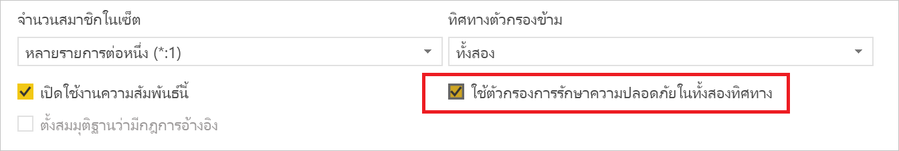
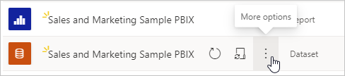
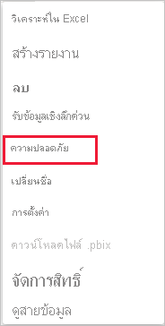
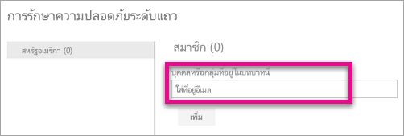
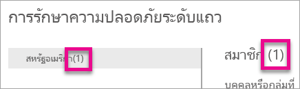
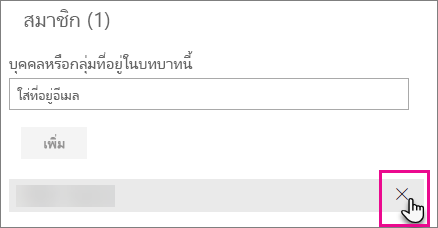
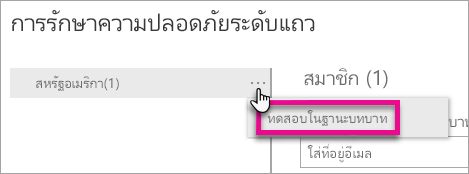
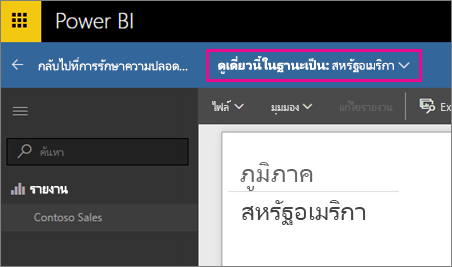
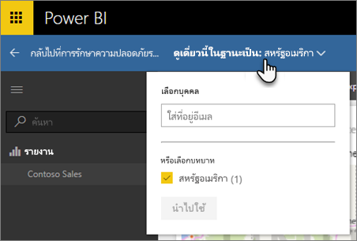
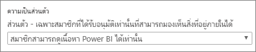

# Row-level security (RLS) กับ Power BI

Row-level security (RLS) ด้วย Power BI สามารถใช้เพื่อจำกัดการเข้าถึงข้อมูลสำหรับผู้ใช้ที่กำหนด ตัวกรองจำกัดการเข้าถึงข้อมูลในระดับแถว และคุณสามารถกำหนดตัวกรองภายในบทบาทได้ ใน Power BI service สมาชิกของพื้นที่ทำงานจะเข้าถึงชุดข้อมูลในพื้นที่ทำงานได้ RLS ไม่จำกัดการเข้าถึงข้อมูลนี้

คุณสามารถกำหนดค่า RLS สำหรับแบบจำลองข้อมูลที่นำเข้าไปยัง Power BI ด้วย Power BI Desktop และคุณยังสามารถกำหนดค่า RLS บนชุดข้อมูลที่กำลังใช้ DirectQuery เช่น SQL Server สำหรับการเชื่อมต่อสดของ Analysis Services หรือ Azure Analysis Services คุณกำหนดค่าการรักษาความปลอดภัยระดับแถวในแบบจำลอง ไม่ใช่ใน Power BI Desktop ตัวเลือกความปลอดภัยจะไม่แสดงสำหรับชุดข้อมูลแบบการเชื่อมต่อสด

[!INCLUDE [include-short-name](../includes/rls-desktop-define-roles.md)]

ตามค่าเริ่มต้น การกรองการรักษาความปลอดภัยระดับแถวจะใช้ตัวกรองทิศทางเดียว ไม่ว่าการตั้งค่าความสัมพันธ์จะเป็นแบบทิศทางเดียวหรือสองทิศทาง คุณสามารถเปิดใช้ตัวกรองไขว้แบบสองทิศทางด้วย row-level security ได้ด้วยตนเองโดยการเลือกความสัมพันธ์ และทำเครื่องหมายในกล่อง **ใช้ตัวกรองความปลอดภัยในทั้งสองทิศทาง** ทำเครื่องหมายที่ช่องนี้เมื่อคุณได้ใช้การรักษาความปลอดภัยระดับแถวแบบไดนามิกในระดับเซิร์ฟเวอร์แล้ว โดยที่การรักษาความปลอดภัยระดับแถวจะขึ้นอยู่กับชื่อผู้ใช้หรือรหัสการเข้าสู่ระบบ

สำหรับข้อมูลเพิ่มเติม ดูที่[ตัวกรองไขว้แบบสองทิศทางที่ใช้ DirectQuery ใน Power BI Desktop](../transform-model/desktop-bidirectional-filtering.md)และบทความเชิงเทคนิคของ[การรักษาความปลอดภัยแบบลำจองภาษา BI แบบตาราง](https://download.microsoft.com/download/D/2/0/D20E1C5F-72EA-4505-9F26-FEF9550EFD44/Securing%20the%20Tabular%20BI%20Semantic%20Model.docx)

[!INCLUDE [include-short-name](../includes/rls-desktop-view-as-roles.md)]

## จัดการความปลอดภัยบนแบบจำลองของคุณ

เมื่อต้องจัดการความปลอดภัยบนแบบจำลองข้อมูลของคุณ ให้ทำสิ่งต่อไปนี้:

1. ใน Power BI service ให้เลือกเมนู **ตัวเลือกเพิ่มเติม** สำหรับชุดข้อมูล เมนูนี้จะปรากฏเมื่อชี้ไปที่ชื่อชุดข้อมูล ไม่ว่าคุณจะเลือกจากเมนูนำทางหรือหน้าพื้นที่ทำงาน

    

    

1. เลือก **ความปลอดภัย**

   

ระบบการรักษาความปลอดภัยจะนำคุณไปยังหน้า RLS เพื่อให้คุณเพิ่มสมาชิกให้กับบทบาทที่คุณสร้างไว้ใน Power BI Desktop เฉพาะเจ้าของชุดข้อมูลเท่านั้นที่จะเห็นระบบความปลอดภัย ถ้าชุดข้อมูลอยู่ในกลุ่ม จะมีเพียงผู้ดูแลระบบ ของกลุ่มเท่านั้นที่จะเห็นตัวเลือกความปลอดภัย

คุณสามารถสร้างหรือแก้ไขบทบาทภายใน Power BI Desktop

## ทำงานกับสมาชิก

### เพิ่มสมาชิก

เพิ่มสมาชิกให้กับบทบาทโดยการพิมพ์ลงในที่อยู่อีเมล์หรือชื่อของผู้ใช้ หรือพิมพ์ลงในกลุ่มความปลอดภัย คุณไม่สามารถเพิ่มกลุ่มที่สร้างขึ้นภายใน Power BI คุณสามารถเพิ่มสมาชิก[ภายนอกองค์กรของคุณ](../guidance/whitepaper-azure-b2b-power-bi.md#data-security-for-external-partners)ได้

คุณยังสามารถดูจำนวนสมาชิกที่เป็นส่วนหนึ่งของบทบาทจากเป็นตัวเลขในวงเล็บที่อยู่ถัดจากชื่อบทบาท หรือถัดจากสมาชิก

### ลบสมาชิก

คุณสามารถลบสมาชิกได้โดยการเลือก X ที่อยู่ถัดจากชื่อของพวกเขา 

## การตรวจสอบบทบาทภายใน บริการ Power BI

คุณสามารถตรวจสอบว่าบทบาทที่คุณกำหนดทำงานถูกต้องหรือไม่ได้โดยการทดสอบบทบาท

1. เลือก **ตัวเลือกเพิ่มเติม** (...) ที่อยู่ถัดจากบทบาท
2. เลือก **ทดสอบข้อมูลแบบเป็นบทบาท**

คุณจะเห็นรายงานที่พร้อมใช้งานสำหรับบทบาทนี้ แดชบออร์ดจะไม่แสดงในมุมมองนี้ ในส่วนหัวเรื่องของหน้า มีการแสดงบทบาทที่ใช้อยู่

ทดสอบบทบาทหรือการรวมบทบาทอื่น ๆ ได้โดยการเลือก **ตอนนี้ดูในฐานะ**

คุณสามารถเลือกเพื่อดูข้อมูลเป็นรายบุคคลหรือคุณสามารถเลือกการรวมบทบาทที่พร้อมใช้งานเพื่อตรวจสอบว่ากำลังทำงานอยู่หรือไม่

เมื่อต้องการกลับไปยังมุมมองปกติ เลือก **กลับไปยัง Row-Level Security**

[!INCLUDE [include-short-name](../includes/rls-usernames.md)]

## ใช้ RLS กับพื้นที่ทำงานใน Power BI

หากคุณเผยแพร่รายงาน Power BI Desktop ของคุณไปยังพื้นที่ทำงานภายใน Power BI service บทบาทดังกล่าวจะถูกนำไปใช้กับสมาชิกแบบอ่านอย่างเดียว คุณจะต้องระบุว่าเฉพาะสมาชิกเท่านั้นที่สามารถดูเนื้อหา Power BI ภายในการตั้งค่าพื้นที่ทำงาน

> [!WARNING]
> ถ้าคุณกำหนดค่าพื้นที่ทำงานเพื่อให้สมาชิกมีสิทธิ์ในการแก้ไข บทบาท RLS จะไม่ถูกนำไปใช้กับพื้นที่ทำงานนั้นได้ ผู้ใช้สามารถมองเห็นข้อมูลทั้งหมด

[!INCLUDE [include-short-name](../includes/rls-limitations.md)]

[!INCLUDE [include-short-name](../includes/rls-faq.md)]

## ขั้นตอนถัดไป

- [จำกัดการเข้าถึงข้อมูลด้วยการรักษาความปลอดภัยระดับแถว (RLS) สำหรับ Power BI Desktop](../create-reports/desktop-rls.md)
- [คำแนะนำการรักษาความปลอดภัยระดับแถว (RLS) ใน Power BI Desktop](../guidance/rls-guidance.md)
- มีคำถามหรือไม่ [ลองถามชุมชน Power BI](https://community.powerbi.com/)
- มีข้อเสนอแนะไหม [สนับสนุนแนวคิดในการปรับปรุง Power BI](https://ideas.powerbi.com/)
