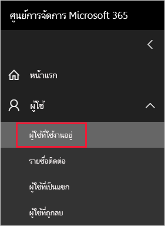
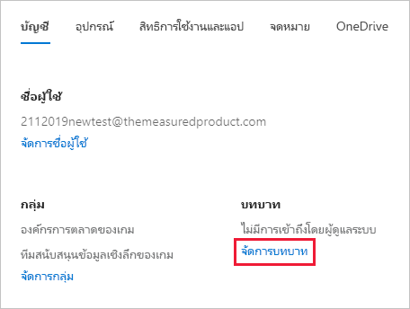
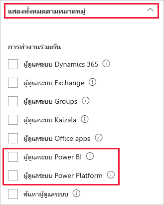

# <a name="understanding-power-bi-administrator-roles"></a><span data-ttu-id="8ccc5-103">การทำความเข้าใจบทบาทผู้ดูแลระบบของ Power BI</span><span class="sxs-lookup"><span data-stu-id="8ccc5-103">Understanding Power BI administrator roles</span></span>

<span data-ttu-id="8ccc5-104">เพื่อดูแลระบบ Power BI สำหรับองค์กรของคุณ คุณต้องมีบทบาทใดบทบาทหนึ่งต่อไปนี้: ผู้ดูแลระบบ Power BI ผู้ดูแลระบบ Power Platform หรือผู้ดูแลระบบส่วนกลาง Microsoft 365 ผู้ดูแลระบบการจัดการผู้ใช้ Microsoft 365 กำหนดผู้ใช้ไปยังบทบาทผู้ดูแลระบบ Power BI หรือผู้ดูแลระบบ Power Platform ในศูนย์การจัดการ Microsoft 365 หรือโดยใช้สคริปต์ PowerShell</span><span class="sxs-lookup"><span data-stu-id="8ccc5-104">To administer Power BI for your organization, you must be in one of the following roles: Power BI admin, Power Platform admin, or Microsoft 365 global admin. Microsoft 365 user management administrators assign users to the Power BI admin or Power Platform admin roles in the Microsoft 365 admin center, or by using a PowerShell script.</span></span> <span data-ttu-id="8ccc5-105">สำหรับข้อมูลเพิ่มเติม โปรดดู [การกำหนดบทบาทให้กับบัญชีผู้ใช้ด้วย PowerShell](/office365/enterprise/powershell/assign-roles-to-user-accounts-with-office-365-powershell)</span><span class="sxs-lookup"><span data-stu-id="8ccc5-105">For more information, see [Assign roles to user accounts with PowerShell](/office365/enterprise/powershell/assign-roles-to-user-accounts-with-office-365-powershell).</span></span>

<span data-ttu-id="8ccc5-106">ผู้ใช้ในบทบาทผู้ดูแลระบบ Power BI และผู้ดูแลระบบ Power Platform สามารถควบคุมการตั้งค่า Power BI ของทั้งองค์กรและคุณลักษณะการดูแลระบบได้อย่างเต็มที่ ยกเว้นการให้สิทธิ์การใช้งาน</span><span class="sxs-lookup"><span data-stu-id="8ccc5-106">Users in Power BI admin and Power Platform admin roles have full control over org-wide Power BI settings and administrative features, except for licensing.</span></span> <span data-ttu-id="8ccc5-107">เมื่อผู้ใช้ได้รับมอบหมายบทบาทผู้ดูแลระบบ ผู้ใช้จะสามารถเข้าถึง [พอร์ทัลผู้ดูแลระบบ Power BI](service-admin-portal.md) ได้</span><span class="sxs-lookup"><span data-stu-id="8ccc5-107">Once a user is assigned the admin role, they can access the [Power BI admin portal](service-admin-portal.md).</span></span> <span data-ttu-id="8ccc5-108">ในส่วนนั้น ผู้ใช้จะสามารถเข้าถึงการวัดปริมาณการใช้งานของทั้งองค์กร และสามารถควบคุมการใช้งานคุณลักษณะ Power BI ของทั้งองค์กรได้อีกด้วย</span><span class="sxs-lookup"><span data-stu-id="8ccc5-108">There, they have access to org-wide usage metrics, and can control org-wide usage of Power BI features.</span></span> <span data-ttu-id="8ccc5-109">บทบาทผู้ดูแลระบบเหล่านี้เหมาะสำหรับผู้ใช้ที่จำเป็นต้องเข้าถึงพอร์ทัลผู้ดูแลระบบ Power BI โดยไม่ต้องให้สิทธิ์เข้าถึงการดูแลระบบเต็มรูปแบบของ Microsoft 365 แก่ผู้ใช้เหล่านั้น</span><span class="sxs-lookup"><span data-stu-id="8ccc5-109">These admin roles are ideal for users who need access to the Power BI admin portal without also granting those users full Microsoft 365 administrative access.</span></span>

> [!NOTE]
> <span data-ttu-id="8ccc5-110">ในเอกสารประกอบของ Power BI "ผู้ดูแลระบบ Power BI" หมายถึงผู้ใช้ในบทบาทผู้ดูแลระบบ Power BI หรือ Power Platform อย่างใดอย่างหนึ่ง</span><span class="sxs-lookup"><span data-stu-id="8ccc5-110">In Power BI documentation, "Power BI admin" refers to users in either the Power BI admin or Power Platform admin roles.</span></span> <span data-ttu-id="8ccc5-111">เอกสารประกอบจะทำให้ชัดเจนขึ้นเมื่อจำเป็นต้องมีบทบาทผู้ดูแลระบบส่วนกลางของ Microsoft 365 สำหรับงาน</span><span class="sxs-lookup"><span data-stu-id="8ccc5-111">The documentation makes it clear when the Microsoft 365 global admin role is required for a task.</span></span>

## <a name="limitations-and-considerations"></a><span data-ttu-id="8ccc5-112">ข้อจำกัดและข้อควรพิจารณา</span><span class="sxs-lookup"><span data-stu-id="8ccc5-112">Limitations and considerations</span></span>

<span data-ttu-id="8ccc5-113">บทบาทผู้ดูแลระบบ Power BI และผู้ดูแลระบบ Power Platform ไม่มีความสามารถดังต่อไปนี้:</span><span class="sxs-lookup"><span data-stu-id="8ccc5-113">The Power BI admin and Power Platform admin roles don't provide the following capabilities:</span></span>

* <span data-ttu-id="8ccc5-114">ความสามารถในการแก้ไขผู้ใช้และสิทธิการใช้งานภายในศูนย์การจัดการ Microsoft 365</span><span class="sxs-lookup"><span data-stu-id="8ccc5-114">Ability to modify users and licenses within the Microsoft 365 admin center.</span></span>

* <span data-ttu-id="8ccc5-115">การเข้าถึงบันทึกการตรวจสอบ</span><span class="sxs-lookup"><span data-stu-id="8ccc5-115">Access to the audit logs.</span></span> <span data-ttu-id="8ccc5-116">สำหรับข้อมูลเพิ่มเติมดู [ติดตามกิจกรรมของผู้ใช้ใน Power BI](service-admin-auditing.md)</span><span class="sxs-lookup"><span data-stu-id="8ccc5-116">For more information, see [Track user activities in Power BI](service-admin-auditing.md).</span></span>

<span data-ttu-id="8ccc5-117">ความสามารถเหล่านี้จำเป็นต้องมีการมอบหมายบทบาทผู้ดูแลระบบ Microsoft 365</span><span class="sxs-lookup"><span data-stu-id="8ccc5-117">These capabilities require Microsoft 365 admin role assignments.</span></span>

## <a name="assign-users-to-an-admin-role-in-the-microsoft-365-admin-center"></a><span data-ttu-id="8ccc5-118">กำหนดผู้ใช้ให้กับบทบาทผู้ดูแลระบบในศูนย์การจัดการ Microsoft 365</span><span class="sxs-lookup"><span data-stu-id="8ccc5-118">Assign users to an admin role in the Microsoft 365 admin center</span></span>

<span data-ttu-id="8ccc5-119">หากต้องการกำหนดผู้ใช้ลงในบทบาทผู้ดูแลระบบในศูนย์การจัดการ Microsoft 365 ให้ปฏิบัติตามขั้นตอนเหล่านี้</span><span class="sxs-lookup"><span data-stu-id="8ccc5-119">To assign users to an admin role in the Microsoft 365 admin center, follow these steps.</span></span>

1. <span data-ttu-id="8ccc5-120">ใน [ศูนย์การจัดการ Microsoft 365](https://portal.office.com/adminportal/home#/homepage)**ให้เลือก** >  **ผู้ใช้ผู้ใช้ที่ใช้งานอยู่**</span><span class="sxs-lookup"><span data-stu-id="8ccc5-120">In the [Microsoft 365 admin center](https://portal.office.com/adminportal/home#/homepage), select **Users** > **Active Users**.</span></span>

    

1. <span data-ttu-id="8ccc5-122">เลือกผู้ใช้ที่คุณต้องการกำหนดบทบาทให้</span><span class="sxs-lookup"><span data-stu-id="8ccc5-122">Select the user that you want to assign the role to.</span></span>

1. <span data-ttu-id="8ccc5-123">ภายใต้ **บทบาท** ให้เลือก **จัดการบทบาท**</span><span class="sxs-lookup"><span data-stu-id="8ccc5-123">Under **Roles**, select **Manage roles**.</span></span>

    

1. <span data-ttu-id="8ccc5-125">ขยาย **แสดงทั้งหมดตามประเภท** จากนั้นเลือก **ผู้ดูแลระบบ Power BI** หรือ **ผู้ดูแลระบบ Power Platform**</span><span class="sxs-lookup"><span data-stu-id="8ccc5-125">Expand **Show all by category**, then select **Power BI admin** or **Power Platform admin**.</span></span>

    

1. <span data-ttu-id="8ccc5-127">เลือก **บันทึกการเปลี่ยนแปลง**</span><span class="sxs-lookup"><span data-stu-id="8ccc5-127">Select **Save changes**.</span></span>

## <a name="assign-users-to-the-admin-role-with-powershell"></a><span data-ttu-id="8ccc5-128">กำหนดบทบาทผู้ดูแลระบบแก่ผู้ใช้ด้วย PowerShell</span><span class="sxs-lookup"><span data-stu-id="8ccc5-128">Assign users to the admin role with PowerShell</span></span>

<span data-ttu-id="8ccc5-129">นอกจากนี้คุณยังสามารถกำหนดบทบาทแก่ผู้ใช้โดยใช้ PowerShell ได้เช่นกัน</span><span class="sxs-lookup"><span data-stu-id="8ccc5-129">You can also assign users to roles by using PowerShell.</span></span> <span data-ttu-id="8ccc5-130">จัดการผู้ใช้ใน Azure Active Directory (Azure AD)</span><span class="sxs-lookup"><span data-stu-id="8ccc5-130">Users are managed in Azure Active Directory (Azure AD).</span></span> <span data-ttu-id="8ccc5-131">หากคุณยังไม่มีโมดูล Azure AD PowerShell ให้ [ดาวน์โหลด และติดตั้งเวอร์ชันล่าสุด](https://www.powershellgallery.com/packages/AzureAD/)</span><span class="sxs-lookup"><span data-stu-id="8ccc5-131">If you don't already have the Azure AD PowerShell module, [download and install the latest version](https://www.powershellgallery.com/packages/AzureAD/).</span></span>

1. <span data-ttu-id="8ccc5-132">เชื่อมต่อกับ Azure AD:</span><span class="sxs-lookup"><span data-stu-id="8ccc5-132">Connect to Azure AD:</span></span>
   ```
   PS C:\Windows\system32> Connect-AzureAD
   ```

1. <span data-ttu-id="8ccc5-133">รับ **ObjectId** สำหรับบทบาท **ผู้ดูแลระบบ Power BI**</span><span class="sxs-lookup"><span data-stu-id="8ccc5-133">Get the **ObjectId** for the **Power BI admin** role.</span></span> <span data-ttu-id="8ccc5-134">คุณสามารถเรียกใช้ [Get-AzureADDirectoryRole](/powershell/module/azuread/get-azureaddirectoryrole) เพื่อรับ **ObjectId**</span><span class="sxs-lookup"><span data-stu-id="8ccc5-134">You can run [Get-AzureADDirectoryRole](/powershell/module/azuread/get-azureaddirectoryrole) to get the **ObjectId**</span></span>

    ```
    PS C:\Windows\system32> Get-AzureADDirectoryRole

    ObjectId                             DisplayName                        Description
    --------                             -----------                        -----------
    00f79122-c45d-436d-8d4a-2c0c6ca246bf Power BI Service Administrator     Full access in the Power BI Service.
    250d1222-4bc0-4b4b-8466-5d5765d14af9 Helpdesk Administrator             Helpdesk Administrator has access to perform..
    3ddec257-efdc-423d-9d24-b7cf29e0c86b Directory Synchronization Accounts Directory Synchronization Accounts
    50daa576-896c-4bf3-a84e-1d9d1875c7a7 Company Administrator              Company Administrator role has full access t..
    6a452384-6eb9-4793-8782-f4e7313b4dfd Device Administrators              Device Administrators
    9900b7db-35d9-4e56-a8e3-c5026cac3a11 AdHoc License Administrator        Allows access manage AdHoc license.
    a3631cce-16ce-47a3-bbe1-79b9774a0570 Directory Readers                  Allows access to various read only tasks in ..
    f727e2f3-0829-41a7-8c5c-5af83c37f57b Email Verified User Creator        Allows creation of new email verified users.
    ```

    <span data-ttu-id="8ccc5-135">ในกรณีนี้ **ObjectId** ของบทบาทคือ 00f79122-c45d-436d-8d4a-2c0c6ca246bf</span><span class="sxs-lookup"><span data-stu-id="8ccc5-135">In this case, the role's **ObjectId** is 00f79122-c45d-436d-8d4a-2c0c6ca246bf.</span></span>

1. <span data-ttu-id="8ccc5-136">ถัดไป รับ **ObjectId** ของผู้ใช้</span><span class="sxs-lookup"><span data-stu-id="8ccc5-136">Next, get the user's **ObjectId**.</span></span> <span data-ttu-id="8ccc5-137">คุณสามารถหาได้ด้วย [Get-AzureADUser](/powershell/module/azuread/get-azureaduser)</span><span class="sxs-lookup"><span data-stu-id="8ccc5-137">You can find that by running [Get-AzureADUser](/powershell/module/azuread/get-azureaduser).</span></span>

    ```
    PS C:\Windows\system32> Get-AzureADUser -ObjectId 'tim@contoso.com'

    ObjectId                             DisplayName UserPrincipalName      UserType
    --------                             ----------- -----------------      --------
    6a2bfca2-98ba-413a-be61-6e4bbb8b8a4c Tim         tim@contoso.com        Member
    ```

1. <span data-ttu-id="8ccc5-138">เพื่อเพิ่มสมาชิกลงในบทบาท เรียกใช้ [AzureADDirectoryRoleMember](/powershell/module/azuread/add-azureaddirectoryrolemember)</span><span class="sxs-lookup"><span data-stu-id="8ccc5-138">To add the member to the role, run [Add-AzureADDirectoryRoleMember](/powershell/module/azuread/add-azureaddirectoryrolemember).</span></span>

    | <span data-ttu-id="8ccc5-139">พารามิเตอร์</span><span class="sxs-lookup"><span data-stu-id="8ccc5-139">Parameter</span></span> | <span data-ttu-id="8ccc5-140">คำอธิบาย</span><span class="sxs-lookup"><span data-stu-id="8ccc5-140">Description</span></span> |
    | --- | --- |
    | <span data-ttu-id="8ccc5-141">ObjectId</span><span class="sxs-lookup"><span data-stu-id="8ccc5-141">ObjectId</span></span> |<span data-ttu-id="8ccc5-142">ObjectId ของบทบาท</span><span class="sxs-lookup"><span data-stu-id="8ccc5-142">The Role ObjectId.</span></span> |
    | <span data-ttu-id="8ccc5-143">RefObjectId</span><span class="sxs-lookup"><span data-stu-id="8ccc5-143">RefObjectId</span></span> |<span data-ttu-id="8ccc5-144">ObjectId ของสมาชิก</span><span class="sxs-lookup"><span data-stu-id="8ccc5-144">The members ObjectId.</span></span> |

    ```powershell
    Add-AzureADDirectoryRoleMember -ObjectId 00f79122-c45d-436d-8d4a-2c0c6ca246bf -RefObjectId 6a2bfca2-98ba-413a-be61-6e4bbb8b8a4c
    ```
<span data-ttu-id="8ccc5-145">หากต้องการเรียนรู้เพิ่มเติมเกี่ยวกับ PowerShell เพื่อมอบหมายบทบาทผู้ดูแลระบบ ให้ดูที่ [AzureAD Directory Roles](/powershell/module/azuread/#directory-roles)</span><span class="sxs-lookup"><span data-stu-id="8ccc5-145">To learn more about using PowerShell to assign admin roles, see [AzureAD Directory Roles](/powershell/module/azuread/#directory-roles).</span></span>

## <a name="next-steps"></a><span data-ttu-id="8ccc5-146">ขั้นตอนถัดไป</span><span class="sxs-lookup"><span data-stu-id="8ccc5-146">Next steps</span></span>

[<span data-ttu-id="8ccc5-147">จัดการPower BI ในองค์กรของคุณ</span><span class="sxs-lookup"><span data-stu-id="8ccc5-147">Administering Power BI in your organization</span></span>](service-admin-administering-power-bi-in-your-organization.md)  
[<span data-ttu-id="8ccc5-148">พอร์ทัลผู้ดูแล Power BI</span><span class="sxs-lookup"><span data-stu-id="8ccc5-148">Power BI admin portal</span></span>](service-admin-portal.md)  

<span data-ttu-id="8ccc5-149">มีคำถามเพิ่มเติมหรือไม่</span><span class="sxs-lookup"><span data-stu-id="8ccc5-149">More questions?</span></span> [<span data-ttu-id="8ccc5-150">ลองถามชุมชน Power BI</span><span class="sxs-lookup"><span data-stu-id="8ccc5-150">Try asking the Power BI Community</span></span>](https://community.powerbi.com/)
