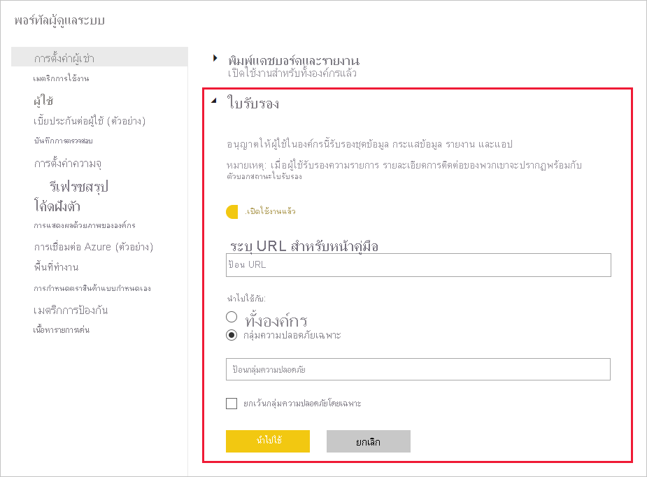

# เปิดใช้งานใบรับรองเนื้อหาEnable content certification

องค์กรของคุณสามารถรับรองเนื้อหาที่เลือก เพื่อระบุว่าเนื้อหาดังกล่าวเป็นแหล่งข้อมูลที่เชื่อถือได้สำหรับข้อมูลสำคัญหรือไม่Your organization can certify selected content to identify it an as authoritative source for critical information. ในขณะนี้ ชนิดเนื้อหาต่อไปนี้สามารถได้รับการรับรอง:Currently, the following content types can be certified:
* ชุดข้อมูลDatasets
* กระแสข้อมูล (ตัวอย่าง)Dataflows (preview)
* รายงาน (ตัวอย่าง)Reports (preview)
* แอป (ตัวอย่าง)Apps (preview)

ในฐานะผู้ดูแลระบบของ Power BI คุณมีหน้าที่รับผิดชอบสำหรับการเปิดใช้งานและตั้งค่ากระบวนการรับรองสำหรับองค์กรของคุณAs a Power BI admin, you are responsible for enabling and setting up the certification process for your organization. ซึ่งหมายถึง:This means:
* การเปิดใช้งานการรับรองบนผู้เช่าของคุณEnabling certification on your tenant.
* การกำหนดรายการของกลุ่มความปลอดภัยที่สมาชิกจะได้รับอนุญาตให้รับรองเนื้อหาDefining a list of security groups whose members will be authorized to certify content.
* การกำหนดให้ URL ที่ชี้ไปยังคู่มือสำหรับกระบวนการรับรองเนื้อหาขององค์กร ถ้ามีเอกสารดังกล่าวอยู่Providing a URL that points to the documentation for the organization's content certification process, if such documentation exists.

การรับรองเป็นส่วนหนึ่งของคุณลักษณะ *การรับรอง* ของ Power BICertification is part of Power BI's *endorsement* feature. ดูที่ [การรับรอง: การเลื่อนระดับและการรับรองเนื้อหา Power BI](../collaborate-share/service-endorsement-overview.md) สำหรับข้อมูลเพิ่มเติมSee [Endorsement: Promoting and certifying Power BI content](../collaborate-share/service-endorsement-overview.md) for more information.

## ตั้งค่าการรับรองSet up certification

1. ในพอร์ทัลผู้ดูแลระบบ ไปที่การตั้งค่าผู้เช่าIn the Admin portal, go to Tenant settings.
1. ภายใต้ส่วนการตั้งค่าการส่งออกและการแชร์ ขยายส่วนการรับรองUnder the Export and sharing settings section, expand the Certification section.

   

1. ตั้งค่าการสลับเป็น **เปิดใช้งานแล้ว**Set the toggle to **Enabled**.
1. หากองค์กรของคุณมีนโยบายเกี่ยวกับใบรับรองที่เผยแพร่แล้ว คุณจะสามารถใส่ URL ได้ที่นี่If your organization has a published certification policy, provide its URL here. การดำเนินการนี้จะกลายเป็นลิงก์ **เรียนรู้เพิ่มเติม** ในส่วนใบรับรองของ [กล่องโต้ตอบการตั้งค่าการรับรอง](../collaborate-share/service-endorse-content.md#request-content-certification)This will become the **Learn more** link in the certification section of the [endorsement settings dialog](../collaborate-share/service-endorse-content.md#request-content-certification). ถ้าคุณไม่ใส่ลิงก์ ผู้ใช้ที่ต้องการร้องขอใบรับรองเนื้อหาของพวกเขาจะได้รับคำแนะนำให้ติดต่อผู้ดูแลระบบ Power BI ของพวกเขาIf you do not supply a link, users who want to request certification of their content will be advised to contact their Power BI administrator.
1. กำหนดกลุ่มความปลอดภัยที่สมาชิกจะได้รับอนุญาตให้รับรองเนื้อหาอย่างน้อยหนึ่งกลุ่มSpecify one or more security groups whose members will be authorized to certify content. ผู้รับรองที่ได้รับอนุญาตอย่างเป็นทางการเหล่านี้ จะสามารถใช้ปุ่ม ใบรับรอง ในส่วนใบรับรองของ [กล่องโต้ตอบการตั้งค่าการรับรอง](../collaborate-share/service-endorse-content.md#certify-content)These authorized certifiers will able to use the Certification button in the certification section of the [endorsement settings dialog](../collaborate-share/service-endorse-content.md#certify-content). เขตข้อมูลนี้ยอมรับเฉพาะกลุ่มความปลอดภัยเท่านั้นThis field accepts security groups only. คุณไม่สามารถป้อนผู้ใช้ที่มีชื่อYou cannot enter named users.
    
    ถ้ากลุ่มความปลอดภัยมีกลุ่มความปลอดภัยย่อยที่คุณไม่ต้องการให้สิทธิใบรับรอง คุณสามารถทำเครื่องหมายที่กล่อง **ยกเว้นกลุ่มความปลอดภัยเฉพาะ** และใส่ชื่อของกลุ่มเหล่านั้นในกล่องข้อความที่จะปรากฏขึ้นIf a security group contains sub-security groups that you do not want to give certification rights to, you can check the **Except specific security groups** box and enter the name(s) of those group(s) in a text box that will appear.
1. คลิก **ใช้**Click **Apply**.

## ขั้นตอนถัดไปNext steps
* [เลื่อนระดับหรือรับรองเนื้อหาPromote or certify content](../collaborate-share/service-endorse-content.md)
* [อ่านเกี่ยวกับการรับรองใน Power BIRead about endorsement in Power BI](../collaborate-share/service-endorsement-overview.md)
* มีคำถามหรือไม่?Questions? [ลองถามชุมชน Power BITry asking the Power BI Community](https://community.powerbi.com/)
