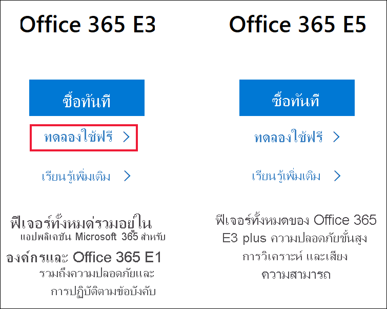
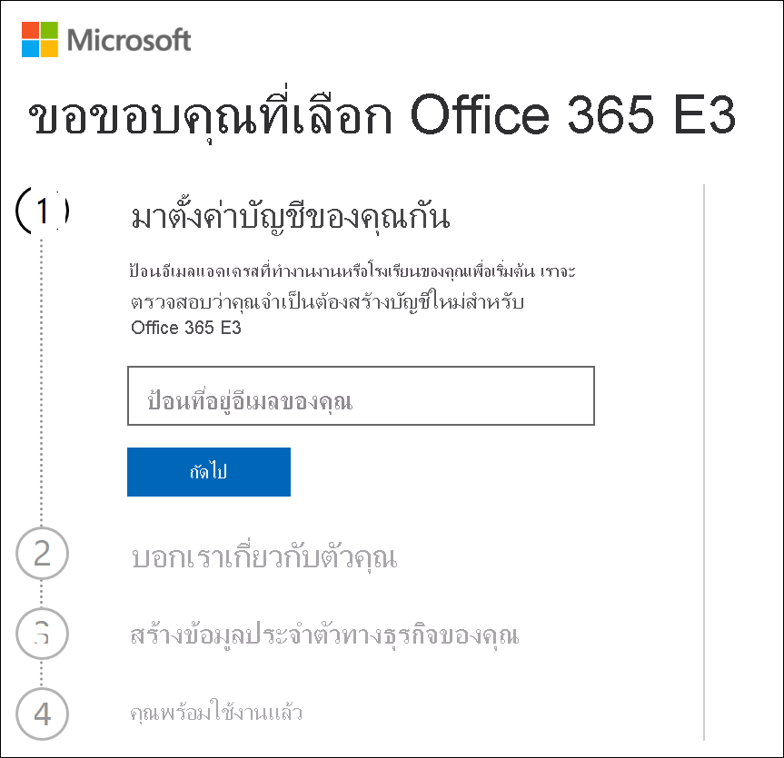
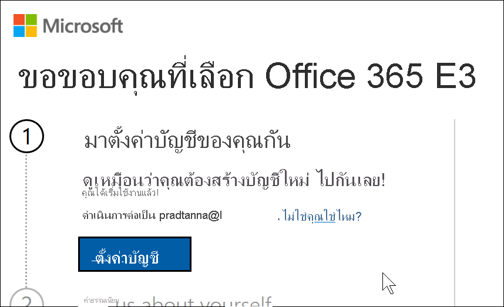
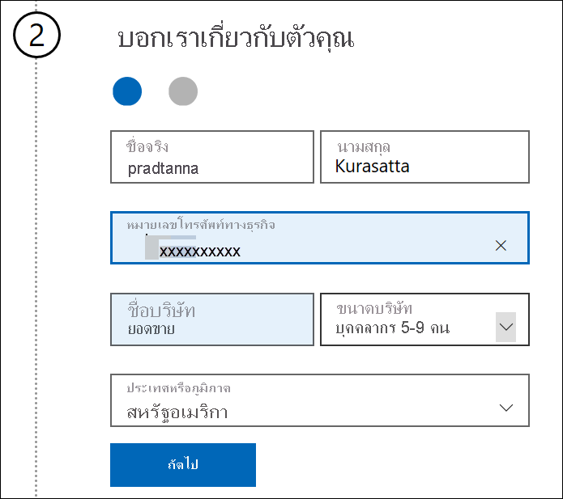
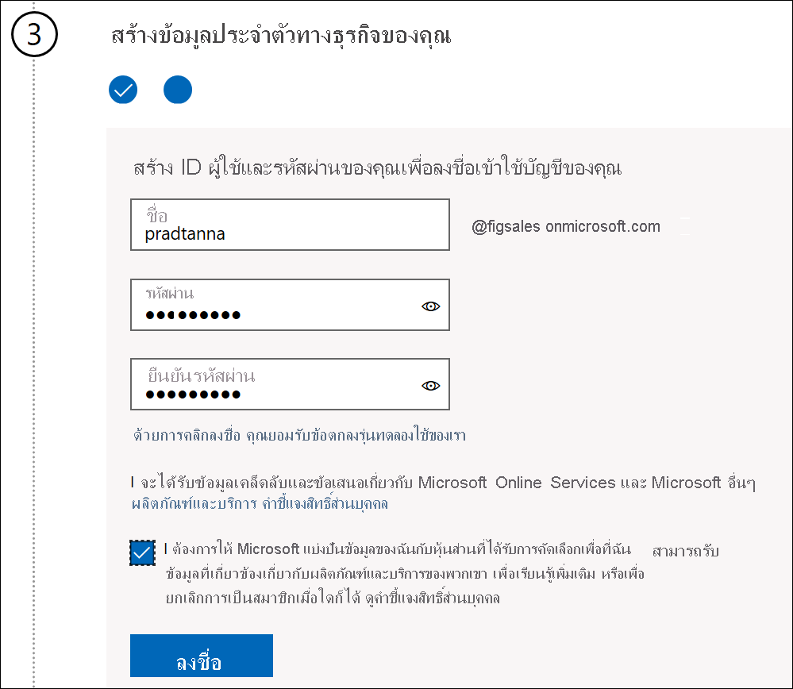
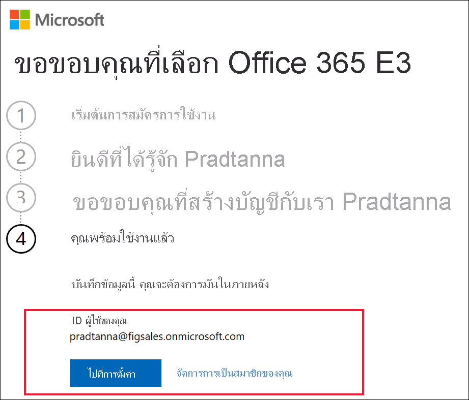

# ลงทะเบียนสำหรับ Power BI ด้วย Microsoft 365 รุ่นทดลองใช้ฟรี ตัวใหม่Signing up for Power BI with a new Microsoft 365 Trial

บทความนี้อธิบายวิธีทางเลือกในการลงทะเบียนสำหรับบริการ Power BI ถ้าคุณยังไม่มีบัญชีผู้ใช้อีเมลที่ทำงานหรือโรงเรียนThis article describes an alternative way to sign up for the Power BI service, if you don't already have a work or school email account.

หากคุณกำลังมีปัญหาในการลงทะเบียนใช้งาน Power BI ด้วยที่อยู่อีเมลของคุณ ก่อนอื่นให้ตรวจสอบให้แน่ใจว่าเป็น [ที่อยู่อีเมลที่สามารถใช้ได้กับ Power BI](../fundamentals/service-self-service-signup-for-power-bi.md#supported-email-addresses)If you're having problems signing up for Power BI with your email address, first make sure it's an [email address that can be used with Power BI](../fundamentals/service-self-service-signup-for-power-bi.md#supported-email-addresses). ถ้าไม่สำเร็จ ให้ลงทะเบียนสำหรับ Microsoft 365 รุ่นทดลองใช้ฟรีและสร้างบัญชีที่ทำงานIf that's not successful, sign up for a Microsoft 365 trial and create a work account. จากนั้น ใช้บัญชีที่ทำงานใหม่เพื่อลงทะเบียนสำหรับบริการของ Power BIThen, use that new work account to sign up for the Power BI service. คุณจะสามารถใช้ Power BI ได้แม้ว่า Microsoft 365 รุ่นทดลองใช้ฟรีจะหมดอายุYou'll be able to use Power BI even after the Microsoft 365 trial expires.

## ลงทะเบียนสำหรับรุ่นทดลองใช้ Office ของ Microsoft 365Sign up for a Microsoft 365 trial of Office

ลงทะเบียนสำหรับ Microsoft 365 รุ่นทดลองใช้ฟรี[บนเว็บไซต์ Microsoft 365](https://www.microsoft.com/microsoft-365/business/compare-more-office-365-for-business-plans)Sign up for a Microsoft 365 trial [on the Microsoft 365 web site](https://www.microsoft.com/microsoft-365/business/compare-more-office-365-for-business-plans). ถ้าคุณยังไม่มีบัญชี Microsoft จะแนะนำให้คุณทำตามขั้นตอนในการสร้างบัญชีIf you don't already have an account, Microsoft will walk you through the steps to create one. เนื่องจากบัญชีอีเมลการค้าเชิงพาณิชย์ (เช่น Hotmail และ Gmail) จะไม่สามารถใช้งานได้กับ Microsoft 365 คุณจะต้องสร้างบัญชีใหม่ที่จะSince commercial email accounts (such as Hotmail and Gmail) won't work with Microsoft 365, you'll create a new account that will.  บัญชีอีเมลนั้นจะมีลักษณะบางอย่างเหมือนกับ *zalan\@onmicrosoft.com*That email account will look something like *zalan\@onmicrosoft.com*.

ถ้าคุณเลือก **Office 365 E5** รุ่นทดลองใช้ของคุณจะรวม Power BI ProIf you select **Office 365 E5**, your trial will include Power BI Pro. รุ่นทดลองใช้ของ Power BI Pro จะหมดอายุในเวลาเดียวกันกับ Office 365 E5 ซึ่งอยู่ในช่วง 30 วันในขณะนี้The Power BI Pro trial will expire at the same time as your Office 365 E5 trial, which is currently 30 days. ถ้าแต่คุณเลือก **Office 365 E3** คุณจะสามารถลงทะเบียนสำหรับ Power BI เป็นผู้ใช้ *ฟรี* และอัปเกรดเป็น **Pro** สำหรับรุ่นทดลองใช้ 60 วันIf, instead, you select **Office 365 E3**, you'll be able to sign up for Power BI as a *free* user and upgrade to **Pro** for a 60-day trial. 

1. ป้อนที่อยู่อีเมลของคุณEnter your email address. Microsoft จะแจ้งให้คุณทราบหากที่อยู่อีเมลนั้นสามารถใช้งานได้กับ Microsoft 365 หรือหากคุณจำเป็นต้องสร้างที่อยู่อีเมลใหม่Microsoft will let you know if that email address will work with Microsoft 365 or if you'll need to create a new email address.  

    หากคุณต้องการที่อยู่อีเมลใหม่ Microsoft จะแนะนำคุณตามขั้นตอนIf you need a new email address, Microsoft will walk you through the steps. ขั้นตอนแรกในการสร้างบัญชีใหม่First step, creating a new account. เลือก **ตั้งค่าบัญชี**Select **Set up account**.

    

2. ป้อนรายละเอียดเกี่ยวกับบัญชีใหม่Enter details about the new account.

    

3. สร้างที่อยู่อีเมลและรหัสผ่านใหม่ของคุณCreate your new email address and password. สร้างชื่อการลงชื่อเข้าใช้ใหม่ของคุณที่มีลักษณะเหมือน you@yourcompany.onmicrosoft.comCreate a new sign-in name that looks like you@yourcompany.onmicrosoft.com. นี่คือการลงชื่อเข้าใช้ด้วยบัญชีที่ทำงานหรือโรงเรียนใหม่ของคุณและกับ Power BIThis is the sign-in you'll use with your new work or school account and with Power BI.

    

4. แค่นั้นเอง!That's it!  ขณะนี้คุณมีที่อยู่อีเมลที่คุณสามารถใช้ในการลงทะเบียนสำหรับ Power BI ได้You now have an email address that you can use to sign up for Power BI. มุ่งหน้าไป [ลงทะเบียนสำหรับบริการของ Power BI เป็นรายบุคคล](../fundamentals/service-self-service-signup-for-power-bi.md)Head on over to [Sign up for the Power BI service as an individual](../fundamentals/service-self-service-signup-for-power-bi.md)

     

    คุณอาจต้องรอในขณะที่สร้างผู้เช่าใหม่ของคุณขึ้นYou may have to wait while your new tenant gets created.

## ข้อควรพิจารณาที่สำคัญImportant considerations

หากคุณมีปัญหาในการลงชื่อเข้าใช้ด้วยบัญชีใหม่ ให้ลองใช้เซสชันเบราว์เซอร์ส่วนตัวIf you have any issues signing in with the new account, try using a private browser session.

หากใช้วิธีการลงทะเบียนวิธีนี้ คุณกำลังสร้างผู้เช่าองค์กรใหม่ และคุณจะกลายเป็นผู้ดูแลผู้เช่าBy using this signup method, you are creating a new organizational tenant and you'll become the administrator of the tenant. สามารถดูข้อมูลเพิ่มเติมได้ที่ [ผู้ดูแล Power BI คืออะไร](service-admin-administering-power-bi-in-your-organization.md)For more information, see [What is Power BI administration?](service-admin-administering-power-bi-in-your-organization.md). คุณสามารถเพิ่มผู้ใช้ใหม่ลงในผู้เช่าของคุณ แล้วแชร์ให้กับพวกเขา ดังที่อธิบายไว้ใน [เอกสารผู้ดูแลระบบ Microsoft 365](https://support.office.com/article/Add-users-individually-to-Office-365---Admin-Help-1970f7d6-03b5-442f-b385-5880b9c256ec)You can add new users to your tenant, then share with them, as described in the [Microsoft 365 admin documentation](https://support.office.com/article/Add-users-individually-to-Office-365---Admin-Help-1970f7d6-03b5-442f-b385-5880b9c256ec).

## ขั้นตอนถัดไปNext steps

[การดูแลระบบ Power BI คืออะไร?What is Power BI administration?](service-admin-administering-power-bi-in-your-organization.md)  
[สิทธิ์การใช้งาน Power BI สำหรับองค์กรของคุณPower BI licensing in your organization](service-admin-licensing-organization.md)  
[ลงทะเบียนใช้งาน Power BI เป็นรายบุคคลSigning up for Power BI as an individual](../fundamentals/service-self-service-signup-for-power-bi.md)

มีคำถามเพิ่มเติมหรือไม่More questions? [ลองถามชุมชน Power BITry asking the Power BI Community](https://community.powerbi.com/)