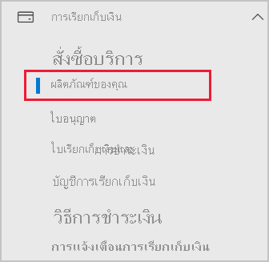
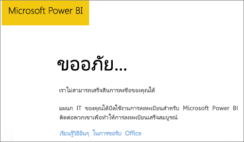

# เพิ่ม Power BI ในการสมัครสมาชิกคู่ค้า Microsoft 365Add Power BI to a Microsoft 365 partner subscription

Microsoft 365 อนุญาตให้บริษัทสามารถขายต่อ Microsoft 365 โดยรวมเข้ากับโซลูชันของพวกเขาเองได้ และให้บริการด้านการจัดซื้อ การเรียกเก็บเงิน และการสนับสนุน ให้แก่ลูกค้าปลายทางในจุดเดียวMicrosoft 365 enables companies to resell Microsoft 365 bundled and integrated with their own solutions, providing customers with a single point of contact for purchasing, billing, and support.

หากคุณสนใจที่จะเพิ่ม Power BI ในการสมัครใช้งาน Microsoft 365 เราขอแนะนำให้ติดต่อกับคู่ค้าของคุณIf you're interested in adding Power BI to your Microsoft 365 subscription, we recommend you contact your partner to do so. ถ้าคู่ค้าของคุณไม่มี Power BI ในขณะนี้ คุณสามารถติดตามตัวเลือกที่อธิบายไว้ด้านล่างIf your partner doesn't currently offer Power BI, you can pursue the options described below.

## ติดต่อกับคู่ค้าของคุณเพื่อซื้อ Power BIWork with your partner to purchase Power BI

หากคุณต้องการซื้อการสมัครใช้งาน Power BI Pro หรือ Power BI Premium ให้ติดต่อคู่ค้าของคุณเพื่อพิจารณาทางเลือกที่คุณมีIf you want to buy a subscription to Power BI Pro or Power BI Premium, work with your partner to consider what options you have:

* คู่ค้าของคุณตกลงที่จะเพิ่ม Power BI ลงในรายการผลิตภัฑณฑ์ของพวกเขาเพื่อให้คุณสามารถซื้อจากพวกเขาได้Your partner agrees to add Power BI to their portfolio so that you can purchase from them.

* คู่ค้าของคุณสามารถเปลี่ยนรูปแบบของคุณให้สามารถซื้อ Power BI โดยตรงจาก Microsoft หรือคู่ค้าอื่นที่มี Power BI ได้Your partner can transition you to a model where you can buy Power BI directly from Microsoft or another partner who offers Power BI.

## สั่งซื้อจาก Microsoft หรือช่องทางอื่นPurchase from Microsoft or another channel

ขึ้นอยู่กับความสัมพันธ์ระหว่างคู่ค้าของคุณ คุณอาจสามารถซื้อ Power BI โดยตรงจาก Microsoft หรือคู่ค้าอื่นได้Depending on the relationship with your partner, you might be able to purchase Power BI directly from Microsoft or another partner. คุณสามารถตรวจสอบว่าคุณสามารถเพิ่มการสมัครใช้งาน Power BI ในศูนย์การจัดการ Microsoft 365 ได้หรือไม่ (จำเป็นต้องเป็นสมาชิกในบทบาทผู้ดูแลระบบส่วนกลางหรือบทบาทผู้ดูแลระบบการเรียกเก็บเงิน)You can verify whether you can add Power BI subscriptions in the Microsoft 365 admin center (requires membership in the global admin or billing admin role).

1. ไปที่ [ศูนย์การจัดการ Microsoft 365](https://admin.microsoft.com/AdminPortal/Home#/homepage)Go to the [Microsoft 365 admin center](https://admin.microsoft.com/AdminPortal/Home#/homepage).

1. ในเมนูด้านซ้าย ให้เปิด **การเรียกเก็บเงิน** จากนั้นเลือก **ผลิตภัณฑ์ของคุณ**:In the left menu, open **Billing**, then select **Your products**:

   

 1. ค้นหา **การสมัครสมาชิก** ตามที่แสดงในภาพด้านล่างLook for **Subscriptions** as shown in the image below. หากคุณเห็น **การสมัครใช้งาน** คุณสามารถขอรับบริการจาก Microsoft โดยตรง หรือติดต่อคู่ค้าอื่นที่มี Power BIIf you see **Subscriptions**, you can acquire the service from Microsoft directly, or you can contact another partner that offers Power BI.

    

    หากคุณไม่เห็น **การสมัครใช้งาน** คุณจะไม่สามารถซื้อโดยตรงจาก Microsoft หรือจากคู่ค้าอื่นได้If you don't see **Subscriptions**, you can't buy from Microsoft directly or from another partner.

หากคู่ค้าของคุณไม่มี Power BI และคุณไม่สามารถซื้อโดยตรงจาก Microsoft หรือคู่ค้าอื่น ให้พิจารณาลงทะเบียนทดลองใช้งานฟรีIf your partner doesn't offer Power BI and you can't buy directly from Microsoft or another partner, consider signing up for a free trial.

## ลงทะเบียนเพื่อทดลองใช้งานฟรีSign up for a free trial

คุณสามารถลงทะเบียนเพื่อทดลองใช้งาน Power BI โดยไม่เสียค่าใช้จ่ายYou can sign up for a free trial of Power BI. หากคุณไม่ซื้อ Power BI Pro ในตอนท้ายของช่วงทดลองใช้งาน คุณจะยังคงมีสิทธิ์ใช้งานฟรีที่มีคุณลักษณะมากมายของ Power BIIf you don't purchase Power BI Pro at the end of the trial period, you still have a free license that offers many of the features of Power BI. ดูข้อมูลเพิ่มเติมได้ที่ [การสมัคร Power BI รายบุคคล](../fundamentals/service-self-service-signup-for-power-bi.md)For more information, see [Sign up for Power BI as an individual](../fundamentals/service-self-service-signup-for-power-bi.md).

### เปิดใช้งานการสมัครใช้งานแบบเฉพาะกิจEnable ad-hoc subscriptions

ตามค่าเริ่มต้น การลงทะเบียนรายบุคคล (หรือที่เรียกว่าการสมัครแบบเฉพาะกิจ) จะถูกปิดการใช้งานBy default, individual sign-ups (also known as ad-hoc subscriptions) are disabled. ในกรณีนี้ คุณจะเห็นข้อความต่อไปนี้เมื่อคุณพยายามลงทะเบียน: *แผนก IT ของคุณได้ปิดใช้งานการลงทะเบียนสำหรับ Microsoft Power BI*In this case, you see the following message when you try to sign up: *Your IT department has turned off signup for Microsoft Power BI*.

ถ้าต้องการเปิดให้สมัครใช้งานเฉพาะกิจ คุณต้องติดต่อกับคู่ค้าของคุณและขอให้เขาเปิดให้ใช้งานTo enable ad-hoc subscriptions, you can contact your partner and request that they turn it on. หากคุณเป็นผู้ดูแลระบบผู้เช่าของคุณ และทราบวิธีการใช้คำสั่ง Azure Active Directory PowerShell คุณสามารถเปิดใช้งานการสมัครใช้เฉพาะกิจได้ด้วยตนเองIf you're an administrator of your tenant, and know how to use Azure Active Directory PowerShell commands, you can enable ad-hoc subscriptions yourself. สำหรับข้อมูลเพิ่มเติม ให้ทำตามขั้นตอนใน [เปิดหรือปิดใช้งานการซื้อแบบบริการตนเอง](service-admin-disable-self-service.md)For more information, follow the steps in [Enable or disable self-service purchasing](service-admin-disable-self-service.md).

## ขั้นตอนถัดไปNext steps

* [สิทธิ์การใช้งาน Power BI สำหรับองค์กรของคุณPower BI licensing in your organization](service-admin-licensing-organization.md)
* [ซื้อและะมอบใบอนุญาตการใช้งาน Power BI ProPurchase and assign Power BI Pro licenses](service-admin-purchasing-power-bi-pro.md)

มีคำถามเพิ่มเติมหรือไม่More questions? [ลองถามชุมชน Power BITry asking the Power BI Community](https://community.powerbi.com/)