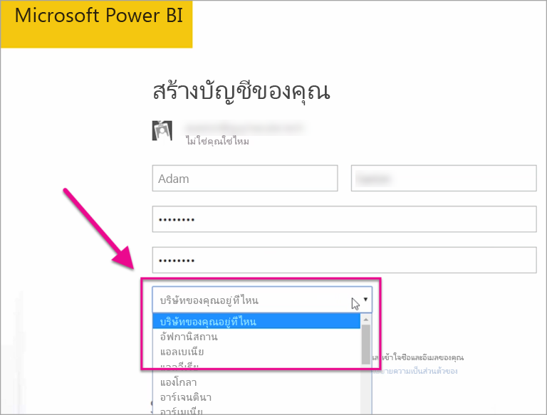

# ผู้เช่า Power BI ของฉันอยู่ที่ไหน?Where is my Power BI tenant located?

<iframe width="560" height="315" src="https://www.youtube.com/embed/0fOxaHJPvdM?showinfo=0" frameborder="0" allowfullscreen></iframe>

เรียนรู้ตำแหน่งที่ผู้เช่า Power BI ของคุณอยู่และวิธีเลือกตำแหน่งที่ตั้งLearn where your Power BI tenant is located and how that location is selected. การเรียนรู้ตำแหน่งที่ตั้งถือเป็นสิ่งสำคัญเนื่องจากสามารถส่งผลกระทบต่อการโต้ตอบที่คุณมีกับบริการได้Learning the location is important, because it can affect the interactions you have with the service.

## วิธีการตรวจสอบตำแหน่งที่ผู้เช่า Power BI ของคุณอยู่How to determine where your Power BI tenant is located

หากต้องการค้นหาภูมิภาคที่ผู้เช่าของคุณอยู่ ให้ปฏิบัติตามขั้นตอนเหล่านี้To find the region your tenant is in, follow these steps.

1. ในบริการของ Power BI ที่เมนูด้านบน เลือกความช่วยเหลือ ( **?** ) จากนั้นเลือก **เกี่ยวกับ Power BI**In the Power BI service, in the top menu, select help (**?**) then **About Power BI**.

1. ค้นหาค่าที่อยู่ถัดจาก **ข้อมูลของคุณถูกเก็บไว้ใน**Look for the value next to **Your data is stored in**. ค่านั้นคือภูมิภาคที่ผู้เช่าของคุณอยู่It's the region where your tenant is located. ค่านี้ยังมีภูมิภาคที่ข้อมูลของคุณถูกเก็บไว้ เว้นแต่ว่าคุณกำลังใช้ความจุในภูมิภาคอื่นสำหรับพื้นที่ทำงานของคุณด้วยThe value is also the region where your data is stored, unless you're using capacities in different regions for your workspaces.

    

## วิธีเลือกขอบเขตข้อมูลHow the data region is selected

ขอบเขตข้อมูลจะยึดตามประเทศ/ภูมิภาคที่คุณเลือกเมื่อคุณสร้างผู้เช่าThe data region is based on the country/region you select when you create the tenant. การเลือกจะนำไปใช้เพื่อลงทะเบียนสำหรับทั้ง Microsoft 365 และ Power BI เนื่องจากข้อมูลนี้ถูกใช้ร่วมกันThe selection applies to sign up for both Microsoft 365 and to Power BI, because this information is shared. หากเป็นผู้เช่าใหม่ ให้เลือกประเทศ/ภูมิภาคที่เหมาะสมจากรายการเมื่อคุณลงทะเบียนIf this is a new tenant, select the appropriate country/region from the list when you sign up.

Power BI จะเลือกขอบเขตข้อมูลที่ใกล้เคียงการเลือกของคุณมากที่สุด ซึ่งจะกำหนดตำแหน่งที่เก็บข้อมูลสำหรับผู้เช่าของคุณPower BI picks a data region closest to your selection, which determines where data is stored for your tenant.

> [!IMPORTANT]
> คุณไม่สามารถเปลี่ยนการเลือกหลังจากที่สร้างผู้เช่าYou cannot change the selection after you create the tenant.

มีคำถามเพิ่มเติมหรือไม่More questions? [ลองไปที่ชุมชน Power BITry the Power BI Community](https://community.powerbi.com/)
