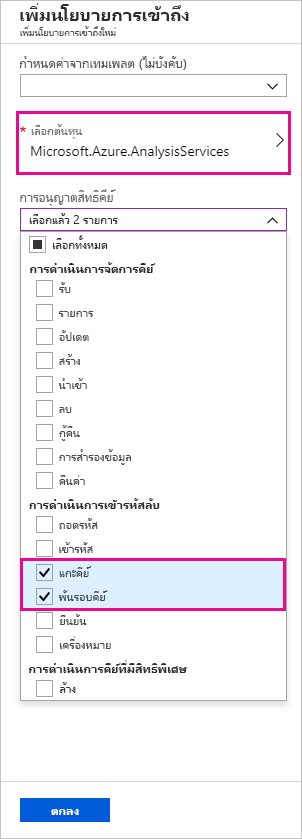
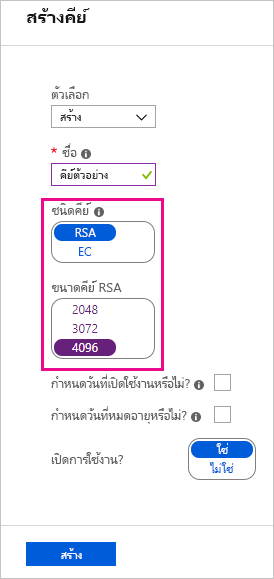
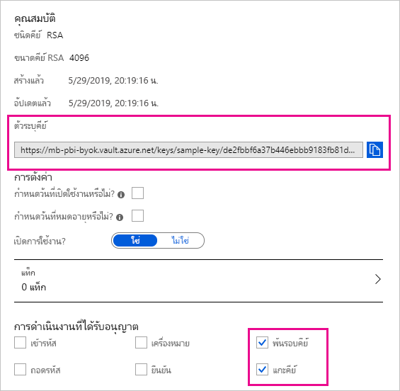

# <a name="bring-your-own-encryption-keys-for-power-bi"></a><span data-ttu-id="38148-103">นำคีย์การเข้ารหัสลับของคุณเองมาใช้กับ Power BI</span><span class="sxs-lookup"><span data-stu-id="38148-103">Bring your own encryption keys for Power BI</span></span>

<span data-ttu-id="38148-104">Power BI เข้ารหัสลับข้อมูล _ที่พัก_ และ _ระหว่างดำเนินการ_</span><span class="sxs-lookup"><span data-stu-id="38148-104">Power BI encrypts data _at-rest_ and _in process_.</span></span> <span data-ttu-id="38148-105">ตามค่าเริ่มต้น Power BI ใช้คีย์ที่จัดการโดย Microsoft เพื่อเข้ารหัสลับข้อมูลของคุณ</span><span class="sxs-lookup"><span data-stu-id="38148-105">By default, Power BI uses Microsoft-managed keys to encrypt your data.</span></span> <span data-ttu-id="38148-106">ใน Power BI Premium คุณยังสามารถใช้คีย์ของคุณเองสำหรับข้อมูลที่พักไว้ที่นำเข้าลงในชุดข้อมูล (ดู[ข้อควรพิจารณาเกี่ยวกับแหล่งข้อมูลและที่เก็บข้อมูล](#data-source-and-storage-considerations)สำหรับข้อมูลเพิ่มเติม) ได้</span><span class="sxs-lookup"><span data-stu-id="38148-106">In Power BI Premium you can also use your own keys for data at-rest that is imported into a dataset (see [Data source and storage considerations](#data-source-and-storage-considerations) for more information).</span></span> <span data-ttu-id="38148-107">วิธีนี้จะอธิบายไว้มักจะเป็น _การนำคีย์ของคุณมาใช้เอง_(Bring Your Own Key, BYOK)</span><span class="sxs-lookup"><span data-stu-id="38148-107">This approach is often described as _bring your own key_ (BYOK).</span></span>

## <a name="why-use-byok"></a><span data-ttu-id="38148-108">เหตุใดจึงใช้ BYOK</span><span class="sxs-lookup"><span data-stu-id="38148-108">Why use BYOK?</span></span>

<span data-ttu-id="38148-109">BYOK ทำให้ง่ายต่อการปฏิบัติตามข้อกำหนดที่ระบุการจัดการคีย์ด้วย Cloud Service Provider (ในกรณีนี้คือ Microsoft)</span><span class="sxs-lookup"><span data-stu-id="38148-109">BYOK makes it easier to meet compliance requirements that specify key arrangements with the cloud service provider (in this case Microsoft).</span></span> <span data-ttu-id="38148-110">ด้วย BYOK คุณจะสามารถระบุและควบคุมคีย์การเข้ารหัสลับสำหรับข้อมูล Power BI ที่พักไว้ในระดับแอปพลิเคชัน</span><span class="sxs-lookup"><span data-stu-id="38148-110">With BYOK, you provide and control the encryption keys for your Power BI data at-rest at the application level.</span></span> <span data-ttu-id="38148-111">ดังนั้น คุณสามารถควบคุมและยกเลิกคีย์ขององค์กรของคุณ คุณควรตัดสินใจเพื่อออกจากบริการ</span><span class="sxs-lookup"><span data-stu-id="38148-111">As a result, you can exercise control and revoke your organization's keys, should you decide to exit the service.</span></span> <span data-ttu-id="38148-112">เมื่อยกเลิกคีย์ ข้อมูลจะไม่สามารถอ่านได้ในบริการภายใน 30 นาที</span><span class="sxs-lookup"><span data-stu-id="38148-112">By revoking the keys, the data is unreadable to the service within 30 minutes.</span></span>

> [!IMPORTANT]
> <span data-ttu-id="38148-113">Power BI Premium เพิ่งเปิดตัว Premium เวอร์ชันใหม่ชื่อ **Premium Gen2** ซึ่งกำลังอยู่ในช่วงการแสดงตัวอย่าง</span><span class="sxs-lookup"><span data-stu-id="38148-113">Power BI Premium recently released a new version of Premium, called **Premium Gen2**, which is currently in preview.</span></span> <span data-ttu-id="38148-114">ความสามารถของ Preview Gen2 **ไม่** รองรับ BYOK ในขณะที่อยู่ในช่วงการแสดงตัวอย่าง</span><span class="sxs-lookup"><span data-stu-id="38148-114">Preview Gen2 capacities do **not** support BYOK while in preview.</span></span>

## <a name="data-source-and-storage-considerations"></a><span data-ttu-id="38148-115">ข้อควรพิจารณาเกี่ยวกับแหล่งข้อมูลและที่เก็บข้อมูล</span><span class="sxs-lookup"><span data-stu-id="38148-115">Data source and storage considerations</span></span>

<span data-ttu-id="38148-116">หากต้องการใช้ BYOK คุณต้องอัปโหลดข้อมูลในบริการของ Power BI จากไฟล์ Power BI Desktop (PBIX)</span><span class="sxs-lookup"><span data-stu-id="38148-116">To use BYOK, you must upload data to the Power BI service from a Power BI Desktop (PBIX) file.</span></span> <span data-ttu-id="38148-117">คุณไม่สามารถใช้ BYOK ในสถานการณ์ต่อไปนี้:</span><span class="sxs-lookup"><span data-stu-id="38148-117">You cannot use BYOK in the following scenarios:</span></span>

- <span data-ttu-id="38148-118">การเชื่อมต่อแบบออนไลน์ของ Analysis Services</span><span class="sxs-lookup"><span data-stu-id="38148-118">Analysis Services Live Connection</span></span>
- <span data-ttu-id="38148-119">เวิร์กบุ๊ก Excel (เว้นแต่ว่าข้อมูลจะถูกนำเข้าลงใน Power BI Desktop ก่อน)</span><span class="sxs-lookup"><span data-stu-id="38148-119">Excel workbooks (unless data is first imported into Power BI Desktop)</span></span>
- [<span data-ttu-id="38148-120">ส่งชุดข้อมูล</span><span class="sxs-lookup"><span data-stu-id="38148-120">Push datasets</span></span>](/rest/api/power-bi/pushdatasets)
- [<span data-ttu-id="38148-121">ชุดข้อมูลการสตรีม</span><span class="sxs-lookup"><span data-stu-id="38148-121">Streaming datasets</span></span>](../connect-data/service-real-time-streaming.md#set-up-your-real-time-streaming-dataset-in-power-bi)


<span data-ttu-id="38148-122">BYOK ใช้กับชุดข้อมูลเท่านั้น</span><span class="sxs-lookup"><span data-stu-id="38148-122">BYOK applies only to datasets.</span></span> <span data-ttu-id="38148-123">Push ชุดข้อมูล ไฟล์ Excel และไฟล์ CSV ที่ผู้ใช้สามารถอัปโหลดไปยังบริการไม่ได้รับการเข้ารหัสโดยใช้คีย์ของคุณเอง</span><span class="sxs-lookup"><span data-stu-id="38148-123">Push datasets, Excel files, and CSV files that users can upload to the service are not encrypted using your own key.</span></span> <span data-ttu-id="38148-124">เมื่อต้องระบุอาร์ทิแฟกต์ที่จัดเก็บไว้ในพื้นที่ทำงานของคุณ ให้ใช้คำสั่ง PowerShell ต่อไปนี้:</span><span class="sxs-lookup"><span data-stu-id="38148-124">To identify which artifacts are stored in your workspaces, use the following PowerShell command:</span></span>

```PS C:\> Get-PowerBIWorkspace -Scope Organization -Include All```

> [!NOTE]
> <span data-ttu-id="38148-125">cmdlet นี้ต้องการโมดูลการจัดการ Power BI เวอร์ชัน 1.0.840</span><span class="sxs-lookup"><span data-stu-id="38148-125">This cmdlet requires Power BI management module v1.0.840.</span></span> <span data-ttu-id="38148-126">คุณสามารถดูเวอร์ชันที่คุณมีอยู่โดยการเรียกใช้ Get-InstalledModule -Name MicrosoftPowerBIMgmt</span><span class="sxs-lookup"><span data-stu-id="38148-126">You can see which version you have by running Get-InstalledModule -Name MicrosoftPowerBIMgmt.</span></span> <span data-ttu-id="38148-127">ติดตั้งเวอร์ชันล่าสุดโดยการเรียกใช้ Install-Module -Name MicrosoftPowerBIMgmt</span><span class="sxs-lookup"><span data-stu-id="38148-127">Install the latest version by running Install-Module -Name MicrosoftPowerBIMgmt.</span></span> <span data-ttu-id="38148-128">คุณสามารถรับข้อมูลเพิ่มเติมเกี่ยวกับ cmdlet ของ Power BI และพารามิเตอร์ของคำสั่งดังกล่าวใน[โมดูล cmdlet ของ Power BI PowerShell](/powershell/power-bi/overview)</span><span class="sxs-lookup"><span data-stu-id="38148-128">You can get more information about the Power BI cmdlet and its parameters in [Power BI PowerShell cmdlet module](/powershell/power-bi/overview).</span></span>

## <a name="configure-azure-key-vault"></a><span data-ttu-id="38148-129">กำหนดค่า Azure Key Vault</span><span class="sxs-lookup"><span data-stu-id="38148-129">Configure Azure Key Vault</span></span>

<span data-ttu-id="38148-130">ในส่วนนี้คุณเรียนรู้วิธีการกำหนดค่า Azure Key Vault เครื่องมือเพื่อจัดเก็บและเข้าถึงความลับอย่างปลอดภัย เช่น คีย์การเข้ารหัสลับ</span><span class="sxs-lookup"><span data-stu-id="38148-130">In this section you learn how to configure Azure Key Vault, a tool for securely storing and accessing secrets, like encryption keys.</span></span> <span data-ttu-id="38148-131">คุณสามารถใช้ Key Vault ที่มีอยู่เพื่อจัดเก็บคีย์การเข้ารหัสลับ หรือคุณสามารถสร้างขึ้นใหม่โดยเฉพาะเพื่อใช้กับ Power BI</span><span class="sxs-lookup"><span data-stu-id="38148-131">You can use an existing key vault to store encryption keys, or you can create a new one specifically for use with Power BI.</span></span>

<span data-ttu-id="38148-132">คำแนะนำในส่วนนี้ถือว่าเป็นความรู้พื้นฐานของ Azure Key Vault</span><span class="sxs-lookup"><span data-stu-id="38148-132">The instructions in this section assume basic knowledge of Azure Key Vault.</span></span> <span data-ttu-id="38148-133">สำหรับข้อมูลเพิ่มเติม โปรดดูที่[Azure Key Vault คืออะไร](/azure/key-vault/key-vault-whatis)</span><span class="sxs-lookup"><span data-stu-id="38148-133">For more information, see [What is Azure Key Vault?](/azure/key-vault/key-vault-whatis).</span></span> <span data-ttu-id="38148-134">กำหนดค่า Key Vault ของคุณในวิธีต่อไปนี้:</span><span class="sxs-lookup"><span data-stu-id="38148-134">Configure your key vault in the following way:</span></span>

1. <span data-ttu-id="38148-135">เพิ่มบริการของ Power BI เป็นโครงร่างสำคัญของบริการสำหรับ Key Vault ด้วยสิทธิ์การครอบและยกเลิกการครอบ</span><span class="sxs-lookup"><span data-stu-id="38148-135">Add the Power BI service as a service principal for the key vault, with wrap and unwrap permissions.</span></span>

1. <span data-ttu-id="38148-136">สร้างคีย์ RSA ที่มีความยาว 4096 บิต (หรือใช้คีย์ที่มีอยู่ของชนิดนี้) ด้วยสิทธิ์การครอบและยกเลิกการครอบ</span><span class="sxs-lookup"><span data-stu-id="38148-136">Create an RSA key with a 4096-bit length (or use an existing key of this type), with wrap and unwrap permissions.</span></span>

    > [!IMPORTANT]
    > <span data-ttu-id="38148-137">Power BI BYOK สนับสนุนเฉพาะคีย์ RSA ที่มีความยาว 4096 บิตเท่านั้น</span><span class="sxs-lookup"><span data-stu-id="38148-137">Power BI BYOK supports only RSA keys with a 4096-bit length.</span></span>

1. <span data-ttu-id="38148-138">แนะนำ: ตรวจสอบว่า Key Vault มีการเปิดใช้งานตัวเลือก _ลบชั่วคราว_ หรือไม่</span><span class="sxs-lookup"><span data-stu-id="38148-138">Recommended: Check that the key vault has the _soft delete_ option enabled.</span></span>

### <a name="add-the-service-principal"></a><span data-ttu-id="38148-139">เพิ่มโครงร่างสำคัญของบริการ</span><span class="sxs-lookup"><span data-stu-id="38148-139">Add the service principal</span></span>

1. <span data-ttu-id="38148-140">ที่พอร์ทัล Azure ใน Key Vault ของคุณ ภายใต้ **นโยบายการเข้าถึง** ให้เลือก **เพิ่มใหม่**</span><span class="sxs-lookup"><span data-stu-id="38148-140">In the Azure portal, in your key vault, under **Access policies**, select **Add New**.</span></span>

1. <span data-ttu-id="38148-141">ภายใต้ **เลือกรายการหลัก** ค้นหาและเลือก Microsoft.Azure.AnalysisServices</span><span class="sxs-lookup"><span data-stu-id="38148-141">Under **Select principal**, search for and select Microsoft.Azure.AnalysisServices.</span></span>

    > [!NOTE]
    > <span data-ttu-id="38148-142">หากคุณไม่พบ "Microsoft.Azure.AnalysisServices" อาจเป็นไปได้ว่าการสมัครใช้งาน Azure ที่เชื่อมโยงกับ Azure Key Vault ของคุณไม่เคยมีทรัพยากร Power BI ที่เกี่ยวข้อง</span><span class="sxs-lookup"><span data-stu-id="38148-142">If you can't find "Microsoft.Azure.AnalysisServices", it's likely that the Azure subscription associated with your Azure Key Vault never had a Power BI resource associated with it.</span></span> <span data-ttu-id="38148-143">ลองค้นหาสตริงต่อไปนี้แทน: 00000009-0000-0000-c000-000000000000</span><span class="sxs-lookup"><span data-stu-id="38148-143">Try searching for the following string instead: 00000009-0000-0000-c000-000000000000.</span></span>

1. <span data-ttu-id="38148-144">ภายใต้ **สิทธิ์คีย์** เลือก **ยกเลิกการครอบคีย์** และ **ครอบคีย์**</span><span class="sxs-lookup"><span data-stu-id="38148-144">Under **Key permissions**, select **Unwrap Key** and **Wrap Key**.</span></span>

    

1. <span data-ttu-id="38148-146">เลือก **ตกลง** จากนั้นจึงเลือก **บันทึก**</span><span class="sxs-lookup"><span data-stu-id="38148-146">Select **OK**, then **Save**.</span></span>

> [!NOTE]
> <span data-ttu-id="38148-147">หากคุณต้องการยกเลิกการเข้าถึง Power BI ไปยังข้อมูลของคุณในอนาคต ให้ลบสิทธิ์การเข้าถึงบริการหลักจาก Azure Key Vault ของคุณ</span><span class="sxs-lookup"><span data-stu-id="38148-147">To revoke access of Power BI to your data in the future remove access rights to this service principal from your Azure Key Vault.</span></span>

### <a name="create-an-rsa-key"></a><span data-ttu-id="38148-148">สร้างคีย์ RSA</span><span class="sxs-lookup"><span data-stu-id="38148-148">Create an RSA key</span></span>

1. <span data-ttu-id="38148-149">ใน Key Vault ของคุณ ภายใต้ **คีย์** เลือก **สร้าง/นำเข้า**</span><span class="sxs-lookup"><span data-stu-id="38148-149">In your key vault, under **Keys**, select **Generate/Import**.</span></span>

1. <span data-ttu-id="38148-150">เลือก **ประเภทคีย์** ของ RSA และ **ขนาดคีย์ RSA** คือ 4096</span><span class="sxs-lookup"><span data-stu-id="38148-150">Select a **Key Type** of RSA and an **RSA Key Size** of 4096.</span></span>

    

1. <span data-ttu-id="38148-152">เลือก **สร้าง**</span><span class="sxs-lookup"><span data-stu-id="38148-152">Select **Create**.</span></span>

1. <span data-ttu-id="38148-153">ภายใต้ **คีย์** เลือกคีย์ที่คุณสร้างขึ้น</span><span class="sxs-lookup"><span data-stu-id="38148-153">Under **Keys**, select the key you created.</span></span>

1. <span data-ttu-id="38148-154">เลือก GUID สำหรับคีย์ **รุ่นปัจจุบัน**</span><span class="sxs-lookup"><span data-stu-id="38148-154">Select the GUID for the **Current Version** of the key.</span></span>

1. <span data-ttu-id="38148-155">ตรวจสอบว่า ได้เลือกทั้ง **ครอบคีย์** และ **ยกเลิกการครอบคีย์**</span><span class="sxs-lookup"><span data-stu-id="38148-155">Check that **Wrap Key** and **Unwrap Key** are both selected.</span></span> <span data-ttu-id="38148-156">คัดลอก **รหัสคีย์** ที่จะใช้เมื่อคุณเปิดใช้งาน BYOK ใน Power BI</span><span class="sxs-lookup"><span data-stu-id="38148-156">Copy the **Key Identifier** to use when you enable BYOK in Power BI.</span></span>

    

### <a name="soft-delete-option"></a><span data-ttu-id="38148-158">ลบตัวเลือกชั่วคราว</span><span class="sxs-lookup"><span data-stu-id="38148-158">Soft delete option</span></span>

<span data-ttu-id="38148-159">เราขอแนะนำให้คุณเปิดใช้งาน [ลบชั่วคราว](/azure/key-vault/key-vault-ovw-soft-delete)บน Key Vault ของคุณ เพื่อป้องกันข้อมูลสูญหายในกรณีที่มีการลบคีย์หรือ Key Vault โดยไม่ได้ตั้งใจ</span><span class="sxs-lookup"><span data-stu-id="38148-159">We recommend that you enable [soft-delete](/azure/key-vault/key-vault-ovw-soft-delete) on your key vault, to protect from data loss in case of accidental key – or key vault – deletion.</span></span> <span data-ttu-id="38148-160">คุณต้องใช้ [PowerShell เพื่อเปิดใช้งานคุณสมบัติ "ลบชั่วคราว"](/azure/key-vault/key-vault-soft-delete-powershell) บน Key Vault เนื่องจากตัวเลือกนี้ยังไม่พร้อมใช้งานจากพอร์ทัล Microsoft Azure</span><span class="sxs-lookup"><span data-stu-id="38148-160">You must use [PowerShell to enable the "soft-delete" property](/azure/key-vault/key-vault-soft-delete-powershell) on the key vault, because this option is not available from the Azure portal yet.</span></span>

<span data-ttu-id="38148-161">เมื่อมีการกำหนดค่า Azure Key Vault อย่างถูกต้อง คุณก็พร้อมที่จะเปิดใช้งาน BYOK บนผู้เช่าของคุณ</span><span class="sxs-lookup"><span data-stu-id="38148-161">With Azure Key Vault properly configured, you're ready to enable BYOK on your tenant.</span></span>

## <a name="enable-byok-on-your-tenant"></a><span data-ttu-id="38148-162">เปิดใช้งาน BYOK บนผู้เช่าของคุณ</span><span class="sxs-lookup"><span data-stu-id="38148-162">Enable BYOK on your tenant</span></span>

<span data-ttu-id="38148-163">คุณเปิดใช้งาน BYOK ในระดับผู้เช่าด้วย [PowerShell](https://www.powershellgallery.com/packages/MicrosoftPowerBIMgmt.Admin) โดยการแนะนำคีย์การเข้ารหัสลับที่คุณสร้างและจัดเก็บไว้ใน Azure Key Vault ครั้งแรกให้กับผู้เช่า Power BI ของคุณผู้เช่า</span><span class="sxs-lookup"><span data-stu-id="38148-163">You enable BYOK at the tenant level with [PowerShell](https://www.powershellgallery.com/packages/MicrosoftPowerBIMgmt.Admin), by first introducing to your Power BI tenant the encryption keys you created and stored in Azure Key Vault.</span></span> <span data-ttu-id="38148-164">จากนั้นกำหนดคีย์การเข้ารหัสลับเหล่านี้ต่อความจุพรีเมียมสำหรับการเข้ารหัสเนื้อหาในความจุ</span><span class="sxs-lookup"><span data-stu-id="38148-164">You then assign these encryption keys per Premium capacity for encrypting content in the capacity.</span></span>

### <a name="important-considerations"></a><span data-ttu-id="38148-165">ข้อควรพิจารณาที่สำคัญ</span><span class="sxs-lookup"><span data-stu-id="38148-165">Important considerations</span></span>

<span data-ttu-id="38148-166">ก่อนที่คุณเปิดใช้งาน BYOK ควรคำนึงถึงข้อควรพิจารณาต่อไปนี้:</span><span class="sxs-lookup"><span data-stu-id="38148-166">Before you enable BYOK, keep the following considerations in mind:</span></span>

- <span data-ttu-id="38148-167">ในขณะนี้ คุณไม่สามารถปิดใช้งาน BYOK หลังจากที่คุณเปิดใช้งานได้</span><span class="sxs-lookup"><span data-stu-id="38148-167">At this time, you cannot disable BYOK after you enable it.</span></span> <span data-ttu-id="38148-168">ขึ้นอยู่กับวิธีที่คุณระบุพารามิเตอร์สำหรับ`Add-PowerBIEncryptionKey` คุณสามารถควบคุมวิธีที่คุณใช้ BYOK สำหรับความจุอย่างน้อยหนึ่งรายการ</span><span class="sxs-lookup"><span data-stu-id="38148-168">Depending on how you specify parameters for `Add-PowerBIEncryptionKey`, you can control how you use BYOK for one or more of your capacities.</span></span> <span data-ttu-id="38148-169">อย่างไรก็ตาม คุณไม่สามารถยกเลิกการแนะนำคีย์ไปยังผู้เช่าของคุณได้</span><span class="sxs-lookup"><span data-stu-id="38148-169">However, you can't undo the introduction of keys to your tenant.</span></span> <span data-ttu-id="38148-170">สำหรับข้อมูลเพิ่มเติม ให้ดู [เปิดใช้งาน BYOK](#enable-byok)</span><span class="sxs-lookup"><span data-stu-id="38148-170">For more information, see [Enable BYOK](#enable-byok).</span></span>

- <span data-ttu-id="38148-171">คุณไม่สามารถย้ายพื้นที่ทำงานที่ใช้ BYOK ได้ _โดยตรง_ จากความจุใน Power BI Premium ไปยังความจุที่ใช้ร่วมกัน</span><span class="sxs-lookup"><span data-stu-id="38148-171">You cannot _directly_ move a workspace that uses BYOK from a capacity in Power BI Premium to a shared capacity.</span></span> <span data-ttu-id="38148-172">ก่อนอื่น คุณต้องย้ายพื้นที่ทำงานไปยังความจุที่ไม่ได้เปิดใช้งาน BYOK</span><span class="sxs-lookup"><span data-stu-id="38148-172">You must first move the workspace to a capacity that doesn't have BYOK enabled.</span></span>

- <span data-ttu-id="38148-173">ถ้าคุณย้ายพื้นที่ทำงานที่ใช้ BYOK จากความจุใน Power BI Premium ไปยังความจุที่ใช้ร่วมกัน คุณจะไม่สามารถเข้าถึงรายงานและชุดข้อมูลได้เนื่องจากมีการจัดรูปแบบด้วยคีย์</span><span class="sxs-lookup"><span data-stu-id="38148-173">If you move a workspace that uses BYOK from a capacity in Power BI Premium, to shared, reports and datasets will become inaccessible, as they are encrypted with the Key.</span></span> <span data-ttu-id="38148-174">เพื่อหลีกเลี่ยงไม่ให้เกิดสถานการณ์เช่นนี้ คุณต้องย้ายพื้นที่ทำงานไปยังความจุที่ไม่ได้เปิดใช้งาน BYOK ก่อน</span><span class="sxs-lookup"><span data-stu-id="38148-174">To avoid this situation, you must first move the workspace to a capacity that doesn’t have BYOK enabled.</span></span>

### <a name="enable-byok"></a><span data-ttu-id="38148-175">เปิดใช้งาน BYOK</span><span class="sxs-lookup"><span data-stu-id="38148-175">Enable BYOK</span></span>

<span data-ttu-id="38148-176">หากต้องการเปิดใช้ BYOK คุณต้องเป็นผู้ดูแลระบบ Power BI ที่ลงชื่อเข้าใช้โดยใช้ cmdlet `Connect-PowerBIServiceAccount`</span><span class="sxs-lookup"><span data-stu-id="38148-176">To enable BYOK, you must be a Power BI admin, signed in using the `Connect-PowerBIServiceAccount` cmdlet.</span></span> <span data-ttu-id="38148-177">จากนั้น ใช ้[`Add-PowerBIEncryptionKey`](/powershell/module/microsoftpowerbimgmt.admin/Add-PowerBIEncryptionKey) เพื่อเปิดใช้งาน BYOK ดังที่แสดงในตัวอย่างต่อไปนี้:</span><span class="sxs-lookup"><span data-stu-id="38148-177">Then use [`Add-PowerBIEncryptionKey`](/powershell/module/microsoftpowerbimgmt.admin/Add-PowerBIEncryptionKey) to enable BYOK, as shown in the following example:</span></span>

```powershell
Add-PowerBIEncryptionKey -Name'Contoso Sales' -KeyVaultKeyUri'https://contoso-vault2.vault.azure.net/keys/ContosoKeyVault/b2ab4ba1c7b341eea5ecaaa2wb54c4d2'
```

<span data-ttu-id="38148-178">เมื่อต้องการเพิ่มหลายคีย์ เรียกใช้`Add-PowerBIEncryptionKey`ด้วยค่าต่าง ๆ สำหรับ -`-Name`และ`-KeyVaultKeyUri`</span><span class="sxs-lookup"><span data-stu-id="38148-178">To add multiple keys, run `Add-PowerBIEncryptionKey` with different values for -`-Name` and `-KeyVaultKeyUri`.</span></span> 

<span data-ttu-id="38148-179">cmdlet ยอมรับพารามิเตอร์สลับสองรายการที่ส่งผลต่อการเข้ารหัสลับสำหรับความจุปัจจุบันและในอนาคต</span><span class="sxs-lookup"><span data-stu-id="38148-179">The cmdlet accepts two switch parameters that affect encryption for current and future capacities.</span></span> <span data-ttu-id="38148-180">ตามค่าเริ่มต้น ไม่มีการตั้งค่าการสลับ:</span><span class="sxs-lookup"><span data-stu-id="38148-180">By default, neither of the switches are set:</span></span>

- <span data-ttu-id="38148-181">`-Activate`: ระบุว่าจะใช้คีย์นี้สำหรับความจุที่มีอยู่ทั้งหมดในผู้เช่าที่ไม่ได้เข้ารหัสลับ</span><span class="sxs-lookup"><span data-stu-id="38148-181">`-Activate`: Indicates that this key will be used for all existing capacities in the tenant that aren't already encrypted.</span></span>

- <span data-ttu-id="38148-182">`-Default`: ระบุว่า คีย์นี้เป็นค่าเริ่มต้นสำหรับผู้เช่าทั้งหมดในขณะนี้หรือไม่</span><span class="sxs-lookup"><span data-stu-id="38148-182">`-Default`: Indicates that this key is now the default for the entire tenant.</span></span> <span data-ttu-id="38148-183">เมื่อคุณสร้างความจุใหม่ ความจุจะรับคีย์นี้มา</span><span class="sxs-lookup"><span data-stu-id="38148-183">When you create a new capacity, the capacity inherits this key.</span></span>

> [!IMPORTANT]
> <span data-ttu-id="38148-184">ถ้าคุณระบุ `-Default` ความจุทั้งหมดที่สร้างขึ้นในผู้เช่าของคุณจากจุดนี้จะถูกเข้ารหัสลับโดยใช้คีย์ที่คุณระบุ (หรือคีย์เริ่มต้นที่อัปเดต)</span><span class="sxs-lookup"><span data-stu-id="38148-184">If you specify `-Default`, all of the capacities created on your tenant from this point will be encrypted using the key you specify (or an updated default key).</span></span> <span data-ttu-id="38148-185">คุณไม่สามารถยกเลิกการดำเนินการเริ่มต้นได้ ดังนั้นคุณจึงไม่สามารถสร้างความจุพรีเมียมในผู้เช่าของคุณที่ไม่ได้ใช้ BYOK</span><span class="sxs-lookup"><span data-stu-id="38148-185">You cannot undo the default operation, so you lose the ability to create a premium capacity in your tenant that doesn't use BYOK.</span></span>

<span data-ttu-id="38148-186">หลังจากที่คุณเปิดใช้งาน BYOK กับผู้เช่าของคุณ ให้ตั้งค่าคีย์การเข้ารหัสสำหรับความจุ Power BI อย่างน้อยหนึ่งรายการหรือมากกว่า:</span><span class="sxs-lookup"><span data-stu-id="38148-186">After you enable BYOK on your tenant, set the encryption key for one or more Power BI capacities:</span></span>

1. <span data-ttu-id="38148-187">ใช้ [`Get-PowerBICapacity`](/powershell/module/microsoftpowerbimgmt.capacities/get-powerbicapacity) เพื่อรับ ID ความจุที่จำเป็นสำหรับขั้นตอนถัดไป</span><span class="sxs-lookup"><span data-stu-id="38148-187">Use [`Get-PowerBICapacity`](/powershell/module/microsoftpowerbimgmt.capacities/get-powerbicapacity) to get the capacity ID that's required for the next step.</span></span>

    ```powershell
    Get-PowerBICapacity -Scope Individual
    ```

    <span data-ttu-id="38148-188">Cmdlet ส่งกลับผลลัพธ์ที่คล้ายคลึงกับผลลัพธ์ต่อไปนี้:</span><span class="sxs-lookup"><span data-stu-id="38148-188">The cmdlet returns output similar to the following output:</span></span>

    ```
    Id              : xxxxxxxx-xxxx-xxxx-xxxx-xxxxxxxxxxxx
    DisplayName     : Test Capacity
    Admins          : adam@sometestdomain.com
    Sku             : P1
    State           : Active
    UserAccessRight : Admin
    Region          : North Central US
    ```

1. <span data-ttu-id="38148-189">ใช้ [`Set-PowerBICapacityEncryptionKey`](/powershell/module/microsoftpowerbimgmt.admin/set-powerbicapacityencryptionkey) เพื่อตั้งค่าคีย์การเข้ารหัสลับ:</span><span class="sxs-lookup"><span data-stu-id="38148-189">Use [`Set-PowerBICapacityEncryptionKey`](/powershell/module/microsoftpowerbimgmt.admin/set-powerbicapacityencryptionkey) to set the encryption key:</span></span>

    ```powershell
    Set-PowerBICapacityEncryptionKey -CapacityId xxxxxxxx-xxxx-xxxx-xxxx-xxxxxxxxxxxx -KeyName 'Contoso Sales'
    ```

<span data-ttu-id="38148-190">คุณสามารถควบคุมวิธีที่คุณใช้ BYOK ในผู้เช่าของคุณ</span><span class="sxs-lookup"><span data-stu-id="38148-190">You have control over how you use BYOK across your tenant.</span></span> <span data-ttu-id="38148-191">ตัวอย่างเช่น ในการเข้ารหัสลับความจุเดียว เรียกใช้ `Add-PowerBIEncryptionKey` โดยไม่มี `-Activate` หรือ `-Default`</span><span class="sxs-lookup"><span data-stu-id="38148-191">For example, to encrypt a single capacity, call `Add-PowerBIEncryptionKey` without `-Activate` or `-Default`.</span></span> <span data-ttu-id="38148-192">จากนั้น เรียกใช้ `Set-PowerBICapacityEncryptionKey` สำหรับความจุที่คุณต้องการเปิดใช้งาน BYOK</span><span class="sxs-lookup"><span data-stu-id="38148-192">Then call `Set-PowerBICapacityEncryptionKey` for the capacity where you want to enable BYOK.</span></span>

## <a name="manage-byok"></a><span data-ttu-id="38148-193">จัดการ BYOK</span><span class="sxs-lookup"><span data-stu-id="38148-193">Manage BYOK</span></span>

<span data-ttu-id="38148-194">Power BI มี cmdlet เพิ่มเติมเพื่อช่วยจัดการ BYOK ในผู้เช่าของคุณ:</span><span class="sxs-lookup"><span data-stu-id="38148-194">Power BI provides additional cmdlets to help manage BYOK in your tenant:</span></span>

- <span data-ttu-id="38148-195">ใช้ [`Get-PowerBICapacity`](/powershell/module/microsoftpowerbimgmt.capacities/get-powerbicapacity) เพื่อรับคีย์ที่ความจุกำลังใช้งาน:</span><span class="sxs-lookup"><span data-stu-id="38148-195">Use [`Get-PowerBICapacity`](/powershell/module/microsoftpowerbimgmt.capacities/get-powerbicapacity) to get the key that a capacity is currently using:</span></span>

    ```powershell
    Get-PowerBICapacity -Scope Organization -ShowEncryptionKey
    ```

- <span data-ttu-id="38148-196">ใช้ [`Get-PowerBIEncryptionKey`](/powershell/module/microsoftpowerbimgmt.admin/get-powerbiencryptionkey) เพื่อรับคีย์ที่ผู้เช่าของคุณกำลังใช้งาน:</span><span class="sxs-lookup"><span data-stu-id="38148-196">Use [`Get-PowerBIEncryptionKey`](/powershell/module/microsoftpowerbimgmt.admin/get-powerbiencryptionkey) to get the key that your tenant is currently using:</span></span>

    ```powershell
    Get-PowerBIEncryptionKey
    ```

- <span data-ttu-id="38148-197">ใช้ [`Get-PowerBIWorkspaceEncryptionStatus`](/powershell/module/microsoftpowerbimgmt.admin/get-powerbiworkspaceencryptionstatus) เพื่อดูว่ามีการเข้ารหัสชุดข้อมูลในพื้นที่ทำงานหรือไม่ และสถานะการเข้ารหัสลับซิงค์กับพื้นที่ทำงานหรือไม่:</span><span class="sxs-lookup"><span data-stu-id="38148-197">Use [`Get-PowerBIWorkspaceEncryptionStatus`](/powershell/module/microsoftpowerbimgmt.admin/get-powerbiworkspaceencryptionstatus) to see whether the datasets in a workspace are encrypted and whether their encryption status is in sync with the workspace:</span></span>

    ```powershell
    Get-PowerBIWorkspaceEncryptionStatus -Name'Contoso Sales'
    ```

    <span data-ttu-id="38148-198">โปรดทราบว่ามีการเปิดใช้งานการเข้ารหัสลับที่ระดับความจุ แต่คุณได้รับสถานะการเข้ารหัสลับที่ระดับชุดข้อมูลสำหรับพื้นที่ทำงานที่ระบุ</span><span class="sxs-lookup"><span data-stu-id="38148-198">Note that encryption is enabled at the capacity level, but you get encryption status at the dataset level for the specified workspace.</span></span>

- <span data-ttu-id="38148-199">ใช้ [`Switch-PowerBIEncryptionKey`](/powershell/module/microsoftpowerbimgmt.admin/switch-powerbiencryptionkey) เพื่อสลับ (หรือ _หมุน_) เวอร์ชันของคีย์ที่ถูกใช้สำหรับการเข้ารหัสลับ</span><span class="sxs-lookup"><span data-stu-id="38148-199">Use [`Switch-PowerBIEncryptionKey`](/powershell/module/microsoftpowerbimgmt.admin/switch-powerbiencryptionkey) to switch (or _rotate_) the version of the key being used for encryption.</span></span> <span data-ttu-id="38148-200">cmdlet เพียงแค่อัปเดต `-KeyVaultKeyUri` สำหรับคีย์ `-Name`:</span><span class="sxs-lookup"><span data-stu-id="38148-200">The cmdlet simply updates the `-KeyVaultKeyUri` for a key `-Name`:</span></span>

    ```powershell
    Switch-PowerBIEncryptionKey -Name'Contoso Sales' -KeyVaultKeyUri'https://contoso-vault2.vault.azure.net/keys/ContosoKeyVault/b2ab4ba1c7b341eea5ecaaa2wb54c4d2'
    ```


## <a name="next-steps"></a><span data-ttu-id="38148-201">ขั้นตอนถัดไป</span><span class="sxs-lookup"><span data-stu-id="38148-201">Next steps</span></span>

* [<span data-ttu-id="38148-202">โมดูล cmdlet ของ PowerShell Power BI</span><span class="sxs-lookup"><span data-stu-id="38148-202">Power BI PowerShell cmdlet module</span></span>](/powershell/power-bi/overview) 

* [<span data-ttu-id="38148-203">วิธีการแชร์งานของคุณใน Power BI</span><span class="sxs-lookup"><span data-stu-id="38148-203">Ways to share your work in Power BI</span></span>](../collaborate-share/service-how-to-collaborate-distribute-dashboards-reports.md)

* [<span data-ttu-id="38148-204">กรองรายงานโดยใช้พารามิเตอร์ของสตริงคิวรีใน URL</span><span class="sxs-lookup"><span data-stu-id="38148-204">Filter a report using query string parameters in the URL</span></span>](../collaborate-share/service-url-filters.md)

* [<span data-ttu-id="38148-205">ฝังด้วยส่วนเว็บรายงานใน SharePoint Online</span><span class="sxs-lookup"><span data-stu-id="38148-205">Embed with report web part in SharePoint Online</span></span>](../collaborate-share/service-embed-report-spo.md)

* [<span data-ttu-id="38148-206">เผยแพร่บนเว็บจาก Power BI</span><span class="sxs-lookup"><span data-stu-id="38148-206">Publish to Web from Power BI</span></span>](../collaborate-share/service-publish-to-web.md)


<span data-ttu-id="38148-207">Power BI ได้แนะนำ Power BI Premium Gen2 เข้ามาใช้งานเป็นข้อเสนอการแสดงตัวอย่าง ซึ่งปรับปรุงประสบการณ์การใช้งาน Power BI Premium ด้วยการปรับปรุงในสิ่งต่อไปนี้:</span><span class="sxs-lookup"><span data-stu-id="38148-207">Power BI has introduced Power BI Premium Gen2 as a preview offering, which improves the Power BI Premium experience with improvements in the following:</span></span>
* <span data-ttu-id="38148-208">ประสิทธิภาพการทำงาน</span><span class="sxs-lookup"><span data-stu-id="38148-208">Performance</span></span>
* <span data-ttu-id="38148-209">สิทธิการใช้งานต่อผู้ใช้</span><span class="sxs-lookup"><span data-stu-id="38148-209">Per-user licensing</span></span>
* <span data-ttu-id="38148-210">ขนาดใหญ่ขึ้น</span><span class="sxs-lookup"><span data-stu-id="38148-210">Greater scale</span></span>
* <span data-ttu-id="38148-211">เมตริกที่ดีขึ้น</span><span class="sxs-lookup"><span data-stu-id="38148-211">Improved metrics</span></span>
* <span data-ttu-id="38148-212">การปรับขนาดอัตโนมัติ</span><span class="sxs-lookup"><span data-stu-id="38148-212">Autoscaling</span></span>
* <span data-ttu-id="38148-213">ลดค่าใช้จ่ายในการจัดการ</span><span class="sxs-lookup"><span data-stu-id="38148-213">Reduced management overhead</span></span>

<span data-ttu-id="38148-214">สำหรับข้อมูลเพิ่มเติมเกี่ยวกับ Power BI Premium Gen2 โปรดดูที่ [Power BI Premium Generation 2 (ตัวอย่าง)](service-premium-what-is.md#power-bi-premium-generation-2-preview)</span><span class="sxs-lookup"><span data-stu-id="38148-214">For more information about Power BI Premium Gen2, see [Power BI Premium Generation 2 (preview)](service-premium-what-is.md#power-bi-premium-generation-2-preview).</span></span>