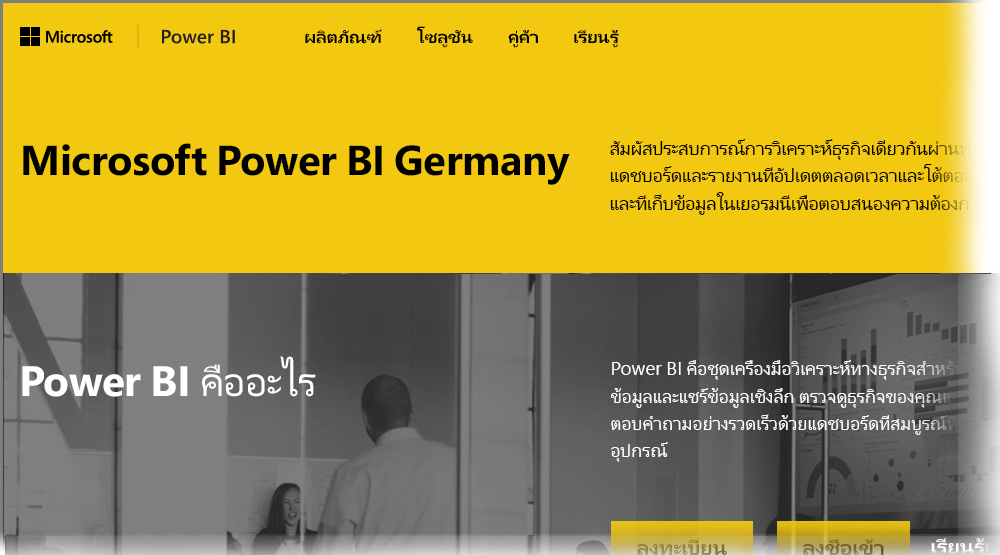

# ถามที่ถามบ่อยสำหรับ Power BI สำหรับลูกค้าระบบคลาวด์ประเทศเยอรมนีFrequently Asked Questions for Power BI for Germany Cloud customers
**บริการ Power BI** มีเวอร์ชันที่พร้อมใช้งานสำหรับลูกค้าสหภาพยุโรป/ข้อตกลงการค้าเสรียุโรป/ยุโรป (EU/EFTA) มักจะอ้างอิงถึงเป็น Deutschland Microsoft Cloud (MCD)The **Power BI service** has a version available for European Union/European Free Trade Agreement (EU/EFTA) customers, often referred to as Microsoft Cloud Deutschland (MCD). **บริการ Power BI** ในเวอร์ชันที่อธิบายไว้ในบทความนี้เป็นบริการเฉพาะสำหรับลูกค้า EU/EFTA และแยกต่างหากออกมา รวมทั้งแตกต่างจากเวอร์ชันเชิงพาณิชย์ของ **บริการ Power BI** หรือบริการ Power BI ที่จัดหาสำหรับลูกค้าภาครัฐบาลThe **Power BI service** version discussed in this article is specific to EU/EFTA customers, and is separate and different from the commercial version of the **Power BI service**, or Power BI services provided to government customers.

## คำถามและคำตอบQuestions and answers

คำถามและคำตอบต่อไปนี้แสดงข้อมูลสำคัญสำหรับบริการ Power BI Pro ใน Microsoft Cloud Deutschland (MCD) ซึ่งก็คือ ระบบคลาวด์บริการ Power BI ที่จัดให้มีสำหรับลูกค้า EU/EFTA โดยเฉพาะThe following questions and answers provide important information for Power BI Pro Service in Microsoft Cloud Deutschland (MCD), which is the Power BI service cloud specifically provided for EU/EFTA customers.

1. **บริการ Power BI สำหรับระบบคลาวด์ประเทศเยอรมนี (Germany Cloud) คืออะไร?****What is the Power BI service for Germany Cloud?**
   
   บริการ Power BI สำหรับลูกค้าใน EU/EFTA ยังหมายถึง Microsoft Cloud Deutschland (MCD) ซึ่งเป็นระบบคลาวด์ที่เป็นไปตามกฎข้อบังคับ EU/EFTA ด้วยบริการ Power BI ที่จัดส่งจากศูนย์ข้อมูลของประเทศเยอรมนีThe Power BI service for EU/EFTA customers, also referred to as Microsoft Cloud Deutschland (MCD), is an EU/EFTA compliant cloud with the Power BI service delivered from German datacenters. ข้อมูลทั้งหมดของลูกค้าในบริการ Power BI สำหรับระบบคลาวด์ EU/EFTA จะได้รับการจัดเก็บอยู่ในประเทศเยอรมนีด้วย T-Systems ที่ทำงานเป็นผู้ดูแลข้อมูลอิสระของประเทศเยอรมนี และด้วยการเข้าถึงข้อมูลทั้งทางกายภาพและทางตรรกะที่ควบคุมโดยกฎหมายในประเทศเยอรมนีAll customer data in the Power BI service for EU/EFTA cloud is stored at rest in Germany with T-Systems working as the independent German data trustee, and with physical and logical access to data controlled by German law. บริการ Power BI สำหรับระบบคลาวด์ EU/EFTA จำเป็นต้องมีบัญชีที่แตกต่างและแยกต่างหากจากเวอร์ชันเชิงพาณิชย์ของบริการ Power BIThe Power BI service for EU/EFTA cloud requires a distinct and separate account from the commercial version of the Power BI service. เรียนรู้เพิ่มเติมเกี่ยวกับ Microsoft Cloud Deutschland [ที่นี่](https://www.microsoft.com/trustcenter/cloudservices/nationalcloud)Learn more about Microsoft Cloud Deutschland [here](https://www.microsoft.com/trustcenter/cloudservices/nationalcloud).
2. **ฉันสามารถค้นหาราคาและลงทะเบียนข้อมูลบริการ Power BI สำหรับระบบคลาวด์ประเทศเยอรมนี (Germany Cloud) ได้จากที่ใด?****Where can I find pricing and sign up information for the Power BI Germany Cloud?**
   
   คุณจะพบข้อมูลมากมายบน[โฮมเพจ Power BI Germany Cloud ](https://powerbi.microsoft.com/power-bi-germany/)รวมถึงข้อมูลราคาYou can find lots of information on the [Power BI Germany Cloud home page](https://powerbi.microsoft.com/power-bi-germany/), including pricing information. นอกจากนี้ ในหน้านั้นคุณยังสามารถค้นหาลิงก์ไปยังการลงทะเบียนสำหรับ **บริการ Power BI Pro** เวอร์ชันทดลองใช้ 30 วันด้วย 25 สิทธิ์การใช้งานของผู้ใช้ด้วยOn that page, you can also find a link to sign up for **Power BI Pro service** 30-Day trial with 25 user licenses. คุณมีตัวเลือกในการซื้อหรือเพิ่มสิทธิ์การใช้งานเพิ่มเติมตามความจำเป็น โดยเป็นส่วนหนึ่งของการลงทะเบียนทดลองใช้As part of trial sign-up, you have an option to purchase or add additional licenses as needed. นอกจากนี้แล้ว เรายังมีข้อเสนอสำหรับ Enterprise Agreement (EA) ภาครัฐ และองค์กรไม่แสวงหาผลกำไรด้วยWe also offer Enterprise Agreement (EA), Government, and non-profit pricing. ติดต่อตัวแทนลูกค้าของ Microsoft ของคุณสำหรับรายละเอียดเพิ่มเติมContact your Microsoft customer representative for more details.
3. **ฉันมีผู้เช่า Germany Cloud เป็นส่วนหนึ่งของการสมัครใช้งาน Azure Germany และ/หรือ Office 365 Germany ฉันสามารถใช้ผู้เช่าที่มีอยู่เพื่อลงทะเบียนสำหรับ Power BI Germany ได้หรือไม่?****I have a Germany Cloud tenant as part of Azure Germany and/or Office 365 Germany subscriptions. Can I use the existing tenant to sign up for Power BI Germany?**
   
   ใช่Yes. ในส่วนหนึ่งของกระบวนการลงทะเบียน คุณจะมีตัวเลือกในการเข้าสู่ระบบด้วยบัญชีผู้ดูแลระบบ Germany Cloud และเพิ่มสิทธิการใช้บริการ Power BI Pro ให้กับผู้เช่าที่มีอยู่ของคุณใน Germany CloudAs part of the sign up process, you'll have an option to login with an existing Germany Cloud administrator account, and add the Power BI Pro service licenses to your existing tenant in the Germany Cloud. โปรดทราบว่าผู้เช่า Germany Cloud และบัญชีผู้ใช้จะแตกต่างจากบริการ Power BI สำหรับ Germany CloudNote that Germany Cloud tenants and user accounts are different from the Power BI service for Germany cloud.
4. **มีบริการฟรีในบริการ Power BI สำหรับ Germany Cloud หรือไม่?****Is there a free service in the Power BI service for Germany cloud?**
   
   หมายเลขNo. เราไม่มีเวอร์ชันสิทธิ์การใช้งานฟรีในบริการ Power BI สำหรับ Germany CloudWe don't offer free license versions in the Power BI service for Germany cloud. อย่างไรก็ตาม เราขอแนะนำให้คุณลงทะเบียนสำหรับ[Power BI ฟรีที่นำเสนอในระบบคลาวด์สาธารณะของเรา](https://powerbi.microsoft.com/get-started/)ถ้าความต้องการทางธุรกิจของคุณตอบสนองด้วยข้อเสนอฟรีของ Power BIHowever, we encourage you to sign up for [Power BI free offering in our public cloud](https://powerbi.microsoft.com/get-started/) if your business needs are met with the Power BI free offering.
5. **ฉันสามารถใช้ Power BI Desktop, Power BI Mobile เกตเวย์ข้อมูลภายในองค์กร และ Publisher สำหรับ Excel กับบริการ Power BI สำหรับ Germany Cloud ได้หรือไม่?****Can I use Power BI Desktop, Power BI Mobile, On-premises data gateway and Publisher for Excel with the Power BI service for Germany cloud?**
   
   ใช่Yes. เราได้ปรับปรุงผลิตภัณฑ์ Power BI ไคลเอ็นต์ของเราเพื่อให้ทำงานได้อย่างราบรื่นกับบริการ Power BI สำหรับ Germany CloudWe've updated our Power BI client products to seamlessly work with the Power BI service for Germany cloud. กรุณาเข้าสู่ระบบด้วยบริการ Power BI ของคุณสำหรับบัญชีผู้ใช้ Germany Cloud เพื่อเริ่มใช้งานผลิตภัณฑ์ไคลเอ็นต์เดียวกันด้วยบริการ Power BI สำหรับ Germany CloudPlease login with your Power BI service for Germany cloud account to start using the same client products with Power BI service for Germany cloud. คุณสามารถดาวน์โหลดผลิตภัณฑ์ไคลเอ็นต์เวอร์ชันล่าสุดได้จากตำแหน่งที่ตั้งต่อไปนี้:You can download the latest version of client products from the following locations:
   
   * [Power BI DesktopPower BI Desktop](https://powerbi.microsoft.com/desktop/)
   * [Power BI MobilePower BI Mobile](https://powerbi.microsoft.com/mobile/)
   * [On-premises data gateway (เกตเวย์ข้อมูลภายในองค์กร)On-premises data gateway](https://powerbi.microsoft.com/gateway/)
   * [Power BI Publisher สำหรับ ExcelPower BI Publisher for Excel](https://powerbi.microsoft.com/excel-dashboard-publisher/)
6. **มีข้อจำกัดใดหรือไม่สำหรับคุณลักษณะของบริการ Power BI สำหรับ Germany Cloud?****Are there any feature limitations of the Power BI service for Germany cloud?**
   
   คุณลักษณะบริการต่อไปนี้ขณะนี้ไม่พร้อมใช้งานในบริการ Power BI สำหรับ Germany Cloud:The following service features are currently not available in Power BI service for Germany cloud:
   
   * เผยแพร่บนเว็บPublish to Web
   * ArcGIS maps โดยทาง EsriArcGIS maps by Esri
   * Power BI Embedded (การให้สิทธิ์ใช้งานแยกต่างหากสำหรับ ISV จะนำเสนอผ่าน[Microsoft Azure Germany](https://azure.microsoft.com/overview/clouds/germany/)ในอนาคต)Power BI Embedded (separate metered ISV licensing, will be offered through [Microsoft Azure Germany](https://azure.microsoft.com/overview/clouds/germany/) in the future)
   * การบันทึกกิจกรรมActivity logging

7. **ฉันสามารถหาบริการ Power BI สำหรับข้อมูลการกำหนดค่าเฉพาะ Germany Cloud สำหรับใช้งานและการรวมในแอปพลิเคชันของฉันได้ที่ไหน?****Where can I find the Power BI service for Germany cloud specific configuration information for use and integration in my applications?**
   
   เราได้ปรับปรุง[ตัวอย่าง SaaS แบบฝังสำหรับนักพัฒนา](https://github.com/Microsoft/PowerBI-Developer-Samples)ของเราด้วย ข้อมูลการกำหนดค่าเฉพาะของ Germany Cloud และระบบคลาวด์อื่น ๆ ของ Power BIWe updated our [SaaS Embedding developer samples](https://github.com/Microsoft/PowerBI-Developer-Samples) with Germany and other Power BI clouds specific configuration information. ดูโฟลเดอร์ **Cloud Configs** ในตัวอย่างต่าง ๆ สำหรับจุดสิ้นสุดการกำหนดค่าเฉพาะระบบคลาวด์Look at the **Cloud Configs** folder in samples for cloud-specific configuration end points. ตารางต่อไปนี้แสดงรายการของจุดสิ้นสุดการกำหนดค่าต่าง ๆ สำหรับบริการ Power BI สำหรับ Germany Cloud (และระบบคลาวด์สาธารณะสำหรับการอ้างอิงข้าม)The following table lists  various configuration end points for the Power BI service for Germany cloud (and Public Cloud for cross-reference).

| **ชื่อจุดสิ้นสุดและ/หรือการใช้งาน****Endpoint name and/or Usage** | **บริการ Power BI สำหรับ URL ระบบคลาวด์ประเทศเยอรมนี (Germany Cloud)****Power BI service for Germany cloud URL** | **URL ที่เทียบเท่าในระบบคลาวด์สาธารณะ (สำหรับการอ้างอิงข้าม)****Equivalent URL in Public Cloud (for cross-reference)** |
| --- | --- | --- |
| โฮมเพจ การลงทะเบียน และการลงชื่อเข้าใช้Home Page, Sign Up and Sign In |[https://powerbi.microsoft.com/power-bi-germany/](https://powerbi.microsoft.com/power-bi-germany/) |[https://powerbi.microsoft.com/](https://powerbi.microsoft.com/) |
| การลงชื่อเข้าใช้บริการ Power BI โดยตรงPower BI Service direct sign in |[https://app.powerbi.de/?noSignUpCheck=1](https://app.powerbi.de/?noSignUpCheck=1) |[https://app.powerbi.com/?noSignUpCheck=1](https://app.powerbi.com/?noSignUpCheck=1) |
| API บริการService API |[https://api.powerbi.de/](https://api.powerbi.de/) |[https://api.powerbi.com/](https://api.powerbi.com/) |
| พอร์ทัล Office สำหรับการจัดการสิทธิ์การใช้งานผู้ใช้ สถานะสถานภาพบริการ และการสนับสนุนคำขอโดยผู้ดูแลระบบOffice Portal for user license management, service health status and support requests by administrators |[https://portal.office.de/](https://portal.office.de/) |[https://portal.office.com/](https://portal.office.com/) |
| Azure Active Directory Authority UriAzure Active Directory Authority Uri |[https://login.microsoftonline.de/common/oauth2/authorize/](https://login.microsoftonline.de/common/oauth2/authorize/) |[https://login.microsoftonline.com/common/oauth2/authorize/](https://login.microsoftonline.com/common/oauth2/authorize/) |
| Power BI Service Resource UriPower BI Service Resource Uri |[https://app.powerbi.com/apps](https://app.powerbi.com/apps) | |
| ไลบรารี่วิชวล Power BIPower BI visuals Library |[https://app.powerbi.de/visuals/](https://app.powerbi.de/visuals/) |[https://app.powerbi.com/visuals/](https://app.powerbi.com/visuals/) |
| ลงทะเบียนแอปพลิเคชันสำหรับ Power BI (สำหรับฝัง)Register an Application for Power BI (For Embedded) |[https://app.powerbi.de/apps](https://app.powerbi.de/apps) |[https://app.powerbi.com/apps](https://app.powerbi.com/apps) |
| พอร์ทัล Azure (สำหรับแบบฝังตัว)Azure portal (For Embedded) |[https://portal.microsoftazure.de/](https://portal.microsoftazure.de/) |[https://portal.azure.com/](https://portal.azure.com/) |
| ชุมชนCommunity |[https://community.powerbi.com/](https://community.powerbi.com/) |[https://community.powerbi.com/](https://community.powerbi.com/) |

## ขั้นตอนถัดไปNext steps
มีหลากหลายสิ่งที่คุณสามารถทำได้ด้วย Power BIThere are all sorts of things you can do with Power BI. สำหรับข้อมูลและการเรียนรู้เพิ่มเติม รวมถึงบทความที่แสดงวิธีการลงทะเบียนใช้บริการ ให้ดูทรัพยากรต่อไปนี้For more information and learning, including an article that shows you how to sign up for the service, check out the following resources:

* [Microsoft Learn สำหรับ Power BIMicrosoft Learn for Power BI](/learn/powerplatform/power-bi?WT.mc_id=powerbi_landingpage-docs-link)
* [เริ่มต้นใช้งาน Power BI serviceGet started with the Power BI service](../fundamentals/service-get-started.md)
* [Power BI Desktop คืออะไรWhat is Power BI Desktop?](../fundamentals/desktop-what-is-desktop.md)