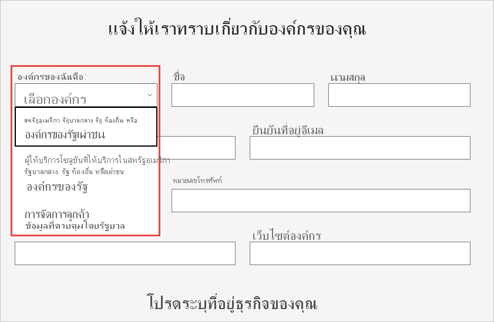

# ลงทะเบียนหน่วยงานราชการของสหรัฐ ของคุณใน Power BI serviceEnroll your US government organization in the Power BI service

มีบริการ Power BI รุ่นหนึ่งซึ่งเป็นส่วนหนึ่งของ [แผนสำหรับหน่วยงานรัฐใน Microsoft 365](https://www.microsoft.com/microsoft-365/government/compare-office-365-government-plans?rtc=1)There's a version of the Power BI service as part of the [Microsoft 365 Government plans](https://www.microsoft.com/microsoft-365/government/compare-office-365-government-plans?rtc=1). บทความนี้ออกแบบมาสำหรับลูกค้ารัฐบาลสหรัฐอเมริกา และกระบวนการลงทะเบียนที่อธิบายไว้ที่นี่แตกต่างจากบริการ Power BI เชิงพาณิชย์This article is designed for US government customers, and the enrollment process described here is different from the commercial version of the Power BI service.

สำหรับข้อมูลเพิ่มเติมเกี่ยวกับการบริการ Power BI สำหรับส่วนราชการสหรัฐ ให้ดู [Power BI สำหรับลูกค้าส่วนราชการสหรัฐ - ภาพรวม](service-govus-overview.md)For more information about the Power BI service for US government, check out [Power BI for United States government customers - Overview](service-govus-overview.md).

> [!NOTE]
> บทความนี้มีไว้สำหรับผู้ดูแลระบบที่มีอำนาจในการลงทะเบียนส่วนราชการสหรัฐสำหรับ Power BIThis article is intended for administrators who have authority to sign up their US government organization for Power BI. ถ้าคุณเป็นผู้ใช้ปลายทาง ให้ติดต่อผู้ดูแลระบบของคุณเกี่ยวกับการรับการสมัครใช้งาน Power BI ส่วนราชการสหรัฐIf you are an end-user, contact your administrator about getting a subscription to Power BI for US government.
> 
> 

## เลือกกระบวนการลงทะเบียนขวาสำหรับส่วนราชการสหรัฐSelect the right sign-up process for your US government organization

ส่วนราชการสหรัฐของคุณอาจจะใหม่กับระบบคลาวด์สำหรับส่วนราชการ หรืออาจมีการสมัครใช้งานอยู่แล้วได้Your US government organization might be new to the government cloud community, or might already have a subscription. ส่วนต่อไปนี้แสดงรายละเอียดขั้นตอนการลงทะเบียนโดยยึดตามตำแหน่งที่คุณอยู่ด้วยแผนสำหรับหน่วยงานรัฐใน  Microsoft 365 และ Power BIThe following sections detail the sign-up steps based on where you are with the Microsoft 365 Government plans and Power BI. ขั้นตอนเหล่านี้จะแตกต่างกันโดยขึ้นอยู่กับการลงทะเบียนปัจจุบันของคุณThe steps are different depending on your current enrollment.

หลังจากที่คุณสมัครใช้งาน Power BI สำหรับส่วนราชการสหรัฐแล้ว ให้ทำงานร่วมกับทีมบัญชีของคุณเพื่อเริ่ม [กระบวนการสร้างรายการอนุญาต](#additional-signup-information) ดังที่อธิบายไว้ในบทความนี้After you sign up for Power BI US government, work with your account team to start the [allow list process](#additional-signup-information) described in this article. ขั้นตอนนั้นจำเป็นต้องเปิดใช้งานองค์กรของคุณอย่างเต็มรูปแบบในระบบคลาวด์สำหรับส่วนราชการThat step is needed to fully enable your organization in the government community cloud.

## ลงทะเบียนสำหรับแผนสำหรับหน่วยงานรัฐใน Microsoft 365 ใหม่Sign up for a new Microsoft 365 Government plan

หากองค์กรของคุณยังใหม่ต่อระบบคลาวด์สำหรับส่วนราชการ ให้ทำตามขั้นตอนเหล่านี้เพื่อรับแผนสำหรับหน่วยงานรัฐใน Microsoft 365:If your organization is new to the government cloud community, follow these steps to get a Microsoft 365 Government plan:

> [!NOTE]
> ขั้นตอนเหล่านี้ควรดำเนินการโดยผู้ดูแลระบบส่วนกลางThese steps should be performed by the global administrator.
>

1. ไปที่ [แผนสำหรับหน่วยงานรัฐใน Microsoft 365](https://products.office.com/government/office-365-web-services-for-government)Go to [Microsoft 365 Government plans](https://products.office.com/government/office-365-web-services-for-government).
2. เลือก **เริ่มต้นใช้งานด้วยรุ่นทดลองฟรี**Select **Get started with a free trial**.
3. กรอกแบบฟอร์มเพื่อแจ้งให้เราทราบเกี่ยวกับองค์กรของคุณComplete the form to tell us about your organization. ใช้รายการแบบหล่นลงเพื่อเลือกประเภทองค์กรของคุณUse the drop-down to select your organization type.

   

4. ส่งฟอร์มเพื่อเริ่มกระบวนการออนบอร์ดSubmit the form to start the onboarding process. ตัวแทนของ Microsoft หรือคู่ค้าของคุณสามารถช่วยเหลือหากมีข้อสงสัยYour Microsoft representative or partner can help with any questions.

หลังจากกระบวนการนี้เสร็จสมบูรณ์ ให้ทำตามขั้นตอนสำหรับลูกค้า Microsoft 365 Government ที่มีอยู่เพื่อเพิ่มการสมัครใช้งาน Power BIAfter this process is complete, follow the steps for existing Microsoft 365 Government customers to add a Power BI subscription.

## เพิ่ม Power BI ไปยังแผนสำหรับหน่วยงานรัฐใน Microsoft 365Add Power BI to a Microsoft 365 Government plan

ถ้าองค์กรของคุณมีแผนสำหรับหน่วยงานรัฐใน Microsoft 365 แล้ว ให้ทำตามขั้นตอนเหล่านี้เพื่อเพิ่มการสมัครใช้งาน Power BI:If your organization already has a Microsoft 365 Government plan, follow these steps to add a Power BI subscription:

> [!NOTE]
> ขั้นตอนเหล่านี้ควรดำเนินการโดยผู้ดูแลระบบส่วนกลางThese steps should be performed by the global administrator.
> 
> 

1. ลงชื่อเข้าใช้ศูนย์การจัดการ Microsoft 365 โดยใช้ข้อมูลประจำตัวของผู้ดูแลระบบส่วนกลางหรือผู้ดูแลระบบการเรียกเก็บเงินของคุณSign in to the Microsoft 365 admin center, using your global admin or billing admin credentials.
2. เลือก **การเรียกเก็บเงิน** > **ซื้อบริการ**Select **Billing** > **Purchase services**.
4. ค้นหาหรือเลื่อนเพื่อค้นหาข้อเสนอ Power BI Pro สำหรับภาครัฐ และเลือก **ลอง** หรือ **ซื้อเดี๋ยวนี้**Search or scroll to locate the Power BI Pro Government offer and choose **Try** or **Buy Now**.
5. จบการสั่งซื้อของคุณComplete your order.
6. มอบหมายสิทธิการใช้งานให้กับบัญชีผู้ใช้Assign licenses to user accounts.

## ข้อมูลการลงทะเบียนเพิ่มเติมAdditional signup information

ก่อนที่คุณจะสามารถใช้บริการ Power BI สำหรับส่วนราชการสหรัฐ คุณต้องทำงานร่วมกับทีมบัญชี Microsoft ของคุณเพื่อเพิ่มองค์กรของคุณในรายการอนุญาตของเราBefore you can use US government Power BI services, you have to work with your Microsoft account team to have your organization added to our allow list. กระบวนการสร้างรายการอนุญาตคือกระบวนการที่ทีมวิศวกรรม Power BI ใช้เพื่อย้ายลูกค้าจากสภาพแวดล้อมระบบคลาวด์เชิงพาณิชย์ไปยังระบบคลาวด์ของส่วนราชการที่มีความปลอดภัยThe allow list process is used by the Power BI engineering team  to move customers from the commercial cloud environment into the secure, government community cloud. ขั้นตอนนี้ทำให้แน่ใจว่ามีฟีเจอร์ที่พร้อมใช้งานในระบบคลาวด์ของรัฐบาลสหรัฐอเมริกาตามที่คาดไว้This step ensures that features available in the US government cloud work as expected. 

หากต้องการเริ่มต้นกระบวนการสร้างรายการอนุญาต ให้ติดต่อทีมบัญชี Microsoft ของคุณเพื่อขอความช่วยเหลือTo start the allow list process, contact your Microsoft account team for assistance. เฉพาะผู้ดูแลระบบเท่านั้นที่สามารถร้องขอการเพิ่มข้อมูลไปยังรายการอนุญาตได้Only administrators can request addition to the allow list. กระบวนการใช้เวลาประมาณสามสัปดาห์The process takes about three weeks. ในระหว่างเวลานี้ ทีมวิศวกรรมของ Power BI ทำการเปลี่ยนแปลงที่เหมาะสมเพื่อให้แน่ใจว่า ผู้เช่าของคุณทำงานได้อย่างถูกต้องในระบบคลาวด์ของรัฐบาลสหรัฐอเมริกาDuring this time, the Power BI engineering team makes appropriate changes to ensure your tenant operates properly in the US government cloud.

## ขั้นตอนถัดไปNext steps

* [ภาพรวมของ Power BI สำหรับส่วนราชการสหรัฐOverview of Power BI for US government](service-govus-overview.md)
- [ฉันจะซื้อ Microsoft 365 Government ได้อย่างไรHow do I buy Microsoft 365 Government?](/office365/servicedescriptions/office-365-platform-service-description/office-365-us-government/microsoft-365-government-how-to-buy#how-do-i-buy-microsoft-365-government)