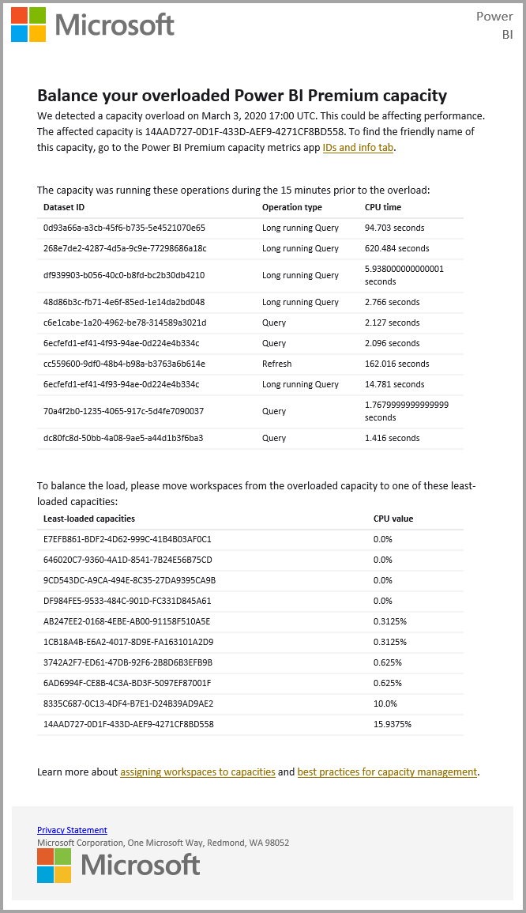

# การแจ้งเตือนการหยุดชะงักของบริการService interruption notifications

สิ่งสำคัญคือต้องมีข้อมูลเชิงลึกเกี่ยวกับความพร้อมใช้งานของแอปพลิเคชันทางธุรกิจที่สำคัญสำหรับภารกิจของคุณIt's important to have insight to availability of your mission-critical business applications. Power BI มีการแจ้งเตือนเหตุการณ์เพื่อให้คุณสามารถเลือกรับอีเมลได้ถ้ามีการหยุดทำงานหรือการลดประสิทธิภาพของบริการPower BI provides incident notification so you can optionally receive emails if there's a service disruption or degradation. ในขณะที่ข้อตกลงระดับบริการของ Power BI (SLA) อยู่ที่ 99.9% ทำให้เกิดเหตุการณ์เหล่านี้ไม่บ่อย แต่เราต้องการให้แน่ใจว่าคุณได้รับการแจ้งให้ทราบWhile the Power BI 99.9% service level agreement (SLA) makes these occurrences rare, we want to ensure that you're kept informed. หน้าจอต่อไปนี้แสดงชนิดของอีเมลที่คุณจะได้รับถ้าคุณเปิดใช้งานการแจ้งเตือน:The following screenshot shows the type of email you'll receive if you enable notifications:

ในตอนนี้ เราจะส่งอีเมลสำหรับ _สถานการณ์ความน่าเชื่อถือ_ ดังต่อไปนี้:At this time, we send emails for the following _reliability scenarios_:

- เปิดความน่าเชื่อถือของรายงานOpen report reliability
- ความน่าเชื่อถือของการรีเฟรชแบบจำลองModel refresh reliability
- ความน่าเชื่อถือของการรีเฟรชคิวรีQuery refresh reliability

การแจ้งเตือนจะถูกส่งไปเมื่อมี _ความล่าช้าที่ขยายออกไป_ ในการดำเนินงาน เช่น การเปิดรายงาน การรีเฟรชชุดข้อมูล หรือการดำเนินการคิวรีNotifications are sent when there's an _extended delay_ in operations like opening reports, dataset refresh, or query executions. หลังจากที่มีการแก้ไขปัญหาแล้ว คุณจะได้รับอีเมลการติดตามผลAfter an incident is resolved, you receive a follow-up email.

> [!NOTE]
> ปัจจุบัน คุณลักษณะนี้พร้อมใช้งานสำหรับความจุใน Power BI Premium เท่านั้นThis feature is currently available only for capacities in Power BI Premium. ซึ่งไม่พร้อมใช้งานสำหรับความจุที่ใช้ร่วมกันหรือฝังไว้It's not available for shared or embedded capacity.

## ความจุและการแจ้งเตือนความมั่นคงCapacity and reliability notifications

เมื่อความจุของ Power BI Premium ประสบกับปัญหาการใช้ทรัพยากรสูงในระยะยาวที่อาจส่งผลต่อความมั่นคงได้ ระบบจะส่งอีเมลแจ้งเตือนออกไปWhen a Power BI Premium capacity is experiencing extended periods of high resource use that potentially impacts reliability, a notification email is sent. ตัวอย่างของผลกระทบดังกล่าวหมายรวมถึงความล่าช้าในการทำงานมากยิ่งขึ้น เช่น การเปิดรายงาน การรีเฟรชชุดข้อมูล และการประมวลคำถามExamples of such impacts include extended delays in operations such as opening a report, dataset refresh, and query executions. 

อีเมลแจ้งเตือนจะให้ข้อมูลเกี่ยวกับเหตุผลในการใช้ทรัพยากรสูง รวมถึงข้อมูลต่อไปนี้:The notification email provides information about the reason for the high resource usage, including the following details:

* รหัสชุดข้อมูลของชุดข้อมูลที่รับผิดชอบDataset ID of the responsible dataset
* ประเภทการดำเนินการOperation type
* เวลาการใช้งาน CPU จะเกี่ยวข้องกับการใช้ทรัพยากรสูงCPU time associated with the high resource usage. นี่คือ[คำจำกัดความของเวลาของ CPU ](https://wikipedia.org/wiki/CPU_time) ในวิกิพีเดียHere's the [definition of CPU time](https://wikipedia.org/wiki/CPU_time) in Wikipedia.

และ Power BI จะส่งการแจ้งเตือนทางอีเมลเมื่อตรวจพบว่ามีการใช้งาน Power BI Premium เกินความจุPower BI also sends email notifications when an overload in a Power BI Premium capacity is detected. อีเมลจะอธิบายเหตุผลที่อาจก่อให้เกิดการโอเวอร์โหลด ซึ่งคือการดำเนินการที่ก่อโหลดในช่วง 10 นาทีก่อนหน้าและปริมาณของโหลดของแต่ละการดำเนินการThe email explains the likely reason for the overload, which operations generated the load in the previous 10 minutes, and how much load each operation generated.

ถ้าคุณมีความจุแบบพรีเมียมมากกว่าหนึ่งรายการ อีเมลจะประกอบด้วยข้อมูลเกี่ยวกับกำลังการผลิตเหล่านั้นในช่วงเวลาที่โอเวอร์โหลดIf you have more than one Premium capacity, the email includes information about those capacities during the overloaded period. ข้อมูลนี้ช่วยให้คุณสามารถพิจารณาย้ายพื้นที่ทำงานที่มีรายการที่มีทรัพยากรที่มีความจุกับการโหลดน้อยที่สุดThis info helps you consider moving the workspaces containing resource-intensive items to capacities with the least load.

ระบบจะส่งอีเมลแจ้งเตือนการโอเวอร์โหลดเฉพาะเมื่อมีการใช้งานถึงขีดจำกัดการโอเวอร์โหลดเท่านั้นOverload email notifications are only sent when an overload threshold is triggered. คุณจะไม่ได้รับอีเมลฉบับต่อมาอีกในกรณีที่โหลดบนความจุแบบพรีเมียมคืนกลับสู่ระดับที่ไม่โอเวอร์โหลดYou won't receive a second email when the load on that Premium capacity returns to non-overloaded levels.

รูปภาพต่อไปนี้แสดงตัวอย่างของอีเมลแจ้งเตือน:The following image shows an example notification email:

## เปิดใช้งานการแจ้งเตือนEnable notifications

ผู้ดูแลระบบ Power BI จะเปิดใช้งานการแจ้งเตือนในพอร์ทัลผู้ดูแลระบบ:A Power BI admin enables notifications in the admin portal:

1. ระบุหรือสร้างกลุ่มความปลอดภัยที่เปิดใช้งานอีเมลซึ่งควรได้รับการแจ้งเตือนIdentify or create an email-enabled security group that should receive notifications.

1. ในพอร์ทัลผู้ดูแลระบบ ให้เลือก **การตั้งค่าผู้เช่า**In the admin portal, select **Tenant settings**. ภายใต้ **วิธีใช้และการตั้งค่าการสนับสนุน** ขยาย **รับการแจ้งเตือนทางอีเมลสำหรับบริการขัดข้องหรือเหตุการณ์**Under **Help and support settings**, expand **Receive email notifications for service outages or incidents**.

1. เปิดใช้งานการแจ้งเตือน ให้ใส่กลุ่มความปลอดภัยและเลือก **นำไปใช้**Enable notifications, enter a security group, and select **Apply**.

    

> [!NOTE]
> Power BI ส่งการแจ้งเตือนจากบัญชีno-reply-powerbi@microsoft.comPower BI sends notifications from the account no-reply-powerbi@microsoft.com. ตรวจสอบให้แน่ใจว่าบัญชีนี้ถูกเพิ่มในรายการผู้ส่งที่ปลอดภัยของคุณเพื่อไม่ให้การแจ้งเตือนอีเมลปรากฏอยู่ในโฟลเดอร์อีเมลขยะEnsure that this account is added to your safe sender list so that notifications don't end up in a junk email folder.

## สถานภาพบริการใน Microsoft 365Service health in Microsoft 365

บทความนี้อธิบายวิธีการรับการแจ้งเตือนบริการผ่าน Power BIThis article describes how to receive service notifications through Power BI. นอกจากนี้ คุณยังสามารถตรวจสอบสถานภาพบริการของ Power BI สุขภาพผ่าน Microsoft 365 ได้อีกด้วยYou can also monitor Power BI service health through Microsoft 365. เข้าร่วมเพื่อรับการแจ้งเตือนทางอีเมลเกี่ยวกับสถานภาพบริการจาก Microsoft 365Opt in to receive email notifications about service health from Microsoft 365. เรียนรู้เพิ่มเติมใน [วิธีการตรวจสอบสถานภาพบริการใน Microsoft 365](/microsoft-365/enterprise/view-service-health)Learn more in [How to check Microsoft 365 service health](/microsoft-365/enterprise/view-service-health).

## ขั้นตอนถัดไปNext steps

[ตัวเลือกการสนับสนุน Power BI Pro และ Power BI PremiumPower BI Pro and Power BI Premium support options](service-support-options.md)

มีคำถามเพิ่มเติมหรือไม่More questions? [ลองไปที่ชุมชน Power BITry the Power BI Community](https://community.powerbi.com/)