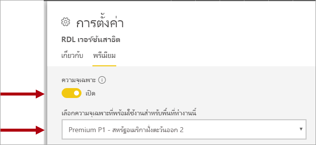
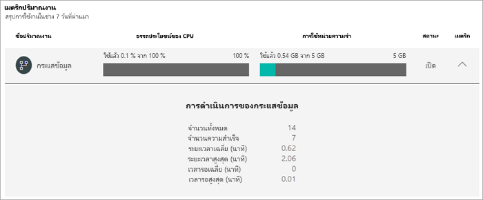
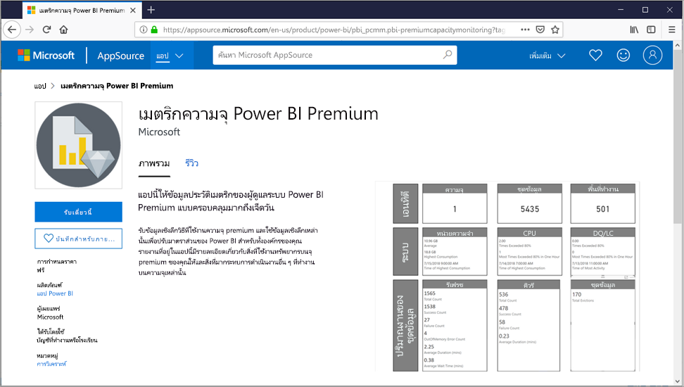

# การจัดการความจุแบบพรีเมียมManaging Premium capacities

การจัดการ Power BI Premium เกี่ยวข้องกับ การสร้าง การจัดการ และการตรวจสอบความจุแบบพรีเมียมManaging Power BI Premium involves creating, managing, and monitoring Premium capacities. บทความนี้ให้ดูภาพรวมของความจุให้ดู[ตัวเลขและการจัดการความจุ](service-admin-premium-manage.md)พรีเมียมทีละขั้นตอนThis article provides an overview of capacities; see [Configure and manage capacities](service-admin-premium-manage.md) for step-by-step instructions.

## การสร้างและการจัดการความจุCreating and managing capacities

หน้า **การตั้งค่าความจุ** ของพอร์ทัลผู้ดูแลระบบ Power BI จะแสดงจำนวนวี-คอร์ที่ซื้อและความจุแบบพรีเมียมพร้อมใช้งานThe **Capacity Settings** page of the Power BI Admin portal displays the number of v-cores purchased and Premium capacities available. หน้านี้ช่วยให้ผู้ดูแลระบบส่วนกลาง หรือผู้ดูแลระบบบริการของ Power BI สามารถสร้างความจุแบบพรีเมียมจากวี-คอร์ที่พร้อมใช้งาน หรือปรับเปลี่ยนความจุแบบพรีเมียมที่มีอยู่The page allows Global administrators or Power BI service administrators to create Premium capacities from available v-cores, or to modify existing Premium capacities.

> [!NOTE]
> Power BI Premium เพิ่งเปิดตัว Premium เวอร์ชันใหม่ชื่อ **Premium Gen2** ซึ่งกำลังอยู่ในช่วงการแสดงตัวอย่างPower BI Premium recently released a new version of Premium, called **Premium Gen2**, which is currently in preview. Premium Gen2 จะทำให้การจัดการความจุระดับพรีเมียมง่ายขึ้นและลดค่าใช้จ่ายในการจัดการPremium Gen2 will simplify the management of Premium capacities, and reduce management overhead. สำหรับข้อมูลเพิ่มเติม โปรดดูที่ [Power BI Premium Generation 2 (ตัวอย่าง)](service-premium-what-is.md#power-bi-premium-generation-2-preview)For more information, see [Power BI Premium Generation 2 (preview)](service-premium-what-is.md#power-bi-premium-generation-2-preview).

เมื่อสร้างความจุแบบพรีเมียม ผู้ดูแลระบบจะต้องกำหนด:When creating a Premium capacity, administrators are required to define:

- ชื่อความจุ (ที่ไม่ซ้ำกันภายในผู้เช่า)Capacity name (unique within the tenant).
- ผู้ดูแลระบบความจุCapacity admin(s).
- ขนาดความจุCapacity size.
- ภูมิภาคสำหรับที่อยู่ข้อมูลRegion for data residency.

ต้องกำหนดผู้ดูแลระบบความจุอย่างน้อยหนึ่งคนAt least one Capacity Admin must be assigned. ผู้ใช้ที่เป็นผู้ดูแลระบบความจุสามารถ:Users assigned as Capacity Admins can:

- กำหนดพื้นที่ทำงานสำหรับความจุAssign workspaces to the capacity.
- จัดการสิทธิ์ของผู้ใช้ เพื่อเพิ่มผู้ดูแลระบบความจุเพิ่มเติมหรือผู้ใช้ที่มีสิทธิ์ในการกำหนด (เพื่อให้พวกเขาสามารถกำหนดพื้นที่ทำงานของความจุ)Manage user permissions, to add additional Capacity Admins or users with assignment permissions (to enable them to assign workspaces to the capacity).
- จัดการปริมาณงาน เพื่อกำหนดค่าการใช้หน่วยความจำสูงสุดสำหรับรายงานที่มีการแบ่งหน้าและปริมาณงานของกระแสข้อมูลManage workloads, to configure maximum memory usage for paginated reports and dataflows workloads.
- รีสตาร์ทความจุ เพื่อรีเซ็ตการทำงานทั้งหมดในกรณีที่ระบบโอเวอร์โหลดRestart the capacity, to reset all operations because of a system overload.

ผู้ดูแลระบบความจุไม่สามารถเข้าถึงเนื้อหาพื้นที่ทำงานเว้นแต่จะได้รับมอบหมายอย่างชัดเจนในสิทธิ์ของพื้นที่ทำงานCapacity Admins cannot access workspace content unless explicitly assigned in workspace permissions. ผู้ดูแลความจุไม่สามารถเข้าถึงพื้นที่ทั้งหมดของผู้ดูแลระบบ Power BI (เว้นแต่จะมีการกำหนดไว้อย่างชัดเจน) เช่น เมตริกการใช้งาน บันทึกการตรวจสอบ หรือการตั้งค่าผู้เช่าThey also don't have access to all Power BI admin areas (unless explicitly assigned) such as usage metrics, audit logs, or tenant settings. ที่สำคัญ ผู้ดูแลระบบความจุไม่มีสิทธิ์ในการสร้างความจุใหม่ หรือปรับขนาดความจุที่มีอยู่Importantly, Capacity Admins do not have permissions to create new capacities or scale existing capacities. ผู้ดูแลระบบยังได้รับมอบหมายตามข้อมูลพื้นฐานของความจุเพื่อให้มั่นใจว่าจะสามารถดูและจัดการความจุตามที่ได้รับมอบหมายเท่านั้นAdmins are assigned on a per capacity basis, ensuring that they can only view and manage capacities to which they are assigned.

ขนาดความจุถูกเลือกจากรายการที่มีของตัวเลือก SKU ซึ่งถูกจำกัดด้วยจำนวนของวี-คอร์ที่พร้อมใช้งานในกลุ่มCapacity size is selected from an available list of SKU options, which is constrained by the number of available v-cores in the pool. โดยมีความเป็นไปได้ที่จะสร้างความจุหลายอย่างจากกลุ่ม ซึ่งสามารถจัดหาได้จาก SKU ที่ซื้ออย่างน้อยหนึ่งรายการIt's possible to create multiple capacities from the pool, which could be sourced from one or more purchased SKUs. ตัวอย่างเช่น P3 SKU (32 วี-คอร์) สามารถใช้เพื่อสร้างความจุสามแบบได้แก่ P2 หนึ่ง (16 วี-คอร์), และ P1 สอง (2 x 8 วี-คอร์) ได้For example, a P3 SKU (32 v-cores) could be used to create three capacities: one P2 (16 v-cores), and two P1 (2 x 8 v-cores). ประสิทธิภาพที่เพิ่มขึ้นและการปรับมาตราส่วนสามารถทำได้โดยการสร้างความจุที่มีขนาดเล็กกว่า และหัวข้อนี้จะกล่าวถึงในบทความ[การปรับความจุแบบพรีเมียมให้เหมาะสม](service-premium-capacity-optimize.md)Improved performance and scale can be achieved by creating smaller sized capacities, as described in the [Optimizing Premium Capacities](service-premium-capacity-optimize.md) article. ภาพต่อไปนี้แสดงตัวอย่างการตั้งค่าสำหรับองค์กร Contoso ที่สมมติขึ้น ซึ่งประกอบด้วยความจุแบบพรีเมียมห้าแบบ (3 x P1 และ 2 x P3) โดยแต่ละความจุประกอบด้วยพื้นที่ทำงาน และพื้นที่ทำงานหลายแห่งในความจุที่ใช้ร่วมกันThe following image shows an example setup for the fictitious Contoso organization consisting of five Premium capacities (3 x P1, and 2 x P3) with each containing workspaces, and several workspaces in shared capacity.

สามารถกำหนดความจุพรีเมียมให้กับภูมิภาคอื่นนอกเหนือจากภูมิภาคหลักของผู้เช่า Power BI ที่เรียกว่าภูมิศาสตร์หลายแบบA Premium capacity can be assigned to a region other than the home region of the Power BI tenant, known as multi-geo. หลายภูมิศาสตร์ให้การควบคุมระดับผู้ดูแลที่ศูนย์การผลิตภายในภูมิภาคทางภูมิศาสตร์ของคุณมีเนื้อหา Power BI ของคุณอยู่Multi-geo provides administrative control over which datacenters within defined geographic regions your Power BI content resides. เหตุผลสำหรับการปรับใช้ในหลายภูมิศาสตร์นั้น โดยทั่วไปแล้วสำหรับการปฏิบัติตามกฎระเบียบขององค์กรหรือรัฐบาลมากกว่าประสิทธิภาพและขนาดThe rationale for a multi-geo deployment is typically for corporate or government compliance, rather than performance and scale. การโหลดรายงานและแดชบอร์ดยังเกี่ยวข้องกับคำขอในภูมิภาคหลักสำหรับเมตาดาต้าReport and dashboard loading still involves requests to the home region for metadata. เมื่อต้องการเรียนรู้เพิ่มเติม ดูที่ [การสนับสนุนแบบ Multi-Geo สำหรับ Power BI Premium](service-admin-premium-multi-geo.md)To learn more, see [Multi-Geo support for Power BI Premium](service-admin-premium-multi-geo.md).

ผู้ดูแลระบบบริการของ Power BI และผู้ดูแลระบบส่วนกลาง สามารถปรับเปลี่ยนความจุแบบพรีเมียมได้Power BI service administrators and Global Administrators can modify Premium capacities. โดยเฉพาะ ผู้ใช้สามารถที่จะ:Specifically, they can:

- เปลี่ยนขนาดความจุเพื่อขยายหรือลดแหล่งทรัพยากรChange the capacity size to scale-up or scale-down resources.
- เพิ่มหรือลบผู้ดูแลระบบความจุAdd or remove Capacity Admins.
- เพิ่มหรือลบผู้ใช้ที่มีสิทธิ์ในการกำหนดAdd or remove users that have assignment permissions.
- เพิ่มหรือลบปริมาณงานเพิ่มเติมAdd or remove additional workloads.
- เปลี่ยนภูมิภาคChange regions.

ต้องใช้สิทธิ์ในการกำหนดเพื่อกำหนดพื้นที่ทำงานของความจุแบบพรีเมียมที่เฉพาะเจาะจงAssignment permissions are required to assign a workspace to a specific Premium capacity. สิทธิ์สามารถมอบให้กับทั้งองค์กร ผู้ใช้ หรือกลุ่มที่เฉพาะเจาะจงThe permissions can be granted to the entire organization, specific users, or groups.

ตามค่าเริ่มต้น ความจุแบบพรีเมียมจะสนับสนุนปริมาณงานที่เชื่อมโยงกับการเรียกใช้คิวรี Power BIBy default, Premium capacities support workloads associated with running Power BI queries. กำลังการผลิตของ premium ยังรองรับปริมาณงานเพิ่มเติม **AI (บริการด้านการรับรู้)** **รายงานแบบคั่นหน้า** และ **กระแสข้อมูล**Premium capacities also support additional workloads: **AI (Cognitive Services)**, **Paginated Reports**, and **Dataflows**. ปริมาณงานแต่ละรายการต้องกำหนดค่าหน่วยความจำสูงสุด (เป็นเปอร์เซ็นต์ของผลรวมหน่วยความจำที่พร้อมใช้งาน) ที่สามารถใช้ได้ตามปริมาณงานEach workload requires configuring the maximum memory (as a percentage of total available memory) that can be used by the workload. คุณจะต้องเข้าใจว่าการเพิ่มการปันส่วนหน่วยความจำสูงสุดอาจมีผลกระทบต่อจำนวนของแบบจำลองที่ใช้งานที่สามารถกำหนดเป็นโฮสต์ และอัตราความเร็วของการรีเฟรชIt's important to understand that increasing maximum memory allocations can impact the number of active models that can be hosted and the throughput of refreshes. 

ระบบได้จัดสรรหน่วยความจำให้กับกระแสข้อมูลเชิงไดนามิก แต่ในเชิงสแตติกแล้วระบบได้จัดสรรหน่วยความจำนั้นให้กับรายงานที่มีการแบ่งหน้าMemory is dynamically allocated to dataflows, but is statically allocated to paginated reports. เหตุผลสำหรับการปันส่วนหน่วยความจำสูงสุดแบบคงที่คือรายงานที่มีการแบ่งแบ่งหน้าจะทำงานภายในพื้นที่ความจุที่มีความปลอดภัยThe reason for statically allocating the maximum memory is that paginated reports run within a secured contained space of the capacity. ควรใช้ความระมัดระวังเมื่อตั้งค่าหน่วยความจำของรายงานที่มีการแบ่งหน้าเนื่องจากจะลดหน่วยความจำที่มีอยู่สำหรับโหลดแบบจำลองCare should be taken when setting paginated reports memory as it reduces available memory for loading models. เมื่อต้องการเรียนรู้เพิ่มเติมให้ดู[การตั้งค่าหน่วยความจำเริ่มต้น](service-admin-premium-workloads.md#default-memory-settings)To learn more, see the [Default memory settings](service-admin-premium-workloads.md#default-memory-settings).

การลบความจุแบบพรีเมียมสามารถทำได้และจะไม่ส่งผลให้มีการลบพื้นที่ทำงานและเนื้อหาของความจุDeleting a Premium capacity is possible and won't result in the deletion of its workspaces and content. แต่ย้ายพื้นที่ทำงานที่กำหนดไว้ต่าง ๆ ไปยังความจุที่ใช้ร่วมกันInstead, it moves any assigned workspaces to shared capacity. เมื่อความจุแบบพรีเมียมถูกสร้างขึ้นในภูมิภาคอื่น พื้นที่ทำงานถูกย้ายไปยังความจุที่ใช้ร่วมกันของภูมิภาคหลักWhen the Premium capacity was created in a different region, the workspace is moved to shared capacity of the home region.

### การกำหนดพื้นที่ทำงานในความจุAssigning workspaces to capacities

คุณสามารถกำหนดพื้นที่ทำงานสำหรับความจุแบบพรีเมียมในพอร์ทัลผู้ดูแลระบบ Power BI หรือสำหรับพื้นที่ทำงานในบานหน้าต่างของ **พื้นที่ทำงาน**Workspaces can be assigned to a Premium capacity in the Power BI Admin portal or, for a workspace, in the **Workspace** pane.

ผู้ดูแลระบบความจุ ตลอดจนผู้ดูแลระบบส่วนกลาง หรือผู้ดูแลระบบบริการของ Power BI สามารถกำหนดพื้นที่ทำงานจำนวนมากในพอร์ทัลผู้ดูแลระบบ Power BI ได้Capacity Admins, as well as Global Administrators or Power BI service administrators, can bulk assign workspaces in the Power BI Admin portal. กลุ่มที่กำหนดไว้สามารถนำไปใช้กับ:Bulk assigned can apply to:

- **พื้นที่ทำงานโดยผู้ใช้** - พื้นที่ทำงานทั้งหมดที่ผู้ใช้เหล่านั้นเป็นเจ้าของ รวมถึงพื้นที่ทำงานส่วนบุคคลได้รับการกำหนดไว้สำหรับความจุแบบพรีเมียม**Workspaces by users** - All workspaces owned by those users, including personal workspaces, are assigned to the Premium capacity. ซึ่งจะรวมถึงการกำหนดพื้นที่ทำงานใหม่เมื่อพื้นที่ทำงานเหล่านั้นถูกกำหนดไว้สำหรับความจุแบบพรีเมียมอื่นแล้วThis will include the reassignment of workspaces when they are already assigned to a different Premium capacity. นอกจากนี้ ผู้ใช้ยังจะได้รับสิทธิ์ในการกำหนดพื้นที่ทำงานIn addition, the users are also assigned workspace assignment permissions.

- **พื้นที่ทำงานเฉพาะ****Specific workspaces**
- **พื้นที่ทำงานทั้งหมดขององค์กร** - พื้นที่ทำงานทั้งหมด รวมถึงพื้นที่ทำงานส่วนบุคคลได้รับการกำหนดไว้สำหรับความจุแบบพรีเมียม**The entire organization's workspaces** - All workspaces, including personal workspaces, are assigned to the Premium capacity. ผู้ใช้ปัจจุบันและผู้ใช้ในอนาคตทั้งหมดยังจะได้รับสิทธิ์ในการกำหนดพื้นที่ทำงานAll current and future users are assigned workspace assignment permissions. ไม่แนะนำให้ใช้วิธีการนี้This approach is not recommended. ต้องการวิธีการที่กำหนดเป้าหมายมากขึ้นA more targeted approach is preferred.

สามารถเพิ่มพื้นที่ทำงานในความจุแบบพรีเมียมโดยใช้บานหน้าต่างของ **พื้นที่ทำงาน** โดยผู้ใช้เป็นทั้งผู้ดูแลระบบพื้นที่ทำงานและมีสิทธิ์ในการกำหนดA workspace can be added to a Premium capacity by using the **Workspace** pane providing the user is both a workspace admin and has assignment permissions.

ผู้ดูแลระบบพื้นที่ทำงานสามารถลบพื้นที่ทำงานจากความจุ (สำหรับความจุที่ใช้ร่วมกัน) โดยไม่จำเป็นต้องมีสิทธิ์ในการกำหนดWorkspace admins can remove a workspace from a capacity (to shared capacity) without requiring assignment permission. การลบพื้นที่ทำงานออกจากความจุเฉพาะที่เป็นผลจะย้ายตำแหน่งพื้นที่ทำงานไปยังความจุที่ใช้ร่วมกันRemoving workspaces from dedicated capacities effectively relocates the workspace to shared capacity. โปรดทราบว่าการลบพื้นที่ทำงานออกจากความจุแบบพรีเมียมอาจมีผลกระทบด้านลบ ตัวอย่างเช่น ในเนื้อหาที่แชร์จะไม่สามารถใช้งานได้กับผู้ใช้ที่ได้รับสิทธิ์ Power BI Free หรือการระงับการรีเฟรชตามกำหนดเวลาเมื่อเกินค่าเผื่อที่รองรับโดยความจุที่ใช้ร่วมกันNote that removing a workspace from a Premium capacity may have negative consequences resulting, for example, in shared content becoming unavailable to Power BI Free licensed users, or the suspension of scheduled refresh when they exceed the allowances supported by shared capacities.

ในบริการของ Power BI พื้นที่ทำงานที่กำหนดไว้สำหรับความจุแบบพรีเมียมสามารถระบุได้ง่ายโดยไอคอนข้าวหลามตัดที่ติดชื่อของพื้นที่ทำงานIn the Power BI service, a workspace assigned to a Premium capacity is easily identified by the diamond icon that adorns the workspace name.

## การตรวจสอบความจุMonitoring capacities

การตรวจสอบความจุแบบพรีเมียมช่วยให้ผู้ดูแลระบบเข้าใจถึงวิธีการทำงานของความจุMonitoring Premium capacities provides administrators with an understanding of how the capacities are performing. สามารถตรวจสอบความจุได้โดยใช้พอร์ทัลผู้ดูแลระบบ Power BI หรือแอปเมตริก **Power BI Premium (Power BI)**Capacities can be monitored by using the Power BI Admin portal or the **Power BI Premium Capacity Metrics** (Power BI) app.

### พอร์ทัลผู้ดูแลระบบ Power BIPower BI Admin portal

ในพอร์ทัลผู้ดูแลสำหรับแต่ละความจุแท็บ **สุขภาพ** มีเมตริกสรุปสำหรับความจุและปริมาณงานที่เปิดใช้แต่ละรายการIn the Admin portal, for each capacity, the **Health** tab provides summary metrics for the capacity and each enabled workload. เมตริกแสดงค่าเฉลี่ยในเจ็ดวันที่ผ่านมาMetrics show an average over the past seven days.  

ในระดับกำลังการผลิตเมตริกจะสะสมของปริมาณงานที่เปิดใช้ทั้งหมดAt the capacity level, metrics are cumulative of all enabled workloads. มีการระบุเมตริกดังต่อไปนี้:the following metrics are provided:

- **การใช้ CPU อย่างเต็มประสิทธิภาพ** - ให้การใช้งาน cpu โดยเฉลี่ยเป็นเปอร์เซ็นต์ของ cpu ที่พร้อมใช้ทั้งหมดสำหรับความจุ**CPU UTILIZATION** - Provides average CPU utilization as a percentage of total available CPU for the capacity.  
- **การใช้หน่วยความจำ** - ให้การใช้หน่วยความจำเฉลี่ย (GB) เป็นผลรวมของหน่วยความจำที่พร้อมใช้งานสำหรับความจุ**MEMORY USAGE** - Provides average memory usage (in GB) as a total of available memory for the capacity. 

สำหรับแต่ละปริมาณงานที่เปิดใช้การใช้งาน CPU และหน่วยความจำที่มีให้เช่นเดียวกับจำนวนของเมตริกที่ระบุปริมาณงานFor each enabled workload, CPU utilization and memory usage are provided, as well as a number of workload specific metrics. ตัวอย่างเช่นสำหรับปริมาณงานกระแสข้อมูล **จำนวนรวม** แสดงการรีเฟรชทั้งหมดสำหรับแต่ละกระแสข้อมูล และ **ระยะเวลาเฉลี่ย** แสดงระยะเวลาโดยเฉลี่ยของการฟื้นฟูกระแสข้อมูลFor example, for the Dataflow workload, **Total Count** shows total refreshes for each dataflow, and **Average Duration** shows the average duration of refresh for the dataflow.

หากต้องการเรียนรู้เพิ่มเติมเกี่ยวกับเมตริกที่พร้อมใช้งานทั้งหมดสำหรับแต่ละปริมาณให้[ดูการตรวจสอบความจุในพอร์ทัลผู้ดูแล](service-admin-premium-monitor-portal.md)To learn more about all available metrics for each workload, see [Monitor capacities in the Admin portal](service-admin-premium-monitor-portal.md).

การตรวจสอบขีดความสามารถในพอร์ทัลผู้ดูแลระบบ Power BI  ได้รับการออกแบบมาเพื่อช่วยให้สามารถสรุปเมตริก์ความจุหลักได้อย่างรวดเร็วThe monitoring capabilities in the Power BI Admin portal are designed to provide a quick summary of key capacity metrics. สำหรับรายละเอียดเพิ่มเติมเกี่ยวกับการตรวจสอบ แนะนำให้คุณใช้แอป **เมตริกความจุ Power BI Premium**For more detailed monitoring, it's recommended you use the **Power BI Premium Capacity Metrics** app.

### แอปเมตริกความจุ Power BI PremiumPower BI Premium Capacity Metrics app

แอป[เมตริกความจุ Power BI Premium](https://appsource.microsoft.com/en-us/product/power-bi/pbi_pcmm.capacity-metrics-dxt?tab=Overview) คือแอป Power BI ที่สามารถใช้ได้สำหรับผู้ดูแลระบบความจุ และติดตั้งเช่นเดียวกับแอป Power BI อื่น ๆThe [Power BI Premium Capacity Metrics app](https://appsource.microsoft.com/en-us/product/power-bi/pbi_pcmm.capacity-metrics-dxt?tab=Overview) is a Power BI app available to capacity admins and is installed like any other Power BI app. ซึ่งประกอบด้วยแดชบอร์ดและรายงานIt contains a dashboard and report.

เมื่อแอปเปิดขึ้น แดชบอร์ดจะถูกโหลดเพื่อแสดงไทล์จำนวนมากที่แสดงมุมมองโดยรวมของความจุทั้งหมดที่ผู้ใช้เป็นผู้ดูแลระบบความจุ เค้าโครงแดชบอร์ดประกอบด้วยส่วนหลักห้าส่วน:When the app opens, the dashboard is loaded to present numerous tiles expressing an aggregated view over all capacities of which the user is a Capacity Admin. The dashboard layout includes five main sections:

- **ภาพรวม** - เวอร์ชันแอป จำนวนของความจุและพื้นที่ทำงาน**Overview** - App version, number of capacities and workspaces
- **การสรุปของระบบ** - หน่วยความจำและเมตริกของ CPU**System Summary** - Memory and CPU metrics
- **สรุปชุดข้อมูล** - จำนวนของชุดข้อมูล, DQ/LC, เมตริกการรีเฟรชและการคิวรี**Dataset Summary** - Number of datasets, DQ/LC, refresh, and query metrics
- **การสรุปชุดข้อมูล** - จำนวนกระแสข้อมูล และเมตริกชุดข้อมูล**Dataflow Summary** - Number of dataflows, and dataset metrics
- **สรุปรายงานการแบ่งหน้า** - รายงานจน-รีเฟรชและดูเมตริก**Paginated Report Summary** - Refresh and view metrics

รายงานเบื้องต้น (จากแดชบอร์ดที่ปักหมุดไว้) สามารถเข้าถึงได้โดยคลิกที่ไทล์แดชบอร์ดต่าง ๆThe underlying report, from which the dashboard tiles were pinned, can be accessed by clicking on any dashboard tile. ซึ่งแสดงมุมมองรายละเอียดเพิ่มเติมของแต่ละส่วนแดชบอร์ด และสนับสนุนการกรองแบบโต้ตอบIt provides a more detailed perspective of each of the dashboard sections and supports interactive filtering. 

การกรองสามารถทำได้โดยการตั้งค่าตัวแบ่งส่วนข้อมูลตามช่วงวัน ความจุ พื้นที่ทำงาน และปริมาณงาน (รายงาน ชุดข้อมูล กระแสข้อมูล) และโดยการเลือกองค์ประกอบภายในวิชวลการรายงานเพื่อกรองข้ามหน้ารายงานFiltering can be achieved by setting slicers by date range, capacity, workspace and workload (report, dataset, dataflow), and by selecting elements within report visuals to cross filter the report page. การกรองข้ามเป็นเทคนิคที่มีประสิทธิภาพเพื่อจำกัดช่วงเวลา ความจุพื้นที่ทำงาน ชุดข้อมูล และอื่น ๆ ที่เฉพาะเจาะจงให้แคบลง และจะมีประโยชน์มากเมื่อทำการวิเคราะห์สาเหตุของปัญหาCross filtering is a powerful technique to narrow down to specific time periods, capacities, workspaces, datasets, etc. and can be very helpful when performing root cause analysis.

สำหรับข้อมูลโดยละเอียดเกี่ยวกับแดชบอร์ดและเมตริกรายงานในแอปให้ดู[ที่การตรวจสอบความจุพรีเมียมด้วยแอป](service-admin-premium-monitor-capacity.md)For detailed information about dashboard and report metrics in the app, see [Monitor Premium capacities with the app](service-admin-premium-monitor-capacity.md).

### เมตริกการแปลInterpreting metrics

เมตริกควรได้รับการตรวจสอบเพื่อสร้างความเข้าใจพื้นฐานเกี่ยวกับกิจกรรมการใช้งานแหล่งทรัพยากรและปริมาณงานMetrics should be monitored to establish a baseline understanding of resource usage and workload activity. หากความจุช้าลง คุณจะต้องเข้าใจว่าเมตริกใดที่จะตรวจสอบและข้อสรุปที่คุณสามารถทำได้If the capacity becomes slow, it is important to understand which metrics to monitor, and the conclusions you can make.

โดยปกติ คิวรีควรจะเสร็จสมบูรณ์ภายในเสี้ยววินาทีเพื่อส่งมอบประสบการณ์การตอบสนองแก่ผู้ใช้รายงาน และช่วยให้อัตราความเร็วของการคิวรีสูงขึ้นIdeally, queries should complete within a second to deliver responsive experiences to report users and enable higher query throughput. โดยปกติแล้ว ข้อจำกัดจะน้อยลงเมื่อการประมวลผลเบื้องหลัง รวมถึงการรีเฟรช ใช้เวลานานขึ้นในการดำเนินการให้เสร็จสมบูรณ์It is usually of lesser concern when background processes - including refreshes - take longer times to complete.

โดยทั่วไป รายงานช้าอาจเป็นการบ่งชี้ว่าความจุกำลังจะมีอุณหภูมิสูงIn general, slow reports can be an indication of an over-heating capacity. เมื่อรายงานไม่สามารถโหลดได้ ลักษณะเช่นนี้ก็ถือเป็นการบ่งชี้ว่าความจุมีอุณหภูมิสูงแล้วWhen reports fail to load, this is an indication of an over-heated capacity. ในทั้งสองสถานการณ์ สาเหตุที่แท้จริงอาจเกิดจากปัจจัยหลายประการรวมถึง:In either situation, the root cause could be attributable to many factors, including:

- **คิวรีล้มเหลว** ระบุอย่างชัดเจนว่าหน่วยความจำไม่เพียงพอและไม่สามารถโหลดแบบจำลองลงในหน่วยความจำได้**Failed queries** certainly indicate memory pressure, and that a model could not be loaded into memory. บริการของ Power BI จะพยายามโหลดแบบจำลองเป็นเวลา 30 วินาทีก่อนล้มเหลวThe Power BI service will attempt to load a model for 30 seconds before failing.

- **เวลารอคิวรีมากเกินไป** อาจเนื่องจากหลายสาเหตุ:**Excessive query wait times** can be due to several reasons:
  - ความจำเป็นสำหรับบริการของ Power BI เพื่อลดสัดส่วนแบบจำลองก่อนจากนั้นโหลดแบบจำลองที่จะคิวรี (โปรดทราบว่าอัตราการลดสัดส่วนชุดข้อมูลสูงขึ้นเพียงอย่างเดียวไม่บ่งชี้ถึงปัญหาความจุ เว้นแต่จะมาพร้อมกับเวลารอคิวที่นานที่ระบุการแธรชชิ่งหน่วยความจำ)The need for the Power BI service to first evict model(s) and then load the to-be-queried model (recall that higher dataset eviction rates alone are not an indication of capacity stress, unless accompanied by long query wait times that indicate memory thrashing).
  - เวลาการโหลดแบบจำลอง (โดยเฉพาะอย่างยิ่งการรอโหลดแบบจำลองขนาดใหญ่ลงในหน่วยความจำ)Model load times (especially the wait to load a large model into memory).
  - คิวรีการเรียกใช้ที่นานLong running queries.
  - การเชื่อมต่อ LC\DQ มากเกินไป (เกินขีดจำกัดของความจุ)Too many LC\DQ connections (exceeding capacity limits).
  - ความอิ่มตัวของ CPUCPU saturation.
  - การออกแบบรายงานที่ซับซ้อนพร้อมด้วยจำนวนวิชวลบนหน้าที่มากเกินไป (โปรดทราบว่าแต่ละวิชวลคือคิวรี)Complex report designs with an excessive number of visuals on a page (recall that each visual is a query).

- **ระยะเวลาการคิวรีที่นาน** สามารถระบุได้ว่าการออกแบบแบบจำลองจะไม่เหมาะสม โดยเฉพาะอย่างยิ่งเมื่อใช้งานชุดข้อมูลหลายชุดในความจุ และเพียงหนึ่งชุดข้อมูลก็ทำให้ระยะเวลาการคิวรีนาน**Long query durations** can indicate that model designs are not optimized, especially when multiple datasets are active in a capacity, and just one dataset is producing long query durations. ซึ่งขอแนะนำให้จัดหาความจุให้เพียงพอและชุดข้อมูลที่มีปัญหานั้นไม่เหมาะสมหรือช้าThis suggests that the capacity is sufficiently resourced, and that the in-question dataset is sub-optimal or just slow. คิวรีการเรียกใช้ที่นานอาจมีปัญหาขณะที่อาจบล็อกการเข้าถึงแหล่งข้อมูลที่จำเป็นต้องใช้ในกระบวนการอื่น ๆLong running queries can be problematic as they can block access to resources required by other processes.
- **เวลารอรีเฟรช** ระบุหน่วยความจำไม่เพียงพอเนื่องจากแบบจำลองที่ใช้งานอยู่มากมายกำลังใช้หน่วยความจำ หรือการรีเฟรชที่เป็นปัญหากำลังบล็อกการรีเฟรชอื่น ๆ (เกินขีดจำกัดการรีเฟรชแบบขนาน)**Long refresh wait times** indicate insufficient memory due to many active models consuming memory, or that a problematic refresh is blocking other refreshes (exceeding parallel refresh limits).

คำอธิบายโดยละเอียดเพิ่มเติมเกี่ยวกับวิธีการใช้เมตริกจะอธิบายไว้ในบทความ[การปรับความจุแบบพรีเมียมให้เหมาะสม](service-premium-capacity-optimize.md)A more detailed explanation of how to use the metrics is covered in the [Optimizing Premium capacities](service-premium-capacity-optimize.md) article.

## กิตติกรรมประกาศAcknowledgments

บทความนี้เขียนโดย Peter Myers, MVP แพลตฟอร์มข้อมูล และผู้เชี่ยวชาญ BI อิสระด้วย [โซลูชันแบบ Bitwise](https://www.bitwisesolutions.com.au/)This article was written by Peter Myers, Data Platform MVP and independent BI expert with [Bitwise Solutions](https://www.bitwisesolutions.com.au/).

## ขั้นตอนถัดไปNext steps

> [!div class="nextstepaction"]
> [การปรับความจุแบบพรีเมียมให้เหมาะสม](service-premium-capacity-optimize.md) [Optimizing Premium capacities](service-premium-capacity-optimize.md)   
> [!div class="nextstepaction"]
> [กำหนดค่าปริมาณงานในกำลังการผลิตแบบ PremiumConfigure workloads in a Premium capacity](service-admin-premium-workloads.md)   

มีคำถามเพิ่มเติมหรือไม่More questions? [ลองถามชุมชน Power BITry asking the Power BI Community](https://community.powerbi.com/)

Power BI ได้แนะนำ Power BI Premium Gen2 เข้ามาใช้งานเป็นข้อเสนอการแสดงตัวอย่าง ซึ่งปรับปรุงประสบการณ์การใช้งาน Power BI Premium ด้วยการปรับปรุงในสิ่งต่อไปนี้:Power BI has introduced Power BI Premium Gen2 as a preview offering, which improves the Power BI Premium experience with improvements in the following:
* ประสิทธิภาพการทำงานPerformance
* สิทธิการใช้งานต่อผู้ใช้Per-user licensing
* ขนาดใหญ่ขึ้นGreater scale
* เมตริกที่ดีขึ้นImproved metrics
* การปรับขนาดอัตโนมัติAutoscaling
* ลดค่าใช้จ่ายในการจัดการReduced management overhead

สำหรับข้อมูลเพิ่มเติมเกี่ยวกับ Power BI Premium Gen2 โปรดดูที่ [Power BI Premium Generation 2 (ตัวอย่าง)](service-premium-what-is.md#power-bi-premium-generation-2-preview)For more information about Power BI Premium Gen2, see [Power BI Premium Generation 2 (preview)](service-premium-what-is.md#power-bi-premium-generation-2-preview).
