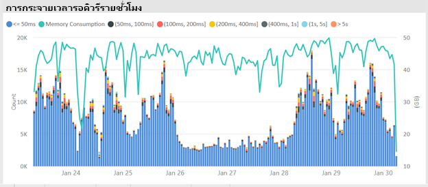

# สถานการณ์ความจุแบบพรีเมียมPremium capacity scenarios

บทความนี้อธิบายสถานการณ์ในโลกแห่งความจริงที่ความจุแบบพรีเมียมของ Power BI ได้ถูกนำไปใช้This article describes real-world scenarios where Power BI premium capacities have been implemented. มีการอธิบายปัญหาและความท้าทายที่พบบ่อยไว้แล้ว รวมถึงวิธีการระบุปัญหาและช่วยแก้ไขปัญหา:Common issues and challenges are described, also how to identify issues, and help resolve them:

- [การปรับปรุงชุดข้อมูลให้เป็นปัจจุบันKeeping datasets up-to-date](#keeping-datasets-up-to-date)
- [การระบุชุดข้อมูลที่ตอบสนองช้าIdentifying slow-responding datasets](#identifying-slow-responding-datasets)
- [การระบุสาเหตุสำหรับชุดข้อมูลที่ตอบสนองช้าเป็นระยะ ๆ Identifying causes for sporadically slow-responding datasets](#identifying-causes-for-sporadically-slow-responding-datasets)
- [การตรวจสอบว่ามีหน่วยความจำเพียงพอหรือไม่Determining whether there is enough memory](#determining-whether-there-is-enough-memory)
- [การตรวจสอบว่ามี CPU เพียงพอหรือไม่Determining whether there is enough CPU](#determining-whether-there-is-enough-cpu)

ขั้นตอน พร้อมกับตัวอย่างแผนภูมิและตารางมาจาก **แอป Power BI Premium Capacity Metric** ที่ผู้ดูแลระบบ Power BI จะสามารถเข้าถึงได้The steps, along with chart and table examples are from the **Power BI Premium Capacity Metrics app** that a Power BI administrator will have access to.

> [!NOTE]
> Power BI Premium เพิ่งเปิดตัว Premium เวอร์ชันใหม่ชื่อ **Premium Gen2** ซึ่งกำลังอยู่ในช่วงการแสดงตัวอย่างPower BI Premium recently released a new version of Premium, called **Premium Gen2**, which is currently in preview. Premium Gen2 จะทำให้การจัดการความจุระดับพรีเมียมง่ายขึ้นและลดค่าใช้จ่ายในการจัดการPremium Gen2 will simplify the management of Premium capacities, and reduce management overhead. สำหรับข้อมูลเพิ่มเติม โปรดดูที่ [Power BI Premium Generation 2 (ตัวอย่าง)](service-premium-what-is.md#power-bi-premium-generation-2-preview)For more information, see [Power BI Premium Generation 2 (preview)](service-premium-what-is.md#power-bi-premium-generation-2-preview).

## การปรับปรุงชุดข้อมูลให้เป็นปัจจุบันKeeping datasets up to date

ในสถานการณ์นี้ การตรวจสอบถูกทริกเกอร์เมื่อผู้ใช้ร้องเรียนว่าข้อมูลรายงานในบางครั้งดูเหมือนว่าเก่าหรือ “ไม่เป็นปัจจุบัน”In this scenario, an investigation was triggered when users complained that report data sometimes appeared to be old or "stale".

ในแอป ผู้ดูแลระบบโต้ตอบกับวิชวล **รีเฟรช** จากนั้นเรียงลำดับชุดข้อมูลโดยสถิติ **เวลารอสูงสุด** จากมากไปน้อยIn the app, the admin interacts with the **Refreshes** visual, sorting datasets by the **Max Wait Time** statistics in descending order. วิชวลนี้ช่วยให้พวกเขาแสดงชุดข้อมูลที่มีเวลารอนานที่สุด ซึ่งจัดกลุ่มตามชื่อพื้นที่ทำงานThis visual helps them reveal datasets having the longest wait times, grouped by workspace name.

ในวิชวล **เวลารอรีเฟรชโดยเฉลี่ยต่อชั่วโมง** พวกเขาจะสังเกตเห็นว่าเวลารอรีเฟรชสูงสุดอยู่ที่เวลาประมาณ 16.00 น. ในแต่ละวันอย่างสม่ำเสมอIn the **Hourly Average Refresh Wait Times** visual, they notice that the refresh wait times peak consistently around 4PM each day.

มีคำอธิบายที่เป็นไปได้มากมายสำหรับผลลัพธ์เหล่านี้:There are several possible explanations for these results:

- มีความพยายามในการรีเฟรชมากเกินไปในเวลาเดียวกัน ซึ่งเกินขีดจำกัดที่กำหนดโดยโหนดความจุToo many refresh attempts could be occurring at the same time, exceeding the limits defined by the capacity node. ในกรณีนี้ เป็นการรีเฟรชพร้อมกันหกครั้งบน P1 ที่มีการจัดสรรหน่วยความจำเริ่มต้นIn this case, six concurrent refreshes on a P1 with default memory allocation.

- ชุดข้อมูลที่จะรีเฟรชอาจมีขนาดใหญ่เกินไปที่จะพอดีกับหน่วยความจำที่มีอยู่ (ต้องใช้หน่วยความจำอย่างน้อย 2 เท่าสำหรับการรีเฟรชเต็มรูปแบบ)Datasets to be refreshed may be too large to fit into available memory (requiring at least 2x the memory required for full refresh).
- ตรรกะ Power Query ที่ไม่มีประสิทธิภาพอาจส่งผลให้อัตราการใช้งานหน่วยความจำเพิ่มขึ้นอย่างรวดเร็วทันทีทันใดในระหว่างการรีเฟรชชุดข้อมูลInefficient Power Query logic may be resulting in a memory usage spike during dataset refresh. ในความจุที่ไม่ว่าง บางครั้งอัตราการเพิ่มขึ้นอย่างรวดเร็วทันทีทันใดอาจถึงขีดจำกัดทางกายภาพ ล้มเหลวในการรีเฟรชและอาจส่งผลต่อการดำเนินการบนมุมมองรายงานอื่น ๆOn a busy capacity, this spike can occasionally reach the physical limit, failing the refresh and potentially affecting other report view operations on the capacity.
- ชุดข้อมูลที่มีการคิวรีบ่อยครั้งที่จำเป็นต้องอยู่ในหน่วยความจำอาจส่งผลต่อความสามารถของชุดข้อมูลอื่นในการรีเฟรชเพราะว่าหน่วยความจำที่มีอยู่แบบจำกัดFrequently queried datasets that need to stay in memory may affect the ability of other datasets to refresh because of limited available memory.

เพื่อช่วยในการตรวจสอบ ผู้ดูแลระบบ Power BI สามารถค้นหา:To help investigate, the Power BI administrator can look for:

- หน่วยความจำเหลือน้อยในขณะที่รีเฟรชข้อมูลเมื่อหน่วยความจำที่มีอยู่มีขนาดน้อยกว่า 2 เท่าของชุดข้อมูลที่จะรีเฟรชLow available memory at the time of data refreshes when available memory is less than 2x the size of the dataset to be refreshed.
- ชุดข้อมูลที่ไม่ได้ถูกรีเฟรชและไม่ได้อยู่ในหน่วยความจำก่อนการรีเฟรช แต่ยังเริ่มต้นแสดงปริมาณการใช้งานแบบโต้ตอบในช่วงเวลาที่มีการรีเฟรชมากDatasets not being refreshed and not in memory before refresh, yet started to show interactive traffic during heavy refresh times. หากต้องการดูชุดข้อมูลที่โหลดลงในหน่วยความจำ ณ เวลาใดก็ตาม ผู้ดูแลระบบ Power BI สามารถดูพื้นที่ชุดข้อมูลของแท็บ **ชุดข้อมูล** ในแอปได้To see which datasets are loaded into memory at any given time, a Power BI administrator can look at the datasets area of the **Datasets** tab in the app. จากนั้นผู้ดูแลระบบสามารถกรองข้ามไปยังเวลาที่กำหนดโดยการคลิกที่หนึ่งในแท่งในวิชวล **จำนวนชุดข้อมูลที่โหลดต่อชั่วโมง**The admin can then cross-filter to a given time by clicking on one of the bars in the **Hourly Loaded Dataset Counts**. อัตราการเพิ่มขึ้นอย่างรวดเร็วทันทีทันใดภายในที่แสดงในภาพด้านล่าง ระบุหนึ่งชั่วโมงเมื่อโหลดชุดข้อมูลหลายชุดลงในหน่วยความจำ ซึ่งอาจชะลอการเริ่มต้นการรีเฟรชตามกำหนดเวลาA local spike, shown in the below image, indicates an hour when multiple datasets were loaded into memory, which could delay the start of scheduled refreshes.
- การลดสัดส่วนชุดข้อมูลเพิ่มมากขึ้นเมื่อมีการกำหนดเวลาเพื่อเริ่มต้นการรีเฟรชข้อมูลIncreased dataset evictions taking place when data refreshes are scheduled to start. การลดสัดส่วนสามารถบ่งบอกว่ามีความกดดันบนหน่วยความจำอย่างสูงซึ่งเกิดจากการให้บริการรายงานเชิงโต้ตอบที่แตกต่างกันมากเกินไปก่อนเวลารีเฟรชEvictions can indicate that there was high memory pressure caused by serving too many different interactive reports before refresh. วิชวล **การลดสัดส่วนข้อมูลต่อชั่วโมงและปริมาณการใช้หน่วยความจำ** สามารถระบุอัตราการลดสัดส่วนที่เพิ่มขึ้นอย่างรวดเร็วทันทีทันใดได้อย่างชัดเจนThe **Hourly Dataset Evictions and Memory Consumption** visual can clearly indicate spikes in evictions.

รูปต่อไปนี้แสดงการเพิ่มขึ้นภายในในชุดข้อมูลที่โหลด ซึ่งบ่งบอกว่าการคิวรีแบบโต้ตอบจะเริ่มต้นการรีเฟรชช้าThe following image shows a local spike in loaded datasets, which suggests interactive querying delayed the start of refreshes. การเลือกระยะเวลาในวิชวล **จำนวนชุดข้อมูลที่โหลดต่อชั่วโมง** จะกรองข้ามวิชวล **ขนาดของชุดข้อมูล**Selecting a time period in the **Hourly Loaded Dataset Counts** visual will cross-filter the **Dataset Sizes** visual.

ผู้ดูแลระบบ Power BI อาจจะพยายามแก้ไขปัญหาโดยทำตามขั้นตอนเพื่อให้แน่ใจว่ามีหน่วยความจำเพียงพอสำหรับการรีเฟรชข้อมูลที่จะเริ่มต้นโดย:The Power BI administrator can attempt to resolve the issue by taking steps to ensure that sufficient memory is available for data refreshes to start by:

- ติดต่อเจ้าของชุดข้อมูลและขอให้พวกเขาสลับและเว้นระยะเวลาในการรีเฟรชข้อมูลContacting dataset owners and asking them to stagger and space out data refresh schedules.
- ลดการโหลดคิวรีชุดข้อมูลโดยการลบแดชบอร์ดหรือไทล์แดชบอร์ดที่ไม่จำเป็นออก โดยเฉพาะอย่างยิ่งเนื้อหาที่บังคับใช้การรักษาความปลอดภัยระดับแถวReducing dataset query load by removing unnecessary dashboards or dashboard tiles, especially content that enforces row-level security.
- เร่งความเร็วการรีเฟรชข้อมูลโดยปรับตรรกะ Power Query ให้เหมาะสมSpeeding data refreshes by optimizing Power Query logic. ปรับปรุงการสร้างแบบจำลองคอลัมน์หรือตารางจากการคำนวณImprove modeling calculated columns or tables. ลดขนาดชุดข้อมูลหรือกำหนดค่าชุดข้อมูลขนาดใหญ่เพื่อดำเนินการรีเฟรชข้อมูลแบบเพิ่มหน่วยReduce dataset sizes or configure larger datasets to perform incremental data refresh.

## ระบุชุดข้อมูลที่ตอบสนองช้าIdentifying slow-responding datasets

ในสถานการณ์นี้ การตรวจสอบเริ่มต้นขึ้นเมื่อผู้ใช้ร้องเรียนว่ารายงานบางฉบับใช้เวลานการเปิดนานเกินไปIn this scenario, an investigation began when users complained that certain reports took too long to open. บางครั้งรายงานจะหยุดการตอบสนองSometimes the reports would stop responding.

ในแอป ผู้ดูแลระบบ Power BI สามารถใช้วิชวล **ระยะเวลาคิวรี** เพื่อระบุชุดข้อมูลแย่ที่สุด โดยเรียงลำดับชุดข้อมูลตาม **ระยะเวลาเฉลี่ย** จากมากไปหาน้อยIn the app, the Power BI administrator can use the **Query Durations** visual to determine the worst-performing datasets by sorting datasets by descending **Average Duration**. วิชวลนี้ยังแสดงจำนวนคิวรีของชุดข้อมูล ดังนั้นคุณสามารถดูความถี่ของการคิวรีชุดข้อมูลได้This visual also shows dataset query counts, so you can see how often the datasets are queried.

ผู้ดูแลระบบสามารถดูวิชวล **การกระจายระยะเวลาคิวรี** ซึ่งแสดงการกระจายประสิทธิภาพคิวรีแบบจัดกลุ่มโดยภาพรวม (<= 30ms, 0-100ms) สำหรับช่วงเวลาที่กรองแล้วThe administrator can refer to the **Query Duration Distribution** visual, which shows an overall distribution of bucketed query performance (<= 30ms, 0-100ms) for the filtered time period. โดยทั่วไป คิวรีที่ใช้เวลาหนึ่งวินาทีหรือน้อยกว่านั้นถือว่าตอบโจทย์กับผู้ใช้ส่วนใหญ่Generally, queries that take one second or less are considered responsive by most users. คิวรีที่ใช้เวลานานกว่ามักจะสร้างการรับรู้ถึงประสิทธิภาพที่ไม่ดีQueries that take longer tend to create a perception of bad performance.

วิชวล **การกระจายระยะเวลาคิวรีต่อชั่วโมง** ช่วยให้ผู้ดูแลระบบ Power BI สามารถระบุช่วงเวลาหนึ่งชั่วโมงเมื่อประสิทธิภาพการทำงานของความจุอาจถูกมองว่าไม่ดีThe **Hourly Query Duration Distribution** visual allows the Power BI administrator to identify one-hour periods when the capacity performance could have been perceived as poor. ยิ่งกลุ่มแถบมีขนาดใหญ่ขึ้นซึ่งแสดงถึงระยะเวลาคิวรีมากกว่าหนึ่งวินาที ยิ่งมีความเสียงว่าผู้ใช้จะรับรู้ประสิทธิภาพที่แย่ลงThe larger the bar segments that represent query durations over one second, the larger the risk that users will perceive poor performance.

วิชวลเป็นแบบโต้ตอบ และเมื่อเลือกกลุ่มของแถบ วิชวลตาราง **ระยะเวลาคิวรี** ที่สอดคล้องกันบนหน้ารายงานจะถูกกรองข้ามเพื่อแสดงชุดข้อมูลที่วิชวลแสดงThe visual is interactive, and when a segment of the bar is selected, the corresponding **Query Durations** table visual on the report page is cross-filtered to show the datasets it represents. การกรองข้ามช่วยให้ผู้ดูแลระบบ Power BI สามารถระบุชุดข้อมูลที่ตอบสนองช้าได้อย่างง่ายดายThis cross-filtering allows the Power BI administrator to easily identify which datasets are responding slowly.

รูปต่อไปนี้แสดงวิชวลที่กรองตาม **การกระจายระยะเวลาคิวรีต่อชั่วโมง** โดยเน้นชุดข้อมูลที่มีประสิทธิภาพแย่ลงในบักเก็ตหนึ่งชั่วโมงThe following image shows a visual filtered by **Hourly Query Duration Distributions**, focusing on the worst-performing datasets in one-hour buckets.

หลังจากระบุชุดข้อมูลที่มีประสิทธิภาพไม่ดีในช่วงเวลาหนึ่งชั่วโมงแล้ว ผู้ดูแลระบบ Power BI สามารถตรวจสอบว่าประสิทธิภาพที่ไม่ดีนั้นเกิดจากความจุที่โหลดมากเกินไป หรือเนื่องจากชุดข้อมูลหรือรายงานที่ออกแบบมาไม่ดีAfter the poor-performing dataset in a specific one-hour time span is identified, the Power BI administrator can investigate whether poor performance is caused by an overloaded capacity or due to a poorly designed dataset or report. พวกเขาสามารถดูวิชวล **เวลารอคิวรี** และเรียงลำดับชุดข้อมูลเรียงลำดับตามเวลารอคิวรีโดยเฉลี่ยจากมากไปหาน้อยได้They can refer to the **Query Wait Times** visual, and sort datasets by descending average query wait time. ถ้าเปอร์เซ็นต์ของคิวรีที่กำลังรอสูง ความต้องการสำหรับชุดข้อมูลสูงอาจเป็นสาเหตุของการรอคิวรีมากเกินไปIf a large percentage of queries is waiting, a high demand for the dataset is likely the cause of too many query delays. ถ้าเวลารอคิวรีโดยเฉลี่ยเป็นจริง (> 100 ms) อาจคุ้มค่าที่จะตรวจทานชุดข้อมูลและรายงานเพื่อดูว่าสามารถปรับให้เหมาะสมได้หรือไม่If the average query wait time is substantial (> 100 ms), it may be worth reviewing the dataset and report to see if optimizations can be made. ตัวอย่างเช่น มีวิชวลน้อยลงในหน้ารายงานที่กำหนดหรือการปรับนิพจน์ DAX ให้เหมาะสมFor example, fewer visuals on given report pages or a DAX expression optimization.

มีสาเหตุที่เป็นไปได้หลายประการสำหรับเวลารอคิวรีที่สร้างขึ้นในชุดข้อมูล:There are several possible reasons for query wait time buildup in datasets:

- การออกแบบแบบจำลองที่ไม่เหมาะสม นิพจน์หน่วยวัด หรือแม้แต่การออกแบบรายงาน - สถานการณ์ทั้งหมดที่สามารถนำไปสู่การคิวรีที่ใช้เวลานานซึ่งใช้ CPU ระดับสูงA suboptimal model design, measure expressions, or even report design - all circumstances that can contribute to long running queries that consume high levels of CPU. ซึ่งบังคับให้คิวรีใหม่ต้องรอจนกว่าเธรด CPU จะพร้อมใช้งานและสามารถสร้างเอฟเฟ็กต์การป้องกัน (เหมือนกับการจราจรติดขัด) ซึ่งมักพบได้ในช่วงเวลาทำการสูงสุดThis forces new queries to wait until CPU threads become available and can create a convoy effect (think traffic jam), commonly seen during peak business hours. หน้า **การรอคิวรี** จะเป็นทรัพยากรหลักที่จะตรวจสอบว่าชุดข้อมูลมีเวลารอคิวรีโดยเฉลี่ยสูงหรือไม่The **Query Waits** page will be the main resource to determine whether datasets have high average query wait times.
- จำนวนผู้ใช้งานความจุพร้อมกันสูง (หลายร้อยถึงหลายพัน) ซึ่งใช้รายงานหรือชุดข้อมูลเดียวกันA high number of concurrent capacity users (hundreds to thousands) consuming the same report or dataset. แม้แต่ชุดข้อมูลที่ออกแบบมาอย่างดีก็อาจทำงานได้ไม่ดีหากเกินค่าเกณฑ์กระบวนการการทำงานพร้อมกันEven well-designed datasets can perform badly beyond a concurrency threshold. ปัญหาด้านประสิทธิภาพการทำงานนี้ดูจากชุดข้อมูลเดียวที่แสดงค่าสำหรับจำนวนคิวรีสูงขึ้นอย่างมาก เมื่อเทียบกับชุดข้อมูลอื่น ๆThis performance problem is indicated by a single dataset showing a dramatically higher value for query counts than other datasets. ตัวอย่างเช่น คุณอาจเห็นคิวรี 300K สำหรับชุดข้อมูลหนึ่งเมื่อเทียบกับคิวรี <30K สำหรับชุดข้อมูลอื่น ๆ ทั้งหมดFor example, you may see 300K queries for one dataset compared to <30K queries for all other datasets. ในบางจุดที่การรอคิวรีสำหรับชุดข้อมูลนี้จะเริ่มจัดสลับ ซึ่งสามารถมองเห็นได้ในวิชวล **ระยะเวลาคิวรี**At some point the query waits for this dataset will start to stagger, which can be seen in the **Query Durations** visual.
- ชุดข้อมูลที่แตกต่างกันจำนวนมากที่คิวรีพร้อมกันทำให้เกิดการแธรชชิ่งเนื่องจากชุดข้อมูลมักจะวนเข้าและออกจากหน่วยความจำMany disparate datasets queried concurrently, causing thrashing as datasets frequently cycle in and out of memory. สถานการณ์นี้ส่งผลให้ผู้ใช้ประสบปัญหาประสิทธิภาพการทำงานช้าเมื่อโหลดชุดข้อมูลลงในหน่วยความจำThis situation results in users experiencing slow performance when the dataset is loaded into memory. เมื่อต้องยืนยัน ผู้ดูแลระบบ Power BI สามารถอ้างอิงไปยังวิชวล **การลดสัดส่วนชุดข้อมูลต่อชั่วโมงและปริมาณการใช้หน่วยความจำ** ซึ่งอาจบ่งบอกว่าชุดข้อมูลจำนวนมากที่โหลดเข้าสู่หน่วยความจำนั้นถูกสัดส่วนซ้ำ ๆTo confirm, the Power BI administrator can refer to the **Hourly Dataset Evictions and Memory Consumption** visual, which may indicate that a high number of datasets loaded into memory are being repeatedly evicted.

## การระบุสาเหตุสำหรับชุดข้อมูลที่ตอบสนองช้าเป็นระยะIdentifying causes for sporadically slow-responding datasets

ในสถานการณ์นี้ การตรวจสอบเริ่มต้นขึ้นเมื่อผู้ใช้อธิบายว่าบางครั้งวิชวลรายงานตอบสนองช้าหรืออาจไม่ตอบสนองIn this scenario, an investigation began when users described that report visuals sometimes were slow to respond or could become unresponsive. ในบางครั้ง การตอบสนองของวิชวลรายงานก็เป็นที่ยอมรับได้At other times the report visuals were acceptably responsive.

ภายในแอป ส่วน **ระยะเวลาคิวรี** ถูกนำมาใช้เพื่อค้นหาชุดข้อมูลที่เป็นสาเหตุในวิธีต่อไปนี้:Within the app, the **Query Durations** section was used to find the culprit dataset in the following way:

- ในวิชวลระยะเวลาคิวรี ผู้ดูแลระบบจะกรองชุดข้อมูลโดยชุดข้อมูล (เริ่มต้นจากชุดข้อมูลด้านบนที่คิวรีแล้ว) และตรวจสอบแถบที่กรองข้ามในวิชวล **การกระจายคิวรีต่อชั่วโมง**In the Query Durations visual, the admin filtered dataset by dataset (starting at the top datasets queried) and examined the cross filtered bars in the **Hourly Query Distributions** visual.
- เมื่อแถบเวลาหนึ่งชั่วโมงแถบเดียวที่แสดงการเปลี่ยนแปลงที่สำคัญในอัตราส่วนระหว่างกลุ่มระยะเวลาการคิวรีทั้งหมดกับแถบหนึ่งชั่วโมงแถบอื่นสำหรับชุดข้อมูลนั้น (ตัวอย่างเช่น อัตราส่วนระหว่างสีที่เปลี่ยนไปอย่างมาก) ซึ่งหมายถึงชุดข้อมูลนี้แสดงการเปลี่ยนแปลงด้านประสิทธิภาพเป็นระยะWhen a single one-hour bar showed significant changes in the ratio between all query duration groups vs. other one-hour bars for that dataset (for example, the ratios between the colors changes drastically), it means this dataset demonstrated a sporadic change in performance.
- แถบเวลาหนึ่งชั่วโมง ซึ่งแสดงส่วนของคิวรีที่มีประสิทธิภาพต่ำผิดปกติซึ่งระบุช่วงเวลาที่ชุดข้อมูลนั้นได้รับผลกระทบจากเอฟเฟ็กต์ Noisy Neighbor ซึ่งเกิดจากกิจกรรมของชุดข้อมูลอื่นThe one-hour bars showing an irregular portion of poor performing queries, indicated a timespan where that dataset was impacted by a noisy neighbor effect, caused by other datasets' activities.

ภาพด้านล่างแสดงระยะเวลาหนึ่งชั่วโมงในวันที่ 30 มกราคม ซึ่งเกิดความล้มเหลวอย่างมีนัยสำคัญในประสิทธิภาพของชุดข้อมูลที่ระบุโดยขนาดของบักเก็ตระยะเวลาการเรียกใช้งาน "(3,10s)"The image below shows one hour on January 30, where a significant setback in a dataset's performance occurred, indicated by the size of the "(3,10s]" execution duration bucket. การคลิกที่แถบหนึ่งชั่วโมงจะแสดงชุดข้อมูลทั้งหมดที่โหลดเข้าสู่หน่วยความจำในช่วงเวลานั้น การตัดชุดข้อมูลอาจเป็นสาเหตุของปัญหาที่ทำให้เกิดเอฟเฟ็กต์ Noisy NeighborClicking that one-hour bar reveals all the datasets loaded into memory during that time, surfacing possible datasets causing the noisy neighbor effect.

เมื่อระบุช่วงเวลาที่มีปัญหา (ตัวอย่างเช่น ระหว่างวันที่ 30 มกราคมในภาพด้านบน) ผู้ดูแลระบบ Power BI สามารถลบตัวกรองชุดข้อมูลทั้งหมดแล้วกรองเฉพาะช่วงเวลานั้นเพื่อพิจารณาว่าชุดข้อมูลใดจะถูกคิวรีอย่างแข็งขันในช่วงเวลานี้Once a problematic timespan is identified (for example, during Jan. 30th in the image above) the Power BI administrator can remove all dataset filters then filter only by that timespan to determine which datasets were actively queried during this time. ชุดข้อมูลที่เป็นสาเหตุสำหรับเอฟเฟ็กต์ Noisy Neighbor มักจะเป็นชุดข้อมูลที่ถูกคีวรีสูงสุดหรือไม่ก็ชุดข้อมูลที่มีระยะเวลาการคิวรีโดยเฉลี่ยนานที่สุดThe culprit dataset for the noisy neighbor effect is usually the top queried dataset or the one with the longest average query duration.

วิธีการแก้ไขปัญหานี้อาจเป็นการกระจายชุดข้อมูลที่เป็นสาเหตุผ่านพื้นที่ทำงานที่แตกต่างกันในความจุแบบพรีเมียมที่แตกต่างกัน หรือในความจุที่ใช้ร่วมกันถ้าขนาดของชุดข้อมูล ข้อกำหนดการใช้งาน และรูปแบบการรีเฟรชข้อมูลได้รับการสนับสนุนA solution to this problem could be to distribute the culprit datasets over different workspaces on different Premium capacities, or on shared capacity if the dataset size, consumption requirements, and data refresh patterns are supported.

การย้อนกลับอาจเป็นจริงเช่นกันThe reverse could be true as well. ผู้ดูแลระบบ Power BI สามารถระบุเวลาที่ประสิทธิภาพการคิวรีของชุดข้อมูลดีขึ้นเป็นอย่างมากแล้วมองหาสิ่งที่หายไปThe Power BI administrator could identify times when a dataset query performance drastically improves and then look for what disappeared. ถ้าข้อมูลบางอย่างหายไปที่จุดนั้น อาจเป็นการช่วยบ่งชี้ปัญหาที่เกิดขึ้นIf certain information is missing at that point, then that may help to point to the causing problem.

## การตรวจสอบว่ามีหน่วยความจำเพียงพอหรือไม่Determining whether there is enough memory

เมื่อต้องการตรวจสอบว่าหน่วยความจำมีเพียงพอสำหรับที่จะรองรับความจุของปริมาณงานหรือไม่ ผู้ดูแลระบบ Power BI สามารถดูที่วิชวล **เปอร์เซ็นต์หน่วยความจำที่ใช้แล้ว** ในแท็บ **ชุดข้อมูล** ของแอปได้To determine whether there is enough memory for the capacity to complete its workloads, the Power BI administrator can refer to the **Consumed Memory Percentages** visual in the **Datasets** tab of the app. หน่วยความ **ทั้งหมด** (รวม) แสดงหน่วยความจำที่ใช้โดยชุดข้อมูลที่โหลดลงในหน่วยความจำ โดยไม่คำนึงถึงว่าชุดข้อมูลเหล่านี้ถูกคิวรีหรือประมวลผลอย่างแข็งขันหรือไม่**All** (total) memory represents the memory consumed by datasets loaded into memory, regardless of whether they are actively queried or processed. หน่วยความจำ **ที่ใช้งานอยู่** แสดงหน่วยความจำที่ใช้โดยชุดข้อมูลที่กำลังถูกประมวลผลอย่างแข็งขัน**Active** memory represents the memory consumed by datasets that are being actively processed.

ในความจุที่สภาพพร้อมใช้งาน ภาพจะมีลักษณะดังนี้ แสดงช่องว่างระหว่างหน่วยความจำทั้งหมด (รวม) และหน่วยความจำที่ใช้งานอยู่:In a healthy capacity the visual will look like this, showing a gap between All (total) and Active memory:

ในความจุเกิดความกดดันบนหน่วยความจำ วิชวลเดียวกันจะแสดงการบรรจบกันของหน่วยความจำที่ใช้งานอยู่และหน่วยความจำทั้งหมดอย่างชัดเจน ซึ่งหมายความว่าคุณจะไม่สามารถโหลดชุดข้อมูลเพิ่มเติมลงในหน่วยความจำได้อีกIn a capacity experiencing memory pressure, the same visual will clearly show active memory and total memory converging, meaning that it is impossible to load additional datasets into memory then. ในกรณีนี้ ผู้ดูแลระบบ Power BI สามารถคลิก **รีสตาร์ทความจุ** (ใน **ตัวเลือกขั้นสูง** ของพื้นที่การตั้งค่าความจุของพอร์ทัลผู้ดูแลระบบ) ได้In this case, the Power BI administrator can click **Capacity Restart** (in **Advanced Options** of the capacity settings area of the admin portal). การรีสตาร์ทความจุจะส่งผลให้ชุดข้อมูลทั้งหมดถูกล้างออกจากหน่วยความจำและอนุญาตให้โหลดซ้ำลงในหน่วยความจำได้ตามต้องการ (โดยการคิวรีหรือการรีเฟรชข้อมูล)Restarting the capacity results in all datasets being flushed from memory and allowing them to reload into memory as required (by queries or data refresh).

> [!NOTE]
> สำหรับ Premium Gen2 ไม่จำเป็นต้องติดตามการใช้หน่วยความจำFor Premium Gen2, memory consumption does not need to be tracked. ข้อจำกัดเพียงอย่างเดียวใน Premium Gen2 คือฟุตพริ้นท์หน่วยความจำของอาร์ทิแฟกต์เดียวThe only limitation in Premium Gen2 is on the memory footprint of a single artifact. ฟุตพริ้นท์ไม่สามารถเกินหน่วยความจำที่มีอยู่ในความจุได้The footprint cannot exceed the memory available on the capacity. สำหรับข้อมูลเพิ่มเติมเกี่ยวกับ Premium Gen2 โปรดดูที่ [Power BI Premium Generation 2 (ตัวอย่าง)](service-premium-what-is.md#power-bi-premium-generation-2-preview)For more information about Premium Gen2, see [Power BI Premium Generation 2 (preview)](service-premium-what-is.md#power-bi-premium-generation-2-preview).

## การตรวจสอบว่ามี CPU เพียงพอหรือไม่Determining whether there is enough CPU

โดยทั่วไป การใช้งาน CPU โดยเฉลี่ยของความจุควรต่ำกว่า 80%In general, a capacity's average CPU utilization should remain below 80%. การใช้งานเกินค่านี้หมายความว่าความจุกำลังใกล้ถึงความอิ่มตัวของ CPUExceeding this value means the capacity is approaching CPU saturation.

ผลกระทบจากความอิ่มตัวของ CPU จะเห็นได้จากการทำงานที่ใช้เวลานานกว่าที่ควรจะเป็นเนื่องจากความจุที่ใช้บริบทของ CPU จำนวนมากจะสลับขณะที่พยายามประมวลผลการทำงานทั้งหมดEffects of CPU saturation are expressed by operations taking longer than they should, due to the capacity performing many CPU contexts switches as it attempts to process all operations. ในความจุแบบพรีเมียมที่มีจำนวนคิวรีที่เกิดขึ้นพร้อมกันสูง นั่นหมายถึงเวลารอคิวรีสูงIn a Premium capacity with a high number of concurrent queries, this is indicated by high query wait times. ผลที่ตามมาจากเวลารอคิวรีสูงคือการตอบสนองช้าลงกว่าปกติA consequence of high query wait times is slower responsiveness than usual. ผู้ดูแลระบบ Power BI สามารถระบุได้อย่างง่ายดายเมื่อ CPU มีความอิ่มตัวแล้วโดยดูที่วิชวล **การกระจายเวลารอคิวรีต่อชั่วโมง** ้The Power BI administrator can easily identify when the CPU is saturated by viewing the **Hourly Query Wait Time Distributions** visual. จำนวนเวลารอคิวรีที่ถึงระดับสูงสุดเป็นระยะ ๆ แสดงถึงความอิ่มตัวของ CPU ที่อาจเกิดขึ้นPeriodic peaks of query wait time counts indicate potential CPU saturation.

ในบางครั้งสามารถตรวจหารูปแบบที่คล้ายกันได้ในการทำงานแบบเบื้องหลังหากการทำงานเหล่านั้นมีส่วนทำให้เกิดความอิ่มต้วของ CPUA similar pattern can sometimes be detected in background operations if they contribute to CPU saturation. ผู้ดูแลระบบ Power BI สามารถค้นหาอัตราการเพิ่มขึ้นอย่างรวดเร็วทันทีทันใดเป็นระยะ ๆ ในช่วงเวลาการรีเฟรชสำหรับชุดข้อมูลเฉพาะ ซึ่งสามารถระบุความอิ่มตัวของ CPU ในเวลานั้น (อาจเป็นเพราะว่าชุดข้อมูลอื่นที่กำลังดำเนินการรีเฟรชและ/หรือคิวรีแบบโต้ตอบ)A Power BI administrator can look for a periodic spike in refresh times for a specific dataset, which can indicate CPU saturation at the time (probably because of other ongoing dataset refreshes and/or interactive queries). ในอินสแตนซ์นี้ การอ้างอิงไปยังมุมมอง **ระบบ** ในแอปอาจไม่จำเป็นต้องแสดงว่า CPU อยู่ในระดับ 100%In this instance, referring to the **System** view in the app may not necessarily reveal that the CPU is at 100%. มุมมอง **ระบบ** แสดงค่าเฉลี่ยต่อชั่วโมง แต่ CPU อาจจะอิ่มตัวเป็นเวลาหลายนาทีจากการทำงานหนัก ซึ่งแสดงเป็นอัตราเวลารอที่เพิ่มขึ้นอย่างรวดเร็วทันทีทันใดThe **System** view displays hourly averages, but the CPU can become saturated for several minutes of heavy operations, which shows up as spikes in wait times.

มีรายละเอียดปลีกย่อยเพิ่มเติมในการดูผลกระทบจากความอิ่มตัวของ CPUThere are more nuances to seeing the effect of CPU saturation. ในขณะที่จำนวนคิวรีที่รอเป็นสิ่งสำคัญ แต่เวลารอคิวรีจะเกิดขึ้นในระดับหนึ่งเสมอโดยไม่ทำให้ประสิทธิภาพการทำงานลดลงWhile the number of queries that wait is important, query wait time will always happen to some extent without causing discernable performance degradation. ชุดข้อมูลบางชุด (ที่มีเวลาคิวรีโดยเฉลี่ยที่ยาวกว่า แสดงถึงความซับซ้อนหรือขนาด) มีแนวโน้มที่จะทำให้เกิดความอิ่มตัวของ CPU มากกว่าชุดอื่นSome datasets (with lengthier average query time, indicating complexity or size) are more prone to the effects of CPU saturation than others. หากต้องการระบุชุดข้อมูลเหล่านี้ได้อย่างง่ายดาย ผู้ดูแลระบบ Power BI สามารถดูการเปลี่ยนแปลงในส่วนประกอบสีของแถบในวิชวล **การกระจายเวลารอต่อชั่วโมง**To easily identify these datasets, the Power BI administrator can look for changes in the color composition of the bars in the **Hourly Wait Time Distribution** visual. หลังจากตรวจพบแถบค่าผิดปกติ ผู้ดูแลระบบสามารถค้นหาชุดข้อมูลที่มีการรอคิวรีอยู่ในช่วงเวลานั้น และดูเวลารอคิวรีโดยฉลี่ยโดยเปรียบเทียบกับระยะเวลาคิวรีโดยเฉลี่ยAfter spotting an outlier bar, they can look for the datasets that had query waits during that time and also look at the average query wait time compared to average query duration. ทเมื่อทั้งสองเมตริกมีขนาดเท่ากันและปริมาณงานของคิวรีสำหรับชุดข้อมูลนั้นมีความสำคัญ อาจเป็นไปได้ว่าชุดข้อมูลนั้นได้รับผลกระทบจาก CPU ไม่เพียงพอWhen these two metrics are of the same magnitude and the query workload for the dataset is non-trivial, it is likely that the dataset is impacted by insufficient CPU.

ผลกระทบนี้สามารถเห็นได้ชัดโดยเฉพาะอย่างยิ่งเมื่อชุดข้อมูลถูกใช้งานในช่วงการส่งชุดข้อมูลสั้น ๆ จากการคิวรีที่มีความถี่สูงโดยผู้ใช้หลายคน (ตัวอย่างเช่น ในช่วงการฝึกอบรม) ซึ่งส่งผลให้เกิดความอิ่มตัวของ CPU ในแต่ละครั้งThis effect can be especially apparent when a dataset is consumed in short bursts of high frequency queries by multiple users (for example, in a training session), resulting in CPU saturation during each burst. ในกรณีนี้ เวลารอคิวรีที่สำคัญในชุดข้อมูลนี้อาจได้รับผลกระทบ รวมถึงมีผลกระทบต่อชุดข้อมูลอื่น ๆ ในความจุ (เอฟเฟ็กต์ Noisy Neighbor)In this case, significant query wait times on this dataset can be experienced as well as impacting on other datasets in the capacity (noisy neighbor effect).

ในบางกรณี ผู้ดูแลระบบ Power BI สามารถขอให้เจ้าของชุดข้อมูลสร้างปริมาณงานของคิวรีที่มีความผันผวนน้อยลงโดยการสร้างแดชบอร์ด (ซึ่งจะทำการคิวรีเป็นระยะ ๆ กับการรีเฟรชชุดข้อมูลใด ๆ สำหรับไทล์ที่แคช) แทนรายงานIn some cases, Power BI administrators can request that dataset owners create a less volatile query workload by creating a dashboard (which queries periodically with any dataset refresh for cached tiles) instead of a report. ซึ่งสามารถช่วยป้องกันอัตราการเพิ่มขึ้นอย่างรวดเร็วทันทีทันใดเมื่อโหลดแดชบอร์ดThis can help prevent spikes when the dashboard is loaded. โซลูชันนี้อาจไม่สามารถทำได้สำหรับความต้องการทางธุรกิจที่กำหนดไว้ อย่างไรก็ตามอาจเป็นวิธีที่มีประสิทธิภาพในการหลีกเลี่ยงความอิ่มตัวของ CPU โดยไม่มีการเปลี่ยนแปลงชุดข้อมูลThis solution may not always be possible for given business requirements, however it can be an effective way to avoid CPU saturation, without making changing to the dataset.

> [!NOTE]
> สำหรับ Premium Gen2 การใช้งานเวลาของ CPU จะถูกติดตามในระดับต่ออาร์ทิแฟกต์และสามารถมองเห็นได้ในแอปการใช้ความจุFor Premium Gen2, CPU time utilization is tracked on a per-artifact level, and is visible in the capacity utilization app. อาร์ทิแฟกต์แต่ละรายการจะแสดงการใช้เวลา CPU ทั้งหมดตามช่วงเวลาที่กำหนดEach artifact displays their total CPU time utilization on a given timespan. สำหรับข้อมูลเพิ่มเติมเกี่ยวกับ Premium Gen2 โปรดดูที่ [Power BI Premium Generation 2 (ตัวอย่าง)](service-premium-what-is.md#power-bi-premium-generation-2-preview)For more information about Premium Gen2, see [Power BI Premium Generation 2 (preview)](service-premium-what-is.md#power-bi-premium-generation-2-preview).

## กิตติกรรมประกาศAcknowledgments

บทความนี้เขียนโดย Peter Myers, MVP แพลตฟอร์มข้อมูล และผู้เชี่ยวชาญ BI อิสระด้วย [โซลูชันแบบ Bitwise](https://www.bitwisesolutions.com.au/)This article was written by Peter Myers, Data Platform MVP and independent BI expert with [Bitwise Solutions](https://www.bitwisesolutions.com.au/).

## ขั้นตอนถัดไปNext steps

> [!div class="nextstepaction"]
> [ตรวจสอบความจุ Premium ด้วยแอป](service-admin-premium-monitor-capacity.md)  [Monitor Premium capacities with the app](service-admin-premium-monitor-capacity.md)    
> [!div class="nextstepaction"]
> [ตรวจสอบความจุในพอร์ทัลผู้ดูแลระบบMonitor capacities in the Admin portal](service-admin-premium-monitor-portal.md)   

มีคำถามเพิ่มเติมหรือไม่More questions? [ลองถามชุมชน Power BITry asking the Power BI Community](https://community.powerbi.com/)

Power BI ได้แนะนำ Power BI Premium Gen2 เข้ามาใช้งานเป็นข้อเสนอการแสดงตัวอย่าง ซึ่งปรับปรุงประสบการณ์การใช้งาน Power BI Premium ด้วยการปรับปรุงในสิ่งต่อไปนี้:Power BI has introduced Power BI Premium Gen2 as a preview offering, which improves the Power BI Premium experience with improvements in the following:
* ประสิทธิภาพการทำงานPerformance
* สิทธิการใช้งานต่อผู้ใช้Per-user licensing
* ขนาดใหญ่ขึ้นGreater scale
* เมตริกที่ดีขึ้นImproved metrics
* การปรับขนาดอัตโนมัติAutoscaling
* ลดค่าใช้จ่ายในการจัดการReduced management overhead

สำหรับข้อมูลเพิ่มเติมเกี่ยวกับ Power BI Premium Gen2 โปรดดูที่ [Power BI Premium Generation 2 (ตัวอย่าง)](service-premium-what-is.md#power-bi-premium-generation-2-preview)For more information about Power BI Premium Gen2, see [Power BI Premium Generation 2 (preview)](service-premium-what-is.md#power-bi-premium-generation-2-preview).

