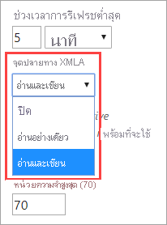
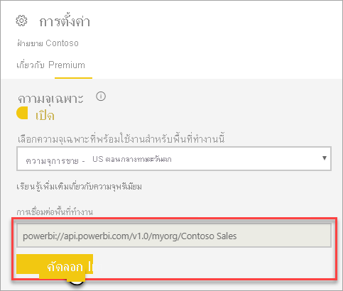
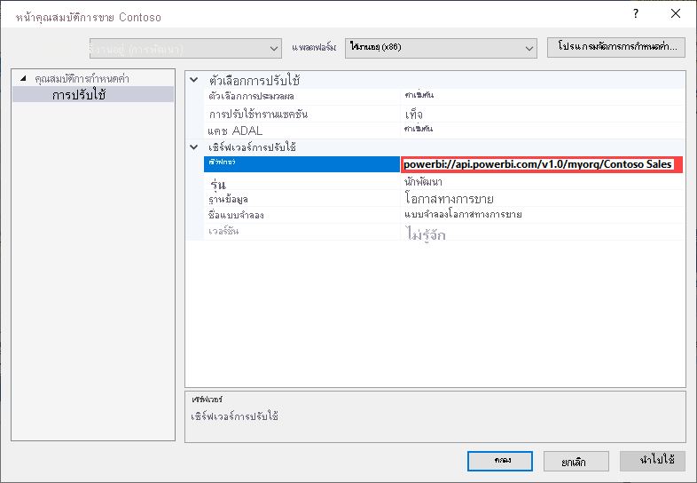
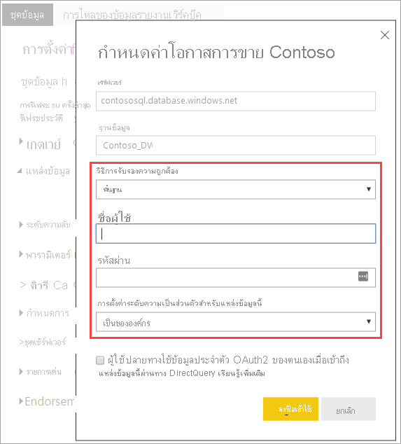
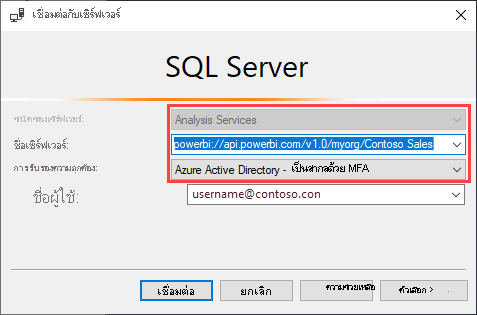
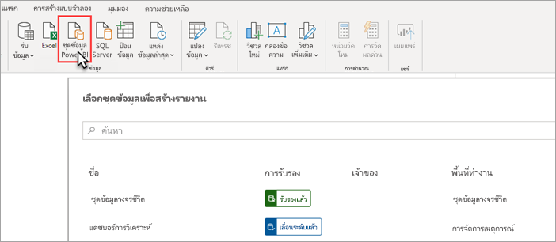
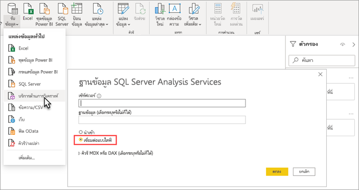

# การเชื่อมต่อชุดข้อมูลด้วยปลายทาง XMLADataset connectivity with the XMLA endpoint

พื้นที่ทำงานและชุดข้อมูลของ Power BI Premium ที่ระดับความเข้ากันได้ 1500 และสูงกว่าสนับสนุนการเชื่อมต่อแบบเปิดแพลตฟอร์มจาก Microsoft และแอปพลิเคชันและเครื่องมือไคลเอ็นต์บุคคลที่สามโดยใช้ *ตำแหน่งข้อมูล XMLA*Power BI Premium workspaces and datasets at the 1500 and higher compatibility level support open-platform connectivity from Microsoft and third-party client applications and tools by using an *XMLA endpoint*.

## ตำแหน่งข้อมูล XMLA คืออะไรWhat's an XMLA endpoint?

Power BI Premium ใช้โพรโทคอล [XML สำหรับการวิเคราะห์](/analysis-services/xmla/xml-for-analysis-xmla-reference?view=power-bi-premium-current&preserve-view=true) (XMLA) สำหรับการติดต่อสื่อสารระหว่างแอปพลิเคชันไคลเอ็นต์และเครื่องมือที่จัดการพื้นที่ทำงานและชุดข้อมูล Power BI ของคุณPower BI Premium uses the [XML for Analysis](/analysis-services/xmla/xml-for-analysis-xmla-reference?view=power-bi-premium-current&preserve-view=true) (XMLA) protocol for communications between client applications and the engine that manages your Power BI workspaces and datasets. การสื่อสารเหล่านี้จะผ่านสิ่งที่เรียกโดยทั่วไปว่าเป็นตำแหน่งข้อมูล XMLAThese communications are through what are commonly referred to as XMLA endpoints. XMLA เป็นโพรโทคอติดต่อสื่อสารเดียวกันที่โปรแกรม Microsoft Analysis Services ใช้ที่อยู่ภายใน Hood ซึ่งเรียกใช้การจำลองแบบภาพรวม นโยบายการกำกับดูแล วงจรชีวิต และการจัดการข้อมูลของ Power BIXMLA is the same communication protocol used by the Microsoft Analysis Services engine, which under the hood, runs Power BI's semantic modeling, governance, lifecycle, and data management. ข้อมูลที่ส่งผ่านโปรโตคอล XMLA จะถูกเข้ารหัสอย่างสมบูรณ์Data sent over the XMLA protocol is fully encrypted.

ตามค่าเริ่มต้น การเชื่อมต่อ *แบบอ่านอย่างเดียว* ที่ใช้ตำแหน่งข้อมูลจะเปิดใช้งานสำหรับ **ปริมาณงานของชุดข้อมูล** ในความจุBy default, *read-only* connectivity using the endpoint is enabled for the **Datasets workload** in a capacity. ด้วยการเชื่อมต่อแบบอ่านอย่างเดียว แอปพลิเคชันการจัดรูปแบบการแสดงข้อมูลและเครื่องมือสามารถคิวรีข้อมูลแบบจำลองของชุดข้อมูล เมตาดาต้า เหตุการณ์ และ schema ได้With read-only, data visualization applications and tools can query dataset model data, metadata, events, and schema. การดำเนินการ *แบบอ่าน-เขียน* ที่ใช้ตำแหน่งข้อมูลสามารถเปิดใช้งานการจัดการชุดข้อมูลเพิ่มเติม นโยบายการกำกับดูแล การสร้างแบบจำลองความหมายขั้นสูง การดีบัก และการตรวจสอบได้*Read-write* operations using the endpoint can be enabled providing additional dataset management, governance, advanced semantic modeling, debugging, and monitoring. ด้วยการเปิดใช้งานการอ่าน-เขียน ชุดข้อมูล Power BI Premium มีพาริตี้กับ Azure Analysis Services และเครื่องมือและกระบวนการสร้างแบบจำลองตารางระดับองค์กรของ SQL Server Analysis Services มากขึ้นWith read-write enabled, Power BI Premium datasets have more parity with Azure Analysis Services and SQL Server Analysis Services enterprise grade tabular modeling tools and processes.

> [!NOTE]
> ขอแนะนำให้คุณใช้ประสบการณ์ของพื้นที่ทำงานที่ทันสมัยโดยเฉพาะอย่างยิ่งเมื่อเชื่อมต่อกับชุดข้อมูลของคุณโดยใช้จุดสิ้นสุด XMLAIt's recommended you use the modern workspace experience, especially when connecting to your datasets by using the XMLA endpoint. การดำเนินการเช่นการสร้างหรือการลบชุดข้อมูลไม่ได้รับการรองรับด้วยพื้นที่ทำงานคลาสสิกOperations such as creating or deleting datasets are not supported with classic workspaces. เมื่อต้องการอัปเกรดพื้นที่ทำงานแบบคลาสสิกไปยังประสบการณ์การใช้งานที่ทันสมัยให้ดู [การอัปเกรดพื้นที่ทำงานคลาสสิกใน Power BI](../collaborate-share/service-upgrade-workspaces.md)To upgrade classic workspaces to the modern experience, see [Upgrade classic workspaces in Power BI](../collaborate-share/service-upgrade-workspaces.md).

## เครื่องมือการสร้างแบบจำลองข้อมูลและการจัดการData modeling and management tools

รายการด้านล่างนี้เป็นเครื่องมือทั่วไปที่ใช้กับ Azure Analysis Services และ SQL Server Analysis Services และตอนนี้ได้รับการสนับสนุนโดยชุดข้อมูล Power BI Premium:Listed below are some of the most common tools used with Azure Analysis Services and SQL Server Analysis Services, and now supported by Power BI Premium datasets:

**Visual Studio พร้อมโครงการ Analysis Services**  – หรือที่เรียกว่าเครื่องมือข้อมูล SQL Server หรือสั้นๆ ว่า **SSDT** เป็นเครื่องมือการสร้างแบบจำลองระดับองค์กรสำหรับแบบจำลองตาราง Analysis Services**Visual Studio with Analysis Services projects** – Also known as SQL Server Data Tools, or simply **SSDT**, is an enterprise grade model authoring tool for Analysis Services tabular models. ส่วนขยายโครงการ Analysis Services ได้รับการสนับสนุนใน Visual Studio 2017 และรุ่นที่ใหม่กว่าทั้งหมด รวมถึงรุ่นใช้งานฟรีสำหรับชุมชนด้วยAnalysis Services projects extensions are supported on all Visual Studio 2017 and later editions, including the free Community edition. จำเป็นต้องใช้เวอร์ชันส่วนขยาย 2.9.14 หรือสูงกว่าเพื่อปรับใช้แบบจำลองตารางไปยังพื้นที่ทำงานแบบพรีเมียมExtension version 2.9.14 or higher is required to deploy tabular models to a Premium workspace. เมื่อปรับใช้กับพื้นที่ทำงานแบบพรีเมียม แบบจำลองต้องอยู่ในระดับความเข้ากันได้ 1500 หรือสูงกว่าWhen deploying to a Premium workspace, the model must be at the 1500 or higher compatibility level. จำเป็นต้องมี XMLA แบบอ่าน-เขียน  สำหรับปริมาณงานของชุดข้อมูลXMLA read-write is required on the datasets workload. หากต้องการเรียนรู้เพิ่มเติม โปรดดูที่ [เครื่องมือสำหรับ Analysis Services](/analysis-services/tools-and-applications-used-in-analysis-services?view=power-bi-premium-current&preserve-view=true)To learn more, see [Tools for Analysis Services](/analysis-services/tools-and-applications-used-in-analysis-services?view=power-bi-premium-current&preserve-view=true).

**SQL Server Management Studio (SSMS)**   - รองรับคิวรี DAX  MDX และ XMLA**SQL Server Management Studio (SSMS)** - Supports DAX, MDX, and XMLA queries. ดำเนินการรีเฟรชแบบละเอียดและการเขียนสคริปต์ชุดข้อมูลเมตาดาต้าโดยใช้ [Tabular Model Scripting Language](/analysis-services/tmsl/tabular-model-scripting-language-tmsl-reference) (TMSL)Perform fine-grain refresh operations and scripting of dataset metadata by using the [Tabular Model Scripting Language](/analysis-services/tmsl/tabular-model-scripting-language-tmsl-reference) (TMSL). ต้องมีรูปแบบการอ่านอย่างเดียวสำหรับการดำเนินการคิวรีRead-only is required for query operations. ต้องมีรูปแบบการอ่าน-เขียนสำหรับการเขียนสคริปต์ชุดข้อมูลเมตาดาต้าRead-write is required for scripting metadata. จำเป็นต้องใช้ SSMS เวอร์ชัน **18.8** หรือสูงกว่าRequires SSMS version **18.8** or higher. ดาวน์โหลด  [ที่นี่](/sql/ssms/download-sql-server-management-studio-ssms)Download [here](/sql/ssms/download-sql-server-management-studio-ssms).

**ตัวสร้างโปรไฟล์ของ SQL Server** - ติดตั้งพร้อมกับ SSMS โดยเครื่องมือนี้มีการติดตาม และการดีบักของเหตุการณ์ชุดข้อมูล**SQL Server Profiler** – Installed with SSMS, this tool provides tracing and debugging of dataset events. ในขณะที่ SQL Server ถูกเลิกใช้งานอย่างเป็นทางการแล้ว แต่ตัวสร้างโปรไฟล์ยังคงรวมอยู่ใน SSMS และยังคงรองรับสำหรับ Analysis Services และ Power BI PremiumWhile officially deprecated for SQL Server, Profiler continues to be included in SSMS and remains supported for Analysis Services and Power BI Premium. จำเป็นต้องใช้ SQL Server Profiler เวอร์ชัน **18.8** หรือสูงกว่า และการตั้งค่า XMLA แบบอ่านได้เท่านั้นเพื่อเปิดใช้งานบนความจุแบบพรีเมียมRequires SQL Server Profiler version **18.8** or higher, and XMLA read-only setting to be enabled on the Premium capacity. ผู้ใช้ต้องระบุชุดข้อมูล ([แค็ตตาล็อกเริ่มต้น](#initial-catalog)) เมื่อเชื่อมต่อกับจุดสิ้นสุด XMLAUser must specify the dataset ([initial catalog](#initial-catalog)) when connecting to the XMLA endpoint. หากต้องการเรียนรู้เพิ่มเติม ดู  [ตัวสร้างโปรไฟล์ SQL Server สำหรับ Analysis Services](/analysis-services/instances/use-sql-server-profiler-to-monitor-analysis-services?view=power-bi-premium-current&preserve-view=true)To learn more, see [SQL Server Profiler for Analysis Services](/analysis-services/instances/use-sql-server-profiler-to-monitor-analysis-services?view=power-bi-premium-current&preserve-view=true).

**ตัวช่วยสร้างการปรับใช้ Analysis Services**  - ติดตั้งพร้อมกับ SSMS เครื่องมือนี้มีการปรับใช้โครงการแบบจำลองตารางที่สร้างโดย Visual Studio ไปยัง Analysis Services และพื้นที่ทำงาน Power BI Premium**Analysis Services Deployment Wizard** – Installed with SSMS, this tool provides deployment of Visual Studio authored tabular model projects to Analysis Services and Power BI Premium workspaces. สามารถเรียกใช้แบบโต้ตอบหรือจากบรรทัดคำสั่งสำหรับการทำงานอัตโนมัติIt can be run interactively or from the command line for automation. จำเป็นต้องมี XMLA แบบอ่าน-เขียนXMLA read-write is required. หากต้องการเรียนรู้เพิ่มเติม ดู [ตัวช่วยสร้างการปรับใช้ Analysis Services](/analysis-services/deployment/deploy-model-solutions-using-the-deployment-wizard?view=power-bi-premium-current&preserve-view=true)To learn more, see [Analysis Services Deployment Wizard](/analysis-services/deployment/deploy-model-solutions-using-the-deployment-wizard?view=power-bi-premium-current&preserve-view=true).

**PowerShell cmdlet**  – cmdlet ของ Analysis Services สามารถใช้เพื่อทำให้งานการจัดการชุดข้อมูลเช่นการดำเนินการรีเฟรชเป็นไปอย่างอัตโนมัติ**PowerShell cmdlets** – Analysis Services cmdlets can be used to automate dataset management tasks like refresh operations. จำเป็นต้องมี XMLA แบบอ่าน-เขียนXMLA read-write is required. จำเป็นต้องใช้เวอร์ชัน **21.1.18221** หรือสูงกว่าของ [มอดูล SqlServer PowerShell](https://www.powershellgallery.com/packages/SqlServer/)Version **21.1.18221** or higher of the [SqlServer PowerShell module](https://www.powershellgallery.com/packages/SqlServer/) is required. Cmdlet ของ Azure Analysis Services ในมอดูล Az.AnalysisServices ไม่ได้รับการสนับสนุนสำหรับ Power BI PremiumAzure Analysis Services cmdlets in the Az.AnalysisServices module are not supported for Power BI Premium. หากต้องการเรียนรู้เพิ่มเติม โปรดดู [การอ้างอิงPowerShell ของ Analysis Services](/analysis-services/powershell/analysis-services-powershell-reference?view=power-bi-premium-current&preserve-view=true)To learn more, see [Analysis Services PowerShell Reference](/analysis-services/powershell/analysis-services-powershell-reference?view=power-bi-premium-current&preserve-view=true).

**ตัวสร้างรายงานใน Power BI**  - เป็นเครื่องมือสำหรับเขียนรายงานแบบแบ่งหน้า**Power BI Report Builder** - A tool for authoring paginated reports. สร้างข้อกำหนดของรายงานที่ระบุว่าจะเรียกใช้ข้อมูลใด สถานที่เรียก และวิธีแสดงข้อมูลดังกล่าวCreate a report definition that specifies what data to retrieve, where to get it, and how to display it. คุณสามารถดูตัวอย่างรายงานของคุณในตัวสร้างรายงาน แล้วเผยแพร่รายงานของคุณไปยังบริการ Power BI ได้You can preview your report in Report Builder and then publish your report to the Power BI service. จำเป็นต้องมี XMLA แบบอ่านอย่างเดียวXMLA read-only is required. หากต้องการเรียนรู้เพิ่มเติม โปรดดู  [ตัวสร้างรายงาน Power BI](../paginated-reports/report-builder-power-bi.md)To learn more, see [Power BI Report Builder](../paginated-reports/report-builder-power-bi.md).

**ตัวแก้ไขตาราง** - เครื่องมือโอเพนซอร์สสำหรับการสร้าง การบำรุงรักษา และการจัดการแบบจำลองตารางโดยใช้ตัวแก้ไขที่ใช้งานง่ายและมีน้ำหนักเบา**Tabular Editor** - An open-source tool for creating, maintaining, and managing tabular models using an intuitive, lightweight editor. มุมมองแบบลำดับชั้นจะแสดงวัตถุทั้งหมดในแบบจำลองตารางของคุณA hierarchical view shows all objects in your tabular model. วัตถุได้รับการจัดระเบียบโดยการแสดงโฟลเดอร์พร้อมรองรับการแก้ไขคุณสมบัติแบบเลือกได้หลายรายการและการเน้นไวยากรณ์ DAXObjects are organized by display folders with support for multi-select property editing and DAX syntax highlighting. ต้องมี XMLA แบบอ่านอย่างเดียวสำหรับการดำเนินการคิวรีXMLA read-only is required for query operations. ต้องมีรูปแบบการอ่าน-เขียนสำหรับการดำเนินการเมตาดาต้าRead-write is required for metadata operations. หากต้องการเรียนรู้เพิ่มเติม ดู [tabulareditor.github.io](https://tabulareditor.github.io/)To learn more, see [tabulareditor.github.io](https://tabulareditor.github.io/).

**DAX Studio**  – เครื่องมือโอเพนซอร์สสำหรับการสร้าง การวินิจฉัย การปรับแต่งประสิทธิภาพ และการวิเคราะห์ DAX**DAX Studio** – An open-source tool for DAX authoring, diagnosis, performance tuning, and analysis. คุณลักษณะต่างๆ ประกอบด้วยการค้นหาวัตถุ การติดตามแบบรวม การแยกย่อยการประมวลผลคิวรีด้วยสถิติโดยละเอียด การเน้นไวยากรณ์และการจัดรูปแบบของ DAXFeatures include object browsing, integrated tracing, query execution breakdowns with detailed statistics, DAX syntax highlighting and formatting. ต้องมี XMLA แบบอ่านอย่างเดียวสำหรับการดำเนินการคิวรีXMLA read-only is required for query operations. หากต้องการเรียนรู้เพิ่มเติม ดู [daxstudio.org](https://daxstudio.org/)To learn more, see [daxstudio.org](https://daxstudio.org/).

**ALM Toolkit** - เครื่องมือการเปรียบเทียบ Schema แบบโอเพนซอร์สสำหรับชุดข้อมูล Power BI ซึ่งใช้บ่อยที่สุดสำหรับสถานการณ์การจัดการวงจรชีวิตของแอปพลิเคชัน (ALM)**ALM Toolkit** - An open-source schema compare tool for Power BI datasets, most often used for application lifecycle management (ALM) scenarios. ดำเนินการปรับใช้ข้ามสภาพแวดล้อมและรักษาข้อมูลในอดีตที่มีการรีเฟรชแบบเพิ่มหน่วยPerform deployment across environments and retain incremental refresh historical data. Diff และผสานไฟล์ สาขา และรายงานเมตาดาต้าDiff and merge metadata files, branches, and repos. นำข้อกำหนดทั่วไปมาใช้ใหม่ระหว่างชุดข้อมูลReuse common definitions between datasets. ต้องมีรูปแบบการอ่านอย่างเดียวสำหรับการดำเนินการคิวรีRead-only is required for query operations. ต้องมีรูปแบบการอ่าน-เขียนสำหรับการดำเนินการเมตาดาต้าRead-write is required for metadata operations. หากต้องการเรียนรู้เพิ่มเติม ดู [alm-toolkit.com](http://alm-toolkit.com/)To learn more, see [alm-toolkit.com](http://alm-toolkit.com/).

**Microsoft Excel** – Excel PivotTables เป็นเครื่องมือที่ใช้บ่อยที่สุดในการสรุปวิเคราะห์สำรวจและนำเสนอข้อมูลสรุปจาก Power BI**Microsoft Excel** – Excel PivotTables are one of the most common tools used to summarize, analyze, explore, and present summary data from Power BI datasets. ต้องมีรูปแบบการอ่านอย่างเดียวสำหรับการดำเนินการคิวรีRead-only is required for query operations. จำเป็นต้องใช้ Office 16.0.11326.10000 เวอร์ชันหรือสูงกว่าClick-to-Run version of Office 16.0.11326.10000 or higher is required.

**บุคคลที่สาม** - รวมถึงแอปพลิเคชันและเครื่องมือการจัดรูปแบบการแสดงข้อมูลไคลเอ็นต์ที่สามารถเชื่อมต่อ คิวรี และใช้ชุดข้อมูลใน Power BI Premium**Third party** - Includes client data visualization applications and tools that can connect to, query, and consume datasets in Power BI Premium. เครื่องมือส่วนใหญ่จำเป็นต้องมีเวอร์ชันล่าสุดของไลบรารีไคลเอ็นต์ MSOLAP แต่บางอย่างอาจใช้ ADOMDMost tools require the latest versions of MSOLAP client libraries, but some may use ADOMD. จุดปลายทาง XMLA แบบอ่านอย่างเดียวหรืออ่าน-เขียนจะขึ้นอยู่กับการดำเนินการRead-only or read-write XMLA Endpoint is dependent on the operations.

### ไลบรารีไคลเอ็นต์Client libraries

แอปพลิเคชันไคลเอ็นต์ไม่สื่อสารโดยตรงกับตำแหน่งข้อมูล XMLAClient applications don't communicate directly with the XMLA endpoint. แต่ใช้ *ไลบรารีไคลเอ็นต์* เป็นเลเยอร์นามธรรมInstead, they use *client libraries* as an abstraction layer. รายการเหล่านี้เป็นไลบรารีไคลเอ็นต์เดียวกับที่แอปพลิเคชันใช้เพื่อเชื่อมต่อกับ Azure Analysis Services และ SQL Server Analysis ServicesThese are the same client libraries that applications use to connect to Azure Analysis Services and SQL Server Analysis Services. แอปพลิเคชัน  Microsoft เช่น Excel, SQL Server Management Studio (SSMS) และ ส่วนขยายโครงการ Analysis Services สำหรับ Visual Studio จะติดตั้งไลบรารีไคลเอ็นต์ทั้งหมดสามรายการ และอัปเดตพร้อมกับการอัปเดตแอปพลิเคชันทั่วไปMicrosoft applications like Excel, SQL Server Management Studio (SSMS), and  Analysis Services projects extension for Visual Studio install all three client libraries and update them along with regular application and extension updates. นักพัฒนายังสามารถใช้ไลบรารีไคลเอ็นต์เพื่อสร้างแอปพลิเคชันแบบกำหนดเองได้Developers can also use the client libraries to build custom applications. ในบางกรณีโดยเฉพาะอย่างยิ่งกับแอปพลิเคชันของบุคคลที่สาม ถ้าไม่มีการติดตั้งแอปพลิเคชันไว้ อาจจำเป็นต้องติดตั้งไลบรารีไคลเอ็นต์ในเวอร์ชันที่ใหม่กว่าIn some cases, particularly with third-party applications, if not installed with the application, it may be necessary to install newer versions of the client libraries. ไลบรารีไคลเอ็นต์ได้รับการอัปเดตเป็นรายเดือนClient libraries are updated monthly. หากต้องการเรียนรู้เพิ่มเติม โปรดดู  [ไลบรารีไคลเอ็นต์สำหรับการเชื่อมต่อไปยัง Analysis Services](/azure/analysis-services/analysis-services-data-providers)To learn more, see [Client libraries for connecting to Analysis Services](/azure/analysis-services/analysis-services-data-providers).

## ปรับชุดข้อมูลให้เหมาะสมสำหรับการดำเนินการเขียนโดยการเปิดใช้งานแบบจำลองขนาดใหญ่Optimize datasets for write operations by enabling large models

เมื่อใช้ตำแหน่งข้อมูล XMLA สำหรับการจัดการชุดข้อมูลที่มีการดำเนินการเขียน ขอแนะนำให้คุณเปิดใช้งานชุดข้อมูลสำหรับแบบจำลองขนาดใหญ่When using the XMLA endpoint for dataset management with write operations, it's recommended you enable the dataset for large models. สิ่งนี้จะลดค่าใช้จ่ายในการดำเนินการเขียนซึ่งสามารถทำให้การดำเนินการเร็วขึ้นมากThis reduces the overhead of write operations, which can make them considerably faster. สำหรับชุดข้อมูลขนาดเกินกว่า 1 GB (หลังจากการบีบอัด) ความแตกต่างสามารถมีนัยสำคัญFor datasets over 1 GB in size (after compression), the difference can be significant. หากต้องการเรียนรู้เพิ่มเติม โปรดดู [แบบจำลองขนาดใหญ่ใน Power BI Premium](service-premium-large-models.md)To learn more, see [Large models in Power BI Premium](service-premium-large-models.md).

## เปิดใช้งาน XMLA แบบอ่าน-เขียนEnable XMLA read-write

ตามค่าเริ่มต้น ความจุแบบพรีเมียมมีการตั้งค่าคุณสมบัติตำแหน่งข้อมูล XMLA ที่เปิดใช้งานสำหรับแบบอ่านอย่างเดียวBy default, a Premium capacity has the XMLA Endpoint property setting enabled for read-only. ซึ่งหมายความว่าแอปพลิเคชันสามารถคิวรีได้เฉพาะชุดข้อมูลเท่านั้นThis means applications can only query a dataset. สำหรับแอปพลิเคชันในการดำเนินการเขียน จะต้องเปิดใช้งานคุณสมบัติตำแหน่งข้อมูล XMLA สำหรับการอ่าน-เขียนFor applications to perform write operations, the XMLA Endpoint property must be enabled for read-write. การตั้งค่าคุณสมบัติตำแหน่งข้อมูล XMLA สำหรับกำลังความจุจะถูกกำหนดค่าใน **ปริมาณงานของชุดข้อมูล**The XMLA Endpoint property setting for a capacity is configured in the **Datasets workload**. การตั้งค่าตำแหน่งข้อมูล XMLA จะนำไปใช้กับ *พื้นที่ทำงานและชุดข้อมูลทั้งหมด* ที่กำหนดให้กับความจุThe XMLA Endpoint setting applies to *all workspaces and datasets* assigned to the capacity.

### เมื่อต้องการเปิดใช้งานการอ่าน-เขียนสำหรับความจุTo enable read-write for a capacity

1. ในพอร์ทัลผู้ดูแลระบบ ให้เลือก **การตั้งค่าความจุ** > **Power BI Premium** > ชื่อความจุIn the Admin portal, select **Capacity settings** > **Power BI Premium** > capacity name.
2. ขยาย **ปริมาณงาน**Expand **Workloads**. ในการตั้งค่า **ตำแหน่งข้อมูล XMLA** เลือก **อ่าน เขียน**In the **XMLA Endpoint** setting, select **Read Write**.

    

## การเชื่อมต่อกับพื้นที่ทำงาน PremiumConnecting to a Premium workspace

พื้นที่ทำงานที่กำหนดไว้สำหรับความจุมีสตริงการเชื่อมต่อในรูปแบบ URL ในลักษณะนี้Workspaces assigned to a capacity have a connection string in URL format like this,  
`powerbi://api.powerbi.com/v1.0/[tenant name]/[workspace name]`.`powerbi://api.powerbi.com/v1.0/[tenant name]/[workspace name]`.

แอปพลิเคชันที่เชื่อมต่อกับพื้นที่ทำงานใช้ URL ราวกับว่าเป็นชื่อเซิร์ฟเวอร์ Analysis ServicesApplications connecting to the workspace use the URL as if it were an Analysis Services server name. ตัวอย่างเช่นFor example,  
`powerbi://api.powerbi.com/v1.0/contoso.com/Sales Workspace`.`powerbi://api.powerbi.com/v1.0/contoso.com/Sales Workspace`.

ผู้ใช้ที่มี UPN ในผู้เช่าเดียวกัน (ไม่ใช่ B2B) สามารถแทนที่ชื่อผู้เช่าด้วย `myorg`Users with UPNs in the same tenant (not B2B) can replace the tenant name with `myorg`. ตัวอย่างเช่น   
`powerbi://api.powerbi.com/v1.0/myorg/Sales Workspace`For example,  
`powerbi://api.powerbi.com/v1.0/myorg/Sales Workspace`.

ผู้ใช้ B2B ต้องระบุ UPN องค์กรของพวกเขาในชื่อผู้เช่าB2B users must specify their organization UPN in tenant name. ตัวอย่างเช่นFor example,  
`powerbi://api.powerbi.com/v1.0/fabrikam.com/Sales Workspace`.`powerbi://api.powerbi.com/v1.0/fabrikam.com/Sales Workspace`.

### หากต้องการรับ URL การเชื่อมต่อพื้นที่ทำงานTo get the workspace connection URL

ในพื้นที่ทำงาน **การตั้งค่า** > **พรีเมียม** > **การเชื่อมต่อพื้นที่ทำงาน** ให้คลิก **คัดลอก**In workspace **Settings** > **Premium** > **Workspace Connection**, select **Copy**.

## ข้อกำหนดของการเชื่อมต่อConnection requirements

### แค็ตตาล็อกเริ่มต้นInitial catalog

ด้วยเครื่องมือบางประเภท เช่น SQL Server Profiler คุณต้องระบุ *แค็ตตาล็อกเริ่มต้น* ซึ่งเป็นชุดข้อมูล (ฐานข้อมูล) ที่จะเชื่อมต่อกับพื้นที่ทำงานของคุณWith some tools, such as SQL Server Profiler, you must specify an *Initial Catalog*, which is the dataset (database) to connect to in your workspace. ในกล่องโต้ตอบ **เชื่อมต่อกับเซิร์ฟเวอร์** ให้เลือก **ตัวเลือก** > **คุณสมบัติการเชื่อมต่อ** >  **เชื่อมต่อกับฐานข้อมูล** แล้วกรอกชื่อชุดข้อมูลIn the **Connect to Server** dialog, select **Options** > **Connection Properties** > **Connect to database**, enter the dataset name.

### ชื่อพื้นที่ทำงานที่ซ้ำกันDuplicate workspace names

[พื้นที่ทำงานใหม่](../collaborate-share/service-new-workspaces.md) (สร้างขึ้นโดยใช้ประสบการณ์พื้นที่ทำงานใหม่) ใน Power BI จะกำหนดการตรวจสอบความถูกต้องเพื่อไม่ให้มีการสร้างหรือเปลี่ยนชื่อพื้นที่ทำงานด้วยชื่อที่ซ้ำกัน[New workspaces](../collaborate-share/service-new-workspaces.md) (created using the new workspace experience) in Power BI impose validation to disallow creating or renaming workspaces with duplicate names. พื้นที่ทำงานที่ยังไม่ได้รับการโยกย้ายอาจส่งผลให้มีชื่อที่ซ้ำกันWorkspaces that haven't been migrated can result in duplicate names. เมื่อเชื่อมต่อกับพื้นที่ทำงานโดยใช้ชื่อเดียวกันกับพื้นที่ทำงานอื่น คุณอาจได้รับข้อมูลข้อผิดพลาดดังต่อไปนี้:When connecting to a workspace with the same name as another workspace, you may get the following error:

**ไม่สามารถเชื่อมต่อกับ powerbi://api.powerbi.com/v1.0/ [ชื่อผู้เช่า] / [ชื่อพื้นที่ทำงาน] ได้****Cannot connect to powerbi://api.powerbi.com/v1.0/[tenant name]/[workspace name].**

หากต้องการแก้ไขข้อผิดพลาดนี้ นอกเหนือจากชื่อพื้นที่ทำงาน ให้ระบุ ObjectIDGuid ซึ่งคุณสามารถคัดลอกจาก objectID ของพื้นที่ทำงานใน URLTo work around this error, in addition to the workspace name, specify the ObjectIDGuid, which can be copied from the workspace objectID in the URL. ผนวก objectID เข้ากับ URL การเชื่อมต่อAppend the objectID to the connection URL. ตัวอย่างเช่นFor example,  
'powerbi://api.powerbi.com/v1.0/myorg/Contoso Sales - 9d83d204-82a9-4b36-98f2-a40099093830'.'powerbi://api.powerbi.com/v1.0/myorg/Contoso Sales - 9d83d204-82a9-4b36-98f2-a40099093830'.

### ชื่อชุดข้อมูลที่ซ้ำกันDuplicate dataset name

เมื่อเชื่อมต่อกับชุดข้อมูลที่มีชื่อเดียวกันเป็นชุดข้อมูลอื่นในพื้นที่ทำงานเดียวกัน จะผนวก guid ชุดข้อมูลเข้ากับชื่อชุดข้อมูลWhen connecting to a dataset with the same name as another dataset in the same workspace, append the dataset guid to the dataset name. คุณอาจได้รับทั้งชื่อชุดข้อมูลและ guid เมื่อเชื่อมต่อกับพื้นที่ทำงานใน SSMSYou can get both dataset name and guid when connected to the workspace in SSMS.

### ความล่าช้าในชุดข้อมูลที่แสดงDelay in datasets shown

เมื่อเชื่อมต่อกับพื้นที่ทำงาน การเปลี่ยนแปลงจากชุดข้อมูลใหม่ ชุดข้อมูลที่ถูกลบ ชุดข้อมูลที่ถูกเปลี่ยนชื่ออาจใช้เวลาเล็กน้อยจึงจะปรากฎขึ้นWhen connecting to a workspace, changes from new, deleted, and renamed datasets can take up to a few minutes to appear.

### ชุดข้อมูลที่ไม่สนับสนุนUnsupported datasets

ชุดข้อมูลต่อไปนี้จะไม่สามารถเข้าถึงได้โดยตำแหน่งข้อมูล XMLAThe following datasets aren't accessible by the XMLA endpoint. ชุดข้อมูลเหล่านี้จะไม่ปรากฏภายใต้พื้นที่ทำงานใน SSMS หรือเครื่องมืออื่น ๆ :These datasets won't appear under the workspace in SSMS or in other tools:

- ชุดข้อมูลที่อ้างอิงจากการเชื่อมต่อสดไปยังแบบจำลอง Azure Analysis Services และ SQL Server Analysis ServicesDatasets based on a live connection to an Azure Analysis Services or SQL Server Analysis Services model. 
- ชุดข้อมูลที่อ้างอิงจากการเชื่อมต่อสดไปยังชุดข้องมูล Power BI ในพื้นที่ทำงานอื่นDatasets based on a live connection to a Power BI dataset in another workspace. หากต้องการเรียนรู้เพิ่มเติม ดู [บทนำชุดข้อมูลทั้งพื้นที่ทำงาน](../connect-data/service-datasets-across-workspaces.md)To learn more, see [Intro to datasets across workspaces](../connect-data/service-datasets-across-workspaces.md).
- ชุดข้อมูลที่มีการส่งข้อมูลโดยใช้ REST APIDatasets with Push data by using the REST API.
- ชุดข้อมูลสมุดงาน ExcelExcel workbook datasets.

### นามแฝงของเซิร์ฟเวอร์/พื้นที่ทำงานServer/workspace alias

พื้นที่ทำงานของ Power BI Premium ไม่รองรับนามแฝงชื่อเซิร์ฟเวอร์ซึ่งมีการรองรับใน Azure Analysis ServicesServer name aliases, supported in Azure Analysis Services are not supported for Power BI Premium workspaces.

## ความปลอดภัยSecurity

นอกเหนือจากคุณสมบัติตำแหน่งข้อมูล XMLA ที่เปิดใช้งานการอ่าน-เขียนโดยผู้ดูแลระบบความจุ ต้องเปิดใช้การตั้งค่าระดับผู้เช่า **อนุญาตตำแหน่งข้อมูล XMLA และวิเคราะห์ใน Excel กับชุดข้อมูลภายในองค์กร** ในพอร์ทัลผู้ดูแลระบบIn addition to the XMLA Endpoint property being enabled read-write by the capacity admin, the tenant-level setting **Allow XMLA endpoints and Analyze in Excel with on-premises datasets** must be enabled in the admin portal. หากคุณต้องการสร้างไฟล์ AIXL ที่เชื่อมต่อกับตำแหน่งข้อมูล XMLA คุณควรเปิดใช้งานการตั้งค่าระดับผู้เช่า **อนุญาตการเชื่อมต่อแบบสด** ด้วยIf you need to generate AIXL files that connect to the XMLA Endpoint, the tenant-level setting **Allow live connections** should also be enabled. การตั้งค่าเหล่านี้เปิดใช้งานการอนุญาตทั้งคู่ตามค่าเริ่มต้นThese settings are both enabled by default.

**อนุญาตให้ใช้งานตำแหน่งข้อมูล XMLA และวิเคราะห์ใน Excel กับชุดข้อมูลภายในองค์กร** เป็นการตั้งค่าการรวม**Allow XMLA endpoints and Analyze in Excel with on-premises datasets** is an integration setting.

:::image type="content" source="media/service-premium-connect-tools/allow-xmla-endpoints.png" alt-text="การตั้งค่าการรวมอนุญาตให้ใช้ตำแหน่งข้อมูล XMLA":::

**อนุญาตการเชื่อมต่อแบบสด** คือการตั้งค่าการส่งออกและการแบ่งปัน**Allow live connections** is an export and sharing setting.

:::image type="content" source="media/service-premium-connect-tools/allow-live-connections.png" alt-text="การตั้งค่าการส่งออกและการแบ่งปันอนุญาตการเชื่อมต่อแบบสด":::

การเข้าถึงผ่านตำแหน่งข้อมูล XMLA จะเป็นการเคารพความเป็นสมาชิกกลุ่มความปลอดภัยที่ระดับพื้นที่ทำงาน/แอปAccess through the XMLA endpoint will honor security group membership set at the workspace/app level.

ผู้สนับสนุนพื้นที่ทำงานและผู้ที่อยู่ในระดับสูงกว่า มีการเขียนการเข้าถึงชุดข้อมูล และดังนั้นจึงเทียบเท่ากับผู้ดูแลฐานข้อมูล Analysis ServicesWorkspace contributors and above have write access to the dataset and are therefore equivalent to Analysis Services database admins. พวกเขาสามารถปรับใช้ชุดข้อมูลใหม่จาก Visual Studio และดำเนินการกับสคริปต์ TMSL ใน SSMS ได้They can deploy new datasets from Visual Studio and execute TMSL scripts in SSMS.

การดำเนินการที่ต้องการสิทธิ์ผู้ดูแลระบบเซิร์ฟเวอร์ Analysis Services (แทนที่จะเป็นผู้ดูแลระบบฐานข้อมูล) เช่นการติดตามระดับเซิร์ฟเวอร์ และการเลียนแบบผู้ใช้โดยใช้คุณสมบัติสตริงการเชื่อมต่อ [EffectiveUserName](/analysis-services/instances/connection-string-properties-analysis-services?view=power-bi-premium-current&preserve-view=true#bkmk_auth) ไม่ได้รับการสนับสนุนใน Power BI Premium ในขณะนี้Operations that require Analysis Services server admin permissions (rather than database admin) such as server-level traces and user impersonation using the [EffectiveUserName](/analysis-services/instances/connection-string-properties-analysis-services?view=power-bi-premium-current&preserve-view=true#bkmk_auth) connection-string property are not supported in Power BI Premium at this time.

ผู้ใช้อื่นที่ [สร้างสิทธิ์](../connect-data/service-datasets-build-permissions.md) บนชุดข้อมูลจะถือว่าเท่าเทียมกับผู้อ่านฐานข้อมูล Analysis ServicesOther users who have [Build permission](../connect-data/service-datasets-build-permissions.md) on a dataset are equivalent to Analysis Services database readers. พวกเขาสามารถเชื่อมต่อและเรียกดูชุดข้อมูลสำหรับการใช้งานข้อมูลและการแสดงภาพThey can connect to and browse datasets for data consumption and visualization. กฎการรักษาความปลอดภัยระดับแถว (RLS) ได้รับการยอมรับและพวกเขาไม่สามารถดูชุกข้อมูลเมตาดาต้าภายในได้Row-level security (RLS) rules are honored and they cannot see internal dataset metadata.

### บทบาทแบบจำลองModel roles

ด้วยจุดสิ้นสุด XMLA คุณสามารถกำหนดบทบาทสำหรับชุดข้อมูล สามารถกำหนดความเป็นสมาชิกบทบาทสำหรับผู้ใช้ Azure Active Directory (AAD) และสามารถกำหนดตัวกรองการรักษาความปลอดภัยระดับแถว (RLS) ได้With the XMLA endpoint, roles can be defined for a dataset, role membership can be defined for Azure Active Directory (AAD) users, and row-level security (RLS) filters can be defined. มีการใช้บทบาทแบบจำลองใน Power BI สำหรับ RLS เท่านั้นModel roles in Power BI are used only for RLS. ใช้แบบจำลองการรักษาความปลอดภัย Power BI เพื่อควบคุมสิทธิ์ที่นอกเหนือจาก RLSUse the Power BI security model to control permissions beyond RLS.

สำหรับโครงการแบบจำลองตารางที่ถูกสร้างขึ้นใน Visual Studio คุณสามารถกำหนดบทบาทได้โดยใช้ตัวจัดการบทบาทในตัวออกแบบแบบจำลองFor tabular model projects being authored in Visual Studio, roles can be defined by using Role Manager in the model designer. สำหรับชุดข้อมูลใน Power BI คุณสามารถกำหนดบทบาทได้โดยใช้ SSMS เพื่อสร้างออบเจ็กต์บทบาทและกำหนดคุณสมบัติของบทบาทFor datasets in Power BI, roles can be defined by using SSMS to create role objects and define role properties. อย่างไรก็ตามในกรณีส่วนใหญ่สามารถเขียนสคริปต์นิยามอ็อบเจ็กต์บทบาทโดยใช้ TMSL เพื่อสร้างหรือแก้ไข[อ็อบเจ็กต์บทบาท](/analysis-services/tmsl/roles-object-tmsl?view=power-bi-premium-current&preserve-view=true)In most cases, however, role object definitions can be scripted by using TMSL to create or modify the [Roles object](/analysis-services/tmsl/roles-object-tmsl?view=power-bi-premium-current&preserve-view=true). สามารถเรียกใช้สคริปต์ TMSL ใน SSMS หรือด้วย cmdlet ของ PowerShell [Invoke-ASCmd](/powershell/module/sqlserver/invoke-ascmd?view=sqlserver-ps&preserve-view=true)TMSL scripts can be executed in SSMS or with the [Invoke-ASCmd](/powershell/module/sqlserver/invoke-ascmd?view=sqlserver-ps&preserve-view=true) PowerShell cmdlet.

ข้อจำกัดต่อไปนี้จะนำไปใช้เมื่อทำงานกับบทบาทของชุดข้อมูลผ่านตำแหน่งข้อมูล XMLA:The following limitations apply when working with dataset roles through the XMLA endpoint:

- สิทธิ์สำหรับ *บทบาท* ที่สามารถตั้งค่าสำหรับชุดข้อมูล Power BI คือ สิทธิ์ในการอ่านเท่านั้นThe only permission for a *role* that can be set for Power BI datasets is the Read permission. สิทธิ์อื่น ๆ จะได้รับอนุญาตโดยใช้แบบจำลองความปลอดภัยของ Power BIOther permissions are granted using the Power BI security model.
- สิทธิ์ในการสร้างสำหรับชุดข้อมูลเป็นสิ่งจำเป็นสำหรับการเข้าถึงการอ่านผ่านตำแหน่งข้อมูล XMLA โดยไม่คำนึงถึงการมีอยู่ของบทบาทชุดข้อมูลBuild permission for a dataset is required for read access through the XMLA endpoint, regardless of the existence of dataset roles.
- กฎการรักษาความปลอดภัยระดับวัตถุ (OLS) ไม่ได้รับการสนับสนุนใน Power BI ในขณะนี้Object-level security (OLS) rules are currently not supported in Power BI.

เมื่อต้องการเรียนรู้เพิ่มเติม โปรดดู[บทบาทในแบบจำลองตาราง](/analysis-services/tabular-models/roles-ssas-tabular)To learn more, see [Roles in tabular models](/analysis-services/tabular-models/roles-ssas-tabular).

### การตั้งค่าข้อมูลประจำตัวของแหล่งข้อมูลSetting data-source credentials

เมตาดาต้าที่ระบุผ่านตำแหน่งข้อมูล XMLA สามารถสร้างการเชื่อมต่อไปยังแหล่งข้อมูลได้ แต่ไม่สามารถตั้งค่าข้อมูลประจำตัวของแหล่งข้อมูลได้Metadata specified through the XMLA endpoint can create connections to data sources, but cannot set data-source credentials. คุณสามารถตั้งค่าข้อมูลประจำตัวได้ในหน้าการตั้งค่าชุดข้อมูลในบริการ Power BIInstead, credentials can be set in the dataset settings page in the Power BI Service.

### บริการหลักService principals

บริการหลักคือ การลงทะเบียนแอป Azure Active Directory ที่คุณสร้างภายในผู้เช่าของคุณเพื่อใช้ทรัพยากรที่ไม่ได้ใส่ใจและการดำเนินการระดับบริการService principals are an Azure Active Directory app registration you create within your tenant to perform unattended resource and service level operations. ซึ่งเป็นประเภทข้อมูลประจำตัวของผู้ใช้ที่ไม่ซ้ำกันที่มีชื่อแอป ID แอปพลิเคชัน ID ผู้เช่าและ ข้อมูลลับของไคลเอ็นต์ หรือใบรับรองสำหรับรหัสผ่านThey're a unique type of user identity with an app name, application ID, tenant ID, and client secret or certificate for a password. Power BI Premium ใช้ฟังก์ชันการทำงานของบริการหลักเหมือนกับ Power BI EmbeddedPower BI Premium uses the same service principal functionality as Power BI Embedded.

ใน Power BI Premium ยังคงสามารถใช้บริการหลักได้กับ ตำแหน่งข้อมูล XMLA เพื่อทำให้งานการจัดการชุดข้อมูลเป็นแบบอัตโนมัติ เช่น พื้นที่ทำงานสำหรับจัดเตรียม การปรับใช้แบบจำลอง และการรีเฟรชชุดข้อมูลด้วย:In Power BI Premium, service principals can also be used with the XMLA endpoint to automate dataset management tasks such as provisioning workspaces, deploying models, and dataset refresh with:

- PowerShellPowerShell
- Azure AutomationAzure Automation
- Azure Logic AppsAzure Logic Apps
- แอปพลิเคชันไคลเอ็นต์แบบกำหนดเองCustom client applications

เมื่อต้องการเรียนรู้เพิ่มเติม โปรดดูที่[การดำเนินการพื้นที่ทำงาน Premium และชุดข้อมูลโดยอัตโนมัติด้วยหลักการบริการ](service-premium-service-principal.md)To learn more, see [Automate Premium workspace and dataset tasks with service principals](service-premium-service-principal.md).

## ปรับใช้โครงการแบบจำลองจาก Visual Studio (SSDT)Deploy model projects from Visual Studio (SSDT)

การปรับใช้โครงการแบบจำลองแบบตารางใน Visual Studio ไปยังพื้นที่ทำงานของ Power BI Premium เทียบเท่ากับการปรับใช้กับเซิร์ฟเวอร์ Azure หรือ SQL Server Analysis ServicesDeploying a tabular model project in Visual Studio to a Power BI Premium workspace is much the same as deploying to an Azure or SQL Server Analysis Services server. ความแตกต่างมีเพียงเรื่องของคุณสมบัติเซิร์ฟเวอร์การปรับใช้ที่ระบุสำหรับโครงการ และวิธีการระบุข้อมูลประจำตัวของแหล่งข้อมูลเพื่อให้การดำเนินการประมวลผลสามารถนำเข้าข้อมูลจากแหล่งข้อมูลไปยังชุดข้อมูลใหม่บนพื้นที่ทำงานThe only differences are in the Deployment Server property specified for the project, and how data source credentials are specified so processing operations can import data from data sources into the new dataset on the workspace.

เมื่อต้องการปรับใช้โครงการแบบจำลองตารางที่สร้างใน Visual Studio คุณต้องตั้งค่า URL การเชื่อมต่อพื้นที่ทำงานในคุณสมบัติ **เซิร์ฟเวอร์การปรับใช้** ของโครงการก่อนเป็นอันดับแรกTo deploy a tabular model project authored in Visual Studio, you must first set the workspace connection URL in the project **Deployment Server** property. ใน Visual Studio ใน **Solution Explorer** ให้คลิกขวาที่โครงการ > **คุณสมบัติ**In Visual Studio, in **Solution Explorer**, right-click the project > **Properties**. ในคุณสมบัติ **เซิร์ฟเวอร์** ให้วาง URL การเชื่อมต่อพื้นที่ทำงานIn the **Server** property, paste the workspace connection URL.

เมื่อมีการระบุคุณสมบัติของเซิร์ฟเวอร์การปรับใช้แล้ว โครงการจะสามารถใช้งานได้When the Deployment Server property has been specified, the project can then be deployed.

**เมื่อปรับใช้ครั้งแรก** ชุดข้อมูลจะถูกสร้างขึ้นในพื้นที่ทำงานโดยใช้เมตาดาต้าจาก model.bim**When deployed the first time**, a dataset is created in the workspace by using metadata from the model.bim. ในฐานะส่วนหนึ่งของการดำเนินการปรับใช้ หลังจากที่มีการสร้างชุดข้อมูลในพื้นที่ทำงานจากเมตาดาต้าแบบจำลอง การประมวลผลเพื่อโหลดข้อมูลลงในชุดข้อมูลจากแหล่งข้อมูลจะล้มเหลวAs part of the deployment operation, after the dataset has been created in the workspace from model metadata, processing to load data into the dataset from data sources will fail.

การประมวลผลล้มเหลวเนื่องจากเมื่อปรับใช้กับพื้นที่ทำงานแบบพรีเมียมนั้น ข้อมูลประจำตัวของแหล่งข้อมูลไม่สามารถระบุให้เป็นส่วนหนึ่งของการดำเนินการปรับใช้ได้ ซึ่งแตกต่างจากการปรับใช้ไปยังกับอินสแตนซ์ Azure หรือ SQL Server Analysis Server ที่ข้อมูลประจำตัวของแหล่งข้อมูลจะได้รับพร้อมท์ให้เป็นส่วนหนึ่งของการดำเนินการปรับใช้Processing fails because unlike when deploying to an Azure or SQL Server Analysis Server instance, where data source credentials are prompted for as part of the deployment operation, when deploying to a Premium workspace data source credentials cannot be specified as part of the deployment operation. แต่หลังจากการปรับใช้เมตาดาต้าสำเร็จและได้สร้างชุดข้อมูลขึ้นแล้ว ข้อมูลประจำตัวแหล่งข้อมูลจะถูกระบุในบริการ Power BI ในการตั้งค่าชุดข้อมูลInstead, after metadata deployment has succeeded and the dataset has been created, data source credentials are then specified in the Power BI Service in dataset settings. ในพื้นที่ทำงาน ให้เลือก **ชุดข้อมูล** > **การตั้งค่า**  > **ข้อมูลประจำตัวของแหล่งข้อมูล** > **แก้ไขข้อมูลประจำตัว**In the workspace, select **Datasets** > **Settings** > **Data source credentials** > **Edit credentials**.

เมื่อมีการระบุข้อมูลประจำตัวของแหล่งข้อมูลแล้ว คุณสามารถรีเฟรชชุดข้อมูลในบริการ Power BI กำหนดค่าการรีเฟรชตามกำหนดการ หรือกระบวนการ (รีเฟรช) จาก SQL Server Studio Management  เพื่อโหลดข้อมูลลงในชุดข้อมูลได้When data source credentials are specified, you can then refresh the dataset in the Power BI service, configure schedule refresh, or process (refresh) from SQL Server Management Studio to load data into the dataset.

มีการตรวจสอบคุณสมบัติ **ตัวเลือกการประมวลผล** ของการปรับใช้ ที่ระบุในโครงการใน Visual StudioThe deployment **Processing Option** property specified in the project in Visual Studio is observed. อย่างไรก็ตามถ้าแหล่งข้อมูลยังไม่ได้ระบุข้อมูลประจำตัวในบริการ Power BI การประมวลผลจะล้มเหลวถึงแม้ว่าการปรับใช้เมตาดาต้าจะสำเร็จก็ตามHowever, if a data source has not yet had credentials specified in the Power BI service, even if the metadata deployment succeeds, processing will fail. คุณสามารถตั้งค่าคุณสมบัติเป็น **ไม่ประมวลผล** เพื่อป้องกันความพยายามในการดำเนินการเป็นส่วนหนึ่งของการปรับใช้ แต่คุณอาจต้องการตั้งค่าคุณสมบัติกลับไปยัง **ค่าเริ่มต้น** เนื่องจากเมื่อมีการระบุข้อมูลประจำตัวของแหล่งข้อมูลในการตั้งค่าแหล่งข้อมูลสำหรับชุดข้อมูลใหม่แล้ว การประมวลผลที่เป็นส่วนหนึ่งของการดำเนินการปรับใช้จะประสบความสำเร็จYou can set the property to **Do Not Process**, preventing an attempt to process as part of the deployment, but you might want to set the property back to **Default** because once the data source credentials are specified in the data source settings for the new dataset, processing as part of subsequent deployment operations will then succeed.

## เชื่อมต่อกับ SSMSConnect with SSMS

การใช้ SSMS เพื่อเชื่อมต่อไปยังพื้นที่ทำงานเปรียบเหมือนกับการเชื่อมต่อกับเซิร์ฟเวอร์ Azure หรือ SQL Server Analysis ServicesUsing SSMS to connect to a workspace is just like connecting to an Azure or SQL Server Analysis Services server. ความแตกต่างคือการที่คุณระบุ URL พื้นที่ทำงานในชื่อเซิร์ฟเวอร์ และคุณต้องใช้การรับรองความถูกต้อง **Active Directory - ที่เป็นสากลกับ MFA**The only difference is you specify the workspace URL in server name, and you must use **Active Directory - Universal with MFA** authentication.

### เชื่อมต่อไปยังพื้นที่ทำงานโดยใช้ SSMSConnect to a workspace by using SSMS

1. ใน SQL Server Management Studio ให้เลือก **เชื่อมต่อ** > **เชื่อมต่อกับเซิร์ฟเวอร์**In SQL Server Management Studio, select **Connect** > **Connect to Server**.

2. สำหรับ **ชนิดเซิร์ฟเวอร์** ให้เลือก **บริการวิเคราะห์**In **Server Type**, select **Analysis Services**. ใน **ชื่อเซิร์ฟเวอร์** กรอก URL พื้นที่ทำงานIn **Server name**, enter the workspace URL. ใน **การรับรองความถูกต้อง** เลือก **Active Directory - ที่เป็นสากลกับ  MFA** และจากนั้นใน **ชื่อผู้ใช้** กรอกรหัสผู้ใช้องค์กรของคุณIn **Authentication**, select **Active Directory - Universal with MFA**, and then in **User name**, enter your organizational user ID.

    

เมื่อเชื่อมต่อแล้ว พื้นที่ทำงานจะแสดงเป็นกับเซิร์ฟเวอร์ Analysis Services และชุดข้อมูลในพื้นที่ทำงานจะแสดงเป็นฐานข้อมูลWhen connected, the workspace is shown as an Analysis Services server, and datasets in the workspace are shown as databases.  

หากต้องการเรียนรู้เพิ่มเติมเกี่ยวกับการใช้ SSMS เพื่อสคริปต์เมตาดาต้า โปรดดู [สร้างสคริปต์ Analysis Services](/analysis-services/instances/create-analysis-services-scripts-in-management-studio?view=power-bi-premium-current&preserve-view=true) และ [Tabular Model Scripting Language (TMSL)](/analysis-services/tmsl/tabular-model-scripting-language-tmsl-reference?view=power-bi-premium-current&preserve-view=true)To learn more about using SSMS to script metadata, see [Create Analysis Services scripts](/analysis-services/instances/create-analysis-services-scripts-in-management-studio?view=power-bi-premium-current&preserve-view=true) and [Tabular Model Scripting Language (TMSL)](/analysis-services/tmsl/tabular-model-scripting-language-tmsl-reference?view=power-bi-premium-current&preserve-view=true).

## การรีเฟรชชุดข้อมูลDataset refresh

ตำแหน่งข้อมูล XMLA เปิดใช้งานสถานการณ์หลากหลายสำหรับความสามารถในการรีเฟรชแบบละเอียดโดยใช้ SSMS การทำให้เป็นอัตโนมัติด้วย PowerShell [Azure Automation](/azure/automation/automation-intro) และ [ฟังก์ชัน Azure](/azure/azure-functions/functions-overview) โดยใช้ TOMThe XMLA endpoint enables a wide range of scenarios for fine-grain refresh capabilities using SSMS, automation with PowerShell, [Azure Automation](/azure/automation/automation-intro), and [Azure Functions](/azure/azure-functions/functions-overview) using TOM. ตัวอย่างเช่นคุณสามารถรีเฟรชพาร์ติชันย้อนหลัง [แบบเพิ่มหน่วย](service-premium-incremental-refresh.md) ได้โดยไม่ต้องโหลดข้อมูลประวัติทั้งหมดอีกครั้งYou can, for example, refresh certain [incremental refresh](service-premium-incremental-refresh.md) historical partitions without having to reload all historical data.

การดำเนินการรีเฟรชผ่านตำแหน่งข้อมูล XMLA ไม่ได้จำกัดเพียง 48 รีเฟรชต่อวัน และ [การรีเฟรชตามกำหนดเวลา](../connect-data/refresh-troubleshooting-refresh-scenarios.md#scheduled-refresh-timeout) ไม่ได้รับการกำหนด ซึ่งจะต่างจากการกำหนดค่าการรรีเฟรชในบริการ Power BIUnlike configuring refresh in the Power BI service, refresh operations through the XMLA endpoint are not limited to 48 refreshes per day, and the [scheduled refresh timeout](../connect-data/refresh-troubleshooting-refresh-scenarios.md#scheduled-refresh-timeout) is not imposed.

## มุมมองการจัดการแบบไดนามิก (DMV)Dynamic Management Views (DMV)

Analysis Services [DMV](/analysis-services/instances/use-dynamic-management-views-dmvs-to-monitor-analysis-services) ให้การมองเห็นของเมตาดาต้าชุดข้อมูล สายข้อมูล และการใช้ทรัพยากรAnalysis Services [DMVs](/analysis-services/instances/use-dynamic-management-views-dmvs-to-monitor-analysis-services) provide visibility of dataset metadata, lineage, and resource usage. DMV ที่พร้อมใช้งานสำหรับการคิวรีใน Power BI ผ่านตำแหน่งข้อมูล XMLA ส่วนใหญ่จะถูกจำกัดไว้ที่ผู้ใช้ที่ต้องมีสิทธิ์ในการจัดการฐานข้อมูลDMVs available for querying in Power BI through the XMLA endpoint are limited to, at most, those that require database-admin permissions. ตัวอย่างเช่น ในบาง DMV ไม่สามารถเข้าถึงได้เนื่องจากจำเป็นต้องมีสิทธิ์การใช้งานผู้ดูแลระบบเซิร์ฟเวอร์ Analysis ServicesSome DMVs for example are not accessible because they require Analysis Services server-admin permissions.

## ชุดข้อมูลที่สร้างใน Power BI DesktopPower BI Desktop authored datasets

### เมตาดาต้าที่ปรับปรุงประสิทธิภาพแล้วEnhanced metadata

การดำเนินการเขียน XMLA บนชุดข้อมูลที่สร้างขึ้นใน Power BI Desktop และเผยแพร่ไปยังพื้นที่ทำงานแบบพรีเมียมจำเป็นต้องเปิดใช้งานเมตาดาต้าที่ปรับปรุงประสิทธิภาพแล้วXMLA write operations on datasets authored in Power BI Desktop and published to a Premium workspace require enhanced metadata is enabled. หากต้องการเรียนรู้เพิ่มเติม โปรดดู [เมตาดาต้าชุดข้อมูลที่ปรับปรุงประสิทธิภาพแล้ว](../connect-data/desktop-enhanced-dataset-metadata.md)To learn more, see [Enhanced dataset metadata](../connect-data/desktop-enhanced-dataset-metadata.md).

> [!CAUTION]
> ในขณะนี้ การดำเนินการเขียนบนชุดข้อมูลที่สร้างใน Power BI Desktop จะป้องกันไม่ให้มีการดาวน์โหลดกลับเป็นไฟล์ PBIXAt this time, a write operation on a dataset authored in Power BI Desktop will prevent it from being downloaded back as a PBIX file. ตรวจสอบให้แน่ใจว่าได้เก็บไฟล์ PBIX เดิมของคุณแล้วBe sure to retain your original PBIX file.

### การประกาศแหล่งข้อมูลData-source declaration

เมื่อเชื่อมต่อกับแหล่งข้อมูลและคิวรีข้อมูล Power BI Desktop ใช้นิพจน์ Power Query M เป็นการประกาศแหล่งข้อมูลแบบอินไลน์When connecting to data sources and querying data, Power BI Desktop uses Power Query M expressions as inline data source declarations. ในขณะที่ได้รับการสนับสนุนในพื้นที่ทำงาน Power BI Premium การประกาศแหล่งข้อมูลแบบอินไลน์ Power Query M ไม่ได้รับการสนับสนุนโดย Azure Analysis Services หรือ SQL Server Analysis ServicesWhile supported in Power BI Premium workspaces, Power Query M inline data-source declaration is not supported by Azure Analysis Services or SQL Server Analysis Services. แต่เครื่องมือสร้างแบบจำลองข้อมูล Analysis Services เช่น Visual Studio สร้างเมตาดาต้าโดยใช้การประกาศแหล่งข้อมูล *ที่มีโครงสร้าง* และ/หรือ *ผู้ให้บริการ*Instead, Analysis Services data modeling tools like Visual Studio create metadata using *structured* and/or *provider* data source declarations. ด้วยตำแหน่งข้อมูล XMLA นั้น Power BI Premium ยังสนับสนุนแหล่งข้อมูลที่มีโครงสร้างและผู้ให้บริการ แต่ไม่ได้เป็นส่วนหนึ่งของการประกาศแหล่งข้อมูลแบบอินไลน์ของ Power Query M ในแบบจำลอง Power BI DesktopWith the XMLA endpoint, Power BI Premium also supports structured and provider data sources, but not as part of Power Query M inline data source declarations in Power BI Desktop models. หากต้องการเรียนรู้เพิ่มเติม โปรดดู [ทำความเข้าใจผู้ให้บริการ](/azure/analysis-services/analysis-services-datasource#understanding-providers)To learn more, see [Understanding providers](/azure/analysis-services/analysis-services-datasource#understanding-providers).

### Power BI Desktop ในโหมดการเชื่อมต่อแบบสดPower BI Desktop in live connect mode

Power BI Desktop สามารถเชื่อมต่อกับชุดข้อมูล Power BI Premium ได้โดยใช้การเชื่อมต่อแบบสดPower BI Desktop can connect to a Power BI Premium dataset using a live connection. เมื่อใช้การเชื่อมต่อแบบสด ก็ไม่จำเป็นต้องทำสำเนาข้อมูลภายในเครื่อง จึงช่วยให้ผู้ใช้สามารถใช้งานแบบจำลองเชิงความหมายได้ง่ายขึ้นWhen using a live connection, data doesn't need to be replicated locally, making it easier for users to consume semantic models. ผู้ใช้สามารถเชื่อมต่อได้สองวิธี:There are two ways users can connect:

โดยการเลือก **ชุดข้อมูล Power BI** จากนั้นจึงเลือกชุดข้อมูลเพื่อสร้างรายงานBy selecting **Power BI datasets**, and then selecting a dataset to create a report. นี่คือวิธี **ที่แนะนำ** สำหรับผู้ใช้ในการเชื่อมต่อแบบสดกับชุดข้อมูลThis is the **recommended** way for users to connect live to datasets. วิธีนี้นำเสนอประสบการณ์ในการค้นหาที่ปรับปรุงประสิทธิภาพแล้ว ซึ่งแสดงระดับรายการบันทึกการรับรองชุดข้อมูลThis method provides an improved discover experience showing the endorsement level of datasets. ผู้ใช้ไม่จำเป็นต้องค้นหาและติดตาม URL ของพื้นที่ทำงานUsers don't need to find and keep track of workspace URLs. หากต้องการค้นหาชุดข้อมูล ผู้ใช้เพียงแค่พิมพ์ชื่อชุดข้อมูลหรือเลื่อนเพื่อค้นหาชุดข้อมูลที่กำลังค้นหาอยู่To find a dataset, users simply type in the dataset name or scroll to find the dataset they're looking for.

อีกวิธีหนึ่งที่ผู้ใช้สามารถเชื่อมต่อได้คือการใช้ **รับข้อมูล** > **Analysis Services** ให้ระบุชื่อพื้นที่ทำงานของ Power BI Premium เป็น URL และเลือก **เชื่อมต่อแบบสด** จากนั้นให้เลือกชุดข้อมูลในตัวนำทางThe other way users can connect is by using **Get Data** > **Analysis Services**, specify a Power BI Premium workspace name as a URL,  select **Connect live**, and then in Navigator, select a dataset . ในกรณีนี้ Power BI Desktop ใช้จุดสิ้นสุด XMLA เพื่อเชื่อมต่อแบบสดกับชุดข้อมูลเสมือนเป็นแบบจำลองข้อมูล Analysis ServicesIn this case, Power BI Desktop uses the XMLA endpoint to connect live to the dataset as though it were an Analysis Services data model. 

องค์กรที่มีรายงานซึ่งเชื่อมต่อแบบสดกับแบบจำลองข้อมูล Analysis Services ที่ตั้งใจจะโยกย้ายไปยังชุดข้อมูล Power BI Premium จะต้องเปลี่ยน URL ของชื่อเซิร์ฟเวอร์ใน **แปลงข้อมูล**  > **การตั้งค่าแหล่งข้อมูล** เท่านั้นOrganizations that have existing reports connected live to Analysis Services data models intending to migrate to Power BI premium datasets only have to change the server name URL in **Transform data** > **Data source settings**.

## บันทึกการตรวจสอบAudit logs

เมื่อแอปพลิเคชันเชื่อมต่อกับพื้นที่ทำงาน การเข้าถึงผ่านตำแหน่งข้อมูล XMLA ถูกบันทึกไว้ในบันทึกการตรวจสอบ Power BI ด้วยการดำเนินการต่อไปนี้:When applications connect to a workspace, access through XMLA endpoints is logged in the Power BI audit logs with the following operations:

|ชื่อที่เรียกง่ายของการดำเนินการOperation friendly name   |ชื่อการดำเนินการOperation name   |
|---------|---------|
|เชื่อมต่อกับชุดข้อมูล Power BI จากแอปพลิเคชันภายนอกConnected to Power BI dataset from an external application      |  ConnectFromExternalApplicationConnectFromExternalApplication        |
|ร้องขอการรีเฟรชชุดข้อมูล Power BI จากแอปพลิเคชันภายนอกRequested Power BI dataset refresh from an external application      | RefreshDatasetFromExternalApplicationRefreshDatasetFromExternalApplication        |
|สร้างชุดข้อมูล Power BI จากแอปพลิเคชันภายนอกCreated Power BI dataset from an external application      |  CreateDatasetFromExternalApplicationCreateDatasetFromExternalApplication        |
|แก้ไขชุดข้อมูล Power BI จากแอปพลิเคชันภายนอกEdited Power BI dataset from an external application     |  EditDatasetFromExternalApplicationEditDatasetFromExternalApplication        |
|ลบชุดข้อมูล Power BI จากแอปพลิเคชันภายนอกDeleted Power BI dataset from an external application      |  DeleteDatasetFromExternalApplicationDeleteDatasetFromExternalApplication        |

หากต้องการเรียนรู้เพิ่มเติม ดู  [การตรวจสอบ Power BI](service-admin-auditing.md)To learn more, see [Auditing Power BI](service-admin-auditing.md).

## อาจดูได้จากSee also

มีคำถามเพิ่มเติมหรือไม่More questions? [ลองถามชุมชน Power BITry asking the Power BI Community](https://community.powerbi.com/)
