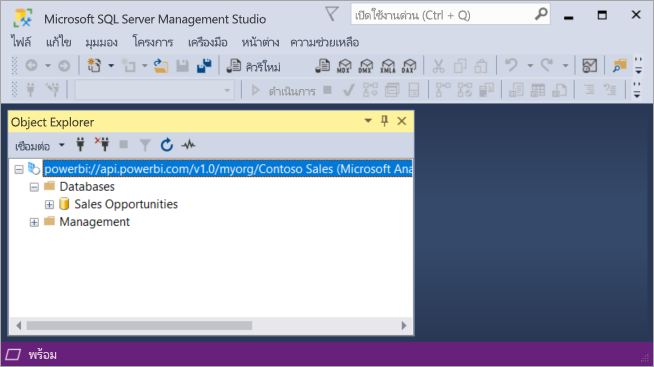

# การเชื่อมต่อชุดข้อมูลด้วยปลายทาง XMLA

พื้นที่ทำงานและชุดข้อมูลของ Power BI Premium ที่ระดับความเข้ากันได้ 1500 และสูงกว่าสนับสนุนการเชื่อมต่อแบบเปิดแพลตฟอร์มจาก Microsoft และแอปพลิเคชันและเครื่องมือไคลเอ็นต์บุคคลที่สามโดยใช้ *ตำแหน่งข้อมูล XMLA*

## ตำแหน่งข้อมูล XMLA คืออะไร

Power BI Premium ใช้โพรโทคอล [XML สำหรับการวิเคราะห์](/analysis-services/xmla/xml-for-analysis-xmla-reference?view=power-bi-premium-current&preserve-view=true) (XMLA) สำหรับการติดต่อสื่อสารระหว่างแอปพลิเคชันไคลเอ็นต์และเครื่องมือที่จัดการพื้นที่ทำงานและชุดข้อมูล Power BI ของคุณ การสื่อสารเหล่านี้จะผ่านสิ่งที่เรียกโดยทั่วไปว่าเป็นตำแหน่งข้อมูล XMLA XMLA เป็นโพรโทคอติดต่อสื่อสารเดียวกันที่โปรแกรม Microsoft Analysis Services ใช้ที่อยู่ภายใน Hood ซึ่งเรียกใช้การจำลองแบบภาพรวม นโยบายการกำกับดูแล วงจรชีวิต และการจัดการข้อมูลของ Power BI ข้อมูลที่ส่งผ่านโปรโตคอล XMLA จะถูกเข้ารหัสอย่างสมบูรณ์

ตามค่าเริ่มต้น การเชื่อมต่อ *แบบอ่านอย่างเดียว* ที่ใช้ตำแหน่งข้อมูลจะเปิดใช้งานสำหรับ **ปริมาณงานของชุดข้อมูล** ในความจุ ด้วยการเชื่อมต่อแบบอ่านอย่างเดียว แอปพลิเคชันการจัดรูปแบบการแสดงข้อมูลและเครื่องมือสามารถคิวรีข้อมูลแบบจำลองของชุดข้อมูล เมตาดาต้า เหตุการณ์ และ schema ได้ การดำเนินการ *แบบอ่าน-เขียน* ที่ใช้ตำแหน่งข้อมูลสามารถเปิดใช้งานการจัดการชุดข้อมูลเพิ่มเติม นโยบายการกำกับดูแล การสร้างแบบจำลองความหมายขั้นสูง การดีบัก และการตรวจสอบได้ ด้วยการเปิดใช้งานการอ่าน-เขียน ชุดข้อมูล Power BI Premium มีพาริตี้กับ Azure Analysis Services และเครื่องมือและกระบวนการสร้างแบบจำลองตารางระดับองค์กรของ SQL Server Analysis Services มากขึ้น

> [!NOTE]
> ขอแนะนำให้คุณใช้ประสบการณ์ของพื้นที่ทำงานที่ทันสมัยโดยเฉพาะอย่างยิ่งเมื่อเชื่อมต่อกับชุดข้อมูลของคุณโดยใช้จุดสิ้นสุด XMLA การดำเนินการเช่นการสร้างหรือการลบชุดข้อมูลไม่ได้รับการรองรับด้วยพื้นที่ทำงานคลาสสิก เมื่อต้องการอัปเกรดพื้นที่ทำงานแบบคลาสสิกไปยังประสบการณ์การใช้งานที่ทันสมัยให้ดู [การอัปเกรดพื้นที่ทำงานคลาสสิกใน Power BI](../collaborate-share/service-upgrade-workspaces.md)

## เครื่องมือการสร้างแบบจำลองข้อมูลและการจัดการ

รายการด้านล่างนี้เป็นเครื่องมือทั่วไปที่ใช้กับ Azure Analysis Services และ SQL Server Analysis Services และตอนนี้ได้รับการสนับสนุนโดยชุดข้อมูล Power BI Premium:

**Visual Studio พร้อมโครงการ Analysis Services**  – หรือที่เรียกว่าเครื่องมือข้อมูล SQL Server หรือสั้นๆ ว่า **SSDT** เป็นเครื่องมือการสร้างแบบจำลองระดับองค์กรสำหรับแบบจำลองตาราง Analysis Services ส่วนขยายโครงการ Analysis Services ได้รับการสนับสนุนใน Visual Studio 2017 และรุ่นที่ใหม่กว่าทั้งหมด รวมถึงรุ่นใช้งานฟรีสำหรับชุมชนด้วย จำเป็นต้องใช้เวอร์ชันส่วนขยาย 2.9.14 หรือสูงกว่าเพื่อปรับใช้แบบจำลองตารางไปยังพื้นที่ทำงานแบบพรีเมียม เมื่อปรับใช้กับพื้นที่ทำงานแบบพรีเมียม แบบจำลองต้องอยู่ในระดับความเข้ากันได้ 1500 หรือสูงกว่า จำเป็นต้องมี XMLA แบบอ่าน-เขียน  สำหรับปริมาณงานของชุดข้อมูล หากต้องการเรียนรู้เพิ่มเติม โปรดดูที่ [เครื่องมือสำหรับ Analysis Services](/analysis-services/tools-and-applications-used-in-analysis-services?view=power-bi-premium-current&preserve-view=true)

**SQL Server Management Studio (SSMS)**   - รองรับคิวรี DAX  MDX และ XMLA ดำเนินการรีเฟรชแบบละเอียดและการเขียนสคริปต์ชุดข้อมูลเมตาดาต้าโดยใช้ [Tabular Model Scripting Language](/analysis-services/tmsl/tabular-model-scripting-language-tmsl-reference) (TMSL) ต้องมีรูปแบบการอ่านอย่างเดียวสำหรับการดำเนินการคิวรี ต้องมีรูปแบบการอ่าน-เขียนสำหรับการเขียนสคริปต์ชุดข้อมูลเมตาดาต้า จำเป็นต้องใช้ SSMS เวอร์ชัน **18.8** หรือสูงกว่า ดาวน์โหลด  [ที่นี่](/sql/ssms/download-sql-server-management-studio-ssms)

**ตัวสร้างโปรไฟล์ของ SQL Server** - ติดตั้งพร้อมกับ SSMS โดยเครื่องมือนี้มีการติดตาม และการดีบักของเหตุการณ์ชุดข้อมูล ในขณะที่ SQL Server ถูกเลิกใช้งานอย่างเป็นทางการแล้ว แต่ตัวสร้างโปรไฟล์ยังคงรวมอยู่ใน SSMS และยังคงรองรับสำหรับ Analysis Services และ Power BI Premium จำเป็นต้องใช้ SQL Server Profiler เวอร์ชัน **18.8** หรือสูงกว่า และการตั้งค่า XMLA แบบอ่านได้เท่านั้นเพื่อเปิดใช้งานบนความจุแบบพรีเมียม ผู้ใช้ต้องระบุชุดข้อมูล ([แค็ตตาล็อกเริ่มต้น](#initial-catalog)) เมื่อเชื่อมต่อกับจุดสิ้นสุด XMLA หากต้องการเรียนรู้เพิ่มเติม ดู  [ตัวสร้างโปรไฟล์ SQL Server สำหรับ Analysis Services](/analysis-services/instances/use-sql-server-profiler-to-monitor-analysis-services?view=power-bi-premium-current&preserve-view=true)

**ตัวช่วยสร้างการปรับใช้ Analysis Services**  - ติดตั้งพร้อมกับ SSMS เครื่องมือนี้มีการปรับใช้โครงการแบบจำลองตารางที่สร้างโดย Visual Studio ไปยัง Analysis Services และพื้นที่ทำงาน Power BI Premium สามารถเรียกใช้แบบโต้ตอบหรือจากบรรทัดคำสั่งสำหรับการทำงานอัตโนมัติ จำเป็นต้องมี XMLA แบบอ่าน-เขียน หากต้องการเรียนรู้เพิ่มเติม ดู [ตัวช่วยสร้างการปรับใช้ Analysis Services](/analysis-services/deployment/deploy-model-solutions-using-the-deployment-wizard?view=power-bi-premium-current&preserve-view=true)

**PowerShell cmdlet**  – cmdlet ของ Analysis Services สามารถใช้เพื่อทำให้งานการจัดการชุดข้อมูลเช่นการดำเนินการรีเฟรชเป็นไปอย่างอัตโนมัติ จำเป็นต้องมี XMLA แบบอ่าน-เขียน จำเป็นต้องใช้เวอร์ชัน **21.1.18221** หรือสูงกว่าของ [มอดูล SqlServer PowerShell](https://www.powershellgallery.com/packages/SqlServer/) Cmdlet ของ Azure Analysis Services ในมอดูล Az.AnalysisServices ไม่ได้รับการสนับสนุนสำหรับ Power BI Premium หากต้องการเรียนรู้เพิ่มเติม โปรดดู [การอ้างอิงPowerShell ของ Analysis Services](/analysis-services/powershell/analysis-services-powershell-reference?view=power-bi-premium-current&preserve-view=true)

**ตัวสร้างรายงานใน Power BI**  - เป็นเครื่องมือสำหรับเขียนรายงานแบบแบ่งหน้า สร้างข้อกำหนดของรายงานที่ระบุว่าจะเรียกใช้ข้อมูลใด สถานที่เรียก และวิธีแสดงข้อมูลดังกล่าว คุณสามารถดูตัวอย่างรายงานของคุณในตัวสร้างรายงาน แล้วเผยแพร่รายงานของคุณไปยังบริการ Power BI ได้ จำเป็นต้องมี XMLA แบบอ่านอย่างเดียว หากต้องการเรียนรู้เพิ่มเติม โปรดดู  [ตัวสร้างรายงาน Power BI](../paginated-reports/report-builder-power-bi.md)

**ตัวแก้ไขตาราง** - เครื่องมือโอเพนซอร์สสำหรับการสร้าง การบำรุงรักษา และการจัดการแบบจำลองตารางโดยใช้ตัวแก้ไขที่ใช้งานง่ายและมีน้ำหนักเบา มุมมองแบบลำดับชั้นจะแสดงวัตถุทั้งหมดในแบบจำลองตารางของคุณ วัตถุได้รับการจัดระเบียบโดยการแสดงโฟลเดอร์พร้อมรองรับการแก้ไขคุณสมบัติแบบเลือกได้หลายรายการและการเน้นไวยากรณ์ DAX ต้องมี XMLA แบบอ่านอย่างเดียวสำหรับการดำเนินการคิวรี ต้องมีรูปแบบการอ่าน-เขียนสำหรับการดำเนินการเมตาดาต้า หากต้องการเรียนรู้เพิ่มเติม ดู [tabulareditor.github.io](https://tabulareditor.github.io/)

**DAX Studio**  – เครื่องมือโอเพนซอร์สสำหรับการสร้าง การวินิจฉัย การปรับแต่งประสิทธิภาพ และการวิเคราะห์ DAX คุณลักษณะต่างๆ ประกอบด้วยการค้นหาวัตถุ การติดตามแบบรวม การแยกย่อยการประมวลผลคิวรีด้วยสถิติโดยละเอียด การเน้นไวยากรณ์และการจัดรูปแบบของ DAX ต้องมี XMLA แบบอ่านอย่างเดียวสำหรับการดำเนินการคิวรี หากต้องการเรียนรู้เพิ่มเติม ดู [daxstudio.org](https://daxstudio.org/)

**ALM Toolkit** - เครื่องมือการเปรียบเทียบ Schema แบบโอเพนซอร์สสำหรับชุดข้อมูล Power BI ซึ่งใช้บ่อยที่สุดสำหรับสถานการณ์การจัดการวงจรชีวิตของแอปพลิเคชัน (ALM) ดำเนินการปรับใช้ข้ามสภาพแวดล้อมและรักษาข้อมูลในอดีตที่มีการรีเฟรชแบบเพิ่มหน่วย Diff และผสานไฟล์ สาขา และรายงานเมตาดาต้า นำข้อกำหนดทั่วไปมาใช้ใหม่ระหว่างชุดข้อมูล ต้องมีรูปแบบการอ่านอย่างเดียวสำหรับการดำเนินการคิวรี ต้องมีรูปแบบการอ่าน-เขียนสำหรับการดำเนินการเมตาดาต้า หากต้องการเรียนรู้เพิ่มเติม ดู [alm-toolkit.com](http://alm-toolkit.com/)

**Microsoft Excel** – Excel PivotTables เป็นเครื่องมือที่ใช้บ่อยที่สุดในการสรุปวิเคราะห์สำรวจและนำเสนอข้อมูลสรุปจาก Power BI ต้องมีรูปแบบการอ่านอย่างเดียวสำหรับการดำเนินการคิวรี จำเป็นต้องใช้ Office 16.0.11326.10000 เวอร์ชันหรือสูงกว่า

**บุคคลที่สาม** - รวมถึงแอปพลิเคชันและเครื่องมือการจัดรูปแบบการแสดงข้อมูลไคลเอ็นต์ที่สามารถเชื่อมต่อ คิวรี และใช้ชุดข้อมูลใน Power BI Premium เครื่องมือส่วนใหญ่จำเป็นต้องมีเวอร์ชันล่าสุดของไลบรารีไคลเอ็นต์ MSOLAP แต่บางอย่างอาจใช้ ADOMD จุดปลายทาง XMLA แบบอ่านอย่างเดียวหรืออ่าน-เขียนจะขึ้นอยู่กับการดำเนินการ

### ไลบรารีไคลเอ็นต์

แอปพลิเคชันไคลเอ็นต์ไม่สื่อสารโดยตรงกับตำแหน่งข้อมูล XMLA แต่ใช้ *ไลบรารีไคลเอ็นต์* เป็นเลเยอร์นามธรรม รายการเหล่านี้เป็นไลบรารีไคลเอ็นต์เดียวกับที่แอปพลิเคชันใช้เพื่อเชื่อมต่อกับ Azure Analysis Services และ SQL Server Analysis Services แอปพลิเคชัน  Microsoft เช่น Excel, SQL Server Management Studio (SSMS) และ ส่วนขยายโครงการ Analysis Services สำหรับ Visual Studio จะติดตั้งไลบรารีไคลเอ็นต์ทั้งหมดสามรายการ และอัปเดตพร้อมกับการอัปเดตแอปพลิเคชันทั่วไป นักพัฒนายังสามารถใช้ไลบรารีไคลเอ็นต์เพื่อสร้างแอปพลิเคชันแบบกำหนดเองได้ ในบางกรณีโดยเฉพาะอย่างยิ่งกับแอปพลิเคชันของบุคคลที่สาม ถ้าไม่มีการติดตั้งแอปพลิเคชันไว้ อาจจำเป็นต้องติดตั้งไลบรารีไคลเอ็นต์ในเวอร์ชันที่ใหม่กว่า ไลบรารีไคลเอ็นต์ได้รับการอัปเดตเป็นรายเดือน หากต้องการเรียนรู้เพิ่มเติม โปรดดู  [ไลบรารีไคลเอ็นต์สำหรับการเชื่อมต่อไปยัง Analysis Services](/azure/analysis-services/analysis-services-data-providers)

## ปรับชุดข้อมูลให้เหมาะสมสำหรับการดำเนินการเขียนโดยการเปิดใช้งานแบบจำลองขนาดใหญ่

เมื่อใช้ตำแหน่งข้อมูล XMLA สำหรับการจัดการชุดข้อมูลที่มีการดำเนินการเขียน ขอแนะนำให้คุณเปิดใช้งานชุดข้อมูลสำหรับแบบจำลองขนาดใหญ่ สิ่งนี้จะลดค่าใช้จ่ายในการดำเนินการเขียนซึ่งสามารถทำให้การดำเนินการเร็วขึ้นมาก สำหรับชุดข้อมูลขนาดเกินกว่า 1 GB (หลังจากการบีบอัด) ความแตกต่างสามารถมีนัยสำคัญ หากต้องการเรียนรู้เพิ่มเติม โปรดดู [แบบจำลองขนาดใหญ่ใน Power BI Premium](service-premium-large-models.md)

## เปิดใช้งาน XMLA แบบอ่าน-เขียน

ตามค่าเริ่มต้น ความจุแบบพรีเมียมมีการตั้งค่าคุณสมบัติตำแหน่งข้อมูล XMLA ที่เปิดใช้งานสำหรับแบบอ่านอย่างเดียว ซึ่งหมายความว่าแอปพลิเคชันสามารถคิวรีได้เฉพาะชุดข้อมูลเท่านั้น สำหรับแอปพลิเคชันในการดำเนินการเขียน จะต้องเปิดใช้งานคุณสมบัติตำแหน่งข้อมูล XMLA สำหรับการอ่าน-เขียน การตั้งค่าคุณสมบัติตำแหน่งข้อมูล XMLA สำหรับกำลังความจุจะถูกกำหนดค่าใน **ปริมาณงานของชุดข้อมูล** การตั้งค่าตำแหน่งข้อมูล XMLA จะนำไปใช้กับ *พื้นที่ทำงานและชุดข้อมูลทั้งหมด* ที่กำหนดให้กับความจุ

### เมื่อต้องการเปิดใช้งานการอ่าน-เขียนสำหรับความจุ

1. ในพอร์ทัลผู้ดูแลระบบ ให้เลือก **การตั้งค่าความจุ** > **Power BI Premium** > ชื่อความจุ
2. ขยาย **ปริมาณงาน** ในการตั้งค่า **ตำแหน่งข้อมูล XMLA** เลือก **อ่าน เขียน**

    

## การเชื่อมต่อกับพื้นที่ทำงาน Premium

พื้นที่ทำงานที่กำหนดไว้สำหรับความจุมีสตริงการเชื่อมต่อในรูปแบบ URL ในลักษณะนี้  
`powerbi://api.powerbi.com/v1.0/[tenant name]/[workspace name]`.

แอปพลิเคชันที่เชื่อมต่อกับพื้นที่ทำงานใช้ URL ราวกับว่าเป็นชื่อเซิร์ฟเวอร์ Analysis Services ตัวอย่างเช่น  
`powerbi://api.powerbi.com/v1.0/contoso.com/Sales Workspace`.

ผู้ใช้ที่มี UPN ในผู้เช่าเดียวกัน (ไม่ใช่ B2B) สามารถแทนที่ชื่อผู้เช่าด้วย `myorg` ตัวอย่างเช่น   
`powerbi://api.powerbi.com/v1.0/myorg/Sales Workspace`

ผู้ใช้ B2B ต้องระบุ UPN องค์กรของพวกเขาในชื่อผู้เช่า ตัวอย่างเช่น  
`powerbi://api.powerbi.com/v1.0/fabrikam.com/Sales Workspace`.

### หากต้องการรับ URL การเชื่อมต่อพื้นที่ทำงาน

ในพื้นที่ทำงาน **การตั้งค่า** > **พรีเมียม** > **การเชื่อมต่อพื้นที่ทำงาน** ให้คลิก **คัดลอก**

## ข้อกำหนดของการเชื่อมต่อ

### แค็ตตาล็อกเริ่มต้น

ด้วยเครื่องมือบางประเภท เช่น SQL Server Profiler คุณต้องระบุ *แค็ตตาล็อกเริ่มต้น* ซึ่งเป็นชุดข้อมูล (ฐานข้อมูล) ที่จะเชื่อมต่อกับพื้นที่ทำงานของคุณ ในกล่องโต้ตอบ **เชื่อมต่อกับเซิร์ฟเวอร์** ให้เลือก **ตัวเลือก** > **คุณสมบัติการเชื่อมต่อ** >  **เชื่อมต่อกับฐานข้อมูล** แล้วกรอกชื่อชุดข้อมูล

### ชื่อพื้นที่ทำงานที่ซ้ำกัน

[พื้นที่ทำงานใหม่](../collaborate-share/service-new-workspaces.md) (สร้างขึ้นโดยใช้ประสบการณ์พื้นที่ทำงานใหม่) ใน Power BI จะกำหนดการตรวจสอบความถูกต้องเพื่อไม่ให้มีการสร้างหรือเปลี่ยนชื่อพื้นที่ทำงานด้วยชื่อที่ซ้ำกัน พื้นที่ทำงานที่ยังไม่ได้รับการโยกย้ายอาจส่งผลให้มีชื่อที่ซ้ำกัน เมื่อเชื่อมต่อกับพื้นที่ทำงานโดยใช้ชื่อเดียวกันกับพื้นที่ทำงานอื่น คุณอาจได้รับข้อมูลข้อผิดพลาดดังต่อไปนี้:

**ไม่สามารถเชื่อมต่อกับ powerbi://api.powerbi.com/v1.0/ [ชื่อผู้เช่า] / [ชื่อพื้นที่ทำงาน] ได้**

หากต้องการแก้ไขข้อผิดพลาดนี้ นอกเหนือจากชื่อพื้นที่ทำงาน ให้ระบุ ObjectIDGuid ซึ่งคุณสามารถคัดลอกจาก objectID ของพื้นที่ทำงานใน URL ผนวก objectID เข้ากับ URL การเชื่อมต่อ ตัวอย่างเช่น  
'powerbi://api.powerbi.com/v1.0/myorg/Contoso Sales - 9d83d204-82a9-4b36-98f2-a40099093830'.

### ชื่อชุดข้อมูลที่ซ้ำกัน

เมื่อเชื่อมต่อกับชุดข้อมูลที่มีชื่อเดียวกันเป็นชุดข้อมูลอื่นในพื้นที่ทำงานเดียวกัน จะผนวก guid ชุดข้อมูลเข้ากับชื่อชุดข้อมูล คุณอาจได้รับทั้งชื่อชุดข้อมูลและ guid เมื่อเชื่อมต่อกับพื้นที่ทำงานใน SSMS

### ความล่าช้าในชุดข้อมูลที่แสดง

เมื่อเชื่อมต่อกับพื้นที่ทำงาน การเปลี่ยนแปลงจากชุดข้อมูลใหม่ ชุดข้อมูลที่ถูกลบ ชุดข้อมูลที่ถูกเปลี่ยนชื่ออาจใช้เวลาเล็กน้อยจึงจะปรากฎขึ้น

### ชุดข้อมูลที่ไม่สนับสนุน

ชุดข้อมูลต่อไปนี้จะไม่สามารถเข้าถึงได้โดยตำแหน่งข้อมูล XMLA ชุดข้อมูลเหล่านี้จะไม่ปรากฏภายใต้พื้นที่ทำงานใน SSMS หรือเครื่องมืออื่น ๆ :

- ชุดข้อมูลที่อ้างอิงจากการเชื่อมต่อสดไปยังแบบจำลอง Azure Analysis Services และ SQL Server Analysis Services 
- ชุดข้อมูลที่อ้างอิงจากการเชื่อมต่อสดไปยังชุดข้องมูล Power BI ในพื้นที่ทำงานอื่น หากต้องการเรียนรู้เพิ่มเติม ดู [บทนำชุดข้อมูลทั้งพื้นที่ทำงาน](../connect-data/service-datasets-across-workspaces.md)
- ชุดข้อมูลที่มีการส่งข้อมูลโดยใช้ REST API
- ชุดข้อมูลสมุดงาน Excel

### นามแฝงของเซิร์ฟเวอร์/พื้นที่ทำงาน

พื้นที่ทำงานของ Power BI Premium ไม่รองรับนามแฝงชื่อเซิร์ฟเวอร์ซึ่งมีการรองรับใน Azure Analysis Services

## ความปลอดภัย

นอกเหนือจากคุณสมบัติตำแหน่งข้อมูล XMLA ที่เปิดใช้งานการอ่าน-เขียนโดยผู้ดูแลระบบความจุ ต้องเปิดใช้การตั้งค่าระดับผู้เช่า **อนุญาตตำแหน่งข้อมูล XMLA และวิเคราะห์ใน Excel กับชุดข้อมูลภายในองค์กร** ในพอร์ทัลผู้ดูแลระบบ หากคุณต้องการสร้างไฟล์ AIXL ที่เชื่อมต่อกับตำแหน่งข้อมูล XMLA คุณควรเปิดใช้งานการตั้งค่าระดับผู้เช่า **อนุญาตการเชื่อมต่อแบบสด** ด้วย การตั้งค่าเหล่านี้เปิดใช้งานการอนุญาตทั้งคู่ตามค่าเริ่มต้น

**อนุญาตให้ใช้งานตำแหน่งข้อมูล XMLA และวิเคราะห์ใน Excel กับชุดข้อมูลภายในองค์กร** เป็นการตั้งค่าการรวม

:::image type="content" source="media/service-premium-connect-tools/allow-xmla-endpoints.png" alt-text="การตั้งค่าการรวมอนุญาตให้ใช้ตำแหน่งข้อมูล XMLA":::

**อนุญาตการเชื่อมต่อแบบสด** คือการตั้งค่าการส่งออกและการแบ่งปัน

:::image type="content" source="media/service-premium-connect-tools/allow-live-connections.png" alt-text="การตั้งค่าการส่งออกและการแบ่งปันอนุญาตการเชื่อมต่อแบบสด":::

การเข้าถึงผ่านตำแหน่งข้อมูล XMLA จะเป็นการเคารพความเป็นสมาชิกกลุ่มความปลอดภัยที่ระดับพื้นที่ทำงาน/แอป

ผู้สนับสนุนพื้นที่ทำงานและผู้ที่อยู่ในระดับสูงกว่า มีการเขียนการเข้าถึงชุดข้อมูล และดังนั้นจึงเทียบเท่ากับผู้ดูแลฐานข้อมูล Analysis Services พวกเขาสามารถปรับใช้ชุดข้อมูลใหม่จาก Visual Studio และดำเนินการกับสคริปต์ TMSL ใน SSMS ได้

การดำเนินการที่ต้องการสิทธิ์ผู้ดูแลระบบเซิร์ฟเวอร์ Analysis Services (แทนที่จะเป็นผู้ดูแลระบบฐานข้อมูล) เช่นการติดตามระดับเซิร์ฟเวอร์ และการเลียนแบบผู้ใช้โดยใช้คุณสมบัติสตริงการเชื่อมต่อ [EffectiveUserName](/analysis-services/instances/connection-string-properties-analysis-services?view=power-bi-premium-current&preserve-view=true#bkmk_auth) ไม่ได้รับการสนับสนุนใน Power BI Premium ในขณะนี้

ผู้ใช้อื่นที่ [สร้างสิทธิ์](../connect-data/service-datasets-build-permissions.md) บนชุดข้อมูลจะถือว่าเท่าเทียมกับผู้อ่านฐานข้อมูล Analysis Services พวกเขาสามารถเชื่อมต่อและเรียกดูชุดข้อมูลสำหรับการใช้งานข้อมูลและการแสดงภาพ กฎการรักษาความปลอดภัยระดับแถว (RLS) ได้รับการยอมรับและพวกเขาไม่สามารถดูชุกข้อมูลเมตาดาต้าภายในได้

### บทบาทแบบจำลอง

ด้วยจุดสิ้นสุด XMLA คุณสามารถกำหนดบทบาทสำหรับชุดข้อมูล สามารถกำหนดความเป็นสมาชิกบทบาทสำหรับผู้ใช้ Azure Active Directory (AAD) และสามารถกำหนดตัวกรองการรักษาความปลอดภัยระดับแถว (RLS) ได้ มีการใช้บทบาทแบบจำลองใน Power BI สำหรับ RLS เท่านั้น ใช้แบบจำลองการรักษาความปลอดภัย Power BI เพื่อควบคุมสิทธิ์ที่นอกเหนือจาก RLS

สำหรับโครงการแบบจำลองตารางที่ถูกสร้างขึ้นใน Visual Studio คุณสามารถกำหนดบทบาทได้โดยใช้ตัวจัดการบทบาทในตัวออกแบบแบบจำลอง สำหรับชุดข้อมูลใน Power BI คุณสามารถกำหนดบทบาทได้โดยใช้ SSMS เพื่อสร้างออบเจ็กต์บทบาทและกำหนดคุณสมบัติของบทบาท อย่างไรก็ตามในกรณีส่วนใหญ่สามารถเขียนสคริปต์นิยามอ็อบเจ็กต์บทบาทโดยใช้ TMSL เพื่อสร้างหรือแก้ไข[อ็อบเจ็กต์บทบาท](/analysis-services/tmsl/roles-object-tmsl?view=power-bi-premium-current&preserve-view=true) สามารถเรียกใช้สคริปต์ TMSL ใน SSMS หรือด้วย cmdlet ของ PowerShell [Invoke-ASCmd](/powershell/module/sqlserver/invoke-ascmd?view=sqlserver-ps&preserve-view=true)

ข้อจำกัดต่อไปนี้จะนำไปใช้เมื่อทำงานกับบทบาทของชุดข้อมูลผ่านตำแหน่งข้อมูล XMLA:

- สิทธิ์สำหรับ *บทบาท* ที่สามารถตั้งค่าสำหรับชุดข้อมูล Power BI คือ สิทธิ์ในการอ่านเท่านั้น สิทธิ์อื่น ๆ จะได้รับอนุญาตโดยใช้แบบจำลองความปลอดภัยของ Power BI
- สิทธิ์ในการสร้างสำหรับชุดข้อมูลเป็นสิ่งจำเป็นสำหรับการเข้าถึงการอ่านผ่านตำแหน่งข้อมูล XMLA โดยไม่คำนึงถึงการมีอยู่ของบทบาทชุดข้อมูล
- กฎการรักษาความปลอดภัยระดับวัตถุ (OLS) ไม่ได้รับการสนับสนุนใน Power BI ในขณะนี้

เมื่อต้องการเรียนรู้เพิ่มเติม โปรดดู[บทบาทในแบบจำลองตาราง](/analysis-services/tabular-models/roles-ssas-tabular)

### การตั้งค่าข้อมูลประจำตัวของแหล่งข้อมูล

เมตาดาต้าที่ระบุผ่านตำแหน่งข้อมูล XMLA สามารถสร้างการเชื่อมต่อไปยังแหล่งข้อมูลได้ แต่ไม่สามารถตั้งค่าข้อมูลประจำตัวของแหล่งข้อมูลได้ คุณสามารถตั้งค่าข้อมูลประจำตัวได้ในหน้าการตั้งค่าชุดข้อมูลในบริการ Power BI

### บริการหลัก

บริการหลักคือ การลงทะเบียนแอป Azure Active Directory ที่คุณสร้างภายในผู้เช่าของคุณเพื่อใช้ทรัพยากรที่ไม่ได้ใส่ใจและการดำเนินการระดับบริการ ซึ่งเป็นประเภทข้อมูลประจำตัวของผู้ใช้ที่ไม่ซ้ำกันที่มีชื่อแอป ID แอปพลิเคชัน ID ผู้เช่าและ ข้อมูลลับของไคลเอ็นต์ หรือใบรับรองสำหรับรหัสผ่าน Power BI Premium ใช้ฟังก์ชันการทำงานของบริการหลักเหมือนกับ Power BI Embedded

ใน Power BI Premium ยังคงสามารถใช้บริการหลักได้กับ ตำแหน่งข้อมูล XMLA เพื่อทำให้งานการจัดการชุดข้อมูลเป็นแบบอัตโนมัติ เช่น พื้นที่ทำงานสำหรับจัดเตรียม การปรับใช้แบบจำลอง และการรีเฟรชชุดข้อมูลด้วย:

- PowerShell
- Azure Automation
- Azure Logic Apps
- แอปพลิเคชันไคลเอ็นต์แบบกำหนดเอง

เมื่อต้องการเรียนรู้เพิ่มเติม โปรดดูที่[การดำเนินการพื้นที่ทำงาน Premium และชุดข้อมูลโดยอัตโนมัติด้วยหลักการบริการ](service-premium-service-principal.md)

## ปรับใช้โครงการแบบจำลองจาก Visual Studio (SSDT)

การปรับใช้โครงการแบบจำลองแบบตารางใน Visual Studio ไปยังพื้นที่ทำงานของ Power BI Premium เทียบเท่ากับการปรับใช้กับเซิร์ฟเวอร์ Azure หรือ SQL Server Analysis Services ความแตกต่างมีเพียงเรื่องของคุณสมบัติเซิร์ฟเวอร์การปรับใช้ที่ระบุสำหรับโครงการ และวิธีการระบุข้อมูลประจำตัวของแหล่งข้อมูลเพื่อให้การดำเนินการประมวลผลสามารถนำเข้าข้อมูลจากแหล่งข้อมูลไปยังชุดข้อมูลใหม่บนพื้นที่ทำงาน

เมื่อต้องการปรับใช้โครงการแบบจำลองตารางที่สร้างใน Visual Studio คุณต้องตั้งค่า URL การเชื่อมต่อพื้นที่ทำงานในคุณสมบัติ **เซิร์ฟเวอร์การปรับใช้** ของโครงการก่อนเป็นอันดับแรก ใน Visual Studio ใน **Solution Explorer** ให้คลิกขวาที่โครงการ > **คุณสมบัติ** ในคุณสมบัติ **เซิร์ฟเวอร์** ให้วาง URL การเชื่อมต่อพื้นที่ทำงาน

เมื่อมีการระบุคุณสมบัติของเซิร์ฟเวอร์การปรับใช้แล้ว โครงการจะสามารถใช้งานได้

**เมื่อปรับใช้ครั้งแรก** ชุดข้อมูลจะถูกสร้างขึ้นในพื้นที่ทำงานโดยใช้เมตาดาต้าจาก model.bim ในฐานะส่วนหนึ่งของการดำเนินการปรับใช้ หลังจากที่มีการสร้างชุดข้อมูลในพื้นที่ทำงานจากเมตาดาต้าแบบจำลอง การประมวลผลเพื่อโหลดข้อมูลลงในชุดข้อมูลจากแหล่งข้อมูลจะล้มเหลว

การประมวลผลล้มเหลวเนื่องจากเมื่อปรับใช้กับพื้นที่ทำงานแบบพรีเมียมนั้น ข้อมูลประจำตัวของแหล่งข้อมูลไม่สามารถระบุให้เป็นส่วนหนึ่งของการดำเนินการปรับใช้ได้ ซึ่งแตกต่างจากการปรับใช้ไปยังกับอินสแตนซ์ Azure หรือ SQL Server Analysis Server ที่ข้อมูลประจำตัวของแหล่งข้อมูลจะได้รับพร้อมท์ให้เป็นส่วนหนึ่งของการดำเนินการปรับใช้ แต่หลังจากการปรับใช้เมตาดาต้าสำเร็จและได้สร้างชุดข้อมูลขึ้นแล้ว ข้อมูลประจำตัวแหล่งข้อมูลจะถูกระบุในบริการ Power BI ในการตั้งค่าชุดข้อมูล ในพื้นที่ทำงาน ให้เลือก **ชุดข้อมูล** > **การตั้งค่า**  > **ข้อมูลประจำตัวของแหล่งข้อมูล** > **แก้ไขข้อมูลประจำตัว**

เมื่อมีการระบุข้อมูลประจำตัวของแหล่งข้อมูลแล้ว คุณสามารถรีเฟรชชุดข้อมูลในบริการ Power BI กำหนดค่าการรีเฟรชตามกำหนดการ หรือกระบวนการ (รีเฟรช) จาก SQL Server Studio Management  เพื่อโหลดข้อมูลลงในชุดข้อมูลได้

มีการตรวจสอบคุณสมบัติ **ตัวเลือกการประมวลผล** ของการปรับใช้ ที่ระบุในโครงการใน Visual Studio อย่างไรก็ตามถ้าแหล่งข้อมูลยังไม่ได้ระบุข้อมูลประจำตัวในบริการ Power BI การประมวลผลจะล้มเหลวถึงแม้ว่าการปรับใช้เมตาดาต้าจะสำเร็จก็ตาม คุณสามารถตั้งค่าคุณสมบัติเป็น **ไม่ประมวลผล** เพื่อป้องกันความพยายามในการดำเนินการเป็นส่วนหนึ่งของการปรับใช้ แต่คุณอาจต้องการตั้งค่าคุณสมบัติกลับไปยัง **ค่าเริ่มต้น** เนื่องจากเมื่อมีการระบุข้อมูลประจำตัวของแหล่งข้อมูลในการตั้งค่าแหล่งข้อมูลสำหรับชุดข้อมูลใหม่แล้ว การประมวลผลที่เป็นส่วนหนึ่งของการดำเนินการปรับใช้จะประสบความสำเร็จ

## เชื่อมต่อกับ SSMS

การใช้ SSMS เพื่อเชื่อมต่อไปยังพื้นที่ทำงานเปรียบเหมือนกับการเชื่อมต่อกับเซิร์ฟเวอร์ Azure หรือ SQL Server Analysis Services ความแตกต่างคือการที่คุณระบุ URL พื้นที่ทำงานในชื่อเซิร์ฟเวอร์ และคุณต้องใช้การรับรองความถูกต้อง **Active Directory - ที่เป็นสากลกับ MFA**

### เชื่อมต่อไปยังพื้นที่ทำงานโดยใช้ SSMS

1. ใน SQL Server Management Studio ให้เลือก **เชื่อมต่อ** > **เชื่อมต่อกับเซิร์ฟเวอร์**

2. สำหรับ **ชนิดเซิร์ฟเวอร์** ให้เลือก **บริการวิเคราะห์** ใน **ชื่อเซิร์ฟเวอร์** กรอก URL พื้นที่ทำงาน ใน **การรับรองความถูกต้อง** เลือก **Active Directory - ที่เป็นสากลกับ  MFA** และจากนั้นใน **ชื่อผู้ใช้** กรอกรหัสผู้ใช้องค์กรของคุณ

    

เมื่อเชื่อมต่อแล้ว พื้นที่ทำงานจะแสดงเป็นกับเซิร์ฟเวอร์ Analysis Services และชุดข้อมูลในพื้นที่ทำงานจะแสดงเป็นฐานข้อมูล  

หากต้องการเรียนรู้เพิ่มเติมเกี่ยวกับการใช้ SSMS เพื่อสคริปต์เมตาดาต้า โปรดดู [สร้างสคริปต์ Analysis Services](/analysis-services/instances/create-analysis-services-scripts-in-management-studio?view=power-bi-premium-current&preserve-view=true) และ [Tabular Model Scripting Language (TMSL)](/analysis-services/tmsl/tabular-model-scripting-language-tmsl-reference?view=power-bi-premium-current&preserve-view=true)

## การรีเฟรชชุดข้อมูล

ตำแหน่งข้อมูล XMLA เปิดใช้งานสถานการณ์หลากหลายสำหรับความสามารถในการรีเฟรชแบบละเอียดโดยใช้ SSMS การทำให้เป็นอัตโนมัติด้วย PowerShell [Azure Automation](/azure/automation/automation-intro) และ [ฟังก์ชัน Azure](/azure/azure-functions/functions-overview) โดยใช้ TOM ตัวอย่างเช่นคุณสามารถรีเฟรชพาร์ติชันย้อนหลัง [แบบเพิ่มหน่วย](service-premium-incremental-refresh.md) ได้โดยไม่ต้องโหลดข้อมูลประวัติทั้งหมดอีกครั้ง

การดำเนินการรีเฟรชผ่านตำแหน่งข้อมูล XMLA ไม่ได้จำกัดเพียง 48 รีเฟรชต่อวัน และ [การรีเฟรชตามกำหนดเวลา](../connect-data/refresh-troubleshooting-refresh-scenarios.md#scheduled-refresh-timeout) ไม่ได้รับการกำหนด ซึ่งจะต่างจากการกำหนดค่าการรรีเฟรชในบริการ Power BI

## มุมมองการจัดการแบบไดนามิก (DMV)

Analysis Services [DMV](/analysis-services/instances/use-dynamic-management-views-dmvs-to-monitor-analysis-services) ให้การมองเห็นของเมตาดาต้าชุดข้อมูล สายข้อมูล และการใช้ทรัพยากร DMV ที่พร้อมใช้งานสำหรับการคิวรีใน Power BI ผ่านตำแหน่งข้อมูล XMLA ส่วนใหญ่จะถูกจำกัดไว้ที่ผู้ใช้ที่ต้องมีสิทธิ์ในการจัดการฐานข้อมูล ตัวอย่างเช่น ในบาง DMV ไม่สามารถเข้าถึงได้เนื่องจากจำเป็นต้องมีสิทธิ์การใช้งานผู้ดูแลระบบเซิร์ฟเวอร์ Analysis Services

## ชุดข้อมูลที่สร้างใน Power BI Desktop

### เมตาดาต้าที่ปรับปรุงประสิทธิภาพแล้ว

การดำเนินการเขียน XMLA บนชุดข้อมูลที่สร้างขึ้นใน Power BI Desktop และเผยแพร่ไปยังพื้นที่ทำงานแบบพรีเมียมจำเป็นต้องเปิดใช้งานเมตาดาต้าที่ปรับปรุงประสิทธิภาพแล้ว หากต้องการเรียนรู้เพิ่มเติม โปรดดู [เมตาดาต้าชุดข้อมูลที่ปรับปรุงประสิทธิภาพแล้ว](../connect-data/desktop-enhanced-dataset-metadata.md)

> [!CAUTION]
> ในขณะนี้ การดำเนินการเขียนบนชุดข้อมูลที่สร้างใน Power BI Desktop จะป้องกันไม่ให้มีการดาวน์โหลดกลับเป็นไฟล์ PBIX ตรวจสอบให้แน่ใจว่าได้เก็บไฟล์ PBIX เดิมของคุณแล้ว

### การประกาศแหล่งข้อมูล

เมื่อเชื่อมต่อกับแหล่งข้อมูลและคิวรีข้อมูล Power BI Desktop ใช้นิพจน์ Power Query M เป็นการประกาศแหล่งข้อมูลแบบอินไลน์ ในขณะที่ได้รับการสนับสนุนในพื้นที่ทำงาน Power BI Premium การประกาศแหล่งข้อมูลแบบอินไลน์ Power Query M ไม่ได้รับการสนับสนุนโดย Azure Analysis Services หรือ SQL Server Analysis Services แต่เครื่องมือสร้างแบบจำลองข้อมูล Analysis Services เช่น Visual Studio สร้างเมตาดาต้าโดยใช้การประกาศแหล่งข้อมูล *ที่มีโครงสร้าง* และ/หรือ *ผู้ให้บริการ* ด้วยตำแหน่งข้อมูล XMLA นั้น Power BI Premium ยังสนับสนุนแหล่งข้อมูลที่มีโครงสร้างและผู้ให้บริการ แต่ไม่ได้เป็นส่วนหนึ่งของการประกาศแหล่งข้อมูลแบบอินไลน์ของ Power Query M ในแบบจำลอง Power BI Desktop หากต้องการเรียนรู้เพิ่มเติม โปรดดู [ทำความเข้าใจผู้ให้บริการ](/azure/analysis-services/analysis-services-datasource#understanding-providers)

### Power BI Desktop ในโหมดการเชื่อมต่อแบบสด

Power BI Desktop สามารถเชื่อมต่อกับชุดข้อมูล Power BI Premium ได้โดยใช้การเชื่อมต่อแบบสด เมื่อใช้การเชื่อมต่อแบบสด ก็ไม่จำเป็นต้องทำสำเนาข้อมูลภายในเครื่อง จึงช่วยให้ผู้ใช้สามารถใช้งานแบบจำลองเชิงความหมายได้ง่ายขึ้น ผู้ใช้สามารถเชื่อมต่อได้สองวิธี:

โดยการเลือก **ชุดข้อมูล Power BI** จากนั้นจึงเลือกชุดข้อมูลเพื่อสร้างรายงาน นี่คือวิธี **ที่แนะนำ** สำหรับผู้ใช้ในการเชื่อมต่อแบบสดกับชุดข้อมูล วิธีนี้นำเสนอประสบการณ์ในการค้นหาที่ปรับปรุงประสิทธิภาพแล้ว ซึ่งแสดงระดับรายการบันทึกการรับรองชุดข้อมูล ผู้ใช้ไม่จำเป็นต้องค้นหาและติดตาม URL ของพื้นที่ทำงาน หากต้องการค้นหาชุดข้อมูล ผู้ใช้เพียงแค่พิมพ์ชื่อชุดข้อมูลหรือเลื่อนเพื่อค้นหาชุดข้อมูลที่กำลังค้นหาอยู่

อีกวิธีหนึ่งที่ผู้ใช้สามารถเชื่อมต่อได้คือการใช้ **รับข้อมูล** > **Analysis Services** ให้ระบุชื่อพื้นที่ทำงานของ Power BI Premium เป็น URL และเลือก **เชื่อมต่อแบบสด** จากนั้นให้เลือกชุดข้อมูลในตัวนำทาง ในกรณีนี้ Power BI Desktop ใช้จุดสิ้นสุด XMLA เพื่อเชื่อมต่อแบบสดกับชุดข้อมูลเสมือนเป็นแบบจำลองข้อมูล Analysis Services 

องค์กรที่มีรายงานซึ่งเชื่อมต่อแบบสดกับแบบจำลองข้อมูล Analysis Services ที่ตั้งใจจะโยกย้ายไปยังชุดข้อมูล Power BI Premium จะต้องเปลี่ยน URL ของชื่อเซิร์ฟเวอร์ใน **แปลงข้อมูล**  > **การตั้งค่าแหล่งข้อมูล** เท่านั้น

## บันทึกการตรวจสอบ

เมื่อแอปพลิเคชันเชื่อมต่อกับพื้นที่ทำงาน การเข้าถึงผ่านตำแหน่งข้อมูล XMLA ถูกบันทึกไว้ในบันทึกการตรวจสอบ Power BI ด้วยการดำเนินการต่อไปนี้:

|ชื่อที่เรียกง่ายของการดำเนินการ   |ชื่อการดำเนินการ   |
|---------|---------|
|เชื่อมต่อกับชุดข้อมูล Power BI จากแอปพลิเคชันภายนอก      |  ConnectFromExternalApplication        |
|ร้องขอการรีเฟรชชุดข้อมูล Power BI จากแอปพลิเคชันภายนอก      | RefreshDatasetFromExternalApplication        |
|สร้างชุดข้อมูล Power BI จากแอปพลิเคชันภายนอก      |  CreateDatasetFromExternalApplication        |
|แก้ไขชุดข้อมูล Power BI จากแอปพลิเคชันภายนอก     |  EditDatasetFromExternalApplication        |
|ลบชุดข้อมูล Power BI จากแอปพลิเคชันภายนอก      |  DeleteDatasetFromExternalApplication        |

หากต้องการเรียนรู้เพิ่มเติม ดู  [การตรวจสอบ Power BI](service-admin-auditing.md)

## อาจดูได้จาก

มีคำถามเพิ่มเติมหรือไม่ [ลองถามชุมชน Power BI](https://community.powerbi.com/)
