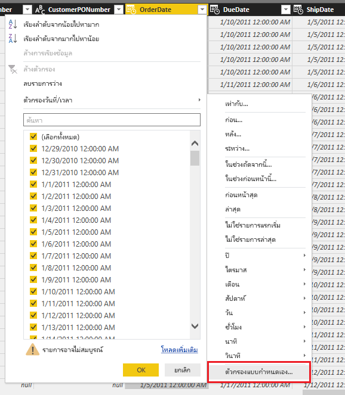
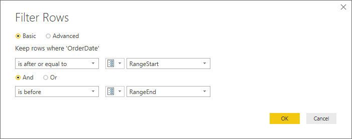
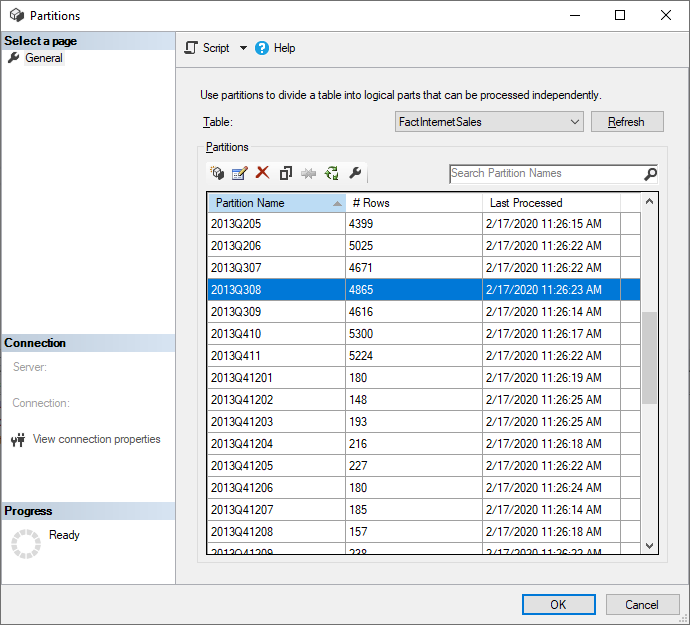

# <a name="incremental-refresh-in-power-bi"></a><span data-ttu-id="d68e3-103">การรีเฟรชแบบเพิ่มหน่วยใน Power BI</span><span class="sxs-lookup"><span data-stu-id="d68e3-103">Incremental refresh in Power BI</span></span>

<span data-ttu-id="d68e3-104">การรีเฟรชแบบเพิ่มหน่วยจะทำให้ชุดข้อมูลขนาดใหญ่ใน Power BI มีสิทธิประโยชน์ต่อไปนี้:</span><span class="sxs-lookup"><span data-stu-id="d68e3-104">Incremental refresh enables very large datasets in Power BI with the following benefits:</span></span>

> [!div class="checklist"]
> * <span data-ttu-id="d68e3-105">**การรีเฟรชเร็วกว่า**- เฉพาะข้อมูลที่มีความต้องการเปลี่ยนแปลงการรีเฟรช</span><span class="sxs-lookup"><span data-stu-id="d68e3-105">**Refreshes are faster** - Only data that has changed needs to be refreshed.</span></span> <span data-ttu-id="d68e3-106">ตัวอย่าง รีเฟรชเฉพาะห้าวันของชุดข้อมูล 10 ปี</span><span class="sxs-lookup"><span data-stu-id="d68e3-106">For example, refresh only the last five days of a ten-year dataset.</span></span>
> * <span data-ttu-id="d68e3-107">**การรีเฟรชน่าเชื่อถือมากขึ้น** - ตัวอย่างเช่น ไม่จำเป็นต้องรักษาการเชื่อมต่อระยะยาวกับระบบต้นทางที่ผันผวน</span><span class="sxs-lookup"><span data-stu-id="d68e3-107">**Refreshes are more reliable** - It's no longer necessary to maintain long-running connections to volatile source systems.</span></span>
> * <span data-ttu-id="d68e3-108">**ปริมาณการใช้ทรัพยากรลดลง** - เมื่อต้องรีเฟรชข้อมูลน้อยลง ทำให้ปริมาณการใช้โดยรวมของความจำและทรัพยากรอื่นๆ ลดลงด้วย</span><span class="sxs-lookup"><span data-stu-id="d68e3-108">**Resource consumption is reduced** - Less data to refresh reduces overall consumption of memory and other resources.</span></span>

> [!NOTE]
> <span data-ttu-id="d68e3-109">ในขณะนี้ การรีเฟรชแบบเพิ่มหน่วยจะพร้อมใช้งานสำหรับ Power BI Pro, Premium และการสมัครสมาชิกและชุดข้อมูลที่ใช้ร่วมกัน</span><span class="sxs-lookup"><span data-stu-id="d68e3-109">Incremental refresh is now available for Power BI Pro, Premium, and shared subscriptions and datasets.</span></span>

> [!NOTE]
> <span data-ttu-id="d68e3-110">Power BI Premium เพิ่งเปิดตัว Premium เวอร์ชันใหม่ชื่อ **Premium Gen2** ซึ่งกำลังอยู่ในช่วงการแสดงตัวอย่าง</span><span class="sxs-lookup"><span data-stu-id="d68e3-110">Power BI Premium recently released a new version of Premium, called **Premium Gen2**, which is currently in preview.</span></span> <span data-ttu-id="d68e3-111">Premium Gen2 จะทำให้การจัดการความจุระดับพรีเมียมง่ายขึ้นและลดค่าใช้จ่ายในการจัดการ</span><span class="sxs-lookup"><span data-stu-id="d68e3-111">Premium Gen2 will simplify the management of Premium capacities, and reduce management overhead.</span></span> <span data-ttu-id="d68e3-112">Gen2 Premium ช่วยปรับปรุงการรีเฟรชตามกำหนดการโดยการเปิดใช้งานการปรับขนาดอัตโนมัติเพื่อหลีกเลี่ยงความขัดแย้งในการรีเฟรช</span><span class="sxs-lookup"><span data-stu-id="d68e3-112">Premium Gen2 significantly improves scheduled refresh, by enabling autoscaling to avoid refresh conflicts.</span></span> <span data-ttu-id="d68e3-113">สำหรับข้อมูลเพิ่มเติม โปรดดูที่ [Power BI Premium Generation 2 (ตัวอย่าง)](service-premium-what-is.md#power-bi-premium-generation-2-preview)</span><span class="sxs-lookup"><span data-stu-id="d68e3-113">For more information, see [Power BI Premium Generation 2 (preview)](service-premium-what-is.md#power-bi-premium-generation-2-preview).</span></span>


## <a name="configure-incremental-refresh"></a><span data-ttu-id="d68e3-114">คิวรีการรีเฟรชแบบเพิ่มหน่วย</span><span class="sxs-lookup"><span data-stu-id="d68e3-114">Configure incremental refresh</span></span>

<span data-ttu-id="d68e3-115">นโยบายการรีเฟรชแบบเพิ่มหน่วยจะถูกกำหนดใน Power BI Desktop และนำไปใช้เมื่อเผยแพร่ไปยังบริการ Power BI</span><span class="sxs-lookup"><span data-stu-id="d68e3-115">Incremental refresh policies are defined in Power BI Desktop and applied when published to the Power BI service.</span></span>

### <a name="filter-large-datasets-in-power-bi-desktop"></a><span data-ttu-id="d68e3-116">กรองชุดข้อมูลขนาดใหญ่ใน Power BI Desktop</span><span class="sxs-lookup"><span data-stu-id="d68e3-116">Filter large datasets in Power BI Desktop</span></span>

<span data-ttu-id="d68e3-117">ชุดข้อมูลขนาดใหญ่ที่อาจมีแถวจำนวนพันล้านแถวอาจไม่เหมาะกับ Power BI Desktop เนื่องจากมีข้อจำกัดตามทรัพยากรที่พร้อมใช้งานบนพีซีเดสก์ท็อปของผู้ใช้</span><span class="sxs-lookup"><span data-stu-id="d68e3-117">Large datasets with potentially billions of rows may not fit into a Power BI Desktop model because the PBIX file is limited by the memory resources available on the desktop computer.</span></span> <span data-ttu-id="d68e3-118">ชุดข้อมูลดังกล่าวจะผ่านการกรองเมื่อนำเข้าไปยัง Power BI Desktop</span><span class="sxs-lookup"><span data-stu-id="d68e3-118">Such datasets are therefore commonly filtered upon import.</span></span> <span data-ttu-id="d68e3-119">การกรองชนิดนี้ใช้ไม่ว่าใช้การรีเฟรชแบบเพิ่มหน่วย หรือไม่</span><span class="sxs-lookup"><span data-stu-id="d68e3-119">This type of filtering applies whether using incremental refresh or not.</span></span> <span data-ttu-id="d68e3-120">สำหรับการรีเฟรชแบบเพิ่มหน่วย คุณกรอง โดยใช้พารามิเตอร์วันที่/เวลา Power Query</span><span class="sxs-lookup"><span data-stu-id="d68e3-120">For incremental refresh, you filter by using Power Query date/time parameters.</span></span>

#### <a name="rangestart-and-rangeend-parameters"></a><span data-ttu-id="d68e3-121">พารามิเตอร์ RangeStart และ RangeEnd</span><span class="sxs-lookup"><span data-stu-id="d68e3-121">RangeStart and RangeEnd parameters</span></span>

<span data-ttu-id="d68e3-122">เมื่อต้องการใช้ประโยชน์จากการรีเฟรชแบบเพิ่มหน่วยในบริการ Power BI จะต้องกรองโดยใช้พารามิเตอร์วันที่/เวลาของ Power Query ที่มีชื่อที่จองไว้ โดยต้องตรงตามตัวพิมพ์เล็กใหญ่ **RangeStart** และ **RangeEnd**</span><span class="sxs-lookup"><span data-stu-id="d68e3-122">For incremental refresh, datasets are filtered by using Power Query date/time parameters with the reserved, case-sensitive names **RangeStart** and **RangeEnd**.</span></span> <span data-ttu-id="d68e3-123">พารามิเตอร์เหล่านี้จะใช้ เพื่อกรองข้อมูลนำเข้าลงใน Power BI Desktop รวม ถึงแบบไดนามิกพาร์ติชันข้อมูลลงในช่วงที่หลังจากเผยแพร่ไปยังบริการ Power BI</span><span class="sxs-lookup"><span data-stu-id="d68e3-123">These parameters are used to filter the data imported into Power BI Desktop, and also to dynamically partition the data into ranges once published to the Power BI service.</span></span> <span data-ttu-id="d68e3-124">ค่าพารามิเตอร์จะแทน โดยบริการเพื่อกรองข้อมูลสำหรับแต่ละพาร์ติชัน</span><span class="sxs-lookup"><span data-stu-id="d68e3-124">The parameter values are substituted by the service to filter for each partition.</span></span> <span data-ttu-id="d68e3-125">ไม่จำเป็นต้องตั้งค่าพารามิเตอร์ในการตั้งค่าชุดข้อมูลในบริการ</span><span class="sxs-lookup"><span data-stu-id="d68e3-125">There's no need to set them in dataset settings in the service.</span></span> <span data-ttu-id="d68e3-126">เมื่อเผยแพร่แล้ว ค่าพารามิเตอร์จะถูกเขียนทับโดยบริการ Power BI โดยอัตโนมัติ</span><span class="sxs-lookup"><span data-stu-id="d68e3-126">Once published, the parameter values are overridden automatically by the Power BI service.</span></span>

<span data-ttu-id="d68e3-127">เมื่อต้องกำหนดพารามิเตอร์ ด้วยค่าเริ่มต้น ใน Power Query Editor เลือก **จัดการพารามิเตอร์**</span><span class="sxs-lookup"><span data-stu-id="d68e3-127">To define the parameters with default values, in the Power Query Editor, select **Manage Parameters**.</span></span>


<span data-ttu-id="d68e3-129">เมื่อกำหนดพารามิเตอร์ คุณสามารถนำตัวกรองไปใช้ได้โดยการเลือกตัวเลือกเมนู **ตัวกรองแบบกำหนดเอง** สำหรับคอลัมน์</span><span class="sxs-lookup"><span data-stu-id="d68e3-129">With the parameters defined, you can then apply the filter by selecting the **Custom Filter** menu option for a column.</span></span>



<span data-ttu-id="d68e3-131">ตรวจสอบให้แน่ใจว่าแถวได้รับการกรองที่ตำแหน่งที่ค่าคอลัมน์ *อยู่หลังหรือเท่ากับ* **RangeStart** และ *อยู่ก่อน* **RangeEnd**</span><span class="sxs-lookup"><span data-stu-id="d68e3-131">Ensure rows are filtered where the column value *is after or equal to* **RangeStart** and *before* **RangeEnd**.</span></span> <span data-ttu-id="d68e3-132">การรวมตัวกรองอื่น ๆ อาจส่งผลให้มีการนับจำนวนแถวเป็นสองเท่า</span><span class="sxs-lookup"><span data-stu-id="d68e3-132">Other filter combinations may result in double counting of rows.</span></span>



> [!IMPORTANT]
> <span data-ttu-id="d68e3-134">ตรวจสอบแบบสอบถามที่มีค่าเท่ากับ (=) บน **ช่วงเริ่มต้น** หรือ **ช่วงสิ้นสุด**</span><span class="sxs-lookup"><span data-stu-id="d68e3-134">Verify queries have an equal to (=) on either **RangeStart** or **RangeEnd**, but not both.</span></span> <span data-ttu-id="d68e3-135">หากมีค่าเท่ากับ (=) ในพารามิเตอร์ทั้งสอง แถวหนึ่งอาจเป็นไปตามเงื่อนไขสำหรับสองพาร์ติชัน ซึ่งอาจทำให้เกิดข้อมูลที่ซ้ำกันในแบบจำลองได้</span><span class="sxs-lookup"><span data-stu-id="d68e3-135">If the equal to (=) exists on both parameters, a row could satisfy the conditions for two partitions, which could lead to duplicate data in the model.</span></span> <span data-ttu-id="d68e3-136">ตัวอย่างเช่น</span><span class="sxs-lookup"><span data-stu-id="d68e3-136">For example,</span></span>  
> <span data-ttu-id="d68e3-137">\#"แถวที่มีการกรอง" = Table.SelectRows(dbo_Fact, [OrderDate] แต่ละรายการ **>= ช่วงเริ่มต้น** และ [OrderDate] **<= ช่วงสิ้นสุด**) อาจส่งผลให้ข้อมูลซ้ำกันได้</span><span class="sxs-lookup"><span data-stu-id="d68e3-137">\#"Filtered Rows" = Table.SelectRows(dbo_Fact, each [OrderDate] **>= RangeStart** and [OrderDate] **<= RangeEnd**) could result in duplicate data.</span></span>

> [!TIP]
> <span data-ttu-id="d68e3-138">แม้ว่าชนิดข้อมูลของพารามิเตอร์จำเป็นต้องเป็นวันที่/เวลา แต่ก็สามารถแปลงให้ตรงกับความต้องการของแหล่งข้อมูล</span><span class="sxs-lookup"><span data-stu-id="d68e3-138">While the data type of the parameters must be date/time, it's possible to convert them to match the requirements of the datasource.</span></span> <span data-ttu-id="d68e3-139">ตัวอย่างเช่น ฟังก์ชัน Power Query ต่อไปนี้จะแปลงค่าวันที่/เวลาให้กับคีย์ตัวแทนจำนวนของรูปแบบ *yyyymmdd* ซึ่งเป็นรูปแบบทั่วไปของคลังข้อมูล</span><span class="sxs-lookup"><span data-stu-id="d68e3-139">For example, the following Power Query function converts a date/time value to resemble an integer surrogate key of the form *yyyymmdd*, which is common for data warehouses.</span></span> <span data-ttu-id="d68e3-140">สามารถเรียกฟังก์ชันตามขั้นตอนการกรอง</span><span class="sxs-lookup"><span data-stu-id="d68e3-140">The function can be called by the filter step.</span></span>
>
> `(x as datetime) => Date.Year(x)*10000 + Date.Month(x)*100 + Date.Day(x)`

<span data-ttu-id="d68e3-141">เลือก **ปิดและนำไปใช้** จาก Power Query Editor</span><span class="sxs-lookup"><span data-stu-id="d68e3-141">Select **Close and Apply** from the Power Query Editor.</span></span> <span data-ttu-id="d68e3-142">คุณควรมีชุดย่อยของชุดข้อมูลอยู่ใน Power BI Desktop</span><span class="sxs-lookup"><span data-stu-id="d68e3-142">You should have a subset of the dataset in Power BI Desktop.</span></span>

#### <a name="filter-date-column-updates"></a><span data-ttu-id="d68e3-143">กรองการปรับปรุงคอลัมน์วัน</span><span class="sxs-lookup"><span data-stu-id="d68e3-143">Filter date column updates</span></span>

<span data-ttu-id="d68e3-144">ตัวกรองจะถูกใช้เพื่อพาร์ติชันข้อมูลเป็นช่วงในบริการ Power BI</span><span class="sxs-lookup"><span data-stu-id="d68e3-144">The filter on the date column is used to dynamically partition the data into ranges in the Power BI service.</span></span> <span data-ttu-id="d68e3-145">รีเฟรชแบบเพิ่มหน่วยไม่ได้ออกแบบมาเพื่อสนับสนุนกรณีที่มีการอัปเดคอลัมน์วันที่ถูกกรองในระบบต้นทาง</span><span class="sxs-lookup"><span data-stu-id="d68e3-145">Incremental refresh isn't designed to support cases where the filtered date column is updated in the source system.</span></span> <span data-ttu-id="d68e3-146">การปรับปรุงจะถูกแปลเป็นการแทรกและลบ ไม่อัปเดจริง</span><span class="sxs-lookup"><span data-stu-id="d68e3-146">An update is interpreted as an insertion and a deletion, not an actual update.</span></span> <span data-ttu-id="d68e3-147">ถ้าการลบเกิดขึ้นในช่วงอดีต และไมใช่ช่วงเพิ่มหน่วย การลบนั้นจะไม่ถูกเลือก</span><span class="sxs-lookup"><span data-stu-id="d68e3-147">If the deletion occurs in the historical range and not the incremental range, it won't get picked up.</span></span> <span data-ttu-id="d68e3-148">ซึ่งอาจทำให้เกิดความเสียหายในการรีเฟรชข้อมูลเนื่องจากข้อขัดแย้งคีย์พาร์ติชัน</span><span class="sxs-lookup"><span data-stu-id="d68e3-148">This can cause data refresh failures due to partition-key conflicts.</span></span>

#### <a name="query-folding"></a><span data-ttu-id="d68e3-149">พับแบบสอบถาม</span><span class="sxs-lookup"><span data-stu-id="d68e3-149">Query folding</span></span>

<span data-ttu-id="d68e3-150">เป็นสิ่งสำคัญที่ตัวกรองจะถูกส่งไปยังระบบแหล่งข้อมูลเมื่อมีการส่งคิวรีให้ดำเนินการรีเฟรช</span><span class="sxs-lookup"><span data-stu-id="d68e3-150">It's important the partition filters are pushed to the source system when queries are submitted for refresh operations.</span></span> <span data-ttu-id="d68e3-151">การผลักดันการกรองข้อมูลลงไปหมายความว่า แหล่งข้อมูลควรสนับสนุน "query folding”</span><span class="sxs-lookup"><span data-stu-id="d68e3-151">To push filtering down means the datasource should support query folding.</span></span> <span data-ttu-id="d68e3-152">แหล่งข้อมูลส่วนใหญ่ที่สนับสนุนคำคิวรี่ SQL จะสนับสนุน query folding ด้วย</span><span class="sxs-lookup"><span data-stu-id="d68e3-152">Most data sources that support SQL queries support query folding.</span></span> <span data-ttu-id="d68e3-153">แต่โดยทั่วไปแล้วแหล่งข้อมูล เช่น ไฟล์ข้อมูลธรรมดา, Blobs และฟีดของเว็บจะไม่สนับสนุน</span><span class="sxs-lookup"><span data-stu-id="d68e3-153">However, data sources like flat files, blobs, and web feeds typically do not.</span></span> <span data-ttu-id="d68e3-154">ในกรณีที่ตัวกรองไม่สนับสนุนแหล่งข้อมูล backend จะไม่สามารถเก็บข้อมูลเข้ากองซ้อนได้</span><span class="sxs-lookup"><span data-stu-id="d68e3-154">In cases where the filter is not supported by the datasource back-end, it cannot be pushed down.</span></span> <span data-ttu-id="d68e3-155">ในกรณีเช่นนี้ โปรแกรม mashup จะชดเชยและใช้ตัวกรองภายในเครื่องซึ่งอาจต้องเรียกชุดข้อมูลทั้งหมดจากแหล่งข้อมูล</span><span class="sxs-lookup"><span data-stu-id="d68e3-155">In such cases, the mashup engine compensates and applies the filter locally, which may require retrieving the full dataset from the data source.</span></span> <span data-ttu-id="d68e3-156">ซึ่งสามารถทำให้เกิดการรีเฟรชแบบเพิ่มหน่วยใช้เวลานานมาก และกระบวนการสามารถใช้ทรัพยากรหมดทั้งในบริการ Power BI หรือ ในเกตเวย์ข้อมูลภายในองค์กรถ้าใช้</span><span class="sxs-lookup"><span data-stu-id="d68e3-156">This can cause incremental refresh to be very slow, and the process can run out of resources either in the Power BI service or in the on-premises data gateway if used.</span></span>

<span data-ttu-id="d68e3-157">เนื่องจากมีการสนับสนุน query folding หลายระดับในแหล่งข้อมูล ขอแนะนำให้คุณตรวจสอบว่าตรรกะตัวกรองรวมอยู่ในคิวรีแหล่งข้อมูล</span><span class="sxs-lookup"><span data-stu-id="d68e3-157">Given the various levels of query folding support for each datasource, it's recommended that verification is performed to ensure the filter logic is included in the source queries.</span></span> <span data-ttu-id="d68e3-158">เพื่อทำให้ง่ายขึ้น Power BI Desktop พยายามดำเนินการตรวจสอบนี้สำหรับคุณ</span><span class="sxs-lookup"><span data-stu-id="d68e3-158">To make this easier, Power BI Desktop attempts to perform this verification for you.</span></span> <span data-ttu-id="d68e3-159">ถ้าไม่สามารถตรวจสอบ คำเตือนจะแสดงในกล่องโต้ตอบการรีเฟรชแบบเพิ่มหน่วยเมื่อกำหนดนโยบายการรีเฟรชแบบเพิ่มหน่วย</span><span class="sxs-lookup"><span data-stu-id="d68e3-159">If unable to verify, a warning is displayed in the incremental refresh dialog when defining the incremental refresh policy.</span></span> <span data-ttu-id="d68e3-160">SQL ตามแหล่งข้อมูลเช่น SQL, Oracle และ Teradata สามารถพึ่งพาคำเตือนนี้</span><span class="sxs-lookup"><span data-stu-id="d68e3-160">SQL based data sources such as SQL, Oracle, and Teradata can rely on this warning.</span></span> <span data-ttu-id="d68e3-161">แหล่งข้อมูลอื่น ๆ อาจไม่สามารถตรวจสอบโดยไม่ต้องการติดตามแบบสอบถาม</span><span class="sxs-lookup"><span data-stu-id="d68e3-161">Other data sources may be unable to verify without tracing queries.</span></span> <span data-ttu-id="d68e3-162">ถ้า Power BI Desktop ไม่สามารถยืนยัน คำเตือนต่อไปนี้จะปรากฏขึ้น</span><span class="sxs-lookup"><span data-stu-id="d68e3-162">If Power BI Desktop is unable to confirm, the following warning is displayed.</span></span> <span data-ttu-id="d68e3-163">หากคุณมองเห็นคำเตือนนี้ และต้องการตรวจสอบว่าการพับคิวรีที่จำเป็นเกิดขึ้นหรือไม่ คุณสามารถใช้คุณลักษณะการวินิจฉัยคิวรี หรือติดตามคิวรีที่ได้รับจากฐานข้อมูลต้นทาง</span><span class="sxs-lookup"><span data-stu-id="d68e3-163">If you see this warning and want to check that the necessary query folding is occurring, you can use the Query Diagnostics feature, or trace queries received by the source database.</span></span>

 

### <a name="define-the-refresh-policy"></a><span data-ttu-id="d68e3-165">กำหนดนโยบายการรีเฟรช</span><span class="sxs-lookup"><span data-stu-id="d68e3-165">Define the refresh policy</span></span>

<span data-ttu-id="d68e3-166">การรีเฟรชแบบเพิ่มหน่วยจะพร้อมใช้งานบนเมนูบริบทสำหรับตาราง ยกเว้นสำหรับแบบจำลองการเชื่อมต่อสด</span><span class="sxs-lookup"><span data-stu-id="d68e3-166">Incremental refresh is available on the context menu for tables, except for Live Connection models.</span></span>


#### <a name="incremental-refresh-dialog"></a><span data-ttu-id="d68e3-168">กล่องโต้ตอบการรีเฟรชแบบเพิ่มหน่วย</span><span class="sxs-lookup"><span data-stu-id="d68e3-168">Incremental refresh dialog</span></span>

<span data-ttu-id="d68e3-169">กล่องโต้ตอบการรีเฟรชแบบเพิ่มหน่วยจะแสดงขึ้น</span><span class="sxs-lookup"><span data-stu-id="d68e3-169">The incremental refresh dialog is displayed.</span></span> <span data-ttu-id="d68e3-170">ใช้ตัวสลับเพื่อเปิดใช้งานงานกล่องโต้ตอบ</span><span class="sxs-lookup"><span data-stu-id="d68e3-170">Use the toggle to enable the dialog.</span></span>


> [!NOTE]
> <span data-ttu-id="d68e3-172">ถ้านิพจน์ของ Power Query สำหรับตารางไม่ได้อ้างอิงไปยังพารามิเตอร์ที่มีชื่อที่จองไว้ ตัวสลับจะถูกปิดใช้งาน</span><span class="sxs-lookup"><span data-stu-id="d68e3-172">If the Power Query expression for the table doesn't refer to the parameters with reserved names, the toggle is disabled.</span></span>

<span data-ttu-id="d68e3-173">ข้อความส่วนหัวจะอธิบายดังต่อไปนี้:</span><span class="sxs-lookup"><span data-stu-id="d68e3-173">The header text explains the following:</span></span>

- <span data-ttu-id="d68e3-174">นโยบายการรีเฟรชจะถูกกำหนดใน Power BI Desktop ซึ่งจะถูกนำไปใช้โดยการดำเนินการรีเฟรชในบริการ</span><span class="sxs-lookup"><span data-stu-id="d68e3-174">Refresh policies are defined in Power BI Desktop, and they are applied by refresh operations in the service.</span></span>

- <span data-ttu-id="d68e3-175">ถ้าคุณสามารถดาวน์โหลดไฟล์ PBIX ที่มีนโยบายการรีเฟรชแบบเพิ่มหน่วยจากบริการ Power BI ไฟล์ดังกล่าวจะไม่เปิดใน Power BI Desktop</span><span class="sxs-lookup"><span data-stu-id="d68e3-175">If you're able to download the PBIX file containing an incremental-refresh policy from the Power BI service, it cannot be opened in Power BI Desktop.</span></span> <span data-ttu-id="d68e3-176">แม้ว่าจะมีการสนับสนุนในอนาคต ให้จำไว้ว่าชุดข้อมูลเหล่านี้สามารถเพิ่มขนาดขึ้นได้อย่างมาก จึงไม่สามารถดาวน์โหลดละเปิดบนพีซีเดสก์ท็อปทั่วไปได้</span><span class="sxs-lookup"><span data-stu-id="d68e3-176">While this may be supported in the future, keep in mind these datasets can grow to be so large that they are impractical to download and open on a typical desktop computer.</span></span>

#### <a name="refresh-ranges"></a><span data-ttu-id="d68e3-177">รีเฟรชช่วง</span><span class="sxs-lookup"><span data-stu-id="d68e3-177">Refresh ranges</span></span>

<span data-ttu-id="d68e3-178">ตัวอย่างต่อไปนี้กำหนดนโยบายการรีเฟรชเพื่อเก็บข้อมูลเป็นเวลาห้าปีปฏิทินเต็มรวมกับข้อมูลสำหรับปีปัจจุบันจนถึงวันที่ปัจจุบัน และจะรีเฟรชข้อมูลแบบเพิ่มหน่วย 10 วันเต็ม</span><span class="sxs-lookup"><span data-stu-id="d68e3-178">The following example defines a refresh policy to store data for five full calendar years plus data for the current year up to the current date, and incrementally refresh ten full days of data.</span></span> <span data-ttu-id="d68e3-179">การดำเนินการรีเฟรชครั้งแรกจะโหลดข้อมูลในอดีตที่ผ่านมา</span><span class="sxs-lookup"><span data-stu-id="d68e3-179">The first refresh operation loads historical data.</span></span> <span data-ttu-id="d68e3-180">การรีเฟรชครั้งต่อมาจะเป็นการรีเฟรชแบบเพิ่มหน่วย และ (หากกำหนดให้ทำงานทุกวัน) จะมีการดำเนินการต่อไปนี้</span><span class="sxs-lookup"><span data-stu-id="d68e3-180">Subsequent refreshes are incremental, and (if scheduled to run daily) perform the following operations:</span></span>

- <span data-ttu-id="d68e3-181">เพิ่มข้อมูลของวันใหม่</span><span class="sxs-lookup"><span data-stu-id="d68e3-181">Add a new day of data.</span></span>

- <span data-ttu-id="d68e3-182">รีเฟรชข้อมูลสิบวันเต็มจนถึงวันที่ปัจจุบัน</span><span class="sxs-lookup"><span data-stu-id="d68e3-182">Refresh ten full days up to the current date.</span></span>

- <span data-ttu-id="d68e3-183">ลบปีปฏิทินที่เก่ากว่าห้าปีก่อนวันที่ปัจจุบัน</span><span class="sxs-lookup"><span data-stu-id="d68e3-183">Remove calendar years that are older than five years prior to the current date.</span></span> <span data-ttu-id="d68e3-184">ตัวอย่างเช่น หากวันที่ปัจจุบันคือ 1 มกราคม 2019 ปี 2013 จะถูกลบ</span><span class="sxs-lookup"><span data-stu-id="d68e3-184">For example, if the current date is January 1 2019, the year 2013 is removed.</span></span>

<span data-ttu-id="d68e3-185">การรีเฟรชครั้งแรกในบริการ Power BI อาจใช้เวลานานในการนำเข้าข้อมูลทั้งหมดในห้าปีปฏิทินเต็ม</span><span class="sxs-lookup"><span data-stu-id="d68e3-185">The first refresh in the Power BI service may take longer to import all five full calendar years.</span></span> <span data-ttu-id="d68e3-186">การรีเฟรชครั้งต่อมาอาจเสร็จสิ้นในเวลาที่เร็วกว่านั้น</span><span class="sxs-lookup"><span data-stu-id="d68e3-186">Subsequent refreshes may be finished in a fraction of the time.</span></span>


#### <a name="current-date"></a><span data-ttu-id="d68e3-188">วันที่ปัจจุบัน</span><span class="sxs-lookup"><span data-stu-id="d68e3-188">Current date</span></span>

<span data-ttu-id="d68e3-189">*วันที่ปัจจุบัน* จะขึ้นอยู่กับวันที่ในระบบ ณ เวลาที่รีเฟรช</span><span class="sxs-lookup"><span data-stu-id="d68e3-189">The *current date* is based on the system date at the time of refresh.</span></span> <span data-ttu-id="d68e3-190">หากการรีเฟรชตามกำหนดเวลาเปิดใช้งานสำหรับชุดข้อมูลในบริการของ Power BI โซนเวลาที่กำหนดจะถูกนำมาพิจารณาขณะพิจารณาวันที่ปัจจุบัน</span><span class="sxs-lookup"><span data-stu-id="d68e3-190">If scheduled refresh is enabled for the dataset in the Power BI service, the specified time zone will be taken into account when determining the current date.</span></span> <span data-ttu-id="d68e3-191">การรีเฟรชทั้งแบบเรียกใช้ด้วยตนเองและแบบตามกำหนดการผ่านบริการ Power BI จะตรวจสอบโซนเวลา ถ้ามี</span><span class="sxs-lookup"><span data-stu-id="d68e3-191">Both manually invoked and scheduled refreshes through the Power BI service observe the time zone if available.</span></span> <span data-ttu-id="d68e3-192">ตัวอย่างเช่น การรีเฟรชที่เกิดขึ้นในเวลา 20.00 น. Pacific Time (สหรัฐฯ และแคนาดา) ในโซนเวลาที่ระบุ จะกำหนดวันที่ปัจจุบันตาม Pacific Time ไม่ใช่ GMT (ซึ่งจะเป็นวันถัดไป)</span><span class="sxs-lookup"><span data-stu-id="d68e3-192">For example, a refresh that occurs at 8 PM Pacific Time (US and Canada) with time zone specified will determine the current date based on Pacific Time, not GMT (which would otherwise be the next day).</span></span> <span data-ttu-id="d68e3-193">การดำเนินการรีเฟรชที่ไม่ได้เรียกใช้ผ่านบริการ Power BI เช่น [คำสั่งรีเฟรช TMSL](/analysis-services/tmsl/refresh-command-tmsl?view=power-bi-premium-current) จะไม่ใช้โซนเวลาจากการรีเฟรชตามกำหนด</span><span class="sxs-lookup"><span data-stu-id="d68e3-193">Refresh operations not invoked through the Power BI service, such as the [TMSL refresh command](/analysis-services/tmsl/refresh-command-tmsl?view=power-bi-premium-current), will not consider the scheduled refresh time zone</span></span>


> [!NOTE]
> <span data-ttu-id="d68e3-195">ข้อกำหนดของช่วงเหล่านี้อาจเป็นสิ่งที่คุณต้อง ในกรณี คุณสามารถไปยังประกาศขั้นตอนด้านล่างได้</span><span class="sxs-lookup"><span data-stu-id="d68e3-195">Definition of these ranges might be all you need, in which case you can go straight to the publishing step below.</span></span> <span data-ttu-id="d68e3-196">ดรอปดาวน์เพิ่มเติมสำหรับคุณลักษณะขั้นสูงได้</span><span class="sxs-lookup"><span data-stu-id="d68e3-196">The additional dropdowns are for advanced features.</span></span>

### <a name="advanced-policy-options"></a><span data-ttu-id="d68e3-197">ตัวเลือกนโยบายขั้นสูง</span><span class="sxs-lookup"><span data-stu-id="d68e3-197">Advanced policy options</span></span>

#### <a name="detect-data-changes"></a><span data-ttu-id="d68e3-198">ตรวจหาการเปลี่ยนแปลงข้อมูล</span><span class="sxs-lookup"><span data-stu-id="d68e3-198">Detect data changes</span></span>

<span data-ttu-id="d68e3-199">การรีเฟรชแบบเพิ่มหน่วย 10 วัน มีประสิทธิภาพมากกว่าการรีเฟรชทั้งห้าปีเต็ม</span><span class="sxs-lookup"><span data-stu-id="d68e3-199">Incremental refresh of ten days is more efficient than full refresh of five years.</span></span> <span data-ttu-id="d68e3-200">อย่างไรก็ตาม จำเป็นต้องทำได้ดีขึ้น</span><span class="sxs-lookup"><span data-stu-id="d68e3-200">However, it's possible to do even better.</span></span> <span data-ttu-id="d68e3-201">ถ้าคุณเลือกกล่องกาเครื่องหมาย **ตรวจพบการเปลี่ยนแปลงข้อมูล** คุณสามารถเลือกคอลัมน์วันที่/เวลาที่ใช้ในการระบุและรีเฟรชเฉพาะวันที่ข้อมูลถูกเปลี่ยนแปลง</span><span class="sxs-lookup"><span data-stu-id="d68e3-201">If you select the **Detect data changes** checkbox, you can select a date/time column used to identify and refresh only the days where the data has changed.</span></span> <span data-ttu-id="d68e3-202">ซึ่งสมมติว่าคอลัมน์ดังกล่าวอยู่ในระบบแหล่งข้อมูล ซึ่งมีไว้สำหรับวัตถุประสงค์การตรวจสอบ</span><span class="sxs-lookup"><span data-stu-id="d68e3-202">This assumes such a column exists in the source system, which is typically for auditing purposes.</span></span> <span data-ttu-id="d68e3-203">**ซึ่งไม่ควรเป็นคอลัมน์เดียวกับที่ถูกใช้พาร์ติชั่นข้อมูลด้วยพารามิเตอร์ RangeStart/RangeEnd**</span><span class="sxs-lookup"><span data-stu-id="d68e3-203">**This should not be the same column used to partition the data with the RangeStart/RangeEnd parameters.**</span></span> <span data-ttu-id="d68e3-204">ค่าสูงสุดของคอลัมน์นี้จะได้รับการประเมินสำหรับแต่ละช่วงเวลาในช่วงที่เพิ่มขึ้น</span><span class="sxs-lookup"><span data-stu-id="d68e3-204">The maximum value of this column is evaluated for each of the periods in the incremental range.</span></span> <span data-ttu-id="d68e3-205">หากไม่มีการเปลี่ยนแปลงตั้งแต่การรีเฟรชครั้งล่าสุด ไม่จำเป็นต้องรีเฟรชช่วงเวลา</span><span class="sxs-lookup"><span data-stu-id="d68e3-205">If it has not changed since the last refresh, there is no need to refresh the period.</span></span> <span data-ttu-id="d68e3-206">ตัวอย่างเช่น การทำเช่นนี้จะเป็นการลดจำนวนวันที่ต้องรีเฟรชแบบเพิ่มหน่วยจาก 10 วันเหลือประมาณสองวัน</span><span class="sxs-lookup"><span data-stu-id="d68e3-206">In the example, this could further reduce the days incrementally refreshed from ten to around two.</span></span>


> [!TIP]
> <span data-ttu-id="d68e3-208">การออกแบบปัจจุบันจำเป็นต้องให้คอลัมน์ตรวจหาว่าการเปลี่ยนแปลงข้อมูลยังคงเหมือนเดิมและแคชลงในหน่วยความจำ</span><span class="sxs-lookup"><span data-stu-id="d68e3-208">The current design requires that the column to detect data changes is persisted and cached into memory.</span></span> <span data-ttu-id="d68e3-209">คุณอาจต้องการพิจารณาใช้หนึ่งในเทคนิคต่อไปนี้เพื่อลดการใช้งานข้อมูลในชุดและหน่วยความจำ</span><span class="sxs-lookup"><span data-stu-id="d68e3-209">You may want to consider one of the following techniques to reduce cardinality and memory consumption.</span></span>
>
> <span data-ttu-id="d68e3-210">คงไว้เฉพาะค่าสูงสุดของคอลัมน์นี้เมื่อรีเฟรช อาจใช้ฟังก์ชันของ Power Query</span><span class="sxs-lookup"><span data-stu-id="d68e3-210">Persist only the maximum value of this column at time of refresh, perhaps using a Power Query function.</span></span>
>
> <span data-ttu-id="d68e3-211">ลดความแม่นยำเป็นระดับที่ยอมรับได้ของความต้องการความถี่การรีเฟรชของคุณ</span><span class="sxs-lookup"><span data-stu-id="d68e3-211">Reduce the precision to a level that is acceptable given your refresh-frequency requirements.</span></span>
>
> <span data-ttu-id="d68e3-212">กำหนดคิวรีแบบกำหนดเองสำหรับการตรวจหาการเปลี่ยนแปลงข้อมูลโดยใช้ตำแหน่งข้อมูล XMLA และหลีกเลี่ยงการยืนยันค่าคอลัมน์ทั้งหมด</span><span class="sxs-lookup"><span data-stu-id="d68e3-212">Define a custom query for detecting data changes using the XMLA endpoint and avoid persisting the column value altogether.</span></span> <span data-ttu-id="d68e3-213">ดูแบบคิวรีแบบกำหนดเองสำหรับการตรวจหาการเปลี่ยนแปลงข้อมูลด้านล่างสำหรับข้อมูลเพิ่มเติม</span><span class="sxs-lookup"><span data-stu-id="d68e3-213">See custom queries for detect data changes below for more information.</span></span>

#### <a name="only-refresh-complete-periods"></a><span data-ttu-id="d68e3-214">รีเฟรชช่วงเวลาที่เสร็จสมบูรณ์เท่านั้น</span><span class="sxs-lookup"><span data-stu-id="d68e3-214">Only refresh complete periods</span></span>

<span data-ttu-id="d68e3-215">สมมติว่าการรีเฟรชของคุณมีกำหนดการที่ 4:00 น. ของทุกๆ เช้า</span><span class="sxs-lookup"><span data-stu-id="d68e3-215">Let's say your refresh is scheduled to run at 4:00 AM every morning.</span></span> <span data-ttu-id="d68e3-216">ถ้าข้อมูลปรากฏในระบบแหล่งข้อมูลระหว่าง 4 ชั่วโมงนั้น คุณอาจไม่ต้องการลบ</span><span class="sxs-lookup"><span data-stu-id="d68e3-216">If data appears in the source system during those 4 hours, you may not want to account for it.</span></span> <span data-ttu-id="d68e3-217">เมตริกทางธุรกิจบางอย่าง เช่น ถังต่อวันในอุตสาหกรรมน้ำมันและแก๊ส จะไม่สามารถเข้าใจได้ในบางช่วงของวัน</span><span class="sxs-lookup"><span data-stu-id="d68e3-217">Some business metrics such as barrels per day in the oil and gas industry make no sense with partial days.</span></span>

<span data-ttu-id="d68e3-218">อีกตัวอย่างหนึ่งคือการรีเฟรชข้อมูลจากระบบการเงินที่ข้อมูลจากเดือนที่แล้วได้รับการอนุมัติเมื่อวันที่ 12 ของเดือน</span><span class="sxs-lookup"><span data-stu-id="d68e3-218">Another example is refreshing data from a financial system where data for the previous month is approved on the 12th calendar day of the month.</span></span> <span data-ttu-id="d68e3-219">คุณสามารถตั้งค่าการเว้นช่วงเป็น 1 เดือนและจัดกำหนดการให้เรียกใช้ใยวันที่ 12 ของทุกเดือน</span><span class="sxs-lookup"><span data-stu-id="d68e3-219">You could set the incremental range to 1 month and schedule the refresh to run on the 12th day of the month.</span></span> <span data-ttu-id="d68e3-220">เมื่อเลือกตัวเลือกนี้ จะรีเฟรชข้อมูลของเดือนมกราคมในวันที่ 12 กุมภาพันธ์</span><span class="sxs-lookup"><span data-stu-id="d68e3-220">With this option checked, it would for example refresh January data on February 12th.</span></span>


> [!NOTE]
> <span data-ttu-id="d68e3-222">การดำเนินการรีเฟรชในบริการจะเรียกใช้ภายใต้เวลา UTC</span><span class="sxs-lookup"><span data-stu-id="d68e3-222">Refresh operations in the service run under UTC time.</span></span> <span data-ttu-id="d68e3-223">ซึ่งสามารถกำหนดวันที่มีผลและจะส่งผลต่อช่วงเวลาที่เสร็จสมบูรณ์</span><span class="sxs-lookup"><span data-stu-id="d68e3-223">This can determine the effective date and affect complete periods.</span></span> <span data-ttu-id="d68e3-224">เราวางแผนที่จะเพิ่มความสามารถในการใช้ถ้อยคำทับวันที่มีผลสำหรับการดำเนินการรีเฟรช</span><span class="sxs-lookup"><span data-stu-id="d68e3-224">We plan to add the ability to override the effective date for a refresh operation.</span></span>

## <a name="publish-to-the-service"></a><span data-ttu-id="d68e3-225">เผยแพร่ไปยังบริการ</span><span class="sxs-lookup"><span data-stu-id="d68e3-225">Publish to the service</span></span>

<span data-ttu-id="d68e3-226">ในตอนนี้ คุณสามารถรีเฟรชแบบจำลองได้</span><span class="sxs-lookup"><span data-stu-id="d68e3-226">You can now refresh the model.</span></span> <span data-ttu-id="d68e3-227">การรีเฟรชครั้งแรกอาจใช้เวลานานในการนำเข้าข้อมูลประวัติ</span><span class="sxs-lookup"><span data-stu-id="d68e3-227">The first refresh may take longer to import the historical data.</span></span> <span data-ttu-id="d68e3-228">การรีเฟรชครั้งต่อมาจะเร็วกว่าครั้งแรกมาก เนื่องจากใช้การรีเฟรชแบบเพิ่มหน่วย</span><span class="sxs-lookup"><span data-stu-id="d68e3-228">Subsequent refreshes can be much quicker because they use incremental refresh.</span></span>

## <a name="query-timeouts"></a><span data-ttu-id="d68e3-229">หมดเวลาคิวรี</span><span class="sxs-lookup"><span data-stu-id="d68e3-229">Query timeouts</span></span>

<span data-ttu-id="d68e3-230">บทความ[การแก้ไขปัญหาการรีเฟรช](../connect-data/refresh-troubleshooting-refresh-scenarios.md)จะอธิบายว่าการดำเนินการรีเฟรชในบริการ Power BI อาจหมดเวลาได้</span><span class="sxs-lookup"><span data-stu-id="d68e3-230">The [troubleshooting refresh](../connect-data/refresh-troubleshooting-refresh-scenarios.md) article explains that refresh operations in the Power BI service are subject to timeouts.</span></span> <span data-ttu-id="d68e3-231">คิวรียังสามารถถูกจำกัดโดยการหมดเวลาเริ่มต้นสำหรับแหล่งข้อมูล</span><span class="sxs-lookup"><span data-stu-id="d68e3-231">Queries can also be limited by the default timeout for the data source.</span></span> <span data-ttu-id="d68e3-232">แหล่งข้อมูลที่เกี่ยวข้องส่วนใหญ่จะอนุญาตการใช้ถ้อยคำทับการหมดเวลาในนิพจน์ M</span><span class="sxs-lookup"><span data-stu-id="d68e3-232">Most relational sources allow overriding timeouts in the M expression.</span></span> <span data-ttu-id="d68e3-233">ตัวอย่างเช่น นิพจน์ด้านล่างจะใช้[ฟังก์ชันเข้าถึงข้อมูล SQL Server](/powerquery-m/sql-database)เพื่อตั้งค่าให้เป็น 2 ชั่วโมง</span><span class="sxs-lookup"><span data-stu-id="d68e3-233">For example, the expression below uses the [SQL Server data-access function](/powerquery-m/sql-database) to set it to 2 hours.</span></span> <span data-ttu-id="d68e3-234">แต่ละช่วงเวลาจะถูกกำหนดโดยนโยบายการส่งคิวรีที่สังเกตการตั้งค่าการหมดเวลาคำสั่ง</span><span class="sxs-lookup"><span data-stu-id="d68e3-234">Each period defined by the policy ranges submits a query observing the command timeout setting.</span></span>

```powerquery-m
let
    Source = Sql.Database("myserver.database.windows.net", "AdventureWorks", [CommandTimeout=#duration(0, 2, 0, 0)]),
    dbo_Fact = Source{[Schema="dbo",Item="FactInternetSales"]}[Data],
    #"Filtered Rows" = Table.SelectRows(dbo_Fact, each [OrderDate] >= RangeStart and [OrderDate] < RangeEnd)
in
    #"Filtered Rows"
```

## <a name="xmla-endpoint-benefits-for-incremental-refresh"></a><span data-ttu-id="d68e3-235">ประโยชน์ตำแหน่งข้อมูล XMLA สำหรับการรีเฟรชแบบเพิ่มหน่วย</span><span class="sxs-lookup"><span data-stu-id="d68e3-235">XMLA endpoint benefits for incremental refresh</span></span>

<span data-ttu-id="d68e3-236">[ตำแหน่งข้อมูล XMLA](service-premium-connect-tools.md)  สำหรับชุดข้อมูลในความจุแบบพรีเมียมสามารถเปิดใช้งานสำหรับการดำเนินการอ่าน-เขียน ซึ่งเป็นประโยชน์อย่างมากสำหรับการรีเฟรชแบบเพิ่มหน่วย</span><span class="sxs-lookup"><span data-stu-id="d68e3-236">The [XMLA endpoint](service-premium-connect-tools.md) for datasets in a Premium capacity can be enabled for read-write operations, which can provide considerable benefits for incremental refresh.</span></span> <span data-ttu-id="d68e3-237">การดำเนินการรีเฟรชผ่านตำแหน่งข้อมูล XMLA ไม่ได้จำกัดเพียง [48 รีเฟรชต่อวัน](../connect-data/refresh-data.md#data-refresh) และ [การรีเฟรชตามกำหนดเวลา](../connect-data/refresh-troubleshooting-refresh-scenarios.md#scheduled-refresh-timeout) ไม่ได้รับการกำหนด ซึ่งจะเป็นประโยชน์ในสถานการณ์การรีเฟรชแบบเพิ่มหน่วย</span><span class="sxs-lookup"><span data-stu-id="d68e3-237">Refresh operations through the XMLA endpoint are not limited to [48 refreshes per day](../connect-data/refresh-data.md#data-refresh), and the [scheduled refresh timeout](../connect-data/refresh-troubleshooting-refresh-scenarios.md#scheduled-refresh-timeout) is not imposed, which can be useful in incremental refresh scenarios.</span></span>

### <a name="refresh-management-with-sql-server-management-studio-ssms"></a><span data-ttu-id="d68e3-238">การจัดการการรีเฟรชด้วย SQL Server Management Studio (SSMS)</span><span class="sxs-lookup"><span data-stu-id="d68e3-238">Refresh management with SQL Server Management Studio (SSMS)</span></span>

<span data-ttu-id="d68e3-239">ด้วยการเปิดใช้งานการอ่าน-เขียนตำแหน่งข้อมูล XMLA สามารถใช้ SSMS เพื่อดูและจัดการพาร์ติชันที่สร้างขึ้นโดยแอปพลิเคชันของนโยบายการรีเฟรชแบบเพิ่มหน่วย</span><span class="sxs-lookup"><span data-stu-id="d68e3-239">With XMLA endpoint read-write enabled, SSMS can be used to view and manage partitions generated by the application of incremental refresh policies.</span></span> <span data-ttu-id="d68e3-240">สิ่งนี้อนุญาตให้มีการดำเนินการ เช่น การรีเฟรชพาร์ติชันย้อนหลังที่ไม่ได้อยู่ในช่วงเพิ่มหน่วยเพื่อดำเนินการอัปเดทย้อนหลังโดยไม่ต้องรีเฟรชข้อมูลประวัติทั้งหมด</span><span class="sxs-lookup"><span data-stu-id="d68e3-240">This allows, for example, to refresh a specific historical partition not in the incremental range to perform a back-dated update without having to refresh all historical data.</span></span> <span data-ttu-id="d68e3-241">นอกจากนี้คุณยังสามารถใช้ SSMS เพื่อโหลดข้อมูลในอดีตสำหรับชุดข้อมูลที่มีขนาดใหญ่ โดยการเพิ่ม/รีเฟรชพาร์ติชันในอดีตแบบเพิ่มหน่วยในชุดงาน</span><span class="sxs-lookup"><span data-stu-id="d68e3-241">You can also use SSMS to load historical data for very large datasets by incrementally adding/refreshing historical partitions in batches.</span></span>



#### <a name="override-incremental-refresh-behavior"></a><span data-ttu-id="d68e3-243">แทนที่การทำงานการรีเฟรชแบบเพิ่มหน่วย</span><span class="sxs-lookup"><span data-stu-id="d68e3-243">Override incremental refresh behavior</span></span>

<span data-ttu-id="d68e3-244">ด้วย SSMS คุณยังสามารถควบคุมวิธีการเรียกการรีเฟรชแบบเพิ่มหน่วยจากการใช้ [Tabular Model Scripting Language (TMSL)](/analysis-services/tmsl/tabular-model-scripting-language-tmsl-reference?view=power-bi-premium-current) และ [Tabular Object Model (TOM)](/analysis-services/tom/introduction-to-the-tabular-object-model-tom-in-analysis-services-amo?view=power-bi-premium-current) ได้มากขึ้น</span><span class="sxs-lookup"><span data-stu-id="d68e3-244">With SSMS, you also have more control over how to invoke incremental refreshes from using the [Tabular Model Scripting Language (TMSL)](/analysis-services/tmsl/tabular-model-scripting-language-tmsl-reference?view=power-bi-premium-current) and the [Tabular Object Model (TOM)](/analysis-services/tom/introduction-to-the-tabular-object-model-tom-in-analysis-services-amo?view=power-bi-premium-current).</span></span> <span data-ttu-id="d68e3-245">ตัวอย่างเช่น ใน SSMS ในตัวค้นหาวัตถุ ให้คลิกขวาที่ตารางแล้วเลือกตัวเลือกเมนู **ตารางกระบวนการ**</span><span class="sxs-lookup"><span data-stu-id="d68e3-245">For example, in SSMS, in Object Explorer, right-click a table and then select the **Process Table** menu option.</span></span> <span data-ttu-id="d68e3-246">จากนั้นคลิกปุ่ม **สคริปต์** เพื่อสร้างคำสั่งรีเฟรช TMSL</span><span class="sxs-lookup"><span data-stu-id="d68e3-246">Then click the **Script** button to generate a TMSL refresh command.</span></span>


<span data-ttu-id="d68e3-248">สามารถแทรกพารามิเตอร์ต่อไปนี้ลงในคำสั่งรีเฟรช TMSL เพื่อแทนที่การทำงานการรีเฟรชแบบเพิ่มหน่วยเริ่มต้น</span><span class="sxs-lookup"><span data-stu-id="d68e3-248">The following parameters can be inserted into the TMSL refresh command to override the default incremental refresh behavior.</span></span>

- <span data-ttu-id="d68e3-249">**applyRefreshPolicy** – ถ้าตารางมีนโยบายการรีเฟรชแบบเพิ่มหน่วยที่กำหนดไว้ applyRefreshPolicy จะกำหนดว่ามีการใช้นโยบายหรือไม่</span><span class="sxs-lookup"><span data-stu-id="d68e3-249">**applyRefreshPolicy** – If a table has an incremental refresh policy defined, applyRefreshPolicy will determine if the policy is applied or not.</span></span> <span data-ttu-id="d68e3-250">ถ้าไม่มีการใช้นโยบาย การดำเนินการแบบเต็มของกระบวนการจะปล่อยให้ข้อกำหนดพาร์ติชันไม่มีการเปลี่ยนแปลง และพาร์ติชันทั้งหมดในตารางจะถูกรีเฟรชทั้งหมด</span><span class="sxs-lookup"><span data-stu-id="d68e3-250">If the policy is not applied, a process full operation will leave partition definitions unchanged and all partitions in the table will be fully refreshed.</span></span> <span data-ttu-id="d68e3-251">ค่าเริ่มต้นถูกต้อง</span><span class="sxs-lookup"><span data-stu-id="d68e3-251">Default value is true.</span></span>

- <span data-ttu-id="d68e3-252">**effectiveDate** – หากมีการใช้นโยบายการรีเฟรชแบบเพิ่มหน่วย จำเป็นต้องทราบวันที่ปัจจุบันเพื่อกำหนดช่วงการเลื่อนหน้าต่างสำหรับช่วงอดีตและช่วงที่เพิ่มขึ้น</span><span class="sxs-lookup"><span data-stu-id="d68e3-252">**effectiveDate** – If an incremental refresh policy is being applied, it needs to know the current date to determine rolling window ranges for the historical range and the incremental range.</span></span> <span data-ttu-id="d68e3-253">พารามิเตอร์ effectiveDate ช่วยให้คุณสามารถแทนที่วันที่ปัจจุบันได้</span><span class="sxs-lookup"><span data-stu-id="d68e3-253">The effectiveDate parameter allows you to override the current date.</span></span> <span data-ttu-id="d68e3-254">ซึ่งมีประโยชน์สำหรับการทดสอบ การสาธิต และสถานการณ์ทางธุรกิจที่มีการรีเฟรชข้อมูลแบบเพิ่มหน่วย จนถึงวันที่ในอดีตหรือในอนาคต (ตัวอย่างเช่น งบประมาณในอนาคต)</span><span class="sxs-lookup"><span data-stu-id="d68e3-254">This is useful for testing, demos, and business scenarios where data is incrementally refreshed up to a date in the past or the future (for example, budgets in the future).</span></span> <span data-ttu-id="d68e3-255">ค่าเริ่มต้นคือ วันที่ปัจจุบัน</span><span class="sxs-lookup"><span data-stu-id="d68e3-255">The default value is the current date.</span></span>

```json
{ 
  "refresh": {
    "type": "full",

    "applyRefreshPolicy": true,
    "effectiveDate": "12/31/2013",

    "objects": [
      {
        "database": "IR_AdventureWorks", 
        "table": "FactInternetSales" 
      }
    ]
  }
}
```

<span data-ttu-id="d68e3-256">หากต้องการเรียนรู้เพิ่มเติมเกี่ยวกับการแทนที่การรีเฟรชแบบเพิ่มหน่วยตามค่าเริ่มต้นด้วย TMSL ดูที่ [คำสั่งรีเฟรช](/analysis-services/tmsl/refresh-command-tmsl?view=power-bi-premium-current)</span><span class="sxs-lookup"><span data-stu-id="d68e3-256">To learn more about overriding default incremental refresh behavior with TMSL, see [Refresh command](/analysis-services/tmsl/refresh-command-tmsl?view=power-bi-premium-current).</span></span>

### <a name="custom-queries-for-detect-data-changes"></a><span data-ttu-id="d68e3-257">คิวรีแบบกำหนดเองสำหรับการตรวจหาการเปลี่ยนแปลงข้อมูล</span><span class="sxs-lookup"><span data-stu-id="d68e3-257">Custom queries for detect data changes</span></span>

<span data-ttu-id="d68e3-258">คุณสามารถใช้ TMSL และ/หรือ TOM เพื่อแทนที่การเปลี่ยนแปลงข้อมูลที่ตรวจพบได้</span><span class="sxs-lookup"><span data-stu-id="d68e3-258">You can use TMSL and/or TOM to override the detected data changes behavior.</span></span> <span data-ttu-id="d68e3-259">ไม่เพียงสามารถใช้เพื่อหลีกเลี่ยงการยืนยันคอลัมน์ที่อัปเดตล่าสุดในแคชในหน่วยความจำเท่านั้น ยังสามารถเปิดใช้งานสถานการณ์ที่มีการจัดเตรียมตารางการกำหนดค่า/คำสั่งด้วยกระบวนการ ETL สำหรับวัตถุประสงค์ในการตั้งสถานะเฉพาะพาร์ติชันที่จำเป็นต้องรีเฟรช</span><span class="sxs-lookup"><span data-stu-id="d68e3-259">Not only can this be used to avoid persisting the last-update column in the in-memory cache, it can enable scenarios where a configuration/instruction table is prepared by ETL processes for the purpose of flagging only the partitions that need to be refreshed.</span></span> <span data-ttu-id="d68e3-260">ซึ่งสามารถสร้างกระบวนการรีเฟรชแบบเพิ่มหน่วยที่มีประสิทธิภาพมากขึ้นซึ่งมีเฉพาะช่วงเวลาที่กำหนดเท่านั้นที่จะรีเฟรช ไม่ว่าจะมีการอัปเดตข้อมูลเกิดขึ้นเมื่อใดก็ตาม</span><span class="sxs-lookup"><span data-stu-id="d68e3-260">This can create a more efficient incremental refresh process where only the required periods are refreshed, no matter how long ago data updates took place.</span></span>

<span data-ttu-id="d68e3-261">pollingExpression มีจุดมุ่งหมายที่จะเป็นนิพจน์  M แบบน้ำหนักเบาหรือชื่อของคิวรี  M รายการอื่น</span><span class="sxs-lookup"><span data-stu-id="d68e3-261">The pollingExpression is intended to be a lightweight M expression or name of another M query.</span></span> <span data-ttu-id="d68e3-262">โดยจะต้องส่งกลับค่าสเกลาและจะมีการดำเนินการสำหรับแต่ละพาร์ติชัน</span><span class="sxs-lookup"><span data-stu-id="d68e3-262">It must return a scalar value and will be executed for each partition.</span></span> <span data-ttu-id="d68e3-263">ถ้าค่าที่ส่งกลับแตกต่างกับค่าสุดท้ายที่เกิดการรีเฟรชแบบเพิ่มหน่วย พาร์ติชันจะถูกตั้งค่าสถานะสำหรับการประมวลผลแบบเต็ม</span><span class="sxs-lookup"><span data-stu-id="d68e3-263">If the value returned is different to what it was the last time an incremental refresh occurred, the partition is flagged for full processing.</span></span>

<span data-ttu-id="d68e3-264">ตัวอย่างต่อไปนี้ครอบคลุมทั้ง 120 เดือนในช่วงอดีตสำหรับการเปลี่ยนแปลงย้อนหลัง</span><span class="sxs-lookup"><span data-stu-id="d68e3-264">The following example covers all 120 months in the historical range for backdated changes.</span></span> <span data-ttu-id="d68e3-265">การระบุ 120 เดือนแทน 10 ปีหมายความว่าการบีบอัดข้อมูลอาจไม่ได้ผลดีนัก แต่จะหลีกเลี่ยงการรีเฟรชตลอดทั้งปีที่ผ่านมา ซึ่งอาจมีราคาแพงกว่าเมื่อหนึ่งเดือนจะเพียงพอสำหรับการเปลี่ยนแปลงย้อนหลัง</span><span class="sxs-lookup"><span data-stu-id="d68e3-265">Specifying 120 months instead of 10 years means data compression may not be quite as efficient, but avoids having to refresh a whole historical year, which would be more expensive when a month would suffice for a backdated change.</span></span>

```json
"refreshPolicy": {
    "policyType": "basic",
    "rollingWindowGranularity": "month",
    "rollingWindowPeriods": 120,
    "incrementalGranularity": "month",
    "incrementalPeriods": 120,
    "pollingExpression": "<M expression or name of custom polling query>",
    "sourceExpression": [
    "let ..."
    ]
}
```

## <a name="metadata-only-deployment"></a><span data-ttu-id="d68e3-266">การปรับใช้เมตาดาต้าเท่านั้น</span><span class="sxs-lookup"><span data-stu-id="d68e3-266">Metadata-only deployment</span></span>

<span data-ttu-id="d68e3-267">เมื่อเผยแพร่ไฟล์ PBIX รุ่นใหม่จาก Power BI Desktop ไปยังพื้นที่ทำงานใน Power BI Premium ถ้ามีชุดข้อมูลที่มีชื่อเดียวกันอยู่แล้ว คุณจะได้รับการแจ้งเตือนให้แทนที่ชุดข้อมูลที่มีอยู่</span><span class="sxs-lookup"><span data-stu-id="d68e3-267">When publishing a new version of a PBIX file from Power BI Desktop to a workspace in Power BI Premium, if a dataset with the same name already exists, you are prompted to replace the existing dataset.</span></span>


<span data-ttu-id="d68e3-269">ในบางกรณีคุณอาจไม่ต้องการแทนที่ชุดข้อมูล โดยเฉพาะอย่างยิ่งกับการรีเฟรชแบบเพิ่มหน่วย</span><span class="sxs-lookup"><span data-stu-id="d68e3-269">In some cases you may not want to replace the dataset, especially with incremental refresh.</span></span> <span data-ttu-id="d68e3-270">ชุดข้อมูลใน Power BI Desktop อาจมีขนาดเล็กกว่าชุดข้อมูลในบริการ</span><span class="sxs-lookup"><span data-stu-id="d68e3-270">The dataset in Power BI Desktop could be much smaller than the one in the service.</span></span> <span data-ttu-id="d68e3-271">ถ้าชุดข้อมูลในบริการมีการใช้นโยบายการรีเฟรชแบบเพิ่มหน่วย อาจมีข้อมูลในช่วงหลายปีก่อนหน้าสูญหายไป ถ้าชุดข้อมูลนั้นถูกแทนที่</span><span class="sxs-lookup"><span data-stu-id="d68e3-271">If the dataset in the service has an incremental refresh policy applied, it may have several years of historical data that will be lost if the dataset is replaced.</span></span> <span data-ttu-id="d68e3-272">การรีเฟรชข้อมูลในอดีตทั้งหมดอาจใช้เวลาหลายชั่วโมงและส่งผลให้ระบบหยุดทำงานสำหรับผู้ใช้อื่นได้</span><span class="sxs-lookup"><span data-stu-id="d68e3-272">Refreshing all the historical data could take hours and result in system downtime for users.</span></span>

<span data-ttu-id="d68e3-273">จะดีกว่าหากดำเนินการปรับใช้งานเมตาดาต้าเท่านั้น</span><span class="sxs-lookup"><span data-stu-id="d68e3-273">Instead, it's better to perform a metadata-only deployment.</span></span> <span data-ttu-id="d68e3-274">โดยช่วยให้มีการปรับใช้วัตถุใหม่โดยไม่สูญเสียข้อมูลในอดีต</span><span class="sxs-lookup"><span data-stu-id="d68e3-274">This allows deployment of new objects without losing the historical data.</span></span> <span data-ttu-id="d68e3-275">ตัวอย่างเช่น หากคุณเพิ่มตัววัดยางรายการ คุณสามารถปรับใช้เฉพาะตัววัดใหม่ได้โดยไม่จำเป็นต้องรีเฟรชข้อมูล ซึ่งช่วยประหยัดเวลาได้มาก</span><span class="sxs-lookup"><span data-stu-id="d68e3-275">For example, if you have added a few measures, you can deploy only the new measures without needing to refresh the data, saving a lot of time.</span></span>

<span data-ttu-id="d68e3-276">เมื่อมีการกำหนดค่าสำหรับการอ่าน-เขียน ตำแหน่งข้อมูล XMLA มีความเข้ากันได้กับเครื่องมือที่ทำให้สิ่งนี้เกิดขึ้น</span><span class="sxs-lookup"><span data-stu-id="d68e3-276">When configured for read-write, the XMLA endpoint provides compatibility with tools that make this happen.</span></span> <span data-ttu-id="d68e3-277">ตัวอย่างเช่น ALM Toolkit เป็นเครื่องมือ diff แบบ schema สำหรับชุดข้อมูล Power BI และสามารถใช้เพื่อดำเนินการปรับใช้เมตาดาต้าเท่านั้น</span><span class="sxs-lookup"><span data-stu-id="d68e3-277">For example, the ALM Toolkit is a schema diff tool for Power BI datasets and can be used to perform deployment of metadata only.</span></span>

<span data-ttu-id="d68e3-278">ดาวน์โหลดและติดตั้ง ALM Toolkit รุ่นล่าสุดจาก [Analysis Services Git repo](https://github.com/microsoft/Analysis-Services/releases)</span><span class="sxs-lookup"><span data-stu-id="d68e3-278">Download and install the latest version of the ALM Toolkit from the [Analysis Services Git repo](https://github.com/microsoft/Analysis-Services/releases).</span></span> <span data-ttu-id="d68e3-279">ลิงก์และข้อมูลของเอกสารเกี่ยวกับการสนับสนุนจะพร้อมใช้งานผ่านทางริบบิ้นช่วยเหลือ</span><span class="sxs-lookup"><span data-stu-id="d68e3-279">Documentation links and information on supportability are available via the Help ribbon.</span></span> <span data-ttu-id="d68e3-280">หากต้องการดำเนินการปรับใช้เมตาดาต้าเท่านั้น ให้ทำการเปรียบเทียบและเลือกอินสแตนซ์ Power BI Desktop ที่กำลังทำงานเป็นแหล่งข้อมูล และชุดข้อมูลที่มีอยู่ในบริการเป็นเป้าหมาย</span><span class="sxs-lookup"><span data-stu-id="d68e3-280">To perform a metadata only deployment, perform a comparison and select the running Power BI Desktop instance as the source, and the existing dataset in the service as the target.</span></span> <span data-ttu-id="d68e3-281">พิจารณาความแตกต่างที่แสดงและข้ามการอัปเดตของตารางด้วยพาร์ติชันรีเฟรชแบบเพิ่มหน่วย หรือใช้กล่องโต้ตอบตัวเลือกเพื่อเก็บพาร์ติชันสำหรับการอัปเดตตาราง</span><span class="sxs-lookup"><span data-stu-id="d68e3-281">Consider the differences displayed and skip the update of the table with incremental refresh partitions, or use the Options dialog to retain partitions for table updates.</span></span> <span data-ttu-id="d68e3-282">ตรวจสอบการเลือกเพื่อให้แน่ใจว่ามีความสมบูรณ์ของโมเดลเป้าหมายจากนั้นจึงอัปเดต</span><span class="sxs-lookup"><span data-stu-id="d68e3-282">Validate the selection to ensure the integrity of the target model and then update.</span></span>


## <a name="see-also"></a><span data-ttu-id="d68e3-284">อาจดูได้จาก</span><span class="sxs-lookup"><span data-stu-id="d68e3-284">See also</span></span>

<span data-ttu-id="d68e3-285">[การเชื่อมต่อชุดข้อมูลที่มีตำแหน่งข้อมูล XMLA](service-premium-connect-tools.md) </span><span class="sxs-lookup"><span data-stu-id="d68e3-285">[Dataset connectivity with the XMLA endpoint](service-premium-connect-tools.md) </span></span>  
[<span data-ttu-id="d68e3-286">การแก้ไขปัญหาสถานการณ์สมมติในการรีเฟรช</span><span class="sxs-lookup"><span data-stu-id="d68e3-286">Troubleshooting refresh scenarios</span></span>](../connect-data/refresh-troubleshooting-refresh-scenarios.md)


<span data-ttu-id="d68e3-287">Power BI ได้แนะนำ Power BI Premium Gen2 เข้ามาใช้งานเป็นข้อเสนอการแสดงตัวอย่าง ซึ่งปรับปรุงประสบการณ์การใช้งาน Power BI Premium ด้วยการปรับปรุงในสิ่งต่อไปนี้:</span><span class="sxs-lookup"><span data-stu-id="d68e3-287">Power BI has introduced Power BI Premium Gen2 as a preview offering, which improves the Power BI Premium experience with improvements in the following:</span></span>
* <span data-ttu-id="d68e3-288">ประสิทธิภาพการทำงาน</span><span class="sxs-lookup"><span data-stu-id="d68e3-288">Performance</span></span>
* <span data-ttu-id="d68e3-289">สิทธิการใช้งานต่อผู้ใช้</span><span class="sxs-lookup"><span data-stu-id="d68e3-289">Per-user licensing</span></span>
* <span data-ttu-id="d68e3-290">ขนาดใหญ่ขึ้น</span><span class="sxs-lookup"><span data-stu-id="d68e3-290">Greater scale</span></span>
* <span data-ttu-id="d68e3-291">เมตริกที่ดีขึ้น</span><span class="sxs-lookup"><span data-stu-id="d68e3-291">Improved metrics</span></span>
* <span data-ttu-id="d68e3-292">การปรับขนาดอัตโนมัติ</span><span class="sxs-lookup"><span data-stu-id="d68e3-292">Autoscaling</span></span>
* <span data-ttu-id="d68e3-293">ลดค่าใช้จ่ายในการจัดการ</span><span class="sxs-lookup"><span data-stu-id="d68e3-293">Reduced management overhead</span></span>

<span data-ttu-id="d68e3-294">สำหรับข้อมูลเพิ่มเติมเกี่ยวกับ Power BI Premium Gen2 โปรดดูที่ [Power BI Premium Generation 2 (ตัวอย่าง)](service-premium-what-is.md#power-bi-premium-generation-2-preview)</span><span class="sxs-lookup"><span data-stu-id="d68e3-294">For more information about Power BI Premium Gen2, see [Power BI Premium Generation 2 (preview)](service-premium-what-is.md#power-bi-premium-generation-2-preview).</span></span>