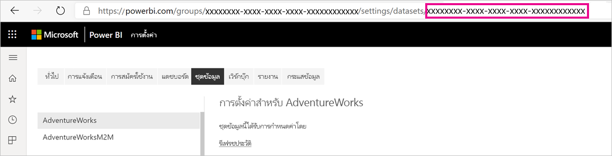
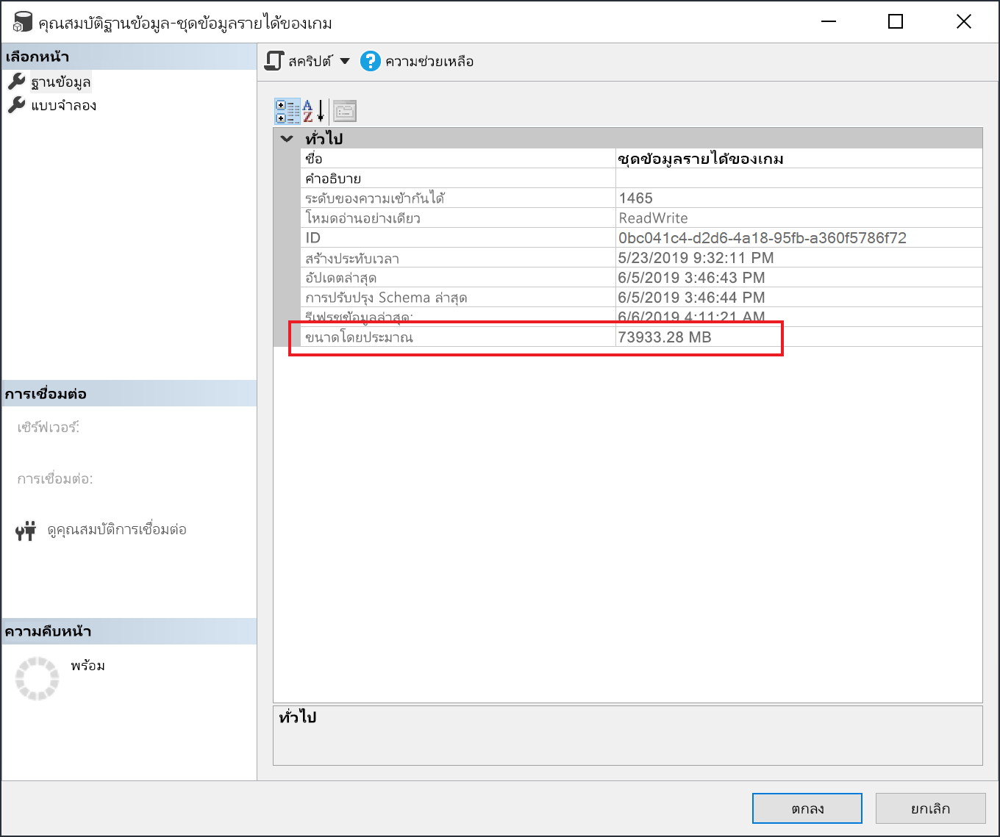

# <a name="large-datasets-in-power-bi-premium"></a>ชุดข้อมูลขนาดใหญ่ใน Power BI Premium

ชุดข้อมูล Power BI สามารถเก็บข้อมูลในแคชที่บีบอัดสูง แคชในหน่วยความจำสำหรับประสิทธิภาพการค้นหาที่ดีที่สุดเพื่อเปิดใช้งานการโต้ตอบกับผู้ใช้อย่างรวดเร็ว ด้วยความจุพรีเมียมชุดข้อมูลขนาดใหญ่เกินขีดจำกัดเริ่มต้นสามารถเปิดใช้งานได้ด้วยการตั้งค่า **รูปแบบการจัดเก็บชุดข้อมูลขนาดใหญ่** เมื่อเปิดใช้งาน ขนาดชุดข้อมูลจะถูกจํากัดตามขนาด *ความจุ* แบบพรีเมียมหรือขนาดสูงสุดที่กำหนดโดยผู้ดูแลระบบ

สามารถเปิดใช้งานชุดข้อมูลขนาดใหญ่สำหรับ Premium P SKUs และ Embedded A SKU ทั้งหมด ขีดจำกัดขนาดชุดข้อมูลขนาดใหญ่ใน Premium เทียบได้กับ Azure Analysis Services ในแง่ของข้อจำกัดขนาดแบบจำลองข้อมูล

แม้ว่าชุดข้อมูลจะต้องมีขนาดเกิน 10 GB แต่การเปิดใช้การตั้งค่ารูปแบบพื้นที่จัดเก็บข้อมูลขนาดใหญ่จะมีประโยชน์เพิ่มเติม หากคุณวางแผนที่จะใช้เครื่องมือที่ใช้ตำแหน่งข้อมูล XMLA สำหรับการดำเนินการเขียนชุดข้อมูล อย่าลืมเปิดใช้งานการตั้งค่าแม้แต่สำหรับชุดข้อมูลที่คุณไม่จำเป็นต้องกำหนดลักษณะเป็นชุดข้อมูล *ขนาดใหญ่* เมื่อเปิดใช้งาน รูปแบบพื้นที่จัดเก็บชุดข้อมูลขนาดใหญ่สามารถปรับปรุงประสิทธิภาพการดำเนินการเขียน XMLA ได้

ชุดข้อมูลขนาดใหญ่ในบริการจะไม่ส่งผลต่อขนาดการอัปโหลดแบบจำลอง Power BI Desktop ซึ่งยังจำกัดไว้ที่ 10 GB แต่ชุดข้อมูลสามารถขยายเกินขีดจำกัดในบริการในการรีเฟรช

> [!IMPORTANT]
> Power BI Premium รองรับชุดข้อมูลขนาดใหญ่ เปิดใช้งานตัวเลือกการจัด **รูปแบบการจัดเก็บชุดข้อมูลขนาดใหญ่** เพื่อใช้ข้อมูลใน Power BI Premium ที่มีขนาดใหญ่กว่าขีดจำกัดเริ่มต้น 


## <a name="enable-large-datasets"></a>เปิดใช้งานชุดข้อมูลขนาดใหญ่

ขั้นตอนที่นี่อธิบายการเปิดใช้งานชุดข้อมูลขนาดใหญ่สำหรับแบบจำลองใหม่ที่เผยแพร่ไปยังบริการ สำหรับชุดข้อมูลที่มีอยู่ เฉพาะขั้นตอนที่สามเท่านั้นที่จำเป็น

1. สร้างแบบจำลองใน Power BI Desktop หากชุดข้อมูลของคุณมีขนาดใหญ่ขึ้นและใช้หน่วยความจำมากขึ้นเรื่อย ๆ อย่าลืมกำหนดค่า[การรีเฟรชแบบเพิ่มหน่วย](service-premium-incremental-refresh.md)

1. เผยแพร่แบบจำลองในฐานะชุดข้อมูลไปยังบริการ

1. ในบริการ > ชุดข้อมูล > **การตั้งค่า** ให้ขยาย **รูปแบบพื้นที่จัดเก็บชุดข้อมูลขนาดใหญ่** จากนั้นคลิกแถบเลื่อนไปที่ **เปิด** จากนั้นคลิก **นำไปใช้**

    :::image type="content" source="media/service-premium-large-models/enable-large-dataset.png" alt-text="เปิดใช้งานตัวเลื่อนชุดข้อมูลขนาดใหญ่":::

1. เรียกใช้การรีเฟรชเพื่อโหลดข้อมูลที่ถูกเก็บมาก่อนหน้าโดยยึดตามนโยบายการรีเฟรชแบบเพิ่มหน่วย การรีเฟรชครั้งแรกอาจใช้เวลาสักครู่เพื่อโหลดประวัติ การรีเฟรชที่ตามมาในภายหลังควรเร็วขึ้น ทั้งนี้ขึ้นอยู่กับนโยบายการรีเฟรชแบบเพิ่มหน่วยของคุณ

## <a name="set-default-storage-format"></a>กำหนดรูปแบบพื้นที่จัดเก็บเริ่มต้น

ชุดข้อมูลใหม่ทั้งหมดที่สร้างขึ้นในพื้นที่ทำงานที่กำหนดให้กับความจุระดับ Premium สามารถเปิดใช้งานรูปแบบพื้นที่จัดเก็บชุดข้อมูลขนาดใหญ่ได้ตามค่าเริ่มต้น

1. ในพื้นที่ทำงาน ให้คลิก **การตั้งค่า** > **Premium**

1. ใน **รูปแบบพื้นที่จัดเก็บเริ่มต้น** ให้เลือก **รูปแบบพื้นที่จัดเก็บชุดข้อมูลขนาดใหญ่** จากนั้นคลิก **บันทึก**

    :::image type="content" source="media/service-premium-large-models/default-storage-format.png" alt-text="เปิดใช้งานรูปแบบพื้นที่จัดเก็บเริ่มต้น":::

### <a name="enable-with-powershell"></a>เปิดใช้งานด้วย PowerShell

คุณยังสามารถเปิดใช้งานรูปแบบพื้นที่จัดเก็บชุดข้อมูลขนาดใหญ่ได้โดยใช้ PowerShell คุณต้องมีสิทธิ์ของผู้ดูแลความจุและผู้ดูแลพื้นที่ทำงานของเพื่อเรียกใช้ cmdlet ของ PowerShell

1. ค้นหา ID ของชุดข้อมูล (GUID) บนแท็บ **ชุดข้อมูล** สำหรับพื้นที่ทำงานภายใต้การตั้งค่าชุดข้อมูล คุณสามารถดู ID ใน URL ได้

    

1. จากพร้อมท์ผู้ดูแลระบบ PowerShell ให้ติดตั้งโมดูล [MicrosoftPowerBIMgmt](/powershell/module/microsoftpowerbimgmt.data/)

    ```powershell
    Install-Module -Name MicrosoftPowerBIMgmt
    ```

1. เรียกใช้ cmdlets ต่อไปนี้เพื่อลงชื่อเข้าใช้และตรวจสอบโหมดที่เก็บชุดข้อมูล

    ```powershell
    Login-PowerBIServiceAccount

    (Get-PowerBIDataset -Scope Organization -Id <Dataset ID> -Include actualStorage).ActualStorage
    ```

    การตอบสนองควรเป็นดังต่อไปนี้ โหมดที่เก็บข้อมูลเป็น ABF (ไฟล์สำรองข้อมูล Analysis Services) ซึ่งเป็นค่าเริ่มต้น

    ```
    Id                   StorageMode

    --                   -----------

    <Dataset ID>         Abf
    ```

1. เรียกใช้ cmdlets ต่อไปนี้เพื่อตั้งค่าโหมดพื้นที่เก็บข้อมูล อาจใช้เวลาสองถึงสามวินาทีในการแปลงเป็น Premium Files

    ```powershell
    Set-PowerBIDataset -Id <Dataset ID> -TargetStorageMode PremiumFiles

    (Get-PowerBIDataset -Scope Organization -Id <Dataset ID> -Include actualStorage).ActualStorage
    ```

    การตอบสนองควรเป็นดังต่อไปนี้ ขณะนี้โหมดที่เก็บข้อมูลถูกตั้งค่าเป็น Premium Files

    ```
    Id                   StorageMode
    
    --                   -----------
    
    <Dataset ID>         PremiumFiles
    ```

คุณสามารถตรวจสอบสถานะของการแปลงชุดข้อมูลไปยังและจากไฟล์พรีเมียมโดยใช้ cmdlet [Get-PowerBIWorkspaceMigrationStatus](/powershell/module/microsoftpowerbimgmt.workspaces/get-powerbiworkspacemigrationstatus)

## <a name="dataset-eviction"></a>การลดสัดส่วนชุดข้อมูล

Power BI ใช้การจัดการหน่วยความจำแบบไดนามิกเพื่อลดสันส่วนชุดข้อมูลที่ไม่ใช้งานจากหน่วยความจำ Power BI ลดสันส่วนชุดข้อมูลเพื่อให้สามารถโหลดชุดข้อมูลอื่น ๆ เพื่อจัดการกับคิวรีของผู้ใช้ การจัดการหน่วยความจำแบบไดนามิกช่วยให้ผลรวมของขนาดชุดข้อมูลมากกว่าหน่วยความจำที่มีอยู่ในความจุอย่างมีนัยสำคัญ แต่ชุดข้อมูลเดียวจะต้องพอดีกับหน่วยความจำ สำหรับข้อมูลเพิ่มเติมเกี่ยวกับการจัดการหน่วยความจำแบบไดนามิก โปรดดูที่ [วิธีการทำงานของความจุ](service-premium-what-is.md#how-capacities-function)

คุณควรพิจารณาผลกระทบของการลดสัดส่วนในแบบจำลองขนาดใหญ่ แม้ว่าเวลาโหลดชุดข้อมูลจะค่อนข้างเร็ว แต่ก็อาจมีความล่าช้าที่เห็นได้ชัดสำหรับผู้ใช้หากต้องรอการโหลดชุดข้อมูลขนาดใหญ่ที่ถูกตัดออก ด้วยเหตุผลนี้ ในรูปแบบปัจจุบัน ฟีเจอร์โมเดลขนาดใหญ่จึงเป็นที่แนะนำอย่างมากสำหรับความจุที่เฉพาะกับข้อกำหนด BI ขององค์กรแทนอันที่ผสมกับข้อกำหนด BI แบบบริการตนเอง ความจุที่เฉพาะกับข้อกำหนดด้าน BI ขององค์กรมีโอกาสน้อยที่จะทำให้เกิดการลดสัดส่วนข้อมูลและต้องการโหลดชุดข้อมูลซ้ำ ในทางกลับกันความจุสำหรับ BI แบบบริการตนเองอาจมีชุดข้อมูลขนาดเล็กจำนวนมากที่โหลดเข้าและออกจากหน่วยความจำบ่อยกว่า

## <a name="checking-dataset-size"></a>ตรวจสอบขนาดของชุดข้อมูล

หลังจากโหลดข้อมูลที่ถูกเก็บมาก่อนหน้าแล้ว คุณสามารถใช้ [SSMS](/sql/ssms/download-sql-server-management-studio-ssms) ถึง [จุดปลายทาง XMLA](service-premium-connect-tools.md) เพื่อตรวจสอบขนาดชุดข้อมูลโดยประมาณในหน้าต่างคุณสมบัติของแบบจำลอง



คุณยังสามารถตรวจสอบขนาดของชุดข้อมูลโดยการเรียกใช้คิวรี DMV ต่อไปนี้จาก SSMS ได้อีกด้วย รวมขคอลัมน์ DICTIONARY\_SIZE และ USED\_SIZE จากผลผลิตเพื่อดูขนาดของชุดข้อมูลเป็นหน่วยไบต์

```sql
SELECT * FROM SYSTEMRESTRICTSCHEMA
($System.DISCOVER_STORAGE_TABLE_COLUMNS,
 [DATABASE_NAME] = '<Dataset Name>') //Sum DICTIONARY_SIZE (bytes)

SELECT * FROM SYSTEMRESTRICTSCHEMA
($System.DISCOVER_STORAGE_TABLE_COLUMN_SEGMENTS,
 [DATABASE_NAME] = '<Dataset Name>') //Sum USED_SIZE (bytes)
```

## <a name="limitations-and-considerations"></a>ข้อจำกัดและข้อควรพิจารณา

โปรดคำนึงถึงข้อจำกัดต่อไปนี้เมื่อใช้ชุดข้อมูลขนาดใหญ่:

- **จำเป็นต้องมีพื้นที่ทำงานใหม่**: ชุดข้อมูลขนาดใหญ่สามารถใช้งานได้กับ [พื้นที่ทำงานใหม่](../collaborate-share/service-create-the-new-workspaces.md)เท่านั้น

- **ดาวน์โหลดไปยัง Power BI Desktop** : ถ้ามีการจัดเก็บชุดข้อมูลบน Premium Files [การดาวน์โหลดเป็นไฟล์ .pbix](../create-reports/service-export-to-pbix.md) จะล้มเหลว
- **ภูมิภาคที่รองรับ**: ชุดข้อมูลขนาดใหญ่ได้รับการสนับสนุนในภูมิภาค Azure ทั้งหมดที่สนับสนุนการจัดเก็บไฟล์ Premium หากต้องการเรียนรู้เพิ่มเติม โปรดดู[ผลิตภัณฑ์ที่พร้อมใช้งานตามภูมิภาค](https://azure.microsoft.com/global-infrastructure/services/?products=storage)และดูตารางในส่วนต่อไปนี้

- **การตั้งค่าขนาดชุดข้อมูลสูงสุด**: ขนาดชุดข้อมูลสูงสุดสามารถตั้งค่าได้โดยผู้ดูแลระบบ ค่าสูงสุดสามารถตั้งค่าได้ตั้งแต่ 0.1 GB จนถึงความจุสูงสุดของ SKU

## <a name="region-availability"></a>ความพร้อมใช้งานของภูมิภาค

ชุดข้อมูลขนาดใหญ่ใน Power BI สามารถใช้งานได้ในเฉพาะในภูมิภาคของ Azure ที่รองรับ[พื้นที่เก็บข้อมูลไฟล์ Azure Premium](/azure/storage/files/storage-files-planning#storage-tiers)

รายการต่อไปนี้แสดงภูมิภาคที่มีชุดข้อมูลขนาดใหญ่ใน Power BI ภูมิภาคที่ไม่ได้อยู่ในรายการต่อไปนี้ไม่ได้รับการรองรับสำหรับโมเดลที่มีขนาดใหญ่:

|ภูมิภาค Azure  |ตัวย่อภูมิภาคของ Azure  |
|---------|---------|
|ออสเตรเลียตะวันออก     | ออสเตรเลียตะวันออก        |
|ออสเตรเลียตะวันออกเฉียงใต้     | ออสเตรเลียตะวันออกเฉียงใต้        |
|แคนาดาตะวันออก     | แคนาดาตะวันออก        |
|แคนาดาตอนกลาง     | แคนาดาตอนกลาง        |
|อินเดียตอนกลาง     | อินเดียตอนกลาง        |
|สหรัฐอเมริกาตอนกลาง     | สหรัฐอเมริกาตอนกลาง        |
|เอเชียตะวันออก     | เอเชียตะวันออก        |
|สหรัฐอเมริกาฝั่งตะวันออก     | สหรัฐอเมริกาตะวันออก        |
|สหรัฐอเมริกาฝั่งตะวันออก 2     | สหรัฐอเมริกาตะวันออก 2        |
|ญี่ปุ่นฝั่งตะวันออก     | ญี่ปุ่นตะวันออก        |
|ญี่ปุ่นตะวันตก     | ญี่ปุ่นตะวันออก        |
|เกาหลีตอนกลาง     | เกาหลีตอนกลาง        |
|เกาหลีตอนใต้     | เกาหลีตอนใต้        |
|สหรัฐอเมริกาตอนกลางทางเหนือ     | สหรัฐอเมริกากลางตอนเหนือ        |
|ยุโรปเหนือ     | ยุโรปตอนเหนือ        |
|สหรัฐอเมริกาตอนกลางทางใต้     | สหรัฐอเมริกากลางตอนใต้        |
|เอเชียตะวันออกเฉียงใต้     | เอเชียตะวันออกเฉียงใต้        |
|สหราชอาณาจักรตอนใต้     | สหราชอาณาจักรตอนใต้        |
|สหราชอาณาจักรตะวันตก     | สหราชอาณาจักรตะวันตก        |
|ยุโรปตะวันตก     | ยุโรปตะวันตก        |
|อินเดียตะวันตก     | อินเดียตะวันตก        |
|สหรัฐอเมริกาตะวันตก     | สหรัฐอเมริกาตะวันตก        |
|US 2 ตะวันตก     | สหรัฐอเมริกาตะวันตก 2        |

## <a name="next-steps"></a>ขั้นตอนถัดไป

ลิงก์ต่อไปนี้จะให้ข้อมูลที่มีประโยชน์สำหรับการทำงานกับโมเดลขนาดใหญ่:

* [ที่เก็บไฟล์ Azure Premium](/azure/storage/files/storage-files-planning#storage-tiers)
* [กำหนดค่าการสนับสนุน Multi-Geo สำหรับ Power BI Premium](service-admin-premium-multi-geo.md)
* [นำคีย์การเข้ารหัสลับของคุณเองมาใช้กับ Power BI](service-encryption-byok.md)
* [วิธีการทำงานของความจุ](service-premium-what-is.md#how-capacities-function)
* [การรีเฟรชแบบเพิ่มหน่วย](service-premium-incremental-refresh.md)

Power BI ได้แนะนำ Power BI Premium Gen2 เข้ามาใช้งานเป็นข้อเสนอการแสดงตัวอย่าง ซึ่งปรับปรุงประสบการณ์การใช้งาน Power BI Premium ด้วยการปรับปรุงในสิ่งต่อไปนี้:
* ประสิทธิภาพการทำงาน
* สิทธิการใช้งานต่อผู้ใช้
* ขนาดใหญ่ขึ้น
* เมตริกที่ดีขึ้น
* การปรับขนาดอัตโนมัติ
* ลดค่าใช้จ่ายในการจัดการ

สำหรับข้อมูลเพิ่มเติมเกี่ยวกับ Power BI Premium Gen2 โปรดดูที่ [Power BI Premium Generation 2 (ตัวอย่าง)](service-premium-what-is.md#power-bi-premium-generation-2-preview)
