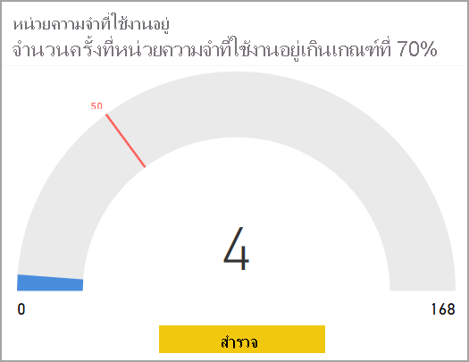
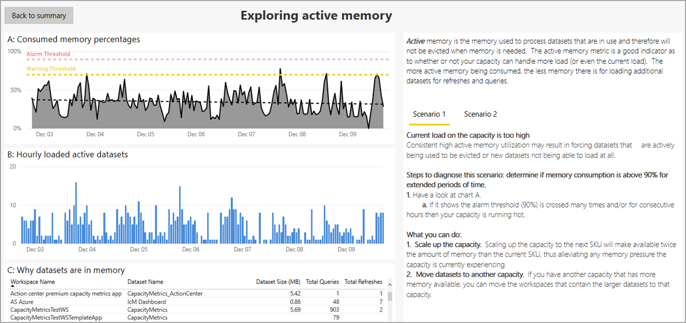
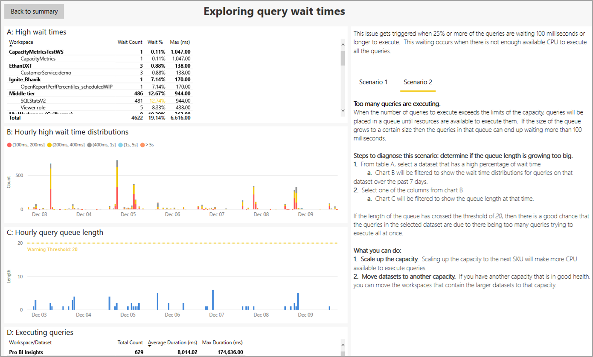
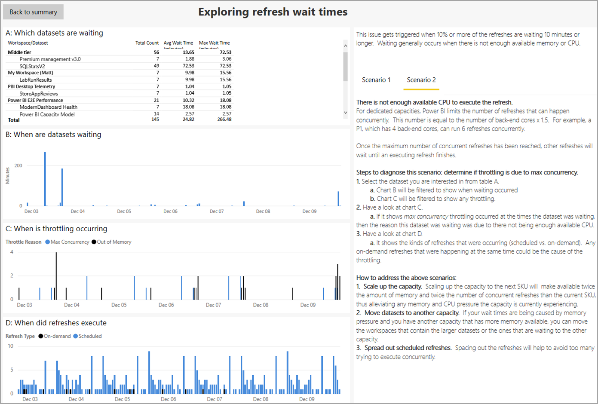

# แอปเมตริกความจุ Power BI PremiumPower BI Premium Metrics app

คุณสามารถใช้ **แอปเมตริกความจุ Power BI Premium** เพื่อจัดการประสิทธิภาพและความจุของการสมัครใช้งาน Power BI Premium ของคุณได้You can use the **Power BI Premium Metrics app** to manage the health and capacity of your Power BI Premium subscription. ด้วยแอปนี้ ผู้ดูแลระบบใช้ **ศูนย์ประสิทธิภาพความจุ** ของแอปเพื่อดูและโต้ตอบกับตัวบ่งชี้ที่ตรวจสอบประสิทธิภาพของความจุพรีเมียมของพวกเขาWith the app, administrators use the app's **Capacity health center** to see and interact with indicators that monitor the health of their premium capacity. แอปเมตริกประกอบด้วยหน้าเริ่มต้นที่เรียกว่า **ศูนย์ประสิทธิภาพความจุ** และรายละเอียดเกี่ยวกับเมตริกสำคัญสามรายการ:The Metrics app consists of the landing page, called the **Capacity Health Center**, and details about three important metrics:

* หน่วยความจำที่ใช้งานอยู่Active memory
* การรอคิวรีQuery waits
* การรอรีเฟรชRefresh waits

ส่วนต่อไปนี้จะอธิบายในรายละเอียดของหน้าเริ่มต้นและหน้ารายงานเมตริกสามรายการThe following sections describe the landing page, and the three metrics report pages, in detail. 

> [!IMPORTANT]
> ถ้าความจุ Power BI Premium ของคุณกำลังประสบปัญหาการใช้ทรัพยากรสูงจนส่งผลให้เกิดปัญหาด้านประสิทธิภาพการทำงานหรือความมั่นคง คุณสามารถรับอีเมลแจ้งเตือนเพื่อทราบปัญหาและแก้ไขปัญหาได้If your Power BI Premium capacity is experiencing high resource usage, resulting in performance or reliability issues, you can receive notification emails to identify and resolve the issue. ซึ่งอาจเป็นวิธีที่มีประสิทธิภาพในการแก้ไขปัญหาความจุโอเวอร์โหลดThis can be a streamlined way to troubleshoot overloaded capacities. คุณสามารถศึกษาข้อมูลเพิ่มเติมได้ที่[ความจุและการแจ้งเตือนความมั่นคง](service-interruption-notifications.md#capacity-and-reliability-notifications)See [capacity and reliability notifications](service-interruption-notifications.md#capacity-and-reliability-notifications) for more information.

> [!NOTE]
> Power BI Premium เพิ่งเปิดตัว Premium เวอร์ชันใหม่ชื่อ **Premium Gen2** ซึ่งกำลังอยู่ในช่วงการแสดงตัวอย่างPower BI Premium recently released a new version of Premium, called **Premium Gen2**, which is currently in preview. Premium Gen2 จะทำให้การจัดการความจุระดับพรีเมียมง่ายขึ้นและลดค่าใช้จ่ายในการจัดการPremium Gen2 will simplify the management of Premium capacities, and reduce management overhead. โดยเฉพาะอย่างยิ่งจะช่วยลดความจำเป็นในการเฝ้าติดตามระบบของผู้ดูแลเมตริก (CPU เท่านั้น) เพื่อให้มั่นใจถึงประสิทธิภาพและประสบการณ์ของผู้ใช้In particular, it greatly reduces the metrics administrators must monitor (CPU only) to ensure performance and users’ experience. สำหรับข้อมูลเพิ่มเติม โปรดดูที่ [Power BI Premium Generation 2 (ตัวอย่าง)](service-premium-what-is.md#power-bi-premium-generation-2-preview)For more information, see [Power BI Premium Generation 2 (preview)](service-premium-what-is.md#power-bi-premium-generation-2-preview).

## ศูนย์ประสิทธิภาพความจุพรีเมียมPremium capacity health center

เมื่อคุณเปิด **แอปเมตริก Power BI Premium** คุณจะได้รับการแสดงผลด้วย **ศูนย์ประสิทธิภาพความจุ** ซึ่งแสดงภาพรวมของประสิทธิภาพของความจุ Power BI Premium ของคุณWhen you open the **Power BI Premium metrics app** you're presented with the **Capacity health center**, which provides an overview of the health of your Power BI Premium capacity.

จากหน้าเริ่มต้น คุณสามารถเลือกความจุ Power BI Premium ที่คุณต้องการดู ในกรณีที่องค์กรของคุณมีการสมัครใช้งาน Premium หลายรายการFrom the landing page, you can select the Power BI Premium capacity you want to view, in case your organization has multiple Premium subscriptions. หากต้องการดูความจุพรีเมียม ให้เลือกรายการดรอปดาวน์ที่อยู่ใกล้กับด้านบนของหน้า ซึ่งเรียกว่า **เลือกความจุเพื่อดูเมตริก**To view a Premium capacity, select the dropdown near the top of the page called **Select a capacity to see its metrics**.

KPI ทั้งสามรายการแสดงประสิทธิภาพปัจจุบันของความจุพรีเมียมที่เลือก โดยยึดตามการตั้งค่าที่ใช้กับแต่ละ KPI แต่ละรายการThe three KPIs show the current health of the selected Premium capacity, based on the settings applied to each of the three KPIs. 

เมื่อต้องการดูรายละเอียดเกี่ยวกับ KPI แต่ละรายการ ให้เลือกปุ่ม **สำรวจ** ที่ด้านล่างของวิชวลของ KPI แต่ละรายการ และหน้ารายละเอียดจะแสดงขึ้นTo view specifics about each KPI, select the **Explore** button at the bottom of each KPI's visual, and its detail page is displayed. ส่วนต่อไปนี้อธิบาย KPI แต่ละรายการและรายละเอียดของเพจThe following sections describe each KPI and the details its page provides.

## เมตริกหน่วยความจำที่ใช้งานอยู่The active memory metric

เมตริก **หน่วยความจำที่ใช้งานอยู่** เป็นส่วนหนึ่งของประเภท *การวางแผนความจุ* ซึ่งเป็นตัวบ่งชี้ประสิทธิภาพที่ดีในการประเมินปริมาณการใช้ทรัพยากรของความจุของคุณสำหรับการใช้งาน เพื่อให้คุณสามารถปรับความจุตามที่จำเป็นในการวางแผนขนาดความจุThe **active memory** metric is part of the *capacity planning* category, which is a good health indicator to evaluate your capacity's resource consumption for usage, so you can adjust the capacity as necessary to plan capacity scale. 

**หน่วยความจำที่ใช้งานอยู่** คือหน่วยความจำที่ใช้ในการประมวลผลชุดข้อมูลที่กำลังใช้งานอยู่ในขณะนั้น และดังนั้นจึงไม่สามารถนำออกได้เมื่อต้องการหน่วยความจำ**Active memory** is the memory used to process datasets that are currently in use, and which therefore will not be evicted when memory is needed. เมตริกหน่วยความจำที่ใช้งานอยู่จะระบุว่าความจุของคุณสามารถรองรับการโหลดเพิ่มเติม หรือมีความจุเข้าใกล้หรือเกินความจุการโหลดที่รับได้ในปัจจุบันหรือไม่The active memory metric indicates whether your capacity can handle additional load, or of already nearing or over capacity, the capacity's current load. หน่วยความจำที่ใช้งานอยู่ในขณะนี้ หมายความว่า มีหน่วยความจำที่พร้อมใช้งานน้อยลงเพื่อสนับสนุนการรีเฟรชและคิวรีเพิ่มเติมThe active memory currently being consumed means less memory is available to support additional refreshes and queries. 

KPI ของ **หน่วยความจำที่ใช้งานอยู่** จะวัดจำนวนครั้งที่หน่วยความจำที่ใช้งานอยู่ของความจุข้ามเกณฑ์ 70% จำนวน 50 ครั้ง (ตัวกำหนดถูกตั้งค่าเป็น 30% ของเจ็ดวันที่ผ่านมา) ซึ่งแสดงให้เห็นว่าความจุกำลังจะใกล้จุดที่เมื่อผู้ใช้จะเริ่มพบปัญหาด้านประสิทธิภาพการทำงานของคิวรีThe **active memory** KPI measures how many times the capacity's active memory has crossed the 70% threshold 50 times (the marker is set to 30% of the last seven days), which indicates that the capacity is approaching a point when users may begin seeing performance issues with queries.

วิชวลตัววัดที่แสดงในหัวข้อนี้แสดงให้เห็นว่าในเจ็ดวันที่ผ่านมาจากเวลาที่มีการรีเฟรชรายงานครั้งล่าสุด ความจุได้ข้ามเกณฑ์ 70% สี่ครั้ง แยกตามกลุ่มรายชั่วโมงThe gauge visual shown in this section reveals that, in the last seven days from the time the report was last refreshed, the capacity has crossed the 70% threshold four times, split by hourly buckets. ค่าสูงสุดของตัววัด 168 แสดงถึงเจ็ดวันที่ผ่านมาในหน่วยชั่วโมงThe maximum value of the gauge, 168, represents the last seven days, in hours.

หากต้องการเรียนรู้รายละเอียดของ KPI ของหน่วยความจำที่ใช้งานอยู่ คลิกที่ปุ่ม **สำรวจ** เพื่อดูหน้ารายงานที่มีการแสดงภาพเฉพาะของเมตริกรายละเอียด พร้อมด้วยคำแนะนำการแก้ไขปัญหาที่แสดงอยู่บนคอลัมน์ด้านขวาของหน้าTo learn the details of the active memory KPI, click the **Explore** button to see a report page that provides specific visualizations of its detailed metrics, along with a troubleshooting guide shown on the right column of the page. 

มีสองสถานการณ์ที่มีการอธิบายประกอบ ซึ่งคุณสามารถแสดงบนหน้ารายงานได้โดยการเลือก **สถานการณ์ 1** หรือ **สถานการณ์ 2** บนหน้านั้นThere are two scenarios explained, which you can show on the report page by selecting **Scenario 1** or **Scenario 2** on the page. 

คำแนะนำการแก้ไขปัญหาที่เกี่ยวข้องกับแต่ละสถานการณ์จะให้คำอธิบายโดยละเอียดเกี่ยวกับความหมายของเมตริก เพื่อที่คุณจะเข้าใจสถานะของความจุได้ดียิ่งขึ้นและทราบถึงสิ่งที่สามารถทำได้เพื่อลดปัญหาใดก็ตามThe troubleshooting guides, associated with each scenario, provide detailed explanations about what the metrics mean, so you can better understand the state of the capacity, and what can be done to mitigate any issues. 

สองสถานการณ์นั้นจะอธิบายไว้ในส่วนต่อไปนี้Those two scenarios are described in the following sections.

### สถานการณ์ที่หนึ่ง - การโหลดปัจจุบันสูงเกินไปScenario one - current load is too high 

หากต้องการตรวจสอบว่ามีหน่วยความจำเพียงพอสำหรับความจุในการดำเนินการปริมาณงานที่มีหรือไม่ ให้ดูที่วิชวลแรกบนหน้า: **A: เปอร์เซ็นต์หน่วยความจำที่ใช้** ซึ่งแสดงหน่วยความจำที่ใช้โดยชุดข้อมูลที่กำลังประมวลผลอยู่ และดังนั้นจึงไม่นำออกได้To determine whether there's enough memory for the capacity to complete its workloads, consult the first visual on the page: **A: Consumed Memory Percentages**, which displays the memory consumed by datasets that are being actively processed, and thus, cannot be evicted.

ค่าเกณฑ์การแจ้งเตือน ซึ่งเป็นเส้นประสีแดง เป็นการบอกเหตุการณ์ของการใช้หน่วยความจำ 90%The alarm threshold, which is the red dotted line, marks incidents of 90% memory consumption.

ค่าเกณฑ์คำเตือน ซึ่งเป็นเส้นประสีเหลือง เป็นการบอกเหตุการณ์ของการใช้หน่วยความจำ 70%The warning threshold, which is the yellow dotted line, marks incidents of 70% memory consumption. 

เส้นประสีดำจะแสดงแนวโน้มการใช้หน่วยความจำโดยยึดตามการใช้งานหน่วยความจำของความจุปัจจุบันผ่านช่วงของเส้นเวลาของกราฟThe black dotted line indicates the memory usage trendline, based on the current capacity's memory usage over the course of the graph timeline.

การเกิดขึ้นบ่อยครั้งของหน่วยความจำที่ใช้งานอยู่เหนือค่าเกณฑ์การแจ้งเตือน (เส้นประสีแดง) และเส้นแนวโน้มหน่วยความจำ (เส้นประสีดำ) แสดงถึงความดันความจุหน่วยความจำซึ่งอาจป้องกันไม่ให้มีการโหลดชุดข้อมูลเพิ่มเติมลงในหน่วยความจำระหว่างเวลานั้นHigh occurrences of active memory above the alarm threshold (red dotted line) and memory trendline (black dotted line) indicates memory capacity pressure, possibly preventing additional datasets from being loaded into memory during that time. 

เมื่อคุณเห็นเหตุการณ์ดังกล่าว คุณควรดูที่แผนภูมิอื่นๆ บนหน้าอย่างละเอียดเพื่อพิจารณาให้มากขึ้นว่าเหตุการณ์เกิดขึ้นกับหน่วยความจำใดและสาเหตุใดที่ทำให้มีการใช้หน่วยความจำจำนวนมาก และหาวิธีการโหลดสมดุลหรือปรับให้เหมาะสม หรือต้องมีการเพิ่มขนาดความจุหากจำเป็นWhen you see such cases, you should look carefully at the other charts on the page to better determine what and why so much memory is so frequently being consumed, and how to load balance or optimize, or if necessary, scale up the capacity. 

วิชวลที่สองบนหน้า **B: ชุดข้อมูลที่ใช้งานอยู่เป็นรายชั่วโมง** แสดงจำนวนสูงสุดของชุดข้อมูลที่โหลดในหน่วยความจำในกลุ่มรายชั่วโมงThe second visual on the page, **B: Hourly loaded active datasets** displays the counts of the maximum number of datasets that were loaded in memory, in hourly buckets. 

วิชวลที่สาม **C: สาเหตุที่ชุดข้อมูลในหน่วยความจำ** คือตารางที่แสดงรายการชุดข้อมูลตามชื่อพื้นที่ทำงาน ชื่อชุดข้อมูล ขนาดที่ไม่มีการบีบอัดในหน่วยความจำอธิบายเหตุผลที่จะโหลดในหน่วยความจำ (เช่นการรีเฟรชหรือการคิวรีหรือทั้งสองอย่าง)The third visual, **C: Why datasets are in memory** is a table that lists the dataset by workspace name, dataset name, datasets uncompressed size in memory, explains the reason it's loaded in memory (such as, being refreshed or queried against, or both).

#### วินิจฉัยสถานการณ์ที่หนึ่งDiagnosing scenario one

การใช้หน่วยความจำที่ใช้งานสูงที่สอดคล้องกันอาจส่งผลให้ชุดข้อมูลที่กำลังใช้งานถูกนำออก หรือป้องกันไม่ให้ชุดข้อมูลใหม่สามารถโหลดได้Consistent high active memory utilization may result in forcing datasets that are actively being used to be evicted, or can prevent new datasets from able to load. ขั้นตอนต่อไปนี้สามารถช่วยให้คุณวิเคราะห์ปัญหาได้The following steps can help you diagnose problems

1. ลองดูที่แผนภูมิ *A: เปอร์เซ็นต์ความจำที่ใช้*Have a look at chart *A: Consumed memory percentages*

    **a.****a.** ถ้าแผนภูมิ A แสดงการข้ามเกณฑ์การแจ้งเตือน (90%) หลายครั้งและ/หรือหลายชั่วโมงติดต่อกันแล้ว ความจุของคุณกำลังทำงานในหน่วยความจำต่ำบ่อยครั้งเกินไปIf Chart A shows the alarm threshold (90%) is crossed many times and/or for consecutive hours, then your capacity is running low on memory too frequently. ในแผนภูมิด้านล่าง เราจะเห็นว่ามีการข้ามค่าเกณฑ์คำเตือน (70%) สี่ครั้งIn the chart below, we can see the warning threshold (70%) was crossed four times.

    

    **b.****b.** ชื่อแผนภูมิ *B: ชุดข้อมูลที่ใช้งานอยู่ซึ่งโหลดเป็นรายชั่วโมง* แสดงจำนวนสูงสุดของชุดข้อมูลที่ไม่ซ้ำกันที่โหลดในหน่วยความจำตามกลุ่มรายชั่วโมงThe chart titled *B: Hourly loaded active datasets* shows the maximum number of unique datasets loaded in memory by hourly buckets. การเลือกแถบในวิชวลจะข้ามตัวกรอง เหตุผลที่ชุดข้อมูลอยู่ในวิชวลหน่วยความจำSelecting a bar in the visual will cross filter the reasons datasets are in memory visual.  

         

    **c.****c.** ดูตาราง **สาเหตุที่ชุดข้อมูลอยู่หน่วยความจำ** เพื่อดูรายการของชุดข้อมูลที่โหลดในหน่วยความจำConsult the **Why datasets are in memory** table to see a list of the datasets that were loaded in memory. เรียงลำดับตาม *ขนาดชุดข้อมูล (MB)* เพื่อให้เห็นชุดข้อมูลที่มีการใช้หน่วยความจำมากที่สุดSort by *Dataset Size (MB)* to highlight the datasets taking up the most memory. การทำงานของความจุจะถูกจัดประเภทเป็นการทำงาน *แบบโต้ตอบ* หรือ *การทำงานแบบเบื้องหลัง*Capacity operations are classified as either *interactive* or *background*. การทำงานแบบโต้ตอบประกอบด้วยการแสดงคำขอ และการตอบสนองโต้ตอบกับผู้ใช้ (การกรอง การคิวรีถามตอบ และอีกมากมาย)Interactive operations include rendering requests and responding to user interactions (filtering, Q&A querying, and so on). คิวรีทั้งหมดและการรีเฟรชทั้งหมดให้ข้อมูลว่ามีการทำงานแบบโต้ตอบ (คิวรี) หนัก หรือการทำงานแบบเบื้องหลัง (รีเฟรช) ที่กระทำบนชุดข้อมูลหรือไม่Total queries and total refreshes provide an idea of whether there are interactive (queries) heavy or background (refreshes) operations done on the dataset. คุณจะต้องเข้าใจว่าการทำงานแบบโต้ตอบจะมีความสำคัญมากกว่าการทำงานแบบเบื้องหลัง เพื่อให้แน่ใจว่าผู้ใช้จะได้รับประสบการณ์การใช้งานที่ดีที่สุดIt's important to understand that interactive operations are always prioritized over background operations to ensure the best possible user experience. ถ้ามีทรัพยากรไม่เพียงพอ การทำงานแบบเบื้องหลังจะถูกเพิ่มไปยังคิว และได้รับการประมวลผลเมื่อเพิ่มแหล่งข้อมูลIf there are insufficient resources, background operations are added to a queue, and are processed once resources free up. การทำงานแบบเบื้องหลัง เช่น การรีเฟรชชุดข้อมูลและฟังก์ชัน AI สามารถหยุดกลางกระบวนการได้โดยบริการของ Power BI และเพิ่มลงในคิวBackground operations, such as dataset refreshes and AI functions, can be stopped mid-process by the Power BI service and added to a queue.
    
      

#### การแก้ไขสำหรับสถานการณ์ที่หนึ่งRemedies for scenario one

คุณสามารถทำตามขั้นตอนต่อไปนี้เพื่อแก้ไขปัญหาที่เกี่ยวข้องกับสถานการณ์ที่หนึ่ง:You can take the following steps to remedy the problems associated with scenario one:

1. **เพิ่มขนาดความจุ** - เพิ่มขนาดความจุไปยัง SKU ถัดไปจะทำให้มีจำนวนหน่วยความจำที่มากกว่า SKU ปัจจุบันสองเท่า ทำให้บรรเทาความดันหน่วยความจำใดๆ ที่กำลังประสบอยู่**Scale up the capacity** - scaling up the capacity to the next SKU will make available twice the amount of memory than the current SKU, thus alleviating any memory pressure the capacity is currently experiencing.

2. **ย้ายชุดข้อมูลไปยังความจุอื่น** - ถ้าคุณมีความจุอื่นที่มีหน่วยความจำมากกว่า คุณสามารถย้ายพื้นที่ทำงานที่ประกอบด้วยชุดข้อมูลขนาดใหญ่ไปยังความจุนั้นได้**Move datasets to another capacity** - if you have another capacity that has more memory available, you can move the workspaces that contain the larger datasets to that capacity.

### สถานการณ์ที่สอง - โหลดในอนาคตจะเกินขีดจำกัดScenario two - future load will exceed limits

หากต้องการตรวจสอบว่ามีหน่วยความจำเพียงพอสำหรับความจุในการดำเนินการปริมาณงานที่มีหรือไม่ คุณสามารถอ้างอิงถึง **A: เปอร์เซ็นต์หน่วยความจำที่ใช้** วิชวลที่ด้านบนสุดของหน้า ซึ่งแสดงหน่วยความจำที่ใช้โดยชุดข้อมูลที่กำลังประมวลผลอยู่ และดังนั้นจึงนำออกไม่ได้To determine whether there's enough memory for the capacity to complete its workloads, you can refer to the **A: Consumed Memory Percentages** visual on the top of the page, representing the memory consumed by datasets that are being actively processed so cannot be evicted. เส้นประสีดำแสดงถึงแนวโน้มThe black dotted line highlights the trends. ในความจุที่มีความดันหน่วยความจำ วิชวลเดียวกันจะแสดงเส้นแนวโน้มหน่วยความจำ (เส้นประสีดำ) ที่เพิ่มขึ้นอย่างชัดเจน หมายความว่าอาจมีการป้องกันไม่ให้มีการโหลดชุดข้อมูลเพิ่มเติมลงในหน่วยความจำระหว่างเวลานั้นIn a capacity experiencing memory pressure, the same visual will clearly show the memory trendline (black dotted line) upwards, meaning that it is possibly preventing additional datasets from being loaded into memory at that point in time. เส้นแนวโน้ม หรือเส้นประสีดำนั้น จะแสดงแนวโน้มของการเติบโตโดยยึดตามข้อมูลเจ็ดวันThe trend line, the black dashed line, shows the trend of growth based on the seven days of data. 

#### วินิจฉัยสถานการณ์ที่สองDiagnosing scenario two

ในการวินิจฉัยสถานการณ์ที่สอง ให้พิจารณาดูว่าเส้นแนวโน้มแสดงแนวโน้มขึ้นไปยังค่าเกณฑ์คำเตือนหรือการแจ้งเตือนหรือไม่To diagnose scenario two, determine if the trend line is showing an upward trend towards warning or alarm thresholds. 

1. พิจารณา **แผนภูมิ A:**Consider **Chart A:**

    

    **a.****a.** ถ้าแผนภูมิแสดงความชันที่มีแนวโน้มเพิ่มขึ้น แสดงให้เห็นว่าปริมาณการใช้หน่วยความจำนั้นเพิ่มขึ้นในช่วงเจ็ดวันที่ผ่านมาIf the chart shows an upward slope, that indicates that memory consumption has increased over the past seven days.

    **b.****b.** สมมติว่ามีการเติบโตในปัจจุบันและทำนายเมื่อเส้นแนวโน้มข้ามค่าเกณฑ์การเตือน (เส้นประสีเหลือง)Assume the current growth, and predict when the trend line will cross the warning threshold (the yellow dashed line).

    **c.****c.** ให้ตรวจสอบเส้นแนวโน้มอย่างน้อยทุกสองวันเพื่อดูว่ายังคงมีแนวโน้มต่อเนื่องหรือไม่Keep checking the trend line at least every two days, to see if the trend continuing.

#### การแก้ไขสำหรับสถานการณ์ที่สองRemedies for scenario two

คุณสามารถทำตามขั้นตอนต่อไปนี้เพื่อแก้ไขปัญหาที่เกี่ยวข้องกับสถานการณ์ที่สอง:You can take the following steps to remedy the problems associated with scenario two:

1. **เพิ่มขนาดความจุ** - เพิ่มขนาดความจุไปยัง SKU ถัดไปจะทำให้มีจำนวนหน่วยความจำที่มากกว่า SKU ปัจจุบันสองเท่า ทำให้บรรเทาความดันหน่วยความจำใดๆ ที่กำลังประสบอยู่**Scale up the capacity** - scaling up the capacity to the next SKU will make available twice the amount of memory than the current SKU, thus alleviating any memory pressure the capacity is currently experiencing.

2. **ย้ายชุดข้อมูลไปยังความจุอื่น** - ถ้าคุณมีความจุอื่นที่มีหน่วยความจำมากกว่า คุณสามารถย้ายพื้นที่ทำงานที่ประกอบด้วยชุดข้อมูลขนาดใหญ่ไปยังความจุนั้นได้**Move datasets to another capacity** - if you have another capacity that has more memory available, you can move the workspaces that contain the larger datasets to that capacity.

## เมตริกการรอคิวรีThe query waits metric

ประเภท **คิวรี** ระบุว่าผู้ใช้สามารถพบวิชวลรายงานที่ตอบสนองช้าหรือไม่มีการตอบสนองหรือไม่The **Queries** category indicates whether users could experience report visuals that are slow to respond, or could become unresponsive. **การรอคิวรี** คือเวลาที่คิวรีใช้เพื่อเริ่มต้นการดำเนินการจากเวลาที่ทริกเกอร์**Query waits** is the time the query takes to start execution from the time it was triggered. KPI นี้จะวัดว่าคิวรีของความจุที่เลือกไว้จำนวน 25% หรือมากกว่ากำลังรอเป็นเวลา 100 มิลลิวินาทีหรือนานกว่านั้นในการปฏิบัติการThis KPI measures whether 25% or more of the selected capacity's queries are waiting 100 milliseconds or longer to execute. การรอคิวรีเกิดขึ้นเมื่อมี CPU ที่พร้อมใช้งานไม่เพียงพอที่จะดำเนินการคิวรีที่รอดำเนินการทั้งหมดQuery waits occur when there's not enough available CPU to execute all pending queries. 

ตัววัดในวิชวลนี้แสดงให้เห็นว่าในเจ็ดวันล่าสุดจากเวลาที่มีการรีเฟรชรายงานครั้งสุดท้าย 17.32% ของคิวรีมีการรอมากกว่า 100 มิลลิวินาทีThe gauge in this visual shows that in the last seven days from the time the report was last refreshed, 17.32% of the queries waited more than 100 milliseconds. 

เมื่อต้องการเรียนรู้รายละเอียดของ KPI การรอคิวรี ให้คลิกปุ่ม **สำรวจ** เพื่อแสดงหน้ารายงานที่มีการแสดงภาพของเมตริกที่เกี่ยวข้องและคำแนะนำการแก้ไขปัญหาในคอลัมน์ด้านขวาของหน้าTo learn details of Query waits KPI, click the **Explore** button to display a report page with visualization of relevant metrics, and a troubleshooting guide in the right column of the page. คำแนะนำการแก้ไขปัญหามีสองสถานการณ์ แต่ละรายการจะให้คำอธิบายโดยละเอียดของเมตริก สถานะของความจุ และสิ่งที่คุณสามารถทำเพื่อลดปัญหาThe troubleshooting guide has two scenarios, each providing detailed explanations of the metric, the state of the capacity, and what you can do to mitigate the issue.

ในลำดับต่อไป เราพูดคุยถึงสถานการณ์การรอคิวรีแต่ละสถานการณ์ในส่วนถัดไปWe discuss each query waits scenario, in turn, in the following sections.

### สถานการณ์ที่หนึ่ง - คิวรีการเรียกใช้ที่นานใช้พื้นที่ CPUScenario one - long running queries consume CPU

ในสถานการณ์ที่หนึ่ง คิวรีการเรียกใช้ที่นานนั้นใช้พื้นที่ CPU มากเกินไปIn scenario one, long running queries are taking up too much CPU. 

คุณสามารถตรวจสอบว่าประสิทธิภาพการทำงานของรายงานที่ต่ำนั้นเกิดจากความจุที่โอเวอร์โหลดหรือเนื่องจากชุดข้อมูลหรือรายงานที่ได้รับการออกแบบไม่ดีYou can investigate whether poor report performance is caused by an overloaded capacity, or due to a poorly designed dataset or report. มีหลายสาเหตุที่ทำให้คิวรีสามารถเรียกใช้ได้เป็นระยะเวลายาวนาน ซึ่งหมายความว่าใช้เวลามากกว่า 10 วินาทีในการดำเนินการจนเสร็จสิ้นThere are several reasons why a query can run for an extended period, which is defined as taking more than 10 seconds to finish executing. ขนาดชุดข้อมูลและความซับซ้อน เช่นเดียวกับความซับซ้อนของคิวรี เป็นเพียงตัวอย่างบางส่วนของสิ่งที่สามารถทำให้เกิดการเรียกใช้คิวรีเป็นเวลานานได้Dataset size and complexity, as well as query complexity are just a few examples of what can cause a long running query. 

บนหน้ารายงาน วิชวลดังต่อไปนี้จะปรากฏขึ้น:On the report page, the following visuals appear: 

* ชื่อตารางบนสุด **A: เวลาการรอสูง** แสดงรายการชุดข้อมูลที่มีคิวรีที่กำลังรออยู่The top table titled **A: High wait times** lists the datasets with queries that are waiting. 
* **B: การกระจายเวลาการรอสูงรายชั่วโมง** แสดงการกระจายของเวลาการรอสูง**B: Hourly high wait time distributions** shows the distribution of high wait times. 
* ชื่อแผนภูมิ **C: จำนวนคิวแบบยาวรายชั่วโมง** แสดงจำนวนคิวรีการเรียกใช้ที่นานที่ได้รับการดำเนินการ แยกตามกลุ่มรายชั่วโมงThe chart titled **C: Hourly long query counts** displays the count of long running queries that were executed split by hourly buckets.
* วิชวลสุดท้าย ตาราง **D: คิวรีการเรียกใช้ที่นาน** แสดงรายการคิวรีการเรียกใช้ที่นานและสถิติThe last visual, table **D: Long running queries**, lists the long running queries and their stats.

มีขั้นตอนที่คุณสามารถใช้เพื่อวินิจฉัยและแก้ไขปัญหาของเวลาการรอคิวรี โดยอธิบายไว้ในตอนถัดไปThere are steps you can take to diagnose and remedy issues with query wait times, described next.

#### วินิจฉัยสถานการณ์ที่หนึ่งDiagnosing scenario one

อันดับแรก คุณสามารถพิจารณาดูได้ว่าคิวรีการเรียกใช้ที่นานเกิดขึ้นขณะที่คิวรีของคุณอยู่ในระหว่างการรออยู่First, you can determine if long running queries are occurring when your queries are waiting. 

ดู **แผนภูมิ B** ซึ่งแสดงจำนวนคิวรีที่มีการรอมากกว่า 100 มิลลิวินาทีLook at **Chart B**, which shows the count of queries that are waiting more than 100 ms. เลือกหนึ่งคอลัมน์ที่แสดงการรอในระดับสูงSelect one of the columns that shows a high number of waits.

เมื่อคุณคลิกที่คอลัมน์ที่มีเวลาการรอสูง **แผนภูมิ C** มีการกรองเพื่อแสดงจำนวนคิวรีที่มีการเรียกใช้ที่นานที่ดำเนินการในช่วงเวลานั้น ซึ่งแสดงในรูปต่อไปนี้:When you click on a column with high wait times, **Chart C** is filtered to show the count of long-running queries that executed during that time, shown in the following image:

และนอกจากนี้ยังมีการกรอง **แผนภูมิ D** เพื่อแสดงคิวรีที่ทำงานอยู่ในระหว่างช่วงเวลาที่เลือกไว้And in addition, **Chart D** is also filtered to show the queries that were long running during that selected time period.

#### การแก้ไขสำหรับสถานการณ์ที่หนึ่งRemedies for scenario one

นี่คือขั้นตอนที่คุณสามารถใช้เพื่อแก้ไขปัญหาจากสถานการณ์ที่หนึ่ง:Here are steps you can take to remedy issues from scenario one:

1. **เรียกใช้ PerfAnalyzer เพื่อปรับรายงานและชุดข้อมูลให้เหมาะสม** - ตัววิเคราะห์ประสิทธิภาพสำหรับรายงานจะแสดงผลของการโต้ตอบทั้งหมดบนหน้า รวมถึงระยะเวลาที่แต่ละวิชวลใช้ในการรีเฟรชและตำแหน่งที่ใช้เวลานั้น**Run PerfAnalyzer to optimize reports and datasets** - the performance analyzer for reports will show the effect of every interaction on a page, including how long each visual takes to refresh and where the time is spent.

2. **เพิ่มขนาดความจุ** - เพิ่มขนาดความจุไปยัง SKU ถัดไปจะทำให้มีจำนวน CPU พร้อมใช้งานเพิ่มเป็นสองเท่า ทำให้บรรเทาความดัน CPU ใดๆ ที่อาจทำให้คิวรีเรียกใช้งานนานได้**Scale up the capacity** - scaling up the capacity to the next SKU will make available twice the amount of CPU thus alleviating any CPU pressure that may be causing the queries to run longer.

3. **ย้ายชุดข้อมูลไปยังความจุอื่น** - ถ้าคุณมีความจุอื่นที่มี CPU มากกว่า คุณสามารถย้ายพื้นที่ทำงานที่ประกอบด้วยชุดข้อมูลที่มีคิวรีที่กำลังรออยู่ไปยังความจุอื่นได้**Move datasets to another capacity** - if you have another capacity that has more CPU available, you can move the workspaces that contain the datasets that contain the queries that are waiting to the other capacity.

### สถานการณ์ที่สอง - จำนวนคิวรีมากเกินไปScenario two - too many queries

ในสถานการณ์ที่สอง มีคิวรีที่ใช้งานอยู่มากเกินไปIn scenario two, too many queries are executing.

เมื่อจำนวนคิวรีที่จะดำเนินการเกินขีดจำกัดของความจุ คิวรีจะถูกวางอยู่ในคิวจนกว่าแหล่งข้อมูลจะพร้อมใช้งานในการดำเนินการดังกล่าวWhen the number of queries to execute exceeds the limits of the capacity, queries are placed in a queue until resources are available to execute them. ถ้าขนาดของคิวขยายใหญ่เกินไป คิวรีในคิวนั้นสามารถรออยู่ได้มากกว่า 100 มิลลิวินาทีIf the size of the queue grows too large, queries in that queue can end up waiting more than 100 milliseconds.

#### วินิจฉัยสถานการณ์ที่สองDiagnosing scenario two

จาก **ตาราง  A** เลือกชุดข้อมูลที่มีเปอร์เซ็นต์ของเวลาการรอสูงFrom **Table A** select a dataset that has a high percentage of wait time.

เมื่อคุณได้เลือกชุดข้อมูลที่มีเวลาการรอสูงแล้ว **แผนภูมิ B** มีการกรองเพื่อแสดงการกระจายเวลารอสำหรับคิวรีบนชุดข้อมูลนั้นในช่วงเจ็ดวันที่ผ่านมาOnce you've selected a dataset with a high wait time, **Chart B** is filtered to show the wait time distributions for queries on that dataset, over the past seven days. ถัดไป เลือกหนึ่งคอลัมน์จาก **แผนภูมิ B**Next, select one of the columns from **Chart B**.

**แผนภูมิ C** จะถูกกรองเพื่อแสดงความยาวของคิวในเวลาที่เลือกจากแผนภูมิ B**Chart C** is then filtered to show the queue length at the time selected from Chart B.

ถ้าความยาวของคิวได้ข้ามขีดจำกัดของ 20 แล้ว อาจเป็นไปได้ว่าคิวรีในชุดข้อมูลที่เลือกจะเกิดความล่าช้า เนื่องจากมีคิวรีมากเกินไปที่พยายามดำเนินการในเวลาเดียวกันIf the length of the queue has crossed the threshold of 20, then it's likely that the queries in the selected dataset are delayed, due to too many queries trying to execute at the same time.

#### การแก้ไขสำหรับสถานการณ์ที่สองRemedies for scenario two

คุณสามารถทำตามขั้นตอนต่อไปนี้เพื่อแก้ไขปัญหาที่เกี่ยวข้องกับสถานการณ์ที่สอง:You can take the following steps to remedy the problems associated with scenario two:

1. **เพิ่มขนาดความจุ** - เพิ่มขนาดความจุไปยัง SKU ถัดไปจะทำให้มีจำนวนหน่วยความจำที่มากกว่า SKU ปัจจุบันสองเท่า ทำให้บรรเทาความดันหน่วยความจำใดๆ ที่กำลังประสบอยู่**Scale up the capacity** - scaling up the capacity to the next SKU will make available twice the amount of memory than the current SKU, thus alleviating any memory pressure the capacity is currently experiencing.

2. **ย้ายชุดข้อมูลไปยังความจุอื่น** - ถ้าคุณมีความจุอื่นที่มีหน่วยความจำมากกว่า คุณสามารถย้ายพื้นที่ทำงานที่ประกอบด้วยชุดข้อมูลขนาดใหญ่ไปยังความจุนั้นได้**Move datasets to another capacity** - if you have another capacity that has more memory available, you can move the workspaces that contain the larger datasets to that capacity.

## เมตริกการรอรีเฟรชThe refresh waits metric

เมตริก **การรอรีเฟรช** จะให้ข้อมูลเชิงลึกในเวลาที่ผู้ใช้อาจประสบข้อมูลรายงานที่เก่าหรือค้างอยู่ได้The **Refresh waits** metric provides insights to when users could be experiencing report data that's old or stale. **การรอรีเฟรช** คือเวลาที่การรีเฟรชข้อมูลรอเพื่อเริ่มต้นการดำเนิน การจากเวลาที่ถูกทริกเกอร์ตามความต้องการหรือกำหนดเวลาให้เรียกใช้**Refresh waits** is the time a given data refresh waited to start execution, from the time it was triggered on demand, or scheduled to run. KPI นี้จะวัดค่าว่ามีการรอการรีเฟรชที่ค้างอยู่ 10% หรือมากกว่าหรือไม่This KPI measures whether 10% or more of pending refresh requests are waiting 10 minutes or longer. โดยทั่วไปแล้วจะเกิดการรอขึ้นเมื่อมีหน่วยความจำหรือ CPU ที่พร้อมใช้งานไม่เพียงพอWaiting generally occurs when there's insufficient available memory or CPU.

ตัววัดนี้แสดงให้เห็นว่าในเจ็ดวันที่ผ่านมาจากการรีเฟรชรายงานครั้งล่าสุด 3.18% ของรีเฟรชมีการรอมากกว่า 10 นาทีThis gauge shows that in the last seven days from the last refresh report refresh, 3.18% of the refreshes waited more than 10 minutes. 

เมื่อต้องการเรียนรู้รายละเอียดของ KPI **การรอรีเฟรช**  ให้คลิกปุ่ม **สำรวจ** ซึ่งแสดงหน้าที่มีเมตริกและคำแนะนำการแก้ไขปัญหาบนคอลัมน์ด้านขวาของหน้ารายงานTo learn the details of the **Refresh waits** KPI, click the **Explore** button, which presents a page with metrics and a troubleshooting guide on the right column of the report page. คำแนะนำให้คำอธิบายอย่างละเอียดเกี่ยวกับเมตริกบนหน้า และช่วยให้คุณเข้าใจสถานะของความจุ และสิ่งที่คุณสามารถทำเพื่อลดปัญหาใดก็ตามThe guide provides detailed explanations about the metrics on the page, and helps you  understand the state of the capacity, and what you can do to mitigate any issues.

มีสองสถานการณ์ที่มีการอธิบายประกอบ ซึ่งคุณสามารถแสดงบนหน้ารายงานได้โดยการเลือก สถานการณ์ 1 หรือ สถานการณ์ 2 บนหน้านั้นThere are two scenarios explained, which you can show on the report page by selecting Scenario 1 or Scenario 2 on the page. ในลำดับต่อไป เราพูดคุยถึงสถานการณ์แต่ละสถานการณ์ในส่วนถัดไปWe discuss each scenario in turn, in the following sections.

### สถานการณ์ที่หนึ่ง - หน่วยความจำไม่เพียงพอScenario one - not enough memory

ในสถานการณ์ที่หนึ่ง มีหน่วยความจำไม่เพียงพอที่จะโหลดชุดข้อมูลIn scenario one, there isn't enough available memory to load the dataset. มีสองสถานการณ์ที่ทำให้เกิดการรีเฟรชการจำกัดผลลัพธ์ระหว่างสภาวะที่หน่วยความจำเหลือน้อย:There are two situations that result in a refresh being throttled during low memory conditions:

1. ความจำไม่เพียงพอในการโหลดชุดข้อมูลNot enough memory to load the dataset.
2. การรีเฟรชถูกยกเลิกเนื่องจากการดำเนินการที่มีลำดับความสำคัญสูงกว่าThe refresh was canceled due to a higher priority operation. 

ลำดับความสำคัญสำหรับการโหลดชุดข้อมูลมีดังต่อไปนี้:The priority for loading datasets is the following:

1. คิวรีแบบโต้ตอบInteractive query
2. รีเฟรชตามความต้องการOn-demand refresh
3. รีเฟรชตามกำหนดการScheduled refresh

ถ้ามีหน่วยความจำไม่เพียงพอในการโหลดชุดข้อมูลสำหรับคิวรีแบบโต้ตอบ การรีเฟรชตามกำหนดการจะหยุดและชุดข้อมูลจะถูกยกเลิกการโหลดจนกว่าจะมีหน่วยความจำพร้อมใช้งานที่เพียงพอIf there isn't enough memory to load a dataset for an interactive query, scheduled refreshes are stopped and their datasets unloaded until sufficient memory become available. ถ้าไม่ได้เพิ่มหน่วยความจำเพียงพอแล้ว การรีเฟรชตามความต้องการจะหยุดลงและชุดข้อมูลจะถูกยกเลิกการโหลดIf that doesn't free up enough memory, then on-demand refreshes are stopped and their datasets are unloaded.

#### วินิจฉัยสถานการณ์ที่หนึ่งDiagnosing scenario one

ในการวิเคราะห์สถานการณ์ที่หนึ่ง อันดับแรกคือให้พิจารณาว่าการจำกัดผลลัพธ์เกิดจากหน่วยความจำที่ไม่เพียงพอTo diagnose scenario one, first determine whether throttling is due to insufficient memory. ขั้นตอนในการทำมีดังต่อไปนี้The steps to do so are the following.

1. เลือกชุดข้อมูลที่คุณสนใจจาก **ตาราง  A** ด้วยการคลิกที่ตาราง:Select the dataset you're interested in from **Table A** by clicking on it: 

    

    a.a. เมื่อมีการเลือกชุดข้อมูลใน **ตาราง A** **แผนภูมิ B** จะถูกกรองเพื่อแสดงเวลาเมื่อมีการรอเกิดขึ้นWhen a dataset is selected in **Table A**, **Chart B** is filtered to show when waiting occurred.

    

    b.b. **แผนภูมิ C** จะถูกกรองเพื่อแสดงการจำกัดผลลัพธ์ ที่จะอธิบายไว้ในขั้นตอนถัดไป**Chart C** is then filtered to show any throttling, explained in the next step. 

2. ดูผลลัพธ์ใน **แผนภูมิ C** ที่กรองแล้วในขณะนี้ ถ้าแผนภูมิแสดงการจำกัดผลลัพธ์จากหน่วยความจำไม่เพียงพอที่เกิดขึ้นในช่วงเวลาที่ชุดข้อมูลกำลังรอนั้น ชุดข้อมูลกำลังรอเนื่องจากสภาวะหน่วยความจำเหลือน้อยLook at the results in the now-filtered **Chart C**. If the chart shows out of memory throttling occurred at the times the dataset was waiting, then the dataset was waiting due to low memory conditions.

    

3. สุดท้าย ให้ตรวจสอบ **แผนภูมิ D** ซึ่งแสดงชนิดการรีเฟรชที่เกิดขึ้น โดยมีรีเฟรชตามกำหนดเวลาเทียบกับรีเฟรชตามความต้องการFinally, check **Chart D**, which shows the types of refreshes that were occurring, scheduled versus on-demand. การรีเฟรชตามความต้องการใดๆ ที่เกิดขึ้นในเวลาเดียวกันอาจเป็นสาเหตุของการจำกัดผลลัพธ์Any on-demand refreshes occurring at the same time could be the cause of the throttling.

    

#### การแก้ไขสำหรับสถานการณ์ที่หนึ่งRemedies for scenario one

คุณสามารถทำตามขั้นตอนต่อไปนี้เพื่อแก้ไขปัญหาที่เกี่ยวข้องกับสถานการณ์ที่หนึ่ง:You can take the following steps to remedy the problems associated with scenario one:

1. **เพิ่มขนาดความจุ** - เพิ่มขนาดความจุไปยัง SKU ถัดไปจะทำให้มีจำนวนหน่วยความจำที่มากกว่า SKU ปัจจุบันสองเท่า ทำให้บรรเทาความดันหน่วยความจำ และ CPU ใดๆ ที่กำลังประสบอยู่**Scale up the capacity** - scaling up the capacity to the next SKU will make available twice the amount of memory than the current SKU, thus alleviating any memory and CPU pressure the capacity is currently experiencing.

2. **ย้ายชุดข้อมูลไปยังความจุอื่น** - ถ้าเวลาการรอของคุณเกิดจากความดันหน่วยความจำและคุณมีความจุอื่นที่มีหน่วยความจำมากกว่า คุณสามารถย้ายพื้นที่ทำงานที่ประกอบด้วยชุดข้อมูลที่กำลังรออยู่ไปยังความจุอื่นได้**Move datasets to another capacity** - if your wait times are being caused by memory pressure and you have another capacity that has more memory available, you can move the workspaces that contain the datasets that are waiting to the other capacity.

3. **กระจายการรีเฟรชตามกำหนดเวลา** - การกระจายการรีเฟรชจะช่วยให้คุณสามารถหลีกเลี่ยงการรีเฟรชจำนวนมากเกินไปที่พยายามดำเนินการพร้อมๆ กัน**Spread out scheduled refreshes** - spreading out the refreshes will help to avoid too many refreshes attempting to execute concurrently.

### สถานการณ์ที่สอง - มี CPU ไม่เพียงพอในการรีเฟรชScenario two - not enough CPU for refresh

ในสถานการณ์ที่สอง มี CPU ที่พร้อมใช้งานไม่เพียงพอที่จะดำเนินการรีเฟรชIn scenario two, there isn't enough available CPU to carry out the refresh. 

สำหรับความจุ Power BI จำกัดจำนวนการรีเฟรชที่สามารถเกิดขึ้นได้พร้อม ๆ กันFor capacities, Power BI limits the number of refreshes that can happen concurrently. ตัวเลขนี้เท่ากับจำนวนของแกนประมวลผล back-end x 1.5This number is equal to the number of back-end cores x 1.5. ตัวอย่างเช่น ความจุ P1 ซึ่งมีแกนประมวลผล back-end สี่แกน จะสามารถเรียกใช้งานรีเฟรชได้ 6 รายการพร้อม ๆ กันFor example, a P1 capacity, which has four back-end cores, can run 6 refreshes concurrently. เมื่อถึงจำนวนสูงสุดของการรีเฟรชพร้อมกันแล้ว การรีเฟรชอื่นๆ จะรอจนกว่าการดำเนินการเสร็จสิ้นOnce the maximum number of concurrent refreshes has been reached, other refreshes will wait until an executing refresh finishes.

#### วินิจฉัยสถานการณ์ที่สองDiagnosing scenario two

ในการวินิจฉัยสถานการณ์ที่สอง ก่อนอื่นให้พิจารณาว่าการจำกัดผลลัพธ์เกิดจากการทำงานถึงภาวะพร้อมกันระดับสูงสุดสำหรับการรีเฟรชหรือไม่To diagnose scenario two, first determine whether throttling is due to running into the maximum concurrency for refreshes. ขั้นตอนในการทำมีดังต่อไปนี้The steps to do so are the following.

1. เลือกชุดข้อมูลที่คุณสนใจจาก **ตาราง  A** ด้วยการคลิกที่ตาราง:Select the dataset you're interested in from **Table A** by clicking on it: 

    

    a.a. เมื่อมีการเลือกชุดข้อมูลใน **ตาราง A** **แผนภูมิ B** จะถูกกรองเพื่อแสดงเวลาเมื่อมีการรอเกิดขึ้นWhen a dataset is selected in **Table A**, **Chart B** is filtered to show when waiting occurred.

    

    b.b. **แผนภูมิ C** จะถูกกรองเพื่อแสดงการจำกัดผลลัพธ์ ที่จะอธิบายไว้ในขั้นตอนถัดไป**Chart C** is then filtered to show any throttling, explained in the next step. 

2. ดูผลลัพธ์ใน **แผนภูมิ C** ที่กรองแล้วในขณะนี้ ถ้าแผนภูมิแสดง *ภาวะพร้อมกันระดับสูงสุด* เกิดขึ้นในช่วงเวลาที่ชุดข้อมูลกำลังรอนั้น ชุดข้อมูลกำลังรอเนื่องจากมี CPU ไม่เพียงพอLook at the results in the now-filtered **Chart C**. If the chart shows *max concurrency* occurred at the times the dataset was waiting, then the dataset was waiting due to not enough available CPU.

    

3. สุดท้าย ให้ตรวจสอบ **แผนภูมิ D** ซึ่งแสดงชนิดการรีเฟรชที่เกิดขึ้น โดยมีรีเฟรชตามกำหนดเวลาเทียบกับรีเฟรชตามความต้องการFinally, check **Chart D**, which shows the types of refreshes that were occurring, scheduled versus on-demand. การรีเฟรชตามความต้องการใดๆ ที่เกิดขึ้นในเวลาเดียวกันอาจเป็นสาเหตุของการจำกัดผลลัพธ์Any on-demand refreshes occurring at the same time could be the cause of the throttling.

    

#### การแก้ไขสำหรับสถานการณ์ที่สองRemedies for scenario two

1. **เพิ่มขนาดความจุ** - เพิ่มขนาดความจุไปยัง SKU ถัดไปจะทำให้มีจำนวนหน่วยความจำและมีจำนวนครั้งที่มีการรีเฟรชพร้อมกันที่มากกว่า SKU ปัจจุบันสองเท่า ทำให้บรรเทาความดันหน่วยความจำ และ CPU ใดๆ ที่กำลังประสบอยู่**Scale up the capacity** - scaling up the capacity to the next SKU will make available twice the amount of memory than the current SKU, and twice the number of concurrent refreshes than the current SKU, thus alleviating any memory and CPU pressure the capacity is currently experiencing.

2. **ย้ายชุดข้อมูลไปยังความจุอื่น** - ถ้าเวลาการรอของคุณเกิดจากการทำงานถึงภาวะพร้อมกันระดับสูงสุดและคุณมีความจุอื่นที่มีภาวะพร้อมกันมากกว่า คุณสามารถย้ายพื้นที่ทำงานที่ประกอบด้วยชุดข้อมูลที่ที่กำลังรออยู่ไปยังความจุอื่นได้**Move datasets to another capacity** - if your wait times are being caused by maximum concurrency being reached and you have another capacity that has available concurrency, you can move the workspaces that contain the datasets that are waiting to the other capacity.

3. **กระจายการรีเฟรชตามกำหนดเวลา** - การกระจายการรีเฟรชจะช่วยให้คุณสามารถหลีกเลี่ยงการรีเฟรชจำนวนมากเกินไปที่พยายามดำเนินการพร้อมๆ กัน**Spread out scheduled refreshes** - spreading out the refreshes will help to avoid too many refreshes attempting to execute concurrently.

## ขั้นตอนถัดไปNext steps

* [Power BI Premium คืออะไร?What is Power BI Premium?](service-premium-what-is.md)
* [เอกสารทางเทคนิคเรื่อง Microsoft Power BI PremiumMicrosoft Power BI Premium whitepaper](https://aka.ms/pbipremiumwhitepaper)
* [เอกสารทางเทคนิคเรื่องการวางแผนการใช้ Power BI สำหรับองค์กรPlanning a Power BI Enterprise Deployment whitepaper](https://aka.ms/pbienterprisedeploy)
* [เปิดใช้งานเวอร์ชันทดลองใช้ Extended Pro Extended Pro Trial activation](../fundamentals/service-self-service-signup-for-power-bi.md)
* [คำถามที่พบบ่อยสำหรับ Power BI EmbeddedPower BI Embedded FAQ](../developer/embedded/embedded-faq.md)

มีคำถามเพิ่มเติมหรือไม่More questions? [ลองถามชุมชน Power BITry asking the Power BI Community](https://community.powerbi.com/)

Power BI ได้แนะนำ Power BI Premium Gen2 เข้ามาใช้งานเป็นข้อเสนอการแสดงตัวอย่าง ซึ่งปรับปรุงประสบการณ์การใช้งาน Power BI Premium ด้วยการปรับปรุงในสิ่งต่อไปนี้:Power BI has introduced Power BI Premium Gen2 as a preview offering, which improves the Power BI Premium experience with improvements in the following:
* ประสิทธิภาพการทำงานPerformance
* สิทธิการใช้งานต่อผู้ใช้Per-user licensing
* ขนาดใหญ่ขึ้นGreater scale
* เมตริกที่ดีขึ้นImproved metrics
* การปรับขนาดอัตโนมัติAutoscaling
* ลดค่าใช้จ่ายในการจัดการReduced management overhead

สำหรับข้อมูลเพิ่มเติมเกี่ยวกับ Power BI Premium Gen2 โปรดดูที่ [Power BI Premium Generation 2 (ตัวอย่าง)](service-premium-what-is.md#power-bi-premium-generation-2-preview)For more information about Power BI Premium Gen2, see [Power BI Premium Generation 2 (preview)](service-premium-what-is.md#power-bi-premium-generation-2-preview).