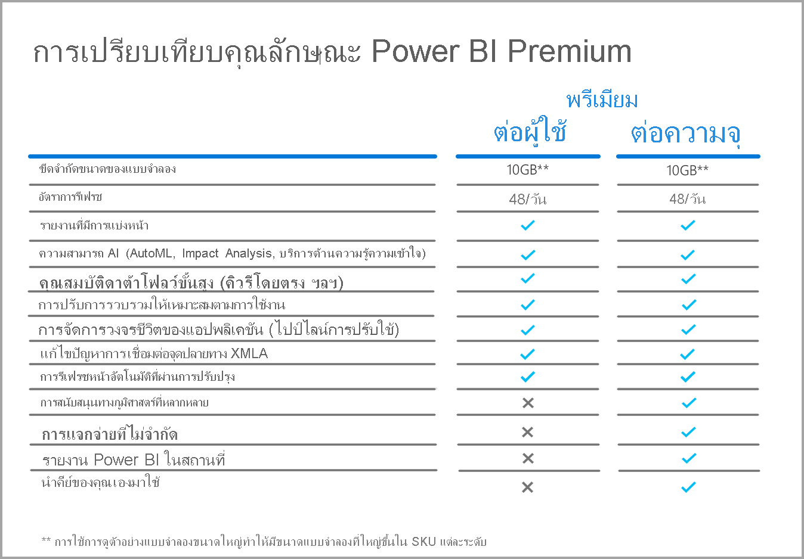

# คำถามที่พบบ่อยเกี่ยวกับ Power BI Premium Per User (ตัวอย่าง)Power BI Premium Per User FAQ (preview)

Power BI **Premium Per User** ช่วยให้องค์กรสามารถให้สิทธิการใช้งานคุณลักษณะพรีเมียมสำหรับผู้ใช้แต่ละรายPower BI **Premium Per User** allows organizations to license Premium features on a per-user basis. Premium Per User (PPU) มีความสามารถของสิทธิการใช้งาน Power BI Pro ทั้งหมดและยังเพิ่มคุณลักษณะต่าง ๆ เช่น รายงานที่มีการแบ่งหน้า AI และความสามารถอื่น ๆ ที่มีให้เฉพาะสมาชิก Premium เท่านั้นPremium Per User (PPU) includes all Power BI Pro license capabilities, and also adds features such as paginated reports, AI, and other capabilities that are only available to Premium subscribers. 

บทความนี้ให้คำตอบสำหรับคำถามทั่วไปเกี่ยวกับการให้สิทธิ์ใช้งาน Premium Per UserThis article provides answers to common questions about Premium Per User licensing. ข้อมูลทั้งหมดในบทความนี้อาจมีการเปลี่ยนแปลงและมีการปรับแต่งใหม่ เนื่องจาก Premium Per User เคลื่อนผ่านช่วงการแสดงตัวอย่างและเผยแพร่สำหรับความพร้อมใช้งานทั่วไป (GA)All information in this article is subject to change, and refinement, as Premium Per User moves through its preview period and is released for general availability (GA). 

บทความนี้จัดกลุ่มคำถามและคำตอบเป็นหมวดหมู่ต่อไปนี้:This article groups questions and answers into the following categories:
* คำถามทั่วไปGeneral questions 
* คำถามเกี่ยวกับการดูแลระบบAdministration questions 
* คำถามเกี่ยวกับประสบการณ์ของผู้ใช้ปลายทางEnd-user Experience questions 

## คำถามทั่วไปGeneral questions

1.  **Premium Per User (PPU) คืออะไร****What is Premium Per User (PPU)?** 

    Premium Per User (PPU) เป็นวิธีใหม่ในการให้สิทธิการใช้งานคุณลักษณะพรีเมียมสำหรับผู้ใช้แต่ละรายPremium Per User (PPU) is a new way to license premium features on a per user basis. ซึ่งรวมถึงความสามารถของสิทธิการใช้งาน Power BI Pro ทั้งหมด พร้อมด้วยคุณลักษณะ เช่น รายงานที่มีการแบ่งหน้า AI และความสามารถอื่น ๆ ที่มีเฉพาะใน Premium วันนี้It includes all Power BI Pro license capabilities, along with features like paginated reports, AI, and other capabilities only available in Premium today.

2.  **จะวางจำหน่ายเมื่อใด****When will it be available for purchase?**

    การพัฒนาเป็นไปอย่างต่อเนื่อง และเราคาดว่า PPU จะไม่สามารถเผยแพร่ไปยัง GA ได้จนถึงปี 2021Development is ongoing, and we do not anticipate PPU releasing to GA until 2021. การแสดงตัวอย่างแบบสาธารณะสามารถใช้ได้กับทุกองค์กรและไม่มีค่าใช้จ่ายจนกว่าจะพร้อมใช้งานทั่วไปUntil general availability, the public preview is available to all organizations and is free of charge.

3.  **ฉันจำเป็นต้องมีสิทธิการใช้งาน Power BI Pro และ Premium Per User หรือไม่****Do I need a Power BI Pro AND a Premium Per User license?**

    ไม่จำเป็น คุณจะได้รับความสามารถทั้งหมดของ Power BI Pro พร้อมสิทธิ์การใช้งาน Premium Per UserNo, you get all the capabilities of Power BI Pro with Premium Per User license.

4.  **ฉันจะทดลองใช้งานได้อย่างไร****How do I get a trial?**

    มีประสบการณ์ทดลองใช้งานในผลิตภัณฑ์และประสบการณ์ทดลองใช้งานผ่าน Microsoft 365There is an in-product trial experience and a trial experience available through Microsoft 365. ผู้ใช้ทุกคนสามารถเข้าถึงประสบการณ์การทดลองใช้งานในผลิตภัณฑ์ได้โดยเปิดใช้งาน Premium Per User สำหรับพื้นที่ทำงาน ทั้งนี้องค์กรของตนต้องไม่จำกัด PPU ด้วยAny user, assuming their organization has not restricted PPU, can access the in-product trial experience by turning on Premium Per User for a workspace. คุณสามารถเปิดใช้งานประสบการณ์การทดลองใช้งานผ่าน Microsoft 365 ผ่านทางพอร์ทัลได้เหมือนกับการทดลองใช้งาน Power BI Pro ในวันนี้Trial experiences through Microsoft 365 can be enabled through the portal just like Power BI Pro trials are initiated today.  

5.  **คุณลักษณะใดบ้างที่มีให้ใน Premium Per User****What features are available in Premium per user?**

    ตารางเปรียบเทียบคุณลักษณะเป็นดังต่อไปนี้:The feature comparison grid is as follows:    

    

6.  **องค์กรของฉันมี Power BI Premium อยู่แล้ว ตอนนี้ฉันจำเป็นต้องมีสิทธิการใช้งาน Premium Per User เพื่อเผยแพร่เนื้อหาไปยังความจุของฉันหรือไม่****My organization already has Power BI Premium. Do I now need a Premium Per User license to publish content to my capacity?**
    
    องค์กรของคุณอาจเลือกที่จะผนวกความจุ Premium เข้ากับสิทธิการใช้งาน Premium Per User แต่ Premium Per User ไม่จำเป็นต้องเผยแพร่เนื้อหาไปยังความจุที่มีอยู่Your organization may choose to supplement their Premium capacity with Premium Per User licenses, but Premium Per User is not required to publish content to existing capacities.  

## คำถามเกี่ยวกับการดูแลระบบAdministrative questions

1.  **ฉันจะเปิดใช้งาน Premium Per User (PPU) สำหรับผู้เช่าของฉันได้อย่างไร****How do I enable Premium Per User (PPU) for my tenant?**
    
    เมื่อมีการจัดเตรียมสิทธิการใช้งานสำหรับ PPU สำหรับผู้เช่าแล้ว คุณลักษณะ PPU จะพร้อมใช้งานในพื้นที่ทำงานใดก็ตามที่คุณเปิดใช้งานOnce a license is provisioned for PPU for the tenant, PPU features are available in any workspace for which you turn them on. สำหรับการแสดงตัวอย่าง เพียงแค่เปิดใช้งานคุณลักษณะ Premium Per User ในเมนูดรอปดาวน์ความจุโดยเลือกรายการ Premium Per User ตามที่แสดงในภาพต่อไปนี้For the preview, simply enable the Premium Per User features in the capacity dropdown by selecting the Premium per user item, as shown in the following image.

    

2.  **ทำงานได้เหมือนกับความจุแบบ Premium หรือไม่ คุณสามารถเปิด/ปิดใช้งานคุณลักษณะได้หรือไม่****Does this work like a Premium capacity? Can you turn features on/off?**

    ไม่ ไม่มีการจัดการหน่วยความจำหรือ CPU สำหรับ PPU เพียงแค่ทำงานได้เหมือนกับที่ Power BI Pro ทำได้ในวันนี้เท่านั้นNo, there is no management of memory or CPU for PPU; it works like Power BI Pro does today in that respect. ผู้ดูแลระบบผู้เช่าของคุณสามารถจัดการการตั้งค่าคุณลักษณะที่เลือกได้ แต่ไม่สามารถปิดใช้งานปริมาณงาน เช่น รายงานที่มีการแบ่งหน้าได้เช่นเดียวกับที่คุณไม่สามารถปิดแดชบอร์ดได้ในวันนี้Your tenant admin can manage select feature settings, but they can’t disable workloads like paginated reports, just like you can’t turn off dashboards today. 

3.  **ฉันจะจัดการการตั้งค่า Premium Per User ที่เปิดเผยได้ที่ไหน****Where do I manage the Premium per user settings that are exposed?**

    ตัวเลือกเมนูใหม่ในการตั้งค่าผู้เช่าสำหรับ Premium Per User ช่วยให้ผู้ดูแลระบบสามารถจัดการการตั้งค่าเหล่านั้นได้A new menu option in the tenant settings for Premium Per User enables admins to manage those settings.

4.  **ฉันสามารถจำกัดผู้ใช้ที่สามารถสร้างพื้นที่ทำงาน PPU ได้หรือไม่****Can I limit which users can create PPU workspaces?**

    ได้ ในแบบเดียวกันกับที่คุณสามารถจำกัดผู้ใช้ที่สามารถสร้างพื้นที่ทำงานได้Yes, in the same way you can currently limit which users can create workspaces.

5.  **ผู้ดูแลระบบผู้เช่าสามารถดูว่าพื้นที่ทำงานใดถูกทำเครื่องหมายเป็น Premium Per User ได้หรือไม่****Can tenant admins see which workspaces are marked as Premium Per User?**

    ได้ คุณสามารถเรียกใช้สิ่งเหล่านี้ได้ในรายการเมนูพื้นที่ทำงานบนหน้าจอผู้ดูแลระบบผู้เช่า ซึ่งจะแสดงให้คุณเห็นว่าพื้นที่ทำงานใดถูกทำเครื่องหมายเป็น PremiumYes, these are called out in the workspaces menu item in the tenant admin screen, where it shows you which workspaces are marked as Premium.

6.  **ฉันสามารถย้ายพื้นที่ทำงานระหว่าง Premium Per User และความจุ Premium ได้หรือไม่****Can I move workspaces between Premium Per User and Premium capacities?**

    ใช่Yes. สำหรับความพร้อมใช้งานทั่วไป (GA) คุณจะต้องทำการรีเฟรชชุดข้อมูลหรือกระแสข้อมูลทั้งหมดที่อยู่ในพื้นที่ทำงานเมื่อคุณย้ายกลับไปเป็นความจุแบบ PremiumFor General Availability (GA), you will be required to perform a full refresh of any datasets or dataflows that live in the workspace once you move it back to Premium capacity. ข้อกำหนดนี้ป้องกันการละเมิดโดยบริษัทที่ต้องการแก้ไขกลไกการชาร์จ CPU ของ Premium Gen2This requirement prevents abuse by companies looking to work around the CPU charging mechanism of Premium Gen2.

7.  **มี API ความจุสำหรับ Premium Per User หรือไม่****Are the capacity APIs available for Premium Per User?**

    มีชุด API ที่จำกัดเพื่อให้สามารถเคลื่อนย้ายพื้นที่ทำงานได้ แต่คุณไม่สามารถทำสิ่งต่าง ๆ เช่น ปิดปริมาณงานและกิจกรรมอื่น ๆ ดังกล่าวได้A limited set of the APIs are available to allow movement of workspaces, but you cannot do things like turn off workloads, and other such activities.  

## คำถามเกี่ยวกับประสบการณ์ของผู้ใช้ปลายทางEnd user experience questions

1.  **ถ้าฉันได้ทำเครื่องหมายพื้นที่ทำงานเป็น Premium Per User ผู้ใช้รายอื่นจะทราบได้อย่างไร****If I’ve marked a workspace as Premium Per User, how will other users know?**
    
    มีไอคอนใหม่เพิ่มเข้ามาเพื่อแสดงว่าพื้นที่ทำงานใดเป็น Premium Per User ดังที่แสดงในภาพต่อไปนี้:A new icon has been introduced to show which workspaces are Premium Per User, as shown in the following image:

        

2.  **ใครสามารถเข้าถึงเนื้อหาในพื้นที่ทำงาน/แอป Premium Per User ได้บ้าง****Who can access content in a Premium Per User workspace/app?**

    ผู้ใช้ทุกคนต้องมีสิทธิการใช้งาน Premium Per User เพื่อดูเนื้อหาในพื้นที่ทำงาน Premium Per UserAny user must have a Premium Per User license to view content in a Premium Per User workspace. ซึ่งรวมถึงสถานการณ์ที่ผู้ใช้กำลังเข้าถึงเนื้อหาผ่านจุดสิ้นสุด XMLA, วิเคราะห์ใน EXCEL, แบบจำลองแบบรวม และอื่น ๆThis includes scenarios where users are accessing the content through the XMLA endpoint, Analyze in Excel, Composite Models, and so on. คุณอาจให้สิทธิ์การเข้าถึงพื้นที่ทำงานแก่ผู้ใช้ที่ยังไม่มีสิทธิการใช้งาน PPU แต่พวกเขาจะได้รับข้อความแจ้งว่าไม่สามารถเข้าถึงเนื้อหาได้You may grant access to users to the workspace who don’t have a PPU license yet, but they will receive a message saying they can’t access the content. พวกเขาจะได้รับพร้อมท์แจ้งให้ใช้สิทธิการใช้งานแบบทดลองหากพวกเขามีคุณสมบัติเหมาะสมThey will be prompted for trial license if they are eligible. ถ้าพวกเขาไม่มีคุณสมบัติเหมาะสม พวกเขาจำเป็นต้องได้รับมอบหมายสิทธิการใช้งานจากผู้ดูแลระบบผู้เช่าของพวกเขาIf they aren’t eligible, they need to be assigned a license by their tenant admin.

3.  **เนื้อหาใดบ้างที่บุคคลที่มีสิทธิ์การใช้งานแต่ละประเภทสามารถมองเห็นได้เมื่อแชร์กับพวกเขา****What content can people with which license type see when it is shared with them?**

    แผนภูมิต่อไปนี้อธิบายว่าบุคคลที่มีสิทธิการใช้งาน PPU สามารถดูเนื้อหาประเภทใดได้บ้าง:The following chart describes who can see which kinds of content with PPU:

       

4.  **ฉันสามารถใช้ Premium Per User สำหรับกรณีการใช้งานแบบฝังตัวได้หรือไม่****Can I use Premium Per User for embedded use cases?**

    Premium Per User จะทำงานในลักษณะเดียวกับกรณีการใช้งานแบบฝังตัวเมื่อคุณใช้สิทธิการใช้งาน ProPremium Per User will work in the same way embedded use cases work when you use a Pro license. คุณสามารถฝังเนื้อหาได้และผู้ใช้แต่ละคนจะต้องมีสิทธิการใช้งาน PPU เพื่อดูเนื้อหานั้นYou can embed the content and each user will need a PPU license to view it.

5.  **จะเกิดอะไรขึ้นกับพื้นที่ทำงาน PPU ของฉันหากการทดลองใช้ของฉันหมดอายุลง****What happens to my PPU workspace if my trial expires?**

    ผู้ใช้จะยังคงสามารถเข้าถึงพื้นที่ทำงานได้ อย่างไรก็ตามคุณจะไม่สามารถใช้งานเนื้อหาที่ต้องใช้ประเภทสิทธิการใช้งานนั้นได้Users will still have access to the workspace, however, content that requires that license type will be unavailable. คุณจำเป็นต้องย้ายพื้นที่ทำงานไปยังความจุแบบ Premium หรือเพียงแค่ปิดข้อกำหนดYou either need to move the workspace to a Premium capacity, or simply the turn the requirement off. 
6.  **ฉันจะได้รับพื้นที่เก็บข้อมูลทั้งหมดเท่าใดเมื่อใช้ Premium Per User****How much total storage do I get with Premium Per User?**

    ผู้เช่าทั้งหมดจะมีขีดจำกัดพื้นที่เก็บข้อมูล 100 TB เท่ากันกับความจุแบบ Premium ในแง่ของพื้นที่เก็บข้อมูลThe entire tenant will have the same 100 TB limit that a Premium capacity has, in terms of storage.

7.  **API การส่งออกจะพร้อมใช้งานสำหรับ Premium Per User หรือไม่****Will the export API be available for Premium Per User?**

    ขณะนี้คุณสามารถใช้งานได้ในรายงานที่มีการแบ่งหน้า และจำกัด การเรียกเพียงครั้งเดียวทุก ๆ 5 นาทีThis is currently available for paginated reports, and is restricted to a single call once every 5 minutes.  ไม่รองรับรายงาน Power BI ในขณะนี้Power BI reports are not supported at this time.  

8.  **การสมัครรับข้อมูลผ่านอีเมลใน PPU จะเป็นอย่างไร****How will e-mail subscriptions work in PPU?**

    ทุกคนที่มีสิทธิการใช้งาน PPU หรือสิทธิการใช้งาน Pro สามารถรับการสมัครสมาชิกและไฟล์แนบใดก็ตามที่มีให้ หากไฟล์แนบนั้นเหมือนกันสำหรับผู้ใช้ทุกคนAnyone with a PPU license or a Pro license can receive the subscription and any attachment it includes, provided the attachment is the same for all users. ผู้ใช้ Pro จะไม่สามารถดูเนื้อหาในพอร์ทัลผลิตภัณฑ์ได้Pro users will not be able to view the content in the product portal. หากมีการนำความสามารถในการสมัครสมาชิกเพิ่มเติมที่อนุญาตให้มีมุมมองข้อมูลที่แตกต่างกันสำหรับผู้รับที่แตกต่างกันจะต้องมีสิทธิการใช้งาน PPU (หรือความจุแบบ Premium) เพื่อใช้ความสามารถเหล่านั้นIf additional subscription capabilities are introduced that allow for different data views for different recipients, a PPU license (or Premium capacity) will be required to use those capabilities.

9.  **ฉันสามารถรีเฟรชเกิน 48 ครั้งผ่านพอร์ทัลโดยใช้ API การรีเฟรชได้หรือไม่****Can I exceed the 48 refreshes through the portal through the refresh API?**

    ไม่จำกัดการรีเฟรชแบบนี้ในขณะนี้Refreshes are not restricted this at this time.  

10. **ฉันสามารถใช้แอปเมตริก Power BI Premium Capacity เพื่อตรวจสอบการใช้งาน Premium Per User ได้หรือไม่****Can I use the Power BI Premium Capacity metrics app to monitor Premium Per User usage?**

    แอปเมตริก Power BI Premium Capacity ใช้ไม่ได้กับ Premium Gen2 ดังนั้นจึงไม่อนุญาตให้คุณดูรายการ PPU ใดก็ตามThe Power BI Premium Capacity Metrics App doesn’t work with Premium Gen2, and therefore wouldn’t allow you to view any PPU items.  

11. **ฉันสามารถโฮสต์ชุดข้อมูล Power BI ไปยังพื้นที่ทำงาน PPU สร้างรายงานเทียบกับพื้นที่ทำงาน เผยแพร่ในพื้นที่ทำงานที่ไม่ใช่ PPU และอนุญาตให้ผู้ใช้เข้าถึงรายงานนี้โดยไม่ต้องมีสิทธิการใช้งาน PPU ได้หรือไม่****Can I host a Power BI dataset to a PPU workspace, build a report against it, publish in a non-PPU workspace, and allow users to access this report without needing a PPU license?**

    หมายเลขNo. เนื่องจากชุดข้อมูลอยู่ในพื้นที่ทำงานแบบ Premium Per User จึงไม่สามารถดูได้สำหรับผู้ใช้ที่ไม่มีสิทธิการใช้งาน แม้ว่าพวกเขาจะสามารถเข้าถึงรายงานในพื้นที่ทำงานที่ไม่ใช่ PPU ได้ก็ตามSince the dataset resides in a Premium Per User workspace, it will not be viewable for users without a license, even though they can access the report in the non-PPU workspace.

12. **ฉันสามารถรีเฟรชแบบจำลองข้อมูล 10 GB หลายแบบจำลองพร้อมกันได้หรือไม่****Can I refresh multiple 10 GB data models at the same time?**

    คุณอยู่ภายใต้ข้อจำกัดเดียวกันกับที่กำหนดไว้สำหรับการรีเฟรชแบบขนานใน Premium Gen2You are subject to the same limitations that are imposed for parallel refreshes in Premium Gen2.

13. **ฉันสามารถแบ่งปันเนื้อหาที่โฮสต์ใน Premium Per User ผ่านการเผยแพร่ไปยังเว็บได้หรือไม่****Can I share content hosted in Premium Per User via Publish to Web?**

    เผยแพร่ไปยังเว็บจะทำงานในลักษณะเดียวกับเนื้อหาที่โฮสต์ในความจุแบบ Premium ในปัจจุบันPublish to Web behaves in the same way it does with content hosted in Premium capacity today.

14. **ฉันสามารถให้กระแสข้อมูลทำงานในพื้นที่ทำงานแบบ Premium Per User ซึ่งได้มีการนำเข้าสู่ชุดข้อมูล Power BI ในพื้นที่ทำงานอื่น และผู้ใช้ที่ใช้เนื้อหานั้นไม่จำเป็นต้องมีสิทธิการใช้งาน Premium Per User ได้หรือไม่****Can I have a dataflow run in a Premium per user workspace, be imported into a Power BI dataset in another workspace, and users who consume that content not need a Premium per user license?**

    ตราบใดที่ผู้เขียนรายงาน Power BI มีสิทธิการใช้งาน Premium Per User สิ่งนี้จะเป็นไปได้ในช่วงระยะเวลาการแสดงตัวอย่างสำหรับ PPUAs long as the Power BI report author has a Premium Per User license, this is possible during the preview period for PPU.

15. **ฉันสามารถใช้แอป Power BI สำหรับอุปกรณ์เคลื่อนที่กับ Premium Per User ได้หรือไม่****Can I use the Power BI mobile apps with Premium per user?**

    ได้ แอป Power BI สำหรับอุปกรณ์เคลื่อนที่ได้รับการอัปเดตเพื่อทำงานกับเนื้อหาใดก็ตามที่เผยแพร่ไปยังแอปหรือพื้นที่ทำงานแบบ Premium Per UserYes, the Power BI mobile apps have been updated to work with any content published to a Premium per user app or workspace.

**ขั้นตอนถัดไป****Next steps**

* [Power BI Premium คืออะไร?What is Power BI Premium?](service-premium-what-is.md)
* [เอกสารทางเทคนิคเรื่อง Microsoft Power BI PremiumMicrosoft Power BI Premium whitepaper](https://aka.ms/pbipremiumwhitepaper)
* [เอกสารทางเทคนิคเรื่องการวางแผนการใช้ Power BI สำหรับองค์กรPlanning a Power BI Enterprise Deployment whitepaper](https://aka.ms/pbienterprisedeploy)
* [เปิดใช้งานเวอร์ชันทดลองใช้ Extended Pro Extended Pro Trial activation](../fundamentals/service-self-service-signup-for-power-bi.md)
* [คำถามที่พบบ่อยสำหรับ Power BI EmbeddedPower BI Embedded FAQ](../developer/embedded/embedded-faq.md)

มีคำถามเพิ่มเติมหรือไม่More questions? [ลองถามชุมชน Power BITry asking the Power BI Community](https://community.powerbi.com/)
