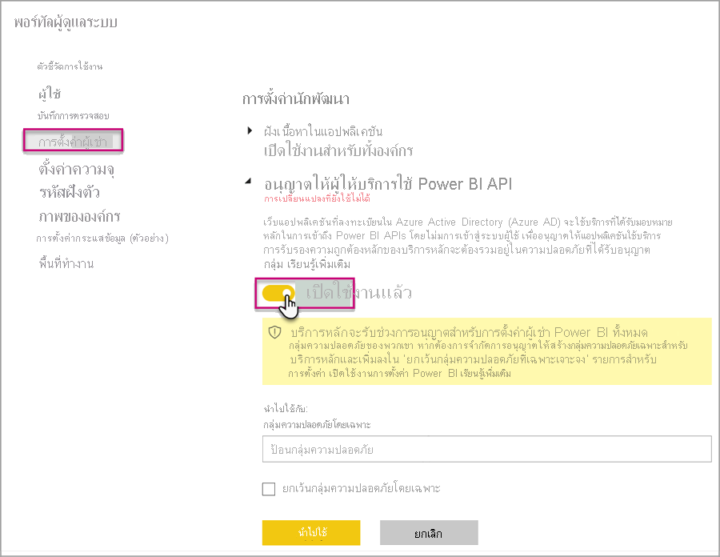
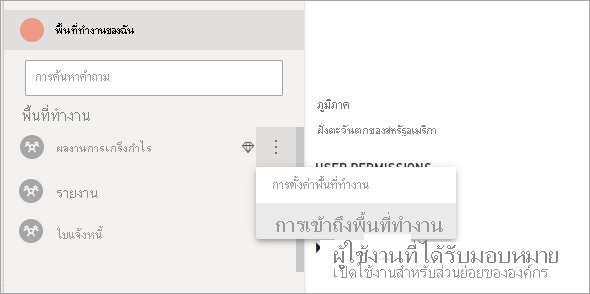

# <a name="automate-premium-workspace-and-dataset-tasks-with-service-principals"></a><span data-ttu-id="4f8b7-103">ทำให้พื้นที่ทำงาน Premium และงานชุดข้อมูลเป็นแบบอัตโนมัติิด้วยบริการหลัก</span><span class="sxs-lookup"><span data-stu-id="4f8b7-103">Automate Premium workspace and dataset tasks with service principals</span></span>

<span data-ttu-id="4f8b7-104">บริการหลักคือ *การลงทะเบียนแอป* Azure Active Directory ที่คุณสร้างภายในผู้เช่าของคุณเพื่อใช้ทรัพยากรที่ไม่ได้ใส่ใจและการดำเนินการระดับบริการ</span><span class="sxs-lookup"><span data-stu-id="4f8b7-104">Service principals are an Azure Active Directory *app registration* you create within your tenant to perform unattended resource and service level operations.</span></span> <span data-ttu-id="4f8b7-105">ซึ่งเป็นประเภทข้อมูลประจำตัวของผู้ใช้ที่ไม่ซ้ำกันที่มีชื่อแอป ID แอปพลิเคชัน ID ผู้เช่าและ *ข้อมูลลับของไคลเอ็นต์* หรือใบรับรองสำหรับรหัสผ่าน</span><span class="sxs-lookup"><span data-stu-id="4f8b7-105">They're a unique type of user identity with an app name, application ID, tenant ID, and *client secret* or certificate for a password.</span></span>

<span data-ttu-id="4f8b7-106">Power BI Premium ใช้ฟังก์ชันการทำงานของบริการหลักเหมือนกับ Power BI Embedded</span><span class="sxs-lookup"><span data-stu-id="4f8b7-106">Power BI Premium uses the same service principal functionality as Power BI Embedded.</span></span> <span data-ttu-id="4f8b7-107">สำหรับข้อมูลเพิ่มเติม โปรดดู [การฝังเนื้อหา Power BI ด้วยบริการหลัก](../developer/embedded/embed-service-principal.md)</span><span class="sxs-lookup"><span data-stu-id="4f8b7-107">To learn more, see [Embedding Power BI content with service principals](../developer/embedded/embed-service-principal.md).</span></span>

<span data-ttu-id="4f8b7-108">ใน **Power BI Premium** ยังคงสามารถใช้บริการหลักได้กับ [ตำแหน่งข้อมูล XMLA](service-premium-connect-tools.md) เพื่อทำให้งานการจัดการชุดข้อมูลเป็นแบบอัตโนมัติ เช่น พื้นที่ทำงานสำหรับจัดเตรียม การปรับใช้แบบจำลอง และการรีเฟรชชุดข้อมูลด้วย:</span><span class="sxs-lookup"><span data-stu-id="4f8b7-108">In **Power BI Premium**, service principals can also be used with the [XMLA endpoint](service-premium-connect-tools.md) to automate dataset management tasks such as provisioning workspaces, deploying models, and dataset refresh with:</span></span>

- <span data-ttu-id="4f8b7-109">PowerShell</span><span class="sxs-lookup"><span data-stu-id="4f8b7-109">PowerShell</span></span>
- <span data-ttu-id="4f8b7-110">Azure Automation</span><span class="sxs-lookup"><span data-stu-id="4f8b7-110">Azure Automation</span></span>
- <span data-ttu-id="4f8b7-111">Azure Logic Apps</span><span class="sxs-lookup"><span data-stu-id="4f8b7-111">Azure Logic Apps</span></span>
- <span data-ttu-id="4f8b7-112">แอปพลิเคชันไคลเอ็นต์แบบกำหนดเอง</span><span class="sxs-lookup"><span data-stu-id="4f8b7-112">Custom client applications</span></span>

<span data-ttu-id="4f8b7-113">เฉพาะ [พื้นที่ทำงานใหม่](../collaborate-share/service-new-workspaces.md) เท่านั้นที่สนับสนุนการเชื่อมต่อตำแหน่งข้อมูลของ XMLA โดยใช้บริการหลัก</span><span class="sxs-lookup"><span data-stu-id="4f8b7-113">Only [New workspaces](../collaborate-share/service-new-workspaces.md) support XMLA endpoint connections using service principals.</span></span> <span data-ttu-id="4f8b7-114">ไม่รองรับพื้นที่ทำงานแบบคลาสสิก</span><span class="sxs-lookup"><span data-stu-id="4f8b7-114">Classic workspaces aren't supported.</span></span> <span data-ttu-id="4f8b7-115">บริการหลักมีเฉพาะสิทธิ์ที่จำเป็นในการดำเนินงานสำหรับพื้นที่ทำงานที่ได้รับมอบหมาย</span><span class="sxs-lookup"><span data-stu-id="4f8b7-115">A service principal has only those permissions necessary to perform tasks for workspaces that it is assigned.</span></span> <span data-ttu-id="4f8b7-116">สิทธิ์จะได้รับมอบหมายผ่านทางการเข้าถึงพื้นที่ทำงาน ซึ่งคล้ายกันกับบัญชี UPN ทั่วไปมาก</span><span class="sxs-lookup"><span data-stu-id="4f8b7-116">Permissions are assigned through workspace Access, much like regular UPN accounts.</span></span>

<span data-ttu-id="4f8b7-117">ในการดำเนินการเขียนการปฏิบัติการ **ภาระงานชุดข้อมูล** ของความจุจะต้องมี [ตำแหน่งข้อมูล XMLA ที่เปิดใช้งานสำหรับอ่าน-เขียน](service-premium-connect-tools.md#enable-xmla-read-write)</span><span class="sxs-lookup"><span data-stu-id="4f8b7-117">To perform write operations, the capacity's **Datasets workload** must have the [XMLA endpoint enabled for read-write](service-premium-connect-tools.md#enable-xmla-read-write).</span></span> <span data-ttu-id="4f8b7-118">ชุดข้อมูลที่เผยแพร่จาก Power BI Desktop ควรมีการเปิดใช้งานคุณลักษณะการ [รูปแบบเมตาดาต้าขั้นสูง](../connect-data/desktop-enhanced-dataset-metadata.md)</span><span class="sxs-lookup"><span data-stu-id="4f8b7-118">Datasets published from Power BI Desktop should have the [Enhanced metadata format](../connect-data/desktop-enhanced-dataset-metadata.md) feature enabled.</span></span>

## <a name="create-a-service-principal"></a><span data-ttu-id="4f8b7-119">สร้างบริการหลัก</span><span class="sxs-lookup"><span data-stu-id="4f8b7-119">Create a service principal</span></span>

<span data-ttu-id="4f8b7-120">บริการหลักจะสร้างขึ้นในขณะที่ลงทะเบียนแอปในพอร์ทัล Azure หรือโดยการใช้ PowerShell</span><span class="sxs-lookup"><span data-stu-id="4f8b7-120">Service principals are created as an app registration in the Azure portal or by using PowerShell.</span></span> <span data-ttu-id="4f8b7-121">เมื่อสร้างบริการหลักของคุณ ตรวจสอบให้แน่ใจว่าได้คัดลอกและบันทึกชื่อแอป ID แอปพลิเคชัน (ไคลเอนต์) ID ไดเรกทอรี (ผู้เช่า) และข้อมูลลับของไคลเอนต์แยกไว้ต่างหาก</span><span class="sxs-lookup"><span data-stu-id="4f8b7-121">When creating your service principal, be sure to copy and save separately the app name, Application (client) ID, Directory (tenant) ID, and client secret.</span></span> <span data-ttu-id="4f8b7-122">สำหรับขั้นตอนเกี่ยวกับวิธีการสร้างบริการหลัก โปรดดู:</span><span class="sxs-lookup"><span data-stu-id="4f8b7-122">For steps on how to create a service principal, see:</span></span>

<span data-ttu-id="4f8b7-123">[สร้างบริการหลัก - พอร์ทัล Azure](/azure/active-directory/develop/howto-create-service-principal-portal) </span><span class="sxs-lookup"><span data-stu-id="4f8b7-123">[Create service principal - Azure portal](/azure/active-directory/develop/howto-create-service-principal-portal) </span></span>  
[<span data-ttu-id="4f8b7-124">สร้างบริการหลัก - PowerShell</span><span class="sxs-lookup"><span data-stu-id="4f8b7-124">Create service principal - PowerShell</span></span>](/azure/active-directory/develop/howto-authenticate-service-principal-powershell)

## <a name="create-an-azure-ad-security-group"></a><span data-ttu-id="4f8b7-125">สร้างกลุ่มความปลอดภัย Azure AD</span><span class="sxs-lookup"><span data-stu-id="4f8b7-125">Create an Azure AD security group</span></span>

<span data-ttu-id="4f8b7-126">ตามค่าเริ่มต้น บริการหลักมีสิทธิ์เข้าถึงการตั้งค่าผู้เช่าใดๆ ที่เปิดใช้งานอยู่</span><span class="sxs-lookup"><span data-stu-id="4f8b7-126">By default, service principals have access to any tenant settings they're enabled for.</span></span> <span data-ttu-id="4f8b7-127">โดยการเข้าถึงสามารถรวมถึงกลุ่มความปลอดภัยเฉพาะหรือทั้งองค์กร ขึ้นอยู่กับการตั้งค่าผู้ดูแลระบบของคุณ</span><span class="sxs-lookup"><span data-stu-id="4f8b7-127">Depending on your admin settings, access can include specific security groups or the entire organization.</span></span>

<span data-ttu-id="4f8b7-128">เพื่อจำกัดการเข้าถึงบริการหลักของการตั้งค่าผู้เช่าเฉพาะ คุณสามารถอนุญาตให้เข้าถึงกลุ่มความปลอดภัยเฉพาะ</span><span class="sxs-lookup"><span data-stu-id="4f8b7-128">To restrict service principal access to specific tenant settings, you can allow access to specific security groups.</span></span> <span data-ttu-id="4f8b7-129">อีกวิธีหนึ่งคือคุณสามารถสร้างกลุ่มความปลอดภัยเฉพาะสำหรับบริการหลัก และแยกออกไปจากการตั้งค่าผู้เช่าที่ต้องการได้</span><span class="sxs-lookup"><span data-stu-id="4f8b7-129">Alternatively, you can create a dedicated security group for service principals, and exclude it from the desired tenant settings.</span></span> <span data-ttu-id="4f8b7-130">สำหรับขั้นตอนเกี่ยวกับวิธีการสร้างกลุ่มความปลอดภัยและเพิ่มบริการหลัก โปรดดู [สร้างกลุ่มพื้นฐานและเพิ่มสมาชิกโดยใช้ Azure Active Directory](/azure/active-directory/fundamentals/active-directory-groups-create-azure-portal)</span><span class="sxs-lookup"><span data-stu-id="4f8b7-130">For steps on how to create a security group and add a service principal, see [Create a basic group and add members using Azure Active Directory](/azure/active-directory/fundamentals/active-directory-groups-create-azure-portal).</span></span>

## <a name="enable-service-principals"></a><span data-ttu-id="4f8b7-131">เปิดใช้งานบริการหลัก</span><span class="sxs-lookup"><span data-stu-id="4f8b7-131">Enable service principals</span></span>

<span data-ttu-id="4f8b7-132">ก่อนที่จะใช้งานบริการหลักใน Power BI ผู้ดูแลระบบต้องเปิดใช้งานการเข้าถึงบริการหลักในพอร์ทัลผู้ดูแลระบบ Power BI ก่อน</span><span class="sxs-lookup"><span data-stu-id="4f8b7-132">Before using service principals in Power BI, an admin must first enable service principal access in the Power BI admin portal.</span></span>

<span data-ttu-id="4f8b7-133">ใน **พอร์ทัลผู้ดูแลระบบ** Power BI > **การตั้งค่าผู้เช่า ให้ขยาย** อนุญาตบริการหลักให้ใช้ **Power BI API** จากนั้นคลิก **เปิดใช้งาน**</span><span class="sxs-lookup"><span data-stu-id="4f8b7-133">In the Power BI **Admin portal** > **Tenant settings**, expand **Allow service principals to use Power BI APIs**, and then click **Enabled**.</span></span> <span data-ttu-id="4f8b7-134">เมื่อต้องการนำสิทธิ์ไปใช้กับกลุ่มความปลอดภัย ให้เพิ่มชื่อกลุ่มลงใน **กลุ่มความปลอดภัยเฉพาะ**</span><span class="sxs-lookup"><span data-stu-id="4f8b7-134">To apply permissions to a security group, add the group name to **Specific security groups**.</span></span>



## <a name="workspace-access"></a><span data-ttu-id="4f8b7-136">การเข้าถึงพื้นที่ทำงาน</span><span class="sxs-lookup"><span data-stu-id="4f8b7-136">Workspace access</span></span>

<span data-ttu-id="4f8b7-137">เพื่อให้บริการหลักของคุณมีสิทธิ์ที่จำเป็นในการดำเนินการในพื้นที่ทำงาน Premium และการดำเนินการชุดข้อมูล คุณต้องเพิ่มบริการหลักเป็นสมาชิกพื้นที่ทำงานหรือผู้ดูแลระบบ ใช้การเข้าถึงพื้นที่ทำงานในบริการ Power BI ตามรายละเอียดในที่นี้ แต่นอกจากนี้คุณยังสามารถใช้ [เพิ่มผู้ใช้กลุ่ม REST API](/rest/api/power-bi/groups/addgroupuser) ได้เช่นกัน</span><span class="sxs-lookup"><span data-stu-id="4f8b7-137">In order for your service principal to have the necessary permissions to perform Premium workspace and dataset operations, you must add the service principal as a workspace Member or Admin. Using Workspace access in the Power BI service is described here, but you can also use the [Add Group User REST API](/rest/api/power-bi/groups/addgroupuser).</span></span>

1. <span data-ttu-id="4f8b7-138">ในบริการ Power BI สำหรับพื้้นที่ทำงาน ให้เลือก **เพิ่มเติม** > **การเข้าถึงพื้นที่ทำงาน**</span><span class="sxs-lookup"><span data-stu-id="4f8b7-138">In the Power BI service, for a workspace, select **More** > **Workspace access**.</span></span>

    

2. <span data-ttu-id="4f8b7-140">ค้นหาตามชื่อแอปพลิเคชัน เพิ่มบริการหลักเป็น **ผู้ดูแลระบบ** หรือ **สมาชิก** ในพื้นที่ทำงาน</span><span class="sxs-lookup"><span data-stu-id="4f8b7-140">Search by application name, Add the service principal as an **Admin** or **Member** to the workspace.</span></span>

    

## <a name="connection-strings-for-the-xmla-endpoint"></a><span data-ttu-id="4f8b7-142">สตริงการเชื่อมต่อสำหรับตำแหน่งข้อมูล XMLA</span><span class="sxs-lookup"><span data-stu-id="4f8b7-142">Connection strings for the XMLA endpoint</span></span>

<span data-ttu-id="4f8b7-143">เมื่อคุณสร้างบริการหลักแล้ว ให้เปิดใช้งานบริการหลักสำหรับผู้เช่าของคุณ และเพิ่มบริการหลักให้กับการเข้าถึงพื้นที่ทำงาน คุณสามารถใช้เป็นข้อมูลประจำตัวของผู้ใช้ในสตริงการเชื่อมต่อกับตำแหน่งข้อมูล XMLA</span><span class="sxs-lookup"><span data-stu-id="4f8b7-143">Once you've created a service principal, enabled service principals for your tenant, and added the service principal to Workspace access, you can use it as a user identity in connection strings with the XMLA endpoint.</span></span> <span data-ttu-id="4f8b7-144">ความแตกต่างคือพารามิเตอร์ ID ผู้ใช้และรหัสผ่านที่คุณระบุ ID แอปพลิเคชัน ID ผู้เช่า และข้อมูลลับแอปพลิเคชัน</span><span class="sxs-lookup"><span data-stu-id="4f8b7-144">The difference is for the User ID and Password parameters you specify the application ID, tenant ID, and application secret.</span></span>

`Data Source=powerbi://api.powerbi.com/v1.0/myorg/<workspace name>; Initial Catalog=<dataset name>;User ID=app:<appId>@<tenantId>;Password=<app_secret>;`

### <a name="powershell"></a><span data-ttu-id="4f8b7-145">PowerShell</span><span class="sxs-lookup"><span data-stu-id="4f8b7-145">PowerShell</span></span>

#### <a name="using-sqlserver-module"></a><span data-ttu-id="4f8b7-146">การใช้โมดูล SQLServer</span><span class="sxs-lookup"><span data-stu-id="4f8b7-146">Using SQLServer module</span></span>

<span data-ttu-id="4f8b7-147">ในตัวอย่างต่อไปนี้ จะใช้ AppId, TenantId และ AppSecret เพื่อรับรองความถูกต้องของการดำเนินการรีเฟรชชุดข้อมูล:</span><span class="sxs-lookup"><span data-stu-id="4f8b7-147">In the following example, AppId, TenantId, and AppSecret are used to authenticate a dataset refresh operation:</span></span>

```powershell
Param (
        [Parameter(Mandatory=$true)] [String] $AppId,
        [Parameter(Mandatory=$true)] [String] $TenantId,
        [Parameter(Mandatory=$true)] [String] $AppSecret
       )
$PWord = ConvertTo-SecureString -String $AppSecret -AsPlainText -Force

$Credential = New-Object -TypeName "System.Management.Automation.PSCredential" -ArgumentList $AppId, $PWord

Invoke-ProcessTable -Server "powerbi://api.powerbi.com/v1.0/myorg/myworkspace" -TableName "mytable" -DatabaseName "mydataset" -RefreshType "Full" -ServicePrincipal -ApplicationId $AppId -TenantId $TenantId -Credential $Credential
```

### <a name="amo-and-adomd"></a><span data-ttu-id="4f8b7-148">AMO และ ADOMD</span><span class="sxs-lookup"><span data-stu-id="4f8b7-148">AMO and ADOMD</span></span>

<span data-ttu-id="4f8b7-149">เมื่อเชื่อมต่อกับแอปพลิเคชันไคลเอ็นต์และเว็บแอป [ไลบรารีไคลเอ็นต์ AMO และ ADOMD](/azure/analysis-services/analysis-services-data-providers) รุ่น 15.1.42.26 (มิถุนายน 2020) และแพคเกจการติดตั้งที่สูงกว่าจาก NuGet จะรองรับบริการหลักในสตริงการเชื่อมต่อที่ใช้ไวยากรณ์ต่อไปนี้: `app:AppID` และรหัสผ่านหรือ `cert:thumbprint`</span><span class="sxs-lookup"><span data-stu-id="4f8b7-149">When connecting with client applications and web apps, [AMO and ADOMD client libraries](/azure/analysis-services/analysis-services-data-providers) version 15.1.42.26 (June 2020) and higher installable packages from NuGet support service principals in connection strings using the following syntax: `app:AppID` and password or `cert:thumbprint`.</span></span>

<span data-ttu-id="4f8b7-150">ในตัวอย่างต่อไปนี้ จะใช้ `appID` และ `password` เพื่อดำเนินการรีเฟรชชุดข้อมูลโมเดล</span><span class="sxs-lookup"><span data-stu-id="4f8b7-150">In the following example, `appID` and a `password` are used to perform a model database refresh operation:</span></span>

```csharp
string appId = "xxx";
string authKey = "yyy";
string connString = $"Provider=MSOLAP;Data source=powerbi://api.powerbi.com/v1.0/<tenant>/<workspacename>;Initial catalog=<datasetname>;User ID=app:{appId};Password={authKey};";
Server server = new Server();
server.Connect(connString);
Database db = server.Databases.FindByName("adventureworks");
Table tbl = db.Model.Tables.Find("DimDate");
tbl.RequestRefresh(RefreshType.Full);
db.Model.SaveChanges();
```

## <a name="next-steps"></a><span data-ttu-id="4f8b7-151">ขั้นตอนถัดไป</span><span class="sxs-lookup"><span data-stu-id="4f8b7-151">Next steps</span></span>

[<span data-ttu-id="4f8b7-152">การเชื่อมต่อชุดข้อมูลกับตำแหน่งข้อมูล XMLA</span><span class="sxs-lookup"><span data-stu-id="4f8b7-152">Dataset connectivity with the XMLA endpoint</span></span>](service-premium-connect-tools.md)  
[<span data-ttu-id="4f8b7-153">Azure Automation</span><span class="sxs-lookup"><span data-stu-id="4f8b7-153">Azure Automation</span></span>](/azure/automation)  
[<span data-ttu-id="4f8b7-154">Azure Logic Apps</span><span class="sxs-lookup"><span data-stu-id="4f8b7-154">Azure Logic Apps</span></span>](/azure/logic-apps/)  
[<span data-ttu-id="4f8b7-155">Power BI REST APIs</span><span class="sxs-lookup"><span data-stu-id="4f8b7-155">Power BI REST APIs</span></span>](/rest/api/power-bi/)