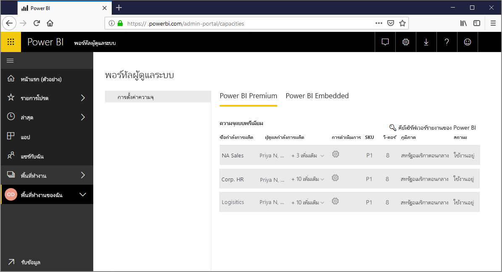
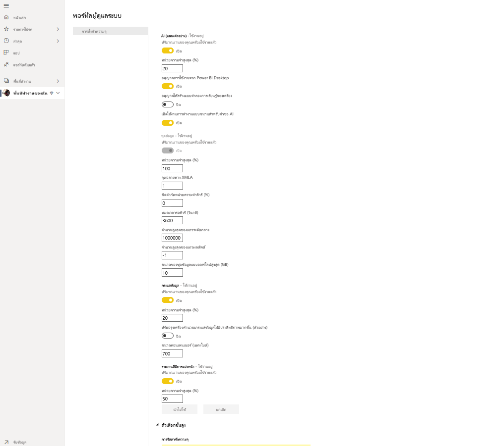
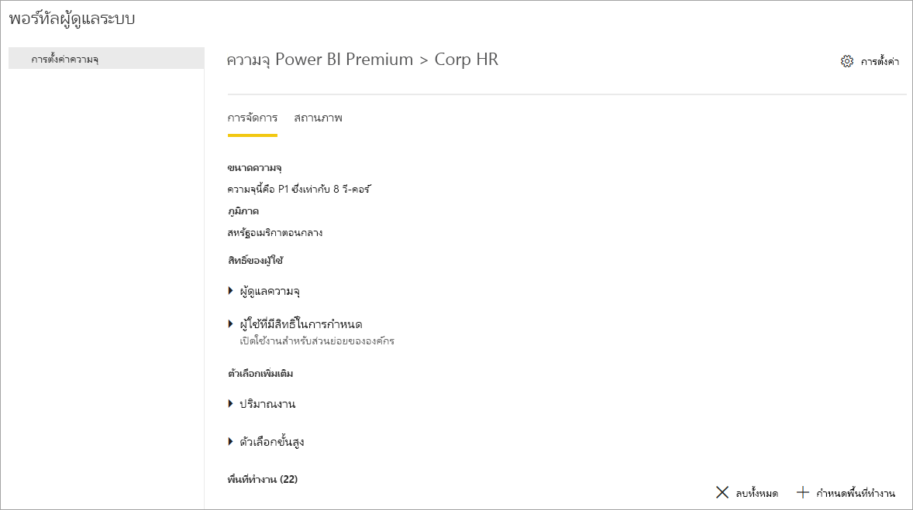
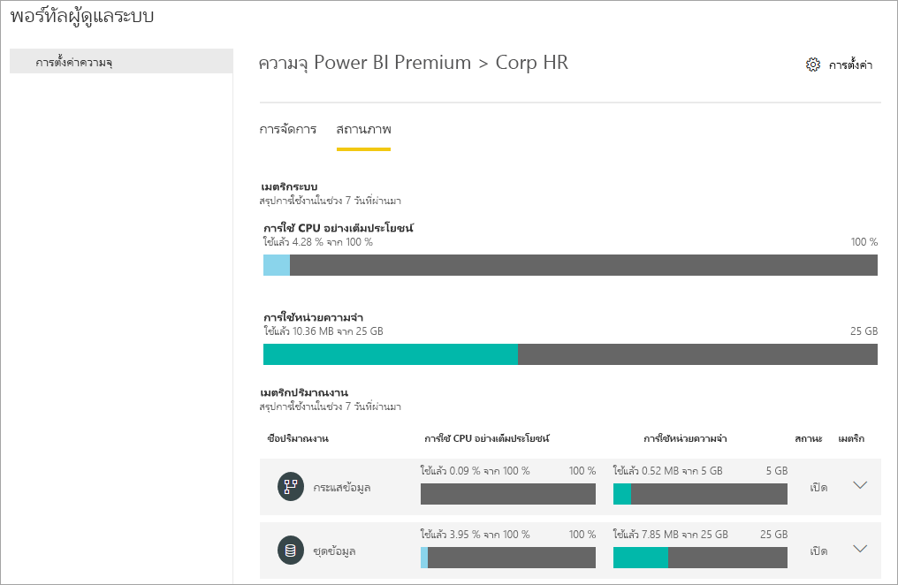
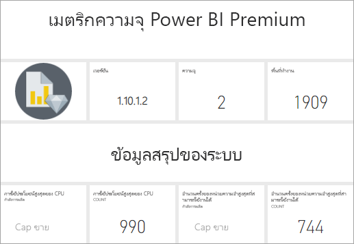
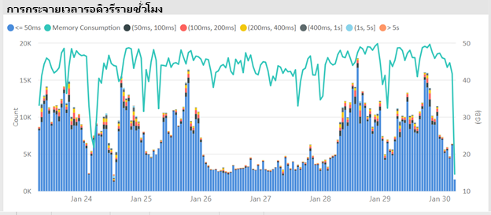
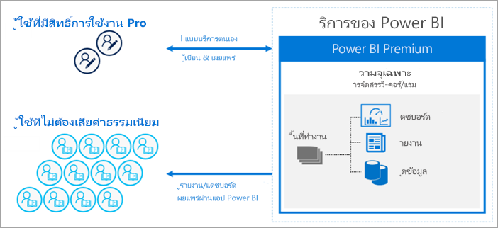
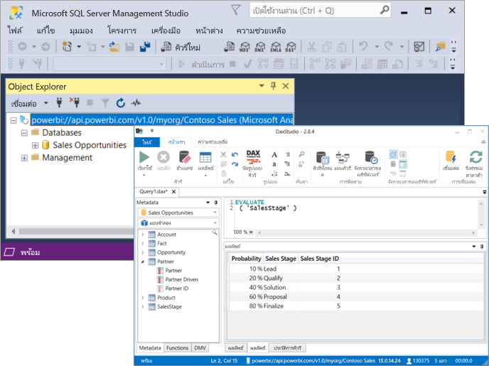

# Power BI Premium คืออะไร?What is Power BI Premium?

คุณสามารถใช้ Power BI Premium เพื่อเข้าถึงคุณลักษณะและความสามารถที่มีเฉพาะใน Premium และนำเสนอขนาดและประสิทธิภาพที่ดีขึ้นสำหรับเนื้อหา Power BI ในองค์กรของคุณYou can use Power BI Premium to access features and capabilities only available in Premium, and offer greater scale and performance for Power BI content in your organization. Power BI Premium ช่วยให้ผู้ใช้ในองค์กรของคุณได้รับประโยชน์สูงสุดจาก Power BI ด้วยประสิทธิภาพและการตอบสนองที่ดีขึ้นPower BI Premium enables more users in your organization to get the most out of Power BI with better performance and responsiveness. ตัวอย่างเช่นด้วย Power BI Premium คุณและผู้ใช้ในองค์กรของคุณจะได้รับความสามารถดังต่อไปนี้:For example, with Power BI Premium, you and your organization's users get the following capabilities:

> [!div class="checklist"]
> * ขนาดและประสิทธิภาพที่ดีขึ้นสำหรับรายงาน Power BI ของคุณGreater scale and performance for your Power BI reports
> * ความยืดหยุ่นในสิทธิการใช้งานตามความจุFlexibility to license by capacity
> * คุณลักษณะที่ดีที่สุดเมื่อเทียบกับระดับเดียวกันสำหรับการแสดงผลข้อมูลด้วยภาพและการแยกข้อมูลเชิงลึก เช่น การวิเคราะห์ที่ขับเคลื่อนด้วย AI กระแสข้อมูลที่แยกเป็นส่วนประกอบและนำกลับมาใช้ใหม่ได้ และรายงานที่มีการแบ่งหน้าBest-in-class features for data visualization and insight-extraction such as AI-driven analysis, composable and reusable dataflows, and paginated reports
> * รวมบริการด้วยตนเองและ BI ขององค์กรเข้าด้วยกันพร้อมความสามารถที่มีในแบบ Premium เท่านั้นที่รองรับปริมาณงานที่หนักกว่าและต้องการขนาดระดับองค์กรUnify self-service and enterprise BI with a variety of Premium-only capabilities that support heavier workloads and require enterprise scale
> * สิทธิการใช้งานในตัวเพื่อขยาย BI ในองค์กรด้วยเซิร์ฟเวอร์รายงาน Power BIBuilt-in license to extend on-premises BI with Power BI Report Server
> * การสนับสนุนสำหรับการเก็บข้อมูลตามภูมิภาค (Multi-Geo) และคีย์การเข้ารหัสลับที่จัดการโดยลูกค้าสำหรับข้อมูลที่พักอยู่ (BYOK)Support for data residency by region (Multi-Geo) and customer-managed encryption keys for data at rest (BYOK)
> * ความสามารถในการแชร์เนื้อหา Power BI กับทุกคน (แม้แต่นอกองค์กรของคุณ) โดยไม่ต้องซื้อสิทธิการใช้งานต่อผู้ใช้Ability to share Power BI content with anyone (even outside your organization) without purchasing a per-user license

 

บทความนี้แนะนำคุณสมบัติที่สำคัญใน Power BI PremiumThis article introduces key features in Power BI Premium. กรณีจำเป็น ให้ลิงก์ไปยังบทความเพิ่มเติมที่มีรายละเอียดมากกว่าWhere necessary, links to additional articles with more detailed information are provided. สำหรับข้อมูลเพิ่มเติมเกี่ยวกับ Power BI Pro และ Power BI Premium ให้ดูส่วนการเปรียบเทียบคุณลักษณะ _Power BI_ ของ [ราคา Power BI](https://powerbi.microsoft.com/pricing/)For more information about Power BI Pro and Power BI Premium, see the _Power BI features comparison_ section of [Power BI pricing](https://powerbi.microsoft.com/pricing/).

## Power BI Premium Generation 2 (ตัวอย่าง)Power BI Premium Generation 2 (preview)

Power BI Premium เพิ่งเปิดตัว Power BI Premium เวอร์ชันใหม่ **Power BI Premium Generation 2** ซึ่งหมายถึง **Premium Gen2** เพื่อให้สามารถเรียกได้อย่างสะดวกสบายPower BI Premium recently released a new version of Power BI Premium, **Power BI Premium Generation 2**, referred to as **Premium Gen2** for convenience. ขณะนี้ Premium Gen2 กำลังอยู่ในช่วงการแสดงตัวอย่าง และพร้อมให้สมาชิก Premium ใช้งานได้ในช่วงการแสดงตัวอย่างPremium Gen2 is currently in preview, and is available for Premium subscribers to use during the preview period. คุณสามารถเลือกใช้ Premium เวอร์ชันดั้งเดิมหรือเปลี่ยนไปใช้ Premium Gen2 ได้You can select to use the original version of Premium, or switch to using Premium Gen2. คุณสามารถใช้ได้เพียงอย่างใดอย่างหนึ่งสำหรับความจุ Premium ของคุณYou can only use one or the other for your Premium capacity.

Premium Gen2 มีการอัปเดตหรือประสบการณ์ที่ดีขึ้นดังต่อไปนี้:Premium Gen2 provides the following updates or improved experiences:

* ความสามารถในการอนุญาตให้ใช้สิทธิ์ **Premium Per User** เพิ่มเติมนอกเหนือจากความจุAbility to license **Premium Per User** in addition to by capacity.

* **ประสิทธิภาพ** ที่ดีขึ้นสำหรับขนาดความจุใดก็ตามตลอดเวลา: การดำเนินการวิเคราะห์ทำงานได้เร็วขึ้นสูงสุด 16 เท่าบน Premium Gen2Enhanced **performance** on any capacity size, anytime: Analytics operations run up to 16X faster on Premium Gen2. การดำเนินการจะดำเนินการที่ความเร็วสูงสุดเสมอและจะไม่ช้าลงเมื่อโหลดบนความจุเข้าใกล้ขีดจำกัดของความจุOperations will always perform at top speed and won't slow down when the load on the capacity approaches the capacity limits.

* **ขนาดใหญ่ขึ้น**:**Greater scale**:
    * *ไม่มีขีดจำกัด* สำหรับการรีเฟรชพร้อมกัน ไม่จำเป็นต้องให้คุณติดตามกำหนดการสำหรับชุดข้อมูลที่มีการรีเฟรชในความจุของคุณอีกต่อไป*No limits* on refresh concurrency, no longer requiring you to track schedules for datasets being refreshed on your capacity
    * ขีดจำกัดหน่วยความจำน้อยลงFewer memory restrictions
    * การแยกอย่างสมบูรณ์ระหว่างการโต้ตอบรายงานและการรีเฟรชตามกำหนดการComplete separation between report interaction and scheduled refreshes

* **เมตริกที่ดีขึ้น** พร้อมข้อมูลการใช้งานความจุที่ชัดเจนและเป็นมาตรฐาน ซึ่งขึ้นอยู่กับความซับซ้อนของการดำเนินการวิเคราะห์ที่ความจุดำเนินการเท่านั้น และไม่ใช่ตามขนาด ระดับโหลดในระบบขณะทำการวิเคราะห์หรือปัจจัยอื่น ๆ**Improved metrics** with clear and normalized capacity utilization data, that's dependent only on the complexity of analytics operations the capacity performs, and not on its size, the level of load on the system while performing analytics, or other factors. ด้วยเมตริกที่ปรับปรุงแล้ว การวิเคราะห์การใช้ประโยชน์ การวางแผนงบประมาณ การปฏิเสธการชำระเงินและความจำเป็นในการอัปเกรดจะเห็นได้ชัดเจนด้วยการรายงานที่มีอยู่แล้วภายในตัวWith the improved metrics, utilization analysis, budget planning, chargebacks, and the need to upgrade are clearly visible with built-in reporting. เมตริกที่ได้รับการปรับปรุงจะพร้อมใช้งานภายหลังในช่วงการแสดงตัวอย่างImproved metrics will be made available later in the preview period. ลูกค้าที่ต้องการเข้าถึงเมตริกการใช้งานในช่วง 7 วันที่ผ่านมาสามารถทำได้โดยการติดต่อฝ่ายสนับสนุนลูกค้าCustomers seeking access to utilization metrics for past 7 days can do so by contacting customer support. 

* **การปรับขนาดอัตโนมัติ** ช่วย *เพิ่ม* แกนประมวลผลวีคอร์หนึ่ง แกนโดยอัตโนมัติครั้งละ 24 ชั่วโมงเมื่อโหลดบนความจุเกินขีดจำกัด ซึ่งจะป้องกันการชะลอตัวที่เกิดจากการโอเวอร์โหลด**Autoscale** allows for *automatically adding* one v-core at a time for 24-hour periods when the load on the capacity exceeds its limits, preventing slowdowns caused by overload. แกนประมวลผลวีคอร์จะถูกลบออกโดยอัตโนมัติเมื่อตรวจพบเวลาว่างV-cores are automatically removed when idle time is detected. มีการเรียกเก็บเงินแกนประมวลผลวีคอร์เพิ่มเติมไปยังการสมัครใช้งาน Azure ของคุณในรูปแบบการชำระค่าบริการตามการใช้งานจริงAdditional v-cores are charged to your Azure subscription on a pay-as-you-go basis. การปรับขนาดอัตโนมัติจะพร้อมใช้งานในช่วงระยะเวลาการแสดงตัวอย่างAutoscale will be made available during the course of the preview period. 

* **ค่าใช้จ่ายในการจัดการลดลง** ด้วยการแจ้งเตือนผู้ดูแลระบบเชิงรุกและกำหนดค่าได้เกี่ยวกับระดับการใช้งานความจุและการเพิ่มขึ้นของโหลด**Reduced management overhead** with proactive and configurable admin notifications about capacity utilization level and load increasing.

### การใช้ Gen2 PremiumUsing Premium Gen2

เปิดใช้งาน Premium Gen2 เพื่อใช้ประโยชน์จากการอัปเดตEnable Premium Gen2 to take advantage of its updates. เมื่อต้องการเปิดใช้งาน Gen2 Premium ให้ทำตามขั้นตอนต่อไปนี้:To enable Premium Gen2, take the following steps:

1. ในพอร์ทัลผู้ดูแลระบบ ไปที่ **การตั้งค่าความจุ**In the admin portal, navigate to **Capacity settings**.
2. เลือก **Power BI Premium**Select **Power BI Premium**.
3. ส่วนจะปรากฏในหัวข้อ **Premium Generation 2 (ตัวอย่าง)** และในส่วนนั้นจะเป็นแถบเลื่อนเพื่อเปิดใช้งาน Premium Generation 2 (ตัวอย่าง)A section appears titled **Premium Generation 2 (preview)**, and in that section is a slider to enable Premium Generation 2 (preview). 
4. เลื่อนแถบเลื่อนไปที่ **เปิดใช้งาน**Move the slider to **Enabled**.

รูปภาพต่อไปนี้แสดงวิธีเปิดใช้งาน Premium Gen2The following image shows how to enable Premium Gen2. 

 

### ข้อจำกัดที่ทราบใน Premium Gen2Known limitations in Premium Gen2

ในขณะนี้ข้อจำกัดที่ทราบต่อไปนี้นำไปใช้กับ Premium Gen2:The following known limitations currently apply to Premium Gen2:

1.    ไม่สามารถติดตามการใช้งานความจุ Premium Gen2 ในแอปเมตริกได้Premium Gen2 capacity utilization can't be tracked in the metrics app.

2.    การตั้งค่าความจุ Premium Gen2 สำหรับปริมาณงานที่เฉพาะเจาะจงยังไม่ปรากฏในหน้าการตั้งค่าความจุ Premium Gen2 ในพอร์ทัลผู้ดูแลระบบPremium Gen2 capacity settings for specific workloads aren't yet visible in the Premium Gen2 capacity settings page in the admin portal. หากต้องการเปลี่ยนการตั้งค่า ให้เปลี่ยนความจุเป็น Premium เวอร์ชันดั้งเดิม เปลี่ยนการตั้งค่า จากนั้นตั้งค่าความจุเป็นการใช้ Premium Gen2 อีกครั้งTo change settings, transition the capacity to the original version of Premium, change the settings, then set the capacity to using Premium Gen2 once again. การตั้งค่าการจัดสรรหน่วยความจำใช้ไม่ได้กับความจุ Premium Gen2Memory allocation settings don't apply to Premium Gen2 capacities.

3.  หากคุณกำลังใช้ XMLA บน Premium Gen2 คุณควรตรวจสอบให้แน่ใจว่าคุณใช้[เครื่องมือการสร้างแบบจำลองข้อมูลและการจัดการ](service-premium-connect-tools.md#data-modeling-and-management-tools)เวอร์ชันล่าสุดIf you're using XMLA on Premium Gen2, make sure you're using the most recent versions of the [data modeling and management tools](service-premium-connect-tools.md#data-modeling-and-management-tools). 

4.  คุณลักษณะบริการการวิเคราะห์ใน Premium Gen2 รองรับเฉพาะในไลบรารีไคลเอ็นต์ล่าสุดเท่านั้นAnalysis services features in Premium Gen2 are only supported on the latest client libraries. วันที่เผยแพร่โดยประมาณสำหรับเครื่องมือที่ไม่เป็นอิสระเพื่อรองรับข้อกำหนดนี้คือ:Estimated release dates for dependent tools to support this requirement are:

    |เครื่องมือTool|เวอร์ชันขั้นต่ำที่จำเป็นMinimum version required|วันที่เผยแพร่โดยประมาณEstimated release date|
    |---|---|---|
    |สตูดิโอการจัดการเซิร์ฟเวอร์ SQL (SSMS)SQL Server Management Studio (SSMS)|18.818.8|8 ธันวาคม 2020December 8, 2020|
    |เครื่องมือข้อมูลเซิร์ฟเวอร์ SQL (SSDT)SQL Server Data Tools (SSDT)|2.9.152.9.15|ความพร้อมใช้งานทั่วไป 30 พฤศจิกายน 2020General availability November 30, 2020|
    | AS PowerShellAS PowerShell| มากกว่า 21.1.18229Greater than 21.1.18229|26 พฤศจิกายน 2020November 26, 2020|

## การสมัครใช้งานและสิทธิการใช้งานSubscriptions and licensing

Power BI Premium คือการสมัครใช้งาน Microsoft 365 ระดับผู้เช่าที่มีอยู่ในสองกลุ่ม SKU (Stock-Keeping Unit) ได้แก่:Power BI Premium is a tenant-level Microsoft 365 subscription available in two SKU (Stock-Keeping Unit) families:

- **P** SKU (P1-P5) สำหรับการฝังและคุณลักษณะสำหรับองค์กร ซึ่งมีสัญญาผูกมัดแบบรายเดือนหรือรายปี มีการเรียกเก็บเงินรายเดือน และมีสิทธิการใช้งานการติดตั้งเซิร์ฟเวอร์รายงาน Power BI ภายในองค์กร**P** SKUs (P1-P5) for embedding and enterprise features, requiring a monthly or yearly commitment, billed monthly, and includes a license to install Power BI Report Server on-premises.

- **EM** SKU (EM1-EM3) สำหรับการฝัง _ขององค์กร_ ซึ่งมีสัญญาผูกมัดรายปี และมีการเรียกเก็บเงินรายเดือน**EM** SKUs (EM1-EM3) for _organizational_ embedding, requiring a yearly commitment, billed monthly. SKU ของ EM1 และ EM2 สามารถใช้ได้ผ่านแผนการให้สิทธิการใช้งานจำนวนมากเท่านั้นEM1 and EM2 SKUs are available only through volume licensing plans. คุณไม่สามารถซื้อได้โดยตรงYou can't purchase them directly.

### การซื้อPurchasing

ผู้ดูแลระบบในศูนย์การจัดการ Microsoft 365 จะซื้อการสมัครใช้งาน Power BI PremiumPower BI Premium subscriptions are purchased by administrators in the Microsoft 365 admin center. เฉพาะผู้ดูแลระบบส่วนกลางหรือผู้ดูแลระบบการเรียกเก็บเงินเท่านั้นที่สามารถซื้อ SKU ได้Specifically, only Global administrators or Billing Administrators can purchase SKUs. เมื่อซื้อแล้ว ผู้เช่าจะได้รับหมายเลขที่สอดคล้องกันของวี-คอร์เพื่อกำหนดความจุ ซึ่งเรียกว่า *การจัดทำแหล่งรวมวี-คอร์*When purchased, the tenant receives a corresponding number of v-cores to assign to capacities, known as *v-core pooling*. ตัวอย่างเช่น การซื้อ P3 SKU มีผู้เช่าที่มี 32 วี-คอร์For example, purchasing a P3 SKU provides the tenant with 32 v-cores. หากต้องการเรียนรู้เพิ่มเติม ดู[วิธีการซื้อ Power BI Premium](service-admin-premium-purchase.md)To learn more, see [How to purchase Power BI Premium](service-admin-premium-purchase.md).

#### Power BI Premium Per User (ตัวอย่าง)Power BI Premium Per User (preview)

Power BI **Premium Per User** ช่วยให้องค์กรสามารถให้สิทธิการใช้งานคุณลักษณะพรีเมียมสำหรับผู้ใช้แต่ละรายPower BI **Premium Per User** allows organizations to license Premium features on a per-user basis. Premium Per User (PPU) มีความสามารถของสิทธิการใช้งาน Power BI Pro ทั้งหมดและยังเพิ่มคุณลักษณะต่าง ๆ เช่น รายงานที่มีการแบ่งหน้า AI และความสามารถอื่น ๆ ที่มีให้เฉพาะสมาชิก Premium เท่านั้นPremium Per User (PPU) includes all Power BI Pro license capabilities, and adds features such as paginated reports, AI, and other capabilities that are only available to Premium subscribers. ขณะนี้ Premium Per User กำลังอยู่ในช่วงการแสดงตัวอย่างPremium Per User is currently in preview. สำหรับข้อมูลเพิ่มเติมเกี่ยวกับ Premium Per User รวมถึงการเปรียบเทียบคุณลักษณะและข้อมูลอื่น ๆ เกี่ยวกับรุ่นตัวอย่าง โปรดดูบทความ[คำถามที่พบบ่อยเกี่ยวกับ Power BI Premium Per User (ตัวอย่าง)](service-premium-per-user-faq.md)For more information about Premium per user, including a feature comparison and other information about its preview release, see the [Power BI Premium Per User FAQ (preview)](service-premium-per-user-faq.md) article. 

## ความจุที่สงวนไว้Reserved capacities

ด้วย Power BI Premium คุณจะได้รับ *ความจุที่สงวนไว้*With Power BI Premium, you get *reserved capacities*. ความจุที่สงวนไว้สำหรับใช้งานที่เฉพาะเจาะจงในองค์กร ซึ่งตรงกันข้ามกับความจุที่ใช้ร่วมกันที่การประมวลผลการวิเคราะห์ของปริมาณงานจะเรียกใช้งานบนทรัพยากรการคำนวณที่ใช้ร่วมกับลูกค้ารายอื่นIn contrast to a shared capacity where workloads' analytics processing run on computational resources shared with other customers, a reserved capacity is for exclusive use by an organization. ซึ่งจะแยกจากกันกับทรัพยากรการคำนวณที่สงวนไว้ที่มีประสิทธิภาพเชื่อถือได้ และสอดคล้องกันสำหรับเนื้อหาที่เป็นโฮสต์It's isolated with reserved computational resources, which provide dependable and consistent performance for hosted content. โปรดทราบว่าการประมวลผลเนื้อหา Power BI ประเภทต่อไปนี้จะถูกเก็บไว้ในความจุที่ใช้ร่วมกันแทนที่จะเป็นความจุที่สงวนไว้ของคุณ:Note that the processing of the following types of Power BI content is stored in shared capacity rather than your reserved capacity:

* เวิร์กบุ๊ก Excel (เว้นแต่ว่าข้อมูลจะถูกนำเข้าลงใน Power BI Desktop ก่อน)Excel workbooks (unless data is first imported into Power BI Desktop)
* [ส่งชุดข้อมูลPush datasets](/rest/api/power-bi/pushdatasets)
* [ชุดข้อมูลการสตรีมStreaming datasets](../connect-data/service-real-time-streaming.md#set-up-your-real-time-streaming-dataset-in-power-bi)
* [ถามตอบQ&A](../create-reports/power-bi-tutorial-q-and-a.md)

พื้นที่ทำงานอยู่ภายในความจุWorkspaces reside within capacities. ผู้ใช้ Power BI แต่ละคนมีพื้นที่ทำงานส่วนบุคคลเรียกว่า **พื้นที่ทำงานของฉัน**Each Power BI user has a personal workspace known as **My Workspace**. พื้นที่ทำงานเพิ่มเติมหรือที่เรียกว่า **พื้นที่ทำงาน** สามารถสร้างขึ้นเพื่อช่วยในการทำงานร่วมกันAdditional workspaces known as **workspaces** can be created to enable collaboration. ตามค่าเริ่มต้น พื้นที่ทำงานรวมถึงพื้นที่ทำงานส่วนบุคคลจะถูกสร้างขึ้นในความจุที่ใช้ร่วมกันBy default, workspaces, including personal workspaces, are created in the shared capacity. เมื่อคุณมีความจุแบบพรีเมียม สามารถกำหนดทั้งพื้นที่ทำงานของฉันและพื้นที่ทำงานไว้ในความจุแบบพรีเมียมWhen you have Premium capacities, both My Workspaces and workspaces can be assigned to Premium capacities.

ผู้ดูแลระบบความจุจะกำหนดพื้นที่ทำงานของฉันไปเป็นความจุแบบ Premium โดยอัตโนมัติCapacity administrators automatically have their my workspaces assigned to Premium capacities.

### การอัปเดตสำหรับ Premium Gen2 (ตัวอย่าง)Updates for Premium Gen2 (Preview)

โหนด Premium Gen 2 ไม่ใช้โครงสร้างพื้นฐานที่สงวนไว้อีกต่อไปPremium Gen 2 nodes no longer use reserved infrastructure. แต่บริการนี้จะทำให้มีพลังในการประมวลผลเพียงพอสำหรับแต่ละภาระงานที่ดำเนินการอยู่โดยการจัดสรรทรัพยากรจากกลุ่มโหนดคอมพิวเตอร์ที่มีความสามารถสูงร่วมกันให้เพียงพอInstead, the service makes sure enough computing power is available to each workload running by allocating enough resources out of a shared pool of very-capable computing nodes.

### โหนดความจุCapacity nodes

ตามที่อธิบายไว้ในหัวข้อ [การสมัครใช้งานและสิทธิการใช้งาน](#subscriptions-and-licensing) Power BI Premium SKU มีสองกลุ่มได้แก่: **EM** และ **P** Power BI Premium SKU ทั้งหมดสามารถใช้เป็น *โหนด* ความจุที่แต่ละ SKU แสดงถึงจำนวนชุดทรัพยากรที่ประกอบด้วยตัวประมวลผล หน่วยความจำ และที่เก็บข้อมูลAs described in the [Subscriptions and Licensing](#subscriptions-and-licensing) section, there are two Power BI Premium SKU families: **EM** and **P**. All Power BI Premium SKUs are available as capacity *nodes*, each representing a set amount of resources consisting of processor, memory, and storage. นอกเหนือจากทรัพยากร SKU แต่ละรายการมีขีดจำกัดในการใช้งานเกี่ยวกับจำนวน DirectQuery และ Live Connection ต่อวินาที และจำนวนการรีเฟรชของแบบจำลองแบบขนานIn addition to resources, each SKU has operational limits on the number of DirectQuery and Live Connection connections per second, and the number of parallel model refreshes.

ตัวประมวลผลจะทำตามจำนวนชุดของวี-คอร์ ซึ่งแบ่งออกเท่า ๆ กันระหว่าง Frontend และ BackendProcessing is achieved by a set number of v-cores, divided equally between backend and frontend.

**วี-คอร์ Backend** รับผิดชอบสำหรับฟังก์ชันการทำงานของ Power BI รวมถึงการประมวลผลคิวรี การจัดการแคช การเรียกใช้การบริการ R การรีเฟรชแบบจำลอง และการแสดงผลฝั่งเซิร์ฟเวอร์ในรูปแบบรายงานและรูป**Backend v-cores** are responsible for core Power BI functionality, including query processing, cache management, running R services, model refresh, and server-side rendering of reports and images. วี-คอร์ Backend จะกำหนดจำนวนหน่วยความจำแบบคงที่ที่นำมาใช้ในการโฮสต์แบบจำลองเป็นหลัก ซึ่งจะเรียกว่าชุดข้อมูลที่ใช้งานอยู่Backend v-cores are assigned a fixed amount of memory that is primarily used to host models, also known as active datasets.

**วี-คอร์ Frontend** รับผิดชอบบริการเว็บ แดชบอร์ด และการจัดการเอกสารรายงาน การจัดการสิทธิการเข้าถึง การจัดกำหนดการ API การอัปโหลดและการดาวน์โหลด และโดยทั่วไปนั้นเพื่อทุกอย่างที่เกี่ยวกับประสบการณ์การใช้งานของผู้ใช้**Frontend v-cores** are responsible for the web service, dashboard and report document management, access rights management, scheduling, APIs, uploads and downloads, and generally for everything related to the user experiences.

ตั้งค่าที่เก็บข้อมูลเป็น **100 TB ต่อโหนดความจุ**Storage is set to **100 TB per capacity node**.

ทรัพยากรและข้อจำกัดของ SKU พรีเมียมแต่ละรายการ (และขนาดที่เทียบเท่า A SKU) มีการอธิบายไว้ในตารางต่อไปนี้The resources and limits of each Premium SKU (and equivalently sized A SKU) are described in the following table:

| โหนดความจุCapacity Nodes | วี-คอร์รวมTotal v-cores | Backend v-coresBackend v-cores | RAM (GB)RAM (GB) | Frontend v-coresFrontend v-cores | DirectQuery/Live Connection (ต่อวินาที)DirectQuery/Live Connection (per sec) | การรีเฟรชแบบจำลองแบบคู่ขนานModel Refresh Parallelism |
| --- | --- | --- | --- | --- | --- | --- |
| EM1/A1EM1/A1 | 11 | 0.50.5 | 33 | 0.50.5 | 3.753.75 | 11 |
| EM2/A2EM2/A2 | 22 | 11 | 55 | 11 | 7.57.5 | 22 |
| EM3/A3EM3/A3 | 44 | 22 | 1010 | 22 | 1515 | 33 |
| P1P1 | 88 | 44 | 2525 | 44 | 3030 | 66 |
| P2P2 | 1616 | 88 | 5050 | 88 | 6060 | 1212 |
| P3P3 | 3232 | 1616 | 100100 | 1616 | 120120 | 2424 |
| P4 [1](#limit)P4 [1](#limit)| 6464 | 3232 | 200200 | 3232 | 240240 | 4848 |
| P5 [1](#limit)P5 [1](#limit)| 128128 | 6464 | 400400 | 6464 | 480480 | 9696 |
| | | | | | | |

<a name="limit">1</a> - ตามคำขอพิเศษเท่านั้น<a name="limit">1</a> - By special request only. สำหรับรุ่นที่มีขนาดใหญ่กว่า 100 GBFor very large models greater than 100 GB.

>[!NOTE]
>การใช้ SKU ขนาดใหญ่เพียงครั้งเดียว (เช่นหนึ่ง P2 SKU) สามารถทำการรวม Sku ที่มีขนาดเล็กกว่า (เช่นสอง P1 Sku)Using a single larger SKU (e.g. one P2 SKU) can be preferable to combining smaller SKUs (e.g. two P1 SKUs). ตัวอย่างเช่นคุณสามารถใช้โมเดลที่มีขนาดใหญ่ขึ้นและทำให้มีความขนานที่ดีกว่ากับ P2 ได้For example, you can use larger models and achieve better parallelism with the P2.

#### การอัปเดตสำหรับ Premium Gen2 (ตัวอย่าง)Updates for Premium Gen2 (Preview)

ด้วย **Premium Gen2** จำนวนหน่วยความจำที่พร้อมใช้งานในโหนดแต่ละขนาดจะถูกกำหนดไว้ที่ขีดจำกัดของฟุตพริ้นท์หน่วยความจำของอาร์ทิแฟกต์เดียวและไม่ใช่การใช้หน่วยความจำสะสมWith **Premium Gen2** the amount of memory available on each node size is set to the limit of memory footprint of a single artifact, and not to the cumulative consumption of memory. ตัวอย่างเช่นใน Premium Gen2 มีเพียงขนาดชุดข้อมูลเดียวเท่านั้นที่จำกัดไว้ที่ 25 GB เมื่อเทียบกับ Premium ดั้งเดิม ซึ่งจำนวนหน่วยความจำหลักทั้งหมดของชุดข้อมูลที่จัดการในเวลาเดียวกันถูกจำกัดไว้ที่ 25 GBFor example, in Premium Gen2, only a single dataset size is limited to 25 GB, in comparison to the original Premium, where the total memory footprint of the datasets being handled at the same time was limited to 25 GB.

### ปริมาณงานสำหรับความจุCapacity workloads

ปริมาณงานสำหรับความจุเป็นบริการที่กำหนดไว้สำหรับผู้ใช้Capacity workloads are services made available to users. โดยค่าเริ่มต้นแล้ว ความจุแบบพรีเมียมและ Azure จะรองรับเฉพาะปริมาณงานของชุดข้อมูลที่เชื่อมโยงกับการเรียกใช้คิวรี Power BIBy default, Premium and Azure capacities support only a dataset workload associated with running Power BI queries. ไม่สามารถปิดใช้งานปริมาณงานของชุดข้อมูลได้The dataset workload cannot be disabled. สามารถปิดใช้งานปริมาณงานเพิ่มเติมสำหรับ[AI (Cognitive Services)](https://powerbi.microsoft.com/blog/easy-access-to-ai-in-power-bi-preview/)[กระแสข้อมูล](../transform-model/dataflows/dataflows-introduction-self-service.md) และ[รายงานที่มีการแบ่งหน้า](../paginated-reports/paginated-reports-save-to-power-bi-service.md)ได้Additional workloads can be enabled for [AI (Cognitive Services)](https://powerbi.microsoft.com/blog/easy-access-to-ai-in-power-bi-preview/), [Dataflows](../transform-model/dataflows/dataflows-introduction-self-service.md), and [Paginated reports](../paginated-reports/paginated-reports-save-to-power-bi-service.md). ปริมาณงานเหล่านี้ได้รับการสนับสนุนในการสมัครใช้งานแบบพรีเมียมเท่านั้นThese workloads are supported in Premium subscriptions only. 

ปริมาณงานเพิ่มเติมแต่ละรายการสามารถกำหนดค่าหน่วยความจำสูงสุด (เป็นเปอร์เซ็นต์ของผลรวมหน่วยความจำที่พร้อมใช้งาน) ที่สามารถใช้ได้ตามปริมาณงานEach additional workload allows configuring the maximum memory (as a percentage of total capacity memory) that can be used by the workload. ค่าเริ่มต้นสำหรับหน่วยความจำสูงสุดจะถูกกำหนดโดย SKUDefault values for maximum memory are determined by SKU. คุณสามารถเพิ่มทรัพยากรที่มีอยู่ของความจุได้สูงสุดโดยการเปิดใช้งานเฉพาะปริมาณงานเพิ่มเติมเหล่านั้นเมื่อใช้งานYou can maximize your capacity's available resources by enabling only those additional workloads when they're used. และคุณสามารถเปลี่ยนการตั้งค่าหน่วยความจำเมื่อคุณเห็นว่าการตั้งค่าเริ่มต้นไม่ตอบสนองต่อความต้องการของทรัพยากรความจุAnd you can change memory settings only when you have determined default settings aren't meeting your capacity resource requirements. คุณสามารถเปิดใช้งานและกำหนดค่าปริมาณงานสำหรับผู้ดูแลระบบความจุโดยใช้ **การตั้งค่าความจุ** ใน [พอร์ทัลผู้ดูแลระบบ](service-admin-portal.md) หรือ โดยใช้ [REST API ของความจุ](/rest/api/power-bi/capacities)ได้Workloads can be enabled and configured for a capacity by capacity admins using **Capacity settings** in the [Admin portal](service-admin-portal.md) or using the [Capacities REST APIs](/rest/api/power-bi/capacities).  

เมื่อต้องการเรียนรู้เพิ่มเติม โปรดดู[กำหนดค่าปริมาณงานในความจุแบบพรีเมียม](service-admin-premium-workloads.md)To learn more, see [Configure workloads in a Premium capacity](service-admin-premium-workloads.md). 

### วิธีการทำงานของความจุHow capacities function

บริการของ Power BI จะทำให้การใช้งานทรัพยากรความจุมีประสิทธิภาพสูงสุดโดยที่ไม่เกินขีดจำกัดที่กำหนดไว้สำหรับความจุAt all times, the Power BI service makes the best use of capacity resources while not exceeding limits imposed on the capacity.

การทำงานของความจุจะถูกจัดประเภทเป็นการทำงาน *แบบโต้ตอบ* หรือ *การทำงานแบบเบื้องหลัง*Capacity operations are classified as either *interactive* or *background*. การทำงานแบบโต้ตอบประกอบด้วยการแสดงคำขอ และการตอบสนองโต้ตอบกับผู้ใช้ (การกรอง การคิวรีถามตอบ และอื่น ๆ)Interactive operations include rendering requests and responding to user interactions (filtering, Q&A querying, etc.). การทำงานแบบเบื้องหลังประกอบด้วยกระแสข้อมูลและการรีเฟรชแบบจำลองการนำเข้า และการแคชคิวรีของแดชบอร์ดBackground operations include dataflow and import model refreshes, and dashboard query caching.

คุณจะต้องเข้าใจว่าการทำงานแบบโต้ตอบจะมีความสำคัญมากกว่าการทำงานแบบเบื้องหลัง เพื่อให้แน่ใจว่าผู้ใช้จะได้รับประสบการณ์การใช้งานที่ดีที่สุดIt's important to understand that interactive operations are always prioritized over background operations to ensure the best possible user experience. ถ้ามีทรัพยากรไม่เพียงพอ การทำงานแบบเบื้องหลังจะถูกเพิ่มไปยังคิวสำหรับการประมวลผลเมื่อเพิ่มแหล่งข้อมูลIf there are insufficient resources, background operations are added to a waiting queue until resources free up. การทำงานแบบเบื้องหลังเช่น การรีเฟรชชุดข้อมูล สามารถหยุดกลางกระบวนการได้โดยบริการของ Power BI และเพิ่มลงในคิว และลองใหม่ในภายหลังBackground operations, like dataset refreshes, can be interrupted mid-process by the Power BI service, added to a queue, and retried later on.

ต้องโหลดแบบจำลองการนำเข้าทั้งหมดลงในหน่วยความจำเพื่อที่จะสามารถคิวรีหรือรีเฟรชได้Import models must be fully loaded into memory so they can be queried or refreshed. บริการของ Power BI ใช้อัลกอริทึมที่ซับซ้อนในการจัดการการใช้หน่วยความจำเท่า ๆ กัน แต่หาได้ยากในบางกรณีที่ความจุสามารถรับงานเกินขนาดได้ถ้ามีทรัพยากรไม่เพียงพอที่จะตอบสนองความต้องการแบบเรียลไทม์ของลูกค้าThe Power BI service uses sophisticated algorithms to manage memory usage fairly, but in rare cases, the capacity can get overloaded if there are insufficient resources to meet customers' real-time demands. แม้ว่าจะเป็นไปได้สำหรับความจุที่จะจัดเก็บแบบจำลองที่นำเข้าจำนวนมากในที่เก็บข้อมูลแบบถาวร (สูงสุดถึง 100 TB ต่อความจุ Premium) แต่ก็ไม่ใช่ไม่ใช่แบบจำลองทั้งหมดที่จำเป็นอยู่ในหน่วยความจำในเวลาเดียวกัน มิฉะนั้นขนาดชุดข้อมูลในหน่วยความจำอาจเกินขีดจำกัดหน่วยความจำความจุได้อย่างง่ายดายWhile it's possible for a capacity to store many import models in persistent storage (up to 100 TB per Premium capacity), not all the models necessarily reside in memory at the same time, otherwise their in-memory dataset size can easily exceed the capacity memory limit. นอกจากหน่วยความจำที่จำเป็นในการโหลดชุดข้อมูลแล้ว หน่วยความจำเพิ่มเติมยังจำเป็นสำหรับการดำเนินการสืบค้นและการดำเนินการรีเฟรชBesides the memory required to load the datasets, additional memory is needed for execution of queries and refresh operations.

การนำเข้าแบบจำลองจะถูกโหลดและลบออกจากหน่วยความจำตามการใช้งานImport models are therefore loaded and removed from memory according to usage. แบบจำลองการนำเข้าจะถูกโหลดลงเมื่อมีการคิวรีแล้ว (การทำงานแบบโต้ตอบ) หรือเมื่อต้องทำการรีเฟรช (การทำงานแบบเบื้องหลัง)An import model is loaded when it is queried (interactive operation), or if it needs to be refreshed (background operation).

การลบแบบจำลองจากหน่วยความจำจะเรียกว่า *การลดสัดส่วน*The removal of a model from memory is known as *eviction*. ซึ่งการทำงานของ Power BI สามารถดำเนินการได้อย่างรวดเร็วโดยขึ้นอยู่กับขนาดของแบบจำลองได้It's an operation Power BI can perform quickly depending on the size of the models. หากความจุไม่พบปัญหาหน่วยความจำไม่เพียงพอและแบบจำลองไม่ได้ใช้งาน (ตัวอย่างเช่น มีการใช้งานอยู่)แบบจำลองสามารถอยู่ในหน่วยความจำได้โดยไม่ต้องถูกลดสัดส่วนIf the capacity isn't experiencing any memory pressure and the model isn't idle (i.e., actively in-used), the model can reside in memory without being evicted. เมื่อ Power BI กำหนดว่ามีหน่วยความจำไม่เพียงพอที่จะโหลดแบบจำลอง บริการของ Power BI จะพยายามเพิ่มหน่วยความจำโดยลดแบบจำลองที่ไม่ได้ใช้งานโดยทั่วไป แล้วจะมีการกำหนดให้เป็นแบบจำลองที่โหลดสำหรับการดำเนินการโต้ตอบซึ่งยังไม่ได้ถูกนำมำใช้ในสามนาทีสุดท้าย \[[1](#endnote-1)\]When Power BI determines there is insufficient memory to load a model, the Power BI service will attempt to free up memory by evicting inactive models, typically defined as models loaded for interactive operations which have not been used in the last three minutes \[[1](#endnote-1)\]. ถ้าไม่มีแบบจำลองที่ไม่ได้ใช้งานที่จะลดสัดส่วน บริการของ Power BI จะค้นหาเพื่อลดสัดส่วนแบบจำลองที่โหลดสำหรับการทำงานแบบเบื้องหลังIf there are no inactive models to evict, the Power BI service attempts to evict models loaded for background operations. วิธีสุดท้ายหลังจาก 30 วินาทีของความพยายามที่ล้มเหลว \[[1](#endnote-1)\] คือการทำให้การทำงานแบบโต้ตอบไม่เป็นผลA last resort, after 30 seconds of failed attempts \[[1](#endnote-1)\], is to fail the interactive operation. ในกรณีนี้ ผู้ใช้รายงานจะได้รับแจ้งเกี่ยวกับความล้มเหลว พร้อมด้วยคำแนะนำให้ลองอีกครั้งในอีกสักครู่In this case, the report user is notified of failure with a suggestion to try again shortly. ในบางกรณี แบบจำลองอาจถูกยกเลิกการโหลดจากหน่วยความจำเนื่องจากการดำเนินการให้บริการIn some cases, models may be unloaded from memory due to service operations.

สิ่งสำคัญคือต้องเน้นว่าการลดสัดส่วนชุดข้อมูลนั้นเป็นลักษณะการทำงานตามปกติบนความจุIt's important to stress that dataset eviction is a normal behavior on the capacity. ความจุในการปรับสมดุลการใช้หน่วยความจำโดยการจัดการวงจรชีวิตในหน่วยความจำของแบบจำลองในลักษณะที่โปร่งใสสำหรับผู้ใช้The capacity strives to balance memory usage by managing the in-memory lifecycle of models in a way that is transparent to users. อัตราการลดสัดส่วนข้อมูลสูงไม่ได้หมายความว่าความจุมีปริมาณไม่เพียงพอA high eviction rate does not necessarily mean the capacity is insufficiently resourced. อย่างไรก็ตามอาจกลายเป็นข้อกังวลหากประสิทธิภาพของคิวรีหรือการรีเฟรชลดลงเนื่องการโหลดและลดสัดส่วนแบบจำลองซ้ำๆ ที่มากเกินไปภายในช่วงเวลาสั้นๆIt can, however, become a concern if the performance of queries or refreshes degrades due to the overhead of loading and evicting models repeatedly within a short span of time.

การรีเฟรชของแบบจำลองการนำเข้าจะต้องใช้หน่วยความจำมากเนื่องจากต้องโหลดแบบจำลองลงในหน่วยความจำRefreshes of import models are always memory intensive as models must be loaded into memory. ยังจำเป็นต้องมีหน่วยความจำระดับกลางเพิ่มเติมสำหรับการประมวลผลAdditional intermediate memory is also required for processing. การรีเฟรชเต็มรูปแบบสามารถใช้หน่วยความจำที่จำเป็นโดยประมาณสองเท่าเนื่องจาก Power BI รักษาสแนปช็อตที่มีอยู่ของแบบจำลองในหน่วยความจำจนกว่าการดำเนินการประมวลผลจะเสร็จสมบูรณ์A full refresh can use approximately double the amount of memory required by the model because Power BI maintains an existing snapshot of the model in memory until the processing operation is completed. ซึ่งช่วยให้แบบจำลองให้รับการคิวรีได้แม้ว่าจะถูกประมวลผลก็ตามThis allows the model to be queried even when being it's being processed. สามารถส่งคิวรีไปยังสแนปช็อตที่มีอยู่ของแบบจำลองได้จนกว่าการรีเฟรชจะเสร็จสมบูรณ์และข้อมูลแบบจำลองใหม่จะพร้อมใช้งานQueries can be sent to the existing snapshot of the model until the refresh has completed and the new model data is available.

การรีเฟรชแบบเพิ่มหน่วยจะดำเนินการรีเฟรชแบบพาร์ติชันแทนที่จะเป็นการรีเฟรชแบบจำลองแบบเต็ม และมักจะเร็วขึ้นและใช้หน่วยความจำน้อยลงและสามารถลดการใช้ทรัพยากรของความจุได้Incremental refresh performs partition refresh instead of a full model refresh, and will typically be faster and require less memory, and can substantially reduce the capacity's resource usage. นอกจากนี้ การรีเฟรชยังอาจใช้ CPU สูงสำหรับแบบจำลอง โดยเฉพาะการรีเฟรชที่มีการเปลี่ยนแปลงของ Power Query ที่ซับซ้อน หรือตารางหรือคอลัมน์จากการคำนวณที่ซับซ้อนหรือยึดตามขนาดข้อมูลขนาดใหญ่ได้Refreshes can also be CPU-intensive for models, especially those with complex Power Query transformations, or calculated tables or columns that are complex or are based on a large volume of data.

การรีเฟรชเช่น คิวรี จำเป็นต้องโหลดแบบจำลองลงในหน่วยความจำRefreshes, like queries, require the model be loaded into memory. ถ้ามีหน่วยความจำไม่เพียงพอ บริการของ Power BI จะพยายามทำการลดสัดส่วนแบบจำลองที่ไม่ได้ใช้งาน และถ้าไม่เป็นไปได้ (แบบจำลองทั้งหมดมีการใช้งานอยู่) การรีเฟรชถูกจัดคิวไว้If there is insufficient memory, the Power BI service will attempt to evict inactive models, and if this isn't possible (as all models are active), the refresh job is queued. การรีเฟรชโดยทั่วไปใช้งาน CPU สูง มากยิ่งกว่าการคิวรีRefreshes are typically CPU-intensive, even more so than queries. ด้วยเหตุนี้ ขีดจำกัดจำนวนการรีเฟรชพร้อมกันซึ่งคำนวณเป็นเพดาน 1.5 x จำนวนของ Backend v-cores ที่ได้รับการกำหนดFor this reason, a limit on the number of concurrent refreshes, calculated as the ceiling of 1.5 x the number of backend v-cores, is imposed. ถ้ามีการรีเฟรชพร้อมกันมากเกินไป จะมีการตั้งค่าการฟื้นฟูที่กำหนดเวลาไว้จนกว่าจะมีช่องว่างให้ทำการรีเฟรช ซึ่งส่งผลให้การดำเนินการใช้เวลานานขึ้นIf there are too many concurrent refreshes, the scheduled refresh is queued until a refresh slot is available, resulting in the operation taking longer to complete. การรีเฟรชตามความต้องการเช่น การรีเฟรชที่ทริกเกอร์โดยคำขอของผู้ใช้ หรือการเรียกใช้ API จะลองซ้ำสามครั้ง \[[1](#endnote-1)\]On-demand refreshes such as those triggered by a user request or an API call will retry three times \[[1](#endnote-1)\]. หากยังมีทรัพยากรไม่เพียงพอ การรีเฟรชจะล้มเหลวIf there still aren't enough resources, the refresh will then fail.

#### การอัปเดตสำหรับ Premium Gen2 (ตัวอย่าง)Updates for Premium Gen2 (Preview)

Premium Gen2 ไม่ต้องการขีดจำกัด หน่วยความจำสะสม ดังนั้นการรีเฟรชชุดข้อมูลพร้อมกันจึงไม่ส่งผลต่อขีดจำกัดของทรัพยากรPremium Gen2 doesn't require cumulative memory limits, and therefore concurrent dataset refreshes don't contribute to resource constraints. ไม่มีขีดจำกัดเกี่ยวกับจำนวนการรีเฟรชที่เรียกใช้ต่อ v-coreThere is no limit on the number of refreshes running per v-core. อย่างไรก็ตาม การรีเฟรชชุดข้อมูลแต่ละรายการจะถูกควบคุมโดยหน่วยความจำความจุที่มีอยู่และขีดจำกัดของ CPUHowever, the refresh of individual datasets continues to be governed by existing capacity memory and CPU limits. คุณสามารถกำหนดเวลาและเรียกใช้การรีเฟรชได้มากเท่าที่ต้องการในเวลาใดก็ได้ และบริการ Power BI จะเรียกใช้การรีเฟรชเหล่านั้นในเวลาที่กำหนดไว้อย่างดีที่สุดYou can schedule and run as many refreshes as required at any given time, and the Power BI service will run those refreshes at the time scheduled as a best effort.

บันทึกย่อของหัวข้อ:Section notes:   
\[1\] อาจเปลี่ยนแปลง\[1\] Subject to change.

### การสนับสนุนระดับภูมิภาคRegional support

เมื่อสร้างความจุใหม่ ผู้ดูแลระบบส่วนกลางและผู้ดูแลระบบบริการของ Power BI สามารถระบุภูมิภาคที่มีพื้นที่ทำงานที่กำหนดไว้ในความจุWhen creating a new capacity, global administrators and Power BI service administrators can specify a region where workspaces assigned to the capacity will reside. ซึ่งเรียกว่า **Multi-Geo**This is known as **Multi-Geo**. ด้วย Multi-Geo องค์กรสามารถดำเนินการตามข้อกำหนดการเก็บข้อมูลโดยการปรับใช้เนื้อหาในศูนย์ข้อมูลในภูมิภาคที่เฉพาะเจาะจงแม้ว่าจะแตกต่างจากภูมิภาคที่มีการสมัครใช้งาน Microsoft 365 อยู่With Multi-Geo, organizations can meet data residency requirements by deploying content to datacenters in a specific region, even if it's different than the region where the Microsoft 365 subscription resides. เมื่อต้องการเรียนรู้เพิ่มเติม ดูที่ [การสนับสนุนแบบ Multi-Geo สำหรับ Power BI Premium](service-admin-premium-multi-geo.md)To learn more, see [Multi-Geo support for Power BI Premium](service-admin-premium-multi-geo.md).

### การจัดการความจุCapacity management

การจัดการความจุแบบพรีเมียมเกี่ยวข้องกับการสร้างหรือการลบความจุ การกำหนดผู้ดูแลระบบ การกำหนดพื้นที่ทำงาน การกำหนดปริมาณงาน การตรวจสอบและการปรับเปลี่ยนเพื่อปรับปรุงประสิทธิภาพการทำงานของความจุให้เหมาะสมManaging Premium capacities involves creating or deleting capacities, assigning admins, assigning workspaces, configuring workloads, monitoring, and making adjustments to optimize capacity performance. 

ผู้ดูแลระบบส่วนกลางหรือผู้ดูแลระบบบริการของ Power BI สามารถสร้างความจุแบบพรีเมียมจากวี-คอร์ที่พร้อมใช้งาน หรือปรับเปลี่ยนความจุแบบพรีเมียมที่มีอยู่Global administrators and Power BI service administrators can create Premium capacities from available v-cores, or modify existing Premium capacities. เมื่อสร้างความจุแล้ว ต้องระบุขนาดความจุและภูมิภาคทางภูมิศาสตร์ และกำหนดผู้ดูแลระบบความจุอย่างน้อยหนึ่งคนWhen a capacity is created, capacity size and geographic region are specified, and at least one capacity admin is assigned. 

เมื่อสร้างความจุแล้ว ต้องกรอกข้อมูลงานการดูแลระบบที่สำคัญใน [พอร์ทัลผู้ดูแลระบบ](service-admin-portal.md) ให้สมบูรณ์When capacities are created, most administrative tasks are completed in the [Admin portal](service-admin-portal.md).

ผู้ดูแลระบบความจุสามารถกำหนดพื้นที่ทำงานในความจุ จัดการสิทธิของผู้ใช้ และกำหนดผู้ดูแลระบบอื่น ๆCapacity admins can assign workspaces to the capacity, manage user permissions, and assign other admins. นอกจากนี้ ผู้ดูแลระบบความจุยังสามารถกำหนดปริมาณงาน ปรับการปันหน่วยความจำ และถ้าจำเป็น รีสตาร์ทความจุ รีเซ็ตการทำงานที่เกินขีดจำกัดของความจุCapacity admins can also configure workloads, adjust memory allocations, and if necessary, restart a capacity, resetting operations if a capacity becomes overloaded.

ผู้ดูแลระบบความจุยังสามารถตรวจสอบให้แน่ใจว่าการทำงานของความจุเป็นไปอย่างราบรื่นCapacity admins can also make sure a capacity is running smoothly. โดยพวกเขาสามารถตรวจสอบสถานะความจุที่ถูกต้องได้ในพอร์ทัลผู้ดูแลระบบหรือด้วยแอปเมตริกความจุแบบพรีเมียมThey can monitor capacity health right in the Admin portal or by using the Premium capacity metrics app.

เมื่อต้องการเรียนรู้เพิ่มเติมเกี่ยวกับการสร้างความจุ การกำหนดผู้ดูแลระบบ และการกำหนดพื้นที่ทำงาน ดูที่[การจัดการความจุแบบพรีเมียม](service-premium-capacity-manage.md)To learn more about creating capacities, assigning admins, and assigning workspaces, see [Managing Premium capacities](service-premium-capacity-manage.md). เมื่อต้องการเรียนรู้เพิ่มเติมเกี่ยวกับบทบาท ดูที่[บทบาทผู้ดูแลระบบที่เกี่ยวข้องกับ Power BI](service-admin-administering-power-bi-in-your-organization.md#administrator-roles-related-to-power-bi)To learn more about roles, see [Administrator roles related to Power BI](service-admin-administering-power-bi-in-your-organization.md#administrator-roles-related-to-power-bi).

### การตรวจสอบMonitoring

การตรวจสอบความจุแบบพรีเมียมช่วยให้ผู้ดูแลระบบเข้าใจถึงวิธีการทำงานของความจุMonitoring Premium capacities provides administrators with an understanding of how capacities are performing. สามารถตรวจสอบความจุได้ในพอร์ทัลผู้ดูแลระบบหรือด้วยแอป[เมตริกความจุ Power BI Premium ](https://app.powerbi.com/groups/me/getapps/services/capacitymetrics)Capacities can be monitored by using the Admin portal and the [Power BI Premium Capacity Metrics app](https://app.powerbi.com/groups/me/getapps/services/capacitymetrics).

การตรวจสอบในพอร์ทัลมีมุมมองด่วนที่มีเมตริกระดับสูง ซึ่งระบุการโหลดที่กำหนดไว้และทรัพยากรที่ความจุของคุณใช้โดยเฉลี่ยในช่วงเจ็ดวันที่ผ่านมาMonitoring in the portal provides a quick view with high-level metrics indicating loads placed and the resources utilized by your capacity, averaged, over the past seven days. 

> [!NOTE]
> **การอัปเดตสำหรับ Premium Gen2 (ตัวอย่าง)** - Premium Gen2 ต้องการการตรวจสอบลักษณะเดียวเท่านั้น: ระยะเวลาที่ CPU ของคุณต้องการเพื่อรองรับการโหลดในช่วงเวลาใดเวลาหนึ่ง**Updates for Premium Gen2 (Preview)** - Premium Gen2 only requires monitoring a single aspect: how much CPU time your capacity requires to serve the load at any moment. หากคุณใช้เวลา CPU ต่อขนาด SKU เกินกว่าที่คุณซื้อ ความจุของคุณจะปรับขนาดอัตโนมัติเพื่อรองรับความต้องการหรือจำกัดผลลัพธ์การทำงานแบบโต้ตอบ ทั้งนี้ขึ้นอยู่กับตั้งค่าการกำหนดค่าของคุณIf you exceed your CPU time per the SKU size you purchased, your capacity either autoscales to accommodate the need, or throttles your interactive operations, based on your configuration settings.

แอป **เมตริกความจุ Power BI Premium** มีข้อมูลเชิงลึกมากที่สุดเกี่ยวกับวิธีการใช้งานความจุของคุณThe **Power BI Premium Capacity Metrics** app provides the most in-depth information into how your capacities are performing. แอปมีแดชบอร์ดระดับสูงและรายงานที่ละเอียดมากขึ้นThe app provides a high-level dashboard and more detailed reports.

จากแดชบอร์ดของแอป คุณสามารถคลิกเซลล์เมตริกเพื่อเปิดรายงานที่มีข้อมูลเชิงลึกFrom the app's dashboard, you can click a metric cell to open an in-depth report. รายงานมีเมตริกเชิงลึกและความสามารถในการกรองเพื่อเจาะลึกข้อมูลที่สำคัญที่สุดที่คุณต้องการเพื่อให้ขีดความจุของคุณทำงานได้อย่างราบรื่นReports provide in-depth metrics and filtering capability to drill down on the most important information you need to keep your capacities running smoothly.

เมื่อต้องการเรียนรู้เพิ่มเติมเกี่ยวกับการตรวจสอบความจุ ดูที่[การตรวจสอบในพอร์ทัลผู้ดูแลระบบ Power BI](service-admin-premium-monitor-portal.md)และ[การตรวจสอบ ด้วยแอปเมตริกความจุ Power BI Premium ](service-admin-premium-monitor-capacity.md)To learn more about monitoring capacities, see [Monitoring in the Power BI Admin portal](service-admin-premium-monitor-portal.md) and [Monitoring with the Power BI Premium Capacity Metrics app](service-admin-premium-monitor-capacity.md).

#### การอัปเดตสำหรับ Premium Gen2 (ตัวอย่าง)Updates for Premium Gen2 (Preview)
ความจุ **Premium Gen2** ไม่ได้ใช้แอปเมตริก แต่ใช้แอปการใช้ความจุซึ่งจะพร้อมใช้งานในระหว่างการแสดงตัวอย่าง**Premium Gen2** capacities don't use the Metrics app, they use the Capacity Utilization App, which will be made available during the preview. ลูกค้าที่ต้องการตรวจสอบการใช้งานของตนเองสามารถรับสำเนารายงานการใช้งานของตนเองในช่วง 7 วันที่ผ่านมาได้โดยการร้องขอสำเนาดังกล่าวจากฝ่ายสนับสนุนลูกค้าCustomers wanting to review their utilization can receive a copy of their utilization report for the past 7 days by requesting one from customer support. ลูกค้าจะได้รับรายงานภายใน 72 ชั่วโมงหลังจากการร้องขอThe report will be supplied within 72 hours of the request. แอปการใช้ความจุจะเปิดใช้งานจากหน้าการจัดการความจุของคุณใน **พอร์ทัลผู้ดูแลระบบ** สำหรับแต่ละความจุ และจะอนุญาตให้วิเคราะห์ข้อมูล 30 วันหรือมากกว่าThe Capacity Utilization App will be launched from your capacity management page in the **Admin portal** for each capacity, and will allow anlayis of 30 days of data and more.

### การปรับความจุให้เหมาะสมOptimizing capacities

การทำให้ความจุของคุณสามารถใช้งานได้ดีที่สุดนั้นมีความสำคัญเพื่อทำให้ผู้ใช้มีความมั่นใจในประสิทธิภาพและคุณจะได้รับความคุ้มค่าสูงสุดสำหรับการลงทุนระดับพรีเมียมMaking the best use of your capacities is critical to assuring users get the performance and you're getting the most value for your Premium investment. ผู้ดูแลระบบสามารถกำหนดวิธีที่ดีที่สุดเพื่อแก้ไขปัญหาคอขวด และดำเนินการที่จำเป็นโดยการตรวจสอบเมตริกหลักBy monitoring key metrics, administrators can determine how best to troubleshoot bottlenecks and take necessary action. เมื่อต้องการเรียนรู้เพิ่มเติม ดูที่[การปรับความจุแบบพรีเมียมให้เหมาะสม](service-premium-capacity-optimize.md)และ[สถานการณ์จำลองของความจุแบบพรีเมียม](service-premium-capacity-scenarios.md)To learn more, see [Optimizing Premium capacities](service-premium-capacity-optimize.md) and [Premium capacity scenarios](service-premium-capacity-scenarios.md).

### REST API ของความจุCapacities REST APIs

Power BI REST API รวมคอลเลกชัน [API ของความจุ](/rest/api/power-bi/capacities).The Power BI REST APIs include a collection of [Capacities APIs](/rest/api/power-bi/capacities). ด้วย API ผู้ดูแลระบบสามารถจัดการลักษณะต่าง ๆ ของความจุแบบพรีเมียมได้โดยทางโปรแกรม รวมถึงการเปิดใช้งานและปิดใช้งานปริมาณงาน การกำหนดพื้นที่ทำงานในความจุ และอื่น ๆWith the APIs, admins can programmatically manage many aspects of your Premium capacities, including enabling and disabling workloads, assigning workspaces to a capacity, and more.

## ชุดข้อมูลขนาดใหญ่Large datasets

Power BI Premium รองรับการอัปโหลดไฟล์แบบจำลอง Power BI Desktop (.pbix) ขนาดสูงสุด **10 GB** ขึ้นอยู่กับ SKUDepending on the SKU, Power BI Premium supports uploading Power BI Desktop (.pbix) model files up to a maximum of **10 GB** in size. เมื่อโหลดแล้ว แบบจำลองสามารถเผยแพร่ไปยังพื้นที่ทำงานที่กำหนดไว้ในความจุแบบพรีเมียมWhen loaded, the model can then be published to a workspace assigned to a Premium capacity. จากนั้นสามารถรีเฟรชชุดข้อมูลได้ขนาดสูงสุด **12 GB**The dataset can then be refreshed to up to **12 GB** in size.

### ข้อควรพิจารณาเกี่ยวกับขนาดSize considerations

ชุดข้อมูลขนาดใหญ่อาจใช้ทรัพยากรมากLarge datasets can be resource-intensive. คุณควรมีอย่างน้อย P1 หรือ A4 SKU สำหรับชุดข้อมูลใดๆ ที่มีขนาดใหญ่กว่า 1 GBYou should have at least a P1 or an A4 SKU for any datasets larger than 1 GB. แม้ว่าการเผยแพร่ชุดข้อมูลขนาดใหญ่ไปยังพื้นที่ทำงานที่ได้รับการสนับสนุนจาก A SKU จนถึง A3 อาจทำงาน แต่การรีเฟรชเหล่านั้นจะไม่เกิดขึ้นAlthough publishing large datasets to workspaces backed by A SKUs up to A3 could work, refreshing them will not.

ตารางต่อไปนี้แสดง SKU ที่แนะนำสำหรับการอัปโหลดไฟล์ .pbix หรือเผยแพร่ไปยังบริการของ Power BI:The following table shows the recommended SKUs for .pbix file upload or publish to the Power BI service:

   |SKUSKU  |ขนาดของ.pbixSize of .pbix   |
   |---------|---------|
   |P1P1    | < 3 GB< 3 GB        |
   |P2P2    | < 6 GB< 6 GB        |
   |P3, P4, P5P3, P4, P5    | สูงสุด 10 GBup to 10 GB  |

Power BI Embedded A4 SKU มีค่าเท่ากับ P1 SKU, A5 = P2 และ A6 = P3The Power BI Embedded A4 SKU is equal to the P1 SKU, A5 = P2 and A6 = P3.

### รูปแบบการจัดเก็บชุดข้อมูลขนาดใหญ่Large dataset storage format

ถ้าคุณเปิดใช้งานการตั้งค่า[รูปแบบพื้นที่จัดเก็บชุดข้อมูลขนาดใหญ่](service-premium-large-models.md)สำหรับชุดข้อมูล ขนาดไฟล์ .pbix ที่ถูกจำกัดยังคงนำไปใช้กับการอัปโหลดไฟล์หรือเผยแพร่If you enable the [Large dataset storage format](service-premium-large-models.md) setting for a dataset, the .pbix file size limitations still apply to file upload or publish. ขีดจำกัดขนาดการอัปโหลดจะไม่ได้รับผลกระทบจากรูปแบบพื้นที่จัดเก็บชุดข้อมูลขนาดใหญ่The upload size limit is unaffected by the large dataset storage format. อย่างไรก็ตามเมื่อเผยแพร่ไปยังบริการโดยเปิดใช้งานการรีเฟรชแบบเพิ่มหน่วยและรูปแบบพื้นที่จัดเก็บชุดข้อมูลขนาดใหญ่ ชุดข้อมูลสามารถขยายใหญ่กว่าขีดจำกัดเหล่านี้ได้มากHowever, when published to the service, with incremental refresh and large dataset storage format enabled, datasets can grow much larger than these limits. ด้วยรูปแบบพื้นที่จัดเก็บชุดข้อมูลขนาดใหญ่ ขนาดของชุดข้อมูลจะถูกจำกัดตามขนาดความจุจาก Power BI Premium เท่านั้นWith large dataset storage format, the dataset size is limited only by the Power BI Premium capacity size.

ชุดข้อมูล Power BI สามารถจัดเก็บข้อมูลในแคชหน่วยความจำที่มีการบีบอัดสูงได้ เพื่อเพิ่มประสิทธิภาพการสืบค้นข้อมูลสูงสุดซึ่งทำให้ผู้ใช้สามารถโต้ตอบกับชุดข้อมูลขนาดใหญ่ได้อย่างรวดเร็วPower BI datasets can store data in a highly compressed, in-memory cache for optimized query performance enabling fast user interactivity over large datasets. ก่อนหน้านี้ ชุดข้อมูลใน Power BI Premium ถูกจํากัดอยู่ที่ 10 GB หลังจากการบีบอัดPreviously, datasets in Power BI Premium have been limited to 10 GB after compression. ด้วยโมเดลขนาดใหญ่ ขีดจำกัดจึงถูกนำออกไปและขนาดชุดข้อมูลถูกจำกัดตามขนาดความจุหรือขนาดสูงสุดที่กำหนดโดยผู้ดูแลระบบเท่านั้นWith large models, the limitation is removed and dataset sizes are limited only by the capacity size, or a maximum size set by the administrator. การเปิดใช้งานขนาดชุดข้อมูลขนาดใหญ่ดังกล่าวช่วยให้ขนาดชุดข้อมูล Power BI นั้นสอดคล้องกับขนาดโมเดลของ Azure Analysis Services ได้ดียิ่งขึ้นEnabling such large dataset sizes enables Power BI dataset sizes to align better to Azure Analysis Services model sizes.

ไฟล์นามสกุล .pbix แสดงข้อมูลใน *สถานะที่มีการบีบอัดสูง*Your .pbix files represent data in a *highly compressed state*. ข้อมูลจะมีแนวโน้มว่าจะขยายเมื่อโหลดในหน่วยความจำ และจากที่นั่น อาจจะขยายหลายครั้งในระหว่างการรีเฟรชข้อมูลThe data will likely expand when loaded in memory, and from there it may expand several more times during data refresh.

การรีเฟรชตามกำหนดเวลาของชุดข้อมูลขนาดใหญ่สามารถใช้เวลานานและใช้ทรัพยากรมากScheduled refresh of large datasets can take a long time and be resource-intensive. สิ่งสำคัญคืออย่ากำหนดเวลาการรีเฟรชที่ซ้อนทับกันมากเกินไปIt's important to not schedule too many overlapping refreshes. ขอแนะนำให้กำหนดค่า[การรีเฟรชแบบเพิ่มหน่วย](service-premium-incremental-refresh.md) เนื่องจากการรีเฟรชนี้เร็วกว่า น่าเชื่อถือมากกว่า และใช้ทรัพยากรน้อยกว่าIt's recommended [incremental refresh](service-premium-incremental-refresh.md) is configured, because it's faster, more reliable, and consumes fewer resources.

การโหลดรายงานเริ่มต้นของชุดข้อมูลขนาดใหญ่อาจใช้เวลานาน ถ้าเลยระยะเวลาหนึ่งแล้วตั้งแต่ครั้งสุดท้ายที่ใช้ชุดข้อมูลThe initial report load of large datasets can take a long time if it has been a while since the last time the dataset was used. แถบโหลดสำหรับรายงานยาวการโหลดแสดงความคืบหน้าของการโหลดA loading bar for longer-loading reports displays the load progress.

ในขณะที่หน่วยความจำและเวลาสำหรับแต่ละคิวรีสูงกว่าความจุพรีเมียม เราขอแนะนำให้คุณใช้ตัวกรองและตัวแบ่งส่วนข้อมูล เพื่อจำกัดวิชวลให้แสดงเฉพาะสิ่งที่จำเป็นWhile the per-query memory and time constraints are much higher in Premium capacity, it's recommended you use filters and slicers to limit visuals to display only what is necessary.

## การรีเฟรชแบบเพิ่มIncremental refresh

การรีเฟรชแบบเพิ่มทีละส่วนมีส่วนสำคัญของการสร้างและการรักษาชุดข้อมูลขนาดใหญ่ใน Power BI Premium และ Power BI ProIncremental refresh provides an integral part of having and maintaining large datasets in Power BI Premium and Power BI Pro. การรีเฟรชแบบเพิ่มทีละส่วนมีประโยชน์มากมาย ตัวอย่างเช่น การรีเฟรชจะเร็วขึ้นเนื่องจากจะรีเฟรชเฉพาะข้อมูลที่มีการเปลี่ยนแปลงเท่านั้นIncremental refresh has many benefits, for example, Refreshes are faster because only data that has changed needs to be refreshed. การรีเฟรชน่าเชื่อถือมากขึ้นเพราะไม่จำเป็นต้องรักษาการเชื่อมต่อระยะยาวกับแหล่งข้อมูลที่ผันผวนRefreshes are more reliable because it's unnecessary to maintain long-running connections to volatile data sources. ปริมาณการใช้ทรัพยากรลดลงเพราะต้องรีเฟรชข้อมูลน้อยลง ทำให้ปริมาณการใช้โดยรวมของความจำและทรัพยากรอื่นๆ ลดลงด้วยResource consumption is reduced because less data to refresh reduces overall consumption of memory and other resources. นโยบายการรีเฟรชแบบเพิ่มทีละส่วนถูกกำหนดไว้ใน **Power BI Desktop** และนำไปใช้เมื่อเผยแพร่ไปยังพื้นที่ทำงานในความจุแบบพรีเมียมIncremental refresh policies are defined in **Power BI Desktop**, and applied when published to a workspace in a Premium capacity. 

เมื่อต้องการเรียนรู้เพิ่มเติม ดูที่[การรีเฟรชแบบเพิ่มทีละส่วนใน Power BI Premium](service-premium-incremental-refresh.md)To learn more, see [Incremental refresh in Power BI Premium](service-premium-incremental-refresh.md).

## รายงานที่มีการแบ่งหน้าPaginated reports

รายงานที่มีการแบ่งหน้าที่ได้รับการสนับสนุนบน P1-P3 and A4_A6 SKU จะใช้เทคโนโลยี Report Definition Language (RDL) ใน SQL Server Reporting ServicesPaginated reports, supported on P1-P3 and A4_A6 SKUs, are based on Report Definition Language (RDL) technology in SQL Server Reporting Services. ในขณะที่ใช้เทคโนโลยี RDL มันจะไม่เหมือนกับเซิร์ฟเวอร์รายงาน Power BI ซึ่งเป็นแพลตฟอร์มการรายงานที่สามารถดาวน์โหลดได้ที่คุณสามารถติดตั้งภายในองค์กร ยังมาพร้อมกับ Power BI PremiumWhile based on RDL technology, it's not the same as Power BI Report Server, which is a downloadable reporting platform you can install on-premises, also included with Power BI Premium. รายงานที่มีการแบ่งหน้าถูกจัดรูปแบบให้พอดีกับหน้าที่สามารถพิมพ์หรือใช้ร่วมกันPaginated reports are formatted to fit well on a page that can be printed or shared. ข้อมูลจะแสดงในตารางแม้ว่าตารางนั้นต้องใช้พื้นที่หลายหน้าData is displayed in a table, even if the table spans multiple pages. ผู้ใช้สามารถสร้างรายงานที่มีการแบ่งหน้าและเผยแพร่ไปยังบริการโดยใช้แอปพลิเคชัน Windows Desktop ของ [**Power BI Report Builder**](https://aka.ms/pbireportbuilder) ฟรีBy using the free [**Power BI Report Builder**](https://aka.ms/pbireportbuilder) Windows Desktop application, users author paginated reports and publish them to the service.

ใน Power BI Premium รายงานที่มีการแบ่งหน้าเป็นปริมาณงานที่ต้องเปิดใช้งานสำหรับความจุโดยใช้พอร์ทัลผู้ดูแลระบบIn Power BI Premium, Paginated reports are a workload that must be enabled for a capacity by using the Admin portal. ผู้ดูแลระบบความจุสามารถเปิดใช้งานและระบุจำนวนหน่วยความจำเป็นเปอร์เซ็นต์ทรัพยากรหน่วยความจำโดยรวมของความจุCapacity admins can enable and then specify the amount of memory as a percentage of the capacity's overall memory resources. Power BI Premium จะเรียกใช้รายงานที่มีการแบ่งหน้าในช่องว่างที่มีอยู่ภายในความจุ ซึ่งไม่เหมือนกับปริมาณประเภทอื่นUnlike other types of workloads, Premium runs paginated reports in a contained space within the capacity. หน่วยความจำสูงสุดที่ระบุไว้ในช่องว่างนี้จะถูกนำมาใช้ ไม่ว่าจะใช้ปริมาณงานอยู่หรือไม่The maximum memory specified for this space is used whether or not the workload is active. ค่าเริ่มต้นคือ 20%The default is 20%.

> [!NOTE]
> ใน **Premium Gen2 (ตัวอย่าง)** ไม่มีการจัดการหน่วยความจำสำหรับรายงานที่มีการแบ่งหน้าIn **Premium Gen2 (preview)** there is no memory management for Paginated reports. ด้วย Premium Gen2 มีการรองรับรายงานที่มีการแบ่งหน้าบน EM1-EM3 และ A1-A3 SKUWith Premium Gen2 Paginated reports are supported on the EM1-EM3 and A1-A3 SKUs.

### รายงานที่มีการแบ่งหน้าและ Premium Gen2Paginated reports and Premium Gen2

เมื่อใช้ Premium Gen2 รายงานที่มีการแบ่งหน้าใน Power BI จะได้รับประโยชน์จากการปรับปรุงสถาปัตยกรรมและวิศวกรรมที่ปรากฏใน Premium Gen2When using Premium Gen2, Paginated reports in Power BI benefit from the architectural and engineering improvements reflected in Premium Gen2. ส่วนต่อไปนี้อธิบายถึงประโยชน์ของ Premium Gen2 สำหรับรายงานที่มีการแบ่งหน้าThe following sections describe the benefits of Premium Gen2 for Paginated reports.

**ความพร้อมใช้งาน SKU ที่กว้างขึ้น** - รายงานที่มีการแบ่งหน้าซึ่งทำงานบน Premium Gen2 สามารถเรียกใช้รายงานจาก SKU แบบฝังตัวและ Premium ที่มีอยู่ทั้งหมด**Broader SKU availability** - Paginated reports running on Premium Gen2 can run reports across all available embedded and Premium SKUs. การเรียกเก็บเงินจะคำนวณต่อชั่วโมง CPU ตลอดระยะเวลา 24 ชั่วโมงBilling is calculated per CPU hour, across a 24-hour period. ซึ่งเป็นการขยาย SKU ที่รองรับรายงานที่มีการแบ่งหน้าอย่างมากThis greatly expands the SKUs that support Paginated reports.

**การปรับขนาดแบบไดนามิก** - ด้วย Premium Gen2 ความท้าทายที่เกี่ยวข้องกับการเพิ่มขึ้นอย่างรวดเร็วในกิจกรรมหรือความต้องการทรัพยากรสามารถจัดการได้แบบไดนามิกเมื่อจำเป็น**Dynamic scaling** - With Premium Gen2, challenges associated with spikes in activity, or need for resources, can be handled dynamically as need arises. 

**การแคชที่ปรับปรุงแล้ว** - ก่อนหน้า Premium Gen2 รายงานที่มีการแบ่งหน้าจำเป็นต้องใช้การดำเนินการหลายอย่างในบริบทของหน่วยความจำที่จัดสรรตามความจุสำหรับปริมาณงาน**Improved caching** - Prior to Premium Gen2, Paginated reports were required to perform many operations in the context of memory allocated on the capacity for the workload. แต่เมื่อใช้งาน Premium Gen2 ในขณะนี้ ส่งผลในเรื่องการลดหน่วยความจำที่จำเป็นสำหรับการดำเนินการหลายอย่าง ซึ่งเป็นการช่วยเพิ่มความสามารถของลูกค้าในการดำเนินการที่ยาวนานโดยไม่ส่งผลกระทบต่อเซสชันผู้ใช้อื่น ๆNow, using Premium Gen2, reductions in the required memory for many operations enhance customers' ability to perform long-running operations without impacting other user sessions. 

**การรักษาความปลอดภัยขั้นสูงและการแยกรหัส** - ด้วย Premium Gen2 การแยกรหัสสามารถเกิดขึ้นได้ในระดับต่อผู้ใช้แทนที่จะเป็นต่อความจุ เช่นเดียวกับในข้อเสนอ Premium ดั้งเดิม**Enhanced security and code isolation** - With Premium Gen2, code isolation can occur at a per-user level rather than at per-capacity, as was the case in the original Premium offering. 

เมื่อต้องการเรียนรู้เพิ่มเติม ดูที่[รายงานที่มีการแบ่งหน้าใน Power BI Premium](../paginated-reports/paginated-reports-report-builder-power-bi.md)To learn more, see [Paginated reports in Power BI Premium](../paginated-reports/paginated-reports-report-builder-power-bi.md). เมื่อต้องการเรียนรู้เพิ่มเติมเกี่ยวกับการเปิดใช้งานปริมาณงานของรายงานที่มีการแบ่งหน้า ดูที่[กำหนดค่าปริมาณงาน](service-admin-premium-workloads.md)To learn more about enabling the Paginated reports workload, see [Configure workloads](service-admin-premium-workloads.md).

## เซิร์ฟเวอร์รายงาน Power BIPower BI Report Server
 
เมื่อรวมกับ Power BI Premium เซิร์ฟเวอร์รายงาน Power BI จะเป็นเซิร์ฟเวอร์รายงาน *ภายในองค์กร* ที่มีพอร์ทัลของเว็บIncluded with Power BI Premium, Power BI Report Server is an *on-premises* report server with a web portal. คุณสามารถสร้างสภาพแวดล้อม BI ภายในองค์กรของคุณ และแจกจ่ายรายงานหลังไฟร์วอลล์ขององค์กรได้You can build your BI environment on-premises and distribute reports behind your organization's firewall. เซิร์ฟเวอร์รายงานช่วยให้ผู้ใช้สามารถเข้าถึงความสามารถในการรายงานที่สมบูรณ์แบบ โต้ตอบได้ และใช้งานสำหรับองค์กรของ SQL Server Reporting ServicesReport Server gives users access to rich, interactive, and enterprise reporting capabilities of SQL Server Reporting Services. ผู้ใช้สามารถสำรวจข้อมูลภาพ และค้นหารูปแบบเพื่อการตัดสินใจที่ดีขึ้นและรวดเร็วขึ้นUsers can explore visual data and quickly discover patterns to make better, faster decisions. เซิร์ฟเวอร์รายงานมีการกำกับดูแลตามข้อกำหนดของคุณเองReport Server provides governance on your own terms. ถ้าและเมื่อเวลานั้นมาถึงเซิร์ฟเวอร์รายงาน Power BI ช่วยให้สามารถโยกย้ายไปยังคลาวด์ได้อย่างง่ายดายซึ่งองค์กรของคุณสามารถใช้ประโยชน์จากฟังก์ชันการทำงาน Power BI Premium ทั้งหมดได้อย่างเต็มที่If and when the time comes, Power BI Report Server makes it easy to migrate to the cloud, where your organization can take full advantage of all Power BI Premium functionality.

หากต้องการเรียนรู้เพิ่มเติม โปรดดู [เซิร์ฟเวอร์รายงาน Power BI](../report-server/get-started.md)To learn more, see [Power BI Report Server](../report-server/get-started.md).

## การแชร์เนื้อหาที่ไม่จำกัดUnlimited content sharing

ด้วยความเป็นพรีเมียม ทุกคนไม่ว่าพวกเขาจะอยู่ภายในหรือภายนอกองค์กรของคุณสามารถดูเนื้อหา Power BI ของคุณ รวมถึงรายงานที่มีการแบ่งหน้าและรายงานแบบอินเทอร์แอคทีฟได้โดยไม่ต้องซื้อสิทธิการใช้งานเฉพาะWith Premium, anyone, whether they're inside or outside your organization can view your Power BI content including paginated and interactive reports without purchasing individual licenses. 

ความเป็นพรีเมียมช่วยให้ผู้ใช้แบบ Pro สามารถกระจายเนื้อหาได้อย่างกว้างขวางโดยผู้รับไม่ต้องมีใบอนุญาต Pro ในการดูเนื้อหาPremium enables widespread distribution of content by Pro users without requiring Pro licenses for recipients who view the content. ผู้สร้างเนื้อหาต้องมีสิทธิการใช้งานแบบ ProPro licenses are required for content creators. ผู้สร้างจะเชื่อมต่อกับแหล่งข้อมูล ข้อมูลแบบจำลอง และสร้างรายงานและแดชบอร์ดที่รวมเป็นแอปพื้นที่ทำงานCreators connect to data sources, model data, and create reports and dashboards that are packaged as workspace apps. ผู้ใช้ที่ไม่มีสิทธิ์การใช้งาน Pro ยังคงสามารถเข้าถึงพื้นที่ดำเนินการที่อยู่ในความจุ Power BI Premium ได้ตราบใดที่พวกเขามีเป็นผู้ชมอยู่User without a Pro license can still access a workspace that's in Power BI Premium capacity, as long as they have a Viewer role. 

เมื่อต้องการเรียนรู้เพิ่มเติม ดู[สิทธิการใช้งาน Power BI](service-admin-licensing-organization.md)To learn more, see [Power BI licensing](service-admin-licensing-organization.md).

## Analysis Services ใน Power BI PremiumAnalysis Services in Power BI Premium

ภายใต้ระบบ **กลไก Microsoft Analysis Services Vertical** ที่ผ่านการพิสูจน์แล้วสำหรับองค์กรจะขับเคลื่อนพื้นที่ทำงานและชุดข้อมูลของ Power BI PremiumUnder the hood, the enterprise proven Microsoft **Analysis Services Vertical engine** powers Power BI Premium workspaces and datasets. บริการการวิเคราะห์มีความสามารถในการเขียนโปรแกรมและแอปพลิเคชันไคลเอ็นต์และการสนับสนุนเครื่องมือผ่านไลบรารีไคลเอ็นต์และ API ที่สนับสนุนโปรโตคอล XMLA แบบมาตรฐานเปิดAnalysis Services provides programmability and client application and tool support through client libraries and APIs that support the open-standard XMLA protocol. ตามค่าเริ่มต้นนั้น ชุดข้อมูลความจุ Power BI Premium รองรับปริมาณงาน *แบบอ่านอย่างเดียว* จาก Microsoft และแอปพลิเคชันและเครื่องมือของไคลเอ็นต์บุคคลที่สามผ่าน **ตำแหน่งข้อมูล XMLA**By default, Power BI Premium capacity dataset workloads support *read-only* operations from Microsoft and third-party client applications and tools through an **XMLA endpoint**. ผู้ดูแลระบบความจุยังสามารถเลือกที่จะปิดใช้งานหรืออนุญาตการดำเนินการ *อ่าน/เขียน* ผ่านตำแหน่งข้อมูลได้Capacity admins can also choose to disable or allow *read/write* operations through the endpoint.

ด้วยการเข้าถึงแบบอ่านอย่างเดียว เครื่องมือ Microsoft เช่น SQL Server Management Studio (SSMS) และตัวสร้างโปรไฟล์ของ SQL Server และแอปของบุคคลที่สามเช่น DAX Studio และแอปพลิเคชันการจัดรูปแบบการแสดงข้อมูล สามารถเชื่อมต่อและคิวรีกับ ชุดข้อมูลแบบพรีเมียมได้โดยใช้เหตุการณ์ของ XMLA DAX MDX DMV และ TraceWith read-only access, Microsoft tools like SQL Server Management Studio (SSMS) and SQL Server Profiler, and third-party apps such as DAX Studio and data visualization applications, can connect to and query Premium datasets by using XMLA, DAX, MDX, DMVs, and Trace events. ด้วยการเข้าถึงแบบอ่าน/เขียน เครื่องมือการสร้างแบบจำลองข้อมูลระดับองค์กร เช่น Visual Studio กับส่วนขยายโครงการ Analysis Services หรือตัวแก้ไขตารางโอเพนซอร์ส (Open Source) สามารถปรับใช้แบบจำลองตารางให้เป็นชุดข้อมูลไปยังพื้นที่ทำงานแบบพรีเมียมได้With read/write access, enterprise data modeling tools like Visual Studio with Analysis Services projects extension or the open source Tabular Editor can deploy tabular models as a dataset to a Premium workspace. และด้วยเครื่องมือเช่น SSMS ผู้ดูแลระบบสามารถใช้  Tabular Model Scripting Language (TMSL) เพื่อสคริปต์การเปลี่ยนแปลงเมตาดาต้าและสถานการณ์การรีเฟรชข้อมูลขั้นสูงAnd with tools like SSMS, admins can use Tabular Model Scripting Language (TMSL) to script metadata changes and advanced data refresh scenarios. 

หากต้องการเรียนรู้เพิ่มเติม โปรดดู [การเชื่อมต่อชุดข้อมูลที่มีตำแหน่งข้อมูล XMLA](service-premium-connect-tools.md)To learn more, see [Dataset connectivity with the XMLA endpoint](service-premium-connect-tools.md).

## ขั้นตอนถัดไปNext steps

> [!div class="nextstepaction"]
> [การจัดการความจุแบบ Premium](service-premium-capacity-manage.md)
> [เอกสารประกอบ Azure Power BI Embedded](https://azure.microsoft.com/services/power-bi-embedded/)[Managing Premium capacities](service-premium-capacity-manage.md)
[Azure Power BI Embedded Documentation](https://azure.microsoft.com/services/power-bi-embedded/)

มีคำถามเพิ่มเติมหรือไม่More questions? [ลองถามชุมชน Power BITry asking the Power BI Community](https://community.powerbi.com/)
