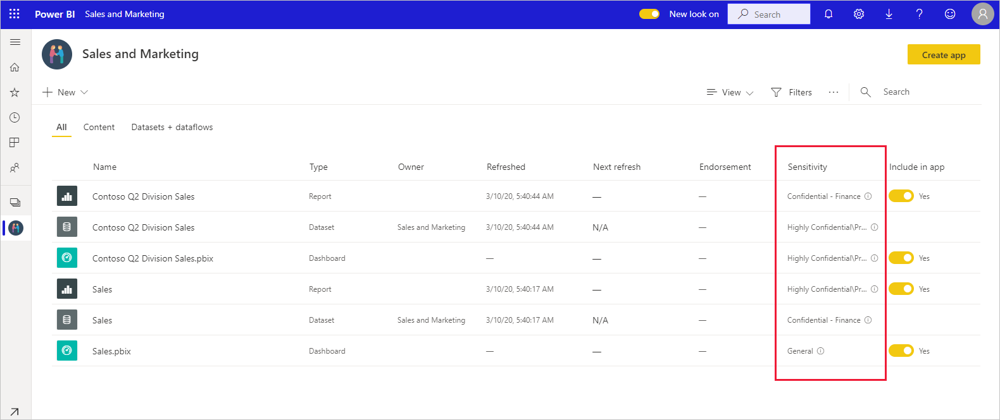
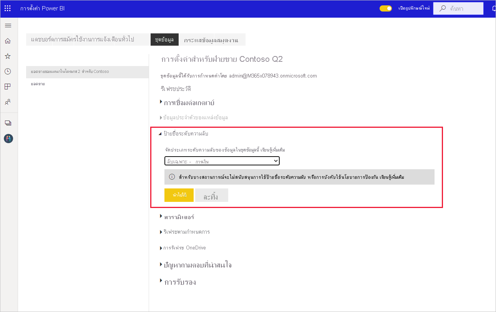
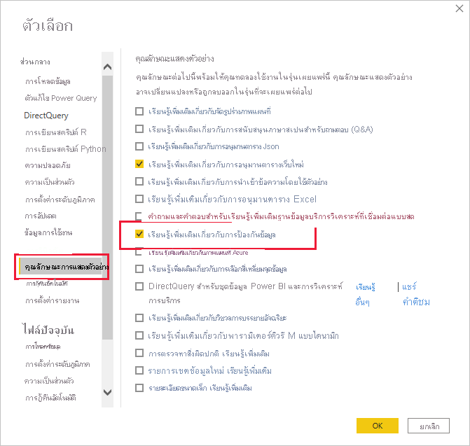
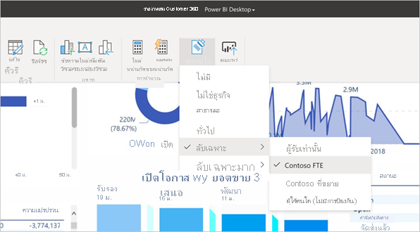
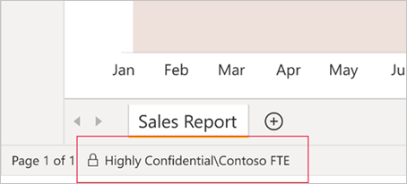

# วิธีการใช้ป้ายชื่อระดับความลับใน Power BI

ป้ายชื่อระดับความลับของ Microsoft Information Protection บนรายงาน แดชบอร์ด ชุดข้อมูล กระแสข้อมูลและไฟล์ .pbix ของคุณสามารถปกป้องเนื้อหาที่ละเอียดอ่อนของคุณจากการเข้าถึงข้อมูลโดยไม่ได้รับอนุญาตและการรั่วไหล การติดป้ายข้อมูลด้วยป้ายชื่อระดับความลับอย่างถูกต้องช่วยให้มั่นใจได้ว่าเฉพาะผู้ที่ได้รับอนุญาตเท่านั้นที่สามารถเข้าถึงข้อมูลของคุณได้ บทความนี้แสดงวิธีการใช้ป้ายชื่อระดับความลับของข้อมูลในบริการ Power BI และใน Power BI Desktop

สำหรับข้อมูลเพิ่มเติมเกี่ยวกับป้ายชื่อระดับความลับใน Power BI โปรดดู [ป้ายชื่อระดับความลับใน Power BI](service-security-sensitivity-label-overview.md)

## ใช้ป้ายชื่อระดับความลับของข้อมูลในบริการ Power BI

ในบริการ Power BI คุณจะสามารถใช้ป้ายชื่อระดับความลับของข้อมูลที่อยู่ในรายงาน แดชบอร์ด ชุดข้อมูล และกระแสข้อมูล

เพื่อให้สามารถใช้ป้ายชื่อระดับความลับของข้อมูลในบริการ Power BI:
* คุณต้องมี [สิทธิการใช้งาน Power BI Pro](./service-admin-purchasing-power-bi-pro.md) และแก้ไขการอนุญาตที่คุณต้องการติดป้ายชื่อ
* ป้ายชื่อระดับความลับของข้อมูลต้องเปิดใช้งานสำหรับองค์กรของคุณ ติดต่อผู้ดูแลระบบ Power BI ของคุณถ้าคุณไม่แน่ใจเกี่ยวกับเรื่องนี้
* คุณต้องเป็นสมาชิกของกลุ่มความปลอดภัยที่มีสิทธิ์ใช้ป้ายชื่อระดับความลับของข้อมูล ตามที่อธิบายไว้ใน [การเปิดใช้งานป้ายชื่อระดับความลับใน Power BI](./service-security-enable-data-sensitivity-labels.md)
* ต้องเป็นไปตาม [ใบอนุญาตใช้งานและข้อกำหนดอื่น ๆ](./service-security-enable-data-sensitivity-labels.md#licensing-and-requirements) ทั้งหมด

เมื่อเปิดใช้งานการป้องกันข้อมูลในผู้เช่าของคุณ ป้ายชื่อระดับความลับจะปรากฏในคอลัมน์ความลับในมุมมองรายการของแดชบอร์ด รายงาน ชุดข้อมูล และกระแสข้อมูล

**เมื่อต้องการนำไปใช้หรือเปลี่ยนป้ายชื่อระดับความลับบนรายงานหรือแดชบอร์ด**
1. คลิก **ตัวเลือกเพิ่มเติม (... )**
1. เลือก **การตั้งค่า**
1. ในบานหน้าต่างด้านการตั้งค่า ให้เลือกป้ายชื่อระดับความลับที่เหมาะสม
1. บันทึกการตั้งค่า

รูปภาพต่อไปนี้อธิบายขั้นตอนเหล่านี้ในรายงาน

**เมื่อต้องการนำไปใช้หรือเปลี่ยนป้ายชื่อระดับความลับบนชุดข้อมูลหรือกระแสข้อมูล**

1. คลิก **ตัวเลือกเพิ่มเติม (... )**
1. เลือก **การตั้งค่า**
1. เลือกแท็บชุดข้อมูลหรือกระแสข้อมูล แล้วแต่ว่าสิ่งใดจะเกี่ยวข้อง
1. ขยายส่วนป้ายชื่อระดับความลับและเลือกป้ายชื่อระดับความลับที่เหมาะสม
1. ใช้การตั้งค่า

สองรูปต่อไปนี้แสดงขั้นตอนเหล่านี้ในชุดข้อมูล

เลือก **ตัวเลือกเพิ่มเติม (...)** จากนั้น **การตั้งค่า**

บนแท็บชุดข้อมูลการตั้งค่า ให้เปิดส่วนป้ายชื่อระดับความลับแล้วเลือกป้ายชื่อระดับความลับที่ต้องการแล้วคลิก **นำไปใช้**

## ใใช้ป้ายชื่อระดับความลับของข้อมูลใน Power BI Desktop (ดูตัวอย่าง)

ในการใช้ป้ายชื่อระดับความลับใน Power BI Desktop:
* คุณต้องมี [สิทธิ์การใช้งาน Power BI Pro](./service-admin-purchasing-power-bi-pro.md)
* ป้ายชื่อระดับความลับของข้อมูลต้องเปิดใช้งานสำหรับองค์กรของคุณ ติดต่อผู้ดูแลระบบ Power BI ของคุณหากคุณไม่แน่ใจเกี่ยวกับเรื่องนี้
* คุณต้องเป็นสมาชิกของกลุ่มความปลอดภัยที่มีสิทธิ์ใช้ป้ายชื่อระดับความลับของข้อมูล ตามที่อธิบายไว้ใน [การเปิดใช้งานป้ายชื่อระดับความลับใน Power BI](./service-security-enable-data-sensitivity-labels.md)
* ต้องเป็นไปตาม [ใบอนุญาตใช้งานและข้อกำหนดอื่น ๆ](./service-security-enable-data-sensitivity-labels.md#licensing-and-requirements) ทั้งหมด
* ต้องเปิดสวิตช์คุณลักษณะการแสดงตัวอย่างการป้องกันข้อมูลใน Power BI Desktop ถ้าคุณเห็นปุ่มระดับความลับในแท็บหน้าแรก คุณลักษณะการแสดงตัวอย่างจะเปิดอยู่ หากคุณไม่เห็นปุ่มให้ไปที่ **ไฟล์> ตัวเลือกและการตั้งค่า> ตัวเลือก> คุณสมบัติการแสดงตัวอย่าง** และทำเครื่องหมายที่ช่องถัดจาก **การปกป้องข้อมูล**

    

    >[!Important]
    >หลังจากเปิดใช้งานคุณลักษณะการแสดงตัวอย่างการปกป้องข้อมูลแล้ว คุณต้องรีสตาร์ทเดสก์ท็อปเพื่อเริ่มต้นด้วยป้ายชื่อระดับความลับ
    >
    >หากเดสก์ท็อปขัดข้องเมื่อคุณรีสตาร์ท อาจเป็นเพราะเครื่องของคุณไม่มีเวอร์ชันไลบรารีรันไทม์ Visual C ++ แบบแจกจ่ายต่อได้ที่จำเป็น หากคุณพบการขัดข้องดังกล่าว ให้ไปที่ [หน้าดาวน์โหลด Microsoft Visual C ++ 2015 Redistributable Update 3](https://www.microsoft.com/download/details.aspx?id=53587) เพื่อดูคำแนะนำเกี่ยวกับวิธีดาวน์โหลดและติดตั้งอัปเดต หลังจากติดตั้งอัปเดตแล้ว ให้ลองเปิดใช้งานเดสก์ท็อปอีกครั้ง

    หากคุณไม่เห็นตัวเลือกการแสดงตัวอย่างการปกป้องข้อมูล คุณลักษณะการแสดงตัวอย่างการปกป้องข้อมูลอาจถูกบล็อกสำหรับองค์กรของคุณ ในกรณีนี้โปรดติดต่อผู้ดูแลระบบ Power BI ของคุณ

* คุณต้องลงชื่อเข้าใช้

ในการใช้ป้ายชื่อระดับความลับกับไฟล์ที่คุณกำลังทำงานอยู่ให้คลิกปุ่มระดับความลับในแท็บหน้าแรกและเลือกป้ายกำกับที่ต้องการจากเมนูที่ปรากฏ

>[!NOTE]
> หากคุณเปิดใช้งานคุณลักษณะป้ายชื่อระดับความลับในคุณลักษณะการแสดงตัวอย่าง แต่ยังไม่เห็นปุ่มระดับความลับอาจบ่งชี้ว่าคุณไม่มีใบอนุญาตให้ใช้งานที่เหมาะสมหรือคุณไม่ได้อยู่ในกลุ่มความปลอดภัยที่มีสิทธิ์ในการใช้ป้ายชื่อระดับความลับตามที่อธิบายไว้ใน [เปิดใช้งานป้ายชื่อระดับความลับใน Power BI](./service-security-enable-data-sensitivity-labels.md)

หลังจากที่คุณใช้ป้ายชื่อแล้วป้ายชื่อจะปรากฏในแถบสถานะ

### ป้ายชื่อระดับความลับเมื่ออัปโหลดหรือดาวน์โหลดไฟล์ .pbix ไปยัง/จากบริการ
* เมื่อคุณเผยแพร่ไฟล์. pbix ไปยังบริการ Power BI จากเดสก์ท็อปหรือเมื่อคุณอัปโหลดไฟล์. pbix ไปยังบริการ Power BI โดยตรงโดยใช้ **รับข้อมูล** ป้ายกำกับชื่อของไฟล์. pbix จะถูกนำไปใช้กับทั้งรายงานและชุดข้อมูลที่สร้างขึ้นในบริการ หากไฟล์. pbix ที่คุณกำลังเผยแพร่หรืออัปโหลดแทนที่แอสเซทที่มีอยู่ (เช่น แอสเซทที่มีชื่อเดียวกับไฟล์. pbix) ป้ายกำกับชื่อของไฟล์. pbix จะเขียนทับป้ายกำกับในแอสเซทเหล่านั้น ถ้าไฟล์ .pbix ไม่ได้รับการติดป้ายชื่อในบริการจะถูกเก็บไว้
* เมื่อใช้ "ดาวน์โหลดเป็น. pbix" ในบริการของ Power BI หากรายงานและชุดข้อมูลที่ดาวน์โหลดทั้งคู่มีป้ายกำกับและป้ายกำกับเหล่านั้นต่างกัน ป้ายกำกับที่จะใช้กับไฟล์. pbix จะมีข้อจำกัด มากกว่าของทั้งสอง

## เอาป้ายชื่อระดับความลับออก

### บริการ
หากต้องการลบป้ายชื่อระดับความลับออกจากรายงาน แดชบอร์ด ชุดข้อมูลหรือกระแสข้อมูลให้ทำตาม [ขั้นตอนเดียวกับที่ใช้สำหรับการใช้ป้ายชื่อในบริการ Power BI](#apply-sensitivity-labels-in-the-power-bi-service) แต่ให้เลือก **(ไม่มี)** เมื่อได้รับแจ้งให้จัดประเภทระดับความลับของข้อมูล

### เดสก์ท็อป
การลบป้ายชื่อระดับความลับออกจากไฟล์. pbix หลังจากที่บันทึกด้วยป้ายชื่อนั้นยังไม่ได้รับการสนับสนุนในเดสก์ท็อป ในกรณีดังกล่าวขอแนะนำให้เผยแพร่ไฟล์ไปยังบริการ Power BI แล้วจากนั้นในบริการเพื่อลบป้ายชื่อออกจากรายงานและชุดข้อมูลที่ตามมา

## ข้อควรพิจารณาและข้อจำกัด

ดู [ป้ายชื่อระดับความลับใน Power BI](service-security-sensitivity-label-overview.md#limitations) สำหรับรายการขีดจำกัดของป้ายชื่อระดับความลับใน Power BI

## ขั้นตอนถัดไป

บทความนี้อธิบายวิธีการใช้งานป้ายชื่อระดับความลับใน Power BI บทความต่อไปนี้แสดงรายละเอียดเพิ่มเติมเกี่ยวกับการป้องกันข้อมูลใน Power BI 

* [ภาพรวมของป้ายชื่อระดับความลับใน Power BI](./service-security-sensitivity-label-overview.md)
* [เปิดใช้งานป้ายชื่อระดับความลับใน Power BI](./service-security-enable-data-sensitivity-labels.md)
* [ใช้ตัวควบคุม Microsoft Cloud App Security ใน Power BI](./service-security-using-microsoft-cloud-app-security-controls.md)