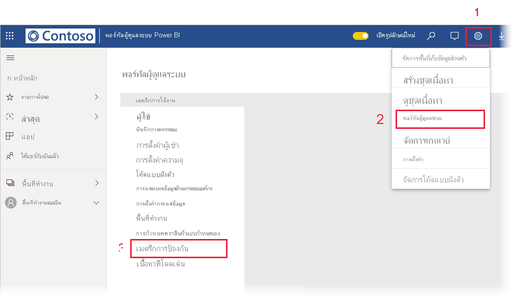

# รายงานเมตริกการป้องกันข้อมูลData protection metrics report

## รายงานเมตริกการป้องกันข้อมูลคืออะไรWhat is the data protection metrics report?
รายงานเมตริกการป้องกันข้อมูลเป็นรายงานเฉพาะที่ [ผู้ดูแลระบบ Power BI](./service-admin-role.md) สามารถใช้เพื่อตรวจสอบและติดตามการใช้งานป้ายชื่อระดับความลับและการเริ่มนำไปใช้ในผู้เช่าของตนThe data protection metrics report is a dedicated report that [Power BI administrators](./service-admin-role.md) can use to  monitor and track sensitivity label usage and adoption in their tenant.

 
คุณลักษณะรายงานประกอบด้วย:The report features:
* แผนภูมิคอลัมน์แบบเรียงซ้อน 100% ที่แสดงการใช้งานป้ายชื่อระดับความลับรายวันในช่วง 7, 30 หรือ 90 วันที่ผ่านมาA 100% stacked column chart that shows daily sensitivity label usage in the tenant for the last 7, 30, or 90 days. แผนภูมินี้ช่วยให้ง่ายต่อการติดตามการใช้งานที่สัมพันธ์กันของชนิดป้ายชื่อที่แตกต่างกันเมื่อเวลาผ่านไปThis chart makes it easy to track the relative usage of the different label types over time.
* แผนภูมิโดนัทที่แสดงสถานะปัจจุบันของการใช้ป้ายชื่อระดับความลับในผู้เช่าสำหรับแดชบอร์ด รายงาน ชุดข้อมูล และกระแสข้อมูลDoughnut charts that show the current state of sensitivity label usage in the tenant for dashboards, reports, datasets, and dataflows.
* ลิงก์ไปยังพอร์ทัล Cloud App Security ที่มีข้อมูลการแจ้งเตือนของ Power BI ผู้ใช้ที่มีความเสี่ยง บันทึกกิจกรรม และข้อมูลอื่น ๆA link to the Cloud App Security portal where Power BI alerts, users-at-risk, activity logs, and other information is available. สำหรับข้อมูลเพิ่มเติม โปรดดู[การใช้ตัวควบคุม Microsoft Cloud App Security ใน Power BI](./service-security-using-microsoft-cloud-app-security-controls.md)For more information, see [Using Microsoft cloud app security controls in Power BI](./service-security-using-microsoft-cloud-app-security-controls.md).

รายงานจะรีเฟรชทุก 24 ชั่วโมงThe report refreshes every 24 hours.

## การดูรายงานเมตริกการป้องกันข้อมูลViewing the data protection metrics report

คุณต้องมี [บทบาทผู้ดูแลระบบ Power BI](./service-admin-role.md) เพื่อเปิดและดูรายงานYou must have a [Power BI administrator role](./service-admin-role.md) to open and view the report.
หากต้องการดูรายงาน ให้ไปที่ **การตั้งค่า > พอร์ทัลผู้ดูแลระบบ** และเลือก **เมตริกการป้องกัน**To view the report, go to **Settings > Admin portal**, and choose **Protection metrics**.

 
 
ในครั้งแรกที่คุณเปิดรายงานเมตริกการป้องกันข้อมูล อาจต้องใช้เวลาสองถึงสามวินาทีในการโหลดThe first time you open the data protection metrics report, it may take a few seconds to load. รายงานและชุดข้อมูลที่มีชื่อว่า **เมตริกการป้องกันข้อมูล (สร้างขึ้นโดยอัตโนมัติ)** จะถูกสร้างขึ้นในสภาพแวดล้อมส่วนตัวของคุณภายใต้ "พื้นที่ทำงานของฉัน"A report and a dataset entitled **Data protection metrics (automatically generated)** will be created in your private environment under "My workspace". เราไม่แนะนำให้ดูรายงานที่นี่ รายงานนี้ไม่ใช่รายงานแบบเต็มรูปแบบWe do not recommend viewing it here - this is not the full-featured report. อย่างไรก็ตาม ให้ดูรายงานในพอร์ทัลผู้ดูแลระบบตามที่อธิบายไว้ข้างต้นRather, view the report in the Admin portal as described above.

> [!CAUTION]
> อย่าเปลี่ยนแปลงรายงานหรือชุดข้อมูลในทางใดทางหนึ่งเนื่องจากรายงานเวอร์ชันใหม่จะถูกนำเสนอเป็นครั้งคราว และการเปลี่ยนแปลงใดๆ ที่คุณทำกับรายงานต้นฉบับจะถูกเขียนทับหากคุณอัปเดตเป็นเวอร์ชันใหม่Do not change the report or dataset in any way, since new versions of the report are rolled out from time to time and any changes you've made to the original report will be overwritten if you update to the new version.

## การอัปเดตรายงานReport updates

จะมีการเผยแพร่เวอร์ชันที่ปรับปรุงของรายงานเมตริกการป้องกันข้อมูลเป็นระยะ ๆImproved versions of the data protection metrics report are released periodically. เมื่อคุณเปิดรายงานถ้ามีเวอร์ชันใหม่พร้อมใช้งาน ระบบจะถามว่าคุณต้องการเปิดเวอร์ชันใหม่หรือไม่When you open the report, if a new version is available you will be asked if you want to open the new version. ถ้าคุณพูดว่า "ใช่" เวอร์ชันใหม่ของรายงานจะโหลดและเขียนทับเวอร์ชันเก่าIf you say "yes", the new version of the report will load and overwrite the old version. การเปลี่ยนแปลงใด ๆ ที่คุณอาจทำกับรายงานเก่าและ/หรือชุดข้อมูลจะสูญหายไปAny changes you might have made to the old report and/or dataset will be lost. คุณสามารถเลือกที่จะไม่เปิดเวอร์ชันใหม่ แต่ในกรณีนี้คุณจะไม่ได้รับประโยชน์จากการปรับปรุงเวอร์ชันใหม่You can choose not to open the new version, but in that case you will not benefit from the new version's improvements. 
## บันทึกย่อและข้อควรพิจารณาNotes and considerations
* เมื่อต้องการสร้างรายงานเมตริกการป้องกันข้อมูลให้สำเร็จ [การป้องกันข้อมูล](./service-security-enable-data-sensitivity-labels.md) ต้องเปิดใช้งานบนผู้เช่าของคุณ และ[ควรจะนำป้ายชื่อระดับความลับไปใช้](./service-security-apply-data-sensitivity-labels.md)In order for the data protection metrics report to be successfully generated, [information protection](./service-security-enable-data-sensitivity-labels.md) must be enabled on your tenant and [sensitivity labels should have been applied](./service-security-apply-data-sensitivity-labels.md). 
* เพื่อเข้าถึงข้อมูล Cloud App Security องค์กรของคุณต้องมี [สิทธิ์การใช้งาน Cloud App Security](./service-security-using-microsoft-cloud-app-security-controls.md#cloud-app-security-licensing) ที่เหมาะสมIn order to access Cloud App Security information, your organization must have the appropriate [Cloud App Security license](./service-security-using-microsoft-cloud-app-security-controls.md#cloud-app-security-licensing).
* ถ้าคุณตัดสินใจที่จะแชร์ข้อมูลจากรายงานเมตริกการป้องกันข้อมูลด้วยผู้ใช้ที่ไม่ใช่ผู้ดูแลระบบ Power BI โปรดตระหนักว่ารายงานนี้ประกอบด้วยข้อมูลที่สำคัญเกี่ยวกับองค์กรของคุณIf you decide to share information from the data protection metrics report with a user who is not a Power BI administrator, be aware that this report contains sensitive information about your organization.
* รายงานเมตริกการป้องกันข้อมูลเป็นรายงานชนิดพิเศษ และไม่แสดงในรายการ "แชร์กับฉัน" "ล่าสุด" และ "รายการโปรด"The data protection metrics report is a special kind of report and does not show up in "Shared with me", "Recents", and "Favorites" lists.
* รายงานเมตริกการป้องกันข้อมูลไม่พร้อมใช้งานสำหรับ [ผู้ใช้ภายนอก (Azure Active Directory ผู้ใช้ที่เป็นผู้เยี่ยมชม B2B)](./service-admin-azure-ad-b2b.md)The data protection metrics report is not available to [external users (Azure Active Directory B2B guest users)](./service-admin-azure-ad-b2b.md).
## ขั้นตอนถัดไปNext steps
* [ป้ายชื่อระดับความลับใน Power BISensitivity labels in Power BI](./service-security-sensitivity-label-overview.md)
* [ใช้ตัวควบคุม Microsoft Cloud App Security ใน Power BIUsing Microsoft cloud app security controls in Power BI](service-security-using-microsoft-cloud-app-security-controls.md)
* [ทำความเข้าใจเกี่ยวกับบทบาทผู้ดูแลระบบบริการของ Power BIUnderstanding the Power BI service administrator role](service-admin-role.md)
* [เปิดใช้งานป้ายชื่อระดับความลับใน Power BIEnable sensitivity labels in Power BI](service-security-enable-data-sensitivity-labels.md)