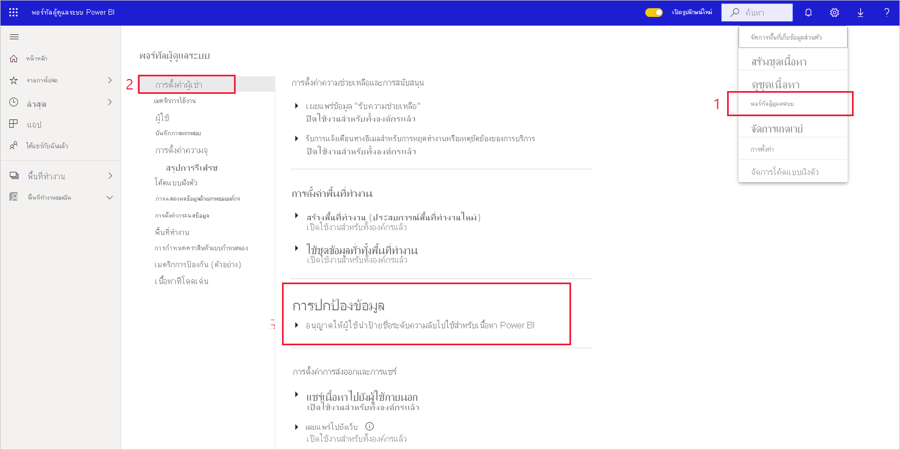
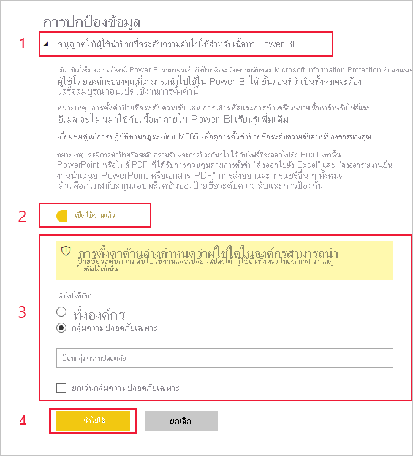

# เปิดใช้งานป้ายชื่อระดับความลับใน Power BI

เพื่อให้มีการใช้ [ป้ายชื่อระดับความลับของ Microsoft Information Protection](/microsoft-365/compliance/sensitivity-labels) ใน Power BI ป้ายชื่อดังกล่าวจะต้องเปิดใช้งานบนผู้เช่า บทความนี้แสดงวิธีการดำเนินการของผู้ดูแลระบบ Power BI ได้อย่างไร สำหรับภาพรวมเกี่ยวกับป้ายชื่อระดับความลับใน Power BI โปรดดู [ป้ายชื่อระดับความลับใน Power BI](service-security-sensitivity-label-overview.md) สำหรับข้อมูลเกี่ยวกับการใช้ป้ายชื่อระดับความลับใน Power BI โปรดดู [การใช้ป้ายชื่อระดับความลับ](./service-security-apply-data-sensitivity-labels.md) 

เมื่อเปิดใช้งานป้ายชื่อระดับความลับ:

* ผู้ใช้และกลุ่มความปลอดภัยที่ระบุในองค์กรสามารถจัดประเภทและ [ใช้ป้ายชื่อระดับความลับ](./service-security-apply-data-sensitivity-labels.md) กับเนื้อหา Power BI ได้ ในบริการของ Power BI จะหมายความว่ารายงาน แดชบอร์ด ชุดข้อมูลและกระแสข้อมูลของพวกเขา ใน Power BI Desktop หมายความว่าไฟล์ .pbix ของพวกเขา
* ในบริการ สมาชิกทุกคนในองค์กรจะสามารถดูป้ายชื่อเหล่านั้นได้ ในเดสก์ท็อป เฉพาะสมาชิกขององค์กรที่มีป้ายชื่อที่เผยแพร่ไปยังพวกเขาเท่านั้นที่จะสามารถดูป้ายชื่อได้

การเปิดใช้งานป้ายชื่อระดับความลับจำเป็นต้องมีสิทธิ์การใช้งาน Azure Information Protection ดู [ใบอนุญาตใช้งานและข้อกำหนด](#licensing-and-requirements) สำหรับรายละเอียด

>[!NOTE]
>ในช่วง 48 ชั่วโมงแรกหลังจากที่ผู้ใช้เลือกใช้คุณลักษณะการแสดงตัวอย่างการปกป้องข้อมูล **ผู้ใช้อาจประสบปัญหากับไฟล์. pbix ที่มีการใช้ป้ายระดับความลับ (เช่น การเผยแพร่. pbix ไปยังบริการการดาวน์โหลด. pbix จากบริการ)** คาดว่าปัญหาดังกล่าวจะได้รับการแก้ไขโดยอัตโนมัติภายใน 48 ชั่วโมง

## การอนุญาตใช้งานและสิ่งที่ต้องการ

* จำเป็นต้องมีใบอนุญาตใช้งานความคุ้มครองข้อมูล Azure Premium P1 หรือ Premium P2 เพื่อใช้หรือดูป้ายระดับความลับของความคุ้มครองข้อมูลของ Microsoft ใน Power BI ความคุ้มครองข้อมูลของ Azure สามารถซื้อได้ทั้งแบบสแตนด์อโลนหรือผ่านชุดการออกใบอนุญาตใช้งานของ Microsoft ดู [การกำหนดราคา Azure Information Protection](https://azure.microsoft.com/pricing/details/information-protection/) สำหรับรายละเอียด

    >[!NOTE]
    > หากองค์กรของคุณใช้ป้ายชื่อระดับความลับของความคุ้มครองข้อมูลของ Azure จำเป็นต้องโยกย้ายไปยังแพลตฟอร์มความคุ้มครองข้อมูลการติดป้ายชื่อแบบรวมของ Microsoft เพื่อให้ใช้ใน Power BI ได้ [เรียนรู้เพิ่มเติมเกี่ยวกับการย้ายป้ายชื่อระดับความลับ](/azure/information-protection/configure-policy-migrate-labels)

* ในการใช้ป้ายกำกับกับเนื้อหาและไฟล์ Power BI ผู้ใช้ต้องมีสิทธิ์การใช้งาน Power BI Pro นอกเหนือจากหนึ่งในสิทธิ์การใช้งาน Azure Information Protection ที่กล่าวถึงข้างต้น

* แอป Office มี [ข้อกำหนดสิทธิ์การใช้งานสำหรับการดูและใช้ป้ายชื่อระดับความลับ]( https://docs.microsoft.com/microsoft-365/compliance/get-started-with-sensitivity-labels#subscription-and-licensing-requirements-for-sensitivity-labels ) ของตัวเอง

* ก่อนเปิดใช้งานป้ายชื่อระดับความลับสำหรับผู้เช่าของคุณ ให้ตรวจสอบให้แน่ใจว่าได้กำหนดและเผยแพร่ให้สำหรับผู้ใช้และกลุ่มที่เกี่ยวข้องแล้ว ดู [สร้างและกำหนดค่าป้ายชื่อระดับความลับและนโยบาย](/microsoft-365/compliance/create-sensitivity-labels) สำหรับรายละเอียด

* การใช้ป้ายชื่อระดับความลับในเดสก์ท็อปต้องใช้เดสก์ท็อปรุ่นเดือนธันวาคมปี 2020 และใหม่กว่า

    >[!NOTE]
    > หากคุณพยายามเปิดไฟล์. pbix ที่มีการป้องกันด้วยเดสก์ท็อปเวอร์ชันก่อนหน้าเดือนธันวาคม 2020 ไฟล์จะล้มเหลวและคุณจะได้รับพร้อมท์ให้อัปเกรดเวอร์ชันเดสก์ท็อปของคุณ

## เปิดใช้งานป้ายชื่อระดับความลับ

ต้องเปิดใช้งานป้ายชื่อระดับความลับในผู้เช่าก่อนจึงจะสามารถใช้ได้ทั้งในบริการและในเดสก์ท็อป ในส่วนนี้จะอธิบายวิธีการเปิดใช้งานในการตั้งค่าผู้เช่า สำหรับข้อควรพิจารณาเพิ่มเติมเกี่ยวกับเดสก์ท็อปให้ดู [การปิดใช้งานป้ายชื่อระดับความลับในเดสก์ท็อปทั่วทั้งองค์กรของคุณ](#disable-sensitivity-labels-in-desktop-across-your-org) ด้านล่าง 

ในการเปิดใช้งานป้ายชื่อระดับความลับบนผู้เช่าให้ไปที่ **พอร์ทัลผู้ดูแลระบบ** ของ Power BI เปิดบานหน้าต่าง **การตั้งค่าผู้เช่า** และค้นหาส่วน **การปกป้องข้อมูล**

ในส่วน **Information Protection** ให้ดำเนินการขั้นตอนต่อไปนี้:
1. เปิด **อนุญาตให้ผู้ใช้นำป้ายชื่อระดับความลับไปใช้สำหรับเนื้อหา Power BI**
1. เปิดใช้งานตัวสลับ
1. กำหนดบุคคลที่สามารถใช้และเปลี่ยนแปลงป้ายชื่อระดับความลับในแอสเซท Power BI ได้ ตามค่าเริ่มต้น ทุกคนในองค์กรของคุณจะสามารถใช้ป้ายชื่อระดับความลับได้ อย่างไรก็ตาม คุณสามารถเลือกที่จะเปิดใช้งานการตั้งค่าป้ายชื่อระดับความลับเฉพาะสำหรับผู้ใช้หรือกลุ่มความปลอดภัยที่เฉพาะเจาะจงได้ เมื่อเลือกทั้งองค์กรหรือกลุ่มความปลอดภัยที่เฉพาะเจาะจง คุณสามารถยกเว้นชุดย่อยของผู้ใช้หรือกลุ่มความปลอดภัยที่เฉพาะเจาะจงได้
   
   * เมื่อมีการเปิดใช้งานป้ายชื่อระดับความลับสำหรับทั้งองค์กร โดยทั่วไปจะมีการยกเว้นกลุ่มความปลอดภัย
   * เมื่อมีการเปิดใช้งานป้ายชื่อระดับความลับเฉพาะสำหรับผู้ใช้หรือกลุ่มความปลอดภัยที่เฉพาะเจาะจง โดยทั่วไปจะมีการยกเว้นผู้ใช้ที่เฉพาะเจาะจง  
    วิธีการนี้จะทำให้สามารถป้องกันไม่ให้ผู้ใช้บางรายนำป้ายชื่อระดับความลับใน Power BI ไปใช้งาน ถึงแม้ว่าพวกเขาจะเป็นสมาชิกของกลุ่มที่มีสิทธิ์ในการทำเช่นนั้นก็ตาม

1. กด **นำไปใช้**

> [!IMPORTANT]
> เฉพาะผู้ใช้ Power BI Pro เท่านั้นที่มีสิทธิ์ *สร้าง* และ *แก้ไข* ในแอสเซท และผู้ที่เป็นส่วนหนึ่งของกลุ่มความปลอดภัยที่เกี่ยวข้องที่ตั้งค่าในส่วนนี้จะสามารถตั้งค่าและแก้ไขป้ายชื่อระดับความลับได้ ผู้ใช้ที่ไม่ได้เป็นส่วนหนึ่งของกลุ่มนี้จะไม่สามารถตั้งค่า หรือแก้ไขป้ายชื่อได้  

## ปิดใช้งานป้ายชื่อระดับความลับในเดสก์ท็อปทั่วทั้งองค์กรของคุณ

สำหรับองค์กรที่ต้องการตรวจสอบให้แน่ใจว่าไฟล์. pbix **ไม่** ทำงานกับป้ายชื่อระดับความลับ ผู้ดูแลระบบ Power BI สามารถสร้างนโยบายกลุ่มที่ทำให้ Power BI บล็อกผู้ใช้จากการจำแนกและปกป้องไฟล์. pbix หรือเปิดไฟล์ ที่มีการป้องกันแล้ว ในการสร้างนโยบายดังกล่าว:

1. เปิด [ตัวแก้ไขการลงทะเบียน](https://support.microsoft.com/windows/how-to-open-registry-editor-in-windows-10-deab38e6-91d6-e0aa-4b7c-8878d9e07b11)

1. ค้นหาคีย์ **HKEY_CURRENT_USER\SOFTWARE\Policies\Microsoft\Microsoft Power BI Desktop**

1. ค้นหา valueName **EnableInformationProtection** และตั้งค่าเป็น **เท็จ**

ดู [ภาพรวมป้ายชื่อระดับความลับ](./service-security-sensitivity-label-overview.md#limitations) สำหรับข้อจำกัด และข้อควรพิจารณาเพิ่มเติมที่เกี่ยวข้องกับการใช้ป้ายชื่อระดับความลับใน Power BI Desktop

## การแก้ไขปัญหา

Power BI ใช้ป้ายชื่อระดับความลับ Microsoft Information Protection ดังนั้นถ้าคุณพบข้อผิดพลาดเมื่อพยายามเปิดใช้งานป้ายชื่อระดับความลับ อาจเป็นเพราะหนึ่งในสาเหตุต่อไปนี้:

* คุณไม่มี[สิทธิ์การใช้งาน](#licensing-and-requirements) Azure Information Protection
* ป้ายชื่อระดับความลับยังไม่ได้รับการ [ย้ายข้อมูล](#enable-sensitivity-labels) ไปยังเวอร์ชันความคุ้มครองข้อมูลของ Microsoft ที่รองรับโดย Power BI
* ไม่มีป้ายชื่อระดับความลับความคุ้มครองข้อมูลของ Microsoft ถูก [กำหนดไว้ในองค์กร](#enable-sensitivity-labels)

## ข้อควรพิจารณาและข้อจำกัด

ดู [ป้ายชื่อระดับความลับใน Power BI](service-security-sensitivity-label-overview.md#limitations) สำหรับรายการขีดจำกัดของป้ายชื่อระดับความลับใน Power BI

## ขั้นตอนถัดไป

บทความนี้อธิบายวิธีการเปิดใช้งานป้ายชื่อระดับความลับใน Power BI บทความต่อไปนี้แสดงรายละเอียดเพิ่มเติมเกี่ยวกับการป้องกันข้อมูลใน Power BI 

* [ภาพรวมของป้ายชื่อระดับความลับใน Power BI](service-security-sensitivity-label-overview.md)
* [วิธีการใช้ป้ายชื่อระดับความลับใน Power BI](./service-security-apply-data-sensitivity-labels.md)
* [ใช้ตัวควบคุม Microsoft Cloud App Security ใน Power BI](service-security-using-microsoft-cloud-app-security-controls.md)
* [รายงานเมตริกการป้องกัน](service-security-data-protection-metrics-report.md)