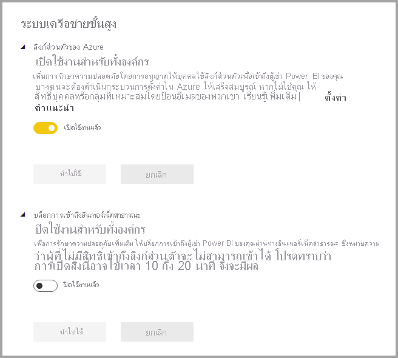
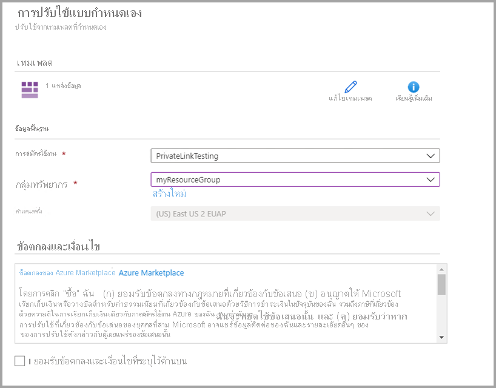
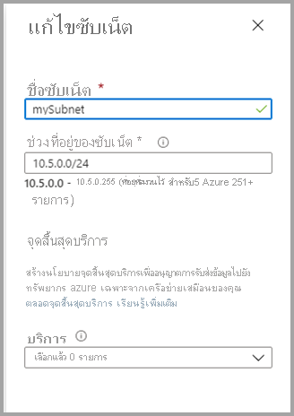
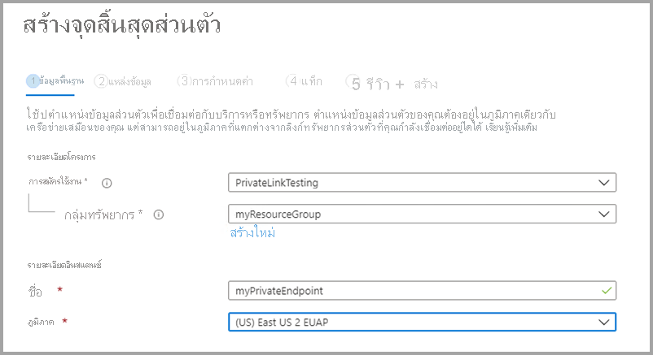
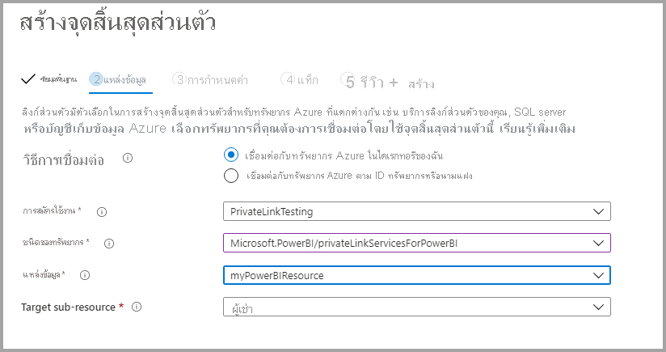
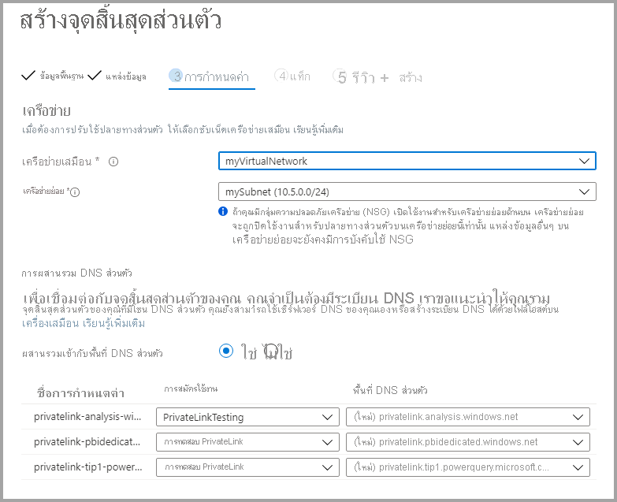

# <a name="private-links-for-accessing-power-bi"></a>ใช้ลิงก์ส่วนตัวสำหรับการเข้าใช้งาน Power BI

Azure Networking มีคุณลักษณะ Azure Private Links ที่ช่วยให้ Power BI สามารถให้การเข้าถึงที่ปลอดภัยผ่านปลายทาง Azure Networking Private ด้วยการเชื่อมโยงส่วนตัว Azure และจุดสิ้นสุดส่วนตัว การรับส่งข้อมูลจะถูกส่งแบบส่วนตัวโดยใช้โครงสร้างพื้นฐานเครือข่ายหลักของ Microsoft และทำให้ข้อมูลไม่ได้เป็นการเคลื่อนย้ายผ่านอินเทอร์เน็ต 

การเชื่อมโยงส่วนตัวให้แน่ใจว่าผู้ใช้ Power BI ใช้โครงสร้างเครือข่ายส่วนตัวของ Microsoft เมื่อไปยังแหล่งทรัพยากรในบริการของ Power BI

คุณสามารถเรียนรู้เพิ่มเติมเกี่ยวกับ [การเชื่อมโยงส่วนตัวของ Azure](https://azure.microsoft.com/services/private-link/)

## <a name="understanding-private-links"></a>การทำความเข้าใจการเชื่อมโยงส่วนตัว

การเชื่อมโยงส่วนตัวจะรับประกันว่าปริมาณการใช้งานจะ *ไปยัง* วัตถุ Power BI ขององค์กรของคุณ (เช่นรายงานหรือพื้นที่ทำงาน) จะเป็นไปตามเส้นทางเครือข่ายการเชื่อมโยงส่วนตัวขององค์กรของคุณเสมอ การรับส่งข้อมูลของผู้ใช้ไปยังวัตถุ Power BI ของคุณจะต้องมาจากลิงก์ส่วนตัวที่สร้างขึ้นและคุณสามารถกำหนดค่า Power BI เพื่อปฏิเสธคำขอทั้งหมดที่ไม่ได้มาจากเส้นทางเครือข่ายที่กำหนดไว้ 

การเชื่อมโยงส่วนตัว *ไม่* รับประกันว่าปริมาณการใช้งานจาก Power BI ไปยังแหล่งข้อมูลภายนอกของคุณไม่ว่าจะอยู่ในระบบคลาวด์หรือภายในองค์กรจะมีความปลอดภัย คุณต้องกำหนดค่ากฎไฟร์วอลล์และเครือข่ายเสมือนเพื่อรักษาความปลอดภัยแหล่งข้อมูลของคุณเพิ่มเติม 

### <a name="power-bi-and-private-links-integration"></a>การรวม Power BI และการเชื่อมโยงส่วนตัว

จุดสิ้นสุดส่วนตัวของ Azure สำหรับ Power BI คืออินเทอร์เฟซเครือข่ายที่เชื่อมต่อคุณอย่างเป็นส่วนตัวและปลอดภัยไปยังบริการของ Power BI โดยใช้การเชื่อมโยงส่วนตัวของ Azure   

การรวมจุดสิ้นสุดส่วนตัวจะเปิดใช้งานแพลตฟอร์มที่เป็นบริการของบริการ (PaaS) ที่จะปรับใช้และเข้าถึงได้จากเครือข่ายเสมือนและภายในองค์กรของลูกค้าในขณะที่บริการยังคงทำงานอยู่ภายนอกเครือข่ายของลูกค้า จุดสิ้นสุดส่วนตัวเป็นเทคโนโลยีทางเดียวที่ช่วยให้ไคลเอ็นต์เริ่มต้นการเชื่อมต่อไปยังบริการที่ระบุแต่ไม่อนุญาตให้บริการเริ่มต้นการเชื่อมต่อไปยังเครือข่ายลูกค้า รูปแบบการรวมจุดสิ้นสุดส่วนตัวนี้มีการแยกการจัดการเนื่องจากบริการสามารถดำเนินการได้อย่างอิสระจากการกำหนดค่านโยบายเครือข่ายของลูกค้า สำหรับบริการแบบหลายผู้เช่า โมเดลจุดสิ้นสุดส่วนตัวนี้แสดงการระบุการเชื่อมโยงเพื่อป้องกันการเข้าถึงทรัพยากรของลูกค้าอื่น ๆ ที่โฮสต์ภายในบริการเดียวกัน เมื่อใช้จุดสิ้นสุดส่วนตัวจะสามารถเข้าถึงได้เฉพาะชุดที่จำกัดของทรัพยากรบริการ PaaS อื่น ๆ จากบริการโดยใช้การรวม  

บริการของ Power BI ใช้จุดสิ้นสุดส่วนตัว และไม่ใช้จุดสิ้นสุดบริการ  

การใช้ลิงก์ส่วนตัวกับ Power BI ให้ประโยชน์ดังต่อไปนี้:

1. การเชื่อมโยงส่วนตัวทำให้แน่ใจว่าปริมาณการใช้งานจะไหลผ่านแกนหลักสำคัญของ Azure ไปยังจุดสิ้นสุดส่วนตัวสำหรับแหล่งข้อมูล Azure cloud-based 

2. การแยกปริมาณการใช้งานเครือข่ายจากโครงสร้างพื้นฐานที่ไม่ใช่ Azure เช่นการเข้าถึงภายในองค์กรจะต้องให้ลูกค้าใช้ ExpressRoute หรือกำหนดค่าเครือข่ายส่วนตัวเสมือน (VPN)  

## <a name="using-secure-private-links-to-access-power-bi"></a>การใช้ลิงก์ส่วนตัวที่ปลอดภัยเพื่อเข้าถึง Power BI

ใน Power BI คุณสามารถกำหนดค่าและใช้จุดปลายทางที่ช่วยให้องค์กรของคุณสามารถเข้าใช้งาน Power BI แบบส่วนตัวได้ ในการกำหนดค่าลิงก์ส่วนตัว คุณจะต้องเป็นผู้ดูแลระบบ Power BI และมีสิทธิ์ใน Azure เพื่อสร้างและกำหนดค่าทรัพยากร เช่น เครื่องเสมือน (VM) และเครือข่ายเสมือน (V-Net) 

ขั้นตอนที่จะช่วยให้คุณสามารถเข้าใช้งาน Power BI ได้อย่างปลอดภัยจากลิงก์ส่วนตัว มีดังต่อไปนี้:

1. [เปิดใช้งานลิงก์ส่วนตัวสำหรับ Power BI](#enable-private-links-for-power-bi)
2. [สร้างทรัพยากร Power BI ในพอร์ทัล Azure](#create-a-power-bi-resource-in-the-azure-portal)
3. [สร้างเครือข่ายเสมือน](#create-a-virtual-network)
4. [สร้างเครื่องเสมือน (VM)](#create-a-virtual-machine-vm)
5. [สร้างจุดปลายทางส่วนตัว](#create-a-private-endpoint)
6. [เชื่อมต่อเข้ากับ VM โดยใช้เดสก์ท็อประยะไกล (RDP)](#connect-to-a-vm-using-remote-desktop-rdp)
7. [เข้าใข้งาน Power BI แบบส่วนตัวจากเครื่องเสมือน](#access-power-bi-privately-from-the-vm)
8. [ปิดการเข้าใช้งาน Power BI แบบสาธารณะ](#disable-public-access-for-power-bi)

ส่วนต่อไปนี้จะให้ข้อมูลเพิ่มเติมของแต่ละขั้นตอน

## <a name="enable-private-links-for-power-bi"></a>เปิดใช้งานลิงก์ส่วนตัวสำหรับ Power BI

หากต้องการเริ่มต้นใช้งาน ให้เข้าสู่ระบบ Power BI ที่ app.powerbi.com ในญานะผู้ดูแลระบบและไปที่พอร์ทัลผู้ดูแล เลือก **การตั้งค่าผู้เช่า** แล้วเลื่อนไปที่ **เครือข่ายขั้นสูง** จากนั้นสลับปุ่มตัวเลือกเพื่อเปิด **ลิงก์ Azure ส่วนตัว** ดังที่แสดงในรูปต่อไปนี้ 

การกำหนดค่าลิงก์ส่วนตัวสำหรับผู้เช่าของคุณจะใช้เวลาประมาณ 15 นาที ซึ่งรวมถึงการกำหนดค่า FQDN ที่แยกต่างหากสำหรับผู้เช่าเพื่อการสื่อสารกับบริการ Power BI แบบส่วนตัว



เมื่อดำเนินการเสร็จสิ้นแล้ว คุณสามารถไปยังขั้นตอนถัดไปได้

## <a name="create-a-power-bi-resource-in-the-azure-portal"></a>สร้างทรัพยากร Power BI ในพอร์ทัล Azure

จากนั้น ลงชื่อเข้าใช้ [พอร์ทัล Azure](https://portal.azure.com) แล้วใช้ **เทมเพลต Azure** เพื่อสร้างทรัพยากร Power BI เปลี่ยนพารามิเตอร์ในตัวอย่างเทมเพลต ARM ที่แสดงในตารางต่อไปนี้เพื่อสร้างทรัพยากร Power BI


|**พารามิเตอร์**  |**ค่า**  |
|---------|---------|
|```<resource-name>```    | myPowerBIResource         |
|```<tenant-object-id>```     | 52d40f65-ad6d-48c3-906f-1ccf598612d4         |

สร้างเทมเพลต ARM 

```
{
  "$schema": "http://schema.management.azure.com/schemas/2015-01-01/deploymentTemplate.json#",
  "contentVersion": "1.0.0.0",
  "parameters": {},
  "resources": [
      {
          "type":"Microsoft.PowerBI/privateLinkServicesForPowerBI",
          "apiVersion": "2020-06-01",
          "name" : "<resource-name>",
          "location": "global",
          "properties" : 
          {
               "tenantId": "<tenant-object-id>"
          }
      }
  ]
}
```

ในกล่องโต้ตอบที่ปรากฏขึ้น เลือกกล่องทำเครื่องหมายเพื่อยอมรับข้อกำหนดและเงื่อนไข จากนั้นเลือก **ซื้อ**




## <a name="create-a-virtual-network"></a>สร้างเครือข่ายเสมือน

ขั้นตอนถัดไปคือการสร้างเครือข่ายเสมือนและเครือข่ายย่อย เปลี่ยนพารามิเตอร์ตัวอย่างในตารางด้านล่างตามค่าที่คุณต้องการเพื่อสร้างเครือข่ายเสมือนและเครือข่ายย่อย

| พารามิเตอร์ |   ค่า| 
|---------|---------|
| ```<resource-group-name>```   | myResourceGroup |
| ```<virtual-network-name>```  | myVirtualNetwork |
| ```<region-name>```   | สหรัฐอเมริกาตอนกลาง  |
| ```<IPv4-address-space>```    | 10.5.0.0/16 |
| ```<subnet-name>```   | mySubnet |
| ```<subnet-address-range>```  | 10.5.0.0/24 |

1. ที่ด้านซ้ายบนของหน้าจอ เลือก **สร้างทรัพยากร > เครือข่าย > เครือข่ายเสมือน** หรือทำการค้นหา **เครือข่ายเสมือน** ในกล่องค้นหา
2. ใน **สร้างเครือข่ายเสมือน** ให้ป้อนหรือเลือกข้อมูลต่อไปนี้ในแท็บ **ข้อมูลพื้นฐาน**:

    |ตั้งค่า | ค่า |
    |-------------------|---------|
    |**รายละเอียดโครงการ**|
    |การสมัครใช้งาน | เลือกการสมัครใช้งาน Azure ของคุณ |
    |กลุ่มทรัพยากร |   เลือก **สร้างใหม่** แลัวป้อน ```<resource-group-name>``` จากนั้นเลือก **ตกลง** หรือเลือก ```<resource-group-name>``` ที่มีอยู่ตามพารามิเตอร์ |
    |**รายละเอียดอินสแตนซ์** |
    | ชื่อ  | ป้อน ```<virtual-network-name>``` |
    |Region | เลือก ```<region-name>``` |
    
    รูปภาพต่อไปนี้คือภาพสาธิตของแท็บ **พื้นฐาน**
    
    


3. ถัดไป เลือกแท็บ **ที่อยู่ IP** หรือเลือก **ถัดไป: ปุ่มที่อยู่ IP**  ที่ด้านล่างของแบบฟอร์ม ในแท็บ IP แอดเดรส ให้ป้อนข้อมูลต่อไปนี้:

    |ตั้งค่า | ค่า |
    |-------------------|---------|
    |พื้นที่ที่อยู่ IPv4 |ป้อน ```<IPv4-address-space>``` |
    
    
    

4. ใน **ชื่อเครือข่ายย่อย** เลือกคำว่า *ค่าเริ่มต้น* และใน **แก้ไขเครือข่ายย่อย** ให้ป้อนข้อมูลต่อไปนี้:

    |ตั้งค่า | ค่า |
    |-------------------|---------|
    | ชื่อเครือข่ายย่อย |ป้อน ```<subnet-name>``` |
    | ป้อนช่วงที่อยู่เครือข่ายย่อย | ป้อน ```<subnet-address-range>``` |
    
    
    

5. จากนั้น เลือก **บันทึก** แล้วเลือกแท็บ **การตรวจสอบ + สร้าง** หรือเลือกปุ่ม **การตรวจสอบ + สร้าง** 

6. แล้ว เลือก **สร้าง**

เมื่อคุณดำเนินขั้นตอนเหล่านี้เรียบร้อยแล้ว คุณจะสามารถสร้างเครื่องเสมือน (VM) ตามที่จะอธิบายในส่วนถัดไปได้

## <a name="create-a-virtual-machine-vm"></a>สร้างเครื่องเสมือน (VM)

ขั้นตอนถัดไปคือการสร้างเครือข่ายเสมือนและเครือข่ายย่อย เพื่อให้เป็นโฮสต์ของเครื่องเสมือน (VM)

1. ที่ด้านซ้ายบนของหน้าจอพอร์ทัล Azure ของคุณ เลือก **สร้างทรัพยากร > คำนวณ > เครื่องเสมือน**

2. ใน **สร้างเครื่องเสมือน - พื้นฐาน** ให้ป้อนหรือเลือกข้อมูลต่อไปนี้ใน:

    |ตั้งค่า | ค่า |
    |-------------------|---------|
    |**รายละเอียดโครงการ**||
    |การสมัครใช้งาน | เลือกการสมัครใช้งาน Azure ของคุณ |
    |กลุ่มทรัพยากร |   เลือก **myResourceGroup** ที่คุณสร้างขึ้นในส่วนก่อนหน้า |
    |**รายละเอียดอินสแตนซ์** ||
    |ชื่อ | ป้อน **myVm** |
    |Region | เลือก **สหรัฐอเมริกาตอนกลาง** |
    |ตัวเลือกที่มีให้เลือก| ปล่อยค่าเริ่มต้น **ไม่จำเป็นต้องมีการสำรองโครงสร้างพื้นฐาน** เอาไว้ |
    |รูปภาพ | เลือก **Windows 10 Pro** |
    |ขนาด | ปล่อยค่าเริ่มต้นไว้เป็น **Standard DS1 v2** |
    |บัญชีผู้ดูแลระบบ ||
    |ชื่อผู้ใช้ |ป้อนชื่อผู้ใช้ตามที่คุณต้องการ |
    |รหัสผ่าน | ป้อนรหัสผ่านที่คุณต้องการ รหัสผ่านต้องมีความยาวอย่างน้อย 12 อักขระและตรงตาม[ข้อกำหนดความยากง่ายของรหัสผ่านที่กำหนดไว้](/azure/virtual-machines/windows/faq#what-are-the-password-requirements-when-creating-a-vm) |
    |ยืนยันรหัสผ่าน | ป้อนรหัสผ่านใหม่อีกครั้ง |
    |กฎของพอร์ตขาเข้า ||
    |พอร์ตขาเข้าสาธารณะ | ปล่อยค่าเริ่มต้นไว้เป็น **ไม่มี** |
    |ประหยัดเงิน ||
    |มีสิทธิ์การใช้งาน Windows อยู่แล้วใช่หรือไม่ |  ปล่อยค่าเริ่มต้นไว้เป็น **ไม่มี** |

3. จากนั้นเลือก **ถัดไป: ดิสก์**
4. ใน **สร้างเครื่องเสมือน-ดิสก์** ให้ปล่อยค่าเริ่มต้นไว้เช่นเดิม แล้วเลือก **ถัดไป: เครือข่าย**
5. ใน **สร้างเครื่องเสมือน - เครือข่าย** ให้ป้อนหรือเลือกข้อมูลต่อไปนี้:

    |ตั้งค่า | ค่า |
    |-------------------|---------|
    |เครือข่ายเสมือน|   ปล่อยค่าเริ่มต้น **MyVirtualNetwork** เอาไว้|
    |พื้นที่ที่อยู่| ปล่อยให้ค่าเริ่มต้นเป็น **10.5.0.0/24**|
    |เครือข่ายย่อย |ปล่อยให้ค่าเริ่มต้นเป็น **mySubnet (10.5.0.0/24)**|
    |IP สาธารณะ| ปล่อยค่าเริ่มต้นไว้เป็น **(new) myVm-ip**|
    |พอร์ตขาเข้าสาธารณะ|  เลือก ** อนุญาตรายการที่เลือกไว้ **|
    |เลือกพอร์ตขาเข้าสาธารณะ|  เลือก **RDP**|

6. เลือก **ตรวจสอบ + สร้าง** คุณจะไปที่หน้า **ตรวจสอบ + สร้าง** ที่ Azure จะทำการตรวจสอบการกำหนดค่าของคุณ
7. เมื่อคุณเห็นข้อความ **ผ่านการตรวจสอบแล้ว** ให้เลือก **สร้าง**


## <a name="create-a-private-endpoint"></a>สร้างจุดปลายทางส่วนตัว

ขั้นตอนถัดไปคือการสร้างจุดปลายทางส่วนตัวสำหรับ Power BI ที่ได้อธิบายไว้ในส่วนนี้

1. ทางด้านซ้ายบนของหน้าจอพอร์ทัล Azure **สร้างทรัพยากร > เครือข่าย > ศูนย์ลิงก์ส่วนตัว (ตัวอย่าง)**
2. ใน **ศูนย์ลิงก์ส่วนตัว-ภาพรวม** บนตัวเลือกเพื่อ **สร้างลิงก์ส่วนตัวไปที่การบริการ** เลือก **สร้างปลายทางส่วนตัว**
3. ใน **สร้างปลายทางส่วนตัว (ตัวอย่าง) - พื้นฐาน** ให้ป้อนหรือเลือกข้อมูลต่อไปนี้:

    |ตั้งค่า | ค่า |
    |-------------------|---------|
    |**รายละเอียดโครงการ** ||
    |การสมัครใช้งาน|  เลือกการสมัครใช้งาน Azure ของคุณ|
    |กลุ่มทรัพยากร|    เลือก **myResourceGroup** คุณได้สร้างรายการนี้ไว้ในส่วนก่อนหน้าแล้ว|
    |**รายละเอียดอินสแตนซ์** ||
    |ชื่อ|  ป้อน *myPrivateEndpoint* ถ้ามีการใช้ชื่อนี้ไปแล้ว ให้สร้างชื่ออื่นที่ไม่ซ้ำกัน|
    |Region|    เลือก **สหรัฐอเมริกาตอนกลาง**|
    
    รูปภาพต่อไปนี้แสดงให้เห็นภาพหน้าต่าง **สร้างจุดปลายทางส่วนตัว - พื้นฐาน**
    
    

4. หลังจากที่กรอกข้อมูลเสร็จสมบูรณ์แล้ว ให้เลือก **ถัดไป: ทรัพยากร** และในหน้า **สร้างปลายทางส่วนตัว - พื้นฐาน** ให้ป้อนหรือเลือกข้อมูลต่อไปนี้:

    |ตั้งค่า | ค่า |
    |-------------------|---------|
    |วิธีการเชื่อมต่อ| เลือกเชื่อมต่อกับทรัพยากร Azure ในไดเรกทอรีของฉัน|
    |การสมัครใช้งาน|  เลือกการสมัครใช้งานของคุณ|
    |ชนิดของทรัพยากร| เลือก **Microsoft.PowerBI/privateLinkServicesForPowerBI** |
    |ทรัพยากร|  myPowerBIResource|
    |ทรัพยากรย่อยเป้าหมาย|   ผู้เช่า|
    
    รูปภาพต่อไปนี้แสดงให้เห็นภาพหน้าต่าง **สร้างจุดปลายทางส่วนตัว - ทรัพยากร**
    
    

5. หลังจากที่กรอกข้อมูลเรียบร้อยแล้ว ให้เลือก **ถัดไป: การกำหนดค่า** และในหน้า **สร้างปลายทางส่วนตัว (ตัวอย่าง) - การกำหนดค่า** ให้ป้อนหรือเลือกข้อมูลต่อไปนี้:

    |ตั้งค่า | ค่า |
    |-------------------|---------|
    |**เครือข่าย** ||
    |เครือข่ายเสมือน|   เลือก *myVirtualNetwork* |
    |เครือข่ายย่อย |เลือก *mySubnet* |
    |**การผสานรวม DNS ส่วนตัว** ||
    |ผสานรวมเข้ากับพื้นที่ DNS ส่วนตัว|   เลือก **ใช่** |
    |พื้นที่ DNS ส่วนตัว   |เลือก <br> *(New)privatelink.analysis.windows.net* <br> *(New)privatelink.pbidedicated.windows.net* <br> *(New)privatelink.tip1.powerquery.microsoft.com* |
    
    รูปภาพต่อไปนี้แสดงให้เห็นภาพหน้าต่าง **สร้างจุดปลายทางส่วนตัว - การกำหนดค่า**
    
    
    
    จากนั้นเลือก **ตรวจสอบ + สร้าง** ที่แสดงหน้า **ตรวจสอบ + สร้าง** ซึ่ง Azure จะทำการตรวจสอบการกำหนดค่าของคุณ เมื่อคุณเห็นข้อความ **ผ่านการตรวจสอบแล้ว** ให้เลือก **สร้าง**

## <a name="connect-to-a-vm-using-remote-desktop-rdp"></a>เชื่อมต่อเข้ากับ VM โดยใช้เดสก์ท็อประยะไกล (RDP)

หลังจากที่คุณได้สร้างเครื่องเสมือนของคุณแล้ว ซึ่งมีชื่อว่า **myVM** ให้เชื่อมต่อเครื่องเสมือนนั้นผ่านอินเทอร์เน็ตโดยใช้ขั้นตอนต่อไปนี้:

1. ในแถบการค้นหาของพอร์ทัล ให้ป้อนคำว่า *myVm*
2. เลือกปุ่ม **เชื่อมต่อ** เมื่อคุณเลือกปุ่ม **เชื่อมต่อ** หน้า **เชื่อมต่อกับเครื่องเสมือน** จะเปิดขึ้นมา
3. เลือก **ดาวน์โหลดไฟล์ RDP** Azure สร้างไฟล์โพรโทคอลการใช้เดสก์ท็อประยะไกล (.rdp) แล้วดาวน์โหลดไปไว้ที่เครื่องคอมพิวเตอร์ของคุณ
4. เปิดไฟล์ .rdp ที่ดาวน์โหลดมา
5. หากมีกล่องโต้ตอบแสดงขึ้นมา ให้เลือก **เชื่อมต่อ**
6. ป้อนชื่อผู้ใช้และรหัสผ่านที่คุณกำหนดไว้เมื่อทำการสร้าง VM ในขั้นตอนก่อนหน้า
7. เลือก **ตกลง**
8. คุณอาจได้รับการแจ้งเตือนเกี่ยวกับใบรับรองในระหว่างกระบวนการลงชื่อเข้าใช้ได้ ถ้าคุณได้รับการแจ้งเตือนเกี่ยวกับใบรับรอง ให้เลือก **ใช่** หรือ **ดำเนินการต่อ**

## <a name="access-power-bi-privately-from-the-vm"></a>เข้าใข้งาน Power BI แบบส่วนตัวจากเครื่องเสมือน

ขั้นตอนถัดไปคือการเข้าใช้งาน Power BI แบบส่วนตัวจากเครื่องเสมือนที่คุณได้สร้างไว้ในขั้นตอนก่อนหน้า โดยใช้ขั้นตอนต่อไปนี้: 

1. ในเดสก์ท็อประยะไกลของ myVM ให้เปิด PowerShell
2. ป้อน nslookup 52d40f65ad6d48c3906f1ccf598612d4-api.privatelink.analysis.windows.net.
3. คุณจะได้รับข้อความที่คล้ายกับตัวอย่างนี้:

    ```
    Server:  UnKnown
    Address:  168.63.129.16
    
    Non-authoritative answer:
    Name:    52d40f65ad6d48c3906f1ccf598612d4-api.privatelink.analysis.windows.net
    Address:  10.5.0.4
    ```

4. เปิดเบราว์เซอร์แล้วไปที่ app.powerbi.com เพื่อเข้าใช้งาน Power BI แบบส่วนตัว

## <a name="disable-public-access-for-power-bi"></a>ปิดการเข้าใช้งาน Power BI แบบสาธารณะ

และขั้นตอนสุดท้ายคือ คุณต้องปิดการเข้าใช้งาน Power BI แบบสาธารณะ 

เข้าสู่ระบบ app.powerbi.com ในฐานะผู้ดูแลระบบ แล้วไปที่ **พอร์ทัลผู้ดูแล** เลือก **การตั้งค่าผู้เช่า** แล้วเลื่อนไปที่ส่วน **เครือข่ายขั้นสูง** เปิดปุ่มในส่วนของ **บล็อกการเข้าถึงอินเทอร์เน็ตสาธารณะ** ดังที่แสดงในรูปต่อไปนี้ ซึ่งจะใช้เวลาประมาณ 15 นาทีในการปิดใช้งานการเข้าถึง Power BI ขององค์กรของคุณจากอินเทอร์เน็ตสาธารณะ

เพียงเท่านี้ก็เรียบร้อย โดยหลังจากที่คุณได้ปฏิบัติตามขั้นตอนเหล่านี้แล้ว Power BI สำหรับองค์กรของคุณจะสามารถเข้าถึงได้จากลิงก์ส่วนตัวเท่านั้น และไม่สามารถเข้าถึงได้จากอินเทอร์เน็ตสาธารณะ 

## <a name="considerations-and-limitations"></a>ข้อควรพิจารณาและข้อจำกัด

ทว่า มีข้อควรพิจารณาบางประการที่คุณควรคำนึงถึงเมื่อทำงานกับลิงก์ส่วนตัวใน Power BI:

* การใช้รูปภาพหรือธีมภายนอกใด ๆ ไม่พร้อมใช้งานเมื่อใช้สภาพแวดล้อมการเชื่อมโยงส่วนตัว
* หากปิดใช้งานการเข้าถึงอินเทอร์เน็ต และหากชุดข้อมูลหรือกระแสข้อมูลกำลังเชื่อมต่อกับชุดข้อมูลหรือกระแสข้อมูล Power BI เป็นแหล่งข้อมูล การเชื่อมต่อจะล้มเหลว
* เมตริกการใช้งานจะ *ไม่* ทำงานเมื่อเปิดใช้งานการเชื่อมโยงส่วนตัว
* ระบบไม่รองรับการเผยแพร่ไปยังเว็บ (และแสดงเป็นสีเทา) เมื่อคุณเปิดใช้งาน **บล็อกการเข้าถึงอินเทอร์เน็ตสาธารณะ** ใน Power BI


## <a name="next-steps"></a>ขั้นตอนถัดไป

- [การดูแล Power BI ในองค์กรของคุณ](service-admin-administering-power-bi-in-your-organization.md)  
- [ทำความเข้าใจเกี่ยวกับบทบาทผู้ดูแลระบบ Power BI](service-admin-role.md)  
- [ตรวจสอบ Power BI ในองค์กรของคุณ](service-admin-auditing.md)  

มีคำถามเพิ่มเติมหรือไม่ [ลองถามชุมชน Power BI](https://community.powerbi.com/)
